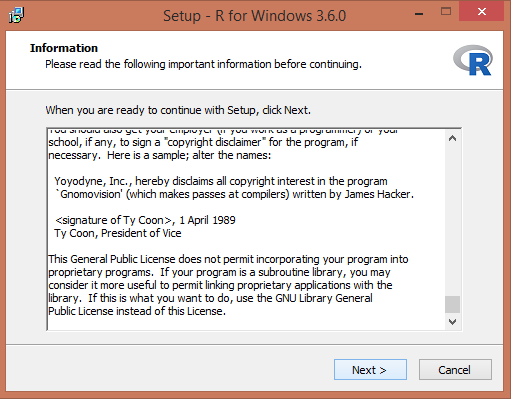
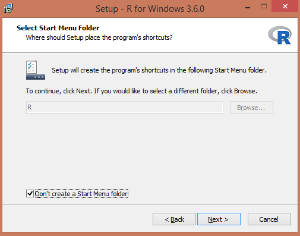
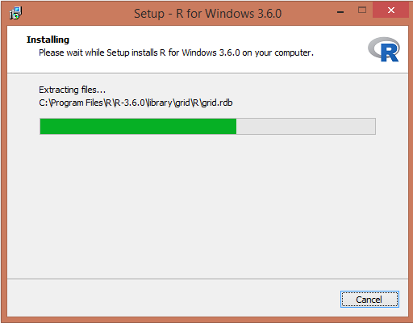

# Att börja använda R

I detta kapitel ska du inledningsvis installera R samt ett gränssnitt som kallas för RStudio. RStudio kan liknas vid en avancerad textredigerare som underlättar arbetet med R. Det går visserligen alldeles utmärkt att använda R som det är, men RStudio förenklar i många avseenden programmeringen.
 


## Installation av R och RStudio

Vid programmering är det mycket viktigt att noga följa instruktioner. Du ska nu **först** installera R. 
**Därefter** ska du installera RStudio. 


### Installation av R på MacOS

1. Ladda ner den senaste versionen från https://cran.r-project.org/bin/macosx/.
2. Ladda ner pkg-filen under *Latest release*. Öppna den nedladdade .pkg-filen och installera R.

### Installation av R på Windows
1. Gå till hemsidan https://cran.r-project.org/bin/windows/base/.

2. Klicka på ''Download R (versionnummer) for Windows''. Ditt versionnummer kan skilja sig åt det som används i detta exempel eftersom det kan ha kommit senare versioner, men för din del saknar detta någon praktisk betydelse.

```{r, echo = FALSE, out.width = "70%", dpi = 72}
knitr::include_graphics("docs/images/installR.png")
```

3. Dubbelklicka på ''R installer'' för att starta installationen.

4. Välj språk och tryck **OK**.

```{r, include=TRUE, echo = FALSE, out.width = "70%", dpi = 72}
knitr::include_graphics("docs/images/languageR.png")
```

5. Välj **Next**.

```{r, echo = FALSE, out.width = "70%", dpi = 72}

```

6. Välj sökväg för din installation. Låt default vara. Klicka **Next**.

```{r, echo = FALSE, out.width = "70%", dpi = 72}
knitr::include_graphics("docs/images/destinationR.png")
```

7. För att förenkla, välj alla komponenter för installation. Klicka **Next**.

```{r, echo = FALSE, out.width = "70%", dpi = 72}
knitr::include_graphics("docs/images/componentsR.png")
```

8. Klicka **No (accept defaults)**.

```{r, echo = FALSE, out.width = "80%", dpi = 72}
knitr::include_graphics("docs/images/customizeR.png")
```

9. För att lägga till R i Startmenyn, klicka bort kryssrutan nedan. Klicka **Next**.

```{r, echo = FALSE, out.width = "70%", dpi = 72}

```

10. Välj om du vill ha genvägar. Klicka **Next**. 

```{r, echo = FALSE, out.width = "80%", dpi = 72}
knitr::include_graphics("docs/images/tasksR.png")
```

11. Installation börjar! Starta R när den är klar.

```{r, echo = FALSE, out.width = "70%", dpi = 72}

```

12. Starta R för första gången.
På Windows ser det ut så här.

```{r, echo = FALSE, out.width = "70%", dpi = 72}
knitr::include_graphics("docs/images/firstR.png")
```

```{r, echo = FALSE, out.width = "70%", dpi = 72}
knitr::include_graphics("docs/images/firstR2.png")
```

## Installation av RStudio
Av olika anledningar väljer vi att inte arbeta i R Editor utan vi väljer RStudio. Stäng därför ner R. 

1. Gå till https://rstudio.com/products/rstudio/download/}. 
2 Välj RStudio Desktop Free. 
3 Välj sedan den version stämmer överens med ditt operativsystem.
4. Installera (på Windows) genom att klicka **Next->Next->Install**
5. Starta RStudio. 

Du ska nu fått upp nedanstående. Vi ska i detalj beskriva vad de olika panelerna till höger kommer vi återkomma till när det är aktuellt.

```{r, echo = FALSE, out.width = "80%", dpi = 72}
knitr::include_graphics("docs/images/Rstudio1.png")
```

6. Avluta RStudio.


## Första sessionen 
I denna session ska du bekanta dig med R och prova använda R som en miniräknare. Starta RStudio. Till vänster ska du ha en panel som heter **Console**. I denna panel redovisas resultat. Vad övriga paneler gör kommer vi återkomma till när det blir aktuellt. Välj i menyn **File > New File > R Script**. Ett nytt fönster (Untitled1) öppnas ovanför **Console** 

```{r, echo = FALSE, out.width = "80%", dpi = 72}
knitr::include_graphics("docs/images/Rstudio2.PNG")
```

Detta är ett script-fönster eller en **editor**. I editorn skrivs kommandon in som sedan kan utvärderas av R. Resultaten redovisas i  **Console**. Ha för vana att **aldrig** skriva kod direkt i R Console. I princip är en script-fil inte annorlunda än en vanlig textfil, förutom att filen har tillägget *.R*. Spara script med jämna mellanrum eftersom det är önskvärt att inte förlora sin kod ifall något oförutsett händer. Skapa därför en mapp med namnet **A5Rkod** på din dator. Välj **File > Save As...** och spara i  **A5Rkod** scriptet **Untitled** med namnet **myfirstscript.R**.

Efter att vi har skrivit koden i editorn måste vi meddela R att koden ska utvärderas. Kod i scriptfilen körs (exekveras) på tre olika sätt: 

1. En rad: Raden där markören är placerad körs med Ctrl+Enter (command + Enter på Mac) eller Run ovanför scriptet.
2. Flera rader: Markera kodavsnittet och tryck Ctrl+Enter (command + Enter på Mac) eller Run.
3. Hela scriptet: Ctrl+Shift+Enter

Det finns några viktiga punkter att ha i åtanke:

*  Om avsikten är att köra kod som sträcker
sig över flera rader måste man avsluta raden med räknetecken $(+,-,*,/)$, kommatecken $,$ eller vänsterparentes $($.
* En rad inleds aldrig med räknetecken eller kommatecken.
* En rad som inleds med **#** exekveras inte.  Tecknet  **#** används för att kommentera koden, vilket viktigt eftersom vi då i text kan förklara  vad koden gör. 


1. Skriv in nedanstående script till **myfirstscript.R**. Spara.

```{r, eval=FALSE}
# Detta är mitt första R-script som heter myfirstscript.R. 
# I detta script använder jag R som miniräknare samt 
# exekverar kod från scriptet.
1+1
1+3
2-7
2*3
4/5
3^2
```


2. Använd R som miniräknare genom att prova alla **tre** sätt att köra kod. Det är nödvändigt att bekanta sig med hur kod körs för att bli bekväm med att simultant arbeta i script-fönstret och se resultat i Console. Återigen, skriv **aldrig** i Console.

```{r, echo=TRUE, collapse=TRUE, comment=''}
1+1
1+3
2-7
2*3
4/5
3^2
```

3.  Matematiska funktioner, t ex kvadratroten, finns implementerade i R. Skriv `sqrt(6)` i scriptet och spara. Kör koden och erhåll följande i Console.

```{r, echo=TRUE, collapse=TRUE, prompt=FALSE, comment=''}
sqrt(6)
```

4. Även exponentialfunktionen $\exp(x)$ finns i R. Skriv `exp(3)`  i script-filen, spara och kör. 

```{r, echo=TRUE, collapse=TRUE, prompt=FALSE, comment=''}
exp(3)
```


5. Konstanten $\pi$ finns i R. Skriv `pi` i script-filen, spara och kör.
```{r, echo=TRUE, collapse=TRUE, prompt=FALSE, comment=''}
pi
```

6. Kod finns ofta på flera rader. Anta att vi önskar beräkna $2 + 2+ 3+ 5$ men att koden inte får plats på en rad utan måste delas upp på två rader. Skriv in följande rader i scriptet, spara, markera bägge raderna och kör.
```{r, eval=FALSE, echo=TRUE, collapse=TRUE, prompt=FALSE, comment=''}
# Kod över 2 rader
2 + 2 + 
3 + 5

```

Följande resultat ska presenteras i Console.

```{r, echo=TRUE, collapse=TRUE, prompt=FALSE, comment=''}
# Kod över 2 rader
2 + 2 + 
3 + 5
```

7. Kod finns ofta på flera rader. Skriv in följande rader i scriptet, spara, markera bägge raderna och kör. Jämför resultatet med punkt 6! 

```{r, eval=FALSE, echo=TRUE, collapse=TRUE, prompt=FALSE, comment=''}
2 + 2 
+  3 + 5
```

Nu utvärderas raderna var för sig, vilket inte var avsikten med analysen.

```{r, echo=TRUE, collapse=TRUE, prompt=FALSE, comment=''}
2 + 2 
+  3 + 5

```

**Grattis!** Du har nu genomfört din första session i R. Scriptet ska se ut enligt nedan. Spara och stäng R.

```{r, eval=FALSE}
# Detta är mitt första R-script som heter myfirstscript.R. 
# I detta script använder jag R som miniräknare samt 
# exekverar kod från scriptet.
1+1
1+3
2-7
2*3
4/5
3^2
# Kvadratroten
sqrt(6)
# Exponentialfunktionen 
exp(3)
# Pi 
pi
# Kod över 2 rader
2 + 2 + 
3 + 5
2 + 2 
+  3 + 5
```


## Paket
En viktig styrka med R är det stora antalet tillgängliga paket utvecklade av användare. Grundinstallationen av R är nämligen tämligen begränsad vad gäller funktionalitet, men med alla paket utvidgas den statistiska verktygslådan, de grafiska möjligheterna och förmågan att hantera olika typer av data rejält. Det finns ungefär 15000 paket på "The Comprehensive R Archive Network" (CRAN) som är Rs arkiv för paket:

https://cran.r-project.org/web/packages/available_packages_by_name.html

Det finns ytterligare tusentals andra paket som dock inte genomgått samma granskning som paketen på CRAN, till exempel på github. Eftersom antalet paket är överväldigande för nybörjaren kan det vara ett stöd att känna till de vanligaste paketen. Ett förslag på en lista över viktiga paket finns här:

https://support.rstudio.com/hc/en-us/articles/201057987-Quick-list-of-useful-R-packages

För att installera ett paket skriver man in paketnamnet med ett kommando alternativt använda menyn i RStudio under *Tools > Install Packages**.

Vi exemplifierar nu med ett paket som hjälper oss att läsa data från Excel-filer. Funktionalitet för inläsning från Excel-filer finns inte i basversionen av R, därför är detta paket nödvändigt om data är sparat i en Excelfil. 

Vi installerar paketet **readxl** genom att i Console skriva in `install.packages("readxl")` och trycka enter.
Som tidigare nämnt går det även att installera paket via menyn. 
Efter installationen finns paketet sparat på din dator. R har emellertid inte ännu aktiverat det. Genom att skriva `library("readxl")` och trycka enter aktiveras paketet.
Nu kan analyser i R utnyttja paketets funktionalitet. 

Observera att ett paket måste aktiveras på nytt varje gång RStudio öppnas. Dock behövs det bara installeras en enda gång.

***

## Sammanfattning

<style>
div.red{ background-color:#F5B7B1; border-radius: 5px; padding: 20px;}
</style>
<div class = "red">

 <font size="5">  </font>
Du ska kunna

- installera R och Rstudio och starta det utan felmeddelanden. 
- använda R som miniräknare och använda de olika metoderna för att exekvera kod i editorn.
- installera ett R-paket och aktivera det. 

</div>

***

## Övningar

### Övning 2.1 {-}
Du har ett stickprov betående av observationerna $4,-2,5,6,8$. 

a) Beräkna medelvärdet.
b) Beräkna standardavvikelsen.
c) Beräkna variationsbredden.
d) Beräkna det geometriska medelvärdet för de positiva värden $4, 5, 6, 8$.
e) Beräkna det geometriska medelvärdet för alla värden $4, -2, 5, 6, 8$.

### Svar 2.1 {-}
a) Medelvärdet $\bar{x}$ beräknas i R i editorn med

```{r, eval = FALSE}
(4 + (-2) + 5 + 6 + 8)/5
```

vilket i Console ger svaret

```{r, eval = TRUE, echo = FALSE}
(4 + (-2) + 5 + 6 + 8)/5
```

* Svar: Medelvärdet är `r 
(4 + (-2) + 5 + 6 + 8)/5`

b) Standardavvikelsen $s$ beräknas i R i editorn antingen genom att direkt tillämpa formeln för stickprovets standardavvikelse

$$s=\sqrt{\dfrac{\sum_{i=1}^n (x_i -\bar{x})^2}{n-1}}$$

```{r, eval = FALSE}
sqrt( ( ( 4 - (4 + (-2) + 5 + 6 + 8)/5 )^2 + 
      ( (-2) - (4 + (-2) + 5 + 6 + 8)/5 )^2 + 
      ( 5 - (4 + (-2) + 5 + 6 + 8)/5 )^2 + 
      ( 6 - (4 + (-2) + 5 + 6 + 8)/5 )^2 + 
      ( 8 - (4 + (-2) + 5 + 6 + 8)/5 )^2 ) / (5-1) )
```

eller genom att använda beräkningsformeln $$s=\sqrt{\dfrac{\sum_{i=1}^{n}x_i ^2 - (\sum_{i=1}^n x_i)^2/n}{n-1}}$$.
```{r, eval = FALSE}
sqrt( ( 4^2 + (-2)^2 + 5^2 + 6^2 + 8^2 - (4 + (-2) + 5 + 6 + 8)^2/5 )/ (5-1) )
```

Oavsett formel erhålls i Console svaret
```{r, eval = TRUE, echo = FALSE}
sqrt( ( 4^2 + (-2)^2 + 5^2 + 6^2 + 8^2 - (4 + (-2) + 5 + 6 + 8)^2/5 )/ (5-1) )
```

* Svar: Standardavvikelsen är `r 
round(sqrt( ( 4^2 + (-2)^2 + 5^2 + 6^2 + 8^2 - (4 + (-2) + 5 + 6 + 8)^2/5 )/ (5-1) ), 3)`

c) Variationsbredden, dvs skillnaden mellan det största och det minsta värdet är

```{r}
8 - (-2)
```


* Svar: Variationsbredden är är `r 8 - (-2)`.

d) Det geometriska medelvärdet $$\bar{x}_g=(x_1\cdot x_2 \cdot \cdots \cdot x_n)^{1/n}$$ kan i R beräknas med 

```{r}
(4  * 5 * 6 * 8)^(1/4)
```

* Svar: Det geometriska medelvärdet är `r round( (4 * 5 * 6 * 8)^(1/5), 2)`.

e) Det geometriska medelvärdet $$\bar{x}_g=(x_1\cdot x_2 \cdot \cdots \cdot x_n)^{1/n}$$ kan i R beräknas med 

```{r}
(4  * (-2) * 5 * 6 * 8)^(1/5)
```

* Svar: Eftersom en observation är negativ   blir `r (4  * (-2) * 5 * 6 * 8)^(1/5)`, vilket betyder ''Not a Number''. Det går alltså inte att beräkna. 


### Övning 2.2 {-}
Ett slumpmässigt urval ger följande observationer $0, 1, 1, 0, 0, 0, 0, 0, 1, 0, 1, 0, 1$,där $1=Arbetslös$ och $0=Förvärvsarbetande$.
Beräkna andelen arbetslösa i stickprovet.


### Svar 2.2 {-}
Andelen arbetslösa beräkna i R med
```{r} 
(0 + 1 + 1 + 0 + 0 + 0 + 0 + 0 + 1 + 0 + 1 + 0 + 1)/13 

```

* Svar: Andelen arbetslösa i stickprovet är `r round((0 + 1 + 1 + 0 + 0 + 0 + 0 + 0 + 1 + 0 + 1 + 0 + 1)/13, 2)`.


### Övning 2.3 {-}
Kosumentpriset 2006-2011  är 

```{r,  echo = FALSE}
knitr::kable(
  cbind(c(2006, 2007, 2008, 2009, 2010, 2011),
        c(284.22, 290.51, 300.61, 299.66, 303.46, 311.423)), digits = c(0, 1), caption = "Konsumentprisindex (KPI) 2006-2011")  
```

Med hur många procent har prisnivån förändrats från 2007 till 2010?

### Svar 2.3 {-}
Beräkning i R ger
```{r} 
303.46/290.51
```

* Svar: Prisnivån har ökat med `r 100*round(303.46/290.51, 3)-100`%.


### Övning 2.4  {-}
Denna övningar handlar om potentslagarna. Då $x$ och $y$ är reella och $a,b>0$ gäller följande likheter:

1. $a^x\cdot a^y=a^{x+y}$
2. $(a^x)^y=a^{xy}$
3. $\left(\frac{a}{b}\right)^x=\frac{a^x}{b^x}$
4. $\frac{a^x}{a^y}=a^{x-y}$
5. $a^x \cdot b^x=(ab)^x$
6. $a^0=1$

Beräkna nedanstående uttryck relatera svaren till potenslagarna.

a) $4^2 + 4^3$
b) $4^2*4^3$
c) $4^5$
d) $(4^2)^3$
e) $4^15$
f) $4^2/4^3$
g) $4^{-1}$
h) $4^{-2}$
i) $1/(4^2)$
j) $1/16$
k) $3^4*4^4$
l) $12^4$


### Svar 2.4 {-}
I R kan uttrycken enkelt beräknas.
```{r, echo=TRUE, collapse=TRUE, prompt=FALSE, comment=''} 
4^2 + 4^3
4^2*4^3
4^5
(4^2)^3
4^15
4^2/4^3
4^{-1}
4^{-2}
1/(4^2)
1/16
3^4*4^4
12^4
```


Vi ser att för $b= c$ pga  1. $d= e$  pga 2. $k=l$ pga 5. Vidare gäller...

### Övning 2.5  {-}
Den naturliga logaritmen, dvs logaritmen med
basen $e \approx 2.718282$, används ofta i statistiska beräkningar. Några logaratimlagar som gäller för naturliga logaritmen är:

1. $\ln\, \left (x\cdot y \right )=\ln\,x+\ln\,y$
2. $\ln\, \left (x/ y \right )=\ln\,x-\ln\,y$
3. $\ln\,x^{a}=a\cdot \ln\,x$
4. $\ln e = 1$
5. $e^{\ln x} = x$
6. $\ln^{e^x} = x$

Beräkna nedanstående uttryck och relatera svaren till logaritmlagarna

a) $\ln(3*4)$
b) $\ln(3) + \ln(4)$
c) $\ln(3/4)$
d) $\ln(3) - \ln(4)$
e) $\ln e$
f) $\ln e^5$
g) $e^{5+6}$
h) $e^5*e^6$
i) $5 \ln 5 + 6 \ln 6


### Svar 2.5 {-}
I R kan uttrycken enkelt beräknas.

```{r, echo=TRUE, collapse=TRUE, prompt=FALSE, comment=''} 
log(3*4)
log(3) + log(4)
log(3/4)
log(3) - log(4)
log(exp(1))
log(exp(5))
exp(5+6)
exp(5)*exp(6)
5*log(5) + 6*log(6)
```


### Övning 2.6  {-}
Låt observationerna $4,-2,5,6,8$ vara obundet slumpmässigt urval från en normalfördelad population. Genomför en hypotesprövning på 5\% signifikansnivå för att testa medelvärdet i population är skild från 1.


### Svar 2.6 {-}
1. Vi observerar $x=\{4,-2,5,6,8\}.$
2. Hypoteser: $H_0:\mu=0$ vs $H_1:\mu \neq 0$ 
3. Antaganden: Variabeln $x$ är normalfördelad i populationen. Populationsvariansen $\sigma^2$ är okänd i populationen. Vi har ett litet stickprov, $n=5$.
4. Testfunktionen ges av $t=\dfrac{\bar{x}-\mu}{\sqrt{s^2/n}}$. Denna teststatistika är $t$-fördelad med $n-1$ frihetsgrader om nollhypotesen är sann. 
5. Beslutregel: $\alpha=0.05$. Tvåsidigt test, förkasta därför $H_0$ om $|t_{obs}| > t_{krit} = t_{4,\alpha/2=0.025} = 2.776$

```{r, echo=TRUE, collapse=TRUE, prompt=FALSE, comment=''} 
( (4 + (-2) + 5 + 6 + 8)/5 - 1 )/sqrt( ( 4^2 + (-2)^2 + 5^2 + 6^2 + 8^2 - (4 + (-2) + 5 + 6 + 8)^2/5 )/ (5-1)/5 )

```

Eftersom $t_{obs}=$ `r ( (4 + (-2) + 5 + 6 + 8)/5 - 1 )/sqrt( ( 4^2 + (-2)^2 + 5^2 + 6^2 + 8^2 - (4 + (-2) + 5 + 6 + 8)^2/5 )/ (5-1)/5 )` $< 2.776 = t_{krit}$ kan vi inte förkasta nollhypotesen.

* Svar: Vi kan  på 5% signifikansnivå inte påvisa att medelvärdet i populationen är skilt från 1. Notera att detta **inte** innebär att vi visar att medelvärdet är 1.

### Övning 2.7  {-}
Du observerar följande datapunkter $x = \{4,7,2,4,6\}$ och $y=\{7,3, 2, 5,6}\$.

```{r, echo=FALSE}
x <- c(4,7,2,4,6)
y <- c(7,3, 2, 5,6)
plot(x,y, xlim = c(0, 10), ylim=c(0,10))

```


a) Använd minsta-kvadratmetoden och beräkna koefficienterna $a$ och $b$ i regressionslinjen $y=a + bx$.
b) Använd koefficienterna och ge en prediktion för $y$ givet att $x=7$.
c) Beräkna residualen för $x=7$
d) Beräkna residualspridningen.


### Svar 2.7  {-}
a) Riktningskoefficienten ges av
$$b=\dfrac{\sum_{i=1}^n(x_i-\bar{x})(y_i-\bar{y})}{\sum_{i=1}^n(x_i - \bar{x})^2}$$
```{r, collapse=TRUE, prompt=FALSE, comment=''}
# Direkt tillämpning av formeln ger 
( (4 - (4 + 7 + 2 + 4 + 6)/5) * (7 - (7 + 3 + 2 + 5 + 6)/5) + 
  (7 - (4 + 7 + 2 + 4 + 6)/5) * (3 - (7 + 3 + 2 + 5 + 6)/5) +
  (2 - (4 + 7 + 2 + 4 + 6)/5) * (2 - (7 + 3 + 2 + 5 + 6)/5) +
  (4 - (4 + 7 + 2 + 4 + 6)/5) * (5 - (7 + 3 + 2 + 5 + 6)/5) +
  (6 - (4 + 7 + 2 + 4 + 6)/5) * (6 - (7 + 3 + 2 + 5 + 6)/5) ) /
( (4 - (4 + 7 + 2 + 4 + 6)/5)^2 + 
  (7 - (4 + 7 + 2 + 4 + 6)/5)^2 +
  (2 - (4 + 7 + 2 + 4 + 6)/5)^2 + 
  (4 - (4 + 7 + 2 + 4 + 6)/5)^2 +
  (6 - (4 + 7 + 2 + 4 + 6)/5)^2 )
# Det går att räkna ut detta i flera steg genom att 
# t ex beräkna täljare och nämnare separat. 
# Alternativt använda beräkningsformeln

( 4*7 + 7*3 + 2*2 + 4*5 + 6*6 - (4+7+2+4+6)*(7+3+2+5+6)/5 )/
( (4^2 + 7^2 + 2^2 + 4^2 + 6^2) -  (4 + 7 + 2 + 4 + 6)^2/5 )  

# En kommentar: Dessa beräkningar kommer förenklas betydligt i R, vilket vi ska se senare.

```


Interceptet är $a=\bar{y} - b\bar{x}$
```{r, collapse=TRUE, prompt=FALSE, comment=''}
(7 + 3 + 2 + 5 + 6)/5 - 0.2105*(4 + 7 + 2 + 4 + 6)/5  
```

* Svar: Riktningskoefficienten beräknas till $b=0.2105$, vilket tolkas som att om $x$ ökar en enhet så ökar $y$ i *genomsnitt* med $0.2105$ 
enheter. Interceptet beräknas till $a=3.632$, vilket tolkas som medelvärdet för $y$ när $x=0$.

b) Använd koefficienterna från regressionslinjen och sätt in värdet $x=7$.
```{r, collapse=TRUE, prompt=FALSE, comment=''}
3.6316   +    0.2105*7  
```

* Svar: Prediktionen $\hat{y}=$ `r 3.6316   +    0.2105*7`. Detta är punkten på regressionslinjen när $x=7$ och vår bästa gissning för det $y$-värde en individ med värdet $x=7$ kommer att ha.   


c) En residual är skillnaden mellan ett predicerat värde och det faktiska observerade värdet, $\hat{\varepsilon}=y_i - \hat{y}$.
Eftersom $y=3$ när $x=7$ så residualen  

```{r, collapse=TRUE, prompt=FALSE, comment=''}
3 - (3.6316   +    0.2105*7) 
```

* Svar: Residualen för $x=7$ är `r 3 - (3.6316   +    0.2105*7)`.

d)
Residualspridningen ges av $$s_\varepsilon=\sqrt{\dfrac{\sum_{i=1}^n(y_i - \hat{y}_i)^2}{n-2}}= \sqrt{\dfrac{\sum_{i=1}^n\hat{\varepsilon}_i^2}{n-2}}$$. Vi beräknar på samma sätt som i c) övriga residualer, kvadrerar och summerar. 


```{r, collapse=TRUE, prompt=FALSE, comment=''}
sqrt(
( (7 - (3.6316   +    0.2105*4))^2 +
  (3 - (3.6316   +    0.2105*7))^2 +
  (2 - (3.6316   +    0.2105*2))^2 +
  (5 - (3.6316   +    0.2105*4))^2 +
  (6 - (3.6316   +    0.2105*6))^2 ) / 
  (5 - 2) )
```

* Svar: Residualspridningen är `r round( sqrt(
( (7 - (3.6316   +    0.2105*4))^2 +
  (3 - (3.6316   +    0.2105*7))^2 +
  (2 - (3.6316   +    0.2105*2))^2 +
  (5 - (3.6316   +    0.2105*4))^2 +
  (6 - (3.6316   +    0.2105*6))^2 ) / 
  (5 - 2) ), 3)`
  
(Notera att $\sum_{i=1}^n \varepsilon_i^2$ kallas för *residualkvadratsumman*.)


### Övning 2.8  {-}

1. Installera paketet **MASS** som innehåller funktioner som kan vara användbara senare på kursen.
2. Aktivera det installerade paketet **MASS**.

### Svar 2.8  {-}

```{r, echo=TRUE, eval=FALSE, collapse=TRUE, prompt=FALSE, comment=''} 
# Installera paket
install.packages("psych")
# Aktivera paket
library("psych")
```


