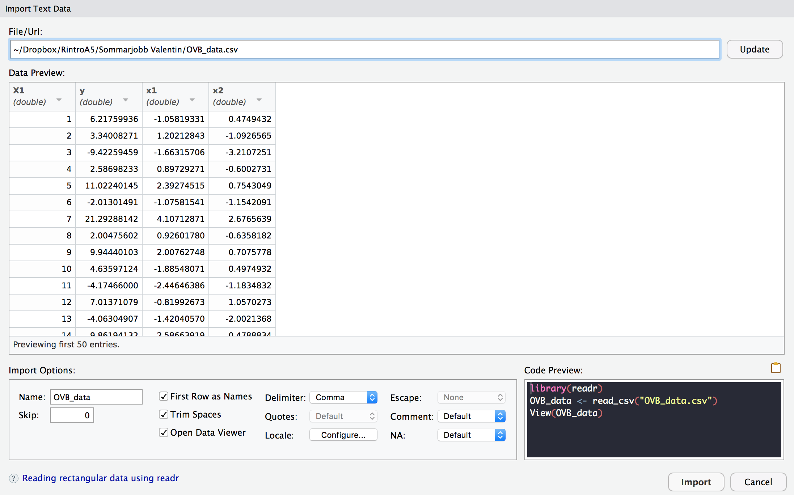
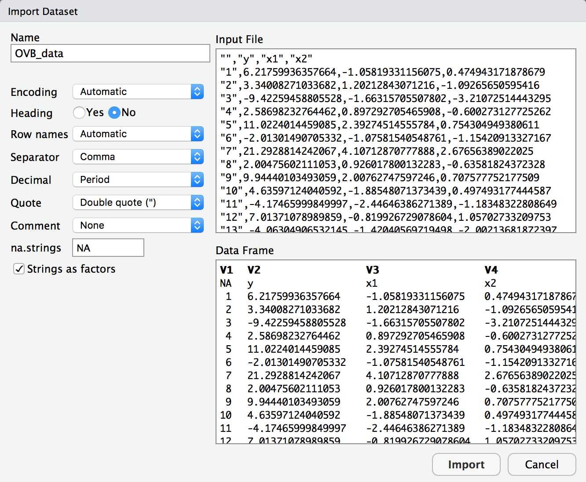

---
output:
  html_document: default
  pdf_document: default
---

<style>
p.comment {
background-color: #DBDBDB;
padding: 10px;
border: 1px solid black;
margin-left: 25px;
border-radius: 5px;
font-style: italic;
}

</style>

# Läsa in och spara data

Avsikten med detta kapitel är att beskriva principerna för hur datamaterial är organiserade, hur datamaterial bör organiseras samt presentera de vanligaste formaten för att att importera och exportera data i R. För nybörjaren i R kan det vara uppmuntrande att känna till att datainläsning i en del fall kan vara omständligt och frustrerande, framförallt om datamaterialet inte är organiserat på ett konsekvent sätt. Misströsta därför inte ifall det dyker upp svårigheter. Det krävs mycket erfarenhet för att blir trygg med att arbeta med data.

På denna kurs rekommenderas två format för att importera och spara datamaterial:

+ **textfiler** (**.txt** eller **.csv**), vilket innebär att data sparas i textformat.
+ **R Data format** (**.RDS**), vilket är det dataformat som R använder.

I praktiken är det däremot nödvändigt att kunna importera och spara filer i 

+ Excel-format (**.xlsx** eller motsvarande),

detta på grund av att många icke-statistiker använder Excel för att handskas med och analysera data. 

Vad gäller import och export av dataformat som är kopplade till andra statistikprogram (så som SAS, SPSS, Minitab) finns R-paket (t.ex. **foreign** och **haven**) avsedda för detta. När det gäller hantering av stora dataset ($>10$ Gigabyte i storlek) kan paket som **data.table** vara till hjälp.


## Principer för organiserade datamaterial

För att göra det så lätt som möjligt att importera och handskas med data i R är det en bra idé att följa principen om *tidy* data. *Tidy* kan i denna mening översättas som *städat* eller *organiserat*, och innebär att datamaterialet är strukturerat på ett specifikt sätt som gör det lätt att hantera.

[Hadley Wickham](https://twitter.com/hadleywickham), som är chefsforskare på RStudio och adjungerad professor i statistik vid bland annat Standforduniversitetet i USA, har tagit fram tre regler som bör följas för att få ett städat datamaterial. Dessa är att 

+ Varje variabel måste ha en egen kolumn
+ Varje observation måste ha sin egen rad
+ Varje värde måste ha sin egen cell. 

På grund av det sätt som R -- och i stort sett alla andra statistikprogram -- arbetar med data blir risken för felberäkningar eller förvirringar mindre när ett datamaterial är strukturerat efter de tre punkterna som ges ovan.

Som synes är data organiserat så att varje kolumn hör till en enskild variabel, varje rad hör till en enskild individ (observation), och varje cell hör till ett enskilt värde. För göra detta mer konkret kan det vara värt att betrakta en situation där du som analytiker blir ombedd att analysera ett datamaterial som har med Stockholms bostadsmarknad att göra. I detta datamaterial finns observationer som rör 1500 olika lägenheter i Stockholms innerstad, och informationen som delges är `boarea`, `antal rum`, `avstånd till närmsta tunnelbana`, `avstånd till vattnet`, och `månadsavgift`. Enligt principerna för städade datamaterial bör information för en specifik lägenhet finnas på en enskild rad. Varje rad bör även korsas av fem olika kolumner, som var och en innehåller information gällande en specifik variabel. På så sätt kommer varje cell i datamaterialet innehålla ett enskilt värde, och det kommer utan problem gå att utgöra vilken lägenhet samt vilken variabel varje cell hör till.

För att ytterligare klargöra skillnaden mellan datamaterial som är städade och datamaterial som inte är städade följer ett par tabeller här nedan. Studera gärna dessa en stund, och fundera kring varför varje tabell innehåller ett städat/ostädat datamaterial.


Boarea | Rum,  T-bana | Vatten | Avgift
-------| ------------ | ------ | ---------
52     | 2,     400   | 1500   | 3300
24     | 1,     150   | 2500   | 3967
|      |              |        | 

Datamaterialet som presenteras i tabellen ovan är inte tidy, detta eftersom variablerna `Rum` och `T-bana` står skrivna i samma kolum, vilket medför att varje cell inte innehåller ett enskilt värde. För att datamaterialet ovan ska räknas som städat krävs att det ser ut som i tabellen här nedan.

Boarea | Rum | T-bana | Vatten | Avgift
-------| --- | ------ | ------ | ---------
52     | 2   |  400   | 1500   | 3300
24     | 1   |  150   | 2500   | 3967
|      |     |        |        | 

I tabellen ovan finns en klar struktur som följer det som förväntas av ett städat datamaterial.

Utöver dessa tre grundläggande strukturer finns en del rekommendationer för att underlätta programmeringen, göra den mer intuitiv, och ge den ett bättre flyt. Dessa ges i följande punktlista:

+ Många program (t ex Excel) gör det möjligt att spara data som ren text istället för i progammets eget format. Spara alltid en kopia i textformat.

+ Använd semi-kolon för att avgränsa kolumner när datamaterial sparas i textformat. Eftersom kommatecken används som decimaltecken på svenska, och avstånd eller TAB är svåra att se i en textfil då de påminner om blanksteg, undviks ofta enkla problem genom att använda semikolon. 

+ Försök att inte ändra något i ursprungsfilen där datamaterialet är sparat. Det är bättre att importera data till R och göra ändringar där om så är möjligt.

+ Undvik att använda variabelnamn som innehåller blanksteg. Blanksteg har en specifik funktion i R, och om de används i variabelnamn blir dator lätt förvirrad, vilket leder till att beräkningarna inte fungerar som de ska. Istället rekommenderas att använda **understreck** eller **punkt** som avskiljare. Alltså bör en variabel döpas till `antal_rum` eller `antal.rum` snarare än bara `antal rum`.

+ Låt bli att använda variabelnamn som innehåller specielle symboler, som t.ex. ?, $, *, +, #, (, ), -, /, }, {, |, >, < etc. Även sådana symboler kan ha specielle funktioner i R, och om de inkluderas i variabelnamn finns risk att R inte kan hantera dem. Gör det till en vana att bara använda understreck eller punkt.

+ Inled aldrig ett variabelnamn med en siffra. Siffror är tillåtna i variabelnamn, men inte som första tecken. 

+ Namnen på kolumnerna i ett datamaterial måste alltid vara unike. Det får alltså **inte** finnas två kolumner med samma namn i ett och samma datamaterial.

+ R är ett skiftlägeskänsligt språk, vilket innebär att det gör skillnad mellan versaler och gemener. Detta medför att variabler vid namn `Husdjur` och `husdjur` sparas som två olika objekt, eftersom ett versalt H i det första namnet skiljer variablerna åt.

+ Om ett datamaterial innehåller tomma rader bör dessa raderas innan någon analys påbörjas. Tomma rader kan lätt betraktas som **missing values** av R, och kan därför komma att snedvrida analysen som ska utföras.

+ Ersätt alla tomma celler med `NA`. `NA` står för *not available* i R, och celler som är kodade som `NA` är i regel relativt enkla att utesluta ur en analys.

+ Radera alla kommentarer som finns i det ursprungliga datamaterialet. Ofta förekommer kommentarer antingen längst upp i själva datafilen, eller någonstans vid sidan av det data som är av intresse. För att dessa kommentarer inte ska störa analysen är det viktigt att radera dem.

Även om datamaterialen i denna kursen i stort sett alltid kommer vara textfiler eller formaterade som R-data är det högst sannolikt att många av er kommer behöva samla in och strukturera egna datamaterial i arbetslivet. Om (eller när) detta händer finns en  [artikel](http://tinyurl.com/yafq38p9), skriven av Karl Broman och Kara Woo, som ger en bra sammanfattning av vad som bör tas i åtankte i sådana situationer.

Nog om städade datamaterial. Resten av detta kapitel kommer handla om hur olika typer av datamaterial bör läsas in, för att sedan kunna använda dem i diverse statistiska analyser.

## Working directory

För att underlätta datainläsning är det bra att anrätta ett så kallat working directory som R kan utgå ifrån. Även om namnet working directory får det att låta komplicerat är det i grund och botten ett väldigt simpelt koncept. Ett working directory är helt enkelt en mapp i datorn som R använder som "hem-mapp". Fördelen med ett working directory är att R alltid utgår ifrån det, vilket medför att datamaterial som finns i mappen blir lättare att läsa in. Det är även så att script och figurer som produceras i R automatiskt sparas i denna mapp, vilket gör det lättare att hålla ordning på allt arbete som görs i R.

Det finns två sätt att bestämma vilken fil som ska räknas som ett workning directory. Den ena går ut på att skriva kod som anger sökvägen till mappen som är menad att vara directory, och den andra går ut på att använda menyer i R för att klicka sig fram till ett directory. De båda sätten är likvärdiga, och det är bra för varje enskild person att använda det sätt som verkar mest intuitivt. Faktum är att menyerna används för att generera kod som körs i Console, så i grund och botten är det samma operation som utförs. För att anrätta ett working directory är det första som behövs en mapp att använda. Skapa därför en mapp på skrivbordet som heter "Statistik A5". Detta krävs oavsett vilken metod som används för att göra mappen till ett directory. 

För att bestämma working directory med hjälp av kod används funktionen **setwd()**, och för att göra mappen Statistik A5 till directory skrivs sökvägen in mellan parenteserna i funktionen. Koden som används blir alltså följande

```
setwd("/Users/valentinzulj/Desktop/Statistik A5")
```
*Notera att sökvägen är unik för alla datorer. I just detta fall används min personliga dator, och sökvägen kommer inte att fungera på andra datorer än just min.*

Det är inte alltid självklart hur sökvägen till en mapp ser ut, men som tur är finns ett par knep för att lätta komma åt sökvägen. För Mac-användare är det lättast att leta upp mappen som ska bli directory, högerklicka på den (för att få fram en lista med olika alternativ), och hålla in alt-knappen på tangentbordet. När detta är gjort ändras ett alternativ till **Copy "namn på filen" as Pathname**, och genom att klicka på detta alternativ kopieras sökvägen så att den går att klistra in direkt i **setwd()**, exempelvis med hjälp av **CTRL + C**. För Windows-användare är processen snarlik, det gäller då att hålla ner Shift-tangenten och högerklicka på mappen som ska användas, för att sedan använda alternativet **Copy as Path (Kopiera sökväg)**. Efter det kan sökvägen klistras in i **setwd()** precis som ovan.

För att bestämma directory med hjälp av menyer gäller det att klicka på **Session** längst upp i RStudio. Sedan är det bara att gå till **Set Working Directory** och **Choose Directory** för att bläddra efter en mapp i datorn. Notera att en rad kod skrivs ut i Console när mappen som ska bli directory har valts, denna kod kan vara bra att kopiera och klistra in i det script som används för att göra analysen. Detta eftersom R återställer directory varje gång det stängs ner, och därför måste mappen anges varje gång R startas.

Om datamaterialet som ska läsas in finns i den mapp som är satt som directory behöver enbart filnamnet användas för att läsa in den, men om materialet inte finns i mappen behövs hela sökvägen. Därför kan det vara bra att ha det datamaterial som ska analyseras i en mapp som är (eller görs till) working directory. 

Använd nu panelen som finns längst ner till höger i R (precis till höger om Console). Börja med att klicka på fliken **Files**, och klicka sedan på kugghjulet som har texten **More** bredvid sig. Välj nu alternativet **Go To Working Directory** i listan. När detta är gjort dyker allt innehåll i mappen som är satt som working directory upp i panelen längst ner till höger. Med hjälp av dessa filer kan datamaterial läsas in på ett smidigt sätt. Detta kommer att diskuteras vid ett senare skede i denna text.

## Läsa in datamaterial med hjälp av kod

I R finns två huvudsakliga sätt att importera datamaterial, båda med sina egna för och nackdelar. Ett sätt är att skriva kod som får R att importera datamaterialet, och det andra är att använda menyerna som finns i RStudio för att generera kod och läsa in datamaterialet genom att bara klicka (ungefär som i Minitab eller SPSS). 

I denna del av kapitlet kommer dataimport med hjälp av programmering att diskuteras. Fördelen med att importera datamaterial med hjälp av kod är att koden kan sparas i ett script, och därmed blir det lätt att sprida ut analysarbetet över flera tillfällen utan att behöva ödsla onödig tid på dataimport i början av varje tillfälle. Det medföljer alltså ingen klickföljd att memorera -- som är fallet då menyer används -- och det är relativt smidigt. Nackdelen är att det finns väldigt många olika sätt att formatera datamaterial, vilket medför att det krävs många olika funktioner och argument att lära sig och hålla reda på. Detta problem är inte lika framträdande när menyer används för att importera data.

Som nämnts ovan kommer tre olika dataformat att diskuteras i detta kapitel. De två huvudsakliga är text-och CSV-filer och datafiler som är lagrade i R:s eget format RDS. Dessutom tillkommer datamaterial som är lagrade i Excelark.


### Text- och CSV-filer

Ett par format som ofta används för att lagra datamaterial är text- och CSV-filer. Textfiler har oftast **.txt** efter filnamnet, och CSV-filer har ändelsen **.csv**. CSV står för *comma separated values*, vilket betyder att kommatecken används för att skilja mellan kolumner på samma rad. Eftersom det finns många länder som använder kommatecken för att skriva ut decimaltal innefattar ordet *comma* i fallet CSV även semikolon. Strukturen i denna typen av filer är relativt enkel, och ett par exempel kommer att redovisas längre ner.

De två funktionerna som används för att läsa in CSV-filer är **read.csv()** och **read.csv2()**. Båda dessa är varianter av funktionen **read.table()**, fast med argument som är förspecificerade för att passa specifika typer av datastruktur. I grund och botten går det alltid att använda **read.table()** så länge argumenten specificeras korrekt, men det går ofta att spara lite tid genom att istället anropa **read.csv()** eller **read.csv2()** direkt.

CSV.filer är textfiler och mer generellt kan text-filer läsas in med **read.table()**. De bägge **read.csv()** och **read.csv2()** baseras nämligen på **read.table()**, men med förspecificerade argument. Funktionernas vanligaste argument presenteras nedan, men det går att specificera funktionerna i stor detalj beroende på hur datafilen ser ut. De fem huvudsakliga argument som används är 

+ **file** anger filnamnet på filen (datamaterialet) som ska läsas in
+ **header** specificerar om namnet på varje variabel finns på första raden i datamaterialet
+ **sep** anger vilken typ av tecken som används för att skilja kolumner åt
+ **quote** anger vilken typ av tecken som används som citationstecken för textvariabler 
+ **dec** anger vilket teckan som används som decimaltecken.

Standardinställningarna för de tre funktionernas vanligaste argument anges nedan.

```{r, eval=FALSE}
read.csv(file, header = TRUE, sep = ",", quote = "\"", dec = ".")
read.csv2(file, header = TRUE, sep = ";", quote = "\"", dec = ",")
read.table(file, header = TRUE, sep= " ", quote = "\"", dec = ".")
```

Som syns i kodsnutten är det standard för alla tre funktionerna att läsa in första raden i ett datamaterial som variabelnamn, och de använder alla samma typ av citationstecken. Det som skiljer dem åt är vilka tecken so används för att åtskilja kolumner samt för att skriva ut decimaltal. Funktionen **read.csv()** använder kommatecken för att skilja mellan kolumner, och punkt för att dela upp decimaltal, samtidigt som **read.csv2()** använder semikolon för att skilja mellan kolumner och kommatecken för att dela upp decimaltal. **read.table()**, däremot, använder ett blanksteg för att skilja mellan kolumner, och en punkt för att dela upp decimaltal. För att lära sig läsa in text- och CSV-filer är det bra att gå igenom punktlistan för varje datamaterial som ska läsas in, och på så sätt ta reda på hur argumenten är specificerade i det specifika datamaterialet.

Här nedan finns ett utdrag ur textfilen **animals1.csv**. Titta gärna närmare på datamaterialet och försök identifiera hur vart och ett av argumenten i punktlistan ovan är specificerade. Försök sedan komma fram till vilken av de tre inläsningsfunktionerna som lämpar sig bäst för att läsa in datamaterialet. Svaret finns att läsa under kodsnutten.


```{r, eval=FALSE}
"","animal","body","brain"
"1","Lesser short-tailed shrew",0.005,0.14
"2","Little brown bat",0.01,0.25
"3","Big brown bat",0.023,0.3
"4","Mouse",0.023,0.4
"5","Musk shrew",0.048,0.33
"6","Star-nosed mole",0.06,1
"7","E. American mole",0.075,1.2
"8","Ground squirrel",0.101,4
"9","Tree shrew",0.104,2.5
"10","Golden hamster",0.12,1
```

I **animals.csv** är argumenten specificerade som 

+ `header = TRUE` eftersom variabelnamnen anges i den första raden
+ `sep = ","` eftersom ett kommatecken används för att skilja cellerna i varje rad åt
+ `quote = "\""` eftersom helt vanliga citationstecken används för textvariabler
+ `dec = "."` eftersom en vanlig punkt används som decimaltecken

Dessa argument kan stämmas av med kodsnutten där standardargument anges, och då framkommer att funktionen **read.csv()** bör användas för att läsa in datamaterialet. Skriv därför in `df1 <- read.csv(file="D:/animals1.csv")` för att läsa in datamaterialet i R (notera att det räcker att bara skriva `file = "animals1.csv"` om filen finns i den mapp som är working directory). Eftersom **animals.csv** är en textfil kan filen öppnas i Notepad eller Textredigerare (eller mosvarande), och på så sätt kan alla text- och CSV-filer öppnas för att inspektera hur de är organiserade. Märk väl att de tecken som används för att skilja mellan celler, hantera textvariabler, och dela upp decimaltal alla är angivna inom citationstecken -- t.ex. står det alltså `sep = ","` istället för bara `sep = ,`. Detta är standard i R, och det är något som är viktigt att komma ihåg. Notera även att citationstecken anges som `"\""`, detta eftersom två uppsättningar av citationstecken skulle förvirra datorn.


Betrakta nu utdraget ur **animals2.csv** som finns här nedan, och försök återigen identifiera hur argumenten är specificerade, och vilken funktion som bör användas för att läsa in datamaterialet. Svaret finns än en gång att läsa under datamaterialet.


```{r, eval=FALSE}
"";"animal";"body";"brain"
"1";"Lesser short-tailed shrew";0,005;0,14
"2";"Little brown bat";0,01;0,25
"3";"Big brown bat";0,023;0,3
"4";"Mouse";0,023;0,4
"5";"Musk shrew";0,048;0,33
"6";"Star-nosed mole";0,06;1
"7";"E. American mole";0,075;1,2
"8";"Ground squirrel";0,101;4
"9";"Tree shrew";0,104;2,5
"10";"Golden hamster";0,12;1
```

I **animals2.csv** är argumenten specificerade som 

+ `header = TRUE` eftersom variabelnamnen anges i den första raden
+ `sep = ";"` eftersom ett semikolon används för att skilja cellerna i varje rad åt
+ `quote = "\""` eftersom helt vanliga citationstecken används för textvariabler
+ `dec = ","` eftersom ett kommatecken används som decimaltecken

Efter avstämning med standardargumenten framgår att **animals2.csv** bör läsas in med funktionen **read.csv2()**, och koden `df2 <- read.csv2(file="D:/animals2.csv")` kan därför användas för att importera datamaterialet till R.

Studera nu utdraget ur datamaterialet **animals.txt** som visas här nedanför, och försök identifiera argument och agöra vilken funktion som bör användas för att importera datamaterialet till R.

```{r, eval=FALSE}
"animal" "body" "brain"
"Lesser short-tailed shrew" 0.005 0.14
"Little brown bat" 0.01 0.25
"Big brown bat" 0.023 0.3
"Mouse" 0.023 0.4
"Musk shrew" 0.048 0.33
"Star-nosed mole" 0.06 1
"E. American mole" 0.075 1.2
"Ground squirrel" 0.101 4
"Tree shrew" 0.104 2.5
```

I **animals.csv** är argumenten specificerade som 

+ `header = TRUE` eftersom variabelnamnen anges i den första raden
+ `sep = " "` eftersom ett blanksteg används för att särskilja cellerna i varje rad
+ `quote = "\""` eftersom helt vanliga citationstecken används för textvariabler
+ `dec = "."` eftersom en punkt används som decimaltecken


För att läsa in **animals.txt** är alltså **read.table()** mest lämplig, och datamaterialet kan importeras med hjälp av koden `df3 <- read.table(file="D:/animals.txt", header=TRUE)`.


Återgå nu till **animals1.csv**, och försök läsa in datamaterialet med hjälp av 

`df4 <- read.table(file="D:/animals1.csv", header=TRUE, sep=",", dec=".")`

Studera såväl `df4` som `df1`, finns det någon skillnad mellan de två datamaterialen? Syftet med `df4` är att visa att **read.table()** också kan användas för att läsa in filer som inte använder de standardargument som presenterades i början av detta delkapitel. Istället för att använde **read.csv()** går det alltså att använda **read.table()**, och inom parenteserna specificera de argument som gäller för det datamaterial som ska läsas in. Det går lika bra att använda **read.table()** med egenspecificerade argument som att använda någon av funktionerna som har förspecificerade argument, och det är helt enkelt upp till varje individuell användare att avgöra vilken approach som är snabbast och lättast.


### Excel-filer

Eftersom många möjliga uppdragsgivare använder Excel-ark för att lagra och hantera data är det i praktiken nödvändigt att veta hur data från Excel kan importeras till R. Precis som för text-och CSV-filer finns ett antal tips som är bra att tänka på när data matas in i Excel

+ Första raden i varje ark ska innehåla variabelnamn
+ Första kolumnen bör bestå av observationsid 
+ Undvik namn och värden med mellanslag. Risken är att det tolkas som två olika kolumner.
+ Korta variabelnamn är bättre än långa.
+ Undvik tecken som ?, $,%, ^, &, *, (, ),-,#, ?,,,<,>, /, |, \, [ ,] ,{, och }
+ Radera kommentarer som du har i Excelfilen så att dessa inte tolkas som extra data. 

Många punkter på listan ovan finns även med i listan över saker som är värda att ta i beaktning när det rör sig om text- och CSV-filer. Det faktum att det finns ett relativt stort överlap kan ses som ett tecken på att många av dessa punkter är övergripande och gäller för nästan alla format som datamaterial kan sparas i. Det finns alltså en generell konvention för hur datamaterial bör struktureras för att göra analysen så smidig som möjligt.

I resten av detta avsnitt är målet att importera datamaterialen som finns in Excel-filerna **animal3.xlsx** och **animal4.xlsx**. För att importera data som lagras i Excel-filer krävs ett nytt paket i R. Paketet heter **readxl**, och det lättaste sättet att installera det är att skriva `install.packages("readxl")` i Console och sedan trycka enter. När paketet väl är installerat är det viktigt att även köra koden `library(readxl)` för att paketet ska aktiveras i R-sessionen. Paketet behöver bara installeras en gång, men det måste aktiveras varje gång R har varit stängt och öppnas på nytt. Det kan därför vara bra att ha `library(readxl)` längst upp i ett script där Excel-filer läses in.


Den första av Excel-filerna, **animals3.xlsx**, är en vanlig Excel-fil med bra struktur, där all data finns i det första arket. Datamaterialet som finns i filen kan därför enkelt läsas in genom att använda koden som finns i kodsnutten här nedan.

```
df5 <- read_excel("animal3.xlsx")
```

Använd samma ansats för att läsa in **animal4.xlsx**, denna ska alltså läsas in som

```
df6 <- read_excel("animal3.xlsx")
```

Jämför `df5` och `df6` visar båda tecken på att datamaterialen har lästs in på ett korrekt sätt? `df5` ser bra ut, och datamaterialet verkar ha importerats på ett bra sätt. För `df6`, däremot, är det något som har gått fel i inläsningen. Öppna filen **animal4.xlsx** och fundera på vad det kan vara som orsakar detta fel.

När filen är öppen framgår direkt att den består av flera olika kalkylblad, men att datamaterialet som är av intresse finns lagrat i blad 2. Utöver detta är det även så att datamaterialet inte börjar på första raden, utan det finns även annan text i kalkylbladet. För att R ska kunna importera data från **animal4.xlsx** på ett korrekt sätt krävs att två inställningar specificeras i **read_excel()**, nämligen **sheet** och **range**.

Inställningen **sheet** används för att bestämma vilket blad R ska använda när det importera data från Excel-filer. I fallet **animal4.xlsx** finns det intressanta datamaterialet i blad 2, vilkt innebär att inställningen bör specificeras som `sheet = "Blad2"`, eftersom detta är namnet på bladet. Den andra inställningen, **range**, används för att bestämma vilken del av kalkylbladet som ska läsas in. I detta fall finns det en del text som stör inläsningen, och datamaterialet börjar först på rad 3. Inställningen bör specificeras som `range = "A3:D68"` eftersom cellerna **A3** och **D68** kan användas för att bilda en rektangel som innefattar hela datamaterialet (tänkt på det som att dra ett lodrätt och ett vågrätt streck från var och en av cellerna, då kommer alla data finnas inom rektangeln som bildas av strecken). Notera att den första cellen i inställningen ska vara den som är *längst upp till vänster* i datamaterialet, och den andra cellen ska vara den som finns *längt ner till höger.* Läs nu in datamaterialet som

```
df7 <- read_excel("animal4.xlsx", sheet = "Blad2", range = "A3:D68")
```

Studera `df7` närmare. Ser den likadan ut som `df6`, eller har specificeringen av inställningar gjort datainläsningen bättre? Denna typ av inställningar kan användas för att förenkla importen av datamaterial från Excel-filer, därför är det bra att öppna Excel-filer och titta på deras struktur innan de ska importeras till R.

**read_excel()** har som standard att importera data från det första bladet i en Excel-fil, och att importera alla celler som har någon typ av information lagrad i sig (det spelar ingen roll om det är meningslös text eller viktiga data). Därför går det bra att använda funktionen rakt av för datamaterial som är strukturerade som **animals3.xlsx**, eftersom datamaterialet börjar på första raden och alla celler är fyllda med relevant information. I alla övriga fall är det alltså värt att fundera över hur inställningarna kan användas för att underlätta inläsningen av data.


### Övriga format

Utöver de format som diskuterats ovan finns ett flertal andra sätt att lagra data. Eftersom dessa inte är lika vanligt förekommande, och eftersom de inte kommer utgöra någon del i denna kurs, kommer majoriteten av dem inte att behandlas här. Det finns, bland annat, en rad programspecifika datalagringsformat som kan dyka upp ibland. Programspecifikt innebär att formatet är strukturerat på ett sätt som passar ett specifikt statistikprogram väldigt bra, till exempel finns speciella format för att lagra data för bruk i SPSS, Minitab, Stata och dylikt. En fördel med programspecifik datalagring är att den kan göras väldigt effektiv, och på sätt kräva mycket mindre minne än t.ex. textfiler. En nackdel som gör att denna typ av datalagring ofta undviks är att datamaterial måste formatteras om när de ska användas i program som inte är standard, och detta kan ofta vara en omständlig process som lätt går fel. R har ett eget datalagrinsformat, och filer som lagras i detta format brukar ha **.rds** efter filnamnet. Eftersom ett mål med kursen är att lära ut programmering med hjälp av R diskuteras användning av **.rds**-filer i detta avsnitt.

Med hjälp av R:s egna format går det alltså att lagra data mer effektivt när det kommer till minnesanvändning. Formatet gör också att importen av data blir väldigt smidig, eftersom strukturen i datamaterialet är skräddarsydd för att passa de krav som R ställer på ett datamaterial. Funktionen som används för att läsa in datamaterial som sparats i R:s eget format finns direkt tillgänglig i R, och den heter **readRDS()**.

Syntaxen som används för att läsa in datamaterial som finns lagrade i **.rds**-format är relativt simpel, och kan sammanfattas i kodsnutten nedan.

```
readRDS(file = "filnamn.rds")

```

För att läsa in datamaterialet som är sparat i filen **OVB_data.rds** (finns tillgänglig i Studentportalen) används koden som visas här nedanför.
 
```
df8 <- readRDS(file = "OVB_data.rds")
```

Som sagt är syntaxen relativt enkel, det enda som krävs är namnet på filen som datamaterialet är lagrat i. Om datamaterialet är del av ett större projekt krävs dock att alla som arbetar med det använder R om det är lagrat i en **.rds**-fil. Därför kan det vara bra att undvika detta format i sammanhang där flera personer ska jobba med ett och samma datamaterial.

## Läsa in datamaterial med hjälp av menyerna i RStudio

Det finns två enkla sätt att läsa in data genom att använda de menyer som finns att tillgå i RStudio. Ett av dem handlar om att använda panelen längst ner till höger för att klicka på en fil som finns i R:s working directory, och det handlar om att använda menyn **Import Dataset** som finns längst upp till höger i RStudio-fönstret. Båda dessa tillvägagångssätt kommer diskuteras i denna del av Kapitel 4.

Den stora fördelen med att läsa in datamaterial med hjälp av RStudios menyer är att det ofta kan vara väldigt lätt att göra, och att inställningar kan ändras flera gånger för att ser hur datamaterialet kommer se ut när det väl har importerats. Det kan alltså vara lättare att ordna en bra import redan vid första försöket. Den största nackdelen är dock att det är lätt att glömma att spara koden som skrivs ut i Console, och att det därför kan bli så att processen måste genomföras varje gång RStudio startas på nytt. Om olika inställningar används varje gång datamaterialet läses in kan det ge snedvridande effekter på den statistika analys som ska genomföras.

### Läsa in data från working directory

Börja med att set till så att filerna i R:s working directory syns i panelen längst ner till vänster. Instruktioner för hur detta ordnas finns i sista stycket under rubriken **Working directory** i detta kapitel.

Flytta nu filen **OVB_data.rds** till mappen som är working directory, och vänta tills det att den dyker upp i panelen längst ner till vänster. Klicka på filens namn när den har dykt upp, så att en dialogruta dyker upp. I denna ruta anges det namn som datamaterialet ska ha när det importeras till R. Ange ett namn och klicka på **OK** så importeras datamaterialet direkt till R. När filen som ska läsas in inte är av **.rds**-format kan det bli lite krångligare att använda denna approach, men i de flesta fall så går det att ändra grundinställningarna precis som när data importeras med hjälp av kod.

Ladda nu ner filen **OVB_data.csv** och flytta den till working directory. Testa att klicka på dess namn i panelen längst ner till vänster, och sedan klicka på **Import Dataset**. När detta är gjort öppnas ett fönster där datamaterialet visas, detta fönster illustreras i bilden nedan.


Som synes ser datamaterialet väldigt väl organiserat ut, men det behöver inte alltid vara fallet. Ibland kan det vara så att datamaterialet ser väldigt konstigt ut, och detta kan bero på att grundinställningarna i inläsningen inte är anpassade efter datamaterialet i fråga. När det rör sig om text- och CSV-filer finns det, precis som när data importeras med kod, fyra inställningar som kan ändras för att datamaterialet ska importeras korrekt. Dessa inställningar kan ändras i rutan **Import Options**, som finns precis under datamaterialet.

Med hjälp av rutan vid **First Row as Names** kan inställningen **header** justeras. Om rutan har en bock i sig har inställningen specifierats som `header = TRUE`, annars är inställningen satt till `FALSE`. Till höger om **Delimeter:** finns en rullista som kan användas för att avgöra vilket tecken som används för att skilja mellan kolumner, och Till höger om **Quotes:** finns en rullista som kan användas för att avgöra hur textvariabler hanteras. Dessa båda motsvarar inställningarna **sep** respektive **quote** från tidigare. Slutligen kan knappen **Configure** till höger om **Locale** användas för att få upp en ruta där alternativet **dec** kan användas för att avgöra vilken typ av decimaltecken som används i datamaterialet.

En sak som är särskilt bra med detta sätt att importera data är att det går att ange vilken datanivå varje variabel har (eller är tänkt att ha). Under varje variabel namn finns i bilden ovan en liten pil (med texten (double) bredvid). Klicka gärna på denna fil för att få upp en lista med olika datanivåer, en sådan lista visas i bilden som följer.


Det första allternativet i listan ovan är **Guess**, vilket innebär att R läser av värdena som finns i kolumnen och "gissar" vilken datanivå variabeln har. Om variabeln i fråga är en faktor variabel med numeriska nivåer, till exempel de binära nivåerna **0** och **1**, är det lätt hänt att R gissar fel och klassa variabeln som **Integer**. För att undvika detta rekommenderas att byta datanivån till **Factor**, detta kommer visas sig vara till stor hjälp i analysen av datamaterialet. Notera även att alternativen **Skip** och **Only** finns längst ner i listan. Alternativet **Skip** medför att den valda variabeln *inte* importeras, och **Only** medför att *bara* den valda variabeln importeras.

Med hjälp av dessa fem inställningar bör det vara möjligt att läsa in datafiler på ett ordentligt sätt.

### Läsa in data med "Import Dataset"

Längst upp till höger i RStudio finns en knapp där det står **Import Dataset**. Klicka på denna för att få upp en rullista med alternativ (se bild nedan).


I listan går det att välja vilket format datamaterialet som ska läsas in har. För text- och CSV-filer rekommenderas **From Text (base)**. Klicka på **From Text (base)** för att få upp ett fönster med alla filer som finns i R:s working directory. Notera att det även går att navigera runt i datorn för att hitta datamaterial som finns i mappar som inte är working directory. Välj nu filen **OVB_data.csv** för att få upp rutan som visas i bilden nedan.



I rutan finns tre paneler. I panelen med rubrik **Input File** visas filen som ska läsas in, med andra ord ger den en blick över det rådata som finns. Det som är bra med denna panel är att det går väldigt lätt att undersöka hur det ligger till med grundinställningarna som diskuterats ovan, det vill säga vilken typ av decimalteceken som använs och så vidare. I panelen som heter **Data Frame** visas strukturen på den data frame som kommer läsas in med de inställningar som råder för tillfället. I detta fall ser datamaterialet bra strukturerat ut, men så är inte alltid fallet. När det som visas under **Data Frame** ser dåligt strukturerat ut är det en bra idé att ändra på inställningarna till vänster om de två panelerna. De vanligaste inställningarna ändras med hjälp av **Heading** som anger huruvida den första raden innehåller variabelnamn, **Separator** som anger vilket tecken som används för att skilja mellan kolumner, **Decimal** som anger vilken typ av decimaltecken som används, och **Quote** som används för att specificera textvariabler. Testa att byta inställningen för **Heading** till **Yes**, vad händer? Ser materialet som visas under **Data Frame** bättre ut. Prova även att ändra de andra inställningarna för att se vad som händer, och fundera över varför det blir som det blir.

När datamaterialet som visas under **Data Frame** ser bra ut importeras det genom att trycka på **Import**. Notera att ett kommando skrivs ut och körs i Console när datamaterialet importeras. Denna kod kan vara värd att kopiera och spara i den scriptfil där datamaterialet är tänkt att analyseras, eftersom koden då bara kan köras för att importera datamaterialet nästa gång R startas. Om koden redan finns i scriptet är det inte nödvändigt att importera det genom att använda **Import Data**-menyn en gång till.

## Spara datamaterial med hjälp av R
Många gånger kan det vara fördelaktigt att exportera ett datamaterial från R, och spara det på datorn i någon sorts text- eller excel-fil. Till exemple kan det vara så att R har använts för att städa ett datamaterial, göra olika ändringar i ett datamaterial, eller slå ihop två eller flera datamaterial. Då är det smidigt att kunna spara det förändrade datamaterialet för att sedan kunna arbeta med det direkt, och inte behöva genomföra samma förändringar varje gång analysarbete ska utföras.

De kommandon som används för att exportera datamaterial i R är snarlika de som används för att importera datamaterial. Funktionerna har nästan samma namn, och deras struktur är uppbygd på i stort sett sätt. För att spara datamaterial i text-filer finns tre huvudsakliga funktioner. Dessa är 
```{r, eval=FALSE}
write.csv(x, file = " ", header = TRUE, sep = ",", quote = "\"", dec = ".")
write.csv2(x, file = " ", header = TRUE, sep = ";", quote = "\"", dec = ",")
write.table(x, file = " ", header = TRUE, sep= " ", quote = "\"", dec = ".")
```

Notera att funktionsnamnen är likadana, med skillnaden att det nu står **write** istället för **read** framför punkten. Grundinställningarna i funktionerna är samma som de för motsvarande funktion som används för dataimport. I funktionerna representerar **x** det material som ska exporteras, och inom de citationstecken som finns efter **file = ** anges namnet på den fil som datamaterialet ska sparas i. Datamaterialet kommer per automatik sparas i det working directory som är angivet när kodsnutten körs.

För att visa hur exportfunktionerna kan komma till nytta används de två datamaterialen **exp_dat1.csv** och **exp_dat2.csv**. De båda datamaterialen är simulerade vilked medför att de inte är särskilt intressanta i sig själva, utan det intressanta är hur de kan manipuleras och sedan sparas.

Ladda ner de två datamaterialet till ett R:s working directory och läs in dem som
```
exp_dat1 <- read.csv("exp_dat1.csv")
exp_dat2 <- read.csv("exp_dat2.csv")
```

Sätt sedan ihop datamaterialen till ett stort material genom att använda **rbind()**

```
exp_sam <- rbind(exp_dat1, exp_dat2)
```

För att kontrollera huruvida de två materialen har satts ihop på ett korrekt sätt går det att använda

```
View(exp_sam)
```

Det nya datamaterialet kan nu exporteras med hjälp av funktionerna ovan. För att exportera det till en textfil där cellerna separeras av semikolon används 
```
write.csv2(exp_sam, file = "exp_sam.csv")
```

I detta fall sparas en textfil vid namn *exp_sam.csv* i det working directory som har angivits. Notera att filen som sparas inte måste ha samma namn som datamaterialet har i R. Om det, av någon anledning, anses att *sammanslagna_data.csv* är ett bättre namn på filen som ska sparas används helt enkelt 
```
write.csv2(exp_sam, file = "sammanslagna_data.csv")
```

## Övningar 

### Övning 4.1 {-}

Denna uppgift kretsar kring att importera data från sjätte vågen av World Values Survey. Datamaterialet är begränsat till svar från de intevjuer som utförts i Sverige under år 2011, och innehåller 1206 observationer. Alla svar är omkodade till siffror, och ett utdrag ur datamaterialet innehåller svar på frågor gällande

+ Äktenskaplig status
+ Antal barn
+ Huruvida responenten skulle vara villig att försvara Sverige vid ett eventuellt krigsutbrott
+ Ålder

Frågorna är sorterade så att varje punkt i listan ovan motsvarar respektive kolumn i datamaterialet (alltså finns äktenskaplig status i första kolumnen, antal barn i andra kolumnen, etc.). Uppgiften är nu att:

(a) Ladda ner datamaterialet som finns lagrat i **VWS.csv** från Studentportalen.

(b) Öppna filen som datamaterialet är lagrad i med hjälp av Notepad, TextEdit, eller någon annan textredigerare. Fundera på hur datamaterialet materialet är strukturerat, och ange hur de fyra grundinställningarna är specificerade i filen.


<button title="q41b" type="button"
   onclick="if(document.getElementById('q41b') .style.display=='none')
              {document.getElementById('q41b') .style.display=''}
            else{document.getElementById('q41b') .style.display='none'}">
  Visa svar
</button>

<div id="q41b" style="display:none">
<div class="alert alert-info">
I datamaterialet är

+ `header = FALSE` eftersom inga variabelnamn ges i första raden
+ `sep = ";"` eftersom semikolon används för att skilja mellan kolumner
+ `quote = "\""` detta går egentligen inte att se, eftersom inga textvariabler finns med
+ `dec = "."` detta går inte heller att se, eftersom inga decimaltal finns i datamaterialet

</div>
</div>
</br>


(c) Avgör vilken av funktionerna `read.csv()` och `read.csv2()` som är bäst lämpad för att importera datamaterialet till R, och skriv sedan en kodsnutt som kan användas för att importera datamaterialet.

<button title="q41c" type="button"
   onclick="if(document.getElementById('q41c') .style.display=='none')
              {document.getElementById('q41c') .style.display=''}
            else{document.getElementById('q41c') .style.display='none'}">
  Visa svar
</button>


<div id="q41c" style="display:none">
<div class="alert alert-info">

Eftersom semikolon används för att skilja mellan kolumner är `read.csv2()` bäst lämpad för att läsa in datamaterialet. Notera dock att `header = FALSE`, och att denna inställning måste ändras i koden. Kodsnutten som används för att läsa in datameterialet blir så

```
wvs <- read.csv2("WVS1.csv", header = FALSE)
```
</div>
</div>
</br>

(d) Använd nu `read.table()` för att importera samma datamaterial genom att ange egna specifikationer för alla inställningar.

<button title="q41d" type="button"
onclick="if(document.getElementById('q41d') .style.display=='none')
              {document.getElementById('q41d') .style.display=''}
            else{document.getElementById('q41d') .style.display='none'}">
  Visa svar
</button>
<div id="q41d" style="display:none">

<div class="alert alert-info">

För att använda `read.table()` måste inställningarna för `header` och `sep` specificeras så att 

```
wvs2 <- read.table("WVS1.csv", header = FALSE, sep = ";")
```
</div>
</div>
</br> 


(e) Ge varje kolumn ett meningsfullt namn.

<button title="q41e" type="button"
onclick="if(document.getElementById('q41e') .style.display=='none')
              {document.getElementById('q41e') .style.display=''}
            else{document.getElementById('q41e') .style.display='none'}">
  Visa svar
</button>

<div id="q41e" style="display:none">
<div class="alert alert-info">

Vad som räknas som bra namn är till viss del subjektivt, och det är inget krav att namnen ska vara exakt samma som de namn som anges här. Vad som är viktigt är att namnen är i linje med rekommendationerna som ges i texten.

Exampel på variabelnamn

```
colnames(wvs) <- c("ID", "marital_status", "children", "defend_country", "age")  
View(wvs) 
```

</div>
</div>  
</br>

(f) Läs in datamaterialet genom att använda **Import Dataset**-menyn. Blir resultatet likadant som ovan?

### Övning 4.2 {-}

Denna övning använder samma datamaterial som övningen ovan, dock i ett annat format. Utför följande uppgifter:


(a) Ladda ner filen **WVS.xlsx** från Studentportalen och studera den i ett Excel-fönster. Finns det något som kan orsaka svårigheter i datainläsningen? Finns det några celler som innehåller information som inte är relevant i sammanhanget?

<button title="q42a" type="button"
onclick="if(document.getElementById('q42a') .style.display=='none')
              {document.getElementById('q42a') .style.display=''}
            else{document.getElementById('q42a') .style.display='none'}">
  Visa svar
</button>

<div id="q42a" style="display:none">
<div class="alert alert-info">
I datamaterialet finns tre saker som är värda att notera

1. All data finns i det andra arket, vid namn **Sheet2**
2. Ovanför datamaterialet finns en informationstext som berättar var datamaterialet har hämtats och vad det innehåller för information
3. Till höger om datamaterialet finns ett index som visar vad varje kolumn innehåller data för

</div>
</div>  
</br>

(b) Använd funktionen **read_excel()** för att läsa in datamaterialet. Vilka inställningar är viktiga att ändra för att inläsningen ska gå korrekt till?

<button title="q42b" type="button"
onclick="if(document.getElementById('q42b') .style.display=='none')
              {document.getElementById('q42b') .style.display=''}
            else{document.getElementById('q42b') .style.display='none'}">
  Visa svar
</button>

<div id="q42b" style="display:none">
<div class="alert alert-info">

För att datainläsningen ska gå korrekt till finns två inställningar som behöver ändras. Den ena är `sheet`, som bestämmer vilket ark som ska läsas in, och den andra är `range` som anger vilken del av Excel-arket som ska läsas in.

I detta fall bör `sheet = "Sheet2"`, och `range = "A4:D1210"`, och koden blir

```
wvs3 <- read_excel("WVS.xlsx", sheet = "Sheet2"", range = "A4:D1210")
```

Notera att indexet över vilken variabel som hör till vilken kolumn kan vara bra att spara på annat sätt, men inte i själva datamaterialet.
</div>
</div> 
</br>

(c) Använd valfri meny i RStudio for att importera datamaterialet som finns i **WVS.xlsx**. Var noga med att bara importera den del av materialet som kan komma att bli relevant för en framtida analys.


### Övning 4.3 {-}

I textfilen `covid_19.csv` finns information gällande antalet bekräftade fall av Covid-19 i hela Sverige, samt regionsspecifik information för Dalarna och Uppsala. 

a) Skriv en kodsnutt som på lämligt sätt importerar datamaterialet till `R`

<button title="q43a" type="button"
onclick="if(document.getElementById('q43a') .style.display=='none')
              {document.getElementById('q43a') .style.display=''}
            else{document.getElementById('q43a') .style.display='none'}">
  Visa svar
</button>

<div id="q43a" style="display:none">
<div class="alert alert-info">

Börja med att öppna filen i **textedit** eller **notepad** (beroende på vilken typ av dator du har). 

Det första som finns i datamaterialet är en informationstext som kan ställa till det vid datainläsning. För att komma runt denna informationstext finns två olika alternativ 

1. Radera texten manuellt, spara om filen, och sedan läsa in den som vanligt
2. Använda inställningen `skip` och få `R` att hoppa över de första raderna när datamaterialet importeras.

I vilket fall som helst kan konstateras att

+ `header = TRUE`
+ `sep = ","`
+ `quote = "\""` egentligen finns ingen text-data i materialet, men detta är ett antagende som kan göras
+ `dec = "."` här gäller samma sak som ovan

Det är alltså lämplig att använda `read.csv()` för att importera datamaterialet. 

Om den inledande texten har raderats, och om filen finns i ett aktuellt working directory, kan materialet läsas in som
```{r, eval = FALSE}
covid_19 <- read.csv("covid_19.csv")
```

Om informationstexten ligger kvar är det viktigt att notera att de 8 första raderna i textfilen antingen innehåller text eller är tomma. Därför kan alternativet `skip` sättas till `8`, så börjar `R` läsa in data från den nionde raden i filen. Koden skrivs då som

```{r}
covid_19 <- read.csv("covid_19.csv", skip = 8)
```

</div>
</div> 
</br>

b) Undersök datamaterialet för att se om det finns några konstigheter, så som konstiga eller orimliga värden. Koda i sådana fall om de konstiga värdena till `NA`

<button title="q43b" type="button"
onclick="if(document.getElementById('q43b') .style.display=='none')
              {document.getElementById('q43b') .style.display=''}
            else{document.getElementById('q43b') .style.display='none'}">
  Visa svar
</button>

<div id="q43b" style="display:none">
<div class="alert alert-info">

För att få en sammanfattning av datamaterialet kan `summary()` användas
```{r}
summary(covid_19)
```

Som synes finns konstiga värden på två olika stället

1. I variabeln `Totalt_antal_fall` är det minsta värdet -99. Eftersom variabeln mäter antal som bekräftats smittade är negativa tal inte möjliga, och därför bör alla tal som är mindre än noll kodas om till `NA`
2. I kolumnen som mäter antalet som bekräftats smittade i Dalarna finns minst ett värde som är `999999`. Eftersom Dalarnas folkmängd är cirka 285 000 borde detta vara en ren omöjlighet.

Därför används koden
```{r}
covid_19$Totalt_antal_fall[covid_19$Totalt_antal_fall < 0] <- NA
covid_19$Dalarna[covid_19$Dalarna == 999999] <- NA
```
för att koda om de konstiga värdena.

För att kontrollera att altt nu står rätt till anropas `summary()` en gång till
```{r}
summary(covid_19)
```

Denna gång ser allt bra ut.

</div>
</div> 
</br>

 
