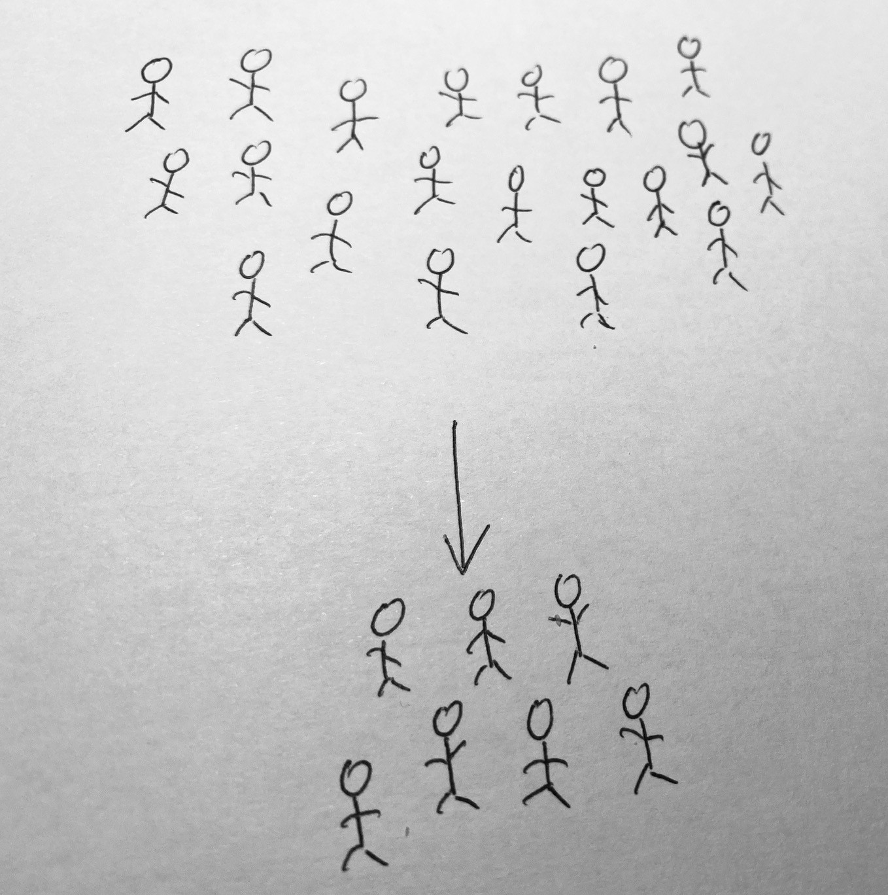
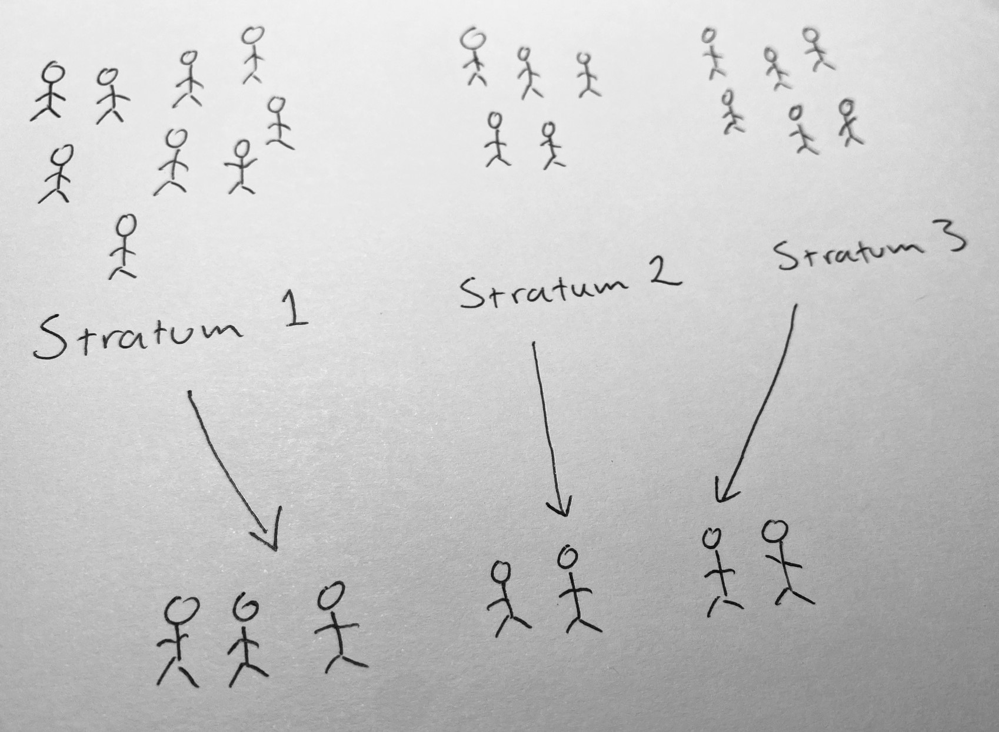
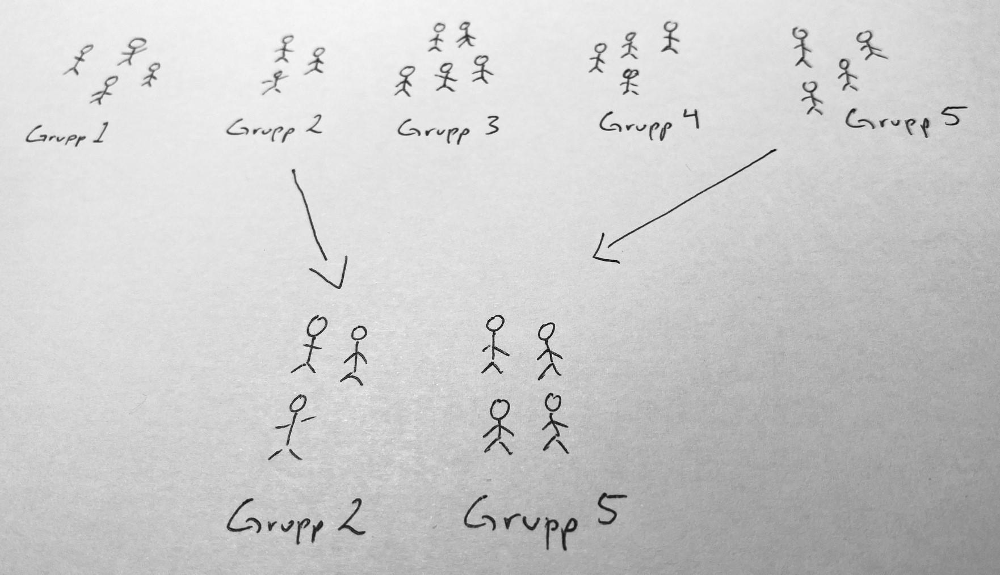

# Urvalsmetoder 

```{r, echo = FALSE, out.width = "25%", dpi = 72, out.extra='style="background-color: #414244 ; padding:1px; display: inline-block;"'}

```


Detta kapitel utgår från vi önskar beskriva en ändlig population vars värden betraktas som fixa och ej slumpmässiga. Om hela populationen är känd finns ingen osäkerhet, men av olika anledningar kan inte hela populationen undersökas.  Vi är därför hänvisade till att genomföra ett slumpmässigt urval. Detta är en del i ett **designbaserat ramverk** där slumpmässigheten beror på själva urvalsdesignen.

En alternativ sätt att betrakta slumpmässigheten är utgå från ett **modellbaserat ramverk** där populationen är en statistisk matematisk modell. Målet kan då vara att skatta parametrarna i denna modell för exempelvis kunna beskriva modellen eller använda modellen för prediktion. 

utgångspunkten här är emellertid det designbaserade ramverket och en ändlig population bestående av $N$ element (objekt). Beteckna element $k$ med sitt nummer $k$. Elementen i den ändliga populationen $U$ kan listas
	$$U=\left\{1,2,\ldots,k,\ldots,N\right\}.$$
Låt $x$ beteckna en variabel av intresse och låt $x_k$ vara det värdet som element $k$ har. 

En \textbf{parameter} är en konstant som beskriver en variabel i populationen $U$ och i en ändlig population kan en sådan formuleras utifrån populationens fixa värden. Parametern populationsmedelvärdet är exempelvis
	
$$\mu = \dfrac{x_1+x_2+\cdots+x_N}{N} = \dfrac{1}{N}\sum_{i=1}^N x_i$$
	
Andra vanliga parametrar är andelen, $p$, totalen, $\tau$, och variansen, $\sigma^2$:

	
$$p=\frac{x}{n},\,\,\,\text{där}\, x \,\text{är antal händelser},\,\,\,\,\,\,\,\,\,\tau = \sum_{i=1}^N x_i = N\mu, \,\,\,\,\,\,\,\,\,\sigma^2 = \dfrac{1}{N}\sum_{i=1}^N (x_i - \mu)^2=\sum_i^N x_i^2-\mu^2.$$ 
	

Observera att parametrarna inte är slumpvariabler eftersom populationens värden är fixa.
Slumpmässigheten beror på den slumpmässiga urvalsdesignen som används. Målet med detta kapitel är att beskriva några olika urvalsdesigner och dess betydelse för skattning av några parametrar i populationerna.

För att exemplifiera de olika urvalsmetoderna i R kommer följande data att användas. Läs därför in följande dataframe om du ska replikera exempel.


```{r, echo = TRUE, eval=TRUE, out.width = "5%", dpi = 72}
# Töm minnet
 rm(list=ls())
# Börja med att läsa in data till uppgiften
 df <- data.frame(id = 500:919,
                  inkomst = c(21612,26831,29068,41121,26601,10495,32891,23065,20098,27192,10864,33128,25951,13931,42063,20053,16979,18457,13727,12289,18474,29347,6172,62354,26727,40591,32350,15695,39887,36051,27667,32995,16711,29466,46706,15008,16223,12420,29185,21492,32746,36412,18635,9407,42185,18270,60093,43245,26905,47235,23508,29302,33199,16940,14905,18904,8200,10823,13540,32811,35465,19754,17484,19823,31397,26130,22034,20491,25759,84710,18300,29405,18801,14813,20879,24499,16288,40533,39616,25343,40417,11639,42591,29613,49918,24015,7917,48072,23721,40454,22857,24890,26873,25733,31870,22394,28161,40196,7263,9187,30253,6462,37143,31732,12895,41056,19258,24978,25309,19061,30371,22022,30063,44522,26037,29028,10030,24272,11394,18576,20376,31086,11700,17003,34196,19755,44144,23741,35294,41388,16435,18644,15322,51665,23378,50478,34808,20447,41233,17311,13941,39664,13168,28809,55952,12495,20185,38094,13822,32932,22205,36625,51575,21508,33509,26322,15392,21626,18837,24299,38921,38951,18360,32974,14131,28463,38232,20072,24300,40883,9090,30565,32935,32589,14408,33223,20177,32574,30640,16255,24056,18365,22039,32859,13595,10514,19490,30075,29849,14371,15076,18983,26641,14967,38646,27197,15314,9058,10275,19248,33629,16039,15302,8363,29178,29565,35454,25673,25116,21695,12594,31860,48489,37977,20106,45531,27277,15418,18315,20529,24322,9509,22487,14443,30287,33711,28788,38495,43640,21820,12945,29219,26099,53993,18370,13513,34515,39675,24622,10069,42460,21113,32073,40741,25925,48530,37672,16809,53412,28576,20974,53895,17485,9382,26977,37076,34885,24809,12793,18749,22223,27462,33319,25212,19846,36005,22765,25484,5710,22545,26475,50017,10044,28683,28379,36793,37007,43140,11389,28621,8074,18887,8729,34029,22957,25761,21928,23366,21629,29325,17545,34121,9780,34344,15565,35821,22192,24715,29730,36446,19315,18764,30303,44705,24113,24773,13433,21116,22444,17098,27646,29356,11167,39386,46786,20476,32806,8196,20299,11016,28822,34008,36611,40839,38823,27474,21803,23579,24328,26289,34776,42902,5958,20928,8996,14684,19391,14105,24321,31704,40910,14725,25166,33578,21071,37265,21827,17284,16401,38311,10416,16634,32329,18411,11388,22741,45799,24504,18190,9708,9590,10068,15552,34781,17205,12180,31054,19803,34321,28206,13392,25659,13679,10817,48137,16057,30680,28931,8746,51031,15530,21598,12816,39388,36873,10815,26335,8332,25860,12491,26264,17914,13240,51238,18080,28812,40576,33316,3978,32843,14942,33416,11274,14775,25466,15959,21031,12042,9518,38184,10007,8226,11975,29364,57382,11814,28760,19193,24117,35747),
                  alder = c(3,3,3,3,3,3,3,3,3,3,3,3,3,3,3,3,3,3,3,3,3,3,3,3,3,3,3,3,3,3,3,3,3,3,3,3,3,3,3,3,3,3,3,3,3,3,3,3,3,3,3,3,3,3,3,3,3,3,3,3,3,3,3,3,3,3,3,3,3,3,3,3,3,3,3,3,3,3,3,3,3,3,3,3,3,3,3,3,3,3,3,3,3,3,3,3,3,3,3,3,2,2,2,2,2,2,2,2,2,2,2,2,2,2,2,2,2,2,2,2,2,2,2,2,2,2,2,2,2,2,2,2,2,2,2,2,2,2,2,2,2,2,2,2,2,2,2,2,2,2,2,2,2,2,2,2,2,2,2,2,2,2,2,2,2,2,2,2,2,2,2,2,2,2,2,2,2,2,2,2,2,2,2,2,2,2,2,2,2,2,2,2,2,2,2,2,2,2,2,2,2,2,2,2,2,2,2,2,2,2,2,2,2,2,2,2,2,2,2,2,1,1,1,1,1,1,1,1,1,1,1,1,1,1,1,1,1,1,1,1,1,1,1,1,1,1,1,1,1,1,1,1,1,1,1,1,1,1,1,1,1,1,1,1,1,1,1,1,1,1,1,1,1,1,1,1,1,1,1,1,1,1,1,1,1,1,1,1,1,1,1,1,1,1,1,1,1,1,1,1,1,1,1,1,1,1,1,1,1,1,1,1,1,1,1,1,1,1,1,1,1,1,1,1,1,1,1,1,1,1,1,1,1,1,1,1,1,1,1,1,1,1,1,1,1,1,1,1,1,1,1,1,1,1,1,1,1,1,1,1,1,1,1,1,1,1,1,1,1,1,1,1,1,1,1,1,1,1,1,1,1,1,1,1,1,1,1,1,1,1,1,1,1,1,1,1,1,1,1,1,1,1,1,1,1,1,1,1,1,1,1,1,1,1,1,1,1,1,1,1),
                  postnr  = c(85466,15111,1111,42520,7655,4434,113231,5520,112233,7854,4520,85466,4520,5520,15111,4343,9866,222,64267,55220,7655,222,42520,85466,4520,4434,42520,5554,1111,222,4520,7854,15111,3133,7854,1111,5554,77664,1131,42520,85466,112233,42520,1111,453,14520,453,453,4434,77664,85466,5520,15111,5554,7854,3467,3133,5520,15111,4434,112233,15111,112233,85466,1111,1111,7655,4343,85466,55220,113231,55220,15111,85466,85466,453,9866,85466,85466,9866,85466,1131,4434,77664,9866,3467,5520,14520,85466,113231,4520,4343,85466,4520,222,85466,1111,4520,4343,85466,14520,55220,3467,42520,64267,85466,7655,1111,113231,112233,3133,3133,453,3133,9866,4520,7854,222,453,112233,7854,64267,222,222,4520,1111,7854,3467,1111,7655,85466,9866,4520,453,5520,4343,3133,42520,4343,4520,1111,85466,55220,453,9866,55220,3467,112233,9866,4434,222,64267,7854,85466,3467,85466,15111,85466,4343,85466,77664,77664,113231,85466,3467,85466,4343,15111,4434,1131,85466,9866,7854,5520,453,15111,113231,9866,85466,113231,42520,85466,14520,55220,7655,85466,64267,9866,4434,4434,4520,3467,55220,15111,3467,85466,85466,4343,85466,222,85466,453,9866,4343,4434,4343,7854,5554,7854,7655,5554,1131,9866,9866,9866,64267,3467,4343,1131,4520,7854,113231,7655,55220,1131,85466,113231,9866,1111,7655,85466,9866,453,9866,9866,15111,9866,7854,85466,1131,7854,7854,5520,14520,77664,7854,1131,113231,9866,3467,77664,113231,4520,4343,112233,9866,4343,1111,453,453,112233,55220,4520,85466,222,4434,85466,85466,15111,3467,112233,1131,3133,4343,7854,4434,85466,77664,85466,9866,85466,5520,4434,85466,5520,5554,15111,9866,3467,112233,222,7854,85466,453,4343,7854,85466,9866,64267,4520,14520,453,3467,4343,453,1111,14520,222,15111,112233,7655,7854,85466,64267,85466,85466,9866,55220,15111,77664,77664,222,7854,3467,77664,64267,15111,85466,113231,77664,85466,85466,85466,112233,1131,7854,64267,7854,4343,222,85466,64267,85466,4520,1111,3467,5520,113231,3467,1111,4520,42520,85466,1131,1131,3467,3133,15111,85466,15111,9866,14520,3133,85466,112233,85466,3467,7854,453,1131,4343,85466,9866,42520,113231,1111,112233,5520,113231,9866,7655,453,5520,55220,5520,85466,55220,85466,5554,453,55220,7655,453,1131,222,42520,9866,1111,15111,4520,4520,85466,3467,5554,55220,4520,1131,85466,5520,4434,4434,64267,1111,1111,14520,5554,42520,85466,7854,4343))
```


## Obundet slumpmässigt urval utan återläggning


```{r, echo = FALSE, out.width = "25%", dpi = 72, out.extra='style="background-color: #414244 ; padding:1px; display: inline-block;"'}

```

Vid OSU med återläggning (OSU-MÅ) från en ändlig populationen med storleken $N$ riskerar samma element väljas flera gånger. Alternativet är OSU utan återläggning (OSU-UÅ). Om urvalstorleken är $n$ finns vid OSU-UÅ
$$\binom{N}{n}=\dfrac{N!}{n!(N-n)!}$$
möjliga urval. Alla  urval har samma sannolikhet att väljas. Vid ett OSU-UÅ har således varje objekt samma inklusionssannolikhet, $n/N$. 

OSU-MÅ respektive OSU-UÅ är de två urvalsmetoder som är grunden för mycket av den inferens som vi gör. 
OSU-MÅ kan illustreras med att lappar dras slumpmässigt från en hatt och varje gång en lapp dragits så läggs den tillbaka i hatten efter att värdet noterats, medan OSU-UÅ  innebär att lappar dras slumpmässigt från en hatt, utan att lapparna läggs tillbaka. En mer formell analogi är att OSU-MÅ är som dragning från en binomialfördelning medan OSU-UÅ är som dragning från en hypergeometrisk fördelning.

Om urvalsstorleken $n$ är liten relativt populationsstorleken $N$, låt säg $n/N < 0.01$ saknar det dock praktisk betydelse om vi väljer OSU-MÅ eller OSU-UÅ. 

Nedan illustreras de bägge urvalsmetoderna OSU-MÅ och OSU-UÅ i R. 

```{r, echo=TRUE, eval=FALSE, collapse=TRUE, prompt=FALSE, comment=''} 
# Använd sample() för att dra urval från populationsvektorn x_pop med storleken N = 4
 x_pop <- c(6,4,7,9)
# Dra ett osu med återläggning med n = 2
 x_osu_ma <- sample(x_pop, size = 2, replace = TRUE)
 x_osu_ma
# Dra ett osu utan återläggning med n = 2
 x_osu_ua <- sample(x_pop, size = 2, replace = FALSE)
 x_osu_ua
```


I praktiken måste vi inte bara dra ett OSU-UÅ från en vektor, utan i regel består en urvalsram av exempelvis kontaktuppgifter. Vi illusterar därför hur ett urval från en dataframe kan genomföras i R. 

Först dras unika identifieringsnummer. Därefter matchas identifieringsnummer till rader. Det logiska kommandot $==$ går ej att tillämpa eftersom $id$ och $idnr\_ous\_ua$ har olika storlek. Istället används operatorn $\%in\%$ för att finna de element som matchar mellan två vektorer.  Sedan används funktionen **which()** för att hitta index (radnummer) för de rader vi har hittat matchande element. Avslutningsvis väljs sedan urvalet med hjälp av indexering.

```{r, echo=TRUE, eval=FALSE, collapse=TRUE, prompt=FALSE, comment=''} 
# Använd sample() för att dra urval från vektorn x_pop # Vi konstruerar en urvalsram nedan.
 id <- c(5,7,44,41,99,101,6)
 namn <- c("Alex", "Robin", "Kim", "Charlie", "Tintin", "Lo", "Kim")
 tfn <- c(4443344,633223,3335664,322112,73344,42224,5435732)
 adress <- c("Storgatan 1", "Kungsgatan 4", "Drottninggatan 6", "Backvägen 33", 
 "Storgatan 7", "Lillgränd 6", "Skogsvägen 90")
 ram <- data.frame(id = id, namn = namn, tfn = tfn, adress = adress)
# Urvalsstorleken sätts till n=3. Välj 3 idnr med OSU-UÅ och spara i idnr_ous_ua  
 n <- 3 
 idnr_ous_ua <- sample(df$id, n, replace = FALSE)  
# Välj rader i data frame (ramen) som korresponderar till slumpmässigt valda idnr.
 osu_ua <- df[which(df$id %in% idnr_ous_ua), ]
 osu_ua
```

Det är inte uppenbart för nybörjaren varför ovanstående kod ska användas. Det finns alternativa sätt att dra urval från en dataframe, exempelvis där användaren först skapar skapar en variabel med radnummer, *1:N*, från vilken radnummer väljs slumpmässigt. Därefter rader väljas från en dataframe göras med indexinering. En sådan metod bygger dock på sorteringen i dataframet bibehålls.  

Oavsett metod förutsätter vi att alla element förekommer endast en gång i urvalsramen. Funktionen **anyDuplicated()** kan användas för att undersöka om värden på identifieringsvariabeln förekommer flera gånger.

```{r, echo=TRUE, eval=FALSE, collapse=TRUE, prompt=FALSE, comment=''} 
anyDuplicated(id)
```

### Inferens för populationsmedelvärdet, $\mu$

Givet ett OSU-UÅ med storleken $n$ gäller följande:

+ Stickprovsmedelvärdet, $$\bar{x} = \dfrac{1}{n}\sum_{i=1}^n x_i$$ är
en väntevärdesriktig skattning av $\mu$. 
+ Stickprovsmedelvärdets varians är $$V(\bar{x}) = \left(\dfrac{N-n}{N-1}\right)\dfrac{\sigma^2}{n},$$ vilken skattas med
 $$\hat{V}(\bar{x}) = \left(1 - \dfrac{n}{N}\right)\dfrac{s^2_x}{n},$$ där $s^2$ är stickprovsvariansen. I praktiken skattas alltid $V(\bar{x})$.
+ Om stickprovsstorleken är tillräckligt stor är stickprovsmedelvärdets samplingfördelning approximativt normalfördelad på grund av centrala gränsvärdessatsen (CGS).
+ Om stickprovsstorleken är tillräckligt stor (ofta $n>30$) ges ett konfidensintervall för $\mu$ av
$$
\bar{x}\pm z_{\alpha/2}\sqrt{\hat{V}(\bar{x})}
$$ 
där $1-\alpha$ är konfidensgraden och $z_{\alpha/2}$ är det $z$-värde som erhålls om svanssannolikheten $\alpha/2$ läggs i högra svansen. För mindre stickprov används $t$-fördelningen med $n-1$ frihetsgrader, under förutsättningen att $x$ är normalfördelad.
+ För statistiska test krävs en nollhypotes, en mothypotes, en testfunktion samt data. Om stickprovsstorleken är tillräckligt stor och om nollhypotesen $H_0:\mu=\mu_0$ är sann är testfunktionen
$$z = \dfrac{\bar{x} - \mu_0}{\sqrt{\hat{V}(\bar{x})}}$$
approximativt $N(0,1)$. Vi beräknar $z_{obs}$ och undersöker, baserat på om mothypotesen är ensidig eller tvåsidig, hur extremt det observerade värdet är i denna fördelning. För mindre stickprov används $t$-fördelningen med $n-1$ frihetsgrader, under förutsättningen att $x$ är normalfördelad.


**Exempel 1: Inkomst**

*Kommunen A önskar att med 95% konfidensgrad skatta medelinkomsten i kommunen. Målpopulationen är invånare i åldern 18-67 år och rampopulationen är en lista med 11200 individer från registret över totalbefolkningen. Vi utgår från att det inte finns någon övertäckning eller undertäckning och drar ett OSU-UÅ bestående av 420 individer från rampopulationen. Individerna kontaktas och data samlas in utan bortfall. Besvara kommunens önskemål samt reflektera över om du kan lita på resultatet.*  


```{r, echo = TRUE, eval=TRUE, out.width = "50%", dpi = 72}
# Utgå från det inlästa datasetet df.
# Börja med att läsa in data till uppgiften och titta på data!
 hist(df$inkomst, 
      breaks = 20,
      main = "",
      xlab = "Inkomst (SEK/månad)",
      ylab = "Antal",
      col = "lightblue")
```

*Data verkar inte komma från en normalfördelning, men fördelningen är inte heller väldigt skev.* 

```{r, echo = TRUE, eval=TRUE, out.width = "50%", dpi = 72}
# Populationsstorlek 
 N <- 11200
# Stickprovsstorlek  
 n <- 420
# Medelvärde  
 xbar <- mean(df$inkomst) 
# Stickprovsvarians  
 s2 <- var(df$inkomst)
# Skattningen av stickprovsmedelvärdets varians vid OSU-UÅ  
 vhatxbar <- (1 - n/N)*(s2/n)
# Konfidensintervall med konfidensgraden 100(1-alpha)%.  
 alpha <- 0.05
 z_alpha <- qnorm(1 - alpha/2)
# Konfidensintervallets gränser  
 ll_mu <- xbar - z_alpha*sqrt(vhatxbar)
 ul_mu <- xbar + z_alpha*sqrt(vhatxbar)
# Resultat
 resultat_mu <- c(xbar, ll_mu, ul_mu)
 resultat_mu  
```

*Medelinkomsten i kommunen skattas till 25594 kr/mån. Med 95% säkerhet täcker intervallet 24500 kr/mån till 26687 kr/mån  medelinkomsten i kommunen. Vi har ett OSU-UÅ vilket ger väntevärdesriktiga skattningar och eftersom urvalet är stort kan även skatta ett konfidensintervall eftersom vi på grund av CGS kan använda normalapproximationen.*
  
**Exempel 2: Inkomst**

*Kommunen A önskar testa om skatta medelinkomsten i kommunen är mer än 25000. Genom att påvisa att medelinkomsten är större än 25000, vilket innebär mer skatteintäkter, vågar kommunen göra en satsning på en ny idrottsanlägning. För mer information, se Exempel 1.  Besvara kommunens önskemål samt reflektera över om du kan lita på resultatet.*  


```{r, echo = TRUE, eval=TRUE, out.width = "50%", dpi = 72}
# Använd uppgifter från tidigare exempel
# z-test
# Nollhypotesen 
 mu0 <- 25000
# Observera z-värde 
 zobs <- (xbar - mu0)/sqrt(vhatxbar)
# Beräkna p-värde utifrån att H1: mu > mu0 
 p_value <- 1 - pnorm(zobs)
 p_value  
```

*Medelinkomsten i kommunen skattas till 25594 kr/mån. Vi kan på 5% signifikansnivå inte påvisa att medelinkomsten i kommunen är större 25000 ($p=0.144$). Då data stämmer relativt väl överens med nollhypotesen väljer kommunen att inte att investera i en ny idrottsanläggning. Vi har ett OSU-UÅ vilket ger väntevärdesriktiga skattningar och eftersom urvalet är stort kan vi använda ett approximativt $z$-test eftersom vi på grund av CGS kan använda normalapproximationen.*


***


```{r, echo = FALSE, out.width = "5%", dpi = 72}
knitr::include_graphics("docs/images/important.png")
```


<style>
div.green{ background-color:#abd4b3; border-radius: 5px; padding: 20px;}
</style>
<div class = "green">

 <font size="5">  Normalfördelning eller $t$-fördelning? </font>
 

Det går att argumentera för att $t$-fördelningen bör användas i beräkning av konfidensintervall och test även vid användning av approximativ normalfördelning på grund av CGS. Anledningen är att variansen i den approximativa normalfördelningen är *okänd* och därmed skattas denna varians. Om vi förlitar oss på CGS har dock valet mellan normal- och $t$-fördelning liten betydelse eftersom dessa fördelningar är snarlika i stora stickprov. Använd följande Shiny-app och jämför standardnormalfördelningen med t-fördelningar med olika frihetsgrader, där antalet frihetgrader beror på stickprovsstorleken.
https://jetty.im.uu.se/shiny/Dist/

</div>  


***


```{r, echo = FALSE, out.width = "5%", dpi = 72}
knitr::include_graphics("docs/images/important.png")
```


<style>
div.green{ background-color:#abd4b3; border-radius: 5px; padding: 20px;}
</style>
<div class = "green">

 <font size="5">  Ensidig eller tvåsidig mothypotes? </font>
 
I många situationer är enbart ena svansen av intresse och då leder en tvåsidig mothypotes till att vi slösar
bort signifikans i en för ändamålet ointressant svans. Nedan följer ett exempel på när *ensidig mothypotes* är rimlig:

+ En miljöorganisation vill undersöka om miljöfarliga ämnen i en sjö överstiger ett gränsvärde. Om så är fallet kommer åtgärder vidtas. Inga förändringar kommer dock göras om det miljöfarliga ämnet inte överstiger gränsvärdet.

Vanligast är dock en tvåsidig mothypotes och är man osäker och inte kan motivera en ensidig mothypotes ska en sådan användas. Nedan följer ett exempel på när en *tvåsidig mothypotes* är rimlig:

+ Ett experiment genomförs för att jämföra en ny arbetsmarknadsåtgärd med ett ordinarie åtgärdsprogram och syftet är att jämföra återgång till arbete bland långtidsarbetslösa. Även om man kanske hoppas på att den nya arbetsmarknadsåtgärden leder till att fler återgår till arbete så vore det även värdefullt att konstatera att det motsatta råder, dvs att det nya programmet istället leder till en försämring vad gäller återgång till arbete. 

**Valet av ensidig eller tvåsidig mothypotes får ALDRIG göras baserat på vad som observeras i stickprovet utan måste göras i förhand.**


</div>  


***   


<style>
div.red{ background-color:#F5B7B1; border-radius: 5px; padding: 20px;}
</style>
<div class = "red">

 <font size="5"> Kommer du ihåg? </font>
 
$p$-värdet är sannolikheten att observera ett minst lika extremt värde som det observerade givet att nollhypotesen är sann. Beroende på hur hypoteserna är formulerade är $p$-värdet något av följande sannolikheter:

1. För en händelse i höger svans, dvs $H_1: \mu > \mu_0$ är  $$p-value=\Pr(Z \geq z|H_0\,\,\text{sann})$$
2. För en händelse i vänster svans, $H_1: \mu < \mu_0$
$$p-value=\Pr(Z \leq z|H_0\,\,\text{sann})$$
3. För en två-sidig $H_1:\mu\neq \mu_0$
$$p-value=2 \cdot \min \left\{ \Pr(Z \leq z|H_0\,\,\text{sann}), \Pr(Z \geq z|H_0\,\,\text{sann}) \right\} $$

Om möjligt, beräkna alltid $p$-värdet istället för att enbart jämföra testfunktionens observerade värde med en kritisk punkt. Det går nämligen att tolka $p$-värdet som ett kontinuerligt mått på bevis mot nollhypotesen eller formulerat som i vilken utsträckning data stämmer överens med nollhypotesen. Ett lågt $p$-värde indikerar att data har låg överensstämmelse med nollhypoytesen. Om målet med studien trots allt innebär att ett beslut måste fattas kan $p$-värdet då enkelt relateras till vald signifikansnivå. Understiger $p$-värdet signifikansnivå så förkastas nollhypotesen, i annat fall kan nollhypotesen inte förkastas. Tänk på att signifikansnivån i dessa fall måste väljas i förväg.

</div>


***

### Inferens för populationsandelen, $p$
 
Anta nu att $x$ är binär. Givet OSU-UÅ gäller med storleken $n$ gäller att: 

+ Stickprovsandelen $\hat{p}$ är en väntevärdesriktig skattning av populationsandelen $p$.
+ Andelsestimatorns varians $$V(\hat{p}) = \left(\dfrac{N-n}{N-1}\right)\dfrac{p(1-p)}{n}$$  skattas med
 $$\hat{V}(\hat{p}) = \left(1 - \dfrac{n}{N}\right)\dfrac{\hat{p}(1-\hat{p})}{n-1}$$. 
+ Om $np(1-p)>5$ är $\hat{p} \underset{approx}{\sim} N(p,V(p))$. 
+ Givet normalapproximation ges ett konfidensintervall för $p$ av 
$$
\hat{p}\pm z_{\alpha/2}\sqrt{\hat{V}(\hat{p})}
$$ 
där $1-\alpha$ är konfidensgraden och $z_{\alpha/2}$ är det $z$-värde som erhålls om svanssannolikheten $\alpha/2$ läggs i högra svansen. För mindre stickprov kan exakta konfidensintervall användas.
+ Givet normalapproximation och nollhypotesen $H_0:p=p_0$ är sann är testfunktionen
$$z = \dfrac{\hat{p} - p_0}{\sqrt{V(\hat{p})}}$$
approximativt $N(0,1)$. Eftersom vi utgår från är $H_0$ är sann används inte den skattade variansen i testfunktionen. Vi beräknar $z_{obs}$ och undersöker hur extremt det observerade värdet är i denna fördelning. Detta görs utifrån om mothypotesen är ensidig eller tvåsidig. För mindre stickprov kan exakta test användas.


**Exempel 3: Inkomst mer än 30000**

*Kommunen A önskar att med 95% konfidensgrad skatta andelen i kommunen som har en inkomst över 30000. För mer information, se Exempel 1.   Besvara kommunens önskemål samt reflektera över om du kan lita på resultatet.  *


```{r, echo = TRUE, eval=TRUE, out.width = "50%", dpi = 72}
# Använd uppgifter från tidigare exempel
# Inkomst mer än 30000  
 df$inkomst_30000 <- NA
 df$inkomst_30000[df$inkomst > 30000] <- 1 
 df$inkomst_30000[df$inkomst <= 30000] <- 0
 x <- sum(df$inkomst_30000)
 phat <- x/n  # Använd n givet att vi inte har bortfall!
# Skattningen av andelsestimatorns varians vid OSU-UÅ  
 vhatphat <- (1 - n/N)*(phat*(1-phat)/(n-1))
# Konfidensintervall med konfidensgraden 100(1-alpha)%.  
 alpha <- 0.05
 z_alpha <- qnorm(1 - alpha/2)
# Konfidensintervallets gränser  
 ll_p <- phat - z_alpha*sqrt(vhatphat)
 ul_p <- phat + z_alpha*sqrt(vhatphat)
# Resultat
 resultat_p <- c(phat, ll_p, ul_p)
 resultat_p  
# Koll av CGS
 n*phat*(1-phat)
```

*Andelen i kommunen med en inkomst över 30000 kr/mån skattas 0.32. Med 95% säkerhet täcker intervallet 0.28 till 0.37 andelen i kommunen som har en medelinkomsten som är över 30000 kr/mån. Vi har ett OSU-UÅ vilket ger väntevärdesriktiga skattningar och förutsättningarna för att på grund av CGS kan använda normalapproximationen är uppfylld.*


**Exempel 4: Inkomst mer än 30000**

*Kommunen A önskar testa om 50% i kommunen har en inkomst över 30000. För mer information, se Exempel 1.  Besvara kommunens önskemål samt reflektera över om du kan lita på resultatet. * 

```{r, echo = TRUE, eval=TRUE, out.width = "50%", dpi = 72}
# Använd uppgifter från tidigare exempel
# z-test
# Nollhypotes 
 pH0 <- 0.5
# Observerat z-värde 
 zobs <- (phat - pH0)/sqrt(pH0*(1-pH0)/n)
# Beräkna p-värde utifrån att H1: p != pH0 
 p_value_pH0 <- 2*(1 - pnorm(abs(zobs)))
 p_value_pH0  
# Test av CGS
 n*pH0*(1-pH0)
```

*Andelen i kommunen med en inkomst över 30000 kr/mån skattas till 0.32. Vi kan på 5% signifikansnivå påvisa att andelen med inkomst över 30000 i kommunen inte är 0.50 ($p<0.001$). Data stämmer inte överens med nollhypotesen. Vi har ett OSU-UÅ vilket ger väntevärdesriktiga skattningar och förutsättningarna för att, på grund av CGS, använda normalapproximationen är uppfylld.*


***

```{r, echo = FALSE, out.width = "5%", dpi = 72}
knitr::include_graphics("docs/images/warning.png")
```

<style>
div.green{ background-color:#abd4b3; border-radius: 5px; padding: 20px;}
</style>
<div class = "green">

 <font size="5">  Centrala gränsvärdessatsen och inferens om $p$ </font>
 
Tumregeln  $np(1-p)>5$  är dålig om andelen i populationen är nära 0 eller 1. Om andelen i populationen är nära 0 eller 1 krävs stort stickprov för att konfidensgraden ska vara rätt.  Det finns dock så kallade exakta alternativ för att skapa konfidensintervall och genomföra test. 

</div>

***

### Inferens för populationstotalen, $\tau$

Givet OSU-UÅ med storleken $n$ gäller att

 + Totalestimatorn $\hat{\tau} = N\bar{x}$ är en väntevärdesriktig skattning av $\tau$. Om $x$ är binär gäller att $\hat{\tau} =  N\hat{p}$.
+ Totalestimatorns varians är $V(\hat{\tau}) = N^2V(\bar{x})$, vilken skattas med
 $\hat{V}(\hat{\tau}) = N^2\hat{V}(\bar{x})$. Om $x$ är binär gäller att andelsestimatorns varians är $V(\hat{\tau}) = N^2V(\hat{p})$, vilken skattas med  och $\hat{V}(\hat{\tau}) = N^2\hat{V}(\hat{p})$.
+ Samplingfördelningen följer samma regler som för $\bar{x}$ respektive $\hat{p}$. 
+ För konfidensintervall och test av $H_0:\tau=\tau_0$ gäller samma förutsättningar som för $\mu$ och $p$.

**Exempel 5: Inkomst mer än 30000**

*Kommunen A önskar att med 95% konfidensgrad skatta antalet i kommunen som har en inkomst över 30000. För mer information, se Exempel 1.  Besvara kommunens önskemål samt reflektera över om du kan lita på resultatet.*  

```{r, echo = TRUE, eval=TRUE, out.width = "50%", dpi = 72}
# Använd uppgifter från tidigare exempel
 tauhat <- N*phat
# Skattningen av totalestimatorns varians vid OSU-UÅ  
 vhattauhat <- N^2*vhatphat
# Konfidensintervall med konfidensgraden 100(1-alpha)%.  
 alpha <- 0.05
 z_alpha <- qnorm(1 - alpha/2)
# Konfidensintervallets gränser  
 ll_tau <- tauhat - z_alpha*sqrt(vhattauhat)
 ul_tau <- tauhat + z_alpha*sqrt(vhattauhat)
# Resultat
 resultat_tau <- c(tauhat, ll_tau, ul_tau)
 resultat_tau 
# Koll av CGS
 n*phat*(1-phat)
```

*Antalet i kommunen med en inkomst över 30000 skattas till 3600 stycken. Med 95% säkerhet täcker intervallet 3109 till 4091 antalet i kommunen med en inkomst över 30000. Vi har ett OSU-UÅ vilket ger väntevärdesriktiga skattningar och förutsättningarna för att, på grund av CGS, använda normalapproximationen är uppfylld.*


### Beräkningar av stickprovstorlek

Låt $\hat{\theta}$ vara en estimator. Tre vanliga precisionskrav är att

+ $\text{medelfel}=\sqrt{V(\hat{\theta})},$
+ $\text{felmarginal}=tabellvärde\cdot \sqrt{V(\hat{\theta})}$ eller
+ $\text{KIbredd}=2\cdot tabellvärde \cdot \sqrt{V(\hat{\theta})}$

får högst vara av en viss storlek. Storleken beror på vilken nogrannhet som krävs i en undersökning, vilket i sin tur beror på tillämpningen. En opinionsundersökning om partisympatier har kanske lägre krav på precision än urvalsundersökning som syftar till att undersöka halten av miljögifter i en sjö. Mer konkret kan formulera precisionskrav som följer:

+ Kan vi i en partisympatiundersökning acceptera en felmarginal på 10 procentenheter när vi skattar andelen i väljarkåren som sympatiserar med Socialdemokraterna? 
+ Kan vi vid en skattning av andelen individer med antikroppar från Covid-19 acceptera ett konfidensintervall med längden 3 procentenheter? 

Precisionskravet beror sedan på variansen för vald estimator samt eventuellt ett tabellvärde som beror på samplingfördelningen. För att sedan beräkna urvalsstorleken $n$ stoppar vi in kända parametervärden i precisionskravet, till exempel populationsvariansen, $\sigma^2$ och populationsstorleken $N$. Slutligen löser vi ut urvalstorleken $n$.
Om en algebraisk lösning är svår att genomföra kan en iterativ lösning göras i R.

Notera att det finns precisionkrav som utgår från Typ-I-fel (signifikansnivå) och Typ-II-fel (styrka), men detta ingår inte i detta kapitel om urvalsmetoder

**Exempel 6: Beräkning av stickprovsstorlek**

*Grannkommunen B önskar genomföra en undersökning för att skatta medelinkomsten i kommun B. För att planera stickprovsstorleken utgår man från att standardavvikelsen i kommun A är $11652.95$ kr/mån, och antar att denna är samma i kommun B. Vidare nöjer man sig med ett konfidensintervall som har längden 1000 kr/mån. Man avser sedan genomföra ett OSU-UÅ på motsvarande sätt som kommun A. I kommun B finns rampopulationen 21000 individer och det finns inget problem med övertäckning och undertäckning.*

```{r, eval = FALSE} 
# Bestäm spridningen i populationen, sätter 1 som default
 sigma2 <- 11652.95^2
# Känd populationsstorlek
 N <- 21000
# Bestäm konfidensgrad eller signifikansnivå, sätter 95%/5% som default
 alpha <- 0.05
 z_alpha <- qnorm((1-alpha/2))
# Lista olika stickprovsstorlekar, sätter 1 till 1000 som default
 n <- 1:4000
# Beräkna (teoretiska) variansen för stickprovsmedelvärdet för olika n
 vxbar <- ((N-n)/(N-1))*sigma2/n 
# Beräkna konfidensintervallets bredd för olika stickprovsstorlekar
 xbar_KIbredd <- 2*z_alpha*sqrt(vxbar) 
# Välj stickprovsstorlek utifrån valt precisionskra, sätter 0.2 som default
 precisionskrav <- 1000
# Välj den minsta stickprovsstorlek som uppnår precisionskravet. 
 min(n[xbar_KIbredd <= precisionskrav])
# Studera precisionskrav som en funktion av stickprovstorleken
 plot(n, xbar_KIbredd, type = "l", col = "red")
 abline(h = precisionskrav)
```

*För att ett 95% konfidensintervall ska få vara högst 1000 kr/mån krävs en urvalsstorlek på 1899 individer. Detta är givet att urvalet är ett OSU-UÅ från populationen med 21000 individer samt att populationens standardavvikelse är 11652.95 kr/mån.*


## Stratifierat urval

```{r, echo = FALSE, out.width = "30%", dpi = 72, out.extra='angle=90', out.extra='style="background-color: #414244 ; padding:1px; display: inline-block;"'}

```

Populationen indelas nu i $K$ stycken disjunkta strata. Populationsstorlekan i stratum $j$ betecknas $N_j$ och den totala populationsstorleken är därmed $N=N_1 + \dots + N_K$.  Vidare betecknar $\mu_j$, $p_j$ och $\sigma^2_j$ populationsmedelvärdet, populationsandelen respektive populationsvariansen i stratum $j$. Parametrarna av intresse kan nu formuleras baserat på den stratifierade populationen:

$$\mu = \dfrac{N_1}{N}\mu_1 + \dfrac{N_2}{N}\mu_2 + \cdots + \dfrac{N_K}{N}\mu_K = \sum_{j=1}^K\dfrac{N_j}{N}\mu_j,$$
$$\tau = N\mu = N_1\mu_1 + N_2\mu_2 + \cdots + N_K\mu_K = \sum_{j=1}^KN_j\mu_j,  $$

$$p = \dfrac{N_1}{N}p_1 + \dfrac{N_2}{N}p_2 + \cdots + \dfrac{p_K}{N}\mu_K = \sum_{j=1}^K\dfrac{N_j}{N}p_j.$$

Från respektive stratum dras ett urval. Den stratumspecifika urvalsstorleken betecknas $n_j$ och den totala urvalsstorleken i undersökningen är därmed $n=n_1+\cdots+n_K$.


### Inferens för $\mu$

Givet ett OSU-UÅ från respektive stratum är:

+ Stickprovsmedelvärdet vid stratifierat urval, $$\bar{x}_{st} = \dfrac{N_1}{N}\bar{x}_1 + \dfrac{N_2}{N}\bar{x}_2 + \cdots \dfrac{N_K}{N}\bar{x}_K =\sum_{j=1}^K\dfrac{N_j}{N}\bar{x}_j$$ är
en väntevärdesriktig skattning av $\mu$, där $\bar{x}_{j}$ betecknar stickprovsmedelvärdet i stratum $j$.
+ Stickprovsmedelvärdets varians är $$V(\bar{x}_{st}) = \sum_{j=1}^K \left(\dfrac{N_j}{N}\right)^2 V(\bar{x}_j)$$ där stickprovsmedelvärdets varians betecknas
 $$V(\bar{x}_j) = \left(\dfrac{N_j-n_j}{N_j-1}\right)\dfrac{\sigma^2_j}{n_j}$$.
Ovanstående skattas med
 $$\hat{V}(\bar{x}_{st}) = \left(\dfrac{N_1}{N}\right)^2\hat{V}(\bar{x}_1) + \left(\dfrac{N_2}{N}\right)^2\hat{V}(\bar{x}_2) + \cdots + \left(\dfrac{N_K}{N}\right)^2\hat{V}(\bar{x}_K) = \sum_{j=1}^K \left(\dfrac{N_j}{N}\right)^2\hat{V}(\bar{x}_j)$$
där 
 $$\hat{V}(\bar{x}_j) = \left(1 - \dfrac{n_j}{N_j}\right)\dfrac{s^2_j}{n_j}$$
 och $s^2_j$ är stickprovsvariansen i stratum $j$.
+ Om stickprovsstorleken är tillräckligt stor i respektive stratum, ($n_j > 20$), är $\bar{x}_{st}$ approximativt normalfördelad. 
+ För konfidensintervall för $\mu$ och test av $H_0:\mu=\mu_0$ gäller samma formler som tidigare baserat på normalapproximationen.

**Exempel 7: Inkomst**

*Kommunen A önskar att med 90% konfidensgrad skatta medelinkomsten i kommunen. Målpopulationen är invånare i åldern 18-67 år och rampopulationen är en lista med 11200 individer från registret över totalbefolkningen. Eftersom inkomst är relaterad till ålder genomförs en stratifiering utifrån ålderskategorierna 18-34 år (4000 individer), 35-49 år (4200 individer) och 50-67 år (3000 individer). Vi utgår från att det inte finns någon övertäckning eller undertäckning och drar från respektive stratum ett OSU-UÅ. Individerna kontaktas och data samlas in utan bortfall. Besvara kommunens önskemål samt reflektera över om du kan lita på resultatet. * 


```{r, echo = TRUE, eval=TRUE, out.width = "50%", dpi = 72}
# Vi inleder med att ordna data så att stratifieringsvariabeln är tydligare namngiven. 
# Dessutom anger vi relevanta parametrar från undersökningen samt delar upp datamaterial i stratumspecifika data. 
# Det är inte nödvändigt att göra den indelningen, utan det finns alternativa sätt att koda
# NOTERA ATT 1 = 18-34 år, 2 = 35-49 år, 3 = 50-67 år
 df$age <- factor(df$alder)
 levels(df$age)[levels(df$age) == "1"] <- "18-34 år"
 levels(df$age)[levels(df$age) == "2"] <- "35-49 år"
 levels(df$age)[levels(df$age) == "3"] <- "50-67 år"
# Populationsstorlekar från uppgiften
 N_1 <- 3000
 N_2 <- 4200
 N_3 <- 4000
 N <- N_1 + N_2 + N_3
 # Stickprovsstorlekar. Räkna hur många som inte är NA i respektive stratum 
 n_1 <- sum(!is.na(df$inkomst[df$age == "18-34 år"]))
 n_2 <- sum(!is.na(df$inkomst[df$age == "35-49 år"]))
 n_3 <- sum(!is.na(df$inkomst[df$age == "50-67 år"]))
 n <- n_1 + n_2 + n_3
# Medelvärde  
 xbar_1 <- mean(df$inkomst[df$age == "18-34 år"])
 xbar_2 <- mean(df$inkomst[df$age == "35-49 år"])
 xbar_3 <- mean(df$inkomst[df$age == "50-67 år"])
 xbar_st <- (N_1/N)*xbar_1 + (N_2/N)*xbar_2 + (N_3/N)*xbar_3
# Stickprovsvarians  
 s2_1 <- var(df$inkomst[df$age == "18-34 år"])
 s2_2 <- var(df$inkomst[df$age == "35-49 år"])  
 s2_3 <- var(df$inkomst[df$age == "50-67 år"])
# Skattningen av stickprovsmedelvärdets varians vid stratifierat urval
 vhatxbar_1 <- (1 - n_1/N_1)*(s2_1/n_1)  
 vhatxbar_2 <- (1 - n_2/N_2)*(s2_2/n_2)    
 vhatxbar_3 <- (1 - n_3/N_3)*(s2_3/n_3)  
 vhatxbar_st <- (N_1/N)^2*vhatxbar_1 +(N_2/N)^2*vhatxbar_2 + (N_3/N)^2*vhatxbar_3
# Konfidensgraden 100(1-alpha)%.  
 alpha <- 0.1
 z_alpha <- qnorm(1 - alpha/2)
# Konfidensintervallets gränser  
 ll_mu_st <- xbar_st - z_alpha*sqrt(vhatxbar_st)
 ul_mu_st <- xbar_st + z_alpha*sqrt(vhatxbar_st)
# Resultat
 resultat_mu_st <- c(xbar_st, ll_mu_st, ul_mu_st)
 resultat_mu_st
``` 

*Medelinkomsten i kommunen skattas till 27703 kr/mån. Med 90% säkerhet täcker intervallet 24759 kr/mån till 26647 kr/mån medelinkomsten i kommunen. Vi har ett STOSU vilket ger väntevärdesriktiga skattningar och eftersom alla stratumspecifika urval är stort kan vi även skatta ett konfidensintervall eftersom vi på grund av CGS kan använda normalapproximationen.*

Det är ofta illustrativt att även redovisa stratumspecifik beskrivande statistik i respektive stratum och även att undersöka variabelns fördelning i respektive stratum. En sådan tabell samt figurer bör konstrueras i praktiken, men ni förväntas inte genomföra detta på alla uppgifter som ni ska lösa.

```{r, echo = TRUE, eval=FALSE, fig.height = 12, fig.width = 6, dpi = 72}
  # Beskrivning av stratumspecifik statistik    
  stratum_tabell <- matrix(c(N_1,N_2,N_3,
                              n_1,n_2,n_3,
                              xbar_1,xbar_2,xbar_3,
                              s2_1,s2_2,s2_3), 3, 4)
  colnames(stratum_tabell) <- c("Nj", "nj", "xbarj", "s2j")
  rownames(stratum_tabell) <- levels(df$age)
  stratum_tabell
# Stratumspecifika fördelningar
 par(mfrow = c(4,1))
  hist(df$inkomst[df$age == "18-34 år"], 
      breaks = 8,
      main = "",
      xlab = "Inkomst (SEK/månad) bland 18-34 år",
      ylab = "Täthet",
      col = "lightblue",
      xlim = c(0, 85000),
      freq = FALSE)
 hist(df$inkomst[df$age == "35-49 år"], 
      breaks = 8,
      main = "",
      xlab = "Inkomst (SEK/månad) bland 35-49 år",
      ylab = "Täthet",
      col = "lightblue",
      xlim = c(0, 85000),
      freq = FALSE)
 hist(df$inkomst[df$age == "50-67 år"], 
      breaks = 8,
      main = "",
      xlab = "Inkomst (SEK/månad) bland 50-67 år",
      ylab = "Täthet",
      col = "lightblue",
      xlim = c(0, 85000),
      freq = FALSE)
  boxplot(df$inkomst ~ df$age,
           col = "lightblue", 
           xlab = "",
           ylab = "Inkomst (kr/mån)")
```


```{r, echo = FALSE, eval=TRUE, fig.height = 12, fig.width = 6, dpi = 72}
  # Beskrivning av stratumspecifik statistik    
  stratum_tabell <- matrix(c(N_1,N_2,N_3,
                              n_1,n_2,n_3,
                              xbar_1,xbar_2,xbar_3,
                              s2_1,s2_2,s2_3), 3, 4)
  colnames(stratum_tabell) <- c("Nj", "nj", "xbarj", "s2j")
  rownames(stratum_tabell) <- levels(df$age)
  stratum_tabell
# Stratumspecifika fördelningar
 par(mfrow = c(4,1))
  hist(df$inkomst[df$age == "18-34 år"], 
      breaks = 8,
      main = "",
      xlab = "Inkomst (SEK/månad) bland 18-34 år",
      ylab = "Täthet",
      col = "lightblue",
      xlim = c(0, 85000),
      freq = FALSE)
 hist(df$inkomst[df$age == "35-49 år"], 
      breaks = 8,
      main = "",
      xlab = "Inkomst (SEK/månad) bland 35-49 år",
      ylab = "Täthet",
      col = "lightblue",
      xlim = c(0, 85000),
      freq = FALSE)
 hist(df$inkomst[df$age == "50-67 år"], 
      breaks = 8,
      main = "",
      xlab = "Inkomst (SEK/månad) bland 50-67 år",
      ylab = "Täthet",
      col = "lightblue",
      xlim = c(0, 85000),
      freq = FALSE)
  boxplot(df$inkomst ~ df$age,
           col = "lightblue", 
           xlab = "",
           ylab = "Inkomst (kr/mån)")
```


### Inferens för $p$
Anta att $x$ är binär. Givet ett OSU-UÅ från respektive stratum är:

+ Stickprovsandelen $\hat{p}_{st}=\sum_{j=1}^K\dfrac{N}{N_j}\hat{p}_j$ är en väntevärdesriktig skattning av $p$, där den stratumspecifka stickprovsandelen är $\hat{p}_j$. 
+ Stickprovsandelens varians $$V(\hat{p}_{st}) = \sum_{j=1}^K\left(\dfrac{N_j}{N}\right)^2V(\hat{p}_j)$$  skattas med
$$\hat{V}(\hat{p}_{st}) = \sum_{j=1}^K\left(\dfrac{N_j}{N} \right)^2\hat{V}(\hat{p}_j),$$ där
$$\left(1 - \dfrac{n_j}{N_j}\right)\dfrac{\hat{p}_j(1-\hat{p}_j)}{n_j-1}.$$
+ Om $n_jp_j(1-p_j)>5$ i alla stratum $j$ är $\hat{p}_{st}$ approximativt normalfördelad. 
+ Hypotesprövning för andelen i populationen med stratifierat urval ingår inte på kursen!

**Exempel 8: Inkomst över 30000 kr/mån**
*Kommunen A önskar att med 90% konfidensgrad skatta andelen i kommunen med en inkomst över 30000 kr/mån. För mer information, se Exempel 7. Besvara kommunens önskemål samt reflektera över om du kan lita på resultatet.*  

```{r, echo = TRUE, eval=FALSE, out.width = "50%", dpi = 72}
# Uppgifter från tidigare exempel
# Andelar (givet att det inte finns bortfall!)
 x_1 <- sum(df$inkomst_30000[df$age == "18-34 år"])
 x_2 <- sum(df$inkomst_30000[df$age == "35-49 år"])
 x_3 <- sum(df$inkomst_30000[df$age == "50-67 år"])
 phat_1 <- x_1/n_1
 phat_2 <- x_2/n_2
 phat_3 <- x_3/n_3
 phat_st <- (N_1/N)*phat_1 + (N_2/N)*phat_2 + (N_3/N)*phat_3
# Skattningen av stickprovsmedelvärdets varians vid stratifierat urval
 vhatphat_1 <- (1 - n_1/N_1)*(phat_1*(1-phat_1)/(n_1-1))  
 vhatphat_2 <- (1 - n_2/N_2)*(phat_2*(1-phat_2)/(n_2-1))     
 vhatphat_3 <- (1 - n_3/N_3)*(phat_3*(1-phat_3)/(n_3-1))  
 vhatphat_st <- (N_1/N)^2*vhatphat_1 +(N_2/N)^2*vhatphat_2 + (N_3/N)^2*vhatphat_3
# Konfidensgraden 100(1-alpha)%.  
 alpha <- 0.1
 z_alpha <- qnorm(1 - alpha/2)
# Konfidensintervallets gränser  
 ll_p_st <- phat_st - z_alpha*sqrt(vhatphat_st)
 ul_p_st <- phat_st + z_alpha*sqrt(vhatphat_st)
# Resultat
 resultat_p_st <- c(phat_st, ll_p_st, ul_p_st)
 resultat_p_st
# Koll av förutsättningar 
 n_1*phat_1*(1-phat_1)
 n_2*phat_2*(1-phat_2)
 n_3*phat_3*(1-phat_3)
``` 

```{r, echo = FALSE, eval=TRUE, out.width = "50%", dpi = 72}
# Uppgifter från tidigare exempel
# Andelar (givet att det inte finns bortfall!)
 x_1 <- sum(df$inkomst_30000[df$age == "18-34 år"])
 x_2 <- sum(df$inkomst_30000[df$age == "35-49 år"])
 x_3 <- sum(df$inkomst_30000[df$age == "50-67 år"])
 phat_1 <- x_1/n_1
 phat_2 <- x_2/n_2
 phat_3 <- x_3/n_3
 phat_st <- (N_1/N)*phat_1 + (N_2/N)*phat_2 + (N_3/N)*phat_3
# Skattningen av stickprovsmedelvärdets varians vid stratifierat urval
 vhatphat_1 <- (1 - n_1/N_1)*(phat_1*(1-phat_1)/(n_1-1))  
 vhatphat_2 <- (1 - n_2/N_2)*(phat_2*(1-phat_2)/(n_2-1))     
 vhatphat_3 <- (1 - n_3/N_3)*(phat_3*(1-phat_3)/(n_3-1))  
 vhatphat_st <- (N_1/N)^2*vhatphat_1 +(N_2/N)^2*vhatphat_2 + (N_3/N)^2*vhatphat_3
# Konfidensgraden 100(1-alpha)%.  
 alpha <- 0.1
 z_alpha <- qnorm(1 - alpha/2)
# Konfidensintervallets gränser  
 ll_p_st <- phat_st - z_alpha*sqrt(vhatphat_st)
 ul_p_st <- phat_st + z_alpha*sqrt(vhatphat_st)
# Resultat
 resultat_p_st <- c(phat_st, ll_p_st, ul_p_st)
 resultat_p_st
# Koll av förutsättningar 
 n_1*phat_1*(1-phat_1)
 n_2*phat_2*(1-phat_2)
 n_3*phat_3*(1-phat_3)
``` 

*Andelen i kommunen med en inkomst över 30000 kr/mån skattas 0.337. Med 90% säkerhet är andelen i kommunen med en inkomst över 30000 kr/mån mellan 0.286 och 0.367.  Vi har ett OSU-UÅ vilket ger väntevärdesriktiga skattningar och förutsättningarna för att använda normalapproximationen är uppfylld.*

Vi presenterar också en sammanställning av stratumspecfika kvantiteter.  

```{r, echo = FALSE, eval=TRUE, fig.height = 12, fig.width = 6, dpi = 72}
# Beskrivning av stratumspecifik statistik    
 stratum_tabell_p <- matrix(c(N_1,N_2,N_3,
                              n_1,n_2,n_3,
                              phat_1,phat_2,phat_3), 
                             3, 3)
 colnames(stratum_tabell_p) <- c("Nj", "nj", "phatj")
 rownames(stratum_tabell_p) <- levels(df$age)
 stratum_tabell_p
```


### Inferens för $\tau$ 

Givet ett OSU-UÅ från respektive stratum är:

+ Totalestimatorn $\hat{\tau}_{st} = N\bar{x}_{st}$ är en väntevärdesriktig skattning av $\tau$. Om $x$ är binär gäller att $\hat{\tau}_{st} = N\hat{p}_{st}$ 
+ Totalestimatorns varians är  $V(\hat{\tau}_{st}) = N^2V(\bar{x}_{st})$, vilken skattas med $\hat{V}(\hat{\tau}_{st}) = N^2\hat{V}(\bar{x}_{st})$. Om $x$ är binär är $V(\hat{\tau}_{st}) = N^2V(\hat{p}_{st})$, vilken skattas med $\hat{V}(\hat{\tau}_{st}) = N^2\hat{V}(\hat{p}_{st})$.
+ Samplingfördelningen följer samma regler som för $\bar{x}_{st}$ respektive $\hat{p}_{st}$.
+ Samma principer gäller för inferens om $\mu$ respektive $p$.


**Exempel 9: Inkomst över 30000 kr/mån**

*Kommunen A önskar att med 90% konfidensgrad skatta antalet i kommunen med en inkomst över 30000 kr/mån. För mer information, se Exempel 7. Besvara kommunens önskemål samt reflektera över om du kan lita på resultatet. * 

```{r, echo = FALSE, eval=TRUE, out.width = "50%", dpi = 72}
# Uppgifter från tidigare exempel
# Andelar (givet att det inte finns bortfall!)
 tauhat_1 <- N_1*phat_1
 tauhat_2 <- N_2*phat_2
 tauhat_3 <- N_3*phat_3
 tauhat_st <- tauhat_1 + tauhat_2 + tauhat_3
# Skattningen av stickprovsmedelvärdets varians vid stratifierat urval
 vhatphat_1 <- (1 - n_1/N_1)*(phat_1*(1-phat_1)/(n_1-1))  
 vhatphat_2 <- (1 - n_2/N_2)*(phat_2*(1-phat_2)/(n_2-1))     
 vhatphat_3 <- (1 - n_3/N_3)*(phat_3*(1-phat_3)/(n_3-1))  
 vhatphat_st <- (N_1/N)^2*vhatphat_1 +(N_2/N)^2*vhatphat_2 + (N_3/N)^2*vhatphat_3
 vhattauhat_st <- N^2*vhatphat_st
# Konfidensgraden 100(1-alpha)%.  
 alpha <- 0.1
 z_alpha <- qnorm(1 - alpha/2)
# Konfidensintervallets gränser  
 ll_tau_st <- tauhat_st - z_alpha*sqrt(vhattauhat_st)
 ul_tau_st <- tauhat_st + z_alpha*sqrt(vhattauhat_st)
# Resultat
 resultat_tau_st <- c(tauhat_st, ll_tau_st, ul_tau_st)
 resultat_tau_st
# Koll av förutsättningar 
 n_1*phat_1*(1-phat_1)
 n_2*phat_2*(1-phat_2)
 n_3*phat_3*(1-phat_3)
``` 

*Antalet i kommunen med en inkomst över 30000 skattas till 3660 stycken. Med 95% säkerhet täcker intervallet 3207 till 4113 antalet i kommunen med en inkomst över 30000. Vi har ett OSU-UÅ från respektive stratum vilket ger väntevärdesriktiga skattningar och förutsättningarna för att, på grund av CGS, använda normalapproximationen är uppfylld.*


### Allokering av $n$

Utgå från att vi har budget för en viss urvalsstorlek. Vid stratifierat urval ska denna urvalsstorlek allokeras till olika strata. 

* Neyman-allokering innebär hänsyn tas till variation och populationsstorlek:
$$n_j=\dfrac{\sigma_jN_j}{\sum_{j=1}^K \sigma_j N_j}$$
* Proportionell allokering tar enbart hänsyn till de stratumspecifika populationsstorlekarna. Därmed försvinner  $\sigma_j$ från allokeringsformeln. Proportionell allokering är visserligen mindre effektiv än Neyman-allokering, men kan ändå väljas på grund av ett eller flera av följande skäl: (i) Varianserna antas vara lika varandra i olika stratum och Neyman-allokering skulle innebära en mycket låg precisionsvinst. 
(ii) Det saknas information om de stratumspecifika varianserna. 
(iii) Inferensen blir enklare med proportionell allokering eftersom det leder till ett så kallat självvägt urval (alla element i populationen har samma inklusionssannolikhet).
* Lika allokering innebär att $n_j=n/K$.
 
**Exempel 10**
*Anta att du har en stickprovsstorlek på 980 observationer som du vill allokera till fyra strata. Du har fyra stratumspecifika populationsvarianser $\sigma^2_1 = 9, \sigma^2_2 = 4, \sigma^2_3 = 1, \sigma^2_4 = 25$ och fyra stratumspecifika populationsstorlekar $N_1 = 7000, N_2 = 15000, N_3 = 40000, N_4 = 1300$. Genom för allokering av stickprovsstorleken.*

```{r, echo = TRUE, eval=TRUE, out.width = "50%", dpi = 72}
 sigma2_1 <- 9
 sigma2_2 <- 4
 sigma2_3 <- 1
 sigma2_4 <- 25
 N_1_allok <- 7000
 N_2_allok <- 15000
 N_3_allok <- 40000
 N_4_allok <- 1300
 n_size <- 980
 denominomator <- sqrt(sigma2_1)*N_1_allok + sqrt(sigma2_2)*N_2_allok + 
                  sqrt(sigma2_3)*N_3_allok + sqrt(sigma2_4)*N_4_allok
 nj <- n_size*c(sqrt(sigma2_1)*N_1_allok, 
                sqrt(sigma2_2)*N_2_allok, 
                sqrt(sigma2_3)*N_3_allok,
                sqrt(sigma2_4)*N_4_allok)/denominomator
 nj
``` 

*Du allokerar 211 observationer till stratum ett, 302 till stratum två, 402 till stratum tre och 65 till stratum fyra.*


***

```{r, echo = FALSE, out.width = "5%", dpi = 72}
knitr::include_graphics("docs/images/warning.png")
```

***


## Gruppurval

```{r, echo = FALSE, out.width = "30%", dpi = 72, out.extra='angle=90', out.extra='style="background-color: #414244 ; padding:1px; display: inline-block;"'}

```

Utgå från en population bestående av $N$ grupper (kluster). Varje grupp populationen består av $M_i$ element och totalt finns i populationen $M$ element, dvs $\sum_{i=1}^NM_i$. Låt $x_{ij}$ beteckna värdet som element $j$ har i grupp $i$. Totalvärdet för grupp $i$ är då $x_i$, dvs $x_i=\sum_{j=1}^{M_i} x_{ij}$. Vi formulerar medelvärdet för alla grupptotaler som $$\bar{\mu} = \dfrac{1}{N}\sum_{i=1}^Nx_i$$. 
Det innebär att totalen för alla element i populationen kan skrivas:
$$\tau = \sum_{i=1}^N\sum_{j=1}^{M_i}x_{ij}=\sum_{i=1}^N x_i = N\bar{\mu}$$. 
Därmed är medelvärdet för alla element i populationen 
$$\mu = \dfrac{1}{M}\sum_{i=1}^N\sum_{j=1}^{M_i}x_{ij} = \dfrac{1}{M} \sum_{i=1}^N x_i = \dfrac{N}{M}\bar{\mu}.$$

Om vi låter $x_{ij}$ anta värdena 0 och 1 kan andelen i populationen, $p$, definieras på motsvarande sätt som medelvärdet. 
Analogt med $\bar{\mu}$ kan vi definiera populationsvariansen för grupptotalerna 

$$\sigma^2_u = \dfrac{1}{N}\sum_{i=1}^N (x_i - \bar{\mu})^2.$$

Från rampopulationen bestående av $N$ grupper genomförs ett OSU-UÅ av storleken $n$ grupper, där varje grupp består av $m_i$ element. Totalt består urvalet av $m = \sum_{i=1}^n m_i$ element. 

Nedan exemplifieras de olika kvantiteterna i en population.

<!-- ```{r, echo=TRUE, eval=FALSE, collapse=TRUE, prompt=FALSE, comment=''}  -->
<!-- # Populationens storlek (Antal grupper) -->
<!--  N <- 5 -->
<!-- # Fem grupper 5, 7, 10, 15, 18 -->
<!--  grupp_id <- c(5,5,5,5,7,7,7,7,7,7,10,10,10,10,10,10,15,15,15,15,15,15,15,18,18,18,18) -->
<!-- # Varje grupp består av ett antal element (Mi) -->
<!--  Mi <- table(grupp_id) -->
<!-- # Antalet element i populationen   -->
<!--  M <- sum(Mi) -->
<!--  M  -->
<!-- # Varje element har ett värde  -->
<!--  xij <- c(3,6,3,5,6,8,9,6,5,7,8,7,8,10,14,2,4,4,5,11,35,4,3,1,3,4,55) -->
<!-- # Varje grupp har ett totalvärde -->
<!--  grupp_xi <- aggregate(xij ~ grupp_id, FUN = sum) -->
<!--  grupp <- grupp_xi[,1] -->
<!--  xi <- grupp_xi[,2] -->
<!-- # Medelvärdet av alla grupp totaler  -->
<!--  mubar <- mean(xi) -->
<!-- # Totalvärde i populationen -->
<!--  tau <- sum(xi)  # jmf med  sum(xij) -->
<!-- # Medelvärdet för alla element populationen  -->
<!--  mu <- (N/M)*mubar  # jmf med  mean(xij) -->
<!-- ``` -->


### Inferens för $\mu$

Utgå från ett OSU-UÅ med $n$ grupper. 

+ En väntevärdesriktig estimator för $\mu$ är
$$\bar{x}_{vvr}=\dfrac{N}{M} \hat{\bar{\mu}},$$
där $\hat{\bar{\mu}} = \dfrac{1}{n}\sum_{i=1}^n x_i$ är medelvärdet för alla grupptotaler i stickprovet.  
+ Estimatorns varians $V(\bar{x}_{vvr})$ skattas med 
$$\hat{V}(\bar{x}_{vvr}) = \left(\dfrac{N}{M}\right)^2\left(1 - \dfrac{n}{N}\right)\dfrac{s^2_u}{n}$$
där $$s^2_u = \dfrac{1}{n}\sum_{i=1}(x_i - \hat{\bar{\mu}})^2$$ är stickprovsvariansen av alla $x_i$.
+ Estimatorn $\bar{x}_{vvr}$ är approx. $N(\mu, V(\bar{x}_{vvr}))$ om $n>20$ 
+ För konfidensintervall för $\mu$ och test av $H_0:\mu=\mu_0$ gäller samma formler som tidigare baserat på normalapproximationen.

En alternativ estimator om $M$ inte är tillgänglig är kvotestimatorn
$$\bar{x}_{kvot}= \dfrac{\sum_{i=1}^n x_i}{\sum_{i=1}^n m_i} = \dfrac{n}{m}\hat{\bar{\mu}}$$
där $m_i$ är antalet element i i en grupp i urvalet och  $m = \sum_{i=1}^N m_i$ antalet element i urvalet. Notera att  $\dfrac{n}{m}$ skattar $\dfrac{N}{M}$. Denna estimator är dock inte väntevärdesriktig. Däremot har den en har lägre varians än $\bar{x}_{vvr}$ om $x_i$ är korrelerad med $M_i$. Biasen kan ignoerar om $n > 20$. Variansen för denna estimator ingår inte på kursen, då den är komplicerad.


**Exempel 11. Inkomst**

*Kommunen A önskar att med 95% konfidensgrad skatta medelinkomsten i kommunen. Målpopulationen är invånare i åldern 18-67 år. Rampopulationen är en lista med 610 postnummer i kommunen. Vi utgår från att det inte finns någon övertäckning eller undertäckning vad gäller postnummer och drar ett OSU-UÅ bestående av 23 postnummer från rampopulationen. Individerna som bor i dessa postnummerområden kontaktas och data samlas in utan bortfall. Besvara kommunens önskemål samt reflektera över om du kan lita på resultatet.*

```{r, echo=TRUE, eval=TRUE, collapse=TRUE, prompt=FALSE, comment=''} 
# Antal grupp i populationen
 N <- 610
# Antal element i populationen
 M <- 11200
# Använd aggregate() för att summera inkomst för varje postnummer 
 grupp_xi <- aggregate(df$inkomst ~ df$postnr, FUN = sum)
# Grupptotaler i urvalet
 xi <- grupp_xi[,2]
# Antal grupper i urvalet 
 n <- length(xi)
# Medelvärdet av alla grupptotaler (xi) i urvalet 
 mubarhat <- mean(xi)
# Stickprovsvarians alla grupptotaler (xi) i urvalet  
 s2u <- var(xi)
# Medelvärdesskattning  
 xbar_vvr <- (N/M)*mubarhat
# Skattningen av stickprovsmedelvärdets varians vid OSU-UÅ  
 vhatxbar_vvr <- (N/M)^2*(1 - n/N)*(s2u/n)
# Konfidensintervall med konfidensgraden 100(1-alpha)%.  
 alpha <- 0.05
 z_alpha <- qnorm(1 - alpha/2)
# Konfidensintervallets gränser  
 ll_mu_grupp <- xbar_vvr - z_alpha*sqrt(vhatxbar_vvr)
 ul_mu_grupp <- xbar_vvr + z_alpha*sqrt(vhatxbar_vvr)
# Resultat
 resultat_mu_grupp <- c(xbar_vvr, ll_mu_grupp, ul_mu_grupp)
 resultat_mu_grupp  
 
# Alternativ estimator för medelvärdet om M är okänt 
 grupp_mi <- aggregate(df$inkomst ~ df$postnr, FUN = length)
# Antal element i respektive grupp 
 mi <- grupp_mi[,2]
 xbar_kvot <- sum(xi)/sum(mi)
 xbar_kvot
```

*Medelinkomsten i kommunen skattas till 25454 kr/mån. Med 95% säkerhet täcker intervallet 18977 kr/mån till 31932 kr/mån  medelinkomsten i kommunen. Vi har ett OSU-UÅ av grupper vilket ger väntevärdesriktiga skattningar och eftersom urvalet är stort kan även skatta ett konfidensintervall eftersom vi på grund av CGS kan använda normalapproximationen. Notera hur mycket stor osäkerheten nu är jämfört med OSU-UÅ.*
  
*Med kvotestimatorn skattas medelinkomsten i kommunen till 25593 kr/mån.*

### Inferens för $\tau$
Utgå från ett OSU-UÅ med $n$ grupper. 

+ En väntevärdesriktig estimator för $\tau$ är
$$\hat{\tau}_{vvr}=N\hat{\bar{\mu}}.$$
+ Estimatorns varians, $V(\hat{\tau}_{vvr})$, skattas med 
$$\hat{V}(\hat{\tau}_{vvr}) = N^2\left(1 - \dfrac{n}{N}\right)\dfrac{s^2_u}{n}$$
+ I övrigt samma egenskaper som  $\bar{x}_{vvr}.$


**Exempel 12. Inkomst**

*Kommunen A önskar att med 95% konfidensgrad skatta den totala inkomsten i kommunen. Se information i Exempel 11. Besvara kommunens önskemål samt reflektera över om du kan lita på resultatet.*


```{r, echo=TRUE, eval=TRUE, collapse=TRUE, prompt=FALSE, comment=''} 
# Totalskattning  
 tauhau_vvr <- N*mubarhat
# Skattningen av stickprovsmedelvärdets varians vid OSU-UÅ  
 vhattau_vvr <- N^2*(1 - n/N)*(s2u/n)
# Konfidensintervall med konfidensgraden 100(1-alpha)%.  
 alpha <- 0.05
 z_alpha <- qnorm(1 - alpha/2)
# Konfidensintervallets gränser  
 ll_tau_grupp <- tauhau_vvr - z_alpha*sqrt(vhattau_vvr)
 ul_tau_grupp <- tauhau_vvr + z_alpha*sqrt(vhattau_vvr)
# Resultat
 resultat_tau_grupp <- c(tauhau_vvr, ll_tau_grupp, ul_tau_grupp)
 resultat_tau_grupp  
```

*Den totala inkomsten bland invånarna i kommunen skattas till 285090183 kr/mån. Med 95% säkerhet täcker intervallet 212537429  kr/mån till 357642938 kr/mån  den totala inkomsten i kommunen. Vi har ett OSU-UÅ av grupper vilket ger väntevärdesriktiga skattningar och eftersom urvalet är stort kan även skatta ett konfidensintervall eftersom vi på grund av CGS kan använda normalapproximationen. Notera hur mycket stor osäkerheten nu är jämfört med OSU-UÅ.*


### Inferens för $p$ 

Anta att element $x_{ij}$ bara kan anta värdena 0 eller 1. Vi låter $a_i$ beteckna antalet ettor i en grupp och låter medelantalet ettor i grupperna i stickprovet vara $\bar{a}=\dfrac{1}{n}\sum_{i=1}^n a_i$. Utgå från ett OSU-UÅ med $n$ grupper. 

+ En väntevärdesriktig skattning av andelen i populationen ges av
$$\hat{p}_{vvr} = \dfrac{N}{M}\bar{a}.$$
Om $M$ är okänd kan vi, under förutsättning att antalet grupper är tillräckligt stort ($n>20$), använda
$$\hat{p}_{kvot} = \dfrac{\sum_{i=1}^n a_i}{\sum_{i=1}^n m_i} = \dfrac{n}{m}\bar{a}.$$
+ Varianser för $\hat{p}_{vvr}$ och $\hat{p}_{kvot}$ ingår inte på kursen. 


**Exempel 13. Inkomst över 30000**

*Kommunen A önskar skatta andelen som har en jnkomst över 30000 i kommunen. Se information i Exempel 11. Besvara kommunens önskemål samt reflektera över om du kan lita på resultatet.*

```{r, echo=TRUE, eval=TRUE, collapse=TRUE, prompt=FALSE, comment=''} 
 grupp_xi <- aggregate(df$inkomst_30000 ~ df$postnr, FUN = sum)
 ai <- grupp_xi[,2]
 abar <- mean(ai)
# Väntevärdesriktig medelvärdesskattning  
 phat_vvr <- (N/M)*abar
 phat_vvr
```

*Andelen invånare i åldersgruppen 18-67 år med en inkomst över 30 000 skattas till 0.32*.


## Efterstratifiering
Efterstratifiering (poststratifiering) innebär att en stratifiering görs i efterhand. Anledningen är att hjälpvariabeln inte finns i urvalsramen och det är först efter datainsamlingen som elementens stratumtillhörigheter blir kända.  En förutsättning för efterstratifiering är dock att information om hjälpvariabeln är känd på aggregerad nivå i populationen, dvs $N_j$ för respektive stratum måste vara känd.

Efterstratifiering leder till att de stratumspecifika stickprovsstorlekarna $n_j$ är slumpvariabler eftersom de stratumspecifika stickprovsstorlekarna beror de element som valts ut i urvalet. På detta vis skiljer sig efterstratifering från sedvanligt stratifierat urval där $n_j$ är konstanter som väljs i förväg. På grund av denna extra slumpmässighet är estimatorernas varianser vid efterstratifiering alltid  *större än vid stratifierat urval*, dvs  $V(\bar{x}_{post}) >  V(\bar{x}_{st})$.

Dock minskar skillnaden mellan varianserna när $n$ är stort och all $n_j$ är relativt stora. Därför gäller att 

+ om $n$ är stort och alla $n_j$ är relativt stora används samma variansskattningar som vid stratifierat urval. En praktisk konsekvens är att man inte kan välja allt för många strata vid en efterstratifiering. Istället för att stratifiera utifrån nio eller tio ålderskategorier så måste vi nöja oss med två eller tre strata.
+ Undersökaren måste i förväg ha bestämt hur stratifiering ska göras, så att man inte letar efter en lämplig stratumindelning i efterhand.

Efterstratifiering används ofta för korrigera för bortfall i en undersökning.


## Övningar 

Nedan följer ett antal övningsuppgifter tillhörande detta kapitel. De senare lösningarna kan ha en annan utformning än de inledande, gällande exempelvis beteckningar i R-kod. Ni får använda den kod som ni är mest bekväm med.

### Övning 7.1  {-}

I ett nybyggt höghusområde önskade kommunen undersöka förskolebehovet. Kommunen gjorde därför ett obundet slumpmässigt urval utan återläggning av 100 hushåll. Frågan som ställdes var hur många platser som hushållen är i behov av. Totalt finns det 800 hushåll i området. Av de tillfrågade hushållen angav 56 inget behov, 34 hade behov av en plats, 7 hade behov av två platser och 3 hade behov av tre platser.

a)  Beräkna ett 95 \% konfidensintervall för det totala antalet önskade förskoleplatser i området. Tolka intervallet! Reflektera över förutsättningarna.
b) Beräkna ett 95 \% KI för andelen hushåll i området som inte önskar någon förskoleplats. Tolka intervallet! Reflektera över förutsättningarna.


<button title="q701" type="button"
onclick="if(document.getElementById('q701') .style.display=='none')
              {document.getElementById('q701') .style.display=''}
            else{document.getElementById('q701') .style.display='none'}">
  Visa svar
</button>
  
<div id="q701" style="display:none">
<div class="alert alert-info">

a) 

```{r, echo=TRUE, eval=TRUE, collapse=TRUE, prompt=FALSE, comment=''} 
# Töm minnet 
rm(list=ls())
# Läs in data från uppgift
platsbehov <- c(rep(0, times = 56), rep(1, times = 34), rep(2, times = 7), rep(3, times = 3)) 
# Populationsstorlek 
 N <- 800
# Stickprovsstorlek  
 n <- 100
# Skattning av populationstotalen
 xbar <-  mean(platsbehov)      
 tauhat <- N*xbar
# Stickprovsvariansen
 s2 <- var(platsbehov)
# Skattning av totalestimatorns varians
 vhattauhat <- N^2*(1 - n / N)*s2/n 
# Konfidensintervall
 alpha <- 0.05
 z_alpha <- qnorm((1 - alpha/2)) 
 ll_tau <- tauhat - z_alpha*sqrt(vhattauhat)
 ul_tau <- tauhat + z_alpha*sqrt(vhattauhat) 
 resultat_tau <- c(tauhat, ll_tau, ul_tau)
 resultat_tau
```

* Svar: Med 95\% säkerhet täcker intervallet $345 < \tau < 567$ det totala antalet önskade förskoleplatser i området. Vi har OSU-UÅ, vilket gör att vi kan skatta populationstotal och estimatorns varians. Dessutom kan vi beräkna ett konfidensintervall eftersom $n>30$ tillåter normalapproximation pga CGS. 

```{r, echo=TRUE, eval=TRUE, collapse=TRUE, prompt=FALSE, comment=''} 
# b)
# Antal händelser
 x <- sum(platsbehov == 0) 
# Beräkning av stickprovsandelen
 phat<- x/n  
# Skattning av andelsestimatorns varians 
 vhatphat <- (1 - n/N)*(phat*(1-phat)/(n-1) ) 
# Konfidensintervall
 alpha <- 0.05
 z_alpha <- qnorm((1 - alpha/2))
 ll_p <- phat - z_alpha*sqrt(vhatphat)
 ul_p <- phat + z_alpha*sqrt(vhatphat) 
 resultat_p <- c(phat, ll_p, ul_p)
 resultat_p
# Kan vi lita på intervallet? Kolla CGS
 n*phat*(1-phat)
```
* Svar: Med 95\% säkerhet täcker intervallet $0.469 < p < 0.651$ andelen i området som inte önskar någon förskoleplats. Vi har OSU-UÅ, vilket gör att vi kan skatta populationstotal och estimatorns varians. Dessutom kan vi beräkna ett konfidensintervall eftersom $np(1-p)$ förmodligen är större än 5, vilket tillåter normalapproximation pga CGS. 
</div>
</div>
</br>


### Övning 7.2  {-}
Vid en marknadsundersökning i en kommun med $8000$ hushåll valdes 200 hushåll med OSU-UÅ. Hushållen tillfrågades genom brevenkät om åsikterna beträffande ett antal produkter. Efter påminnelser hade kommunen fått svar från samtliga 200 hushåll. De i urvalet ingående hushållens procentuella fördelning efter åsikt beträffande en viss produkt A blev följande: Utmärkt (U) 30\%, Tillfredsställande (T) 50\%, Dålig (D) 20\%.

a) Beräkna ett 95\% konfidensintervall för antalet hushåll i kommunen som anser att produkten är dålig. Tolka intervallet! Reflektera över förutsättningarna! 

b) Hur stort är medelfelet för andelen hushåll i kommunen som anser att produkten är utmärkt? Tolka intervallet! Reflektera över förutsättningarna! 

<button title="q702" type="button"
onclick="if(document.getElementById('q702') .style.display=='none')
              {document.getElementById('q702') .style.display=''}
            else{document.getElementById('q702') .style.display='none'}">
  Visa svar
</button>
  
<div id="q702" style="display:none">
<div class="alert alert-info">

```{r, echo=TRUE, eval=TRUE, collapse=TRUE, prompt=FALSE, comment=''} 
# Töm minnet
 rm(list=ls())
# Skapa data enligt uppgift. 
 kommunprodukt <- c(rep("U", times = 60), rep("T", times = 100), rep("D", times = 40))
 N <- 8000
 n <-  200
# Skapa en binär variabel (går också att lösa uppgiften med prop.table())
 kommunprodukt_bin_D <- NA
 kommunprodukt_bin_D[kommunprodukt == "U"] <- 0
 kommunprodukt_bin_D[kommunprodukt == "T"] <- 0
 kommunprodukt_bin_D[kommunprodukt == "D"] <- 1
# Skatta populationstotalen
 x <- sum(kommunprodukt_bin_D)
 phat <- x/n
 tauhat <- N*phat
# Skatta variansen för totalestimatorn
 vhatphat <- (1 - n/N)*phat*(1 - phat)/( n - 1)
 vhattuahat <-  N^2*vhatphat
# Konfidensintervall
 alpha <- 0.05
 z_alpha <- qnorm((1 - alpha/2))
 ll_tau <- tauhat - z_alpha*sqrt(vhattuahat) 
 ul_tau <- tauhat + z_alpha*sqrt(vhattuahat) 
 resultat <- c(tauhat, ll_tau, ul_tau)
 resultat
```

* Svar:  Med 95\% säkerhet täcker intervallet $1161 < \tau < 2039$ det totala antalet hushåll i kommunen som anser att produkten är dålig. Vi har OSU-UÅ, vilket gör att vi kan skatta populationstotal och estimatorns varians. Dessutom kan vi beräkna ett konfidensintervall eftersom $n>30$ tillåter normalapproximation pga CGS. 

b)

```{r, echo=TRUE, eval=TRUE, collapse=TRUE, prompt=FALSE, comment=''} 
# Skapa en binär variabel
 kommunprodukt_bin_U <- NA
 kommunprodukt_bin_U[kommunprodukt == "U"] <- 1
 kommunprodukt_bin_U[kommunprodukt == "T"] <- 0
 kommunprodukt_bin_U[kommunprodukt == "D"] <- 0
# Beräkna medelfelet 
 x_U <- sum(kommunprodukt_bin_U)
 phat_U <- x_U/n
 vhatphat_U <- (1 - n/N)*phat_U*(1 - phat_U)/( n - 1)
 se_phat_U <- sqrt(vhatphat_U)
```
* Svar: Medelfelet (standardfelet, standard error) är 0.032 vilket är den skattade standardavvikelsen i stickprovsandelens samplingfördelning. OSU-UÅ gör att vi kan skatta medelfelet.

</div>
</div>
</br>


### Övning 7.3  {-}

Ett oljebolag är intresserat av att för ett äldre bostadsområde med $2\,000$ hus skatta andelen hus utan oljeeldning. Sakkunskapen säger att det sanna antalet hus utan oljeeldning är mellan 300 och 800 stycken. Precisionskravet är formulerat så att ett 95\% konfidensintervall för andelen hus utan oljeeldning inte får
bli längre än 0.05 procentenheter.

a) Beräkna urvalsstorleken vid OSU om dragningen sker med återläggning.

b) Beräkna urvalsstorleken vid OSU om dragningen sker utan återläggning.

<button title="q703" type="button"
onclick="if(document.getElementById('q703') .style.display=='none')
              {document.getElementById('q703') .style.display=''}
            else{document.getElementById('q703') .style.display='none'}">
  Visa svar
</button>
  
<div id="q703" style="display:none">
<div class="alert alert-info">

a)

Precisionskravet är $2z_\alpha/2\sqrt{V(\hat{p})}$ där $ V(\hat{p})=\frac{p(1-p)}{n}$. Vi antar att $p=\frac{800}{2000}=0,4$ eftersom detta ger störst varians givet den information vi har.
Vi utgår från att $np(1-p)>5$ kommer att vara uppfyllt. Vi måste sedan kontrollera att antagandet faktiskt är uppfyllt! Annars gäller inte CGS och approximativ normalfördelning.

Det går att ändra värdena på $n$ i R för att se vilket n som ger vår önskade minsta stickprovsstorlek. Vi vill att uttrycket nedan ska vara lika med eller mindre än 0.05.


```{r}
# Töm minnet
 rm(list=ls())
# Hypotetisk andel 
 p <- 0.4
# Konfidensintervall som testas för olika värden för n 
 z_alpha <- qnorm(0.975)
# Test olika värden för n 
 n <- 10:2000
 KIbredd <- 2*z_alpha*sqrt((p*(1 - p))/n)
 n[KIbredd < 0.05]
```

Vi kan även lösa uppgiften algebraiskt genom att sätta in värden 

$$
	0.05\geq 2\cdot 1.96\sqrt{\frac{0.4(1-0.4)}{n}}.
$$
Kvadrera båda leden för att bli av med kvadratroten 

$$0.05^2\geq 2^2\cdot 1.96^2 \cdot \frac{0.4(1-0.4)}{n}.$$	
Löser vi sedan ut $n$ landar vi på uttrycket 
$$n\geq \frac{4\cdot 1.96^2\cdot 0.24}{0.0025}=1475.174.$$ 

Svar: För att uppnå precisionskravet behövs ett stickprov med minst 1476 hus. Glöm inte att kontrollera CGS: $np(1-p)=1476\cdot 0.4(1-0,4)=354.24 > 5$ så antagandet är uppfyllt.


b)

Som a) men OSU-UÅ, dvs $V(\hat{p})$ vid OSU-UÅ ges av $\left(\frac{N-n}{N-1}\right)\frac{p(1-p)}{n}$ och vi har $N=2000$.
Vi vill att uttrycket nedan ska vara lika med eller mindre än 0.05.

```{r}
 N <- 2000
 KIbredd_2 <- 2*z_alpha*sqrt(((N - n)/(N-1))*(p*(1 - p))/n)
 n[KIbredd_2 < 0.05]
```

Algebraisk lösning är att vi sätter in värden och löser ut $n$.

\begin{equation}\label{eq:intbredd2}
0.05\geq 2\cdot 1.96\sqrt{\left(\frac{2000-n}{1999}\right)\frac{0.24}{n}}
\end{equation}

$$\left(\frac{0.05}{2\cdot 1.96}\right)^2 \geq \left(\frac{2000-n}{1999}\right)\frac{0.24}{n}$$ 

$$\left(\frac{0.05}{2\cdot 1.96}\right)^2 1999 \geq \left(\frac{2000}{n}-1\right)0.24$$

$$\left(\frac{0.05}{2\cdot 1.96}\right)^2 1999+0.24 \geq \frac{2000}{n}0.24.$$

Vi landar slutligen på uttrycket 
$$n \geq \frac{2000\cdot 0.24}{\left(\frac{0.05}{2\cdot 1.96}\right)^2 1999+0.24}$$ 
vilket ger 
$$n \geq 849.22.$$

* Svar: Vi behöver ett urval bestående av minst 850 hushåll för att nå precisionskravet. Kontroll för CGS: $np(1-)=204 > 5$. OK!

</div>
</div>
</br>


### Övning 7.4  {-}
Utgå från en population med $N=5$ element med värdena $x_1=4, x_2=8, x_3=2, x_4=6, x_5=9$. Anta sedan att man inte kan undersöka hela populationen utan måste dra ett OSU-UÅ med stickprovsstorleken $n=3$.

a) Beräkna medelvärde i populationen $\mu_x$, populationsmedianen $md$, och populationsvariansen $\sigma^2_x$.
b) Totalt finns det $K$ möjliga stickprov. Beräkna $K$.
c) Beräkna medelvärdet, $\bar{x}$, och medianen, $\widehat{md}$ i varje stickprov. Hint: Använd funktionen **apply()**.
d) Rita två stolpdiagram. Ett som beskriver fördelningen av medelvärdet, ett som beskriver fördelningen av medianen. Vad kallas dessa fördelningar?
e) Beräkna $E(\bar{x})$ och $E(\widehat{md})$.
f) Beräkna $(1/K)(\sum_{k=1}^K(\bar{x}_k-E(\bar{x}))^2)$ och  $(1/K)\sum_{k=1}^K(\widehat{md}_k-E(\widehat{md}))^2$. Beräkna även $V(\bar{x})=\left(\dfrac{N-n}{N-1}\right)\dfrac{\sigma^2_x}{n}$ och jämför med de två tidigare värdena.
g) Beskriv med ord skillnaden mellan $\sigma^2_x$, $s^2_x$, $V(\bar{x})$, $\hat{V}(\bar{x})$, $SE(\bar{x})$, $V(\widehat{md})$, $\hat{V}(\widehat{md})$ samt $SE(\widehat{md})$.
(Notera att $\sigma^2_x$ och $s^2_x$ ofta skrivs utan index, samt att $V(\bar{x})$ och $\hat{V}(\bar{x})$ alternativt kan skrivas $\sigma^2_{\bar{x}}$ och $\hat{\sigma}^2_{\bar{x}}$.) 
h) Om $n$ är stort och vi kan använda tumregeln $n > 30$, vilken varians och approximativ fördelning har $\bar{x}$? 
i) Vad kallas fördelningen för $\bar{x}$? Förklara med ord hur denna fördelning uppkommer.
j) Om $n$ är stort och vi kan använda tumregeln $n > 30$, vilken varians och approximativ fördelning har $\hat{\tau}=N\bar{x}$? 


<button title="q704" type="button"
onclick="if(document.getElementById('q704') .style.display=='none')
              {document.getElementById('q704') .style.display=''}
            else{document.getElementById('q704') .style.display='none'}">
  Visa svar
</button>
  
<div id="q704" style="display:none">
<div class="alert alert-info">


a) 

Vi beräknar populationsstorheterna på följande vis:

```{r}
# Töm minnet 
 rm(list=ls()) 
 x <- c(4, 8, 2, 6, 9, 10, 50, 4)  # vår population
# Populationsstorlek
 N <- length(x)
# Populationsmedelvärde
 mu <- mean(x)                  
 mu
# Populationsmedian
 md <- median(x)      
 md
# Populationsvarians variant 1
 sigma2 <- mean(x^2) - mean(x)^2  # Baseras på E(x^2) - E(x^2) 
 sigma2
# Populationsvarians variant 2
 sigma2 <- (1/N)*sum( (x - mean(x))^2 )   # Baseras på E[(x - E(x))^2] som är kan skrivas om variant 1 
```

b) 
Med **choose()** beräknas  $K={n \choose k}$.

```{r}
# Stickprovsstorlek 
 n <- 3
# Beräkna (5 över 3)
 K <- choose(n = N, k = n)
 K
```

c) 

Funkionen **comb()** ger alla möjliga kombinationer från de 5 x-värdena när vi väljer ut 3 av dem per gång. 

```{r}
# Skapa alla möjligt stickprov aav storlek 3 från x och beräkna medelvärde och median i varje urval
 urval <- combn(x, 3)
 xbars <- apply(urval, 2, mean)
 xbars
 medians <- apply(urval, 2, median)
 medians
```

d) 


```{r}
# Stolpdiagram för medelvärdena
 probs_xbars <- prop.table(table(xbars))
 plot(probs_xbars)
# Stolpdiagram för medianerna 
 probs_medians <- prop.table(table(medians))
 plot(probs_medians)

```

e)
```{r}
# Jämför mu och E(xbar)
 mu
 mean(xbars)

# Jämför md och E(medians) 
 md
 mean(medians)
```

Vi ser att medelvärdet är väntevärdesriktig skattning av medelvärdet. 
Vi ser också att medianen är inte en väntevärdesriktig skattning av medianen i populationen. Konsekvensen av detta är dock inget som ni behöver bry er om i praktiken just nu, utan detta är en illustration över att det inte är uppenbart att en estimator alltid är väntevärdesriktig.


f)

Insättning av värden ger i de tre formlerna ger:

```{r}
# Beräkning enligt formel.
 (1/K)*sum((xbars - mean(xbars))^2 )  
 (1/K)*sum((medians - mean(medians))^2 )  
 ((N-n)/(N-1))*sigma2/n
```


g) 

* $\sigma_x^2$ är variansen för $x$ i populationen som vi är intresserade av.
	 	
* $s_x^2$ är variansen för $x$ i stickprovet.
	 	
* $V(\bar{x})$ är variansen för stickprovsmedelvärdets fördelning som beräknas med populationsvariansen.
	 	
* $\hat{V}(\bar{x})$ är den skattade variansen för stickprovsmedelvädets fördelning som beräknas med stickprovsvariansen.

* $SE(\bar{x})$ är standardavvikelsen för stickprovsmedelvärdets fördelning. 
	 	
* $V(\widehat{md})$ är variansen för stickprovsmedianens fördelning.
	 	
* $\hat{V}(\widehat{md})$ är den skattade variansen för stickprovsmedianens fördelning.
	 	
* $SE(\widehat{md})$ är standardavvikelsen för stickprovsmedianens fördelning. 

 
h) 

Om $n$ är stort följer $\bar{x}$ approximativt fördelningen $N(\mu; V(\bar{x}))$.

i) 
Samplingfördelningen för stickprovsmedelvärdet. Det är fördelningen för medelvärdena för alla olika stickprov vi kan dra från populationen.

j) 
Om $n$ är stort följer $\hat{\tau}$ approximativt fördelningen $N(\mu; V(\hat{\tau}))$.

</div>
</div>
</br>


### Övning 7.5  {-}
Styrelsen i en mindre fackförening på 2000 medlemmar överväger att erbjuda medlemmarna en gruppförsäkring av typ ''liv och olycksfall''. För att utröna slagkraften i ett inkommet erbjudande avser man att uppskatta genomsnittsvärdet av den årliga utgift medlemmarna för närvarande betalar för dylika försäkringar, genom ett urval. Precisionskravet formuleras så att längden av ett 95\% konfidensintervall för medelutgiften
bland de 2000 medlemmarna inte får överstiga 50 kronor. Försäkringsbolaget hävdar att standardavvikelsen i populationen med största säkerhet inte överstiger 250 kronor.

a) Bestäm tillräcklig stickprovsstorlek under förutsättningarna att den av bolaget angivna standardavvikelsen överensstämmer med populationens och att urvalet är ett OSU-UÅ.
b) Hur stort stickprov ska dras om precisionskravet istället är att felmarginalen får vara max 50 kronor?
c) Hur stort stickprov ska dras om precisionskravet istället är att medelfelet får vara max 50 kronor?


<button title="q705" type="button"
onclick="if(document.getElementById('q705') .style.display=='none')
              {document.getElementById('q705') .style.display=''}
            else{document.getElementById('q705') .style.display='none'}">
  Visa svar
</button>
  
<div id="q705" style="display:none">
<div class="alert alert-info">

a) 
Vi vill bestämma nödvändig stickprovsstorlek $n$ om längden för ett 95\% konfidensintervall för medelutgiften inte får överstiga 50 kronor. Vi utgår från att vi vet populationsstandardavvikelsen (250) samt att $V(\bar{x})=\left(\frac{N-n}{N-1}\right)\frac{\sigma^2}{n}$. 

Längden för ett 95\% konfidensintervall kan skrivas som

$$2\cdot z_{\alpha/2}\sqrt{\left(\frac{N-n}{N-1}\right)\frac{\sigma^2}{n}}$$ 

där $z_{\alpha/2}=z_{0,025}=1,96$. Precisionskravet är $50\geq 2\cdot z_{\alpha/2}\sqrt{\left(\frac{N-n}{N-1}\right)\frac{\sigma^2}{n}}$. 

Vi sätter in värden och löser ut $n$.
\begin{equation}\label{eq:intbredd3}
		50\geq 2\cdot 1,96\sqrt{\left(\frac{2000-n}{2000-1}\right)\frac{250^2}{n}}
\end{equation}
		
$$\left(\frac{50}{2\cdot 1.96}\right)^2\geq \left(\frac{2000-n}{1999}\right)\frac{250^2}{n}$$

$$\left(\frac{50}{2\cdot 1.96}\right)^2 1999 \geq \left(\frac{2000}{n}-1\right)250^2$$

$$\left(\frac{50}{2\cdot 1.96}\right)^2 1999+250^2 \geq \frac{2000}{n}250^2$$

$$n\geq \frac{2000\cdot 250^2}{\left(\frac{50}{2\cdot 1.96}\right)^2 1999+250^2}=322.40.$$ 

Man kan även testa sig fram i R:

```{r}
# Längden för att konfidensintevall får inte ska överskrida 50 kronor.
 N <- 2000
 sigma2 <- 250^2
 alpha <- 0.05
 z_alpha <- qnorm((1-alpha/2))
 n <- 10:2000
 KI_langd <- 2*z_alpha*sqrt( ((N - n)/(N-1))*(sigma2/n))
 n[KI_langd < 50]
```

* Svar: Vi behöver ett urval bestående av minst 323 medlemmar för att nå precisionskravet. Kontroll för CGS: $323 > 30$. OK!

b) 
Felmarginalen utgör halva konfidensintervallets längd varpå en felmarginal på 50 kronor innebär en intervallängd på 100 kr. Vi kan ställa upp precisionskravet som 

$$50\geq z_{\alpha/2}\sqrt{\left(\frac{N-n}{N-1}\right)\frac{\sigma^2}{n}}.$$ 
Vi anpassar formeln för nödvändig stickprovsstorlek som härleddes i (a) vilket ger 

$$n\geq \frac{2000\cdot 250^2}{\left(\frac{20}{1,96}\right)^2 1999+250^2}=91,68.$$
		
Vi kan även testa oss fram i R:

```{r}
 felmarginal <- z_alpha*sqrt( ((N - n)/(N-1))*(sigma2/n))
 n[felmarginal < 50]
```
		
		
* Svar: Vi behöver ett urval bestånde av minst 92 medlemmar för att nå precisionskravet om en felmarginal på 50 kronor. Kontroll för CGS: $92 > 30$. OK!

c) Vi behöver inte normalfördelning för att beräkna medelfelet. Medelfelet ges av

$$SE(\bar{x})=\sqrt{V(\bar{x})}=\sqrt{\left(\frac{N-n}{N-1}\right)\frac{\sigma^2}{n}}.$$ 
Precisionskravet kan skrivas som $$50\geq \sqrt{\left(\frac{N-n}{N-1}\right)\frac{\sigma^2}{n}}$$ och insättning av värden ger 
$$50\geq \sqrt{\left(\frac{2000-n}{2000-1}\right)\frac{250^2}{n}}.$$ 
Vi löser ut $n$ på motsvarande sätt som i (a) och landar på uttrycket
$$n\geq \frac{2000\cdot250^2}{50^2\cdot1999+250^2}=24,70.$$
Vi kan även testa oss fram i R:

```{r}
 medelfel <- sqrt( ((N - n)/(N-1))*(sigma2/n))
 n[medelfel < 50]
```

* Svar: Vi behöver ett urval på minst 25 medlemmar för att uppnå precisionskravet.

</div>
</div>
</br>


### Övning 7.6  {-}
För några år sedan annonserade Findus på följande sätt: ''Findus lagar fortfarande Sveriges populäraste köttbullar (näst efter hemlagade förstås)''. Detta uttalande baserade Findus på en undersökning utförd av Skandinaviska Marknadsinstitutet. Där hade man låtit 200 konsumenter jämföra Findus köttbullar med Felix köttbullar. De 200 konsumenterna hade valts med OSU utan återläggning från en grupp bestående av $5000$ personer som ansågs representera svenska konsumenter. 

På basis av undersökningen gjorde man ett konfidensintervall för
andelen som tyckte att Findus smakade bäst. Detta konfidensintervall tyckte man dock blev alltför brett. I stället ville man ha ett 95\% konfidensintervall som skulle vara högst 6 procentenheter brett.

+ Hur stort urval ur konsumentpanelen på $5000$ personer måste man göra för att uppfylla detta precisionskrav?

<button title="q706" type="button"
onclick="if(document.getElementById('q706') .style.display=='none')
              {document.getElementById('q706') .style.display=''}
            else{document.getElementById('q706') .style.display='none'}">
  Visa svar
</button>
  
<div id="q706" style="display:none">
<div class="alert alert-info">

Beräkna nödvändig stickprovsstorlek $n$ om längden för ett 95\% konfidensintervall för andelen i populationen får vara max 6 procentenheter brett. Vi vet populationsstorleken och använder ändlighetskorrektion varpå $\hat{V}(p)=\left(\frac{N-n}{N-1}\right)\frac{p(1-p)}{n}$. Vi vet inget om populationsandelen och använder därför 0.5 som ger störst varians. Vi utgår från att $np(1-p)>5$ är uppfyllt för att CGS ska gälla men vi måste i efterhand kontrollera om så faktiskt är fallet.

Vi kan lösa uppgiften algebraiskt. Längden för ett 95\% konfidensintervall kan skrivas som

$$2\cdot z_{\alpha/2}\sqrt{\left(\frac{N-n}{N-1}\right)\frac{p(1-p)}{n}}$$
där $z_{\alpha/2}=z_{0.025}=1,96$. Vi sätter in värden givet precisionskravet och löser ut $n$.

$$0,06\geq 2\cdot 1.96\sqrt{\left(\frac{5000-n}{5000-1}\right)\frac{0.5(1-0.5)}{n}}$$

$$\left(\frac{0.06}{2\cdot 1.96}\right)^2 \geq \left(\frac{5000-n}{4999}\right)\frac{0.25}{n}$$

$$\left(\frac{0.06}{2\cdot 1.96}\right)^2 4999 \geq \left(\frac{5000}{n}-1\right)0.25$$

$$\left(\frac{0.06}{2\cdot 1.96}\right)^2 4999+0.25 \geq \frac{5000}{n}0.25.$$

Vi landar slutligen på
$$n \geq \frac{5000\cdot 0.25}{\left(\frac{0.06}{2\cdot1.96}\right)^2 4999+0.25}=879.57.$$
Vi kan även testa oss fram i R:

```{r}
# Töm minnet
 rm(list=ls())
 N <- 5000
 p <- 0.5
 alpha <- 0.05
 z_alpha <- qnorm((1-alpha/2))
 n <- 10:2000
 KI_langd <- 2*z_alpha*sqrt(( (N - n)/(N-1))*(p*(1 - p))/n)
 n[KI_langd < 0.06]
```

* Svar: För att uppnå precisionskravet behövs ett stickprov på minst 880 personer. Kontroll av CGS: $np(1-p)=880\cdot 0.5\cdot(1-0.5)=220>5$. OK!


</div>
</div>
</br>


### Övning 7.7  {-}
Låt $\hat{\tau}$ vara en estimator för totalen i en ändlig population där urvalet är ett OSU-UÅ.  Utgå från att du känner till $V(\bar{x})$.

+ Visa att

$$V(\hat{\tau})=N^2\left(\dfrac{N-n}{N-1}\right)\dfrac{\sigma^2}{n}.$$


<button title="q707" type="button"
onclick="if(document.getElementById('q707') .style.display=='none')
              {document.getElementById('q707') .style.display=''}
            else{document.getElementById('q707') .style.display='none'}">
  Visa svar
</button>
  
<div id="q707" style="display:none">
<div class="alert alert-info">

Vi vill skatta populationstotalen $\tau=N\mu$ där $N$ är populationsstorleken och $\mu$ är populationsmedelvärdet.

Vi använder estimatorn $\hat{\tau}=N\bar{x}$. Vi vet att $V(\bar{x})=\left(\frac{N-n}{N-1}\right)\frac{\sigma^2}{n}$ där $\sigma^2$ är populationsvariansen och $n$ är stickprovsstorleken. Vi kan nu skriva
\begin{equation}\nonumber
V(\hat{\tau})=V(N\bar{x})=N^2V(\bar{x})=N^2\left(\frac{N-n}{N-1}\right)\frac{\sigma^2}{n}.
\end{equation}
Likheten gäller eftersom $N$ är en konstant som kvadreras enligt regeln $V(aX)=a^2V(X)$ om $X$ är en slumpvariabel och $a$ är en konstant.
</div>
</div>
</br>


### Övning 7.8  {-}

En grisuppfödare äger 150 svin som är utspridda i ett stall. Av
praktiska skäl är en totalundersökning inte möjlig. Hon gör därför ett urval
på 20 djur på ett sådant sätt att det kan betraktas som ett OSU-UÅ. Grisarnas vikt kan betraktas som normalfördelad.

Medelvikten för de 65 utvalda svinen visade sig vara 120 kg och
standardavvikelsen 15 kg.

a)  Bilda ett 95\% konfidensintervall för svinens medelvikt. Tolka intervallet i ord! Reflektera över förutsättningarna.
b) Hur ser ändlighetskorrektionen  i variansformeln ut? Vilket syfte har denna korrektion?
c) Hur stort stickprov hade behövts för att halvera konfidensintervallets längd i (a)?
Vi kan lösa uppgiften algebraiskt.


<button title="q708" type="button"
onclick="if(document.getElementById('q708') .style.display=='none')
              {document.getElementById('q708') .style.display=''}
            else{document.getElementById('q708') .style.display='none'}">
  Visa svar
</button>
  
<div id="q708" style="display:none">
<div class="alert alert-info">
a)
* Mål: Intervallskatta medelvikten för svinen i stallet.

* Parameter: $\mu$ = medelvikten för samtliga svin i stallet.

* Estimator: $\bar{x}$ = medelvikten för svinen i stickprovet.

* Förutsättningar:
1. OSU-UÅ ger att $E(\bar{x})=\mu$.
2. Populationsstorlek: $N=150$. Urvalsstorlek: $n=20$. Eftersom $\frac{n}{N}>0,1$ skattas $V(\bar{x})$ med $\hat{V}(\bar{x})=\left(1-\frac{n}{N}\right)\frac{s^2}{n}$.
3. $x$ är normalfördelad så vi behöver inte förlita oss på CGS. Eftersom stickprovet är litet använder vi $t$-fördelningen med $n-1$ frihetsgrader.

* Beräkningar: först sammanställer vi våra värden från uppgiften.

```{r}
# Töm minnet
 rm(list=ls())
 xbar <- 120
 s = 15
 N <- 120
 n <- 20 
 vhatxbar <- (1 - n/N)*s^2/n
 alpha <- 0.05
# t-fördelningen eftersom litet stickprov
 t_alpha <- qt((1-alpha/2), df = n - 1)
 ll_mu <- xbar - t_alpha*sqrt(vhatxbar)  
 ul_mu <- xbar + t_alpha*sqrt(vhatxbar)  
 resultat <- c(xbar, ll_mu, ul_mu)
 resultat
```

Ett 95\% konfidensintervall för $\mu$ ges av

$$\bar{x}\pm t_{n-1; \alpha/2}\sqrt{\left(1-\frac{n}{N}\right)\frac{s^2}{n}}.$$

Konfidensintervallet skapas här nedanför. **qt()** fungerar som **qnorm()** fast för t-fördelningen. Vi måste specificera vilken kvantil vi söker samt hur många frihetsgrader vi har (dvs vilken hur t-fördelningen ser ut).

```{r}


```

* Svar: Med 95\% säkerhet täcker intervallet 113.5 till 126.5 den genomsnittliga vikten för svinen i stallet.


b)

$\left(1-\frac{n}{N}\right)$. Ändlighetskorrektionen tar hänsyn till den ökade precisionen om urvalet utgör en allt större andel av populationen.

c) 

Konfidensintervallets längd är
$$2\cdot t_{n-1;\alpha/2}\sqrt{\left(1-\frac{n}{N}\right)\frac{s^2}{n}}=13.07.$$
Om längden halveras ska intervallet vara $13.07/2=6.535$ enheter brett, d.v.s. $2\cdot t_{n-1;\alpha/2}\sqrt{\left(1-\frac{n}{N}\right)\frac{s^2}{n}}=6.535$. Insättning av värden ger
$$2\cdot 2.093 \sqrt{\left(1-\frac{n}{150}\right)\frac{15^2}{n}}=6.535$$
$$2^2\cdot 2.093^2\left(1-\frac{n}{150}\right)\frac{15^2}{n}=6.535^2$$
$$\left(1-\frac{n}{150}\right)\frac{15^2}{n}=\frac{6.535^2}{2^2\cdot 2.093^2}$$
$$\frac{15^2}{n}-\frac{15^2}{150}=\frac{6.535^2}{2^2\cdot 2.093^2}$$
$$\frac{15^2}{n}=\frac{6.535^2}{2^2\cdot 2.093^2}+\frac{15^2}{150}$$
vilket ger uttrycket
$$n=\frac{15^2}{\frac{6.535^2}{2^2\cdot 2.093^2}+\frac{15^2}{150}}=57.147.$$
Vi avrundar uppåt eftersom vi vill som minst halvera intervallets längd varpå \textit{n}=58.

Vi kan även testa oss fram i R, med **qt()**. Prova själv. 


* Svar: Vi behöver ett stickprov på minst 58 svin för att halvera intervallets längd.

</div>
</div>
</br>


### Övning 7.9  {-}

Ett fackförbundsdistrikt vill veta med hjälp av ett OSU-UÅ veta hur många av medlemmarna som ställer sig positiva till ett förslag. Distriktet har 3800 medlemmar.

a) Beräkna urvalsstorlek om felmarginalen får max vara 2 procentenheter.
b) Beräkna urvalsstorlek om konfidensintervallet får max vara 3 procentenheter.

<button title="q709" type="button"
onclick="if(document.getElementById('q709') .style.display=='none')
              {document.getElementById('q709') .style.display=''}
            else{document.getElementById('q709') .style.display='none'}">
  Visa svar
</button>
  
<div id="q709" style="display:none">
<div class="alert alert-info">

a)

Beräkna nödvändig stickprovsstorlek $n$ om felmarginalen för andelen i populationen, $p$, får vara max 2 procentenheter bred. Vi vet populationsstorleken och använder ändlighetskorrektion. $V(p)=\left(\frac{N-n}{N-1}\right)\frac{p(1-p)}{n}$. Vi vet inte populationsandelen men utgår från att den är $p=0,5$ vilket ger störst varians. Vi antar att $np(1-p)>5$ för att CGS ska gälla men måste kontrollera om det stämmer i slutet av uppgiften. Felmarginalen ges av

$$z_{\alpha/2}\sqrt{\left(\frac{N-n}{N-1}\right)\frac{p(1-p)}{n}}$$

där $z_{\alpha/2}=z_{0,025}=1,96$. Vi sätter in precisionskrav och värden och löser ut $n$:
$$0.02\geq 1.96\sqrt{\left(\frac{3800-n}{3800-1}\right)\frac{0.5(1-0.5)}{n}}$$
$$\left(\frac{0.02}{1.96}\right)^2\geq \left(\frac{3800-n}{3799}\right)\frac{0.25}{n}$$
$$\left(\frac{0.02}{1.96}\right)^2 3799 \geq \left(\frac{3800}{n}-1\right)0.25$$
$$\left(\frac{0.02}{1.96}\right)^2 3799+0.25 \geq \left(\frac{3800}{n}\right)0.25$$
vilket ger att
$$n\geq \frac{3800\cdot 0.25}{\left(\frac{0.02}{1.96}\right)^2 3799+0.25}=1471.58.$$

Du kan även testa dig fram i R, enligt tidigare uppgifter.

* Svar: För att uppnå precisionskravet behövs ett stickprov med minst 1472 medlemmar. Kontroll av CGS: $np(1-p)=386 > 5$ så antagandet är uppfyllt.

b) 

Beräkna nödvändig stickprovsstorlek $n$ om ett 95 \% konfidensintervall för andelen i populationen får vara max 3 procentenheter brett. Vi vet populationsstorleken och använder ändlighetskorrektion. $V(p)=\left(\frac{N-n}{N-1}\right)\frac{p(1-p)}{n}$. Vi vet inte populationsandelen men utgår från att den är $p=0,5$ vilket ger störst varians. Vi antar att $np(1-p)>5$ för att CGS ska gälla men måste kontrollera om det stämmer i slutet av uppgiften.
Längden för ett 95\% konfidensintervall för $p$ ges av

$$2\cdot z_{\alpha/2}\sqrt{\left(\frac{N-n}{N-1}\right)\frac{p(1-p)}{n}}$$

där $z_{\alpha/2}=z_{0.025}=1.96$. Vi sätter in värden givet precisionskravet
$$0,03 \geq 2\cdot 1.96\sqrt{\left(\frac{3800-n}{3799}\right)\frac{0.25}{n}}.$$

På motsvarande sätt som i a) löser vi ut \textit{n} och landar på

$$n \geq \frac{3800 \cdot 0.25}{\left(\frac{0.03}{2\cdot 1.96}\right)^23799+0.25}=2010.56.$$

Vi kan även testa oss fram i R motsvarande som i tidigare uppgifter.

* Svar: För att uppnå precisionskravet behövs ett stickprov på minst 2011 medlemmar.

</div>
</div>
</br>

### Övning 7.10  {-}

En forskare ville undersöka genomsnittlig IQ bland studenterna som går en kurs i statistik. På kursen går 70 studenter och forskaren drog ett OSU-UÅ bestående av 11 studenter fick genomföra ett IQ-test. Resultatet av testet blev:

98 121 124 105 104 102 102 128  96  92  94.

+ Skatta medelfelet.  Tolka medelfelet! Reflekta över förutsättningarna.


<button title="q710" type="button"
onclick="if(document.getElementById('q710') .style.display=='none')
              {document.getElementById('q710') .style.display=''}
            else{document.getElementById('q710') .style.display='none'}">
  Visa svar
</button>
  
<div id="q710" style="display:none">
<div class="alert alert-info">

* Mål: Skatta medelfelet för genomsnittlig IQ bland studenterna.

* Parameter: $\mu$ = genomsnittlig IQ för de 70 studenterna på kursen.

* Estimator: $\bar{x}$ = genomsnittlig IQ för de 11 studenterna i stickprovet.

* Förutsättningar:
1. OSU-UÅ ger att $E(\bar{x})=\mu$.
2. Populationsstorlek: $N = 70$. Urvalsstorlek: $n = 11$. Vi använder ändlighetskorrektion varpå $V(\bar{x})$ skattas med $\hat{V}(\bar{x})=\left(1-\frac{n}{N}\right)\frac{s^2}{n}$.

* Beräkning: Medelfelet ges av

$$SE(\bar{x})=\sqrt{\hat{V}(\bar{x})}=\sqrt{\left(1-\frac{n}{N}\right)\frac{s^2}{n}}.$$
Vi gör beräkningar i R:

```{r}
# Töm minne
 rm(list = ls())
# Läs in data och nödvändiga parametrar
 iq <- c(98, 121, 124, 105, 104, 102, 102, 128, 96, 92, 94)
 N <- 70
 n <- 11
# Beräkna medelfel
 s2 <- var(iq)
 vhatxbar <- (1 - n/N)*s2/n
 medelfel <- sqrt(vhatxbar)
 medelfel
```


* Svar: Medelfelet är 3.47 vilket är den skattade standardavvikelsen i stickprovsmedelvärdets samplingfördelning.

</div>
</div>
</br>


### Övning 7.11  {-}

En forskare ville undersöka genomsnittlig IQ bland studenterna som går en kurs i statistik. På kursen går 70 studenter och forskaren drog ett OSU-UÅ bestående av 11 studenter som fick genomföra ett IQ-test. IQ anses följa normalfördelning och är konstruerat så att standardavvikelsen är 15 (dvs den anses känd). Resultatet av testet blev:

98 121 124 105 104 102 102 128  96  92  94.

+ Beräkna ett 90\% konfidensintervall för genomsnittlig IQ i bland studenterna på kursen. Var noga med förutsättningar! Tolka intervallet!

<button title="q711" type="button"
onclick="if(document.getElementById('q711') .style.display=='none')
              {document.getElementById('q711') .style.display=''}
            else{document.getElementById('q711') .style.display='none'}">
  Visa svar
</button>
  
<div id="q711" style="display:none">
<div class="alert alert-info">


* Mål: Med ett 90\% konfidensintervall skatta genomsnittlig IQ bland studenterna på kursen.

* Parameter: $\mu$ = genomsnittlig IQ för de 70 studenterna på kursen.

* Estimator: $\bar{x}$ = genomsnittlig IQ för de 11 studenterna i stickprovet.

* Förutsättningar:
1. OSU-UÅ ger att $E(\bar{x})=\mu$.
2. Populationsstorlek: $N$ = 70. Urvalsstorlek: $n$ = 11. Vi använder ändlighetskorrektion och känner populationsstandardavvikelsen varpå $V(\bar{x})=\left(\frac{N-n}{N-1}\right)\frac{\sigma^2}{n}$.
3. Vi är givna i uppgiften att IQ anses följa en normalfördelning.

* Beräkning: Ett 90\% konfidensintervall för $\mu$ ges av

$$\bar{x}\pm z_{\alpha/2}\sqrt{\left(\frac{N-n}{N-1}\right)\frac{\sigma^2}{n}}$$

där $z_{\alpha/2}=z_{0,05}=1,6449$ och $\bar{x}=106$. Insättning av värden i R ger:

```{r}
# Samma data som i uppg 118. I detta fall känner vi till populationsstandardavvikelsen och # #behöver därför ingen variansskattning.
# Töm minne
 rm(list = ls())
# Läs in data och nödvändiga konstanter
 iq <- c(98, 121, 124, 105, 104, 102, 102, 128, 96, 92, 94)
 N <- 70
 n <- 11
 sigma2 <- 15^2
# Skattningar
 xbar <- mean(iq)
 s2 <- var(iq)
 vxbar <- ((N - n)/(N - 1))*sigma2/n
 alpha <- 0.1
 z_alpha <- qnorm((1- alpha/2))
 ll <- xbar - z_alpha*sqrt(vxbar)
 ul <- xbar + z_alpha*sqrt(vxbar)
 resultat <- c(xbar, ll, ul)
 resultat
```

*  Svar: Med 90\% säkerhet täcker intervallet 99 till 113 genomsnittlig IQ för studenterna på kursen.

</div>
</div>
</br>


### Övning 7.12  {-}

En barnmorska arbetar på en vårdcentral som har ett visst patientunderlag. Hon ville jämföra om nyfödda barns födelsevikt vid vårdcentralen är mindre än genomsnittsvikten i Sverige som är 3600 gram för pojkar. Hon valde med OSU-UÅ ut 20 pojkar av de totalt 190 spädbarn som var listade vid vårdcentralen. Hon frågade därefter föräldarna om godkännande och tittade sedan i barnens journaler. Födelsevikt kan betraktas som normalfördelad variabel. Följande födelsevikter erhölls:

3017 3523 2609 2518 2556 2659 3103 2657 3272 4153 3729 3711 3223 2668 3042 3545 3530 2209 2470

+ Genomför en hypotesprövning på 5-procentsnivån för att undersöka om barnmorskan har belägg för sin misstanke.

<button title="q712" type="button"
onclick="if(document.getElementById('q712') .style.display=='none')
              {document.getElementById('q712') .style.display=''}
            else{document.getElementById('q712') .style.display='none'}">
  Visa svar
</button>
  
<div id="q712" style="display:none">
<div class="alert alert-info">


* Mål: Testa om nyfödda barns födelsevikt vid kliniken i genomsnitt är mindre än medelvikten i Sverige som är 3600 gram.

* Parameter: $\mu$ = medelvikten bland nyfödda i Sverige.

* Estimator: $\bar{x}$ = medelvikten i stickprovet.

* Hypoteser: $H: \mu_0=3600$ versus $H_1: \mu<3600$

* Signifikansnivå: $\alpha=0.05$.

* Förutsättningar:
1. OSU-UÅ ger att $E(\bar{x})=\mu$.
2. Populationsstorlek: $N$ = 190. Urvalsstorlek: $n$ =  20. Eftersom $\frac{n}{N}>0,1$ och vi inte vet populationsstandardavvikelsen skattas $V(\bar{x})$ med $\hat{V}(\bar{x})=\left(1-\frac{n}{N}\right)\frac{s^2}{n}$.
3. Vi är givna i uppgiften att födelsevikten kan betraktas som normalförderdelad.

* Testfunktion:

$$Z=\frac{\bar{x}-\mu_0}{\sqrt{\hat{V}(\bar{x})}}$$

som är approximativt $N(0;1)$ när nollhypotesen är sann.

* Beslutsregel: Vi har en ensidig mothypotes vilket ger $z_{\alpha}=z_{0,05}=1,6449$ så vi förkastar nollhypotesen om $Z_{obs}<-z_{0,05}=-1,6449$.

*  Beräkning: Först sammanställer vi data.

```{r}
# Töm minnet
 rm(list =ls())
 gram <- c(3017, 3523, 2609, 2518, 2556, 2659, 3103, 2657, 3272, 4153, 3729, 3711, 3223,                   2668, 3042, 3545, 3530, 2209, 2470, 3120)
 N = 190
 n <- 20
 mu0 <- 3600
# Skattningar 
 xbar <- mean(gram)
 s2 <- var(gram)
 vhatxbar <- (1 - (n/N))*(s2/n)
# Test 
 alpha <- 0.05
 tobs <- (xbar - mu0)/sqrt(vhatxbar)
 p_value <- pt(tobs, n-1)
 p_value


```

Medelvikten bland vårdcentralen är 534.3 lägre än genomsnittvikten i Sverige ($p\leq 0.001$).

* Svar: Vi kan på 5\% signifikansnivå påvisa att födelsevikten på kliniken är mindre än genomsnittet i Sverige. Urvalet är ett OSU-UÅ, vilket gör att punktskattningen och variansskattningen är väntevärdesriktiga. Dock är urvalet litet. Därför måste vi förlita oss på att variabeln födelsevikt är normalfördelad i populationen för att kunna göra testet. Eftersom populationsvariansen är okänd används $t$-fördelningen. 

</div>
</div>
</br>


### Övning 7.13  {-}
(Baserad på Mendelhall et al. (1996)) Vi vill undersöka situationen i tillverkningsindustrin
genom att få en preliminär uppfattning om antalet anställda ett
visst år. Anta att tillverkningsindustrin kan delas upp i 80 kategorier. Från
en lista med olika typer av tillverkningsindustrier gör vi därför ett systematiskt
urval, där var femte industri väljs. Genom att undersöka de valda industrierna
erhålls följande resultat:

```{r}
# anställda 1987 (1000-tals)
 data1987 <- c(72.4, 45.4, 57.9, 129.1, 110, 53.2, 31.7, 16.1, 384.7, 80.9, 64, 151.9, 112.3,                  389.1, 166.7, 88.9)
 # anställda 1997 (1000-tals)
 data1991 <- c(65.5, 49.3, 54.7, 130.3, 110.6, 46.3, 36.6, 16.4, 388.9, 77, 56.3, 126, 94.1,                   369.9, 135.8, 78)
# tot. antal kategorier
 N <- 80
```


+ Skatta den genomsnittliga förändringen i antalet anställda mellan 1987 och 1991. Beräkna felmarginalen. 

<button title="q713" type="button"
onclick="if(document.getElementById('q713') .style.display=='none')
              {document.getElementById('q713') .style.display=''}
            else{document.getElementById('q713') .style.display='none'}">
  Visa svar
</button>
  
<div id="q713" style="display:none">
<div class="alert alert-info">


```{r}
 n <- 16
 diffs <- data1991 - data1987
 xbar_diff <- mean(diffs)
 s2 <- var(diffs)
 vhatxbar_diff <- (1 - n/N)*s2/n
 alpha <- 0.05
 t_alpha  <- qt((1-alpha/2), df = (n-1))
 t_alpha*sqrt(vhatxbar_diff) 
```


</div>
</div>
</br>

### Övning 7.14  {-}
En undersökning i USA vill undersöka andelen positiva till dödsstraff. Tidigare
studier visar att ungefär 60\% i USA är positiva.

a) Vilken stickprovsstorlek behövs vid ett OSU för att vi med 90\% konfidensgrad ska ha som mest 3 procents felmarginal för andelen positiva?
* Mål: Beräkna nödvändig stickprovsstorlek för ett 90\% konfidensintervall för andelen positiva till dödsstraff i USA där felmarginalen får vara max tre procentenheter.

* Parameter: $p$ = andelen positiva i USA.

* Estimator: $\hat{p}$ = andelen positiva i stickprovet.

* Förutsättningar:
1. OSU ger att $E(\hat{p})=p$.
2. Vi vet inte populationsstorleken men har en uppfattning om andelen i populationen. Därför skattas $V(p)$ med $V(\hat{p})=\frac{p(1-p)}{n}$.
3. Vi utgår från att $np(1-p)>5$ för att CGS ska gälla men måste kontrollera om antagandet är uppfyllt på slutet.
* Beräkning: Felmarginalen ges av

$$z_{\alpha/2}\sqrt{\frac{p(1-p)}{n}}$$

där $z_{\alpha/2}=z_{0,05}=1,6449$. Vi sätter in värden.

```{r}
# vi har en stor population och kan approximera situationen som ett OSU-MÅ. Det går att ändra värdena på n för att se vilket n som ger vår önskade minsta stickprovsstorlek. Vi vill att uttrycket nedan ska vara lika med eller mindre än 0.03.

n <- 20

p <- 0.6

z <- qnorm(0.95)


z * sqrt(  ( p * (1-p) ) / n   )

```

* Svar: För att uppnå precisionskraven behövs ett stickprov på minst 722 individer. Kontroll av CGS: $np(1-p)=173>5$ så antagandet är uppfyllt.

b) Anta nu att vill nu undersöka andelen positiva i den lilla staden Sigmaville med 3800 invånare där tidigare undersökningar också visat att andelen positiva är 60\%. Vilken stickprovsstorlek behövs nu vid ett OSU för att vi med 90\% konfidensgrad ska ha som mest 3 procents felmarginal för andelen positiva? Jämför med ovanstående undersökning med undersökningen för USA. Vad kan vi konstatera vad gäller betydelsen av populationens storlek för stickprovsstorleken?

* Mål: Beräkna nödvändig stickprovsstorlek för ett 90\% konfidensintervall för andelen positiva till dödsstraff i USA där felmarginalen får vara max tre procentenheter.

* Parameter: $p$ = andelen positiva i USA.

* Estimator: $\hat{p}$ = andelen positiva i stickprovet.

* Förutsättningar:
1. OSU ger att $E(\hat{p})=p$.
2. Vi vet populationsstorleken och har en uppfattning om andelen i populationen. Därför skattas $V(p)$ mzed $V(\hat{p})=\left(\frac{N-n}{N-1}\right)\frac{p(1-p)}{n}$.
3. Vi utgår från att $np(1-p)>5$ för att CGS ska gälla men måste kontrollera om antagandet är uppfyllt på slutet.

* Beräkning: Vi gör samma sak som i (a) men med ändlighetskorrektion. Felmarginalen för $p$ ges av

$$ z_{\alpha/2}\sqrt{\left(\frac{N-n}{N-1}\right)\frac{p(1-p)}{n}}$$

där $z_{\alpha/2}=z_{0,05}=1,6449$. Vi sätter in värden:

```{r}
# vi har OSU-UÅ. Det går att ändra värdena på n för att se vilket n som ger vår önskade minsta stickprovsstorlek. Vi vill att uttrycket nedan ska vara lika med eller mindre än 0.03.

N <- 3800

n <- 200

p <- 0.6

z <- qnorm(0.95)


z * sqrt( ( (N - n)/(N-1) ) * ( p * (1-p) ) / n   )
```

* Svar: När vi vet och tar hänsyn till populationsstorleken behövs ett stickprov på minst 607 individer för att uppnå precisionskraven. Kontroll för CGS: $np(1-p)=146>5$ alltså är antagandet uppfyllt.

c) Anta nu att en undersökare i en helt annan undersökning är intresserad av att skatta den totala vikten bland kalvar som fått en ny sorts foder. Totalt finns	det $N = 1000$ kalvar, men att väga varenda kalv skulle ta för mycket tid. Därför dras ett stickprov bestående av $n$ kalvar, där felmarginalen med konfidensgraden 95\% får vara som mest 20 kg. Från tidigare studier vet vi att populationsvariansen är $\sigma^2 = 900$. Hur stort ska stickprovet vara? Observera: Använd inte formlerna för beräkning av stickprovsstorlekar i formelsamlingen för att lösa uppgiften. Försök att antingen lösa ut stickprovsstorleken algebraiskt eller finn $n$ numeriskt genom att prova er fram på miniräknaren.

* Mål: Beräkna hur stort stickprov som behövs när konfidensgraden är 95\% och felmarginalen får vara max 20 kg.

* Parameter: $\tau=N\mu$ = den totala vikten bland kalvarna i populationen.

* Estimator: $\hat{\tau}=N\bar{x}$ = den totala vikten bland kalvarna i stickprovet.

* Förutsättningar:
1. $E(\hat{\tau})=NE(\bar{x})=N\mu=\tau$.
2. Vi känner populationsstorleken och populationsvariansen så $V(\tau)$ skattas med $V(\hat{\tau})=N^2V(\bar{x})=N^2\left(\frac{N-n}{N-1}\right)\frac{\sigma^2}{n}$.
3. Vi utgår från att vikten är normalfördelad och resultatet bygger på antagandet.

* Beräkning: Den statistiska felmarginalen ges av

$$z_{\alpha/2}\sqrt{\left(\frac{N-n}{N-1}\right)\frac{\sigma^2}{n}}.$$

där $z_{\alpha/2}=z_{0,025}=1,96$. Vi sätter in värden:

```{r}
# Testa dig fram genom att ändra på n.

n <- 20

N <- 1000

sigma2 <- 900

maxbredd <- 20

z <- qnorm(0.975)


z * sqrt( ((N-n)/(N-1)) * (sigma2/n)   )
```


* Svar: Med konfidensgraden 95\% är den minsta stickprovsstorleken som ger en felmarginal på max 20 kg $n=9$, givet att vikten är normalfördelad.

```{r}
rm(list=ls())
```

### Övning 7.15  {-}
En population består av 6000 företag. Ett  företag är intresserat av att uppskatta medelvärdet och totalen i populationen. Företagen delades in i tre strata efter storlek. Ur populationen drogs sedan ett proportionellt stratifierat urval om sammanlagt 600 företag. Tabell 1 presenterar en sammanställning från undersökningen.

| Stratum | $N_j$ | $\bar{x}_j$   | $s_j$   |
|---------|-----|---|---|
|  	Små företag       |  4000   | 50  | 5  |
|   Medelstora företag      |  1700   | 100  | 12  |
|   Stora företag      |  300   | 1000  | 90  |


a) Beräkna ett 95\% konfidensintervall för medelvärdet  i populationen.

* Mål: Beräkna ett 95\% konfidensintervall för medelvärdet i populationen.

* Parameter: $\mu$ = medelvärdet i populationen.

* Estimator: $\bar{x}_{st}=\sum_{j=1}^{K}\frac{N_j}{N}\bar{x}_j$ = medelvärdet i stickprovet.

* Förutsättningar:
1. Om vi förutsätter att företagen i respektive stratum har dragits genom OSU har vi $E(\bar{x}_{st})=\mu$.
2. Populationsstorlek: $N$ = 6000. Urvalsstorlek: $n = 600. $\frac{n}{N}=0,1$ men eftersom vi vet populationsstorleken använder vi ändlighetskorrektion. $V(\bar{x}_{st})$ skattas därför med $\hat{V}(\bar{x}_{st})=\sum_{j=1}^{K}\left(\frac{N_j}{N}\right)^2\left(1-\frac{n_j}{N_j}\right)\frac{s_j^2}{n_j}$.
3. Populationsfördelningen är okänd men vi har ett stort stickprov och kan förlita oss på CGS.

* Beräkning: Ett 95\% konfidensintervall för medelvärdet i populationen ges av

$$\bar{x}_{st}\pm z_{\alpha/2}\sqrt{\sum_{j=1}^{K}\left(\frac{N_j}{N}\right)^2\left(1-\frac{n_j}{N_j}\right)\frac{s_j^2}{n_j}}$$
där $z_{\alpha/2}=z_{0,025}=1,96$. Stratumstorlekarna erhålls genom att multiplicera den totala stickprovsstorleken med respektive populationsproportion. Små företag: 400, medelstora företag: 170, stora företag: 30. Vi behöver $\bar{x}_{st}$ som ges av
$$\bar{x}_{st}=\sum_{j=1}^{K}\frac{N_j}{N}\bar{x}_j=\frac{4000}{6000}50+\frac{1700}{6000}100+\frac{300}{6000}1000=111,667,$$
vilket vi också kan ta fram i R.

```{r}
# stratifierat urval. Vi kommer nu att få nytta av R:s förmåga att definiera variabler med flera värden i sig.
# först skapar vi data.

Ntot <- 6000   # populationsstorlek.

Nj <- c(4000, 1700, 300)  # storlekar på strata. Observera att sum(Nj) = 6000 = Ntot.

nj <- c(400, 170, 30)  # stickprovsstorlek per stratum. Vi har ett proportionellt stratifierat urval.

x.bar.j <- c(50, 100, 1000)  # stickprovsmedelvärden per stratum.

sj <- c(5, 12, 90)  # stickprovsstandardavvikelser per stratum.

# beräkning av stickprovsmedelvärde vid stratifierat urval.

x.bar.tot <- (4000/6000) * 50 + (1700/6000) * 100 + (300/6000) * 1000

# alternativt... använd R:s förmåga att hantera värden i variabler i en logisk följd.

x.bar.tot <- sum( (Nj / Ntot) * x.bar.j    )
```

Den skattade variansen för $\bar{x}_{st}$ ges av:

```{r}
# beräkning av varians för estimatorn.

Var.hat.theta.hat <- (4000/6000)^2 * (1 - (400/4000) ) * (5^2 / 400) + (1700/6000)^2 * (1 - (170/1700) ) * (12^2 / 170) + (300/6000)^2 * (1 - (30/300) ) * (90^2 / 30)

# alternativt...

Var.hat.theta.hat <- sum(  (Nj / Ntot)^2 * (1 - (nj / Nj)   ) * (sj^2 / nj))
```

Konfidensintervallets gränser ges av:

```{r}
lower.lim <- x.bar.tot - qnorm(0.975) * sqrt(Var.hat.theta.hat)
upper.lim <- x.bar.tot + qnorm(0.975) * sqrt(Var.hat.theta.hat)
```


* Svar: Med 95\% säkerhet täcker intervallet 110,31 till 113,03 medelvärdet i populationen.


b) Beräkna ett 99\% konfidensintervall för totalen i populationen.

* Mål: Beräkna ett 99\% konfidensintervall för totalen i populationen.

* Parameter: $\tau$ = totalen i populationen.

* Estimator: $\hat{\tau}_{st}=\sum_{j=1}^{K}N_j\bar{x}_j$ = totalen i stickprovet.

* Förutsättningar:
1. Om vi förutsätter att företagen i respektive stratum har dragits genom OSU har vi $E(\hat{\tau}_{st})=\tau$.
2. Populationsstorlek: $N$ = 6000. Urvalsstorlek: $n$ = 600. $\frac{n}{N}=0,1$ men eftersom vi vet populationsstorleken använder vi ändlighetskorrektion. $V(\tau)$ skattas därför med $\hat{V}(\hat{\tau}_{st})=\sum_{j=1}^{K}N_j^2\hat{V}(\bar{x}_j)=\sum_{j=1}^{K}N_j^2\left(1-\frac{n_j}{N_j}\right)\frac{s_j^2}{n_j}$.
3. Populationsfördelningen är okänd men vi har ett stort stickprov och kan förlita oss på CGS.

* Beräkning: Stickprovsstotalen ges av:

```{r}
tau.est <- 4000 * 50 + 1700 * 100 + 300 * 1000
```


Den skattade variansen för $\hat{\tau}_{st}$ ges av

```{r}
Var.hat.theta.hat <- 4000^2 * (1 - (400/4000) ) * (5^2 / 400) + 1700^2 * (1 - (170/1700) ) * (12^2 / 170) + 300^2 * (1 - (30/300) ) * (90^2 / 30)
```

Ett 99\% konfidensintervall för populationstotalen ges av

$$\hat{\tau}_{st}\pm z_{\alpha/2}\sqrt{\sum_{j=1}^{K}N_j^2\left(1-\frac{n_j}{N_j}\right)\frac{s_j^2}{n_j}}$$
där $z_{\alpha/2}=z_{0,005}=2,5758$. Insättning av värden ger:

```{r}
lower.lim <- tau.est - qnorm(0.995) * sqrt(Var.hat.theta.hat)

upper.lim <- tau.est + qnorm(0.995) * sqrt(Var.hat.theta.hat)
```

* Svar: Med 99\% säkerhet täcker intervallet 657146 till 682854 totalen i populationen.

c) Tror du att man skulle erhålla sämre eller bättre precision om man i stället dragit ett OSU om 600 företag? Motivera ditt svar!

Om det finns en skillnad mellan olika strata med avseende på stratifieringsvariabeln ger ett stratifierat urval ofta bättre precision än ett OSU. Ett OSU motsvarar om det inte finns någon skillnad mellan olika strata vad gäller stratifieringsvariabeln. Därför skulle ett OSU antagligen ge sämre precision i det här fallet.

d) Om du vid en senare tidpunkt skulle genomföra en motsvarande undersökning med ett nytt stickprov om 600 företag ur samma population, skulle du då använda samma allokering som ovan? Om inte, beräkna den allokering som du då anser skulle vara bäst avseende skattningens precision.

Eftersom storleken på respektive stratum skiljer sig så pass mycket skulle en lika allokering kunna ge bättre precision. Den proportionella allokeringen ger förhållandevis få stora företag. Med lika allokering skulle variansskattningen i (a) bli
```{r}
var.lika.allokering.mu <- (4000/6000)^2 * (1 - (200/4000) ) * (5^2 / 200) + (1700/6000)^2 * (1 - (200/1700) ) * (12^2 / 200) + (300/6000)^2 * (1 - (200/300) ) * (90^2 / 200)   # denna varians är mindre än den vid prop. allokering.
```
vilket är betydligt mindre än variansskattningen vid proportionell allokering som var 0,6937. Den skattade variansen i (b) skulle bli
```{r}
var.lika.allokering.tau <- 4000^2 * (1 - (200/4000) ) * (5^2 / 200) + 1700^2 * (1 - (200/1700) ) * (12^2 / 200) + 300^2 * (1 - (200/300) ) * (90^2 / 200)
```
som också är betydligt mindre än den skattade variansen vid proportionell allokering som var 24903200. Alltså ger lika allokering högre precision i det här fallet.

```{r}
rm(list=ls())
```

### Övning 7.16  {-}
Ett försäljningsdistrikt omfattade $20\,000$ hushåll i tätortsbebyggelsen och $10\,000$ från landsbygden. Till en marknadsundersökning drogs med ett OSU utan återläggning 250 hushåll från tätortsbebyggelsen. På samma sätt drogs från landsbygdshushållen 200 hushåll. Man studerade bl a hushållens konsumtion av en viss förbrukningsartikel under den senaste månaden. Resultaten från undersökningen återges i tabellen nedan.

| Stadsdel | $n_j$ | $\bar{x}_j$  | $s_j$  |
|---------|-----|---|---|
| 	Hushåll i tätortsbebyggelse        |  250   | 190 kr  | 90  |
|  Landsbygdshushåll       |  200   | 150 kr  | 30  |


a) Beräkna ett 95\% konfidensintervall för den genomsnittliga förbrukningen per hushåll i populationen.
* Mål: Skatta den genomsnittliga förbrukningen per hushåll av en viss artikel med 95\% konfidens.

* Parameter: $\mu$ = den genomsnittliga förbrukningen i försäljningsdistriktet.

* Estimator: $\bar{x}_{st}=\sum_{j=1}^K\frac{N_j}{N}\bar{x}_j$ = den genomsnittliga förbrukningen bland de 450 hushållen i stickprovet.

* Förutsättningar:
1.  OSU ger att $E(\bar{x}_{st})=\mu$.
2. Populationsstorlek: $N$ = 30000. Urvalsstorlek: $n$ = 450. $\frac{n}{N}<0,1$ men eftersom vi vet populationsstorleken använder vi ändlighetskorrektion. Vi känner inte populationsfördelningen så $V(\bar{x}_{st})$ skattas med $\hat{V}(\bar{x}_{st})=\sum_{j=1}^{K}\left(\frac{N_j}{N}\right)^2\left(1-\frac{n_j}{N_j}\right)\frac{s_j^2}{n_j}$.
3. Stickprovet är stort så vi kan förlita oss på CGS.

* Beräkning: Stickprovsmedelvärdet ges av

```{r}
# först skapar vi data.

Ntot <- 30000   # populationsstorlek.

Nj <- c(20000, 10000)  # storlekar på strata. Observera att sum(Nj) = 6000 = Ntot.

nj <- c(250, 200)  # stickprovsstorlek per stratum. Vi har ett proportionellt stratifierat urval.

x.bar.j <- c(190, 150)  # stickprovsmedelvärden per stratum.

sj <- c(90, 30)  # stickprovsstandardavvikelser per stratum.

# Se uppgift 124 för bekrivningar av steg. Jämförelse med formler i formelsamling för stratifierat urval uppmuntras!

x.bar.tot <- (20000/30000) * 190 + (10000/30000) * 150
```

Variansskattningen för $\bar{x}_{st}$ ges av

```{r}
Var.hat.theta.hat.mu <- (20000/30000)^2 * (1 - (250/20000) ) * (90^2 / 250) + (10000/30000)^2 * (1 - (200/10000) ) * (30^2 / 200)
```

Ett 95\% konfidensintervall för medelvärdet i populationen ges av:
```{r}
lower.lim <- x.bar.tot - qnorm(0.975) * sqrt(Var.hat.theta.hat.mu)

upper.lim <- x.bar.tot + qnorm(0.975) * sqrt(Var.hat.theta.hat.mu)
```


* Svar: Med 95\% säkerhet täcker intervallet 169,15 till 184,19 den genomsnittliga konsumtionen i populationen.

b) Beräkna ett 95\% konfidensintervall för den totala förbrukningen i kronor i populationen.

* Mål: Skatta den totala förbrukningen i försäljningsdistriktet av en viss artikel med 95\% konfidens.

* Parameter: $\tau$ = den totala förbrukningen i försäljningsdistriktet.

* Estimator: $\hat{\tau}_{st}=\sum_{j=1}^{K}N_j\bar{x}_j$ = den totala förbrukningen i stickprovet.

* Förutsättningar:
1. OSU ger att $E(\hat{\tau}_{st})=\tau$.
2. Populationsstorlek: $N$ = 30000. Urvalsstorlek: $n$ = 450. $\frac{n}{N}<0,1$ men eftersom vi vet populationsstorleken använder vi ändlighetskorrektion. Vi känner inte populationsfördelningen och $V(\tau)$ skattas därför med $\hat{V}(\hat{\tau}_{st})=\sum_{j=1}^{K}N_j^2\hat{V}(\bar{x}_j)=\sum_{j=1}^{K}N_j^2\left(1-\frac{n_j}{N_j}\right)\frac{s_j^2}{n_j}$.
3. Populationsfördelningen är okänd men vi har ett stort stickprov och kan förlita oss på CGS.

* Beräkning: Stickprovstotalen ges av:

```{r}
tau.est <- 20000 * 190 + 10000 * 150
```

Variansskattning:

```{r}
Var.hat.theta.hat.tau <- 20000^2 * (1 - (250/20000) ) * (90^2 / 250) + 10000^2 * (1 - (200/10000) ) * (30^2 / 200)
```

Ett 95\% konfidensintervall för den totala förbrukningen ges av

$$\hat{\tau}_{st}\pm z_{\alpha/2}\sqrt{\sum_{j=1}^{K}N_j^2\left(1-\frac{n_j}{N_j}\right)\frac{s_j^2}{n_j}}$$
där $z_{\alpha/2}=z_{0,025}=1,96$. Insättning av värden ger
```{r}
lower.lim <- tau.est - qnorm(0.995) * sqrt(Var.hat.theta.hat.tau)

upper.lim <- tau.est + qnorm(0.995) * sqrt(Var.hat.theta.hat.tau)
```

* Svar: Med 95\% säkerhet täcker intervallet 5074481 kronor till 5525519 kronor den totala förbrukningen i försäljningsdistriktet.

c) Med hjälp av informationen från undersökningen, vilken är din uppfattning om den ursprungliga allokeringen? Hade det, för precisionen i skattningarna, varit lämpligare med en annan allokering?
Låt oss testa med proportionell allokering. Då ska vi ha $n_1$ = 300 och $n_2$ = 150 eftersom vi har fler hushåll i tätortsbebyggelsen än från landsbygden.

Vi antar att stickprovsmedelvärden och standradavvikelser inte förändras då vi inte har tillgång till rådata. Då fås följande data:

```{r}

Ntot <- 30000   # populationsstorlek.

Nj <- c(20000, 10000)  # storlekar på strata.

nj <- c(300, 150)  # stickprovsstorlek per stratum. Vi har ett proportionellt stratifierat urval.

x.bar.j <- c(190, 150)  # stickprovsmedelvärden per stratum.

sj <- c(90, 30)  # stickprovsstandardavvikelser per stratum.

```

Variansen för medelvärdesestimatorn utifrån ett proportionellt urval beräknas. Variansen sjunker!

```{r}

Var.hat.theta.hat.mu.prop <- (20000/30000)^2 * (1 - (300/20000) ) * (90^2 / 300) + (10000/30000)^2 * (1 - (150/10000) ) * (30^2 / 150)

```

Variansen för totalestimatorn sjunker också!

```{r}

Var.hat.theta.hat.tau.prop <- 20000^2 * (1 - (300/20000) ) * (90^2 / 300) + 10000^2 * (1 - (150/10000) ) * (30^2 / 150)
```

```{r}
rm(list=ls())
```

### Övning 7.16  {-}
För att få en uppfattning om relativa andelen körkortsinnehavare i ett militärområde i Sverige bestämmer man sig för att göra en intervjuundersökning. Befolkningen inom området indelas i tre strata, med åldern som stratifieringsvariabel. Urvalet sker enligt principen för proportionellt stratifierat urval. Sammanlagt 800 individer intervjuas och resultat presenteras nedan.

| Åldersgrupp | $n_j$ | $\hat{p}_j$   |
|---------|-----|---|
| 18-34        | 200    | 0,5  |
| 35-49        | 400     |0,3   |
| 50 och över        |  200   | 0,1  |


Kostnaderna för intervjuerna uppgår till 200 kr per individ, dvs 160 000 kr totalt. De administrativa kostnaderna i samband med stratifieringen belöper sig till 6 000 kr.


a) Beräkna hur stor besparing man lyckas uppnå genom proportionellt stratifierat urval i jämförelse med OSU, om man vill ha samma precision i skattningen, dvs samma standardavvikelse (medelfel) för skattningen. Folkmängden i området uppgår till 500 000. Förtydligande: Vid OSU blir det naturligtvis inga stratifieringskostnader. Utgå från att vi  antar $p=0.3$ när stickprovsstorlek beräknas med OSU.

* Mål: Beräkna hur stor besparing en lyckas uppnå genom proportionellt
stratifierat urval i jämförelse med OSU.

* Parameter: $p$ = populationsandelen.

* Estimator: $\hat{p}$ = stickprovsandelen.

* Förutsättningar:
1. OSU ger att $E(\hat{p})=p$.

* Beräkning: Vi börjar med att beräkna medelfelet utifrån det stratifierade urvalet. Medelfelet för stickprovsandelen ges av

$$SE(\hat{p}_{st})=\sqrt{\hat{V}(\hat{p}_{st})}=\sqrt{\sum_{j=1}^{K}\left(\frac{N_j}{N}\right)^2\left(1-\frac{n_j}{N_j}\right)\frac{\hat{p}(1-\hat{p})}{n_j - 1}}.$$
Vi beräknar först variansskattningen:

```{r}
# vi börjar med att sammanställa våra data.

Ntot <- 500000   # populationsstorlek.

Nj <- c(125000, 250000, 125000)  # storlekar på strata.

nj <- c(200, 400, 200)  # stickprovsstorlek per stratum. Vi har ett proportionellt stratifierat urval.

pj.hat <- c(0.5, 0.3, 0.1) # skattade andelar.

# vi beräknar sedan variansen för estimatorn vid prop. stratifierat urval.

var.hat.theta.hat <- (125000 / 500000)^2 * (1 - (200/125000)) * (0.25/199) + (250000 / 500000)^2 * (1 - (400/250000)) * (0.21/399) + (125000 / 500000)^2 * (1 - (200/125000)) * (0.09/199)
```

Medelfelet blir då

```{r}
se.propstrat <- sqrt(var.hat.theta.hat)
```

Vi beräknar sedan nödvändig stickprovsstorlek vid OSU för att uppnå samma medelfel. Medelfelet för stickprovsandelen vid OSU ges av
$$SE(\hat{p})=\sqrt{\left(1-\frac{n}{N}\right)\frac{\hat{p}(1-\hat{p})}{n-1}}.$$
Vi sätter in värden enligt precisionskravet och löser ut $n$: $$0,0154=\sqrt{\left(1-\frac{n}{500000}\right)\frac{0,3(1-0,3)}{n-1}}$$
$$0,0154^2(n-1)=\left(1-\frac{n}{500000}\right)0,21$$
$$n\left(0,0154^2+\frac{1}{500000}0,21\right)=0,21+0,0154^2$$
$$n=\frac{0,21+0,0154^2}{0,0154^2+\frac{0,21}{500000}}=884,91.$$

Vi kan även testa oss fram med R:
```{r}
# Testa olika värden på n. Som skattning av p använder vi estimatorn för p vid OSU-UÅ.

p.hat <- (200*0.5 + 400*0.3 + 200*0.1)/800

N <- 500000

n <- 20


sqrt( (1-(n/N)) * (p.hat * (1-p.hat) )/(n-1)  )
```

Vid OSU behövs alltså ett stickprov på 885 individer vilket ger kostnaden $885\cdot200=177000$ vilket är $177000-166000=11000$ kronor mer än vid stratifierat urval.

* Svar: Besparingen som uppnås genom att använda stratifierat urval med proportionell allokering jämfört med OSU är 11000 kronor.

```{r}
rm(list=ls())
```

### Övning 7.17  {-}
I en stad där det finns 5000 personer i åldern 20-24 år och 8000 i åldern 25-34 år, uttages genom OSU-UÅ 100 personer ur den första åldersgruppen och på samma sätt 200 personer ur den andra åldersgruppen. Genom intervjuer erhålls uppgifter om antalet inköpta veckotidningar per vecka och utgiften för dessa, vilka presenteras nedan.

| Antal inköpta veckotidningar | 18-24 | 25-34  |
|---------|-----|---|
| 0        |  40   |   50 |
| 1        |     25 |   80 |
|   2      |    12 |   36  |
| 3        |  8   |   9 |
| 4        |     4 |   5 |
|   5      |    5 |   11  |
|   6      |    6 |   7  |
|  Antal person     |     100 |   200 |
|   Medelutgift i kronor för veckotidningar       |    $\bar{x}=1,20$ |   $\bar{y}=1,60$  |
|   	Standardavvikelse för utgiften      |    $s_x=0,6$ |   $s_{y}=0,8$  |


a) Ange ett punktestimat för det totala antalet veckotidningar som inköps under en vecka av samtliga 13 000 personer i åldern 20-34 år.

* Mål: Punktskatta det totala antalet veckotidningar som inköps under en vecka.

* Parameter: $\tau$ = det totala antalet veckotidningar som köps av populationen.

* Estimator: $\hat{\tau}=N\bar{x}=N\frac{1}{n}\sum_{i=1}^{n}f_ix_i$ = det totala antalet veckotidningar som köps av stickprovet.

* Förutsättningar:
1. OSU-UÅ ger att $E(\hat{\tau})=NE(\bar{x})=N\mu=\tau$.

* Beräkning: Vi börjar med att utöka tabellen

| Tidningar | Individer | Individer $\cdot$ tidningar   | Individer $\cdot$ tidningar$^2$   |
|---------|-----|---|---|
| 0         |   90  | 0   |   0 |
| 1        |    105 | 105  |105   |
| 2        | 48     | 96  | 192   |
| 3         |   17  | 51   |   153 |
| 4        |    9 | 36  | 144   |
| 5        | 16     | 80  | 400   |
| 6        | 13     | 78  | 468   |
| Summa    |      | 446  | 1462   |


En punktskattning av populationstotalen ges av:

```{r}
# vi börjar med att sammanställa data. Först betämmer vi tot. antal invider som köpt ett visst antal tidningar.

individer <- c(40+50, 25+80, 12+36, 8+9, 4+5, 5+11, 6+7)

# Sedan beräknar vi ett punktestimat för totala antalet inköpta veckotidningar. Vi har ett stickprov på tot. 300 observationer och en tot. populationsstorlek på 13000 individer. Vi börjar med att beräkna 'tidningar*individer' för att få fram totala antalet inköpta tidningar.

tidningar <- c(0, 1, 2, 3, 4, 5, 6)

individer.tidningar <- sum(individer * tidningar   )

point.est <- 13000 * (1/300) * individer.tidningar
```

* Svar: Ett punktestimat för det totala antalet sålda veckotidningar är 19327.


b) Ange ett 99\% KI för totalantalet inköpta veckotidningar i populationen.
* Mål: Intervallskatta antalet inköpta veckotidningar i populationen med 99\% konfidens.

* Parameter: $\tau$ = det totala antalet veckotidningar som köps av populationen.

* Estimator: $\hat{\tau}=N\bar{x}=N\frac{1}{n}\sum_{i=1}^{n}f_ix_i$ = det totala antalet veckotidningar som köps av stickprovet.

* Förutsättningar:
1. OSU-UÅ ger att $E(\hat{\tau})=NE(\bar{x})=N\mu=\tau$.
2. Populationsstorlek: \textit{N} = 13000. Urvalsstorlek: \textit{n} = 300. Vi känner populationsstorleken men inte populationsfördelningen varpå $V(\tau)$ skattas med $\hat{V}(\hat{\tau})=N^2\hat{V}(\bar{x})=N^2\left(1-\frac{n}{N}\right)\frac{s^2}{n}$.
3. Populationsfördelningen är okänd men vi har ett stort stickprov och kan förlita oss på CGS.

* Beräkning: För att beräkna stickprovsvariansen krävs att vi först använder R och beräknar 'tidningar*individer^2'.

```{r}
individer.tidningar2 <- sum(individer.tidningar^2 )
```

Stickprovsvariansen blir:
```{r}
s2 <- ( (individer.tidningar2 - ( individer.tidningar2^2 / 300 ) ) / (300-1)  )
```

Den skattade variansen för punktskattningen av det totala antalet sålda tidningar är
```{r}
var.hat.theta.hat <- 13000^2 * (1 - (300 / 13000)) * (s2 / 300)
```
Ett 99\% konfidensintervall för det totala antalet sålda tidningar ges av:
```{r}
lower.lim <- point.est - qnorm(0.995) * sqrt(var.hat.theta.hat)

upper.lim <- point.est + qnorm(0.995) * sqrt(var.hat.theta.hat)
```

* Svar: Med 99\% säkerhet täcker intervallet 16203 till 22451 det totala antalet sålda tidningar.

```{r}
rm(list=ls())
```

### Övning 7.18  {-}
En kommun ville undersöka en utgiftspost bland barnen i kommunens skolor. Populationen stratifierades därför utifrån åldersgrupp och sedan drogs ett OSU-UÅ från respektiva stratum. Undersökningen presenteras i tabellen nedan.

| Skolstadium | $N_j$ | $n_j$   | $\bar{x}_j$    | $s_j$   |
|---------|-----|---|---|---|
| Lågstadium        | 1300    | 140  |95   | 28  |
| Mellanstadium        | 1800    | 240  | 75  | 22  |
| Högstadium        | 1900    | 220  | 63  | 16  |


a) Punktskatta populationens genomsnittliga utgift i kronor.

* Mål: Punktskatta populationens genomsnittliga utgift i kronor.

* Parameter: $\mu$ = den genomsnittliga utgiften i populationen.

* Estimator: $\bar{x}_{st}=\sum_{j=1}^K\frac{N_j}{N}\bar{x}_j$ = den genomsnittliga utgiften i stickprovet.

* Förutsättningar:
1. OSU-UÅ ger att $E(\bar{x}_{st})=\mu$.

* Beräkning: En punktskattning av populationens genomsnittliga utgift ges av:

```{r}
# först skapar vi data.

Ntot <- 50000   # populationsstorlek.

Nj <- c(1300, 1800, 1900)  # storlekar på strata.

nj <- c(140, 240, 220)  # stickprovsstorlek per stratum. Vi har ett proportionellt stratifierat urval.

x.bar.j <- c(95, 75, 63)  # stickprovsmedelvärden per stratum.

sj <- c(28, 22, 16)  # stickprovsstandardavvikelser per stratum.

# (a) Se uppgift 124 för bekrivningar av steg. Jämförelse med formler i formelsamling för stratifierat urval uppmuntras!

x.bar.tot <- (1300/5000) * 95 + (1800/5000) * 75 + (1900/5000) * 63
```
* Svar: Punktskattningen av populationens genomsnittliga utgift är 75,64 kronor.

b) Beräkna den statistiska felmarginalen för skattningen i (a).

* Mål: Beräkna den statistiska felmarginalen för punktskattningen av populationens genomsnittliga utgift.

* Parameter: $\mu$ = den genomsnittliga utgiften i populationen.

* Estimator: $\bar{x}_{st}=\sum_{j=1}^K\frac{N_j}{N}\bar{x}_j$ = den genomsnittliga utgiften i stickprovet.

* Förutsättningar:
1. OSU-UÅ ger att $E(\bar{x}_{st})=\mu$.
2. Populationsstorlek: $N$ = 5000. Urvalsstorlek: $n$ = 600. Eftersom $\frac{n}{N}>0,1$ skattas $V(\bar{x}_{st})$ med $\hat{V}(\bar{x}_{st})=\sum_{j=1}^{K}\left(\frac{N_j}{N}\right)^2\left(1-\frac{n_j}{N_j}\right)\frac{s_j^2}{n_j}$.
3. Vi har ett stort stickprov och kan förlita och på CGS.

* Beräkning: Vi skattar först punktskattningens varians som ges av:
```{r}
Var.hat.theta.hat.mu <- (1300/5000)^2 * (1 - (140/1300) ) * (28^2 / 140) + (1800/5000)^2 * (1 - (240/1800) ) * (22^2 / 240) + (1900/5000)^2 * (1 - (220/1900) ) * (16^2 / 220)

```

Den statistiska felmarginalen för $\bar{x}_{st}$ med 95\% konfidens ges av:
```{r}
qnorm(0.975) * Var.hat.theta.hat.mu
```

* Svar: Den statistiska felmarginalen vid 95\% konfidens för skattningen i (a) är 1,6549.


c) Skatta den totala utgiften för samtliga individer i populationen med ett 95\% KI.
* Mål: Skatta den totala utgiften för samtliga individer i populationen med konfidensgraden 95\%.

* Parameter: $\tau$ = den totala utgiften för samtliga individer i populationen.

* Estimator: $\hat{\tau}_{st}=\sum_{j=1}^KN_j\bar{x}_j$ = den totala utgiften för individerna i stickprovet.

* Förutsättningar:
1. OSU-UÅ ger att $E(\hat{\tau})=NE(\bar{x})=N\mu=\tau$.
2. Populationsstorlek: $N$ = 5000. Urvalsstorlek: $n$ = 6000. Vi känner populationsstorleken men inte populationsfördelningen varpå $V(\tau)$ skattas med $\hat{V}(\hat{\tau}_{st})=\sum_{j=1}^{K}N_j^2\hat{V}(\bar{x}_j)=\sum_{j=1}^{K}N_j^2\left(1-\frac{n_j}{N_j}\right)\frac{s_j^2}{n_j}$.
3. Populationsfördelningen är okänd men vi har ett stort stickprov och kan förlita oss på CGS.

*	Beräkning: En punktskattning för den totala utgiften är $\hat{\tau}=N\bar{x}_{st}=5000\cdot75,64=378200$. Den skattade variansen för punktskattningen ges av:

```{r}
point.est <- Ntot * x.bar.tot

# variansskattning

Var.hat.theta.hat.tau <- (1300)^2 * (1 - (140/1300) ) * (28^2 / 140) + (1800)^2 * (1 - (240/1800) ) * (22^2 / 240) + (1900)^2 * (1 - (220/1900) ) * (16^2 / 220)

#konfidensintervallet.

lower.lim <- point.est - qnorm(0.975) * sqrt(Var.hat.theta.hat.tau)

upper.lim <- point.est + qnorm(0.975) * sqrt(Var.hat.theta.hat.tau)
```

Variansskattning:
```{r}
Var.hat.theta.hat.tau <- (1300)^2 * (1 - (140/1300) ) * (28^2 / 140) + (1800)^2 * (1 - (240/1800) ) * (22^2 / 240) + (1900)^2 * (1 - (220/1900) ) * (16^2 / 220)
```

Ett 95\% konfidensintervall ges av

$$\hat{\tau}_{st}\pm z_{\alpha/2}\sqrt{\hat{V}(\hat{\tau}_{st})}$$
där $z_{\alpha/2}=z_{0,025}=1,96$. Insättning av värden ger
```{r}
lower.lim <- point.est - qnorm(0.975) * sqrt(Var.hat.theta.hat.tau)

upper.lim <- point.est + qnorm(0.975) * sqrt(Var.hat.theta.hat.tau)
```


* Svar: Med 95\% säkerhet täcker intervallet 369926 till 386474 den totala utgiften för samtliga individer i populationen.

```{r}
rm(list=ls())
```

### Övning 7.19  {-}
 För en undersökning av livsmedelsutgifterna per hushåll kunde en viss stad delas in i tre separata delar med
olika typer av bebyggelse och därmed i viss mån också med olika typer av hushåll. Med hjälp av
liknande undersökningar uppskattade man standardavvikelsen för livsmedelsutgifterna i var och en av stadsdelarna. I tabellen nedan ges nödvändig information.

| Stadsdel | Antal hushåll |  Uppskattning av standardavvikelse  |
|---------|-----|---|
| A        |  3000    | 1000   |
|  B       |  2700    | 2000  |
|   C      |  5000   | 800   |

a) Beräkna hur ett stickprov på 1000 hushåll bör allokeras på de tre stadsdelarna för att medelfelet i skattningen av de	genomsnittliga livsmedelsutgifterna ska bli så litet som möjligt.

Vi sammanställer data och kan sedan testa oss fram med R:

```{r}
Nj <- c(3000, 2700, 5000)

Ntot <- sum(Nj)

sj <- c(1000, 2000, 800)

nj <- c(1, 1, 1)      # bestäm värden här. Testa dig fram! Obs: sum(nj) ska bli 1000. Alltså måste ursprungliga värden ändras.

# Medelfelet. 'sum' gör att vi beräknar uttrycket med de första elementen i variablerna som vi definierat, sedan med de andra elementen och till sist med de tredje elementen.

sum( (Nj/Ntot)^2 * (1- (nj/Nj)) * (sj/nj)       )
```

```{r}
rm(list=ls())
```

### Övning 7.20  {-}
Universitetsledningen ville undersöka hur många timmar i veckan som studenterna vid ett universitet lägger på att studera. Ledningen stratifierade utifrån program och drog ett OSU-UÅ från respektive stratum. Resultatet från undersökningen presenteras i tabellen nedan.

| Program | Antal på program | Antal i urval  | Genomsnitt per vecka    | $s_j$  |
|---------|-----|---|---|---|
| A        | 200    | 25   | 20   | 5   |
|  B       | 150    | 21   | 23   | 5   |
|   C      | 80    | 22   | 40   | 6   |
|    D     | 150    | 23   | 35   | 6   |


a) Beräkna ett 90\% KI för det genomsnittliga antalet timmar som studenterna vid universitet lägger ner på studierna varje vecka.
* Mål: Skatta det genomsnittliga antalet timmar som studenterna lägger på studier varje vecka med 90\% konfidens.

* Parameter: $\mu$ = det genomsnittliga antalet timmar i hela studentpopulationen.

* Estimator: $\bar{x}_{st}=\sum_{j=1}^K\frac{N_j}{N}\bar{x}_j$ = det genomsnittliga antalet timmar i stickprovet.

* Förutsättningar:
1. OSU-UÅ ger att $E(\bar{x}_{st})=\sum_{j=1}^K\frac{N_j}{N}E(\bar{x}_j)=\mu$.
2. Populationsstorlek: $N$ = 580. Urvalsstorlek: $n$ = 91. Eftersom $\frac{n}{N}>0,1$ och vi inte känner populationsfördelningen skattas $V(\bar{x}_{st})$ med $\hat{V}(\bar{x}_{st})=\sum_{j=1}^{K}\left(\frac{N_j}{N}\right)^2\left(1-\frac{n_j}{N_j}\right)\frac{s_j^2}{n_j}$.
3. Tumregeln för stratifierat urval att alla $n_j>20$ är uppfylld så vi kan förlita oss på CGS.

* Beräkning: Vi börjar med att punktskatta det genomsnittliga antalet timmar:

```{r}
# Först sammanställer vi data

Nj <- c(200, 150, 80, 150)  # storlekar på strata. Observera att sum(Nj) = 6000 = Ntot.

Ntot <- sum(Nj)   # populationsstorlek.

nj <- c(25, 21, 22, 23)  # stickprovsstorlek per stratum. Vi har ett proportionellt stratifierat urval.

x.bar.j <- c(20, 23, 40, 35)  # stickprovsmedelvärden per stratum.

sj <- c(5, 5, 6, 6)  # stickprovsstandardavvikelser per stratum.

# punktskatttning. Jämförelse med formler i formelsamling för stratifierat urval uppmuntras!

x.bar.tot <- (200/580) * 20 + (150/580) * 23 + (80/580) * 40 + (150/580) * 35


```


Den skattade variansen för punktskattningen ges av
```{r}
Var.hat.theta.hat.mu <- (200/580)^2 * (1 - (25/200) ) * (5^2 / 25) + (150/580)^2 * (1 - (21/150) ) * (5^2 / 21) + (80/580)^2 * (1 - (22/80) ) * (6^2 / 22) + (150/580)^2 * (1 - (23/150) ) * (6^2 / 23)
```

Ett 90\% konfidensintervall för medelvärdet ges av

$$\bar{x}_{st}\pm z_{\alpha/2}\sqrt{\hat{V}(\bar{x}_{st})}.$$
där $z_{\alpha/2}=z_{0,05}=1,6449$. Insättning av värden:
```{r}
lower.lim <- x.bar.tot - qnorm(0.975) * sqrt(Var.hat.theta.hat.mu)

upper.lim <- x.bar.tot + qnorm(0.975) * sqrt(Var.hat.theta.hat.mu)
```
* Svar: Med 90\% säkerhet täcker intervallet 26,9 till 28,0 det genomsnittliga antalet timmar som studenterna vid universitet lägger på studier varje vecka.

```{r}
rm(list=ls())
```

### Övning 7.21  {-}
Universitetsledningen ville undersöka hur stor andel av studenterna vid ett universitet som studerar minst 30 timmar i veckan. Ledningen stratifierade utifrån program och drog ett OSU-UÅ från respektive stratum. Resultatet från undersökningen presenteras i tabellen nedan.

| Program | Antal på program | Antal i urval   | Antal minst 30h/vecka  |
|---------|-----|---|---|
|  A       | 200    | 19  | 5  |
|   B      | 150    | 25   | 7   |
|    C     | 80    | 16   | 6   |
|     D     | 150    | 18   | 9   |

a) Beräkna medelfelet för andelen som studerar minst 30 timmar i veckan.
* Mål: Beräkna medelfelet för andelen studenter som studerar minst 30 timmar i veckan.

* Parameter: $p$ = andelen studenter i populationen som studerar minst 30 timmar i veckan.

* Estimator: $\hat{p}_{st}$ = andelen studenter i stickprovet som studerar minst 30 timmar i veckan.

* Förutsättningar:
1. OSU-UÅ ger att $E(\hat{p}_{st})=\sum_{j=1}^K\frac{N_j}{N}E(\hat{p}_j)=p$.
2. Populationsstorlek: $N$ = 580. Urvalsstorlek: \$n$ = 78. Eftersom $\frac{n}{N}>0,1$ och populationsfördelningen är okänd skattas $V(\hat{p}_{st})$ med $\hat{V}(\hat{p}_{st})=\sum_{j=1}^{K}\left(\frac{N_j}{N}\right)^2\left(1-\frac{n_j}{N_j}\right)\frac{\hat{p}(1-\hat{p})}{n_j-1}$.

* Beräkning: Den skattade variansen för andelen som studerar minst 30 timmar i veckan är
```{r}
# Först sammanställer vi data
Nj <- c(200, 150, 80, 150)  # storlekar på strata. Observera att sum(Nj) = 6000 = Ntot.

Ntot <- sum(Nj)   # populationsstorlek.

nj <- c(25, 21, 22, 23)  # stickprovsstorlek per stratum. Vi har ett proportionellt stratifierat urval.

pj.hat <- c(5/19, 7/25, 6/16, 9/18)

# (a) variansskattning

Var.hat.theta.hat.p <- (200/580)^2 * (1 - (19/200) ) * ( (5/19) * (1 - (5/19) ) / 18) + (150/580)^2 * (1 - (25/150) ) * ( (7/25) * (1 - (7/25) ) / 24)  + (80/580)^2 * (1 - (16/80) ) * ( (6/16) * (1 - (6/16) ) / 15)  + (150/580)^2 * (1 - (18/150) ) * ( (9/18) * (1 - (9/18) ) / 17)

# medelfelet.

sqrt(Var.hat.theta.hat.p)

```


* Svar: Medelfelet för andelen studenter som studerar minst 30 timmar i veckan är 0,0523.

b) Kan du beräkna ett 90\% KI för andelen studenter vid universitetet som studenterar minst 20 timmar i veckan?
Vi vet inte andelen som uppger att de studerar minst 20 timmar i veckan men vi kan använda $p=0,5$ som ger störst varians och alltså bredast möjliga intervall. Om andelen är lika i samtliga strata finns emellertid ingen anledning att använda stratifieringen då den kommer att ge samma resultat som ett OSU.


* Mål: Skatta andelen studenter som studerar minst 20 timmar i veckan med 90\% konfidens.

* Parameter: $p$ = andelen studenter i populationen som studerar minst 20 timmar i veckan.

* Estimator: $\hat{p}$ = andelen studenter i stickprovet som studerar minst 20 timmar i veckan.

* Förutsättningar:
1. OSU-UÅ ger att $E(\hat{p})=p$.
2. Populationsstorlek: $N$ = 580. Urvalsstorlek: $n$ = 78. Eftersom $\frac{n}{N}>0,1$ skattas $V(\hat{p})$ med $\hat{V}(\hat{p})=\left(\frac{N-n}{N-1}\right)\frac{p(1-p)}{n}$.
3. Stickprovet är ganska stort så vi kan förlita oss på CGS.

* Beräkning: Ett 90\% konfidensintervall för populationsandelen ges av

$$\hat{p} \pm z_{\alpha/2} \sqrt{\left(\frac{N-n}{N-1}\right)\frac{p(1-p)}{n}}$$
där $z_{\alpha/2}=z_{0,05}=1,6449$. Insättning av värden ger
```{r}
# andelen som uppger att de studerar minst 20 timmar i veckan är okänd. Vi använder p = 0.5 här  (inte p "hatt", utan p) då detta ger bredast möjliga intervall. Om andelen är lika stor i varje stratum kommer vi att kunna använda OSU-UÅ-formlerna istället.

p <- 0.5

# varians för estimatorn.

Var.theta.hat.p <- ( (Ntot - sum(nj) ) / (Ntot - 1) ) * ( (p * (1-p))/sum(nj)    )

# konfidensintervall.

lower.lim <- p - qnorm(0.95) * sqrt(Var.theta.hat.p)

upper.lim <- p + qnorm(0.95) * sqrt(Var.theta.hat.p)
```

* Svar: Med 90\% säkerhet täcker intervallet 0,413 till 0,587 andelen studenter vid universitetet som studerar minst 20 timmar i veckan.

```{r}
rm(list=ls())
```

### Övning 7.22  {-}
(Baserad på skrivningsuppgift A5, 110111) Anta att ICA Sverige med hjälp
av besöksintervjuer undersökte butikernas kontakter med lokala producenter.
Den primära undersökningsvariabeln var antalet lokala producenter. Den totala
stickprovsstorleken bestämdes till 200 och man genomförde ett proportionellt
stratifierat urval baserat på stratiferingsvariabeln butikstyp. Undersökningen
gav följande resultat:

| Stratum | $N_j$ | $n_j$   | $\bar{x}_j$    | $s_j$   |
|---------|-----|---|---|---|
|  ICA Nära       | 728    | 107   | 9   | 3   |
|   ICA Supermarket       | 444    | 65   | 6   | 2   |
|  ICA Kvantum       | 119    | 18   | 6   | 3   |
|  ICA Maxi       | 70    | 10   | 4   | 2   |


a) Gör en punktskattning av det genomsnittliga antalet lokala producenter bland ICA-butikerna i Sverige. Beräkna även medelfelet för skattningen.

* Mål: Punktskatta det genonsnittliga antalet lokala producenter bland ICA-butikerna i Sverige samt beräkna medelfelet för skattningen.

* Parameter: $\mu$ = det genonsnittliga antalet lokala producenter bland ICA-butikerna i Sverige.

* Estimator: $\bar{x}_{st}=\sum_{j=1}^K\frac{N_j}{N}\bar{x}_j$ = det genonsnittliga antalet lokala producenter i stickprovet.

* Förutsättningar:
1. Om vi förutsätter OSU från respektive stratum har vi att $E(\bar{x}_{st})=\mu$.
2. Populationsstorlek: $N$ = 1361. Urvalsstorlek: $n$ = 200. Eftersom $\frac{n}{N}>0,1$ skattas $V(\bar{x})$ med $\hat{V}(\bar{x}_{st})=\sum_{j=1}^{K}\left(\frac{N_j}{N}\right)^2\left(1-\frac{n_j}{N_j}\right)\frac{s_j^2}{n_j}$.

* Beräkning: Genomsnittet beräknas som:
```{r}
# Först sammanställer vi data

Nj <- c(728, 444, 119, 70)  # storlekar på strata. Observera att sum(Nj) = 6000 = Ntot.

Ntot <- sum(Nj)   # populationsstorlek.

nj <- c(107, 65, 18, 10)  # stickprovsstorlek per stratum. Vi har ett proportionellt stratifierat urval.

x.bar.j <- c(9, 6, 6, 4)  # stickprovsmedelvärden per stratum.

sj <- c(3, 2, 3, 2)  # stickprovsstandardavvikelser per stratum.

# Genomsnittsberäkning: Jämförelse med formler i formelsamling för stratifierat urval uppmuntras!

x.bar.tot <- sum( (Nj/Ntot) * x.bar.j)
  (200/580) * 20 + (150/580) * 23 + (80/580) * 40 + (150/580) * 35
```

Variansskattning:
```{r}
Var.hat.theta.hat.mu <- (728/1361)^2 * (1 - (107/728) ) * (3^2 / 107) + (444/1361)^2 * (1 - (65/444) ) * (2^2 / 65) + (119/1361)^2 * (1 - (18/119) ) * (3^2 / 18) + (70/1361)^2 * (1 - (10/70) ) * (2^2 / 10)
```

Medelfelet blir:
```{r}
sqrt(Var.hat.theta.hat.mu)
```


* Svar: Det genonsnittliga antalet lokala producenter bland ICA-butikerna i Sverige är 7,5 och skattningens medelfel är 0,174.

b) Din uppdragsgivare vill att du beräknar felmarginalen för skattningen i a-uppgiften. Använd konfidensgraden 95 procent. Tolka felmarginalen! Har	du någon invändning som statistikkunnig beträffande felmarginalen?

* Mål: Beräkna felmarginalen för skattningen i (a) med konfidensgraden 95\%.

* Parameter: $\mu$ = det genonsnittliga antalet lokala producenter bland ICA-butikerna i Sverige.

* Estimator: $\bar{x}_{st}=\sum_{j=1}^K\frac{N_j}{N}\bar{x}_j$ = det genonsnittliga antalet lokala producenter i stickprovet.

* Förutsättningar:
1. Om vi förutsätter OSU från respektive stratum har vi att $E(\bar{x}_{st})=\mu$.
2. Populationsstorlek: $N$ = 1361. Urvalsstorlek: $n$ = 200. Eftersom $\frac{n}{N}>0,1$ skattas $V(\bar{x})$ med $\hat{V}(\bar{x}_{st})=\sum_{j=1}^{K}\left(\frac{N_j}{N}\right)^2\left(1-\frac{n_j}{N_j}\right)\frac{s_j^2}{n_j}$.
3. Tumregeln vid stratifierat urval att alla $n_j>20$ är inte uppfylld vilket innebär att vi inte kan förlita oss på CGS utan måste anta normalfördelning för att kunna motivera beräkningen av felmarginalen.

* Beräkning: Felmarginalen ges av

$$z_{\alpha/2} \sqrt{\hat{V}(\bar{x}_{st})}$$
där $z_{\alpha/2}=z_{0,025}=1,96$. Insättning av värden:
```{r}
qnorm(0.975) * sqrt(Var.hat.theta.hat.mu)

```

* Svar: Felmarginalen innebär att vår punktskattning $\bar{x}_{st}$ med 95\% säkerhet inte avviker med mer än 0,174 från det okända genonsnittliga antalet lokala producenter bland ICA-butikerna i Sverige.


c) Vid en upprepning av undersökningen nästkommande år finns nu en uppfattning	om osäkerheten i respektive stratum. Använd de skattade standardavvikelserna och gör en Neyman-allokering av stickprovet. Anta att den totala stickprovsstorleken är samma som föregående år.

* Mål: Gör en Neyman-allokering av stickprovet.

* Beräkning: Vi antar att kostnaden är lika för alla strata och ska därför göra allokeringen med följande formel

$$n_j=n\frac{N_j\sigma_j}{\sum_{j=1}^KN_j\sigma_j}.$$
Vi beräknar först nämnaren som är:
```{r}
Nj.sigmaj <- 728 * 3 + 444 * 2 + 119 * 3 + 70 *2
```

Stickprovsstorleken är $n=200$ och den nya allokeringen blir:

```{r}
n <- 200

# allokeringar

n1 <- 200 * (728*3 / Nj.sigmaj)

n2 <- 200 * (444*2 / Nj.sigmaj)

n3 <- 200 * (119*3 / Nj.sigmaj)

n4 <- 200 * (70*2 / Nj.sigmaj)
```

```{r}
rm(list=ls())
```

### Övning 7.23  {-}
Ett franschiseföretag är intresserat av undersöka den totala försäljningen av en
specifik vara, $\tau$ . Företaget väljer med hjälp av stratifierat urval ut affärer i tre
strata och får följande resultat för antalet sålda varor:

Landsbygd ($N_1 = 510$)
30 21 48 38 26 25 41 19 46 41 25 17 36 41 43 35 26 32 30 38 39 37 23 32 34
9 20 22 33 41 54 11

Samhälle ($N_2 = 310$)
51 44 77 55 38 54 62 57 42 59 50 63 32 63 55 43 53 50 39 56 44

Stad ($N_3 = 410$)
49 54 63 54 77 94 25 23 53 44 65 86 61 43 85 39 93 43 61 46 32 73 57

a) Punktskatta det totala antalet sålda varor.

* Mål: Punktskatta den totala försäljningen av varan.

* Parameter: $\tau$ = totala antalet sålda varor.

* Estimator: $\hat{\tau}_{st}=\sum_{j=1}^KN_j\bar{x}_j$ = antalet sålda varor i stickprovet.

* Förutsättningar:
1. Om vi utgår från att varje stratum är draget med OSU har vi att $E(\hat{\tau}_{st})=NE(\bar{x}_{st})=\tau$.

* Beräkning: Den totala försäljningen ges av:
```{r}
# först sammanställer vi data.

Nj <- c(510, 310, 410)

landsbygd <- c(30, 21, 48, 38, 26, 25, 41, 19, 46, 41, 25, 17, 36, 41, 43, 35, 26, 32, 30, 38, 39, 37, 23, 32, 34, 9, 20, 22, 33, 41, 54, 11)

samh <- c(51, 44, 77, 55, 38, 54, 62, 57, 42, 59, 50, 63, 32, 63, 55, 43, 53, 50, 39, 56, 44)

stad <- c(49, 54, 63, 54, 77, 94, 25, 23, 53, 44, 65, 86, 61, 43, 85, 39, 93, 43, 61, 46, 32, 73, 57)

nj <- c(length(landsbygd), length(samh), length(stad))

x.bar.j <- c(mean(landsbygd), mean(samh), mean(stad))

sj <- c( sd(landsbygd), sd(samh), sd(stad)  )

# punktesitmat för totalen.

x.bar.tot <- 510 * 31.65625 + 310 * 51.7619 + 410 * 57.3913

# alternativt...

x.bar.tot <- sum( Nj * x.bar.j   )
```


* Svar: En punktskattning av den totala försäljningen av varan är 55721 stycken.


b) Ge en intervallskattning för det totala antalet sålda varor. Använd konfidensgraden 90 procent.
* Mål: Intervallskatta det totala antalet sålda varor med konfidensgraden 90\%.

* Parameter: $\tau$ = totala antalet sålda varor.

* Estimator: $\hat{\tau}_{st}=\sum_{j=1}^KN_j\bar{x}_j$ = antalet sålda varor i stickprovet.

* Förutsättningar:
1. Om vi utgår från att varje stratum är draget med OSU har vi att $E(\hat{\tau}_{st})=NE(\bar{x}_{st})=\tau$.
2. Populationsstorlek: $N$ = 1230. Urvalsstorlek: $n$ = 76. $\frac{n}{N}<0,1$ men eftersom vi vet populationsstorleken använder vi ändlighetskorrektion och $V(\hat{\tau}_{st})$ skattas med $\hat{V}(\hat{\tau}_{st})=\sum_{j=1}^{K}N_j^2\hat{V}(\bar{x}_j)=\sum_{j=1}^{K}N_j^2\left(1-\frac{n_j}{N_j}\right)\frac{s_j^2}{n_j}$.
3. Tumregeln för stratifierat urval att $n_j>20$ är uppfylld så vi kan förlita oss på CGS.


* Beräkning: Den skattade variansen för punktskattningen ges av
```{r}
Var.hat.theta.hat.mu <- 510^2 * (1 - (32/510) ) * (10.68798^2 / 32) + 310^2 * (1 - (21/310) ) * (10.39666^2 / 21) + 410^2 * (1 - (23/410) ) * (20.20742^2 / 23)

# alternativt...

Var.hat.theta.hat.mu <- sum( Nj^2 * (1 - (nj / Nj) ) * (sj^2 / nj)  )
```

Ett 90\% konfidensintervall för det totala antalet sålda varor ges av:
```{r}
lower.lim <- x.bar.tot - qnorm(0.95) * sqrt(Var.hat.theta.hat.mu)

upper.lim <- x.bar.tot + qnorm(0.95) * sqrt(Var.hat.theta.hat.mu)
```


* Svar: Med 90\% säkerhet täcker intervallet 52371 till 59071 det totala antalet sålda varor.

```{r}
rm(list=ls())
```

### Övning 7.24  {-}

Ett landsting vill skatta det totala antalet vaccinationer
som behövs. Landstinget drar ett urval bestående av 23 vårdcentraler
med OSU-UÅ från totalt 90 vårdcentaler i landstinget.
Följande resultat erhålls från de 25 vårdcentralerna:

Antal vaccinationer: 210 239 238 211 262 219 248 227 259 247 207 212 185 253 247 233 177 197 222 198 215 279 242

Antal invånare som är listade vid vårdcentralen: 2680 3820 2010 2000 3900 2970 1640 3120 2280 1740 2080 3420 3040 2730 2370
2430 3390 2800 2860 2740 2950 3010 1600

a) Beräkna ett 95\% KI för det totala antalet vaccinationer som behövs i landstinget. Var noga med förutsättningar! Tolka intervallet!

* Mål: Skatta det totala antalet vaccinationer som behövs i landstinget med 95\% konfidens.

* Parameter: $\tau$ = det totala antalet vaccinationer som behövs i landstinget.

* Estimator: $\hat{\tau}=N\bar{x}$ = antalet vaccinationer i stickprovet där $x_i$ är antalet vaccinationer vid respektive vårdcentral.

* Förutsättningar:
1. OSU-UÅ ger att $E(\hat{\tau})=NE(\bar{x})=N\mu=\tau$.
2. Populationsstorlek: $N$ = 90. Urvalsstorlek: \$n$ = 23. Eftersom $\frac{n}{N}>0,1$ skattas $V(\hat{\tau})$ med $\hat{V}(\hat{\tau})=N^2V(\bar{x})=N^2\left(1-\frac{n}{N}\right)\frac{s^2)}{n}$.
3. Vi har ett för litet stickprov för att kunna förlita oss på CGS och antar därför att antalet vaccinationer är normalfördelad i populationen för att kunna använda formlerna vi lärt oss.

* Beräkning: En punktskattning av totala antalet vaccinationer som behövs är:
```{r}
# först sammanställer vi data.

vacc <- c(210, 239, 238, 211, 262, 219, 248, 227, 259, 247, 207, 212, 185, 253, 247, 233, 177, 197, 222, 198, 215, 279, 242)

n <- length(vacc)

N <- 90

sum.vacc <- sum(vacc)

# (a)

# punktestimat

point.est <- N/n * sum.vacc
```

Variansskattning:
```{r}
Var.hat.theta.hat <- 90^2 * (1- (23 / 90)) * (sd(vacc)^2 / 23)
```

Konfidensintervallet blir:
```{r}

lower.lim <- point.est - qt(0.975, df = 23-1) * sqrt(Var.hat.theta.hat)

upper.lim <- point.est + qt(0.975, df = 23-1) * sqrt(Var.hat.theta.hat)
```

* Svar: Med 95\% säkerhet täcker intervallet 19582 till 21325 det totala antalet vaccinationer som behövs i landstinget.

b) Vad är det genomsnittliga antalet vaccinationer per invånare?  Ge en punktskattning. Var noga med förutsättningar!

* Mål: Punktskatta det genomsnittliga antalet vaccinationer per invånare i landstinget.

* Parameter: $\mu$ = det genomsnittliga antalet vaccinationer per invånare i landstinget.

* Estimator: $\bar{x}$ = det genomsnittliga antalet vaccinationer per invånare i stickprovet.

* Förutsättningar:
1. OSU-UÅ ger att $E(\bar{x})=\mu$.

* Beräkning: Om vi definierar $\sum_{i=1}^{23}y_i$ = antal vaccinationer i stickprovet och $\sum_{i=1}^{23}z_i$ = antalet invånare i stickprovet ges det genomsnittliga antalet vaccinationer per invånare av

$$\bar{x}_{vac/inv}=\frac{\sum_{i=1}^{23}y_i}{\sum_{i=1}^{23}z_i}.$$
Beräkning i R ger:
```{r}
# invånarantalet.
inv <- 2680 + 3820 + 2010 + 2000 + 3900 + 2970 + 1640 + 3120 + 2280 + 1740 + 2080 + 3420 + 3040 + 2730 + 2370 + 2430 + 3390 + 2800 + 2860 + 2740 + 2950 + 3010 + 1600

vacc.per.inv <- sum.vacc / inv
```

* Svar: En punktskattning av det genomsnittliga antalet vaccinationer per invånare i landstinget är 0,085.

```{r}
rm(list=ls())
```

### Övning 7.25  {-}
Vi vill undersöka andelen som röker bland högstadieelever i en kommun.
Vi drar därför ett OSU-UÅ bestående av 12 klasser från kommunens totalt
80 klasser och undersöker alla elever i dessa klasser. Totalt finns det 2200 högstadielever i kommunen.
Antalet som röker i klasserna i stickprovet är: 12  1  3  4  2  2  7  5  5 12  6 13
och dragna klassernas storlek är 34 26 33 27 21 24 25 29 28 28 30 19.

a) Hur stor andel av kommunens högstadieelever röker? Ange förutsättningar!

* Mål: Skatta hur stor andel av kommunens högstadieelever som röker.

* Parameter: $p$ = andelen av kommunens högstadieelever som röker.

* Estimator: $\hat{p}$ = andelen högstadieelever i stickprovet som röker.

* Förutsättningar:
1. OSU-UÅ ger att $E(\hat{p})=p$.
2. Populationsstorlek: $N$ = 2200. Urvalsstorlek: $n$ = 324. Eftersom $\frac{n}{N}>0,1$ skattas $V(\hat{p})$ med $\hat{V}(\hat{p})=\left(1-\frac{n}{N}\right)\frac{\hat{p}(1-\hat{p})}{n-1}$.
3. Vi har ett stort stickprov och kan därmed förlita oss till CGS för approximativ normalfördelning.

* Beräkning: Andelen i stickprovet som röker är
```{r}
# Sammanställ data.

n <- 34 + 26 + 33 + 27 + 21 + 24 + 25 + 29 + 28 + 28 + 30 + 19

N <- 2200

smoke <- 12 + 1 + 3 + 4 + 2 + 2 + 7 + 5 + 5 + 12 + 6 + 13

# punktestimat

p.hat <- (1/n) * smoke
```

och ett 95\% konfidensintervall för andelen ges av
$$\hat{p} \pm z_{\alpha/2} \sqrt{\hat{V}(\hat{p})}$$
där $z_{\alpha/2}=z_{0,05}=1,96$. Insättning av värden ger variansskattningen:
```{r}
Var.hat.theta.hat <- (1 - (smoke/n) ) * (  (p.hat * ( 1 - p.hat ) )  / (n-1)   )

```


Intervallet blir:
```{r}
lower.lim <- p.hat - qnorm(0.975) * sqrt(Var.hat.theta.hat)

upper.lim <- p.hat + qnorm(0.975) * sqrt(Var.hat.theta.hat)
```


* Svar: Med 95\% säkerhet täcker intervallet 0,18 till 0,26 andelen av kommunens högstadieelever som röker.

```{r}
rm(list=ls())
```

### Övning 7.26  {-}
En organisation vill skatta medelåldern bland avlidna i ebola i ett område i Liberia. Urvalsramen består av 150 vårdenheter och 3 av dessa väljs med OSU-UÅ.
Information om åldern på de avlidna hämtas fram från respektive vårdenhet och är som följer:

Ålder på avlidna, vårdenhet 1: 13 36 31 23 34 14 23 20 26 28 33 39 32 29 26 26 40 22 19 30 42 34 28  9 47
25 15 26 18 11 18 30 27 25 33  2 15 33 28 38 31 42 16 23 33 35 20 43 11 35
35 31 19 31 43 20 49

Ålder på avlidna, vårdenhet 2: 30 25 30 27 23 31 30 21 36 31 28 32 35 38 28 27 41 35 34 32 33 30 40 29 29
29 34 25 26

Ålder på avlidna, vårdenhet 3: 29 40 36 28 17 24 31 27 40 20 26 35 40 34 23 44 30 12 32 35 37 28 35 35 39
33 40 40 36 25 46 40


\noindent Organisationen får fram att den genomsnittliga åldern bland de avlidna i området med 95\% säkerhet är mellan 27,32 till 30,46 år.

a) Beräkna ett alternativt medelfel om du vet att det totalt dog 5100 i ebola på de 150 vårdenheterna. Är ditt medelfel mer korrekt än organisationens?

* Mål: Beräkna medelfelet för den genomsnittliga åldern bland avlidna i Ebola i stickprovet.

* Parameter: $\mu$ = den genomsnittliga åldern bland avlidna i Ebola i populationen.

* Estimator: $\bar{x}$ = den genomsnittliga åldern bland avlidna i Ebola i stickprovet.

* Förutsättningar:
1. OSU-UÅ ger att $E(\bar{x})=\mu$.
2. Populationsstorlek: $N$ = 5100. Urvalsstorlek: $n$ = 118. $\frac{n}{N}<0,1$ men vi vet populationsstorleken och använder ändlighetskorrektion varpå $V(\bar{x})$ skattas med $\hat{V}(\bar{x})=\left(1-\frac{n}{N}\right)\frac{s^2}{n}$.

* Beräkning: Medelfelet ges av

$$\text{Medelfel} = \sqrt{\hat{V}(\bar{x})} =\sqrt{\left(1-\frac{n}{N}\right)\frac{s^2}{n}}.$$
Insättning av värden ger:
```{r}
# sammanställ data.

N <- 5100

age <- c(13, 36, 31, 23, 34, 14, 23, 20, 26, 28, 33, 39, 32, 29, 26, 26, 40, 22, 19, 30, 42, 34, 28, 9, 47, 25, 15, 26, 18, 11, 18, 30, 27, 25, 33, 2, 15, 33, 28, 38, 31, 42, 16, 23, 33, 35, 20, 43, 11, 35, 35, 31, 19, 31, 43, 20, 49,
         30, 25, 30, 27, 23, 31, 30, 21, 36, 31, 28, 32, 35, 38, 28, 27, 41, 35, 34, 32, 33, 30, 40, 29, 29, 29, 34, 25, 26,
         29, 40, 36, 28, 17, 24, 31, 27, 40, 20, 26, 35, 40, 34, 23, 44, 30, 12, 32, 35, 37, 28, 35, 35, 39, 33, 40, 40, 36, 25, 46, 40)

n <- length(age)

# alternativt medelfel, jämfört med organisationens.

se.age <- sqrt( (1 - (n/N)) * (var(age) / n )   )
```


* Svar: Medelfelet för genomsnittsåldern bland avlidna i Ebola i området är 0,7878. Eftersom vi nu har använt information om populationsstorleken är vårt medelfel mer korrekt än organisationens.

b) Kan du beräkna ett konfidensintervall?

* Mål: Beräkna ett 95\% konfidensintervall för den genomsnittliga åldern i området.

* Parameter: $\mu$ = den genomsnittliga åldern bland avlidna i Ebola i populationen.

* Estimator: $\bar{x}$ = den genomsnittliga åldern bland avlidna i Ebola i stickprovet.

* Förutsättningar:
1. OSU-UÅ ger att $E(\bar{x})=\mu$.
2. Populationsstorlek: $N$ = 5100. Urvalsstorlek: $n$ = 118. $\frac{n}{N}<0,1$ men vi vet populationsstorleken och använder ändlighetskorrektion varpå $V(\bar{x})$ skattas med $\hat{V}(\bar{x})=\left(1-\frac{n}{N}\right)\frac{s^2}{n}$.
3. Vi har ett stort stickprov och kan förlita oss på CGS.

* Beräkning: Ett 95\% konfidensintervall för populationsmedelvärdet ges av

$$\bar{x} \pm z_{\alpha/2} \sqrt{\hat{V}(\bar{x})}$$
där $z_{\alpha/2}=z_{0,05}=1,96$. Insättning av värden i intervallet ger:
```{r}
point.est <- mean(age)

lower.lim <- point.est - qnorm(0.975) * se.age

upper.lim <- point.est + qnorm(0.975) * se.age
```


* Svar: Med 95\% säkerhet täcker intervallet 28,02 till 31,15 den genomsnittliga åldern bland avlidna i Ebola i området.

```{r}
rm(list=ls())
```

### Övning 7.27  {-}
En kommun vill undersöka andelen som ställer sig positiva till en ny arena.
Kommunen stratifierar på ålder och drar sedan i respektive ålderskategori ett systematiskt urval från RTB. Resultatet blev följande:

| Stratum | $N_j$ |  $n_j$ |  Andel positiva $\hat{p}_j$   |
|---------|-----|---|---|---|
|  18-34 år       |  3300   | 400  |  0,5   |
| 35-59 år        |   4000  | 400  |   0,7   |
|   60 år eller äldre      |  3400   | 400  |  0,3   |

a) Beräkna ett 90\% KI för andelen positiva i kommunen. Var noga med förutsättningar! Tolka intervallet!

* Mål: Skatta andelen i kommunen som ställer sig positiva till en ny arena med ett 90\% konfidensintervall.

* Parameter: $p$ = andelen i kommunen som ställer sig positiva till en ny arena.

* Estimator: $\hat{p}_{st}=\sum_{j=1}^{K}\frac{N_j}{N}\hat{p}_j$ = andelen i stickprovet som ställer sig positiva till en ny arena.

* Förutsättningar:
1. Om vi utgår från att respektive stratum framtagits slupmässigt har vi att $E(\hat{p}_{st})=p$.
2. Populationsstorlek: $N$ = 10700. Urvalsstorlek: $n$ = 1200. Eftersom $\frac{n}{N}>0,1$ och populationsfördelningen är okänd skattas $V(\hat{p}_{st})$ med $\hat{V}(\hat{p}_{st})=\sum_{j=1}^{K}\left(\frac{N_j}{N}\right)^2\left(1-\frac{n_j}{N_j}\right)\frac{\hat{p}_j(1-\hat{p}_j)}{n_j-1}$.
3. Tumregeln för stratifierat urval att $n_j>20$ är uppfylld och vi kan förlita oss på CGS.

* Beräkning: En punktskattning av andelen positiva är
```{r}
# sammanställ data. Anta slumpmässigt framtagna värden i våra strata.

Nj <- c(3300, 4000, 3400)

Ntot <- sum(Nj)

nj <- c(400, 400, 400)

pj.hat <- c(0.5, 0.7, 0.3)

# punktskattning

p.hat <- (3300/10700) * 0.5 + (4000/10700) * 0.7 + (3400/10700) * 0.3

```


Den skattade variansen för punktskattningen är
```{r}
Var.hat.theta.hat.p <- (3300/10700)^2 * (1 - (400/3300) ) * ( (1/2) * (1 - (1/2) ) / 399) + (4000/10700)^2 * (1 - (400/4000) ) * ( (7/10) * (1 - (7/10) ) / 399)  + (3400/10700)^2 * (1 - (400/3400) ) * ( (3/10) * (1 - (3/10) ) / 399)
```

Ett 90\% konfidensintervall för andelen positiva i kommunen ges av

$$\hat{p}_{st} \pm z_{\alpha/2} \sqrt{\hat{V}(\hat{p}_{st})}$$
där $z_{\alpha/2}=z_{0,05}=1,6449$. Insättning av värden ger:
```{r}
lower.lim <- p.hat - qnorm(0.95) * sqrt(Var.hat.theta.hat.p)

upper.lim <- p.hat + qnorm(0.95) * sqrt(Var.hat.theta.hat.p)
```

* Svar: Med 90\% säkerhet täcker intervallet 0,4900 till 0,5324 andelen i kommunen som ställer sig positiva till en ny arena.

