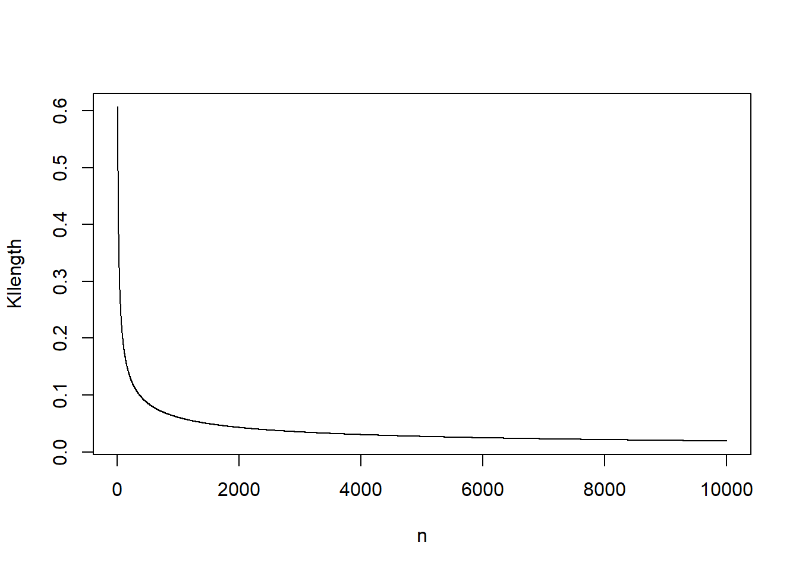
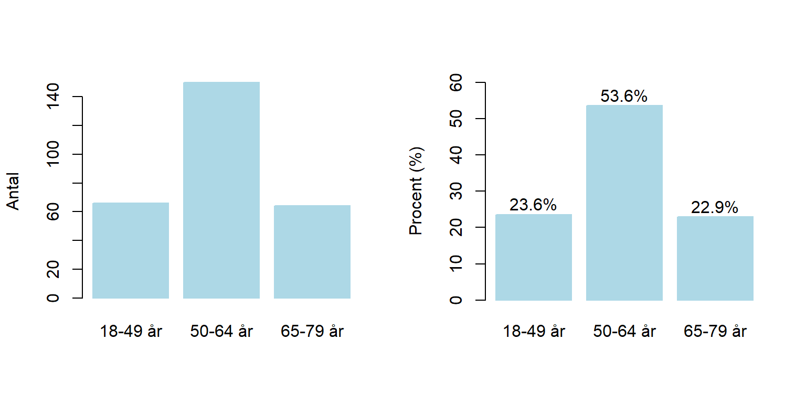
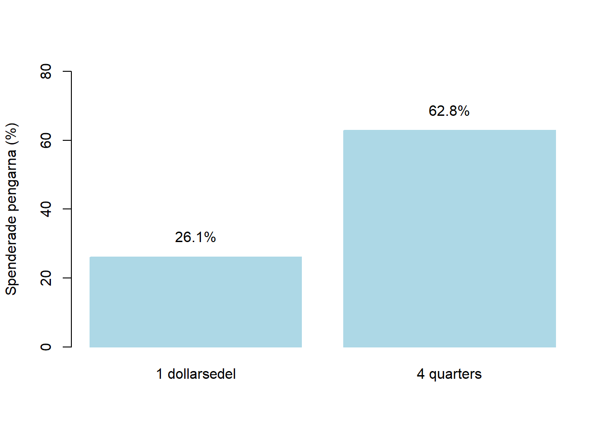
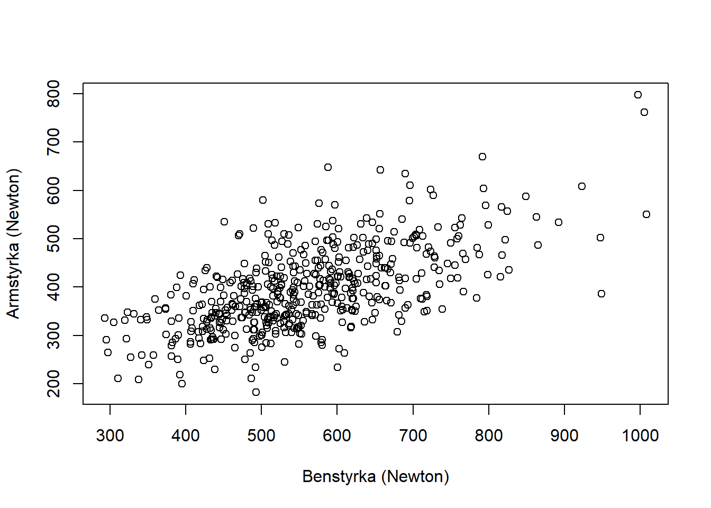

--- 
title: "Tillämpad statistik med R"
author: "Ronnie Pingel och Valentin Zulj"
date: "2020-12-01"
site: "bookdown::bookdown_site"
documentclass: book
output:
  bookdown::gitbook: default
bibliography: [references.bib, packages.bib]
biblio-style: apalike
link-citations: yes
---

# Introduktion

Detta material utgör kurslitteratur till kursen Tillämpad statistik (A5). Observera att materialet kommer att utökas under kursens gång.


## Om statistisk programmering med R

På denna kurs arbetar vi med R, som är ett programspråk och en miljö för statistisk dataanalys (https://www.r-project.org/) som fungerar på UNIX plattformar, Windows och MacOS.  Det finns flera anledningar till att vi valt R:

+ R är gratis och har en öppen källkod. 
+ R ger tillgång till avancerade verktyg för dataanalys och datavisualisering.
+ Användare av R bidrar ofta med egen programkod och egna paket, vilket innebär att en omfattande mängd funktioner enkelt går att implementera.
+ Många läroböcker skrivs med utgångspunkt från R.
+ Online-resurserna är mycket stora. Det finns många forum där användare av R kan få hjälp (t ex https://stackoverflow.com/).
+ R är ett av de absolut vanligaste programmen för statistisk dataanalys. (http://r4stats.com/2019/04/01/scholarly-datasci-popularity-2019/)

Finns det anledningar till att inte välja R?

+ Det finns ingen officiell support.
+ Eftersom R bygger på användarnas bidrag finns ingen garanti att funktioner fungerar som de ska.
+ Jämfört med andra programspråk kan R uppfattas som långsamt.

För den som van vid menybaserade system (sk point-and-click) kan dessutom kodning uppfattas som en nackdel. Det finns emellertid **etiska** och **praktiska** skäl att lära sig programmera i statistikprogram (dvs att i kod skriva ange hur data ska hanteras och analyseras), och inte förlita sig på menyer.  Programmering

+ är nödvändig för att tillförlitligt upprepa (replikera) dataanalyser. På företag och på myndigheter ska kolleger kunna ta över datamaterial och tillhörande analyser och på nytt genomföra dessa med samma resultat. Samma sak gäller inom forskning, där andra forskare ska erhålla samma resultat givet samma data och analys. Notera att detta även gäller för dig själv, dvs det är inte ovanligt att som analytiker på nytt upprepa en analys. 
+ spar tid för repetativa moment, t ex om många liknande analyser ska genomföras.  
+ ger möjlighet till avancerade analyser samt frihet att utforma egna analyser.
+ bidrar till ökad förståelse för dataanalys.

Kruxet? Statistisk programmering tar längre tid att lära sig jämfört med att lära sig menybaserad datahantering och analyser! Tabell 2.1  redovisar några reflektioner över ett antal vanliga statistikprogram.


Table: (\#tab:unnamed-chunk-2)En jämförelse av några vanliga statistikprogram

--------  --------------------------------------------------------------------------------------------------------------------------------------------------------------------------------------------------------------------------------------------------------------------------------
Minitab   Mycket enkelt att lära sig. Används främst inom kvalitetskontroll i industri samt planering av randomiserade försök. Billigt. Begränsat urval av statistiska metoder                                                                                                            
SPSS      Enkelt att lära sig. Stor spridning bland samhällsvetare och utredare. Ganska stort urval av statistiska metoder som är organiserade på ett något rörigt sätt. Krånglig programkod.                                                                                             
Stata     Enkelt att lära sig och mycket enkel programkod. Spridning bland forskare inom ekonometri och epidemiologi.  Stort urval av, även de senaste, statistiska metoderna                                                                                                             
SAS       Medelsvårt att lära sig, med en föråldrad programkod. Kan hantera stora dataset. Används av myndigheter, industri och forskare inom alla områden. Standard för läkemdelsbolag. Stort urval av statistiska metoder, men inte de allra senaste. Dyrt. Svårt att göra bra figurer. 
R         Svårt att lära sig. Gratis. Flexibelt. Mycket stor spridning inom alla områden för dataanalys. Enkel programkod.                                                                                                                                                                
Python    Mycket svårt att lära sig. Gratis. Flexibelt.  Stor spridning inom maskininlärning och AI.                                                                                                                                                                                      
--------  --------------------------------------------------------------------------------------------------------------------------------------------------------------------------------------------------------------------------------------------------------------------------------

Varför är inte Excel, Open Office Calc, Google Docs och andra kalkylprogram inkluderade i jämförelsen? SVaret är enkelt.  Dessa är nämligen inga statistikprogram! Ofta saknas i sådana program viktiga statistiska funktioner och dessutom är den numeriska tillförlitligheten lägre än för konventionella statistiskprogram (Keeling, K. B., & Pavur, R. J., 2011). 

## Allmänna tips om R på kursen
Det tar tid att lära sig R. Det kan även vara frustrerande, inte minst eftersom programmering är inte förlåtande vad gäller fel. 
Men misströsta inte, i slutändan är det värt det och är i högsta grad tidsbesparande. Här följer några tips vad gäller inlärningen och användandet av R under kursens gång:

+ Se till	att snabbt få grunderna på plats. R kommer att användas löpande under kursens gång.
+ Arbeta aktivt med R. Programmering lär man sig genom tillämpning, inte genom att läsa. Det krävs normalt sett många timmar av aktivt arbete för att lära sig ett programspråk. Använd därför R till att lösa övningsuppgifter och att replikera exempel från föreläsningar. På så vis får du rutin vad gäller användandet av R.  
+ Använd kod som presenterats på kursen. Ändra och laborera i färdig kod för att se vad som händer. Det är inte viktigt att kunna skriva all kod utantill, däremot ska man förstå skriven kod och kunna manipulera denna för sitt syfte.
+ Lös övningsuppgifter på följande vis: 1. Läs uppgiften och skissa därefter på papper upp en lösning, men gör inga beräkningar inte. Skriv ner antaganden och formler. 2. Lös sedan uppgiften med hjälp av beräkningar i R.  Om du fastnar, studera  R-koden i lösningsförslaget  förstå hur  hur uppgiften har lösts med hjälp R alternativt använd kod som presenterats på kursen.  3. Räkna därefter igenom uppgiften för hand. När du känner dig helt trygg med att räkna för hand kan du så småningom hoppa över detta moment. 4. Fyll i din papperslösning och avsluta med ett svar.
+ Var inte rädd för att använda resurser på nätet. Se ovan. 
+ Kontakta lärare och lärarassistenter på kursen om ni fastnar och har frågor. Utnyttja de lärarledda sessionerna.
+ Samarbeta och diskutera i  de diskussionsforum som skapats för er studenter.

På denna kurs rekommenderas att ni **endast skriver kod på det sätt som det presenteras på kursen**. Visserligen är R oerhört flexibelt och en uppgift går att lösa på en mängd sätt. Koden som presenteras på kursen är emellertid framtagen för att vara tydlig och tillförlitlig och syftet är att du ska bli trygg med att beräkningarna är korrekta snarare än effektiva. 


Slutligen, så är det bra att som läsare ha  i åtanke att all beskrivning av kodens funktionalitet inte är uttömmande. Syftet är nämligen att lära ut vad som är nödvändigt för denna kurs och då behövs inte en fullständig beskrivning av till exempel vad ett verktyg i R kan göra. 

Lycka till!

***


## Sammanfattning

<style>
div.red{ background-color:#F5B7B1; border-radius: 5px; padding: 20px;}
</style>
<div class = "red">

 <font size="5">  </font>
Du ska kunna

- motivera varför statistisk programmering är nödvändig för arbete med data och dataanalyser.

</div>

***

## Referenser
Keeling, K. B., & Pavur, R. J. (2011). Statistical accuracy of spreadsheet software. The American Statistician, 65(4), 265-273.


<!--chapter:end:index.Rmd-->

# Att börja använda R

I detta kapitel ska du inledningsvis installera R samt ett gränssnitt som kallas för RStudio. RStudio kan liknas vid en avancerad textredigerare som underlättar arbetet med R. Det går visserligen alldeles utmärkt att använda R som det är, men RStudio förenklar i många avseenden programmeringen.
 


## Installation av R och RStudio

Vid programmering är det mycket viktigt att noga följa instruktioner. Du ska nu **först** installera R. 
**Därefter** ska du installera RStudio. 


### Installation av R på MacOS

1. Ladda ner den senaste versionen från https://cran.r-project.org/bin/macosx/. 

Notera att versionen
måste passa för ditt MacOS. Leta upp den version som passar till ditt MacOS
om du har en äldre Mac.

2. Ladda ner pkg-filen under *Latest release*. Öppna den nedladdade .pkg-filen och installera R.

### Installation av R på Windows
1. Gå till hemsidan https://cran.r-project.org/bin/windows/base/.

2. Klicka på ''Download R (versionnummer) for Windows''. Eventuellt fungerar inte den senaste versionen ditt Window om du har en äldre Windows-versions. Prova då en tidigare version av R. Du kanske även upptäcker att senaste versionnummer på Rs hemsida inte är samma som används i detta exempel eftersom det kan ha kommit senare versioner. För din del saknar just detta praktisk betydelse.


3. Dubbelklicka på ''R installer'' för att starta installationen.

4. Välj språk och tryck **OK**.


5. Välj **Next**.


6. Välj sökväg för din installation. Låt default vara. Klicka **Next**.


7. För att förenkla, välj alla komponenter för installation. Klicka **Next**.


8. Klicka **No (accept defaults)**.


9. För att lägga till R i Startmenyn, klicka bort kryssrutan nedan. Klicka **Next**.


10. Välj om du vill ha genvägar. Klicka **Next**. 


11. Installation börjar! Starta R när den är klar.


12. Starta R för första gången.
På Windows ser det ut så här.


## Installation av RStudio
Av olika anledningar väljer vi att inte arbeta i R Editor utan vi väljer RStudio. Stäng därför ner R. 

1. Gå till https://rstudio.com/products/rstudio/download/}. 
2 Välj RStudio Desktop Free. 
3 Välj sedan den version stämmer överens med ditt operativsystem.
4. Installera (på Windows) genom att klicka **Next->Next->Install**
5. Starta RStudio. 

Du ska nu fått upp nedanstående. Vi ska i detalj beskriva vad de olika panelerna till höger kommer vi återkomma till när det är aktuellt.


6. Avsluta RStudio.


Om du mot förmodan inte skulle lyckas installera R och RStudio, så finns möjligheten att koppla upp sig till Statistiska institutionens datorer via fjärrskrivbordet och på så sätt få tillgång nödvändig programvara.


## Första sessionen 
I denna session ska du bekanta dig med R och prova använda R som en miniräknare. Starta RStudio. Till vänster ska du ha en panel som heter **Console**. I denna panel redovisas resultat. Vad övriga paneler gör kommer vi återkomma till när det blir aktuellt. Välj i menyn **File > New File > R Script**. Ett nytt fönster (Untitled1) öppnas ovanför **Console** 


Detta är ett script-fönster eller en **editor**. I editorn skrivs kommandon in som sedan kan utvärderas av R. Resultaten redovisas i  **Console**. Ha för vana att **aldrig** skriva kod direkt i R Console. I princip är en script-fil inte annorlunda än en vanlig textfil, förutom att filen har tillägget *.R*. Spara script med jämna mellanrum eftersom det är önskvärt att inte förlora sin kod ifall något oförutsett händer. Skapa därför en mapp med namnet **A5Rkod** på din dator. Välj **File > Save As...** och spara i  **A5Rkod** scriptet **Untitled** med namnet **myfirstscript.R**.

Efter att vi har skrivit koden i editorn måste vi meddela R att koden ska utvärderas. Kod i scriptfilen körs (exekveras) på tre olika sätt: 

1. En rad: Raden där markören är placerad körs med Ctrl+Enter (command + Enter på Mac) eller Run ovanför scriptet.
2. Flera rader: Markera kodavsnittet och tryck Ctrl+Enter (command + Enter på Mac) eller Run.
3. Hela scriptet: Ctrl+Shift+Enter

Det finns några viktiga punkter att ha i åtanke:

*  Om avsikten är att köra kod som sträcker
sig över flera rader måste man avsluta raden med räknetecken $(+,-,*,/)$, kommatecken $,$ eller vänsterparentes $($.
* En rad inleds aldrig med räknetecken eller kommatecken.
* En rad som inleds med **#** exekveras inte.  Tecknet  **#** används för att kommentera koden, vilket viktigt eftersom vi då i text kan förklara  vad koden gör. 


1. Skriv in nedanstående script till **myfirstscript.R**. Spara.


```r
# Detta är mitt första R-script som heter myfirstscript.R. 
# I detta script använder jag R som miniräknare samt 
# exekverar kod från scriptet.
1+1
1+3
2-7
2*3
4/5
3^2
```


2. Använd R som miniräknare genom att prova alla **tre** sätt att köra kod. Det är nödvändigt att bekanta sig med hur kod körs för att bli bekväm med att simultant arbeta i script-fönstret och se resultat i Console. Återigen, skriv **aldrig** i Console.


```r
1+1
[1] 2
1+3
[1] 4
2-7
[1] -5
2*3
[1] 6
4/5
[1] 0.8
3^2
[1] 9
```

3.  Matematiska funktioner, t ex kvadratroten, finns implementerade i R. Skriv `sqrt(6)` i scriptet och spara. Kör koden och erhåll följande i Console.


```r
sqrt(6)
[1] 2.44949
```

4. Även exponentialfunktionen $\exp(x)$ finns i R. Skriv `exp(3)`  i script-filen, spara och kör. 


```r
exp(3)
[1] 20.08554
```


5. Konstanten $\pi$ finns i R. Skriv `pi` i script-filen, spara och kör.

```r
pi
[1] 3.141593
```

6. Kod finns ofta på flera rader. Anta att vi önskar beräkna $2 + 2+ 3+ 5$ men att koden inte får plats på en rad utan måste delas upp på två rader. Skriv in följande rader i scriptet, spara, markera bägge raderna och kör.

```r
# Kod över 2 rader
2 + 2 + 
3 + 5

```

Följande resultat ska presenteras i Console.


```r
# Kod över 2 rader
2 + 2 + 
3 + 5
[1] 12
```

7. Kod finns ofta på flera rader. Skriv in följande rader i scriptet, spara, markera bägge raderna och kör. Jämför resultatet med punkt 6! 


```r
2 + 2 
+  3 + 5
```

Nu utvärderas raderna var för sig, vilket inte var avsikten med analysen.


```r
2 + 2 
[1] 4
+  3 + 5
[1] 8
```

**Grattis!** Du har nu genomfört din första session i R. Scriptet ska se ut enligt nedan. Spara och stäng R.


```r
# Detta är mitt första R-script som heter myfirstscript.R. 
# I detta script använder jag R som miniräknare samt 
# exekverar kod från scriptet.
1+1
1+3
2-7
2*3
4/5
3^2
# Kvadratroten
sqrt(6)
# Exponentialfunktionen 
exp(3)
# Pi 
pi
# Kod över 2 rader
2 + 2 + 
3 + 5
2 + 2 
+  3 + 5
```


## Paket
En viktig styrka med R är det stora antalet tillgängliga paket utvecklade av användare. Grundinstallationen av R är nämligen tämligen begränsad vad gäller funktionalitet, men med alla paket utvidgas den statistiska verktygslådan, de grafiska möjligheterna och förmågan att hantera olika typer av data rejält. Det finns ungefär 15000 paket på "The Comprehensive R Archive Network" (CRAN) som är Rs arkiv för paket:

https://cran.r-project.org/web/packages/available_packages_by_name.html

Det finns ytterligare tusentals andra paket som dock inte genomgått samma granskning som paketen på CRAN, till exempel på github. Eftersom antalet paket är överväldigande för nybörjaren kan det vara ett stöd att känna till de vanligaste paketen. Ett förslag på en lista över viktiga paket finns här:

https://support.rstudio.com/hc/en-us/articles/201057987-Quick-list-of-useful-R-packages

För att installera ett paket skriver man in paketnamnet med ett kommando alternativt använda menyn i RStudio under *Tools > Install Packages**.

Vi exemplifierar nu med ett paket som hjälper oss att läsa data från Excel-filer. Funktionalitet för inläsning från Excel-filer finns inte i basversionen av R, därför är detta paket nödvändigt om data är sparat i en Excelfil. 

Vi installerar paketet **readxl** genom att i Console skriva in `install.packages("readxl")` och trycka enter.
Som tidigare nämnt går det även att installera paket via menyn. 
Efter installationen finns paketet sparat på din dator. R har emellertid inte ännu aktiverat det. Genom att skriva `library("readxl")` och trycka enter aktiveras paketet.
Nu kan analyser i R utnyttja paketets funktionalitet. 

Observera att ett paket måste aktiveras på nytt varje gång RStudio öppnas. Dock behövs det bara installeras en enda gång.

***

## Sammanfattning

<style>
div.red{ background-color:#F5B7B1; border-radius: 5px; padding: 20px;}
</style>
<div class = "red">

 <font size="5">  </font>
Du ska kunna

- installera R och Rstudio och starta det utan felmeddelanden. 
- använda R som miniräknare och använda de olika metoderna för att exekvera kod i editorn.
- installera ett R-paket och aktivera det. 

</div>

***

## Övningar

### Övning 2.1 {-}
Du har ett stickprov betående av observationerna $4,-2,5,6,8$. 

a) Beräkna medelvärdet.
b) Beräkna standardavvikelsen.
c) Beräkna variationsbredden.
d) Beräkna det geometriska medelvärdet för de positiva värden $4, 5, 6, 8$.
e) Beräkna det geometriska medelvärdet för alla värden $4, -2, 5, 6, 8$.

<button title="q201" type="button"
onclick="if(document.getElementById('q201') .style.display=='none')
              {document.getElementById('q201') .style.display=''}
            else{document.getElementById('q201') .style.display='none'}">
  Visa svar
</button>
  
<div id="q201" style="display:none">
<div class="alert alert-info">

a) Medelvärdet $\bar{x}$ beräknas i R i editorn med


```r
(4 + (-2) + 5 + 6 + 8)/5
```

vilket i Console ger svaret


```
## [1] 4.2
```

* Svar: Medelvärdet är 4.2

b) Standardavvikelsen $s$ beräknas i R i editorn antingen genom att direkt tillämpa formeln för stickprovets standardavvikelse

$$s=\sqrt{\dfrac{\sum_{i=1}^n (x_i -\bar{x})^2}{n-1}}$$


```r
sqrt( ( ( 4 - (4 + (-2) + 5 + 6 + 8)/5 )^2 + 
      ( (-2) - (4 + (-2) + 5 + 6 + 8)/5 )^2 + 
      ( 5 - (4 + (-2) + 5 + 6 + 8)/5 )^2 + 
      ( 6 - (4 + (-2) + 5 + 6 + 8)/5 )^2 + 
      ( 8 - (4 + (-2) + 5 + 6 + 8)/5 )^2 ) / (5-1) )
```

eller genom att använda beräkningsformeln $$s=\sqrt{\dfrac{\sum_{i=1}^{n}x_i ^2 - (\sum_{i=1}^n x_i)^2/n}{n-1}}$$.

```r
sqrt( ( 4^2 + (-2)^2 + 5^2 + 6^2 + 8^2 - (4 + (-2) + 5 + 6 + 8)^2/5 )/ (5-1) )
```

Oavsett formel erhålls i Console svaret

```
## [1] 3.768289
```

* Svar: Standardavvikelsen är 3.768

c) Variationsbredden, dvs skillnaden mellan det största och det minsta värdet är


```r
8 - (-2)
```

```
## [1] 10
```


* Svar: Variationsbredden är är 10.

d) Det geometriska medelvärdet $$\bar{x}_g=(x_1\cdot x_2 \cdot \cdots \cdot x_n)^{1/n}$$ kan i R beräknas med 


```r
(4  * 5 * 6 * 8)^(1/4)
```

```
## [1] 5.566315
```

* Svar: Det geometriska medelvärdet är 3.95.

e) Det geometriska medelvärdet $$\bar{x}_g=(x_1\cdot x_2 \cdot \cdots \cdot x_n)^{1/n}$$ kan i R beräknas med 


```r
(4  * (-2) * 5 * 6 * 8)^(1/5)
```

```
## [1] NaN
```

* Svar: Eftersom en observation är negativ   blir NaN, vilket betyder ''Not a Number''. Det går alltså inte att beräkna. 

</div>
</div>
</br>

### Övning 2.2 {-}
Ett slumpmässigt urval ger följande observationer $0, 1, 1, 0, 0, 0, 0, 0, 1, 0, 1, 0, 1$,där $1=Arbetslös$ och $0=Förvärvsarbetande$.
Beräkna andelen arbetslösa i stickprovet.


<button title="q202" type="button"
onclick="if(document.getElementById('q202') .style.display=='none')
              {document.getElementById('q202') .style.display=''}
            else{document.getElementById('q202') .style.display='none'}">
  Visa svar
</button>
  
<div id="q202" style="display:none">
<div class="alert alert-info">

Andelen arbetslösa beräkna i R med

```r
(0 + 1 + 1 + 0 + 0 + 0 + 0 + 0 + 1 + 0 + 1 + 0 + 1)/13 
```

```
## [1] 0.3846154
```

* Svar: Andelen arbetslösa i stickprovet är 0.38.

</div>
</div>
</br>

### Övning 2.3 {-}
Kosumentpriset 2006-2011  är 


Table: (\#tab:unnamed-chunk-37)Konsumentprisindex (KPI) 2006-2011

-----  ------
 2006   284.2
 2007   290.5
 2008   300.6
 2009   299.7
 2010   303.5
 2011   311.4
-----  ------

Med hur många procent har prisnivån förändrats från 2007 till 2010?

<button title="q203" type="button"
onclick="if(document.getElementById('q203') .style.display=='none')
              {document.getElementById('q203') .style.display=''}
            else{document.getElementById('q203') .style.display='none'}">
  Visa svar
</button>
  
<div id="q203" style="display:none">
<div class="alert alert-info">

Beräkning i R ger

```r
303.46/290.51
```

```
## [1] 1.044577
```

* Svar: Prisnivån har ökat med 4.5%.

</div>
</div>
</br>

### Övning 2.4  {-}
Denna övningar handlar om potentslagarna. Då $x$ och $y$ är reella och $a,b>0$ gäller följande likheter:

1. $a^x\cdot a^y=a^{x+y}$
2. $(a^x)^y=a^{xy}$
3. $\left(\frac{a}{b}\right)^x=\frac{a^x}{b^x}$
4. $\frac{a^x}{a^y}=a^{x-y}$
5. $a^x \cdot b^x=(ab)^x$
6. $a^0=1$

Beräkna nedanstående uttryck relatera svaren till potenslagarna.

a) $4^2 + 4^3$
b) $4^2*4^3$
c) $4^5$
d) $(4^2)^3$
e) $4^15$
f) $4^2/4^3$
g) $4^{-1}$
h) $4^{-2}$
i) $1/(4^2)$
j) $1/16$
k) $3^4*4^4$
l) $12^4$


<button title="q204" type="button"
onclick="if(document.getElementById('q204') .style.display=='none')
              {document.getElementById('q204') .style.display=''}
            else{document.getElementById('q204') .style.display='none'}">
  Visa svar
</button>
  
<div id="q204" style="display:none">
<div class="alert alert-info">

I R kan uttrycken enkelt beräknas.

```r
4^2 + 4^3
[1] 80
4^2*4^3
[1] 1024
4^5
[1] 1024
(4^2)^3
[1] 4096
4^15
[1] 1073741824
4^2/4^3
[1] 0.25
4^{-1}
[1] 0.25
4^{-2}
[1] 0.0625
1/(4^2)
[1] 0.0625
1/16
[1] 0.0625
3^4*4^4
[1] 20736
12^4
[1] 20736
```


Vi ser att för $b= c$ pga  1. $d= e$  pga 2. $k=l$ pga 5. Vidare gäller...
</div>
</div>
</br>


### Övning 2.5  {-}
Den naturliga logaritmen, dvs logaritmen med
basen $e \approx 2.718282$, används ofta i statistiska beräkningar. Några logaratimlagar som gäller för naturliga logaritmen är:

1. $\ln\, \left (x\cdot y \right )=\ln\,x+\ln\,y$
2. $\ln\, \left (x/ y \right )=\ln\,x-\ln\,y$
3. $\ln\,x^{a}=a\cdot \ln\,x$
4. $\ln e = 1$
5. $e^{\ln x} = x$
6. $\ln^{e^x} = x$

Beräkna nedanstående uttryck och relatera svaren till logaritmlagarna

a) $\ln(3*4)$
b) $\ln(3) + \ln(4)$
c) $\ln(3/4)$
d) $\ln(3) - \ln(4)$
e) $\ln e$
f) $\ln e^5$
g) $e^{5+6}$
h) $e^5*e^6$
i) $5 \ln 5 + 6 \ln 6


<button title="q205" type="button"
onclick="if(document.getElementById('q205') .style.display=='none')
              {document.getElementById('q205') .style.display=''}
            else{document.getElementById('q205') .style.display='none'}">
  Visa svar
</button>
  
<div id="q205" style="display:none">
<div class="alert alert-info">

I R kan uttrycken enkelt beräknas.


```r
log(3*4)
[1] 2.484907
log(3) + log(4)
[1] 2.484907
log(3/4)
[1] -0.2876821
log(3) - log(4)
[1] -0.2876821
log(exp(1))
[1] 1
log(exp(5))
[1] 5
exp(5+6)
[1] 59874.14
exp(5)*exp(6)
[1] 59874.14
5*log(5) + 6*log(6)
[1] 18.79775
```

</div>
</div>
</br>

### Övning 2.6  {-}
Låt observationerna $4,-2,5,6,8$ vara obundet slumpmässigt urval från en normalfördelad population. Genomför en hypotesprövning på 5\% signifikansnivå för att testa medelvärdet i population är skild från 1.

<button title="q206" type="button"
onclick="if(document.getElementById('q206') .style.display=='none')
              {document.getElementById('q206') .style.display=''}
            else{document.getElementById('q206') .style.display='none'}">
  Visa svar
</button>
  
<div id="q206" style="display:none">
<div class="alert alert-info">

1. Vi observerar $x=\{4,-2,5,6,8\}.$
2. Hypoteser: $H_0:\mu=0$ vs $H_1:\mu \neq 0$ 
3. Antaganden: Variabeln $x$ är normalfördelad i populationen. Populationsvariansen $\sigma^2$ är okänd i populationen. Vi har ett litet stickprov, $n=5$.
4. Testfunktionen ges av $t=\dfrac{\bar{x}-\mu}{\sqrt{s^2/n}}$. Denna teststatistika är $t$-fördelad med $n-1$ frihetsgrader om nollhypotesen är sann. 
5. Beslutregel: $\alpha=0.05$. Tvåsidigt test, förkasta därför $H_0$ om $|t_{obs}| > t_{krit} = t_{4,\alpha/2=0.025} = 2.776$


```r
( (4 + (-2) + 5 + 6 + 8)/5 - 1 )/sqrt( ( 4^2 + (-2)^2 + 5^2 + 6^2 + 8^2 - (4 + (-2) + 5 + 6 + 8)^2/5 )/ (5-1)/5 )
[1] 1.898851
```

Eftersom $t_{obs}=$ 1.8988507 $< 2.776 = t_{krit}$ kan vi inte förkasta nollhypotesen.

* Svar: Vi kan  på 5% signifikansnivå inte påvisa att medelvärdet i populationen är skilt från 1. Notera att detta **inte** innebär att vi visar att medelvärdet är 1.

</div>
</div>
</br>

### Övning 2.7  {-}
Du observerar följande datapunkter $x = \{4,7,2,4,6\}$ och $y=\{7,3, 2, 5,6}\$.


a) Använd minsta-kvadratmetoden och beräkna koefficienterna $a$ och $b$ i regressionslinjen $y=a + bx$.
b) Använd koefficienterna och ge en prediktion för $y$ givet att $x=7$.
c) Beräkna residualen för $x=7$
d) Beräkna residualspridningen.


<button title="q207" type="button"
onclick="if(document.getElementById('q207') .style.display=='none')
              {document.getElementById('q207') .style.display=''}
            else{document.getElementById('q207') .style.display='none'}">
  Visa svar
</button>
  
<div id="q207" style="display:none">
<div class="alert alert-info">

a) Riktningskoefficienten ges av
$$b=\dfrac{\sum_{i=1}^n(x_i-\bar{x})(y_i-\bar{y})}{\sum_{i=1}^n(x_i - \bar{x})^2}$$

```r
# Direkt tillämpning av formeln ger 
( (4 - (4 + 7 + 2 + 4 + 6)/5) * (7 - (7 + 3 + 2 + 5 + 6)/5) + 
  (7 - (4 + 7 + 2 + 4 + 6)/5) * (3 - (7 + 3 + 2 + 5 + 6)/5) +
  (2 - (4 + 7 + 2 + 4 + 6)/5) * (2 - (7 + 3 + 2 + 5 + 6)/5) +
  (4 - (4 + 7 + 2 + 4 + 6)/5) * (5 - (7 + 3 + 2 + 5 + 6)/5) +
  (6 - (4 + 7 + 2 + 4 + 6)/5) * (6 - (7 + 3 + 2 + 5 + 6)/5) ) /
( (4 - (4 + 7 + 2 + 4 + 6)/5)^2 + 
  (7 - (4 + 7 + 2 + 4 + 6)/5)^2 +
  (2 - (4 + 7 + 2 + 4 + 6)/5)^2 + 
  (4 - (4 + 7 + 2 + 4 + 6)/5)^2 +
  (6 - (4 + 7 + 2 + 4 + 6)/5)^2 )
[1] 0.2105263
# Det går att räkna ut detta i flera steg genom att 
# t ex beräkna täljare och nämnare separat. 
# Alternativt använda beräkningsformeln

( 4*7 + 7*3 + 2*2 + 4*5 + 6*6 - (4+7+2+4+6)*(7+3+2+5+6)/5 )/
( (4^2 + 7^2 + 2^2 + 4^2 + 6^2) -  (4 + 7 + 2 + 4 + 6)^2/5 )  
[1] 0.2105263

# En kommentar: Dessa beräkningar kommer förenklas betydligt i R, vilket vi ska se senare.
```


Interceptet är $a=\bar{y} - b\bar{x}$

```r
(7 + 3 + 2 + 5 + 6)/5 - 0.2105*(4 + 7 + 2 + 4 + 6)/5  
[1] 3.6317
```

* Svar: Riktningskoefficienten beräknas till $b=0.2105$, vilket tolkas som att om $x$ ökar en enhet så ökar $y$ i *genomsnitt* med $0.2105$ 
enheter. Interceptet beräknas till $a=3.632$, vilket tolkas som medelvärdet för $y$ när $x=0$.

b) Använd koefficienterna från regressionslinjen och sätt in värdet $x=7$.

```r
3.6316   +    0.2105*7  
[1] 5.1051
```

* Svar: Prediktionen $\hat{y}=$ 5.1051. Detta är punkten på regressionslinjen när $x=7$ och vår bästa gissning för det $y$-värde en individ med värdet $x=7$ kommer att ha.   


c) En residual är skillnaden mellan ett predicerat värde och det faktiska observerade värdet, $\hat{\varepsilon}=y_i - \hat{y}$.
Eftersom $y=3$ när $x=7$ så residualen  


```r
3 - (3.6316   +    0.2105*7) 
[1] -2.1051
```

* Svar: Residualen för $x=7$ är -2.1051.

d)
Residualspridningen ges av $$s_\varepsilon=\sqrt{\dfrac{\sum_{i=1}^n(y_i - \hat{y}_i)^2}{n-2}}= \sqrt{\dfrac{\sum_{i=1}^n\hat{\varepsilon}_i^2}{n-2}}$$. Vi beräknar på samma sätt som i c) övriga residualer, kvadrerar och summerar. 


```r
sqrt(
( (7 - (3.6316   +    0.2105*4))^2 +
  (3 - (3.6316   +    0.2105*7))^2 +
  (2 - (3.6316   +    0.2105*2))^2 +
  (5 - (3.6316   +    0.2105*4))^2 +
  (6 - (3.6316   +    0.2105*6))^2 ) / 
  (5 - 2) )
[1] 2.347077
```

* Svar: Residualspridningen är 2.347
  
(Notera att $\sum_{i=1}^n \hat{\varepsilon}_i^2$ kallas för *residualkvadratsumman*.)

</div>
</div>
</br>

### Övning 2.8  {-}

1. Installera paketet **MASS** som innehåller funktioner som kan vara användbara senare på kursen.
2. Aktivera det installerade paketet **MASS**.


<button title="q208" type="button"
onclick="if(document.getElementById('q208') .style.display=='none')
              {document.getElementById('q208') .style.display=''}
            else{document.getElementById('q208') .style.display='none'}">
  Visa svar
</button>
  
<div id="q208" style="display:none">
<div class="alert alert-info">


```r
# Installera paket
install.packages("psych")
# Aktivera paket
library("psych")
```

</div>
</div>
</br>

<!--chapter:end:02-installation.Rmd-->

# Data, objekt och funktioner

För att kunna arbeta med statistik och dataanalys är det viktigt att inte enbart förstå den statistiska metoden och kunna lösa problem med hjälp av en miniräknare. I praktiken är det även nödvändigt att förstå hur data hanteras, lagras och struktureras. I detta kapitel introduceras typer av data som normalt hanteras i R, sedan följer avsnitt om de olika typer av objekt som finns i R. Kapitlet avslutas med se på vad en funktion i R är för något och hur funkioner kan användas för att hantera objekt. Detta är ett omfattande kapitel, men det är viktigt att du kan hantera *allt* som presenteras. Avsikten med kaptitlet är nämligen att ta upp de allra vanligaste. 

## Data och objekt
Utan data är statistik innehållslöst. På samma sätt är data grundläggande för arbete i R. De vanligaste datatyperna i R är

+ character (text), som anges med citationstecken t ex "a", "3".
+ numeric (decimaltal), t ex är 3, 32.1. Notera att 3 kan skriva 3.0.
+ integer (heltal). 3, 32. Skillnaden mellan numeric och integer är att inga decimaler sparas, vilket spar minne. 
+ logical (data indikerar om något är sant eller falskt, TRUE/FALSE).

Observera att dessa datatyper beskriver hur data är lagrad och hur R ska tolka data. Det säger sig kanske självt att det inte går att använda räkneoperation om data är character (text). 

Datatyper ska inte förväxlas med de datanivåer (nominal, ordinal, intervall och kvotskala) som man normalt förknippar med statistiska analyser. Datatyper ska inte heller förväxlas med om data är diskreta, kontinuerliga, kategorier eller kvantitativa. 

Det är **mycket viktigt** för alla som arbetar med statistiska analyser av data att kunna tillämpa alla ovanstående begrepp på rätt situation. Ofta överlappar begreppen, men det är vanligt att begreppen inte gör det. Tabellen nedan ger en översikt av begreppen som används, men notera att det finns undantag från denna klassificering och det finns andra sätt att klassificera. 

| Mätskala  | Variabeltyp                                 |  Datatyp i R                          |
|-----------|---------------------------------------------|---------------------------------------|
| Nominal   | Kategori, kvalitativ                        | Character, factor med ordered = FALSE |
| Ordinal   | Kategori, kvalitativ                        | Character, factor med ordered = TRUE  |
| Intervall | Kvantitativ, kontinuerlig, heltal, diskret  | Numeric, integer                      |
| Kvot      | Kvantitativ, kontinuerlig, heltal, diskret  | Numeric, integer                      |


Data hanteras och sparas som **objekt**. För att skapa ett objekt används **assignment**-operatorn **<-**. Objektet sparas därmed i minnet i R, men inget resultat redovisas i Console. Om R stängs ner måste objektet skapas på nytt såvida användaren inte har angett att objektet ska sparas.

I regel arbetar man i R med flera olika objekt samtidigt. Objekten måste därför 
namnges och precis som Vid all programmering är noggrannhet a och o. Objektnamn inleds med en bokstav och får endast innehålla bokstäver, siffror, _ och ..
Dessutom skiljer R på versaler och gemener. Det är inte alltid enkelt att namnge objekt, men det
viktigaste är att vara konsekvent. På denna kurs rekommenderas följande principer för namngivning av objekt. Använd 

+ endast **gemener**.
+ **korta** och **logiska** namn, t ex kan objektet **population** förkortas till **pop**.
+ gärna understreck _ för sammanbinda långa objektnamn. Objektet ålder för kvinnor skulle kunna betecknas **age_women** och motsvarande för män är då **age_men**.
+ Använd inte å, ä och ö.
+ inte namn som redan är upptagna i R, t ex **exp** eller **log**.

Det tre vanligaste objekten för hantering av data är:

+ vektorer,
+ matriser,
+ data frames. 


## Vektorer 
En vektor är ett dataobjekt som är endimensionellt och består av $n$ element. En vektor skapas med kommandot **c()** (''Combine Values into a Vector''). Anta att vi observerar värdena $3,-1,1,5,0$. Med hjälp av nedanstående kod skapas ett vektor-objekt med med 5 element:


```r
# Skapa din första numeriska vektor
my__first_vec <- c(3, -1, 1, 5, 0)
```

Notera att inget visas i Console, men att objektet finns sparat i minnet upptäcker man i RStudio genom att observera den övre högra panelen under fliken **Environment**. Där listas alla objekt som finns sparade i minnet i R. För att titta på objektet exekveras objektet genom att köra nedanstående kod. 


```r
> # Visa din första numeriska vektor
> my__first_vec 
> [1]  3 -1  1  5  0
```


Du ska nu skapa ett antal vektorobjekt som sedan på olika sätt ska manipuleras. 

1. Skapa ett script som heter **kap3_objekt_och_funktioner.R** genom att välja *File > New File > R Script* och sedan direkt spara scriptet med *File > Save As* i mappen **A5Rkod**.  
2. Skriv in koden nedan i scriptet och spara med *File > Save*. Det är bra att få rutin på att ofta spara sitt script så att inte kod råkar försvinna.


```r
# Skapar två numeriska vektorer
x <- c(3, 1, 1, 5, 0)
y <- c(2, 3, 5, 6, 9)
# Kombinera vektorer till en ny vektor
z <- c(x, y)
```

Generellt gäller i R att om $x$ är en vektor bestående av $k$ element
$$x = (x_1,x_2,\ldots,x_k)$$
och $y$ är en vektor bestående av $l$ element
$$y = (y_1,y_2,\ldots,y_l)$$
så skapar kommandot 


```r
z <- c(x,y)
```

en vektor med $k + l$ element, 
$$z= (x_1,x_2,\ldots,x_k,y_1,y_2,\ldots,y_l)=(z_1,z_2,\ldots,z_{k+l}).$$
För att se om detta stämmer tittar vi på objekten genom att exekvera dem. 

3. Fortsätt scriptet genom att skriva in nedanstående kod. Spara och kör koden.


```r
x
y
z
```

I Console ser du då följande: 


```r
> x
> [1] 3 1 1 5 0
> y
> [1] 2 3 5 6 9
> z
>  [1] 3 1 1 5 0 2 3 5 6 9
```

Både $x$, $y$ och $z$ är numeriska vektorer. Det går även att skapa en vektor bestående av bokstäver. För att skapa en sådan vektor (character vector) sätts de enskilda elementen inom citationstecken.

4. Fortsätt scriptet och skriv in nedanstående kod i scriptet, spara och kör koden.


```r
# Skapar en vektor med ord
nordic_countries <- c("Denmark", "Finland", "Iceland", "Norway", "Sweden")
nordic_countries
```

I Console ser du då följande resultat.


```r
> # Skapar en vektor med ord
> nordic_countries <- c("Denmark", "Finland", "Iceland", "Norway", "Sweden")
> nordic_countries
> [1] "Denmark" "Finland" "Iceland" "Norway"  "Sweden"
```

Kombineras en numerisk och en character-vektor blir hela vektorn en character-vector.  

5. Skriv följande kod i scriptet, spara och kör koden.


```r
# Kombinera en numerisk vektor med en vektor med ord
x_nordic_countries <- c(x, nordic_countries )
x_nordic_countries
```

I Console erhålls följande output och vi ser att de tidigare numeriska värdena nu omges av citationstecken.


```r
> # Kombinera en numerisk vektor med en vektor med ord
> x_nordic_countries <- c(x, nordic_countries )
> x_nordic_countries
>  [1] "3"       "1"       "1"       "5"       "0"       "Denmark" "Finland"
>  [8] "Iceland" "Norway"  "Sweden"
```

Om en numerisk vektor kombineras med en vektor med bokstäver så blir hela vektorn en character-vektor. R tolkas alltså siffrorna som bokstäver/tecken utan relation till numeriska värden. Det ser vi genom att 
det finns finns citationstecken kring siffrorna. 


Vi ska nu se introducera hur man på andra sätt kan skapa vektorer typer av vektorer.

6. Skriv in nedanstående kod i scriptet och spara. Kör koden.


```r
# Skapar en vektor med värdena 1,2,3,4,5
v <- 1:5
# Skapar en vektor med endast ett element
u <- 150
# Skapar en vektor med ett bortfall. 
ymis <- c(3, NA, 6, 3, 6)
```

I Console visas


```r
> # Skapar en vektor med värdena 1,2,3,4,5
> v <- 1:5
> # Skapar en vektor med endast ett element
> u <- 150
> # Skapar en vektor med ett bortfall. 
> ymis <- c(3, NA, 6, 3, 6)
```


För att sammanfatta så har vi har hittills skapat numeriska vektorer, vektorer som enbart innehåller bokstäver och vektorer som skapats genom  sekvenser. Vidare finns vektorer med bortfall anges med `NA` (Not Available).


<style>
div.green{ background-color:#abd4b3; border-radius: 5px; padding: 20px;}
</style>
<div class = "green">

 <font size="5">  </font>


+ En vektor som innehåller enbart en datatyp kallas för **atomic**. Detta kan vara värt att känna till eftersom eftersom det är vanligt att felmeddelande referar till just att en vektor inte är atomic.  
+ Inled en rad med # för att kommentera kod. *Kommentera alltid kod!*. Vid all programmering är det viktigt att förklara kod så att du själv och andra snabbt förstår vad koden gör.  Det är viktigt att få rutin på att kommentera, kommentera därför även enkel kod.
</div>

Nya vektorer kan skapas med räkneoperationer. Beräkningarna sker då **elementvis**, till exempel adderas elementvärden i en vektor till elementvärden i en annan vektor som har motsvarade position. Vektorerna måste

+ antingen **ha lika många element** eller
+ att den enda vektorna består av **en** konstant.

7. Skriv in nedanstående i ditt script, spara och kör.


```r
# Addition av x och y
x + y
# Multiplikation av x och y
x * y
# Potenser skrivs med a^b
y^2
# En konstant u adderas till alla element i vektorn
x + u 
# Räkneoperationer med NA ger NA
x + ymis 
# Division med 0 är ej definierat. R anger det som Inf (infinity) 
# eller NaN (Not a Number) om det är 0/0.
x/0
# Exempel på längre räkneoperationer. 
# Notera att alla beräkningar är elementvisa.
w <- x + (y^2 - u)/v
w
```

I Console visas 


```r
> # Addition av x och y
> x + y
> [1]  5  4  6 11  9
> # Multiplikation av x och y
> x * y
> [1]  6  3  5 30  0
> # Potenser skrivs med a^b
> y^2
> [1]  4  9 25 36 81
> # En konstant u adderas till alla element i vektorn
> x + u 
> [1] 153 151 151 155 150
> # Räkneoperationer med NA ger NA
> x + ymis 
> [1]  6 NA  7  8  6
> # Division med 0 är ej definierat. R anger det som Inf (infinity) 
> # eller NaN (Not a Number) om det är 0/0.
> x/0
> [1] Inf Inf Inf Inf NaN
> # Exempel på längre räkneoperationer. 
> # Notera att alla beräkningar är elementvisa.
> w <- x + (y^2 - u)/v
> w
> [1] -143.00000  -69.50000  -40.66667  -23.50000  -13.80000
```

Ovanstående illustrerar att genom att användning av objekt kan  beräkningar förenklas.

Nu ska vi se vad som händer om elemementen består av olika antal element. **Skriv i Console** in nedanstående kod och tryck enter.


```r
x + c(2,5,6)
```

I Console visas


```r
> x + c(2,5,6)
> Warning in x + c(2, 5, 6): longer object length is not a multiple of shorter
> object length
> [1] 5 6 7 7 5
```


Detta innebär att om vektorn $x$ (innehållande 5 element) adderas till en vektor bestående av endast 3 element, dvs antalet element skiljer sig åt, erhålls ett felmeddelande. Det gäller oavsett räknesätt. Om däremot den ena vektorn är en konstant, som i exemplet med vektorn $u$ ovan, fungerar beräkningarna genom att konstanten beräknas för alla element i den större vektorn.

### Vektorer och indexering

Vi ska nu presentera hur enskilda element kan väljas ut i vektorer. Eftersom data i praktiken alltid måste anpassas för planerade analyser är detta nödvändigt. Det mest grundläggande i hantering av vektorer  är att konstatera att varje element i en vektor har en position. Med hakparenteser `[]` erhålls åtkomst till ett eller flera element.

1. Skriv in nedanstående i ditt script, spara och kör.


```r
# Visa element nummer 2 i vektorn x 
x[2]
# Visa element 2, 3 och 4 i vektorn y
y[c(2,3,4)]
```

I Console redovisas 


```r
> # Visa element nummer 2 i vektorn x 
> x[2]
> [1] 1
> # Visa element 2, 3 och 4 i vektorn y
> y[c(2,3,4)]
> [1] 3 5 6
```

Det går även att spara utvalda element till en ny vektor. 

2. Skriv in nedanstående i ditt script.


```r
# Spara element nummer 2 i vektorn x2 
x2 <- x[2]
x2
# Visa element 2, 3 och 4 i vektorn y234
y234 <- y[c(2,3,4)]
y234
```

I Console redovisas 


```r
> # Spara element nummer 2 till vektorn x2 
> x2 <- x[2]
> x2
> [1] 1
> # Spara element 2, 3 och 4 till vektorn y234
> y234 <- y[c(2,3,4)]
> y234
> [1] 3 5 6
```

Det går att tillämpa **negativ indexering** för att **exkludera** angivna element. Resterande element i en vektor behålls då.

3. Skriv in nedanstående i scriptet, spara, och kör.


```r
# Spara element nummer 1,3,4,5 till vektorn x1345 
x1345 <- x[-2]
x1345
# Spara element 1 och 5 till vektorn y15
y15 <- y[-c(2,3,4)]
y15
```

I Console redovisas nedanstående.


```r
> # Spara element nummer 1,3,4,5 till vektorn x1345 
> x1345 <- x[-2]
> x1345
> [1] 3 1 5 0
> # Spara element 1 och 5 till vektorn y15
> y15 <- y[-c(2,3,4)]
> y15
> [1] 2 9
```

En viktigt skäl till att identifiera element är att användaren då på ett enkelt sätt kan hantera värden som identifierade element har.

4. Skriv i nedanstående i scriptet, spara och kör.


```r
# Ändra element 3 från 1 till 4
x_new <- x
x_new[3] <- 4
x_new 
# Ändra element 3 från "Iceland" till 4
nordic_countries_new <- nordic_countries
nordic_countries_new[3] <- 4
nordic_countries_new 
```

I Console redovisas nedanstående.


```r
> # Ändra element 3 från 1 till 4
> x_new <- x
> x_new[3] <- 4
> x_new 
> [1] 3 1 4 5 0
> # Ändra element 3 från "Iceland" till 4
> nordic_countries_new <- nordic_countries
> nordic_countries_new[3] <- 4
> nordic_countries_new 
> [1] "Denmark" "Finland" "4"       "Norway"  "Sweden"
```


Ovanstående kod illustrerar två vanliga företeelser: 

+ Vektorerna *x_new* och *nordic_countries_new* skapas på grund av att användaren ofta önskar behålla originalvektorerna *x* och  *nordic_countries*. Detta är ofta önskvärt.
+ Om ett numeriskt värde läggs till en vektor med bokstäver så tolkas det numeriska värdet som ett tecken, dvs *"4"*. Det illustrerar vikten av vara noga med om vektorerna är *numeriska* eller *character*


### Vektorer och logiska operatorer
Istället för att  direkt identifiera positionen i vektorn kan man använda **logiska operatorer**. Några vanliga och viktiga logiska operatorer är:

+ `>` är större än.
+ `<` är mindre än.
+ `>=` större än eller lika med	
+ `<=` mindre än eller lika med	
+ `==` lika med.
+ `!=` är ej lika med
+ `x|y` $x$ eller $y$
+ `x & y` $x$ och $y$

Genom att använda dessa kan användaren direkt hantera  data i vektorn. 

1. Fortsätt scriptet genom att skriva in nedanstående kod. Spara och kör koden.


```r
# Visa element i vektor y som är större än 6
y[y > 6]
# Visa element i vektor y som är större än eller lika med 6
y[y >= 6]
# Visa element i vektor y från positioner där x har värden lika med 1. 
# (Kräver att x och y har lika många element) 
y[x == 1]
# Visa element i vektor där x är ej lika med 1.
y[x != 1]
# Visa element i vektor y från positioner där nordic_countries == "Finland"
y[nordic_countries == "Finland"]
```

I Console visas 


```r
> # Visa element i vektor y som är större än 6
> y[y > 6]
> [1] 9
> # Visa element i vektor y som är större än eller lika med 6
> y[y >= 6]
> [1] 6 9
> # Visa element i vektor y från positioner där x har värden lika med 1. 
> # (Kräver att x och y har lika många element) 
> y[x == 1]
> [1] 3 5
> # Visa element i vektor där x är ej lika med 1.
> y[x != 1]
> [1] 2 6 9
> # Visa element i vektor y från positioner där nordic_countries == "Finland"
> y[nordic_countries == "Finland"]
> [1] 3
```

Precis som förut skapas i regel nya vektorer när logiska operatorer tillämpas.

2. Skriv in nedanstående i scriptet, spara och kör koden.


```r
# Välj vektorn som är större än eller lika med 6
ysub <- y[y >= 6] 

# Skapa en binär vektor x_bin som är 1 om x är större än eller lika med 3 och 0
# om x är mindre än 3. Börja med att skapa en tom vektor med motsvarande antal element
# och fyll sedan denna med saknade värden.
x_bin <- c(NA, NA, NA, NA, NA)
x_bin[x >=3] <- 1
x_bin[x < 3] <- 0

# Skapa en tom vektor med 5 element och fyll därefter denna vektor med
# data om landet är skandinaviskt eller ej
scandinavia <- c(NA, NA, NA, NA, NA) 
scandinavia[nordic_countries == "Finland"] <- "Not scandinavia"
scandinavia[nordic_countries == "Denmark"] <- "Scandinavia"
scandinavia[nordic_countries == "Sweden"] <- "Scandinavia"
scandinavia[nordic_countries == "Norway"] <- "Scandinavia"
scandinavia[nordic_countries == "Iceland"] <- "Not scandinavia"
scandinavia
```

I Console visas 


```r
> # Välj vektorn som är större än eller lika med 6
> ysub <- y[y >= 6] 
> 
> # Skapa en binär vektor x_bin som är 1 om x är större än eller lika med 3 och 0
> # om x är mindre än 3. Börja med att skapa en tom vektor med motsvarande antal element
> # och fyll sedan denna med saknade värden.
> x_bin <- c(NA, NA, NA, NA, NA)
> x_bin[x >=3] <- 1
> x_bin[x < 3] <- 0
> x
> [1] 3 1 1 5 0
> x_bin
> [1] 1 0 0 1 0
> # Skapa en tom vektor med 5 element och fyll därefter denna vektor med
> # data om landet är skandinaviskt eller ej
> scandinavia <- c(NA, NA, NA, NA, NA) 
> scandinavia[nordic_countries == "Finland"] <- "Not scandinavia"
> scandinavia[nordic_countries == "Denmark"] <- "Scandinavia"
> scandinavia[nordic_countries == "Sweden"] <- "Scandinavia"
> scandinavia[nordic_countries == "Norway"] <- "Scandinavia"
> scandinavia[nordic_countries == "Iceland"] <- "Not scandinavia"
> scandinavia
> [1] "Scandinavia"     "Not scandinavia" "Not scandinavia" "Scandinavia"    
> [5] "Scandinavia"
```

OVanstående moment är **viktigt**. Här illustreras nämligen en grundläggande princip för skapandet av nya variabel, dvs först skapa en tom vektor som sedans fylls med information. Även om det finns alternativa kompaktare sätt att koda om vektorer (och följaktligen variabler), är det ovanstående tillvägagångssätt som rekommenderas starkt på denna kurs.

Nästa steg är att använda den logiska operatorn *&*.

3. Skriv in nedanstående i scriptet, spara och kör koden.


```r
# Skapa en vektor z_trinary som är
# 1 om z är mindre än eller lika med 1
# 2 om z är större än 1 eller mindre än eller lika med 5 
# 3 om z är större än 5 
z_trinary <- c(NA,NA,NA,NA,NA,NA,NA,NA,NA,NA)
z_trinary[z <= 1] <- 1
z_trinary[(z > 1) & (z <=5)] <- 2
z_trinary[z > 5] <- 3
z
z_trinary

# Skapa en binära variabler z1, z2 och z3
z1 <- c(NA,NA,NA,NA,NA,NA,NA,NA,NA,NA)
z1[z_trinary == 1] <- 1
z1[z_trinary == 2] <- 0
z1[z_trinary == 3] <- 0

z2 <- c(NA,NA,NA,NA,NA,NA,NA,NA,NA,NA)
z2[z_trinary == 1] <- 0
z2[z_trinary == 2] <- 1
z2[z_trinary == 3] <- 0

z3 <- c(NA,NA,NA,NA,NA,NA,NA,NA,NA,NA)
z3[z_trinary == 1] <- 0
z3[z_trinary == 2] <- 0
z3[z_trinary == 3] <- 1
z1
z2
z3
```

I Console redovisas följande.


```r
> # Skapa en vektor z_trinary som är
> # 1 om z är mindre än eller lika med 1
> # 2 om z är större än 1 eller mindre än eller lika med 5 
> # 3 om z är större än 5 
> z_trinary <- c(NA,NA,NA,NA,NA,NA,NA,NA,NA,NA)
> z_trinary[z <= 1] <- 1
> z_trinary[(z > 1) & (z <= 5)] <- 2
> z_trinary[z > 5] <- 3
> z
>  [1] 3 1 1 5 0 2 3 5 6 9
> z_trinary
>  [1] 2 1 1 2 1 2 2 2 3 3
> 
> # Skapa en binära variabler z1, z2 och z3
> z1 <- c(NA,NA,NA,NA,NA,NA,NA,NA,NA,NA)
> z1[z_trinary == 1] <- 1
> z1[z_trinary == 2] <- 0
> z1[z_trinary == 3] <- 0
> 
> z2 <- c(NA,NA,NA,NA,NA,NA,NA,NA,NA,NA)
> z2[z_trinary == 1] <- 0
> z2[z_trinary == 2] <- 1
> z2[z_trinary == 3] <- 0
> 
> z3 <- c(NA,NA,NA,NA,NA,NA,NA,NA,NA,NA)
> z3[z_trinary == 1] <- 0
> z3[z_trinary == 2] <- 0
> z3[z_trinary == 3] <- 1
> z1
>  [1] 0 1 1 0 1 0 0 0 0 0
> z2
>  [1] 1 0 0 1 0 1 1 1 0 0
> z3
>  [1] 0 0 0 0 0 0 0 0 1 1
```


Ett par viktiga punkter att komma ihåg är 

+ Arbetsgången är att en ny vektor skapas, vilken sedan fylls på. För en binär variabel skulle vi teoretiskt kunna använda operatorn *!=*, men detta kan dels leda till att NA i en vektor kodas till 0, dels att datatvätten blir mindre noggrann. Ovanstående metodik för att skapa ny variabler är transparent.
+ Använd parenteser för att undvika eventuella fel, som till exempel var fallet med *(z > 1) & (z <= 5)*. 

Avslutningsvis ska vi använda den logiska operatorn *|*.

4. Skriv in nedanstående i scriptet, spara och kör koden.


```r
# Om z1 = 1 eller z3 = 1, så ska w_bin = 1.
# Om z2 = 1 så ska d_bin = 0.

# Skapa en tom vektor w_bin
d_bin <- c(NA,NA,NA,NA,NA,NA,NA,NA,NA,NA)
d_bin[(z1 == 1) | (z3 == 1)] <- 1
d_bin[z2 == 1] <- 0
z1
z2
z3
w_bin


# Om landet är Norge eller Island och x > 4 eller w > -50 så ska vi sätta NA
y_new <- y
y_new[( (nordic_countries == "Iceland") | (nordic_countries == "Norway") ) & 
        ( (x > 4) | (w > -50) ) ] <- NA
nordic_countries
x
w
y_new
```

I Console ser vi utskrifterna. Om du inte har förstått koden, så kan du jämföra vektorerna och se varför *w_bin* och *y_new* har fått de värden som de har.


```r
# Om z1 = 1 eller z3 = 1, så ska w_bin = 1.
# Om z2 = 1 så ska d_bin = 0.

# Skapa en tom vektor w_bin
d_bin <- c(NA,NA,NA,NA,NA,NA,NA,NA,NA,NA)
d_bin[(z1 == 1) | (z3 == 1)] <- 1
d_bin[z2 == 1] <- 0
z1
z2
z3
w_bin


# Om landet är Norge eller Island och x > 4 eller w > -50 så ska vi sätta NA
y_new <- y
y_new[( (nordic_countries == "Iceland") | (nordic_countries == "Norway") ) & 
        ( (x > 4) | (w > -50) ) ] <- NA
nordic_countries
x
w
y_new
```

Ovanstående sätt att förändra och skapa vektorer används **mycket ofta** i R och kan hantera mycket av den praktiska datahantering som du kommer att stöta på under denna kurs, men också ute i arbetslivet. Som tidigare nämnts  finns andra sätt att åstadkomma samma resultat, som kanske till och med i specifika avseenden bättre, men utgå på denna kurs från kod som presenteras här. 

Det bör nämnas att det naturligtvis finns mycket mer att lära sig om hur logiska operatorer fungerar. Till exempel skapar nedanstående kod den sista datatypen som nämndes inledningsvis, dvs logical data. 

5. Skriv in nedanstående i scriptet, spara och kör koden.


```r
# Ger en logisk vektor
(x > 4) 
```

```
## [1] FALSE FALSE FALSE  TRUE FALSE
```

```r
# Multiplikation med en logisk vektor
1*(x > 4) 
```

```
## [1] 0 0 0 1 0
```

```r
4*(x > 4) 
```

```
## [1] 0 0 0 4 0
```

Spara scriptet **kap3_objekt_och_funktioner.R**.


## Matriser
En matris är ett tvådimensionellt dataobjekt bestående av **rader** och **kolumner**. Notera ordningen, dvs en matris storlek anges **först** med rader, **sedan** med kolumner. Analogt med **c()**, som kombinerar element till en vektor, används **rbind()** och **cbind()** för att binda ihop vektorer radvis eller kolumnvis till matriser. En matris måste innehålla element av samma datatyp, vilket innebär att det **inte**  går att binda samman numeriska vektorer som med vektorer som innehåller bokstäver. En matris kan även skapas direkt med kommandot **matrix()** som transformerar en vektor med $k$ antal element till en matris bestående motsvarande antal element fördelat på antal rader och kolumner. 

1. Fortsätt scriptet **kap3_objekt_och_funktioner.R** och skriv in nedanstående kod. Spara scriptet och kör.


```r
# Skapa en matris genom att binda samman x och y radvis. Matrisen får 2 rader och 5 kolumner
m1 <- rbind(x, y)
m1
# Skapa en matris genom att binda samman x, y, n och x radvis. Matrisen får 5 rader och 4 kolumner. 
m2 <- cbind(x, y, n, x)
m2
# Skapa en matris genom att binda samman x och ymis radvis. Matrisen får 5 rader och 2 kolumner. 
m3 <- rbind(x, ymis)
m3
# Skapa med matrix() en matris med två rader och 5 kolumner. 
# Matrisen fylls på kolumnvis och notera att detta inte blir samma som m1. 
m4 <- matrix(z, 2, 5)
m4
# Skapa med matrix() en matris med fem rader och 2 kolumner.
# I detta fall är de två första kolumnerna i m2 samma som m5.
m5 <- matrix(z, 5, 2)
m5
```

I Console visas 


```r
> # Skapa en matris genom att binda samman x och y radvis. Matrisen får 2 rader och 5 kolumner
> m1 <- rbind(x, y)
> m1
>   [,1] [,2] [,3] [,4] [,5]
> x    3    1    1    5    0
> y    2    3    5    6    9
> # Skapa en matris genom att binda samman x, y, n och x radvis. Matrisen får 5 rader och 4 kolumner. 
> m2 <- cbind(x, y, u, x)
> m2
>      x y   u x
> [1,] 3 2 150 3
> [2,] 1 3 150 1
> [3,] 1 5 150 1
> [4,] 5 6 150 5
> [5,] 0 9 150 0
> # Skapa en matris genom att binda samman x och ymis radvis. Matrisen får 5 rader och 2 kolumner. 
> m3 <- rbind(x, ymis)
> m3
>      [,1] [,2] [,3] [,4] [,5]
> x       3    1    1    5    0
> ymis    3   NA    6    3    6
> # Skapa med matrix() en matris med två rader och 5 kolumner. 
> # Matrisen fylls på kolumnvis och notera att detta inte blir samma som m1. 
> m4 <- matrix(z, 2, 5)
> m4
>      [,1] [,2] [,3] [,4] [,5]
> [1,]    3    1    0    3    6
> [2,]    1    5    2    5    9
> # Skapa med matrix() en matris med fem rader och 2 kolumner.
> # I detta fall är de två första kolumnerna i m2 samma som m5.
> m5 <- matrix(z, 5, 2)
> m5
>      [,1] [,2]
> [1,]    3    2
> [2,]    1    3
> [3,]    1    5
> [4,]    5    6
> [5,]    0    9
```

<style>
div.green{ background-color:#abd4b3; border-radius: 5px; padding: 20px;}
</style>
<div class = "green">

 <font size="5">  </font>


Använd på denna kurs **rbind()** och **cbind()** vid skapande av matriser. Det är då mindre risk för
för missförstånd var elementen hamnar i matrisen.

</div>

För åtkomst till element krävs nu, eftersom matriser består av rader och kolumner, att bägge dimensionerna anges. Först anges
radnummer, sedan kolumnnummer.

2. Skriv in nedanstående kod i scriptet, spara och kör. 


```r
# Visa element på rad 2 och kolumn 3
m1[2,3]
# Visa element på rad 2 och alla kolumner
m1[2,]
# Visa element på alla rader och kolumner 3
m1[,3]
# Visa 
m2[c(1,2),]
```

I Console visas


```r
> # Visa element på rad 2 och kolumn 3
> m1[2,3]
> y 
> 5
> # Visa element på rad 2 och alla kolumner
> m1[2,]
> [1] 2 3 5 6 9
> # Visa element på alla rader och kolumner 3
> m1[,3]
> x y 
> 1 5
> # Visa 
> m2[c(1,2),]
>      x y   u x
> [1,] 3 2 150 3
> [2,] 1 3 150 1
```

Precis som vad gäller vektorer går det att utföra elementvisa beräkningar. Det kräver att matriserna har samma antal rader och kolumner. Det går även att utföra räkneoperationer med en konstant. Observera att elementvis multiplikation **inte** är detsamma som matematikens **matrismultiplikation**. Det är naturligtvis inga problem att i R använda matrismultiplikation, men detta går utanför kursens avgränsning.

3. För att exemplfiera räkneoperationer med matriser, skriv in nedanstående kod i scriptet, spara och kör. 


```r
# Addera element i matris 1 med element i matris 3
m1 + m3
# Multiplicera element i matris 1 med element i matris 3. OBS! Detta är inte matrismultiplikation!
m1 * m3
# Dividera element i matris 1 med en konstant u
m1 / u
# Nedanstående är INTE det som inom matematiken benämns inversen av en matris, utan är 1/elementvärde
1/m1 
```

I Console visas


```r
> # Addera element i matris 1 med element i matris 3
> m1 + m3
>   [,1] [,2] [,3] [,4] [,5]
> x    6    2    2   10    0
> y    5   NA   11    9   15
> # Multiplicera element i matris 1 med element i matris 3. OBS! Detta är inte matrismultiplikation!
> m1 * m3
>   [,1] [,2] [,3] [,4] [,5]
> x    9    1    1   25    0
> y    6   NA   30   18   54
> # Dividera element i matris 1 med en konstant n
> m1 / u
>         [,1]        [,2]        [,3]       [,4] [,5]
> x 0.02000000 0.006666667 0.006666667 0.03333333 0.00
> y 0.01333333 0.020000000 0.033333333 0.04000000 0.06
> # Nedanstående är INTE det som inom matematiken benämns inversen av en matris, utan är 1/elementvärde
> 1/m1
>        [,1]      [,2] [,3]      [,4]      [,5]
> x 0.3333333 1.0000000  1.0 0.2000000       Inf
> y 0.5000000 0.3333333  0.2 0.1666667 0.1111111
```

Spara scriptet **kap3_objekt_och_funktioner.R**.

Det går att tillämpa logiska operatorer även på matriser, men den extra dimensionen gör detta omständligt. Dessutom konstaterade vi att matrisen endast kan hantera en datatyp. Därför introduceras en tredje typ av dataobjekt som bättre sätt hanterar datamaterial. Det är dock bra att känna till att vid mer avancerad användning av R är matriser dock ett mycket viktigt verktyg. 


## Data frames
En **data frame** är i praktiken det vanligaste objektet för dataanalys. En data frame har två dimensioner (rader och kolumner), men kan till skillnad från matrisen måste inte kolumnerna ha samma datatyp. Vad som dock krävs är att en kolumn består av en och samma datatyp.  Vidare innehåller en data frame detaljerad information om exempelvis **variabelnamn** och **variabeltyp**. 

För att skapa en data frame används **data.frame()** och vi ska nu se på några exempel. Observera att en data frame även anger information om radnummer. Dessa nummer är dock inte definierade som en sepearat kolumn.

1. Skriv nedanstående kod i **kap3_objekt_och_funktioner.R**, spara och kör.


```r
# Skapa en data frame genom att ange vektorer 
df <- data.frame(x, y, nordic_countries)
df
# Skapa en data frame genom att transformera en matris.
data.frame(m3)
```


I Console erhålls följande resultat.


```r
> # Skapa en data frame genom att ange vektorer 
> df <- data.frame(x, y, nordic_countries)
> df
>   x y nordic_countries
> 1 3 2          Denmark
> 2 1 3          Finland
> 3 1 5          Iceland
> 4 5 6           Norway
> 5 0 9           Sweden
> # Skapa en data frame genom att transformera en matris.
> data.frame(m3)
>      X1 X2 X3 X4 X5
> x     3  1  1  5  0
> ymis  3 NA  6  3  6
```

För åtkomst till element finns nu flera alternati och vi ska se på de två vanligaste:

+ Precis som för matriser kan användaren använda hakparenteserna ´[]´ 
+ Genom att använda `$` väljs en variabel i en dataframe. Det går sedan att använda hakparentes för att välja ett element i denna variabel.

Nedanstående kod illustrerar de bägge metoderna.

2. Skriv nedanstående kod i **kap3_objekt_och_funktioner.R**, spara och kör.


```r
# Visa kolumn 3 
df[,3]
# Visa variabeln nordic countries, dvs kolumn 3 
df$nordic_countries
# Visa värdet i rad 2 och kolumn 1 
df[2,1]
# Visa värdet för element 2 i variabeln x.
df$x[2]
```

I Console erhålls följande resultat.


```r
> # Visa kolumn 3 
> df[,3]
> [1] Denmark Finland Iceland Norway  Sweden 
> Levels: Denmark Finland Iceland Norway Sweden
> df$nordic_countries
> [1] Denmark Finland Iceland Norway  Sweden 
> Levels: Denmark Finland Iceland Norway Sweden
> # Visa värdet i rad 2 och kolumn 1 
> df[2,1]
> [1] 1
> df$x[2]
> [1] 1
```

Användning av enbart hakparentes är alltså ekvivalent med datahantering med hjälp av `$` och sedan position. 

Även om koden med `$` ofta blir längre, så blir koden mer lättförståelig jämfört med indexering för kolumn. Dessutom slipper man problemet med att indexeringen kan ändras om nya variabler adderas till det data frame man arbetar med eller om det på något annat sätt förändras.

Med `$` går det även enkelt att addera nya variabler till en data frame.

3. Skriv nedanstående kod i **kap3_objekt_och_funktioner.R**, spara och kör.


```r
# Skapa variabeln sample_size baserat på n som bara har ett värde
df$sample_size <- u
df
# Skapa en variabel som heter ysq baserat på y i samma data frame.
df$ysq <- df$y^2
df
# Skapa en tom variabel som heter x_cat
df$x_cat <- NA
df
```

I Console visas nedanstående.


```r
> # Skapa variabeln sample_size baserat på n som bara har ett värde
> df$sample_size <- u
> df
>   x y nordic_countries sample_size
> 1 3 2          Denmark         150
> 2 1 3          Finland         150
> 3 1 5          Iceland         150
> 4 5 6           Norway         150
> 5 0 9           Sweden         150
> # Skapa en variabel som heter ysq baserat på y i samma data frame.
> df$ysq <- df$y^2
> df
>   x y nordic_countries sample_size ysq
> 1 3 2          Denmark         150   4
> 2 1 3          Finland         150   9
> 3 1 5          Iceland         150  25
> 4 5 6           Norway         150  36
> 5 0 9           Sweden         150  81
> # Skapa en tom variabel som heter x_bin
> df$x_bin <- NA
> df
>   x y nordic_countries sample_size ysq x_bin
> 1 3 2          Denmark         150   4    NA
> 2 1 3          Finland         150   9    NA
> 3 1 5          Iceland         150  25    NA
> 4 5 6           Norway         150  36    NA
> 5 0 9           Sweden         150  81    NA
```

Med `$` förenklas även användningen av de logiska operatorerna och det blir enkelt att transformera variabler och även skapa mindre data frames.  

4. Skriv nedanstående kod i **kap3_objekt_och_funktioner.R**, spara och kör.


```r
# Ändra värdet på sample_size för Danmark från 150 till 300
df$sample_size[df$nordic_countries == "Denmark"] <- 300
df
# Ändra värden från NA till 1 i x_cat om x är större än 2
df$x_cat[x > 2] <- 1
df
# Ändra värden från NA till 0 i x_cat om x är mindre än eller lika 2
df$x_cat[x <= 2] <- 0
df
# Skapa ett nytt data frame som vi kallas df_sweden bestående av bara rader för Sverige
df_sweden <- df[df$nordic_countries== "Sweden", ]
df_sweden
```

I Console visas nedanstående.


```r
> # Ändra värdet på sample_size för Danmark från 150 till 300
> df$sample_size[df$nordic_countries == "Denmark"] <- 300
> df
>   x y nordic_countries sample_size ysq x_bin
> 1 3 2          Denmark         300   4    NA
> 2 1 3          Finland         150   9    NA
> 3 1 5          Iceland         150  25    NA
> 4 5 6           Norway         150  36    NA
> 5 0 9           Sweden         150  81    NA
> # Ändra värden från NA till 1 i x_cat om x är större än 2
> df$x_cat[x > 2] <- 1
> df
>   x y nordic_countries sample_size ysq x_bin x_cat
> 1 3 2          Denmark         300   4    NA     1
> 2 1 3          Finland         150   9    NA    NA
> 3 1 5          Iceland         150  25    NA    NA
> 4 5 6           Norway         150  36    NA     1
> 5 0 9           Sweden         150  81    NA    NA
> # Ändra värden från NA till 0 i x_cat om x är mindre än eller lika 2
> df$x_cat[x <= 2] <- 0
> df
>   x y nordic_countries sample_size ysq x_bin x_cat
> 1 3 2          Denmark         300   4    NA     1
> 2 1 3          Finland         150   9    NA     0
> 3 1 5          Iceland         150  25    NA     0
> 4 5 6           Norway         150  36    NA     1
> 5 0 9           Sweden         150  81    NA     0
> # Skapa ett nytt data frame som vi kallas df_sweden bestående av bara rader för Sverige
> df_sweden <- df[df$nordic_countries== "Sweden", ]
> df_sweden
>   x y nordic_countries sample_size ysq x_bin x_cat
> 5 0 9           Sweden         150  81    NA     0
```

Vi kommer senare under kursen gång upprepade gånger att återkomma till data frames och titta närmare olika typer av sätt att hantera detta objekt.

Vi avslutar med några grundläggande för att hatnera data frame.

5. Skriv in nedanstående i scriptet **kap3_objekt_och_funktioner.R**. Spara och kör.


```r
# Med names() anges namnen i ett dataframe. 
names(df)
# Med colnames() namnges variablerna i en data frame
colnames(df) <- c("age", "income", "nordic_countries")
names(df)
```

Vi ser nu i Console att variabelnamnen har ändrats.


```r
> # Med names() anges namnen i ett dataframe. 
> names(df)
> [1] "x"                "y"                "nordic_countries" "sample_size"     
> [5] "ysq"              "x_bin"            "x_cat"
> # Med colnames() namnges variablerna i en data frame
> colnames(df) <- c("age", "income", "nordic_countries")
> names(df)
> [1] "age"              "income"           "nordic_countries" NA                
> [5] NA                 NA                 NA
```


<style>
div.green{ background-color:#abd4b3; border-radius: 5px; padding: 20px;}
</style>
<div class = "green">

 <font size="5">  </font>


Hantering av data är av lättförklarliga skäl väldigt viktigt i R. Det tar inledningsvis tid att lära, men är samtidigt något som varje användare måste vara trygg med. Värt att nämna är att nästan alltid finns alternativa sätt arbeta med data i R och vad som presentas här är är endast ett alternativ. På denna kurs **rekommenderas starkt **att ni följer den metodik som presenteras här. Visserligen är den inte effektivast, varken i termer av beräkningstid eller längd på kod, men det är ett transparent arbetssätt som minimerar risken för att fel uppkommer. 

Datahanteringen är ofta en tidskrävande del i statistisk undersökning och stor noggrannhet är viktigt. Det går inte att tillräckligt betona hur betydelsefull datahanteringen är i en undersökning. En korrekt analys kräver ju korrekt data. 

</div>

## Funktioner 

En funktion utför operationer på objekt. Exakt vad funktionen gör beror på funktionen. Det vara allt från att utföra enkla räkneoperationer på data i en vektor, till komplicerade beräkningar och förändringar av data. Oftast sparas resultatet från en funktion som ett nytt objekt. En funktion har i regel också olika argument som gör det möjligt för användaren att anpassa vad funktionen gör. Den något mer avancerade R-användaren kan även enkelt skapa egna funktioner,  vilket är styrka eftersom R då blir väldigt flexibelt. Att skapa egna funktioner ingår emellertid inte på denna kurs utan analyserna som utförs på kurser kommer hanteras av redan implementerade funktioner i R. Denna introduktionen till funktioner är därför relativt kortfattad och det enklaste sättet att introducera funktion blir med hjälp av exempel.  

1. Skriv in nedanstående kod i scriptet **kap3_objekt_och_funktioner.R**, spara och kör. 


```r
# sum() är en funktion för att summera värdera i en vektor. Summan sparas i objektet summax
summax <- sum(x)
summax
# length() beräknar antalet element i en vektor och spara i objektet n
n <- length(x)
n
```

I Console får erhålls följande.


```r
> # sum() är en funktion för att summera värdera i en vektor. Summan sparas i objektet sumx
> sumx <- sum(x)
> sumx
> [1] 10
> # length() beräknar antalet element i en vektor och spara i objektet n
> n <- length(x)
> n
> [1] 5
```

Du har nu tillämpat funktionen *sum()* som summerar alla elementvärden i en vektor, dvs $\sum_{i=1}^n x_i=x_1 + x_2 + \cdots + x_k$. Funktionen *length()* räknar antalet element.

Med hjälp av dessa funktioner går det nu att på enkelt sätt att beräkna 
 medelvärdet, $\bar{x}=\dfrac{1}{n}\sum_{i=1}^n x_i$, och stickprovsvarians, $s^2=\dfrac{1}{n-1}\sum_{i=1}^n(x_i - \bar{x})^2$. Notera att standardavvikelsen är $s=\sqrt{s^2}$.

2. Skriv in nedanstående kod i scriptet **kap3_objekt_och_funktioner.R**, spara och kör. 


```r
# Beräkna medelvärdet av en vektor
sample.mean <- (1/n)*sumx
sample.mean

# Beräkna stickprovsvarians s^2 med det sum() samt de sparade objekten xbar och n
sample.variance <- (1/(n-1))*sum( (x - xbar)^2 )
sample.variance
```

I Console visas nedanstående.


```r
> # Beräkna medelvärdet av en vektor
> sample.mean <- (1/n)*sumx
> sample.mean
> [1] 2
> 
> # Beräkna stickprovsvarians s^2 med hjälp av sum() samt de sparade objekten xbar och n
> sample.variance <-  (1/(n-1))*sum( (x - sample.mean)^2 )
> sample.variance
> [1] 4
```


3. Naturligtvis finns i R färdiga funktioner för både medelvärde och stickprovsvarians. Skriv in nedanstående kod i scriptet **kap3_objekt_och_funktioner.R**, spara och kör. 


```r
# Beräkna medelvärdet av en vektor
xbar <- mean(x)
xbar
# Beräkna stickprovsvariansen av en vektor
s2 <- var(x)
s2
```

I Console visas nedanstående.


```r
> # Beräkna medelvärdet av en vektor
> xbar <- mean(x)
> xbar
> [1] 2
> # Beräkna stickprovsvariansen av en vektor
> s2 <- var(x)
> s2
> [1] 4
```

Resultatet är samma som det tidigare, enda skillnaden är att funktionerna *mean(x)* och *var()* förenklar ytterligare. Men vi genom detta också en förståelse för vilka formler som *mean()* och *var()* använder sig av.

4. Skriv in nedanstående kod i scriptet **kap3_objekt_och_funktioner.R**, spara och kör. 


```r
# Beräkna medelvärdet av ymis, en vektor med att bortfall
ymis.mean <- mean(ymis)
ymis.mean
# Beräkna medelvärdet av ymis, en vektor med att bortfall
#
ymisbar <- mean(ymis, na.rm = TRUE)
ymisbar
```

I Console presenteras följande.


```r
> # Beräkna medelvärdet av ymis, en vektor med att bortfall
> ymis.mean <- mean(ymis)
> ymis.mean
> [1] NA
> # Beräkna medelvärdet av ymis, en vektor med att bortfall
> #
> ymisbar <- mean(ymis, na.rm = TRUE)
> ymisbar
> [1] 4.5
```

Eftersom R ger att $y_1 + y_2 + NA + \cdots + y_k = NA$  blir även medelvärdet NA. Vi kan dock använda ett argument i funktionen som heter *na.rm* som vi sätter till *TRUE*. Om detta argument sätts till *TRUE* så tar funktionen före beräkning bort saknade värden. Default-inställningen är dock att detta argument är satt till *FALSE*. Det innebär att medelvärdet *ymisbar* är beräknat på de fyra värden som har observationer.

För att veta vilka argument en funktion har skriver använd funktionen **help()**. I exemplet med medelvärdet så skriver du `help(mean)`. I nedre högra panelen i Rstudio under fliken *Help* visas nu information om den funktion som vi ville veta mer om.


I hjälpfilen står under *Usage* hur funktionen kan användas `mean(x, trim = 0, na.rm = FALSE)`  och under *Arguments* hittar beskrivs vad argumenten betyder. Till exempel står det  `na.rm	 a logical value indicating whether NA values should be stripped before the computation proceeds.`. Grundinställningen (default) satt till FALSE efter detta är angivet i *Usage*. Hjälpfilerna är ofta svåra att förstå, men exemplen längst ner i hjälpfilerna är i regel klargörande.

På denna kurs kommer funktioner att introduceras efterhand. Funktioner är nämligen något som man lär sig genom tillämpning och inte genom att lära sig utantill i förväg. Dock kan det vara bra att ha en lista över alla de vanliga funktionerna så man vet vilka möjligheter som finns.

https://cran.r-project.org/doc/contrib/Short-refcard.pdf

Vi börjar här med några grundläggande funktioner som är användbara.

5. Skriv in nedanstående kod i scriptet **kap3_objekt_och_funktioner.R**, spara och kör. 


```r
# Skapa en vektor som repeterar värde 3 fem gånger
x1 <- rep(3, 5)
x1
# Skapa en vektor som repeterar NA 10 fem gånger
xNA <- rep(NA, 5)
xNA
# Funktion som skapar en sekvens från 2 till 3 med steglängd 0.25
x2 <- seq(from = 2, to = 3, by = 0.25)
x2
# Skapa en en vektor av element som repeterats 
x3 <- c(rep(1, 3), rep(4, 2), rep(9, 10))
x3
# Funktion för att summera information i ett objekt
summary(ymis)
# Funktion skapar ett histogram
hist(x)
# Funktion som skapar ett spridningsdiagram
plot(x, y)
```

I Console visas


```r
> # Skapa en vektor som repeterar värde 3 fem gånger
> x1 <- rep(3, 5)
> x1
> [1] 3 3 3 3 3
> # Skapa en vektor som repeterar NA 10 fem gånger
> xNA <- rep(NA, 5)
> xNA
> [1] NA NA NA NA NA
> # Funktion som skapar en sekvens från 2 till 3 med steglängd 0.25
> x2 <- seq(from = 2, to = 3, by = 0.25)
> x2
> [1] 2.00 2.25 2.50 2.75 3.00
> # Skapa en en vektor av element som repeterats 
> x3 <- c(rep(1, 3), rep(4, 2), rep(9, 10))
> x3
>  [1] 1 1 1 4 4 9 9 9 9 9 9 9 9 9 9
> # Funktion för att summera information i ett objekt
> summary(ymis)
>    Min. 1st Qu.  Median    Mean 3rd Qu.    Max.    NA's 
>     3.0     3.0     4.5     4.5     6.0     6.0       1
> # Funktion skapar ett histogram
> hist(x)
```


```r
> # Funktion som skapar ett spridningsdiagram
> plot(x, y)
```


Avslutningsvis finns det ett antal frekvent använda samt viktiga funktioner för dataobjekt. Bekanta dig med dessa. 


```r
> # Funktion för att beskriva datatyp 
> class(y)
> [1] "numeric"
> class(nordic_countries)
> [1] "character"
> # Funktion för att beskriva objekt 
> str(y)
>  num [1:5] 2 3 5 6 9
> str(nordic_countries)
>  chr [1:5] "Denmark" "Finland" "Iceland" "Norway" "Sweden"
> # Funktion för att ta reda på storleken på matris eller data frame
> dim(m1)
> [1] 2 5
> dim(df)
> [1] 5 7
> dim(df)[1]
> [1] 5
> dim(df)[2]
> [1] 7
> # Funktion för att beräkna längden av en vektor
> length(x)
> [1] 5
> # Funktionen ls() listar alla objekt i minnet
> ls()
>  [1] "df"                   "df_sweden"            "m1"                  
>  [4] "m2"                   "m3"                   "m4"                  
>  [7] "m5"                   "my__first_vec"        "n"                   
> [10] "nordic_countries"     "nordic_countries_new" "s2"                  
> [13] "sample.mean"          "sample.variance"      "scandinavia"         
> [16] "sumx"                 "u"                    "v"                   
> [19] "w"                    "x"                    "x_bin"               
> [22] "x_new"                "x_nordic_countries"   "x1"                  
> [25] "x1345"                "x2"                   "x3"                  
> [28] "xbar"                 "xNA"                  "y"                   
> [31] "y15"                  "y234"                 "ymis"                
> [34] "ymis.mean"            "ymisbar"              "ysub"                
> [37] "z"                    "z_trinary"            "z1"                  
> [40] "z2"                   "z3"
> # Funktionen rm() raderar ett objekt
> rm(y)
> # Se om objektet y finns kvar
> ls()
>  [1] "df"                   "df_sweden"            "m1"                  
>  [4] "m2"                   "m3"                   "m4"                  
>  [7] "m5"                   "my__first_vec"        "n"                   
> [10] "nordic_countries"     "nordic_countries_new" "s2"                  
> [13] "sample.mean"          "sample.variance"      "scandinavia"         
> [16] "sumx"                 "u"                    "v"                   
> [19] "w"                    "x"                    "x_bin"               
> [22] "x_new"                "x_nordic_countries"   "x1"                  
> [25] "x1345"                "x2"                   "x3"                  
> [28] "xbar"                 "xNA"                  "y15"                 
> [31] "y234"                 "ymis"                 "ymis.mean"           
> [34] "ymisbar"              "ysub"                 "z"                   
> [37] "z_trinary"            "z1"                   "z2"                  
> [40] "z3"
```


Avslutningsvis finns en viktig funktion som används för att **radera alla objekt**. Det är 

+ `rm(list = ls())`. 

Var försiktig med denna funktion eftersom alla objekt i minnet försvinner! Emellertid är god idé inleda ett script för en dataanlys med denna kod för att säkerställa att  minnet är tomt innan ny data läses in. På så vis undviker vi konflkter mellan objekt. Förslagsvis används denna funktion inför **varje ny** övningsuppgift, såvida inte uppgiftern bygger på information från tidigare uppgifter.


***

## Sammanfattning

<style>
div.red{ background-color:#F5B7B1; border-radius: 5px; padding: 20px;}
</style>
<div class = "red">

 <font size="5">  </font>
Du ska kunna

- känna till de viktigaste datatyperna som R arbetar med.
- känna till de tre olika typerna av dataobjekt.
- genomföra enklare datahantering, till exempel förändra ett specifikt elements värde i ett dataobjekt eller att med logiska operationer välja ut data från ett objekt.
- genomföra logiska operationer på vektorer och data frames.
- använda `$` i data frames.
- tillämpa några vanliga funktioner i R samt även informera dig om vad en funktion gör genom att använda hjälp-filen.

</div>


***

<style>
div.green{ background-color:#abd4b3; border-radius: 5px; padding: 20px;}
</style>
<div class = "green">

 <font size="5">  </font>


+ Bortfall komplicerar analyser och kodas på olika sätt. Det hanteras separat i kapitlet om bortfall.
+ På denna kurs används baspaketen i R för datahantering. I R-universumet finns även en uppsättning paket som tillhör det så kallade *tidyverse()*. Här finns paket med en mängd funktioner som förenklar avancerad datahantering betydligt och som också följer en logik som många uppskattar. På denna kurs och för de flesta användare är dock baspaketen i R fullt tillräckligt.
+ Kategorivariabler kallas faktorer och kommer att hanteras utförligt i kapitlet om faktorer. Att ha en förståelse för hur man hanterar faktorer är nödvändigt inom all dataanlys.
+ I R används även typiska programmeringssatser innehållande *for*, *if*, *else*, *while*. Detta är emellertid inte något som vi kommer att arbeta med på denna kurs.

</div>

***

## Övningar

### Övning 3.1 {-}
Du har ett stickprov betående av observationerna $4,-2,5,6,8$. 

a) Beräkna medelvärdet.
b) Beräkna standardavvikelsen.
c) Beräkna variationsbredden.
d) Beräkna det geometriska medelvärdet för de positiva värden $4, 5, 6, 8$.
e) Beräkna det geometriska medelvärdet för alla värden $4, -2, 5, 6, 8$.

<button title="q301" type="button"
onclick="if(document.getElementById('q301') .style.display=='none')
              {document.getElementById('q301') .style.display=''}
            else{document.getElementById('q301') .style.display='none'}">
  Visa svar
</button>
  
<div id="q301" style="display:none">
<div class="alert alert-info">
a)


```r
# Töm minnet inför denna Övning 3.1 
rm(list = ls())
x <- c(4,-2,5,6,8)
mean(x)
[1] 4.2
```

* Svar: Medelvärdet är 4.2

b) Standardavvikelsen $s=\sqrt{\dfrac{\sum_{i=1}^n (x_i -\bar{x})^2}{n-1}}$ beräknas med


```r
sd(x)
[1] 3.768289
```

* Svar: Standardavvikelsen är 3.768

c) Variationsbredden, dvs skillnaden mellan det största och det minsta värdet är


```r
max(x) - min(x)
```

```
## [1] 10
```


* Svar: Variationsbredden är är 10.

d) Det geometriska medelvärdet $\bar{x}_g=(x_1\cdot x_2 \cdot \cdots \cdot x_n)^{1/n}$ kan i R beräknas med 


```r
# Välj enbart positiva värden
xpos <- x[x > 0] 
# Du kan beräkna det geometriska medelvärdet med
exp( mean(log(xpos)) )
```

```
## [1] 5.566315
```

```r
# Alternativt kan du funktionen geometric.mean() 
# i paketet psych. Aktivera paketet och beräkna.
library("psych")
geometric.mean(xpos)
```

```
## [1] 5.566315
```

* Svar: Det geometriska medelvärdet är 3.95.

e) Det geometriska medelvärdet $$\bar{x}_g=(x_1\cdot x_2 \cdot \cdots \cdot x_n)^{1/n}$$ kan i R beräknas med 


```r
(4  * (-2) * 5 * 6 * 8)^(1/5)
```

```
## [1] NaN
```

```r
geometric.mean(x)
```

```
## Warning in log(x): NaNs produced
```

```
## [1] 5.566315
```

* Svar: Eftersom en observation är negativ   blir NaN, vilket betyder ''Not a Number''. Det går alltså inte att beräkna. 

</div>
</div>
</br>


### Övning 3.2 {-}
Ett slumpmässigt urval ger följande observationer $0, 1, 1, 0, 0, 0, 0, 0, 1, 0, 1, 0, 1$,där $1=Arbetslös$ och $0=Förvärvsarbetande$.
Beräkna andelen arbetslösa i stickprovet.

<button title="q302" type="button"
onclick="if(document.getElementById('q302') .style.display=='none')
              {document.getElementById('q302') .style.display=''}
            else{document.getElementById('q302') .style.display='none'}">
  Visa svar
</button>
  
<div id="q302" style="display:none">
<div class="alert alert-info">

Andelen arbetslösa beräkna i R med

```r
# Töm minnet inför denna Övning 3.2 
rm(list = ls())
x <- c(0,  1,  1, 0,  0,  0,  0,  0, 1,  0,  1,  0,  1) 
mean(x)
```

```
## [1] 0.3846154
```

* Svar: Andelen arbetslösa i stickprovet är 0.38.

</div>
</div>
</br>

### Övning 3.3 {-}
Kosumentpriset 2006-2011  är 


Table: (\#tab:unnamed-chunk-120)Konsumentprisindex (KPI) 2006-2011

-----  ------
 2006   284.2
 2007   290.5
 2008   300.6
 2009   299.7
 2010   303.5
 2011   311.4
-----  ------

Med hur många procent har prisnivån förändrats från 2007 till 2010?

<button title="q303" type="button"
onclick="if(document.getElementById('q303') .style.display=='none')
              {document.getElementById('q303') .style.display=''}
            else{document.getElementById('q303') .style.display='none'}">
  Visa svar
</button>
  
<div id="q303" style="display:none">
<div class="alert alert-info">

Beräkning i R ger

```r
# Töm minnet inför denna Övning 3.2 
rm(list = ls())
year <- c(2006, 2007, 2008, 2009, 2010, 2011)
kpi <- c(284.22, 290.51, 300.61, 299.66, 303.46, 311.423)
percent_change <- 100*(kpi[year == 2010]/kpi[year == 2007])-100
```

* Svar: Prisnivån har ökat med 4.458%.

</div>
</div>
</br>


### Övning 3.4  {-}
Låt observationerna $4,-2,5,6,8$ vara obundet slumpmässigt urval från en normalfördelad population. Genomför en hypotesprövning på 5\% signifikansnivå för att testa medelvärdet i population är skild från 1.


<button title="q304" type="button"
onclick="if(document.getElementById('q304') .style.display=='none')
              {document.getElementById('q304') .style.display=''}
            else{document.getElementById('q304') .style.display='none'}">
  Visa svar
</button>
  
<div id="q304" style="display:none">
<div class="alert alert-info">

1. Vi observerar $x=\{4,-2,5,6,8\}.$
2. Hypoteser: $H_0:\mu=1$ vs $H_1:\mu \neq 1$ 
3. Antaganden: Variabeln $x$ är normalfördelad i populationen. Populationsvariansen $\sigma^2$ är okänd i populationen. Vi har ett litet stickprov, $n=5$.
4. Testfunktionen ges av $t=\dfrac{\bar{x}-\mu}{\sqrt{s^2/n}}$. Denna teststatistika är $t$-fördelad med $n-1$ frihetsgrader om nollhypotesen är sann. 
5. Beslutregel: $\alpha=0.05$. Tvåsidigt test, förkasta därför $H_0$ om $|t_{obs}| > t_{krit} = t_{4,\alpha/2=0.025} = 2.776$


```r
# Töm minnet inför uppgift 3.4
rm(list = ls())
# Vi ska lösa uppgiften först illusterat med objekt i R
# Sedan löser vi den med den inbyggda funktionen för t-test

# Bestäm värden som ska in i testfunktionen
x <- c(4,-2,5,6,8)
n <- length(x)
xbar <- mean (x)
s2 <- var(x)
mu <- 1
# Beräkna testfunktionen
tobs <- (xbar - mu)/sqrt(s2/n)
# Se var testfunktionensvärde hamnar i en t-fördelning med n-1 frihetsgrader
# Funktionen pt() ger för ett givet t-värde vänstersvanssannolikheter i en t-fördelning med n-1 frihetsgrader 
# Eftersom vi vill ha sannolikheten i högra svansen måste vi därför ta 1-pt().
# Slutligen, eftersom mothypotesen är två-sidig multipliceras p-värdet med 2.
p_value <- 2*(1 - pt(tobs, (n-1)))
p_value
[1] 0.1304116

t.test(x, mu = 1)

	One Sample t-test

data:  x
t = 1.8989, df = 4, p-value = 0.1304
alternative hypothesis: true mean is not equal to 1
95 percent confidence interval:
 -0.4789485  8.8789485
sample estimates:
mean of x 
      4.2 
t.test(x, mu = 1)$p.value
[1] 0.1304116
```

* Svar: Efterom $p=0.13$ kan vi  på 5% signifikansnivå inte påvisa att medelvärdet i populationen är skilt från 1. Notera att detta **inte** innebär att vi visar att medelvärdet är 1.

</div>
</div>
</br>

### Övning 3.5  {-}
Du observerar följande vektorer $x = \{4,7,2,4,6,NA,89\}$ och $y=\{7,3, 2, 5,6, 5 , 7\}$ och $z=\{Alfa, bravo, Charlie, delta, Echo, Foxtrot, Golf\}$

a) Använd indexering för att summera element 2 och 3 i $x$ med element 6 och 7 i $y$.
b) Använd indexering för att ändra NA i $x$ till 999.
c) Använd indexering för att korrigera så att bravo och delta inleds med versaler.
d) Exkludera Echo och Foxtrot från $z$.

<button title="q305" type="button"
onclick="if(document.getElementById('q305') .style.display=='none')
              {document.getElementById('q305') .style.display=''}
            else{document.getElementById('q305') .style.display='none'}">
  Visa svar
</button>
  
<div id="q305" style="display:none">
<div class="alert alert-info">


```r
# Töm minnet inför uppgift 3.5 
rm(list = ls())
# a)
x <- c(4,7,2,4,6,NA,89)
y <- c(7,3,2,5,6,5,7)
sumxy <- x[c(2,3)] + y[c(6,7)]
sumxy
[1] 12  9
# b)
x[6] <- 999
x
[1]   4   7   2   4   6 999  89
# c)
z <- c("Alfa", "Bravo", "Charlie", "Delta", "Echo", "Foxtrot", "Golf")
z[2] <- "Bravo"
z[4] <- "Delta"
z
[1] "Alfa"    "Bravo"   "Charlie" "Delta"   "Echo"    "Foxtrot" "Golf"   
# d)
zsub <- z[-c(5,6)]
zsub
[1] "Alfa"    "Bravo"   "Charlie" "Delta"   "Golf"   
```

</div>
</div>
</br>


### Övning 3.6  {-}
Du observerar följande datapunkter $x = \{4,7,2,4,6\}$ och $y=\{7,3, 2, 5,6\}$.


a) Använd minsta-kvadratmetoden och beräkna koefficienterna $a$ och $b$ i regressionslinjen $y=a + bx$.
b) Använd koefficienterna och ge en prediktion för $y$ givet att $x=7$.
c) Beräkna residualen för $x=7$
d) Beräkna residualspridningen.


<button title="q306" type="button"
onclick="if(document.getElementById('q306') .style.display=='none')
              {document.getElementById('q306') .style.display=''}
            else{document.getElementById('q306') .style.display='none'}">
  Visa svar
</button>
  
<div id="q306" style="display:none">
<div class="alert alert-info">

a) Riktningskoefficienten ges av
$$b=\dfrac{\sum_{i=1}^n(x_i-\bar{x})(y_i-\bar{y})}{\sum_{i=1}^n(x_i - \bar{x})^2}$$
och interceptet ges av
$$ a = \bar{y} - b \bar{x}$$. Vi tillämpar formlerna i R.


```r
# Töm minnet inför uppgift 3.5
rm(list = ls())
x <- c(4,7,2,4,6)
y <- c(7,3, 2, 5,6)
xbar <- mean(x)
ybar <- mean(y)
b <- sum( (x - xbar)*(y - ybar))/sum( (x - xbar)^2)
b
[1] 0.2105263
a <- ybar - b*xbar
a
[1] 3.631579
# Det finns en inbyggd funktion i R för regressionsanalys, vilken används senare på kursen.
```
* Svar: Riktningskoefficienten beräknas till $b=0.2105$, vilket tolkas som att om $x$ ökar en enhet så ökar $y$ i *genomsnitt* med $0.2105$  enheter. Interceptet beräknas till $a=3.632$, vilket tolkas som medelvärdet för $y$ när $x=0$. Notera att det i beräkningarna 

b) Använd koefficienterna från regressionslinjen och sätt in värdet $x=7$.

```r
xp <- 7
yhat <- a   +    b*xp  
yhat
[1] 5.105263
```

* Svar: Prediktionen $\hat{y}=$ 5.105. Detta är punkten på regressionslinjen när $x=7$ och vår bästa gissning för det $y$-värde en individ med värdet $x=7$ kommer att ha.   


c) En residual är skillnaden mellan ett predicerat värde och det faktiska observerade värdet, $\hat{\varepsilon}=y_i - \hat{y}$.
Eftersom $y=3$ när $x=7$ så residualen  


```r
residual <- y[x == xp] - yhat
```

* Svar: Residualen för $x=7$ är -2.105.

d)
Residualspridningen ges av $$s_\varepsilon=\sqrt{\dfrac{\sum_{i=1}^n(y_i - \hat{y}_i)^2}{n-2}}= \sqrt{\dfrac{\sum_{i=1}^n\hat{\varepsilon}_i^2}{n-2}}$$. Vi beräknar på samma sätt som i c) övriga residualer, kvadrerar och summerar. 


```r
residuals <- y - (3.6316   +    0.2105*x)
n <- length(residuals)
residual_spridning <- sqrt( sum(residuals^2)/(n-2) )
residual_spridning
[1] 2.347077
```

* Svar: Residualspridningen är 2.347
  
(Notera att $\sum_{i=1}^n \varepsilon_i^2$ kallas för *residualkvadratsumman*.)

</div>
</div>
</br>


### Övning 3.7  {-}
Du observerar följande data frame


```r
income <- c(4,7,2,3,6,7,8,6)
education <- c("Low", "Medium", "Low", "High", "High", "Low", "Medium", "High")
df <- data.frame(income, education)
```

Skapa en ny variabel som heter high_edu som tar värdet 1 om education är "High" och 0 annars.

<button title="q307" type="button"
onclick="if(document.getElementById('q307') .style.display=='none')
              {document.getElementById('q307') .style.display=''}
            else{document.getElementById('q307') .style.display='none'}">
  Visa svar
</button>
  
<div id="q307" style="display:none">
<div class="alert alert-info">


```r
# Töm minnet inför uppgift 3.6
rm(list = ls())
income <- c(4,7,2,3,6,7,8,6)
education <- c("Low", "Medium", "Low", "High", "High", "Low", "Medium", "High")
df <- data.frame(income, education)
df$high_edu <- NA
df$high_edu[df$education == "High"] <- 1
df$high_edu[df$education == "Low"] <- 0
df$high_edu[df$education == "Medium"] <- 0
df
  income education high_edu
1      4       Low        0
2      7    Medium        0
3      2       Low        0
4      3      High        1
5      6      High        1
6      7       Low        0
7      8    Medium        0
8      6      High        1
```
</div>
</div>
</br>

### Övning 3.8  {-}
Ett oljebolag är intresserat av att för ett äldre bostadsområde med $2\,000$ hus skatta andelen hus utan oljeeldning. Sakkunskapen säger att det sanna antalet hus utan oljeeldning är mellan 300 och 800 stycken. Precisionskravet är formulerat så att ett 95\% konfidensintervall för andelen hus utan oljeeldning inte får
bli längre än 0.05 procentenheter.

a) Beräkna urvalsstorleken vid OSU om dragningen sker med återläggning.

<button title="q308" type="button"
onclick="if(document.getElementById('q308') .style.display=='none')
              {document.getElementById('q308') .style.display=''}
            else{document.getElementById('q308') .style.display='none'}">
  Visa svar
</button>
  
<div id="q308" style="display:none">
<div class="alert alert-info">

* Mål: Beräkna den nödvändiga stickprovsstorleken $n$ om längden för ett 95\% konfidensintervall för andelen i populationen får vara maximalt 0.05.

* Parameter: $p$ = andelen hus utan oljeeldning i populationen.

* Estimator: $\hat{p}$ = andelen hus utan oljeeldning i stickprovet.

* Förutsättningar: 
1. OSU-MÅ ger att $E(\hat{p})=p$. Detta säger oss att andelen i stickprovprovet kan skatta andelen i populationen väntevärdesriktigt.
2. $V(\hat{p})=\frac{p(1-p)}{n}$. Detta är variansen i andelsestimatorns samplingfördelning.
3. Vi antar att $p=\dfrac{800}{2000}=0.4$ eftersom detta ger störst varians givet den information vi har.
4. Vi utgår från att $np(1-p)>5$ kommer att vara uppfyllt. Vi måste sedan kontrollera att antagandet faktiskt är uppfyllt! Annars gäller inte CGS och approximativ normalfördelning.

Precisionskravet i termer av konfidensintervallets längd kan nu formuleras
$$
	0.05\geq 2\cdot 1.96\sqrt{\frac{0.4(1-0.4)}{n}}.
$$

Det går att ändra värdena på $n$ i R för att se vilket $n$ som ger vår önskade minsta stickprovsstorlek. Vi vill att uttrycket nedan ska vara lika med eller mindre än 0.05.


```r
# Töm minnet inför uppgift 3.7
rm(list = ls())
n <- seq(10, 10000, 1)
p <- 0.4
# Z-värdet från fördelning N(0,1) med sannolikheten 0.025 i högre svansen.
z <- qnorm(0.975)
# Längden för ett konfidensintervall ges av följande formel:
KIlength <- 2 * z * sqrt(  ( p*(1-p)  ) / n   )
# Illustration över olika KIlength för olika värden stickprovsstorlekar n 
plot(n, KIlength, type = "l")
```



```r
# Välj den minsta stickprovsstorleken som uppfyller precisionskravet KIlength < 0.05
min( n[KIlength < 0.05] )
[1] 1476
```

* Svar: För att uppnå precisionskravet behövs ett stickprov med minst 1476 hus. Glöm inte att kontrollera CGS: $np(1-p)=1476\cdot 0.4(1-0.4)=354.24 > 5$ så antagandet är uppfyllt. Det går även att lösa denna uppgift algebraiskt, genom att lösa ut $n i formeln ovan.

</div>
</div>
</br>

### Övning 3.9  {-}
En rikstäckande butikskedja säljer bland annat kompletta datorpaket. För ett visst paket tillåter man butikscheferna att själva sätta priset. För att centralt i företaget få en uppfattning om hur efterfrågan påverkas av priset gör man ett slumpmässigt urval om åtta butiker och inhämtar uppgifter om pris och försäljning under den närmast föregående månaden:


```r
pris <- c(5500, 6000, 6500, 6000, 5000, 6500, 4500, 5000)
antal <- c(41, 38, 35, 40, 44, 38, 45, 42)
```

Beräkna korrelationskoefficienten. 

<button title="q309" type="button"
onclick="if(document.getElementById('q309') .style.display=='none')
              {document.getElementById('q309') .style.display=''}
            else{document.getElementById('q309') .style.display='none'}">
  Visa svar
</button>
  
<div id="q309" style="display:none">
<div class="alert alert-info">

Korrelationskoefficentens ges av

$$r=\dfrac{\sum_{i=1}^n(x_i - \bar{x})(y_i-\bar{y})}{\sqrt{\sum_{i=1}^n(x_i - \bar{x})^2 \sum_{i=1}^n(y_i - \bar{y})^2}}.$$

Vi kan enkelt tillämpa formeln.


```r
# Töm minnet inför uppgift 3.8
rm(list = ls())
x <- c(5500, 6000, 6500, 6000, 5000, 6500, 4500, 5000)
y <- c(41, 38, 35, 40, 44, 38, 45, 42)
xbar <- mean(x)
ybar <- mean(y)
r <- sum( (x - xbar)*(y - ybar) ) /sqrt( sum( (x - xbar)^2)*sum( (y - ybar)^2) ) 
r
[1] -0.9426412
```

* Svar: Pearsons produktmomentkorrelationskoefficient är $-0.94$, vilket tyder på ett mkt starkt negativt samband mellan pris och antal.
</div>
</div>
</br>


### Övning 3.10  {-}
Betrakta nedanstående vektor:


```r
some_letters <- c("A", "B", "C", "B", "D", "A", "D", "A")
```

Använd R för att räkna hur många B det finns i vektorn.
 

<button title="q310" type="button"
onclick="if(document.getElementById('q310') .style.display=='none')
              {document.getElementById('q310') .style.display=''}
            else{document.getElementById('q310') .style.display='none'}">
  Visa svar
</button>
  
<div id="q310" style="display:none">
<div class="alert alert-info">


```r
# Töm minnet inför uppgift 3.8
rm(list = ls())
some_letters <- c("A", "B", "C", "B", "D", "A", "D", "A")
length( some_letters[some_letters == "B"] )
[1] 2
```

</div>
</div>
</br>


### Övning 3.11  {-}
Betrakta nedanstående vektorer:


```r
some_numbers <- c("1", "3", "1", "3", "3")
some_numbers_and_letters <- c("2", "4", "-1", "3", "3", "A", "D")
```

Använd R för att summera alla värdena i respektive vektor. Tips: Använd funktionen *as.numeric()*.
 

<button title="q311" type="button"
   onclick="if(document.getElementById('q311') .style.display=='none')
              {document.getElementById('q311') .style.display=''}
            else{document.getElementById('q311') .style.display='none'}">
  Visa svar
</button>

<div id="q311" style="display:none">
<div class="alert alert-info">


```r
# Töm minnet inför uppgift 3.10
rm(list = ls())
some_numbers <- c("1", "3", "1", "3", "3")
some_numerics <- as.numeric( some_numbers )
class(some_numbers)
[1] "character"
class(some_numerics)
[1] "numeric"
sum(some_numerics)
[1] 11

some_numbers_and_letters <- c("2", "5", "-1", "3", "3", "A", "D")
some_numerics_2 <- as.numeric(some_numbers_and_letters)
Warning: NAs introduced by coercion
sum(some_numerics_2, na.rm = TRUE)
[1] 12
```

</div>
</div>
</br>


### Övning 3.12  {-}
Betrakta nedanstående vektorer.


```r
x1 <- c(0.39,  0.76, -1.25,  0.28,  0.60,  0.66,  0.94, -0.18, -0.26, -1.83, -1.13,  0.45,  0.11, -1.03,  1.06, -0.08,  1.68, -1.02,  1.36,  1.58)
x2 <- c(-1.0,  1.5,  0.2, -0.5, -1.1, -0.2, -1.0, -1.3, -1.6, -1.2, -0.4, -1.3, -0.3, -0.7,  0.7, -2.5, -1.0,  2.1,  1.3, -1.3)
x3 <- c(5.94, -2.38, -0.16, 0.44, 0.70, 2.54, 2.12, 8.33, 0.57, 1.24, 0.05, -1.78, 2.53, -1.60, 2.77, 0.26, 1.48, 1.10, -8.00, 4.57)
```

a) Skapa variabeln $x = x_1 + x_2 + x_3$.
b) Skapa variabeln $z$, där $z=1$ om $x < 0$, $z=2$ om $0 \leq x  < 5$ och $z=3$ om $x \geq 5$.
c) Skapa de binära variblerna $v_1$ som är 1 om $x1 > 0$ och 0 annars,  $v_2$ som är 1 om $x2 > 0$ och 0 annars, och $v_3$ som är 1 om $x3 > 0$ och 0 annars
d) Skapa variabeln $v = v_1 + v_2 + v_3$ som är en summa av de binära variablerna.
e) Skapa en frekvenstabell för $v$.


<button title="q312" type="button"
   onclick="if(document.getElementById('q312') .style.display=='none')
              {document.getElementById('q312') .style.display=''}
            else{document.getElementById('q312') .style.display='none'}">
  Visa svar
</button>

<div id="q312" style="display:none">
<div class="alert alert-info">


```r
# Töm minnet inför uppgift 3.10
rm(list = ls())
x1 <- c(0.39,  0.76, -1.25,  0.28,  0.60,  0.66,  0.94, -0.18, -0.26, -1.83, -1.13,  0.45,  0.11, -1.03,  1.06, -0.08,  1.68, -1.02,  1.36,  1.58)
x2 <- c(-1.0,  1.5,  0.2, -0.5, -1.1, -0.2, -1.0, -1.3, -1.6, -1.2, -0.4, -1.3, -0.3, -0.7,  0.7, -2.5, -1.0,  2.1,  1.3, -1.3)
x3 <- c(5.94, -2.38, -0.16, 0.44, 0.70, 2.54, 2.12, 8.33, 0.57, 1.24, 0.05, -1.78, 2.53, -1.60, 2.77, 0.26, 1.48, 1.10, -8.00, 4.57)

# a)
x <- x1 + x2 + x3
# b)
# Skapa en variabeln som består av NA som är lika lång som x
z <- rep(NA, length(x))
z[x < 0] <- 1
z[(x >= 0) & (x < 10)  ] <- 2
z[x > 10] <- 3
z
 [1] 2 1 1 2 2 2 2 2 1 1 1 1 2 1 2 1 2 2 1 2
# c)
v1 <- rep(NA, length(x1))
v1[x1 > 0] <- 1
v1[x1 <= 0] <- 0
v2 <- rep(NA, length(x1))
v2[x2 > 0] <- 1
v2[x2 <= 0] <- 0
v3 <- rep(NA, length(x1))
v3[x3 > 0] <- 1
v3[x3 <= 0] <- 0
# d)
v <- v1 + v2 + v3
v
 [1] 2 2 1 2 2 2 2 1 1 1 1 1 2 0 3 1 2 2 2 2
# e)
sumv0 <- sum(v == 0)
sumv1 <- sum(v == 1)
sumv2 <- sum(v == 2)
sumv3 <- sum(v == 3)
frequencies <- c(sumv0, sumv1, sumv2, sumv3)
values <- c(0, 1, 2, 3)
frequency.table <- cbind(values, frequencies)
frequency.table 
     values frequencies
[1,]      0           1
[2,]      1           7
[3,]      2          11
[4,]      3           1
# Det finns i R också en inbyggd funktion table(), som vi ska använda oss av senare på kursen.
```
</div>
</div>

</br>

### Övning 3.13 {-}

Denna övning syftar till att förtydliga skillnaden mellan ett par summor som används ofta i statistiken, dessa är $\sum_{i = 1}^{n}x_{i}^{2}$ och $\left(\sum_{i = 1}^{n} x_{i}\right)^{2}$.

Företäll dig att du har dragit ett stickprov av något slag, och att du samlat informationen i ditt stickprov i vektorn

```r
x <- c(2, 4, 5, 3, 8, 4)
```

Föreställ dig även att du vill beräkna standardavvikelsen i vektorn, men att du inte känner till funktionen `sd()`. Därför behöver du beräkna de båda summorna som presenteras ovan. Din uppgift är nu att

a) Beräkna de båda summorna manuellt i `R`, utan att använda funktionen `sum()`

<button title="q313a" type="button"
   onclick="if(document.getElementById('q313a') .style.display=='none')
              {document.getElementById('q313a') .style.display=''}
            else{document.getElementById('q313a') .style.display='none'}">
  Visa svar
</button>

<div id="q313a" style="display:none">
<div class="alert alert-info">
Börja med att rensa minnet och mata in vektorn i `R`

```r
rm(list = ls()) # Rensar minnet

x <- c(2, 4, 5, 3, 8, 4) # Matar in vektor
```

I beräkningen av $\sum_{i = 1}^{n}x_{i}^{2}$ är det viktigt att komma ihåg att kvadreringen sker först, och summeringen sedan. Summan räknas alltså ut som

```r
# Kvadrera elementen först, summera sen
x[1]^(2) + x[2]^(2) + x[3]^(2) + x[4]^(2) + x[5]^(2) + x[6]^(2)
```

```
## [1] 134
```

I beräkningen av $\left(\sum_{i = 1}^{n} x_{i}\right)^{2}$ sitter summan inom parenteser, och därför sker summering här innan kvadrering. Summan beräknas som 

```r
# Summera elementen först, kvadrera sen
(x[1] + x[2] + x[3] + x[4] + x[5] + x[6])^(2)
```

```
## [1] 676
```
</div>
</div>
</br>

b) Förenkla nu beräkningarna i **a** genom att använda `sum()` och räkna på vektorerna i sin helhet

<button title="q313b" type="button"
   onclick="if(document.getElementById('q313b') .style.display=='none')
              {document.getElementById('q313b') .style.display=''}
            else{document.getElementById('q313b') .style.display='none'}">
  Visa svar
</button>

<div id="q313b" style="display:none">
<div class="alert alert-info">

Kom ihåg att $\sum_{i = 1}^{n}x_{i}^{2}$ kräver kvadrering innan summering. Börja därför med att kvadrera alla element i `x`. Resultatet blir

```r
x^(2) # Ser att elementen kvadreras var för sig
```

```
## [1]  4 16 25  9 64 16
```

För att slutföra beräkningen av den första summan återstår bara att stoppa in ovanstående uttryck i summeringsfunktionen

```r
sum(x^(2)) # Summerar över kvadrerade x
```

```
## [1] 134
```
Som synes blir resultatet samma som i **a**, men koden är mer kompakt och lättare att skriva


För att beräkna den andra summan summeras värdena först, och sedan kvadreras hela summan. Detta innebär att kvadraten i detta fall måste sättas utanför summeringsfunktionen, precis som i koden här nedan


```r
x             # Skriver ut x
```

```
## [1] 2 4 5 3 8 4
```

```r
sum(x)        # Summerar över alla x
```

```
## [1] 26
```

```r
(sum(x))^(2)  # Summerar alla x och kvadrerar summan
```

```
## [1] 676
```

Beräkningen ger samma resultat som i **a**, men koden är återigen mer kompakt och lättare att skriva

</div>
</div>
</br>

### Övning 3.14 {-}

Denna uppgift rör beräkningen av en stickprovsvarians, och syftar till att tydliggöra att likheten 

$$
\frac{\sum_{i = 1}^{n}(x_{i} - \bar{x})^{2}}{n-1} = \frac{\sum_{i = 1}^{n}x_{i}^{2} - \frac{\left(\sum_{i = 1}^{n} x_{i}\right)^{2}}{n}}{n-1}
$$
faktiskt håller. Uttrycket till vänster kan, genom några delsteg, skrivas om och bli uttrycket som står till höger om likhetstecknet. Din uppgift är nu att beräkna värdet på varje del i utvecklingen, och på så sätt se att uttrycken är lika.

Betrakta samma stickprov som i uppgift 3.13


```r
x <- c(2, 4, 5, 3, 8, 4)
```

och utför följande beräkningar:

a) Beräkna stickprovsmedelvärdet för `x`, och även antal element som finns i vektorn

<button title="q314a" type="button"
   onclick="if(document.getElementById('q314a') .style.display=='none')
              {document.getElementById('q314a') .style.display=''}
            else{document.getElementById('q314a') .style.display='none'}">
  Visa svar
</button>

<div id="q314a" style="display:none">
<div class="alert alert-info">

Börja med att rensa minnet och mata in vektorn i `R`

```r
rm(list = ls()) # Rensar minnet

x <- c(2, 4, 5, 3, 8, 4) # Matar in vektor
```

Medelvärdet beräknas nu som

```r
x_streck <- mean(x) 
x_streck
```

```
## [1] 4.333333
```
och antalet element som

```r
n <- length(x)
n
```

```
## [1] 6
```
</div>
</div>
</br>

b) Beräkna värdet på $\frac{1}{n - 1} \sum_{i = 1}^{n} (x_{i} - \bar{x})^{2}$

<button title="q314b" type="button"
   onclick="if(document.getElementById('q314b') .style.display=='none')
              {document.getElementById('q314b') .style.display=''}
            else{document.getElementById('q314b') .style.display='none'}">
  Visa svar
</button>

<div id="q314b" style="display:none">
<div class="alert alert-info">

Använd $n$ och $\bar{x}$ från **a**, och kom ihåg att kvadrering sker innan summan beräknas

```r
(1/(n-1)) * sum((x - x_streck)^(2))
```

```
## [1] 4.266667
```

</div>
</div>
</br>

c) Beräkna värdet på $\frac{1}{n - 1} \sum_{i = 1}^{n} (x_{i} - \bar{x})(x_{i} - \bar{x})$

<button title="q314c" type="button"
   onclick="if(document.getElementById('q314c') .style.display=='none')
              {document.getElementById('q314c') .style.display=''}
            else{document.getElementById('q314c') .style.display='none'}">
  Visa svar
</button>

<div id="q314c" style="display:none">
<div class="alert alert-info">

Ta bort kvadraten och multiplicera $(x_{i} - \bar{x})$ med sig självt

```r
(1/(n-1)) * sum((x - x_streck) * (x - x_streck))
```

```
## [1] 4.266667
```

</div>
</div>
</br>

d) Beräkna värdet på $\frac{1}{n-1}\sum_{i = 1}^{n} \left(x_{i}^{2} - 2x_{i} \bar{x} + \bar{x}^{2} \right)$

<button title="q314d" type="button"
   onclick="if(document.getElementById('q314d') .style.display=='none')
              {document.getElementById('q314d') .style.display=''}
            else{document.getElementById('q314d') .style.display='none'}">
  Visa svar
</button>

<div id="q314d" style="display:none">
<div class="alert alert-info">

Multiplicera ut parenteserna innanför summan

```r
(1/(n-1)) * sum(x^(2) - 2*x*x_streck + x_streck^(2))
```

```
## [1] 4.266667
```
</div>
</div>
</br>

e) Beräkna värdet på $\frac{1}{n-1}\left(\left(\sum_{i = 1}^{n} x_{i}^{2}\right) - 2n\bar{x} \cdot \bar{x} + n\bar{x}^{2} \right)$

<button title="q314e" type="button"
   onclick="if(document.getElementById('q314e') .style.display=='none')
              {document.getElementById('q314e') .style.display=''}
            else{document.getElementById('q314e') .style.display='none'}">
  Visa svar
</button>

<div id="q314e" style="display:none">
<div class="alert alert-info">

Notera att summan enbart opererar på $x_{i}^{2}$

```r
(1/(n-1)) * (sum(x^(2)) - 2*n*x_streck*x_streck + n*x_streck^(2))
```

```
## [1] 4.266667
```

</div>
</div>
</br>

f) Beräkna värdet på $\frac{1}{n-1}\left(\left(\sum_{i = 1}^{n} x_{i}^{2}\right) - 2n\bar{x}^{2} + n\bar{x}^{2} \right)$

<button title="q314f" type="button"
   onclick="if(document.getElementById('q314f') .style.display=='none')
              {document.getElementById('q314f') .style.display=''}
            else{document.getElementById('q314f') .style.display='none'}">
  Visa svar
</button>

<div id="q314f" style="display:none">
<div class="alert alert-info">

Notera att summan enbart opererar på $x_{i}^{2}$

```r
(1/(n-1)) * (sum(x^(2)) - 2*n*x_streck^(2) + n*x_streck^(2))
```

```
## [1] 4.266667
```
</div>
</div>
</br>

g) Beräkna värdet på $\frac{1}{n-1}\left(\left(\sum_{i = 1}^{n} x_{i}^{2}\right) - n\bar{x}^{2} \right)$

<button title="q314g" type="button"
   onclick="if(document.getElementById('q314g') .style.display=='none')
              {document.getElementById('q314g') .style.display=''}
            else{document.getElementById('q314g') .style.display='none'}">
  Visa svar
</button>

<div id="q314g" style="display:none">
<div class="alert alert-info">

Notera att summan enbart opererar på $x_{i}^{2}$

```r
(1/(n-1)) * (sum(x^(2)) - n*x_streck^(2))
```

```
## [1] 4.266667
```
</div>
</div>
</br>

h) Beräkna värdet på $\frac{\sum_{i = 1}^{n} x_{i}^{2} - \frac{\left(\sum_{i = 1}^{n} x_{i} \right)^{2}}{n} }{n-1}$

<button title="q314h" type="button"
   onclick="if(document.getElementById('q314h') .style.display=='none')
              {document.getElementById('q314h') .style.display=''}
            else{document.getElementById('q314h') .style.display='none'}">
  Visa svar
</button>

<div id="q314h" style="display:none">
<div class="alert alert-info">

Notera att summan enbart opererar på $x_{i}^{2}$

```r
(sum(x^(2)) - (sum(x)^(2))/n)/(n - 1)
```

```
## [1] 4.266667
```
</div>
</div>
</br>

i) Kontrollera att beräkningarna stämmer genom att jämföra med funktionen `var()`

<button title="q314i" type="button"
   onclick="if(document.getElementById('q314i') .style.display=='none')
              {document.getElementById('q314i') .style.display=''}
            else{document.getElementById('q314i') .style.display='none'}">
  Visa svar
</button>

<div id="q314i" style="display:none">
<div class="alert alert-info">

Notera att summan enbart summerar över $x_{i}^{2}$

```r
var(x)
```

```
## [1] 4.266667
```
</div>
</div>
</br>


<!--chapter:end:03-objekt.Rmd-->

---
output:
  html_document: default
  pdf_document: default
---

<style>
p.comment {
background-color: #DBDBDB;
padding: 10px;
border: 1px solid black;
margin-left: 25px;
border-radius: 5px;
font-style: italic;
}

</style>

# Läsa in och spara data

Avsikten med detta kapitel är att beskriva principerna för hur datamaterial är organiserade, hur datamaterial bör organiseras samt presentera de vanligaste formaten för att att importera och exportera data i R. För nybörjaren i R kan det vara uppmuntrande att känna till att datainläsning i en del fall kan vara omständligt och frustrerande, framförallt om datamaterialet inte är organiserat på ett konsekvent sätt. Misströsta därför inte ifall det dyker upp svårigheter. Det krävs mycket erfarenhet för att blir trygg med att arbeta med data.

På denna kurs rekommenderas två format för att importera och spara datamaterial:

+ **textfiler** (**.txt** eller **.csv**), vilket innebär att data sparas i textformat.
+ **R Data format** (**.RDS**), vilket är det dataformat som R använder.

I praktiken är det däremot nödvändigt att kunna importera och spara filer i 

+ Excel-format (**.xlsx** eller motsvarande),

detta på grund av att många icke-statistiker använder Excel för att handskas med och analysera data. 

Vad gäller import och export av dataformat som är kopplade till andra statistikprogram (så som SAS, SPSS, Minitab) finns R-paket (t.ex. **foreign** och **haven**) avsedda för detta. När det gäller hantering av stora dataset ($>10$ Gigabyte i storlek) kan paket som **data.table** vara till hjälp.


## Principer för organiserade datamaterial

För att göra det så lätt som möjligt att importera och handskas med data i R är det en bra idé att följa principen om *tidy* data. *Tidy* kan i denna mening översättas som *städat* eller *organiserat*, och innebär att datamaterialet är strukturerat på ett specifikt sätt som gör det lätt att hantera.

[Hadley Wickham](https://twitter.com/hadleywickham), som är chefsforskare på RStudio och adjungerad professor i statistik vid bland annat Standforduniversitetet i USA, har tagit fram tre regler som bör följas för att få ett städat datamaterial. Dessa är att 

+ Varje variabel måste ha en egen kolumn
+ Varje observation måste ha sin egen rad
+ Varje värde måste ha sin egen cell. 

På grund av det sätt som R -- och i stort sett alla andra statistikprogram -- arbetar med data blir risken för felberäkningar eller förvirringar mindre när ett datamaterial är strukturerat efter de tre punkterna som ges ovan.

Som synes är data organiserat så att varje kolumn hör till en enskild variabel, varje rad hör till en enskild individ (observation), och varje cell hör till ett enskilt värde. För göra detta mer konkret kan det vara värt att betrakta en situation där du som analytiker blir ombedd att analysera ett datamaterial som har med Stockholms bostadsmarknad att göra. I detta datamaterial finns observationer som rör 1500 olika lägenheter i Stockholms innerstad, och informationen som delges är `boarea`, `antal rum`, `avstånd till närmsta tunnelbana`, `avstånd till vattnet`, och `månadsavgift`. Enligt principerna för städade datamaterial bör information för en specifik lägenhet finnas på en enskild rad. Varje rad bör även korsas av fem olika kolumner, som var och en innehåller information gällande en specifik variabel. På så sätt kommer varje cell i datamaterialet innehålla ett enskilt värde, och det kommer utan problem gå att utgöra vilken lägenhet samt vilken variabel varje cell hör till.

För att ytterligare klargöra skillnaden mellan datamaterial som är städade och datamaterial som inte är städade följer ett par tabeller här nedan. Studera gärna dessa en stund, och fundera kring varför varje tabell innehåller ett städat/ostädat datamaterial.


Boarea | Rum,  T-bana | Vatten | Avgift
-------| ------------ | ------ | ---------
52     | 2,     400   | 1500   | 3300
24     | 1,     150   | 2500   | 3967
|      |              |        | 

Datamaterialet som presenteras i tabellen ovan är inte tidy, detta eftersom variablerna `Rum` och `T-bana` står skrivna i samma kolum, vilket medför att varje cell inte innehåller ett enskilt värde. För att datamaterialet ovan ska räknas som städat krävs att det ser ut som i tabellen här nedan.

Boarea | Rum | T-bana | Vatten | Avgift
-------| --- | ------ | ------ | ---------
52     | 2   |  400   | 1500   | 3300
24     | 1   |  150   | 2500   | 3967
|      |     |        |        | 

I tabellen ovan finns en klar struktur som följer det som förväntas av ett städat datamaterial.

Utöver dessa tre grundläggande strukturer finns en del rekommendationer för att underlätta programmeringen, göra den mer intuitiv, och ge den ett bättre flyt. Dessa ges i följande punktlista:

+ Många program (t ex Excel) gör det möjligt att spara data som ren text istället för i progammets eget format. Spara alltid en kopia i textformat.

+ Använd semi-kolon för att avgränsa kolumner när datamaterial sparas i textformat. Eftersom kommatecken används som decimaltecken på svenska, och avstånd eller TAB är svåra att se i en textfil då de påminner om blanksteg, undviks ofta enkla problem genom att använda semikolon. 

+ Försök att inte ändra något i ursprungsfilen där datamaterialet är sparat. Det är bättre att importera data till R och göra ändringar där om så är möjligt.

+ Undvik att använda variabelnamn som innehåller blanksteg. Blanksteg har en specifik funktion i R, och om de används i variabelnamn blir dator lätt förvirrad, vilket leder till att beräkningarna inte fungerar som de ska. Istället rekommenderas att använda **understreck** eller **punkt** som avskiljare. Alltså bör en variabel döpas till `antal_rum` eller `antal.rum` snarare än bara `antal rum`.

+ Låt bli att använda variabelnamn som innehåller specielle symboler, som t.ex. ?, $, *, +, #, (, ), -, /, }, {, |, >, < etc. Även sådana symboler kan ha specielle funktioner i R, och om de inkluderas i variabelnamn finns risk att R inte kan hantera dem. Gör det till en vana att bara använda understreck eller punkt.

+ Inled aldrig ett variabelnamn med en siffra. Siffror är tillåtna i variabelnamn, men inte som första tecken. 

+ Namnen på kolumnerna i ett datamaterial måste alltid vara unike. Det får alltså **inte** finnas två kolumner med samma namn i ett och samma datamaterial.

+ R är ett skiftlägeskänsligt språk, vilket innebär att det gör skillnad mellan versaler och gemener. Detta medför att variabler vid namn `Husdjur` och `husdjur` sparas som två olika objekt, eftersom ett versalt H i det första namnet skiljer variablerna åt.

+ Om ett datamaterial innehåller tomma rader bör dessa raderas innan någon analys påbörjas. Tomma rader kan lätt betraktas som **missing values** av R, och kan därför komma att snedvrida analysen som ska utföras.

+ Ersätt alla tomma celler med `NA`. `NA` står för *not available* i R, och celler som är kodade som `NA` är i regel relativt enkla att utesluta ur en analys.

+ Radera alla kommentarer som finns i det ursprungliga datamaterialet. Ofta förekommer kommentarer antingen längst upp i själva datafilen, eller någonstans vid sidan av det data som är av intresse. För att dessa kommentarer inte ska störa analysen är det viktigt att radera dem.

Även om datamaterialen i denna kursen i stort sett alltid kommer vara textfiler eller formaterade som R-data är det högst sannolikt att många av er kommer behöva samla in och strukturera egna datamaterial i arbetslivet. Om (eller när) detta händer finns en  [artikel](http://tinyurl.com/yafq38p9), skriven av Karl Broman och Kara Woo, som ger en bra sammanfattning av vad som bör tas i åtankte i sådana situationer.

Nog om städade datamaterial. Resten av detta kapitel kommer handla om hur olika typer av datamaterial bör läsas in, för att sedan kunna använda dem i diverse statistiska analyser.

## Working directory

För att underlätta datainläsning är det bra att anrätta ett så kallat working directory som R kan utgå ifrån. Även om namnet working directory får det att låta komplicerat är det i grund och botten ett väldigt simpelt koncept. Ett working directory är helt enkelt en mapp i datorn som R använder som "hem-mapp". Fördelen med ett working directory är att R alltid utgår ifrån det, vilket medför att datamaterial som finns i mappen blir lättare att läsa in. Det är även så att script och figurer som produceras i R automatiskt sparas i denna mapp, vilket gör det lättare att hålla ordning på allt arbete som görs i R.

Det finns två sätt att bestämma vilken fil som ska räknas som ett workning directory. Den ena går ut på att skriva kod som anger sökvägen till mappen som är menad att vara directory, och den andra går ut på att använda menyer i R för att klicka sig fram till ett directory. De båda sätten är likvärdiga, och det är bra för varje enskild person att använda det sätt som verkar mest intuitivt. Faktum är att menyerna används för att generera kod som körs i Console, så i grund och botten är det samma operation som utförs. För att anrätta ett working directory är det första som behövs en mapp att använda. Skapa därför en mapp på skrivbordet som heter "Statistik A5". Detta krävs oavsett vilken metod som används för att göra mappen till ett directory. 

För att bestämma working directory med hjälp av kod används funktionen **setwd()**, och för att göra mappen Statistik A5 till directory skrivs sökvägen in mellan parenteserna i funktionen. Koden som används blir alltså följande

```
setwd("/Users/valentinzulj/Desktop/Statistik A5")
```
*Notera att sökvägen är unik för alla datorer. I just detta fall används min personliga dator, och sökvägen kommer inte att fungera på andra datorer än just min.*

Det är inte alltid självklart hur sökvägen till en mapp ser ut, men som tur är finns ett par knep för att lätta komma åt sökvägen. För Mac-användare är det lättast att leta upp mappen som ska bli directory, högerklicka på den (för att få fram en lista med olika alternativ), och hålla in alt-knappen på tangentbordet. När detta är gjort ändras ett alternativ till **Copy "namn på filen" as Pathname**, och genom att klicka på detta alternativ kopieras sökvägen så att den går att klistra in direkt i **setwd()**, exempelvis med hjälp av **CTRL + C**. För Windows-användare är processen snarlik, det gäller då att hålla ner Shift-tangenten och högerklicka på mappen som ska användas, för att sedan använda alternativet **Copy as Path (Kopiera sökväg)**. Efter det kan sökvägen klistras in i **setwd()** precis som ovan.

För att bestämma directory med hjälp av menyer gäller det att klicka på **Session** längst upp i RStudio. Sedan är det bara att gå till **Set Working Directory** och **Choose Directory** för att bläddra efter en mapp i datorn. Notera att en rad kod skrivs ut i Console när mappen som ska bli directory har valts, denna kod kan vara bra att kopiera och klistra in i det script som används för att göra analysen. Detta eftersom R återställer directory varje gång det stängs ner, och därför måste mappen anges varje gång R startas.

Om datamaterialet som ska läsas in finns i den mapp som är satt som directory behöver enbart filnamnet användas för att läsa in den, men om materialet inte finns i mappen behövs hela sökvägen. Därför kan det vara bra att ha det datamaterial som ska analyseras i en mapp som är (eller görs till) working directory. 

Använd nu panelen som finns längst ner till höger i R (precis till höger om Console). Börja med att klicka på fliken **Files**, och klicka sedan på kugghjulet som har texten **More** bredvid sig. Välj nu alternativet **Go To Working Directory** i listan. När detta är gjort dyker allt innehåll i mappen som är satt som working directory upp i panelen längst ner till höger. Med hjälp av dessa filer kan datamaterial läsas in på ett smidigt sätt. Detta kommer att diskuteras vid ett senare skede i denna text.

## Läsa in datamaterial med hjälp av kod

I R finns två huvudsakliga sätt att importera datamaterial, båda med sina egna för och nackdelar. Ett sätt är att skriva kod som får R att importera datamaterialet, och det andra är att använda menyerna som finns i RStudio för att generera kod och läsa in datamaterialet genom att bara klicka (ungefär som i Minitab eller SPSS). 

I denna del av kapitlet kommer dataimport med hjälp av programmering att diskuteras. Fördelen med att importera datamaterial med hjälp av kod är att koden kan sparas i ett script, och därmed blir det lätt att sprida ut analysarbetet över flera tillfällen utan att behöva ödsla onödig tid på dataimport i början av varje tillfälle. Det medföljer alltså ingen klickföljd att memorera -- som är fallet då menyer används -- och det är relativt smidigt. Nackdelen är att det finns väldigt många olika sätt att formatera datamaterial, vilket medför att det krävs många olika funktioner och argument att lära sig och hålla reda på. Detta problem är inte lika framträdande när menyer används för att importera data.

Som nämnts ovan kommer tre olika dataformat att diskuteras i detta kapitel. De två huvudsakliga är text-och CSV-filer och datafiler som är lagrade i R:s eget format RDS. Dessutom tillkommer datamaterial som är lagrade i Excelark.


### Text- och CSV-filer

Ett par format som ofta används för att lagra datamaterial är text- och CSV-filer. Textfiler har oftast **.txt** efter filnamnet, och CSV-filer har ändelsen **.csv**. CSV står för *comma separated values*, vilket betyder att kommatecken används för att skilja mellan kolumner på samma rad. Eftersom det finns många länder som använder kommatecken för att skriva ut decimaltal innefattar ordet *comma* i fallet CSV även semikolon. Strukturen i denna typen av filer är relativt enkel, och ett par exempel kommer att redovisas längre ner.

De två funktionerna som används för att läsa in CSV-filer är **read.csv()** och **read.csv2()**. Båda dessa är varianter av funktionen **read.table()**, fast med argument som är förspecificerade för att passa specifika typer av datastruktur. I grund och botten går det alltid att använda **read.table()** så länge argumenten specificeras korrekt, men det går ofta att spara lite tid genom att istället anropa **read.csv()** eller **read.csv2()** direkt.

CSV.filer är textfiler och mer generellt kan text-filer läsas in med **read.table()**. De bägge **read.csv()** och **read.csv2()** baseras nämligen på **read.table()**, men med förspecificerade argument. Funktionernas vanligaste argument presenteras nedan, men det går att specificera funktionerna i stor detalj beroende på hur datafilen ser ut. De fem huvudsakliga argument som används är 

+ **file** anger filnamnet på filen (datamaterialet) som ska läsas in
+ **header** specificerar om namnet på varje variabel finns på första raden i datamaterialet
+ **sep** anger vilken typ av tecken som används för att skilja kolumner åt
+ **quote** anger vilken typ av tecken som används som citationstecken för textvariabler 
+ **dec** anger vilket teckan som används som decimaltecken.

Standardinställningarna för de tre funktionernas vanligaste argument anges nedan.


```r
read.csv(file, header = TRUE, sep = ",", quote = "\"", dec = ".")
read.csv2(file, header = TRUE, sep = ";", quote = "\"", dec = ",")
read.table(file, header = TRUE, sep= " ", quote = "\"", dec = ".")
```

Som syns i kodsnutten är det standard för alla tre funktionerna att läsa in första raden i ett datamaterial som variabelnamn, och de använder alla samma typ av citationstecken. Det som skiljer dem åt är vilka tecken so används för att åtskilja kolumner samt för att skriva ut decimaltal. Funktionen **read.csv()** använder kommatecken för att skilja mellan kolumner, och punkt för att dela upp decimaltal, samtidigt som **read.csv2()** använder semikolon för att skilja mellan kolumner och kommatecken för att dela upp decimaltal. **read.table()**, däremot, använder ett blanksteg för att skilja mellan kolumner, och en punkt för att dela upp decimaltal. För att lära sig läsa in text- och CSV-filer är det bra att gå igenom punktlistan för varje datamaterial som ska läsas in, och på så sätt ta reda på hur argumenten är specificerade i det specifika datamaterialet.

Här nedan finns ett utdrag ur textfilen **animals1.csv**. Titta gärna närmare på datamaterialet och försök identifiera hur vart och ett av argumenten i punktlistan ovan är specificerade. Försök sedan komma fram till vilken av de tre inläsningsfunktionerna som lämpar sig bäst för att läsa in datamaterialet. Svaret finns att läsa under kodsnutten.


```r
"","animal","body","brain"
"1","Lesser short-tailed shrew",0.005,0.14
"2","Little brown bat",0.01,0.25
"3","Big brown bat",0.023,0.3
"4","Mouse",0.023,0.4
"5","Musk shrew",0.048,0.33
"6","Star-nosed mole",0.06,1
"7","E. American mole",0.075,1.2
"8","Ground squirrel",0.101,4
"9","Tree shrew",0.104,2.5
"10","Golden hamster",0.12,1
```

I **animals.csv** är argumenten specificerade som 

+ `header = TRUE` eftersom variabelnamnen anges i den första raden
+ `sep = ","` eftersom ett kommatecken används för att skilja cellerna i varje rad åt
+ `quote = "\""` eftersom helt vanliga citationstecken används för textvariabler
+ `dec = "."` eftersom en vanlig punkt används som decimaltecken

Dessa argument kan stämmas av med kodsnutten där standardargument anges, och då framkommer att funktionen **read.csv()** bör användas för att läsa in datamaterialet. Skriv därför in `df1 <- read.csv(file="D:/animals1.csv")` för att läsa in datamaterialet i R (notera att det räcker att bara skriva `file = "animals1.csv"` om filen finns i den mapp som är working directory). Eftersom **animals.csv** är en textfil kan filen öppnas i Notepad eller Textredigerare (eller mosvarande), och på så sätt kan alla text- och CSV-filer öppnas för att inspektera hur de är organiserade. Märk väl att de tecken som används för att skilja mellan celler, hantera textvariabler, och dela upp decimaltal alla är angivna inom citationstecken -- t.ex. står det alltså `sep = ","` istället för bara `sep = ,`. Detta är standard i R, och det är något som är viktigt att komma ihåg. Notera även att citationstecken anges som `"\""`, detta eftersom två uppsättningar av citationstecken skulle förvirra datorn.


Betrakta nu utdraget ur **animals2.csv** som finns här nedan, och försök återigen identifiera hur argumenten är specificerade, och vilken funktion som bör användas för att läsa in datamaterialet. Svaret finns än en gång att läsa under datamaterialet.


```r
"";"animal";"body";"brain"
"1";"Lesser short-tailed shrew";0,005;0,14
"2";"Little brown bat";0,01;0,25
"3";"Big brown bat";0,023;0,3
"4";"Mouse";0,023;0,4
"5";"Musk shrew";0,048;0,33
"6";"Star-nosed mole";0,06;1
"7";"E. American mole";0,075;1,2
"8";"Ground squirrel";0,101;4
"9";"Tree shrew";0,104;2,5
"10";"Golden hamster";0,12;1
```

I **animals2.csv** är argumenten specificerade som 

+ `header = TRUE` eftersom variabelnamnen anges i den första raden
+ `sep = ";"` eftersom ett semikolon används för att skilja cellerna i varje rad åt
+ `quote = "\""` eftersom helt vanliga citationstecken används för textvariabler
+ `dec = ","` eftersom ett kommatecken används som decimaltecken

Efter avstämning med standardargumenten framgår att **animals2.csv** bör läsas in med funktionen **read.csv2()**, och koden `df2 <- read.csv2(file="D:/animals2.csv")` kan därför användas för att importera datamaterialet till R.

Studera nu utdraget ur datamaterialet **animals.txt** som visas här nedanför, och försök identifiera argument och agöra vilken funktion som bör användas för att importera datamaterialet till R.


```r
"animal" "body" "brain"
"Lesser short-tailed shrew" 0.005 0.14
"Little brown bat" 0.01 0.25
"Big brown bat" 0.023 0.3
"Mouse" 0.023 0.4
"Musk shrew" 0.048 0.33
"Star-nosed mole" 0.06 1
"E. American mole" 0.075 1.2
"Ground squirrel" 0.101 4
"Tree shrew" 0.104 2.5
```

I **animals.csv** är argumenten specificerade som 

+ `header = TRUE` eftersom variabelnamnen anges i den första raden
+ `sep = " "` eftersom ett blanksteg används för att särskilja cellerna i varje rad
+ `quote = "\""` eftersom helt vanliga citationstecken används för textvariabler
+ `dec = "."` eftersom en punkt används som decimaltecken


För att läsa in **animals.txt** är alltså **read.table()** mest lämplig, och datamaterialet kan importeras med hjälp av koden `df3 <- read.table(file="D:/animals.txt", header=TRUE)`.


Återgå nu till **animals1.csv**, och försök läsa in datamaterialet med hjälp av 

`df4 <- read.table(file="D:/animals1.csv", header=TRUE, sep=",", dec=".")`

Studera såväl `df4` som `df1`, finns det någon skillnad mellan de två datamaterialen? Syftet med `df4` är att visa att **read.table()** också kan användas för att läsa in filer som inte använder de standardargument som presenterades i början av detta delkapitel. Istället för att använde **read.csv()** går det alltså att använda **read.table()**, och inom parenteserna specificera de argument som gäller för det datamaterial som ska läsas in. Det går lika bra att använda **read.table()** med egenspecificerade argument som att använda någon av funktionerna som har förspecificerade argument, och det är helt enkelt upp till varje individuell användare att avgöra vilken approach som är snabbast och lättast.


### Excel-filer

Eftersom många möjliga uppdragsgivare använder Excel-ark för att lagra och hantera data är det i praktiken nödvändigt att veta hur data från Excel kan importeras till R. Precis som för text-och CSV-filer finns ett antal tips som är bra att tänka på när data matas in i Excel

+ Första raden i varje ark ska innehåla variabelnamn
+ Första kolumnen bör bestå av observationsid 
+ Undvik namn och värden med mellanslag. Risken är att det tolkas som två olika kolumner.
+ Korta variabelnamn är bättre än långa.
+ Undvik tecken som ?, $,%, ^, &, *, (, ),-,#, ?,,,<,>, /, |, \, [ ,] ,{, och }
+ Radera kommentarer som du har i Excelfilen så att dessa inte tolkas som extra data. 

Många punkter på listan ovan finns även med i listan över saker som är värda att ta i beaktning när det rör sig om text- och CSV-filer. Det faktum att det finns ett relativt stort överlap kan ses som ett tecken på att många av dessa punkter är övergripande och gäller för nästan alla format som datamaterial kan sparas i. Det finns alltså en generell konvention för hur datamaterial bör struktureras för att göra analysen så smidig som möjligt.

I resten av detta avsnitt är målet att importera datamaterialen som finns in Excel-filerna **animal3.xlsx** och **animal4.xlsx**. För att importera data som lagras i Excel-filer krävs ett nytt paket i R. Paketet heter **readxl**, och det lättaste sättet att installera det är att skriva `install.packages("readxl")` i Console och sedan trycka enter. När paketet väl är installerat är det viktigt att även köra koden `library(readxl)` för att paketet ska aktiveras i R-sessionen. Paketet behöver bara installeras en gång, men det måste aktiveras varje gång R har varit stängt och öppnas på nytt. Det kan därför vara bra att ha `library(readxl)` längst upp i ett script där Excel-filer läses in.


Den första av Excel-filerna, **animals3.xlsx**, är en vanlig Excel-fil med bra struktur, där all data finns i det första arket. Datamaterialet som finns i filen kan därför enkelt läsas in genom att använda koden som finns i kodsnutten här nedan.

```
df5 <- read_excel("animal3.xlsx")
```

Använd samma ansats för att läsa in **animal4.xlsx**, denna ska alltså läsas in som

```
df6 <- read_excel("animal3.xlsx")
```

Jämför `df5` och `df6` visar båda tecken på att datamaterialen har lästs in på ett korrekt sätt? `df5` ser bra ut, och datamaterialet verkar ha importerats på ett bra sätt. För `df6`, däremot, är det något som har gått fel i inläsningen. Öppna filen **animal4.xlsx** och fundera på vad det kan vara som orsakar detta fel.

När filen är öppen framgår direkt att den består av flera olika kalkylblad, men att datamaterialet som är av intresse finns lagrat i blad 2. Utöver detta är det även så att datamaterialet inte börjar på första raden, utan det finns även annan text i kalkylbladet. För att R ska kunna importera data från **animal4.xlsx** på ett korrekt sätt krävs att två inställningar specificeras i **read_excel()**, nämligen **sheet** och **range**.

Inställningen **sheet** används för att bestämma vilket blad R ska använda när det importera data från Excel-filer. I fallet **animal4.xlsx** finns det intressanta datamaterialet i blad 2, vilkt innebär att inställningen bör specificeras som `sheet = "Blad2"`, eftersom detta är namnet på bladet. Den andra inställningen, **range**, används för att bestämma vilken del av kalkylbladet som ska läsas in. I detta fall finns det en del text som stör inläsningen, och datamaterialet börjar först på rad 3. Inställningen bör specificeras som `range = "A3:D68"` eftersom cellerna **A3** och **D68** kan användas för att bilda en rektangel som innefattar hela datamaterialet (tänkt på det som att dra ett lodrätt och ett vågrätt streck från var och en av cellerna, då kommer alla data finnas inom rektangeln som bildas av strecken). Notera att den första cellen i inställningen ska vara den som är *längst upp till vänster* i datamaterialet, och den andra cellen ska vara den som finns *längt ner till höger.* Läs nu in datamaterialet som

```
df7 <- read_excel("animal4.xlsx", sheet = "Blad2", range = "A3:D68")
```

Studera `df7` närmare. Ser den likadan ut som `df6`, eller har specificeringen av inställningar gjort datainläsningen bättre? Denna typ av inställningar kan användas för att förenkla importen av datamaterial från Excel-filer, därför är det bra att öppna Excel-filer och titta på deras struktur innan de ska importeras till R.

**read_excel()** har som standard att importera data från det första bladet i en Excel-fil, och att importera alla celler som har någon typ av information lagrad i sig (det spelar ingen roll om det är meningslös text eller viktiga data). Därför går det bra att använda funktionen rakt av för datamaterial som är strukturerade som **animals3.xlsx**, eftersom datamaterialet börjar på första raden och alla celler är fyllda med relevant information. I alla övriga fall är det alltså värt att fundera över hur inställningarna kan användas för att underlätta inläsningen av data.


### Övriga format

Utöver de format som diskuterats ovan finns ett flertal andra sätt att lagra data. Eftersom dessa inte är lika vanligt förekommande, och eftersom de inte kommer utgöra någon del i denna kurs, kommer majoriteten av dem inte att behandlas här. Det finns, bland annat, en rad programspecifika datalagringsformat som kan dyka upp ibland. Programspecifikt innebär att formatet är strukturerat på ett sätt som passar ett specifikt statistikprogram väldigt bra, till exempel finns speciella format för att lagra data för bruk i SPSS, Minitab, Stata och dylikt. En fördel med programspecifik datalagring är att den kan göras väldigt effektiv, och på sätt kräva mycket mindre minne än t.ex. textfiler. En nackdel som gör att denna typ av datalagring ofta undviks är att datamaterial måste formatteras om när de ska användas i program som inte är standard, och detta kan ofta vara en omständlig process som lätt går fel. R har ett eget datalagrinsformat, och filer som lagras i detta format brukar ha **.rds** efter filnamnet. Eftersom ett mål med kursen är att lära ut programmering med hjälp av R diskuteras användning av **.rds**-filer i detta avsnitt.

Med hjälp av R:s egna format går det alltså att lagra data mer effektivt när det kommer till minnesanvändning. Formatet gör också att importen av data blir väldigt smidig, eftersom strukturen i datamaterialet är skräddarsydd för att passa de krav som R ställer på ett datamaterial. Funktionen som används för att läsa in datamaterial som sparats i R:s eget format finns direkt tillgänglig i R, och den heter **readRDS()**.

Syntaxen som används för att läsa in datamaterial som finns lagrade i **.rds**-format är relativt simpel, och kan sammanfattas i kodsnutten nedan.

```
readRDS(file = "filnamn.rds")

```

För att läsa in datamaterialet som är sparat i filen **OVB_data.rds** (finns tillgänglig i Studentportalen) används koden som visas här nedanför.
 
```
df8 <- readRDS(file = "OVB_data.rds")
```

Som sagt är syntaxen relativt enkel, det enda som krävs är namnet på filen som datamaterialet är lagrat i. Om datamaterialet är del av ett större projekt krävs dock att alla som arbetar med det använder R om det är lagrat i en **.rds**-fil. Därför kan det vara bra att undvika detta format i sammanhang där flera personer ska jobba med ett och samma datamaterial.

## Läsa in datamaterial med hjälp av menyerna i RStudio

Det finns två enkla sätt att läsa in data genom att använda de menyer som finns att tillgå i RStudio. Ett av dem handlar om att använda panelen längst ner till höger för att klicka på en fil som finns i R:s working directory, och det handlar om att använda menyn **Import Dataset** som finns längst upp till höger i RStudio-fönstret. Båda dessa tillvägagångssätt kommer diskuteras i denna del av Kapitel 4.

Den stora fördelen med att läsa in datamaterial med hjälp av RStudios menyer är att det ofta kan vara väldigt lätt att göra, och att inställningar kan ändras flera gånger för att ser hur datamaterialet kommer se ut när det väl har importerats. Det kan alltså vara lättare att ordna en bra import redan vid första försöket. Den största nackdelen är dock att det är lätt att glömma att spara koden som skrivs ut i Console, och att det därför kan bli så att processen måste genomföras varje gång RStudio startas på nytt. Om olika inställningar används varje gång datamaterialet läses in kan det ge snedvridande effekter på den statistika analys som ska genomföras.

### Läsa in data från working directory

Börja med att set till så att filerna i R:s working directory syns i panelen längst ner till vänster. Instruktioner för hur detta ordnas finns i sista stycket under rubriken **Working directory** i detta kapitel.

Flytta nu filen **OVB_data.rds** till mappen som är working directory, och vänta tills det att den dyker upp i panelen längst ner till vänster. Klicka på filens namn när den har dykt upp, så att en dialogruta dyker upp. I denna ruta anges det namn som datamaterialet ska ha när det importeras till R. Ange ett namn och klicka på **OK** så importeras datamaterialet direkt till R. När filen som ska läsas in inte är av **.rds**-format kan det bli lite krångligare att använda denna approach, men i de flesta fall så går det att ändra grundinställningarna precis som när data importeras med hjälp av kod.

Ladda nu ner filen **OVB_data.csv** och flytta den till working directory. Testa att klicka på dess namn i panelen längst ner till vänster, och sedan klicka på **Import Dataset**. När detta är gjort öppnas ett fönster där datamaterialet visas, detta fönster illustreras i bilden nedan.


Som synes ser datamaterialet väldigt väl organiserat ut, men det behöver inte alltid vara fallet. Ibland kan det vara så att datamaterialet ser väldigt konstigt ut, och detta kan bero på att grundinställningarna i inläsningen inte är anpassade efter datamaterialet i fråga. När det rör sig om text- och CSV-filer finns det, precis som när data importeras med kod, fyra inställningar som kan ändras för att datamaterialet ska importeras korrekt. Dessa inställningar kan ändras i rutan **Import Options**, som finns precis under datamaterialet.

Med hjälp av rutan vid **First Row as Names** kan inställningen **header** justeras. Om rutan har en bock i sig har inställningen specifierats som `header = TRUE`, annars är inställningen satt till `FALSE`. Till höger om **Delimeter:** finns en rullista som kan användas för att avgöra vilket tecken som används för att skilja mellan kolumner, och Till höger om **Quotes:** finns en rullista som kan användas för att avgöra hur textvariabler hanteras. Dessa båda motsvarar inställningarna **sep** respektive **quote** från tidigare. Slutligen kan knappen **Configure** till höger om **Locale** användas för att få upp en ruta där alternativet **dec** kan användas för att avgöra vilken typ av decimaltecken som används i datamaterialet.

En sak som är särskilt bra med detta sätt att importera data är att det går att ange vilken datanivå varje variabel har (eller är tänkt att ha). Under varje variabel namn finns i bilden ovan en liten pil (med texten (double) bredvid). Klicka gärna på denna fil för att få upp en lista med olika datanivåer, en sådan lista visas i bilden som följer.


Det första allternativet i listan ovan är **Guess**, vilket innebär att R läser av värdena som finns i kolumnen och "gissar" vilken datanivå variabeln har. Om variabeln i fråga är en faktor variabel med numeriska nivåer, till exempel de binära nivåerna **0** och **1**, är det lätt hänt att R gissar fel och klassa variabeln som **Integer**. För att undvika detta rekommenderas att byta datanivån till **Factor**, detta kommer visas sig vara till stor hjälp i analysen av datamaterialet. Notera även att alternativen **Skip** och **Only** finns längst ner i listan. Alternativet **Skip** medför att den valda variabeln *inte* importeras, och **Only** medför att *bara* den valda variabeln importeras.

Med hjälp av dessa fem inställningar bör det vara möjligt att läsa in datafiler på ett ordentligt sätt.

### Läsa in data med "Import Dataset"

Längst upp till höger i RStudio finns en knapp där det står **Import Dataset**. Klicka på denna för att få upp en rullista med alternativ (se bild nedan).


I listan går det att välja vilket format datamaterialet som ska läsas in har. För text- och CSV-filer rekommenderas **From Text (base)**. Klicka på **From Text (base)** för att få upp ett fönster med alla filer som finns i R:s working directory. Notera att det även går att navigera runt i datorn för att hitta datamaterial som finns i mappar som inte är working directory. Välj nu filen **OVB_data.csv** för att få upp rutan som visas i bilden nedan.


I rutan finns tre paneler. I panelen med rubrik **Input File** visas filen som ska läsas in, med andra ord ger den en blick över det rådata som finns. Det som är bra med denna panel är att det går väldigt lätt att undersöka hur det ligger till med grundinställningarna som diskuterats ovan, det vill säga vilken typ av decimalteceken som använs och så vidare. I panelen som heter **Data Frame** visas strukturen på den data frame som kommer läsas in med de inställningar som råder för tillfället. I detta fall ser datamaterialet bra strukturerat ut, men så är inte alltid fallet. När det som visas under **Data Frame** ser dåligt strukturerat ut är det en bra idé att ändra på inställningarna till vänster om de två panelerna. De vanligaste inställningarna ändras med hjälp av **Heading** som anger huruvida den första raden innehåller variabelnamn, **Separator** som anger vilket tecken som används för att skilja mellan kolumner, **Decimal** som anger vilken typ av decimaltecken som används, och **Quote** som används för att specificera textvariabler. Testa att byta inställningen för **Heading** till **Yes**, vad händer? Ser materialet som visas under **Data Frame** bättre ut. Prova även att ändra de andra inställningarna för att se vad som händer, och fundera över varför det blir som det blir.

När datamaterialet som visas under **Data Frame** ser bra ut importeras det genom att trycka på **Import**. Notera att ett kommando skrivs ut och körs i Console när datamaterialet importeras. Denna kod kan vara värd att kopiera och spara i den scriptfil där datamaterialet är tänkt att analyseras, eftersom koden då bara kan köras för att importera datamaterialet nästa gång R startas. Om koden redan finns i scriptet är det inte nödvändigt att importera det genom att använda **Import Data**-menyn en gång till.

## Spara datamaterial med hjälp av R
Många gånger kan det vara fördelaktigt att exportera ett datamaterial från R, och spara det på datorn i någon sorts text- eller excel-fil. Till exemple kan det vara så att R har använts för att städa ett datamaterial, göra olika ändringar i ett datamaterial, eller slå ihop två eller flera datamaterial. Då är det smidigt att kunna spara det förändrade datamaterialet för att sedan kunna arbeta med det direkt, och inte behöva genomföra samma förändringar varje gång analysarbete ska utföras.

De kommandon som används för att exportera datamaterial i R är snarlika de som används för att importera datamaterial. Funktionerna har nästan samma namn, och deras struktur är uppbygd på i stort sett sätt. För att spara datamaterial i text-filer finns tre huvudsakliga funktioner. Dessa är 

```r
write.csv(x, file = " ", header = TRUE, sep = ",", quote = "\"", dec = ".")
write.csv2(x, file = " ", header = TRUE, sep = ";", quote = "\"", dec = ",")
write.table(x, file = " ", header = TRUE, sep= " ", quote = "\"", dec = ".")
```

Notera att funktionsnamnen är likadana, med skillnaden att det nu står **write** istället för **read** framför punkten. Grundinställningarna i funktionerna är samma som de för motsvarande funktion som används för dataimport. I funktionerna representerar **x** det material som ska exporteras, och inom de citationstecken som finns efter **file = ** anges namnet på den fil som datamaterialet ska sparas i. Datamaterialet kommer per automatik sparas i det working directory som är angivet när kodsnutten körs.

För att visa hur exportfunktionerna kan komma till nytta används de två datamaterialen **exp_dat1.csv** och **exp_dat2.csv**. De båda datamaterialen är simulerade vilked medför att de inte är särskilt intressanta i sig själva, utan det intressanta är hur de kan manipuleras och sedan sparas.

Ladda ner de två datamaterialet till ett R:s working directory och läs in dem som
```
exp_dat1 <- read.csv("exp_dat1.csv")
exp_dat2 <- read.csv("exp_dat2.csv")
```

Sätt sedan ihop datamaterialen till ett stort material genom att använda **rbind()**

```
exp_sam <- rbind(exp_dat1, exp_dat2)
```

För att kontrollera huruvida de två materialen har satts ihop på ett korrekt sätt går det att använda

```
View(exp_sam)
```

Det nya datamaterialet kan nu exporteras med hjälp av funktionerna ovan. För att exportera det till en textfil där cellerna separeras av semikolon används 
```
write.csv2(exp_sam, file = "exp_sam.csv")
```

I detta fall sparas en textfil vid namn *exp_sam.csv* i det working directory som har angivits. Notera att filen som sparas inte måste ha samma namn som datamaterialet har i R. Om det, av någon anledning, anses att *sammanslagna_data.csv* är ett bättre namn på filen som ska sparas används helt enkelt 
```
write.csv2(exp_sam, file = "sammanslagna_data.csv")
```

## Övningar 

### Övning 4.1 {-}

Denna uppgift kretsar kring att importera data från sjätte vågen av World Values Survey. Datamaterialet är begränsat till svar från de intevjuer som utförts i Sverige under år 2011, och innehåller 1206 observationer. Alla svar är omkodade till siffror, och ett utdrag ur datamaterialet innehåller svar på frågor gällande

+ Äktenskaplig status
+ Antal barn
+ Huruvida responenten skulle vara villig att försvara Sverige vid ett eventuellt krigsutbrott
+ Ålder

Frågorna är sorterade så att varje punkt i listan ovan motsvarar respektive kolumn i datamaterialet (alltså finns äktenskaplig status i första kolumnen, antal barn i andra kolumnen, etc.). Uppgiften är nu att:

(a) Ladda ner datamaterialet som finns lagrat i **VWS.csv** från Studentportalen.

(b) Öppna filen som datamaterialet är lagrad i med hjälp av Notepad, TextEdit, eller någon annan textredigerare. Fundera på hur datamaterialet materialet är strukturerat, och ange hur de fyra grundinställningarna är specificerade i filen.


<button title="q41b" type="button"
   onclick="if(document.getElementById('q41b') .style.display=='none')
              {document.getElementById('q41b') .style.display=''}
            else{document.getElementById('q41b') .style.display='none'}">
  Visa svar
</button>

<div id="q41b" style="display:none">
<div class="alert alert-info">
I datamaterialet är

+ `header = FALSE` eftersom inga variabelnamn ges i första raden
+ `sep = ";"` eftersom semikolon används för att skilja mellan kolumner
+ `quote = "\""` detta går egentligen inte att se, eftersom inga textvariabler finns med
+ `dec = "."` detta går inte heller att se, eftersom inga decimaltal finns i datamaterialet

</div>
</div>
</br>


(c) Avgör vilken av funktionerna `read.csv()` och `read.csv2()` som är bäst lämpad för att importera datamaterialet till R, och skriv sedan en kodsnutt som kan användas för att importera datamaterialet.

<button title="q41c" type="button"
   onclick="if(document.getElementById('q41c') .style.display=='none')
              {document.getElementById('q41c') .style.display=''}
            else{document.getElementById('q41c') .style.display='none'}">
  Visa svar
</button>


<div id="q41c" style="display:none">
<div class="alert alert-info">

Eftersom semikolon används för att skilja mellan kolumner är `read.csv2()` bäst lämpad för att läsa in datamaterialet. Notera dock att `header = FALSE`, och att denna inställning måste ändras i koden. Kodsnutten som används för att läsa in datameterialet blir så

```
wvs <- read.csv2("WVS1.csv", header = FALSE)
```
</div>
</div>
</br>

(d) Använd nu `read.table()` för att importera samma datamaterial genom att ange egna specifikationer för alla inställningar.

<button title="q41d" type="button"
onclick="if(document.getElementById('q41d') .style.display=='none')
              {document.getElementById('q41d') .style.display=''}
            else{document.getElementById('q41d') .style.display='none'}">
  Visa svar
</button>
<div id="q41d" style="display:none">

<div class="alert alert-info">

För att använda `read.table()` måste inställningarna för `header` och `sep` specificeras så att 

```
wvs2 <- read.table("WVS1.csv", header = FALSE, sep = ";")
```
</div>
</div>
</br> 


(e) Ge varje kolumn ett meningsfullt namn.

<button title="q41e" type="button"
onclick="if(document.getElementById('q41e') .style.display=='none')
              {document.getElementById('q41e') .style.display=''}
            else{document.getElementById('q41e') .style.display='none'}">
  Visa svar
</button>

<div id="q41e" style="display:none">
<div class="alert alert-info">

Vad som räknas som bra namn är till viss del subjektivt, och det är inget krav att namnen ska vara exakt samma som de namn som anges här. Vad som är viktigt är att namnen är i linje med rekommendationerna som ges i texten.

Exampel på variabelnamn

```
colnames(wvs) <- c("ID", "marital_status", "children", "defend_country", "age")  
View(wvs) 
```

</div>
</div>  
</br>

(f) Läs in datamaterialet genom att använda **Import Dataset**-menyn. Blir resultatet likadant som ovan?

### Övning 4.2 {-}

Denna övning använder samma datamaterial som övningen ovan, dock i ett annat format. Utför följande uppgifter:


(a) Ladda ner filen **WVS.xlsx** från Studentportalen och studera den i ett Excel-fönster. Finns det något som kan orsaka svårigheter i datainläsningen? Finns det några celler som innehåller information som inte är relevant i sammanhanget?

<button title="q42a" type="button"
onclick="if(document.getElementById('q42a') .style.display=='none')
              {document.getElementById('q42a') .style.display=''}
            else{document.getElementById('q42a') .style.display='none'}">
  Visa svar
</button>

<div id="q42a" style="display:none">
<div class="alert alert-info">
I datamaterialet finns tre saker som är värda att notera

1. All data finns i det andra arket, vid namn **Sheet2**
2. Ovanför datamaterialet finns en informationstext som berättar var datamaterialet har hämtats och vad det innehåller för information
3. Till höger om datamaterialet finns ett index som visar vad varje kolumn innehåller data för

</div>
</div>  
</br>

(b) Använd funktionen **read_excel()** för att läsa in datamaterialet. Vilka inställningar är viktiga att ändra för att inläsningen ska gå korrekt till?

<button title="q42b" type="button"
onclick="if(document.getElementById('q42b') .style.display=='none')
              {document.getElementById('q42b') .style.display=''}
            else{document.getElementById('q42b') .style.display='none'}">
  Visa svar
</button>

<div id="q42b" style="display:none">
<div class="alert alert-info">

För att datainläsningen ska gå korrekt till finns två inställningar som behöver ändras. Den ena är `sheet`, som bestämmer vilket ark som ska läsas in, och den andra är `range` som anger vilken del av Excel-arket som ska läsas in.

I detta fall bör `sheet = "Sheet2"`, och `range = "A4:D1210"`, och koden blir

```
wvs3 <- read_excel("WVS.xlsx", sheet = "Sheet2"", range = "A4:D1210")
```

Notera att indexet över vilken variabel som hör till vilken kolumn kan vara bra att spara på annat sätt, men inte i själva datamaterialet.
</div>
</div> 
</br>

(c) Använd valfri meny i RStudio for att importera datamaterialet som finns i **WVS.xlsx**. Var noga med att bara importera den del av materialet som kan komma att bli relevant för en framtida analys.


### Övning 4.3 {-}

I textfilen `covid_19.csv` finns information gällande antalet bekräftade fall av Covid-19 i hela Sverige, samt regionsspecifik information för Dalarna och Uppsala. 

a) Skriv en kodsnutt som på lämligt sätt importerar datamaterialet till `R`

<button title="q43a" type="button"
onclick="if(document.getElementById('q43a') .style.display=='none')
              {document.getElementById('q43a') .style.display=''}
            else{document.getElementById('q43a') .style.display='none'}">
  Visa svar
</button>

<div id="q43a" style="display:none">
<div class="alert alert-info">

Börja med att öppna filen i **textedit** eller **notepad** (beroende på vilken typ av dator du har). 

Det första som finns i datamaterialet är en informationstext som kan ställa till det vid datainläsning. För att komma runt denna informationstext finns två olika alternativ 

1. Radera texten manuellt, spara om filen, och sedan läsa in den som vanligt
2. Använda inställningen `skip` och få `R` att hoppa över de första raderna när datamaterialet importeras.

I vilket fall som helst kan konstateras att

+ `header = TRUE`
+ `sep = ","`
+ `quote = "\""` egentligen finns ingen text-data i materialet, men detta är ett antagende som kan göras
+ `dec = "."` här gäller samma sak som ovan

Det är alltså lämplig att använda `read.csv()` för att importera datamaterialet. 

Om den inledande texten har raderats, och om filen finns i ett aktuellt working directory, kan materialet läsas in som

```r
covid_19 <- read.csv("covid_19.csv")
```

Om informationstexten ligger kvar är det viktigt att notera att de 8 första raderna i textfilen antingen innehåller text eller är tomma. Därför kan alternativet `skip` sättas till `8`, så börjar `R` läsa in data från den nionde raden i filen. Koden skrivs då som


```r
covid_19 <- read.csv("covid_19.csv", skip = 8)
```

</div>
</div> 
</br>

b) Undersök datamaterialet för att se om det finns några konstigheter, så som konstiga eller orimliga värden. Koda i sådana fall om de konstiga värdena till `NA`

<button title="q43b" type="button"
onclick="if(document.getElementById('q43b') .style.display=='none')
              {document.getElementById('q43b') .style.display=''}
            else{document.getElementById('q43b') .style.display='none'}">
  Visa svar
</button>

<div id="q43b" style="display:none">
<div class="alert alert-info">

För att få en sammanfattning av datamaterialet kan `summary()` användas

```r
summary(covid_19)
```

```
##        X            Statistikdatum Totalt_antal_fall    Dalarna      
##  Min.   :  1.0   2020-02-04:  1    Min.   : -99.0    Min.   :     0  
##  1st Qu.: 67.5   2020-02-05:  1    1st Qu.: 144.0    1st Qu.:     3  
##  Median :134.0   2020-02-06:  1    Median : 330.0    Median :     9  
##  Mean   :134.0   2020-02-07:  1    Mean   : 419.3    Mean   : 11685  
##  3rd Qu.:200.5   2020-02-08:  1    3rd Qu.: 655.5    3rd Qu.:    18  
##  Max.   :267.0   2020-02-09:  1    Max.   :1980.0    Max.   :999999  
##                  (Other)   :261                      NA's   :10      
##     Uppsala      
##  Min.   :  0.00  
##  1st Qu.:  4.00  
##  Median : 13.00  
##  Mean   : 20.81  
##  3rd Qu.: 33.00  
##  Max.   :173.00  
## 
```

Som synes finns konstiga värden på två olika stället

1. I variabeln `Totalt_antal_fall` är det minsta värdet -99. Eftersom variabeln mäter antal som bekräftats smittade är negativa tal inte möjliga, och därför bör alla tal som är mindre än noll kodas om till `NA`
2. I kolumnen som mäter antalet som bekräftats smittade i Dalarna finns minst ett värde som är `999999`. Eftersom Dalarnas folkmängd är cirka 285 000 borde detta vara en ren omöjlighet.

Därför används koden

```r
covid_19$Totalt_antal_fall[covid_19$Totalt_antal_fall < 0] <- NA
covid_19$Dalarna[covid_19$Dalarna == 999999] <- NA
```
för att koda om de konstiga värdena.

För att kontrollera att altt nu står rätt till anropas `summary()` en gång till

```r
summary(covid_19)
```

```
##        X            Statistikdatum Totalt_antal_fall    Dalarna     
##  Min.   :  1.0   2020-02-04:  1    Min.   :   0.0    Min.   : 0.00  
##  1st Qu.: 67.5   2020-02-05:  1    1st Qu.: 166.5    1st Qu.: 3.00  
##  Median :134.0   2020-02-06:  1    Median : 347.5    Median : 9.00  
##  Mean   :134.0   2020-02-07:  1    Mean   : 441.6    Mean   :12.06  
##  3rd Qu.:200.5   2020-02-08:  1    3rd Qu.: 668.8    3rd Qu.:17.00  
##  Max.   :267.0   2020-02-09:  1    Max.   :1980.0    Max.   :64.00  
##                  (Other)   :261    NA's   :11        NA's   :13     
##     Uppsala      
##  Min.   :  0.00  
##  1st Qu.:  4.00  
##  Median : 13.00  
##  Mean   : 20.81  
##  3rd Qu.: 33.00  
##  Max.   :173.00  
## 
```

Denna gång ser allt bra ut.

</div>
</div> 
</br>

 

<!--chapter:end:04-datainlasning.Rmd-->

---
output:
  html_document: default
  pdf_document: default
---

<style>
p.comment {
background-color: #DBDBDB;
padding: 10px;
border: 1px solid black;
margin-left: 25px;
border-radius: 5px;
font-style: italic;
}

</style>


# Kategorivariabler 
En nödvändig färdighet vid arbete med data är att kunna hantera och analysera kategorivariabler.
Vi börjar i detta kapitel med det enkla fallet binära variabler för att i ett senare övergå till att studera hur man arbetar med variabler som har fler än två kategorier.

I princip alla datamaterial innehåller variabler med kategorier och även om data inledningsvis inte innehåller kategorivariabler är det vanligt att av olika skäl omkoda kvantitativa variabler till kategorier. 
Kategorivariabler kan vara antingen på nominal eller ordinalskala. Dessutom är det inte ovanligt att även analysera diskreta kvantitativa variabler som om de bestod av kategorier. 

För nybörjaren kan det vara förvirrande att det finns åtminstone två alternativ, som bägge är viktiga, för hur man arbetar med  kategorivariabler. 

+ **Alternativ 1**. En kategorivariabel hanteras som en numerisk variabel efter att kategorierna tilldelats numeriska värden. Exempelvis kan vi för en **binär variabel** ange att värdena 0 och 1 representerar två kategorier. Observera att val värden påverkar hur variabeln används i analysen.
+ **Alternativ 2**. En kategoriabel definieras med funktionen **factor()**som datatypen **faktor**. En faktors kategorier benämns i R för **levels** (nivåer). Fördelen med att definiera en variabel som faktor är att R kan använda information om den binära variabeln i analyser och resultat. Till exempel kan kategoriernas namn presenteras i resultat. Dessutom kräver en del metoder i R en faktor-variabel. Observera att det, av förklarliga skäl, inte går att utföra räkneoperationer på variabler definierade som datatypen faktor.

Eftersom bägge varianterna har för- och nackdelar återfinns ofta **bägge varianter** av kodning för en och samma binära variabel i ett dataset --- en numerisk (i fallet med en binär variabel kodad 0-1 kallad för  **variabelnamn_bin**) och version kodad som faktor (kallad **variabelnamn_cat**).  

Vi kommer i stor utsträckning använda data för att exemplifiera och framför allt kommer nedanstående dataset användas.  

 + **utbildning**: "Vilken är din högsta avslutade utbildning?" - *låg. Gymnasieutbildning eller lägre*. *hög. Grundexamen på universitetet eller högre.*  
 + **alder**: "Hur gammal är du?" -  *0. 65-79 år, 1. 50-64 år, 2. 18-49 år.*
 + **rokare**:  "Röker du minst en cigarett varje vecka?" - 1. Ja, 0. Nej.
 + **kon**: - "Vilket kön är du?" - *man*, *kvinna*
 + **reklam**:  "Anser du att TV-reklam för spel bör vara tillåtet?" - *Ja*, *Nej*, *Har ej tagit ställning*.
 + **inkomst**: "Vilken är din månadsinkomst?" - *inkomst kr/mån*
 + **alkohol**: "Hur ställer du dig till att i Sverige ha ett totalt förbud mot att sälja alkohol?" - *1. Mycket positiv. 2. Ganska positiv. 3. Varken positiv eller negativ. 4. Ganska negativ 5. Mycket negativ.* 
 + **cannabis**: "Hur ställer du dig till att i Sverige ha ett totalt förbud mot att sälja cannabis?" - *1. Mycket positiv. 2. Ganska positiv. 3. Varken positiv eller negativ. 4. Ganska negativ 5. Mycket negativ.* 
 + **cigaretter**: Hur ställer du dig till att i Sverige ha ett totalt förbud mot att sälja cigaretter?" - *1. Mycket positiv. 2. Ganska positiv. 3. Varken positiv eller negativ. 4. Ganska negativ 5. Mycket negativ.*
+ **mat**: antal inköp av mat per vecka


```r
df <- data.frame(utbildning = c("hög", "hög", "låg", "hög", "hög", "låg", "hög", "låg", "låg", "hög", "hög","hög","hög", "hög", "hög", "låg", "hög", "hög", "hög", "hög", "hög", "hög", "hög", "hög", "hög", "låg", "hög", "hög", "hög", "låg", "hög", "hög",  "låg", "hög", "hög", "hög", "låg", "låg", "hög", "låg","hög", "hög", "låg", "hög", "hög", "låg", "hög", "låg", "låg", "hög", "hög", "hög", "hög", "hög", "hög", "låg", "hög", "hög", "hög", "hög", "hög", "hög", "hög", "hög", "hög", "låg", "hög", "hög", "hög", "låg", "hög","hög",  "låg", "hög", "hög", "hög", "låg", "låg", "hög","låg","låg","låg","låg","låg","låg","låg","låg","låg","låg","låg","låg","låg","låg","låg","låg","låg","låg","låg","låg","låg","låg","låg","låg","låg","låg","låg","låg","låg","låg","låg","låg","låg","låg","låg","låg","låg","låg","låg","låg","låg","låg","låg","låg","låg","låg","låg","låg","låg","låg","låg","låg","låg","låg","låg","låg","låg","låg","låg","låg","låg","hög", "hög", "låg", "hög", "hög", "låg", "hög", "låg", "låg", "hög", "hög", "hög", "hög", "hög", "hög", "låg", "hög", "hög", "hög", "hög", "hög", "hög", "hög", "hög", "hög", "låg", "hög", "hög", "hög", "låg", "hög", "hög",  "låg", "hög", "hög", "hög", "låg", "låg", "hög", "låg","hög", "hög", "låg", "hög", "hög", "låg", "hög", "låg", "låg", "hög", "hög", "hög", "hög", "hög", "hög", "låg", "hög", "hög", "hög", "hög", "hög", "hög", "hög", "hög", "hög", "låg", "hög", "hög", "hög", "låg", "hög", "hög",  "låg", "hög", "hög", "hög", "låg", "låg", "hög", "låg","låg","låg","låg","låg","låg","låg","låg","låg","låg","låg","låg","låg","låg","låg","låg","låg","låg","låg","låg","låg","låg","låg","låg","låg","låg","låg","låg","låg","låg","låg","låg","låg","låg","låg","låg","låg","låg","låg","låg","låg","låg","låg","låg","låg","låg","låg","låg","låg","låg","låg","låg","låg","låg","låg","låg","låg","låg","låg","låg","låg"),
alder = c(1, 0, 1, 2, 2, 1, 2, 1, 1, 1, 2, 2, 1, 2, 1, 0, 0, 1, 0, 2, 0, 1, 1, 0, 1, 0, 1, 1, 1, 1, 0, 0, 0, 2, 0, 0, 1, 0,1, 2, 1, 1, 0, 0, 1, 2, 1, 1, 1, 1, 1, 1, 1, 1, 1, 2, 2,1, 2, 1, 1, 2, 1, 0, 1, 2, 2, 1, 0, 1, 1, 0, 1, 1, 1, 1, 2, 1, 2, 1, 1, 1, 2, 2, 1, 2, 2, 0, 1, 1, 1, 2, 1, 1, 1, 0, 2, 1,2, 1, 1, 1, 0, 1, 1, 0, 1, 1, 1, 2, 2, 1, 1, 0, 0, 1, 1, 2, 2, 1, 1, 2, 0, 0, 2, 0, 2, 1, 1, 1, 1, 1, 0, 1, 2, 1, 1, 1, 0, 2, 1, 1, 1, 1, 1, 1, 0, 0, 0, 1, 1, 0, 1, 1, 0,0, 0, 1, 2, 0, 0, 1, 1, 1, 2, 0, 1, 1, 2, 1, 1,1, 1, 1, 1, 1, 1, 0, 1, 2, 2, 1, 1, 2, 0, 0, 0, 1, 1, 1, 2, 1, 1, 0, 2, 0, 1, 2, 2, 0, 1, 1, 1, 0, 2, 1, 0, 1, 0, 0, 0, 1,1, 1, 2, 1, 1, 0, 2, 1, 0, 2, 1, 2, 2, 0, 1, 1,2, 0, 1, 2, 1, 2, 1, 1, 0, 2, 1, 1, 2, 2, 2, 1, 2, 1, 1, 0, 0, 1, 1, 2, 1, 2, 1, 1, 1, 1, 2, 1, 0, 1, 2, 1, 0, 1, 2, 2, 1,0, 0, 1, 0, 0, 2, 2, 1, 1, 1, 1), 
rokare = c(0, 0, 1, 0, 0, 0, 0, 0, 1, 0, 1, 0, 0, 0, 0, 0, 0, 0, 0, 1,0, 1, 1, 0, 1, 0, 1, 0, 1, 0, 1, 0, 0, 0, 0, 0, 0, 0, 0, 1,0, 1, 0, 0, 1, 0, 0, 0, 1, 0, 1, 0, 0, 0, 0, 0, 0, 0, 0, 1,0, 1, 1, 0, 1, 0, 1, 0, 1, 0, 1, 0, 0, 0, 0, 0, 0, 0, 0, 1,1,1,0,0,1,1,0,0,1,1,1,1,0,0,1,1,1,1,1,1,1,1,1,1,1,1,1,0,0,0,1,1,1,1,0,0,1,1,1,1,1,0,0,0,1,0,1,0,1,1,0,0,0,1,1,1,1,0,0,1, 0, 0, 1, 0, 0, 0, 0, 0, 1, 0, 1, 0, 0, 0, 0, 0, 0, 0, 0, 1, 0, 1, 1, 0, 1, 0, 1, 0, 1, 0, 1, 0, 0, 0, 0, 0, 0, 0, 0, 1,0, 1, 0, 0, 1, 0, 0, 0, 1, 0, 1, 0, 0, 0, 0, 0, 0, 0, 0, 1,0, 1, 1, 0, 1, 0, 1, 0, 1, 0, 1, 0, 0, 0, 0, 0, 0, 0, 0, 1,1,1,0,0,1,1,0,0,1,1,1,1,0,0,1,1,1,1,1,1,1,1,1,1,1,1,1,0,0,0,1,1,1,1,0,0,1,1,1,1,1,0,0,0,1,0,1,0,1,1,0,0,0,1,1,1,1,0,0,1),
kon = c('kvinna','kvinna','kvinna','man','man','kvinna','kvinna','kvinna','kvinna','kvinna','kvinna','kvinna','man','man','man','kvinna','man','kvinna','kvinna','man','kvinna','man','man','kvinna','kvinna','kvinna','man','man','kvinna','man','man','kvinna','kvinna','kvinna','kvinna','kvinna','man','man','man','man','kvinna','kvinna','kvinna','man','man','kvinna','man','man','kvinna','man','man','man','man','man','kvinna','kvinna','man','man','man','man','man','kvinna','kvinna','kvinna','man','kvinna','man','man','kvinna','man','kvinna','kvinna','man','kvinna','man','kvinna','man','kvinna','kvinna','kvinna','kvinna','kvinna','kvinna','kvinna','kvinna','kvinna','kvinna','man','man','kvinna','man','man','man','man','man','kvinna','man','man','man','kvinna','kvinna','kvinna','man','kvinna','man','kvinna','man','man','kvinna','kvinna','kvinna','kvinna','man','kvinna','kvinna','kvinna','kvinna','man','man','kvinna','man','man','kvinna','man','man','kvinna','kvinna','kvinna','kvinna','kvinna','kvinna','man','man','man','man','man','man','man','kvinna','kvinna','man','kvinna','kvinna','man','kvinna','kvinna','kvinna','man','kvinna','man','man','man','kvinna','man','kvinna','man','man','man','man','man','kvinna','man','man','man','man','kvinna','kvinna','man','kvinna','kvinna','kvinna','kvinna','kvinna','kvinna','man','kvinna','kvinna','kvinna','kvinna','kvinna','man','man','man','kvinna','kvinna','man','kvinna','kvinna','man','kvinna','man','kvinna','man','man','kvinna','man','kvinna','kvinna','man','man','man','man','kvinna','kvinna','kvinna','kvinna','man','man','man','man','kvinna','man','kvinna','man','man','kvinna','man','man','man','kvinna','man','man','kvinna','man','man','kvinna','man','man','man','kvinna','man','kvinna','man','man','man','kvinna','man','man','kvinna','man','kvinna','kvinna','man','kvinna','man','man','kvinna','kvinna','kvinna','man','kvinna','kvinna','kvinna','kvinna','man','kvinna','kvinna','man','kvinna','kvinna','kvinna','kvinna','man','man','kvinna','man','man','kvinna','man','kvinna','kvinna','kvinna','kvinna','man','man','man','kvinna','man','kvinna','man'),
reklam = c('Nej','Ja','Ja','Ja','Ja','Ja','Ja','Har ej tagit ställning','Ja','Nej','Nej','Ja','Nej','Ja','Ja','Nej','Har ej tagit ställning','Har ej tagit ställning','Nej','Ja','Har ej tagit ställning','Nej','Nej','Ja','Nej','Ja','Ja','Har ej tagit ställning','Ja','Har ej tagit ställning','Nej','Ja','Ja','Har ej tagit ställning','Nej','Har ej tagit ställning','Nej','Har ej tagit ställning','Har ej tagit ställning','Har ej tagit ställning','Ja','Nej','Har ej tagit ställning','Ja','Ja','Nej','Nej','Nej','Har ej tagit ställning','Ja','Har ej tagit ställning','Har ej tagit ställning','Nej','Nej','Ja','Har ej tagit ställning','Ja','Har ej tagit ställning','Har ej tagit ställning','Har ej tagit ställning','Har ej tagit ställning','Har ej tagit ställning','Nej','Nej','Ja','Ja','Har ej tagit ställning','Har ej tagit ställning','Ja','Nej','Nej','Ja','Nej','Har ej tagit ställning','Ja','Nej','Har ej tagit ställning','Nej','Nej','Nej','Har ej tagit ställning','Nej','Ja','Nej','Nej','Ja','Har ej tagit ställning','Har ej tagit ställning','Nej','Ja','Har ej tagit ställning','Ja','Ja','Nej','Nej','Ja','Ja','Ja','Har ej tagit ställning','Ja','Har ej tagit ställning','Nej','Har ej tagit ställning','Nej','Har ej tagit ställning','Ja','Nej','Ja','Har ej tagit ställning','Ja','Ja','Har ej tagit ställning','Har ej tagit ställning','Har ej tagit ställning','Nej','Har ej tagit ställning','Nej','Har ej tagit ställning','Ja','Ja','Nej','Har ej tagit ställning','Har ej tagit ställning','Har ej tagit ställning','Ja','Har ej tagit ställning','Har ej tagit ställning','Ja','Nej','Nej','Har ej tagit ställning','Ja','Ja','Ja','Nej','Ja','Har ej tagit ställning','Har ej tagit ställning','Har ej tagit ställning','Nej','Nej','Nej','Ja','Nej','Ja','Nej','Ja','Har ej tagit ställning','Nej','Nej','Ja','Ja','Nej','Nej','Har ej tagit ställning','Har ej tagit ställning','Ja','Nej','Ja','Har ej tagit ställning','Har ej tagit ställning','Har ej tagit ställning','Har ej tagit ställning','Ja','Nej','Nej','Har ej tagit ställning','Nej','Nej','Har ej tagit ställning','Har ej tagit ställning','Ja','Nej','Nej','Har ej tagit ställning','Ja','Ja','Ja','Har ej tagit ställning','Har ej tagit ställning','Nej','Nej','Har ej tagit ställning','Har ej tagit ställning','Har ej tagit ställning','Nej','Har ej tagit ställning','Nej','Ja','Nej','Har ej tagit ställning','Nej','Nej','Ja','Ja','Ja','Nej','Har ej tagit ställning','Ja','Ja','Har ej tagit ställning','Nej','Nej','Ja','Nej','Nej','Har ej tagit ställning','Nej','Ja','Har ej tagit ställning','Ja','Har ej tagit ställning','Ja','Ja','Ja','Nej','Har ej tagit ställning','Har ej tagit ställning','Har ej tagit ställning','Nej','Nej','Har ej tagit ställning','Har ej tagit ställning','Har ej tagit ställning','Nej','Har ej tagit ställning','Nej','Nej','Nej','Har ej tagit ställning','Ja','Nej','Ja','Har ej tagit ställning','Ja','Ja','Ja','Har ej tagit ställning','Ja','Har ej tagit ställning','Nej','Har ej tagit ställning','Har ej tagit ställning','Nej','Har ej tagit ställning','Ja','Har ej tagit ställning','Har ej tagit ställning','Har ej tagit ställning','Nej','Ja','Ja','Ja','Har ej tagit ställning','Har ej tagit ställning','Har ej tagit ställning','Ja','Nej','Har ej tagit ställning','Nej','Nej','Ja','Har ej tagit ställning','Ja','Har ej tagit ställning','Har ej tagit ställning','Ja','Nej','Har ej tagit ställning','Nej','Ja','Nej','Ja','Nej','Ja','Har ej tagit ställning','Ja','Ja','Har ej tagit ställning','Har ej tagit ställning'),
inkomst = c(13941,39664,13168,28809,55952,12495,20185,38094,13822,32932,22205,36625,51575,21508,33509,26322,15392,21626,18837,24299,38921,38951,18360,32974,14131,28463,38232,20072,24300,40883,9090,30565,32935,32589,14408,33223,20177,32574,30640,16255,24056,18365,22039,32859,13595,10514,19490,30075,29849,14371,15076,18983,26641,14967,38646,27197,15314,9058,10275,19248,33629,16039,15302,8363,29178,29565,35454,25673,25116,21695,12594,31860,48489,37977,20106,45531,27277,15418,18315,20529,24322,9509,22487,14443,30287,33711,28788,38495,43640,21820,12945,29219,26099,53993,18370,13513,34515,39675,24622,10069,42460,21113,32073,40741,25925,48530,37672,16809,53412,28576,20974,53895,17485,9382,26977,37076,34885,24809,12793,18749,22223,27462,33319,25212,19846,36005,22765,25484,5710,22545,26475,50017,10044,28683,28379,36793,37007,43140,11389,28621,8074,18887,8729,34029,22957,25761,21928,23366,21629,29325,17545,34121,9780,34344,15565,35821,22192,24715,29730,36446,19315,18764,30303,44705,24113,24773,13433,21116,22444,17098,27646,29356,11167,39386,46786,20476,32806,8196,20299,11016,28822,34008,36611,40839,38823,27474,21803,23579,24328,26289,34776,42902,5958,20928,8996,14684,19391,14105,24321,31704,40910,14725,25166,33578,21071,37265,21827,17284,16401,38311,10416,16634,32329,18411,11388,22741,45799,24504,18190,9708,9590,10068,15552,34781,17205,12180,31054,19803,34321,28206,13392,25659,13679,10817,48137,16057,30680,28931,8746,51031,15530,21598,12816,39388,36873,10815,26335,8332,25860,12491,26264,17914,13240,51238,18080,28812,40576,33316,3978,32843,14942,33416,11274,14775,25466,15959,21031,12042,9518,38184,10007,8226,11975,29364,57382,11814,28760,19193,24117,35747),
alkohol = c(4,5,5,5,5,5,5,3,5,5,5,5,5,4,5,5,4,4,5,5,4,5,5,4,5,4,3,3,3,5,4,4,4,5,5,5,5,5,5,5,5,5,5,5,5,5,4,1,4,5,2,2,5,4,5,5,5,5,5,5,4,5,5,5,5,5,1,2,5,5,5,5,5,5,5,3,5,5,5,4,3,3,5,3,2,5,5,4,5,5,5,5,5,5,5,3,4,4,4,5,5,5,5,5,5,5,5,5,5,5,5,5,5,5,3,4,5,5,5,2,5,5,3,1,5,4,5,2,5,4,3,1,2,2,5,4,5,5,4,3,3,4,5,5,5,5,5,5,5,5,5,5,4,5,5,5,4,5,5,5,5,5,5,5,5,1,1,4,2,5,5,2,5,2,1,5,5,5,5,5,5,4,4,5,5,4,5,5,5,1,4,5,4,5,4,5,5,5,5,1,3,4,4,5,4,5,5,4,5,5,1,2,5,4,5,5,5,5,3,5,1,5,1,5,5,3,4,2,4,4,5,5,5,5,4,3,5,5,4,5,5,1,5,5,5,5,5,5,4,5,5,5,4,4,1,5,4,4,5,5,5,5,5,5,5,5,5,5,5,5,5,5,5,5,5,5,5,5,4,5),
cannabis= c(1,5,3,2,3,3,5,1,2,3,1,1,5,1,2,1,1,3,1,2,3,5,3,1,1,4,3,3,1,1,1,2,1,3,1,4,5,1,1,1,2,3,3,2,1,2,2,1,4,5,5,1,2,1,4,3,2,2,3,2,2,1,3,1,1,2,5,3,2,4,3,2,2,5,4,1,2,3,3,1,1,2,1,1,4,3,5,4,1,5,3,1,5,2,1,4,4,1,2,3,3,1,2,4,4,1,3,2,3,2,1,2,4,3,3,1,3,2,1,1,1,2,2,4,1,1,1,4,1,1,2,3,2,1,3,4,1,1,2,2,1,1,1,2,5,1,4,2,2,2,5,5,3,1,1,1,2,4,1,3,4,1,3,3,4,1,4,1,1,1,2,1,1,1,1,5,5,1,5,3,3,2,4,2,1,1,3,1,1,4,1,1,2,3,1,1,1,4,1,2,4,1,2,1,5,3,2,2,3,1,1,1,2,5,1,3,5,1,4,2,1,1,2,5,1,2,2,2,5,5,1,2,4,1,4,1,1,5,2,4,4,3,1,1,1,1,1,2,2,2,1,1,4,2,1,3,1,2,1,1,3,3,1,1,1,1,1,1,1,2,1,1,2,1,1,1,3,5,5,5),
cigaretter = c(1,4,5,5,2,4,4,2,2,5,1,5,1,1,1,2,3,5,4,5,2,2,4,5,3,4,2,1,3,5,2,4,5,5,5,4,5,4,4,2,4,3,2,1,2,2,2,4,3,2,2,4,2,1,1,3,3,2,3,5,5,5,2,5,4,3,5,4,2,5,2,3,4,4,5,2,5,3,5,5,2,3,4,2,4,3,4,3,5,4,4,2,4,4,2,3,3,1,3,2,5,4,4,2,2,4,5,4,3,4,4,1,3,3,5,4,5,2,1,3,5,3,5,1,3,4,2,5,5,3,3,2,4,5,5,1,2,4,3,4,4,1,5,1,2,3,3,3,3,2,1,5,1,3,1,5,2,3,2,4,2,3,1,1,2,1,5,2,2,2,1,3,1,4,4,5,1,5,5,3,5,2,3,5,1,4,5,4,3,2,5,2,2,5,3,5,1,1,5,1,5,4,4,2,1,1,5,1,5,4,2,2,4,1,3,2,3,4,5,5,4,4,5,5,2,2,5,2,3,5,5,2,1,1,2,3,5,4,1,1,4,2,1,3,2,4,1,4,2,3,5,5,3,5,3,3,4,5,2,1,3,4,2,1,2,4,5,4,4,1,5,4,1,1,5,2,3,2,5,1),
mat = c(8,8,5,2,1,1,4,2,4,2,1,3,1,1,5,2,5,2,2,4,1,3,2,1,1,0,2,1,1,2,2,2,1,4,0,0,0,3,0,3,3,2,2,2,4,2,3,2,1,3,4,0,2,2,2,2,2,2,2,1,1,0,1,0,5,2,1,1,0,1,0,1,3,1,3,4,1,0,2,1,2,2,4,1,0,1,3,1,1,0,1,2,5,2,0,4,1,1,2,4,4,4,1,1,1,1,1,3,2,4,1,2,1,2,0,1,0,4,3,2,3,0,3,1,2,1,2,1,1,2,8,3,4,1,2,0,2,1,2,2,2,1,2,3,2,2,1,3,0,2,1,2,2,2,2,5,1,2,1,2,1,2,1,0,0,2,3,1,4,2,1,3,1,0,3,5,8,4,2,5,2,2,2,4,1,3,3,1,2,4,3,3,2,0,1,1,2,2,1,0,2,2,0,4,3,4,2,3,3,5,1,1,3,2,2,2,5,0,3,5,2,3,1,5,2,2,4,0,1,2,0,2,4,2,1,4,1,4,1,3,1,2,1,4,4,3,3,3,4,3,2,3,2,1,1,3,1,1,0,1,0,8,3,1,0,2,0,1,0,2,1,5,1,2,3,0,4,3,8,8))
```

## En binär variabel


### Kodning

Oavsett om en binär variabel har kategorier som inte går att rangordna (till exempel variabeln $kön$ med kategorierna $kvinna$ och $man$) eller har kategorier som går att rangordna (till exempel $utbildning$ med kategorierna $låg$ och $hög$) beskrivs en binär variabel på samma sätt. Vi ska nu presentera visa hur man beskriver en binär variabel, utifrån de tidigare två nämnda alternativen. 

Vi exemplifierar med att beskriva variabel som heter $utbildning$ som har två kategorier, $låg$ och $hög$ och som vi läser in nedan. Med funktionen **str()** identifieras att $utbildning$ är en variabel med datatypen *character*. Det är alltid viktigt att undersöka variablers datatyp, emellertid är detta ingen kod som sedan sparas i scriptet. Efter datatypen är undersökt kan denna rad med kod tas bort från scriptet. Funktionen **str()** är användbar för att undersöka alla typer av objekt i R, till exempel variabler, dataframes och objekt som innehåller sparade resultat.


```r
# Undersök hur R identifierar variabelns datatyp  
  str(df$utbildning)
>  Factor w/ 2 levels "hög","låg": 1 1 2 1 1 2 1 2 2 1 ...
```

Med **Alternativ 1** för hantering av kategorivariabler tilldelas de två kategorierna i den binära variabeln numeriska värden och variabeln analyseras sedan som en numerisk variabel. Det är vanligast att ge kategorierna värdena 0 och 1. En anledning är tolkningen blir i termer av andelar av den kategori som är kodad 1. 

Exemplet nedan illustrerar hur man med det numeriska alternativet kan beskriva den ursprungliga variabeln $utbildning$ som har kategorierna $low$ och $high$. Den uppenbara fördelen med att kodningen 0-1, jämfört med 1-2, är att 0-1 ger en bekväm tolkning eftersom medelvärdet då är proportionen. 

Kommandot **str()** identifierar nu att både *utb_bin* och *utb_12* är av typen *numeric*. 

Med **mean()** och **summary()** erhålls information som beskriver *utb_bin* och *utb_12*. Vi ser att 41% har hög utbildning, däremot framgår inte antalet som har låg respektive hög utbildning.


```r
# Numerisk kodning: 0 = låg, 1 = hög
  df$utb_bin <- NA
  df$utb_bin[df$utbildning == "hög"] <- 1
  df$utb_bin[df$utbildning == "låg"] <- 0
  str(df$utb_bin)
>  num [1:280] 1 1 0 1 1 0 1 0 0 1 ...
  phat <- mean(df$utb_bin)
  phat
> [1] 0.4142857
  summary(df$utb_bin)
>    Min. 1st Qu.  Median    Mean 3rd Qu.    Max. 
>  0.0000  0.0000  0.0000  0.4143  1.0000  1.0000

# Numerisk kodning: 1 = låg, 2 = hög
  df$utb_12 <- NA
  df$utb_12 [df$utbildning == "hög"] <- 2
  df$utb_12 [df$utbildning == "låg"] <- 1
  summary(df$utb_12 )
>    Min. 1st Qu.  Median    Mean 3rd Qu.    Max. 
>   1.000   1.000   1.000   1.414   2.000   2.000
```


Med **Alternativ 2** används funktionen **factor()** för skapa en faktorvariabel **utb_cat**

Kommandot **str()** identifierar nu att **utb_cat** har två nivåer med kategorinamnen  
*"låg"* and *"hög"*. R tilldelar automatiskt kategorierna *nivåer*, där "high" är level 1 och "low" är level 2. Observera att nivåer används för att bestämma en rangordning och kan inte användas i aritmetiska beräkningar. Även om valet av nominal- eller ordinalskala i teorin saknar betydelse för en binär variabel är det viktigt att veta ordningen på nivåerna om man hanterar variabeln som en faktor.Det finns nämligen analyser i R där ordningen spelar roll. Nivåerna bestäms utifrån den ordning kategorierna dyker upp i variabeln *såvida inte en numerisk variabel görs om till en faktor*. 

Faktorvariabeln kan beskrivas med **summary()** som redovisar antalet inom respektive utbildningskategori. Däremot kan vi inte använda **mean()** och därmed inte fram andelen med denna funktion.

Det går att i funktionen **factor()** använda argumentet **levels** för att manuellt ange nivåerna.  Dessutom kan det i detta exempel uppfattas som förvirrande för användaren att *hög* har tilldelats nivå 1 medan *låg* är nivå 2. Av dessa skäl ändras därför ordningen med hjälp av argumentet *levels*. 

Vid arbete med faktorer används ofta en funktion (ej att förväxla med *argumententet*  **levels()** för att ändra kategorinamn.I exemplet nedan används denna funktion för att ändra kategorinamn på $utb_cat$. Koden för att ändra namn är inte uppenbar för nybörjaren och det är enklast om du kopierar koden nedan och ändrar den efter dina behov. 


```r
# Skapa en faktorvariabel  
  df$utb_cat <- factor(df$utbildning)
  str(df$utb_cat)
>  Factor w/ 2 levels "hög","låg": 1 1 2 1 1 2 1 2 2 1 ...
  mean(df$utb_cat)
> Warning in mean.default(df$utb_cat): argument is not numeric or logical:
> returning NA
> [1] NA
  summary(df$utb_cat)
> hög låg 
> 116 164
# Test att utföra en räkneoperation på en faktorvariabel
  mean(df$utb_cat)
> Warning in mean.default(df$utb_cat): argument is not numeric or logical:
> returning NA
> [1] NA
# Ändra ordningen på nivåerna 
  df$utb_cat <- factor(df$utb_cat, levels = c("låg", "hög"))
  str(df$utb_cat)
>  Factor w/ 2 levels "låg","hög": 2 2 1 2 2 1 2 1 1 2 ...
  summary(df$utb_cat)
> låg hög 
> 164 116
# Ändra för valt element namn i vektor levels(utbildning_cat)  
  levels(df$utb_cat)[levels(df$utb_cat) == "låg"] <- "Låg utbildning"
  levels(df$utb_cat)[levels(df$utb_cat) == "hög"] <- "Hög utbildning"
  df$utb_cat
>   [1] Hög utbildning Hög utbildning Låg utbildning Hög utbildning Hög utbildning
>   [6] Låg utbildning Hög utbildning Låg utbildning Låg utbildning Hög utbildning
>  [11] Hög utbildning Hög utbildning Hög utbildning Hög utbildning Hög utbildning
>  [16] Låg utbildning Hög utbildning Hög utbildning Hög utbildning Hög utbildning
>  [21] Hög utbildning Hög utbildning Hög utbildning Hög utbildning Hög utbildning
>  [26] Låg utbildning Hög utbildning Hög utbildning Hög utbildning Låg utbildning
>  [31] Hög utbildning Hög utbildning Låg utbildning Hög utbildning Hög utbildning
>  [36] Hög utbildning Låg utbildning Låg utbildning Hög utbildning Låg utbildning
>  [41] Hög utbildning Hög utbildning Låg utbildning Hög utbildning Hög utbildning
>  [46] Låg utbildning Hög utbildning Låg utbildning Låg utbildning Hög utbildning
>  [51] Hög utbildning Hög utbildning Hög utbildning Hög utbildning Hög utbildning
>  [56] Låg utbildning Hög utbildning Hög utbildning Hög utbildning Hög utbildning
>  [61] Hög utbildning Hög utbildning Hög utbildning Hög utbildning Hög utbildning
>  [66] Låg utbildning Hög utbildning Hög utbildning Hög utbildning Låg utbildning
>  [71] Hög utbildning Hög utbildning Låg utbildning Hög utbildning Hög utbildning
>  [76] Hög utbildning Låg utbildning Låg utbildning Hög utbildning Låg utbildning
>  [81] Låg utbildning Låg utbildning Låg utbildning Låg utbildning Låg utbildning
>  [86] Låg utbildning Låg utbildning Låg utbildning Låg utbildning Låg utbildning
>  [91] Låg utbildning Låg utbildning Låg utbildning Låg utbildning Låg utbildning
>  [96] Låg utbildning Låg utbildning Låg utbildning Låg utbildning Låg utbildning
> [101] Låg utbildning Låg utbildning Låg utbildning Låg utbildning Låg utbildning
> [106] Låg utbildning Låg utbildning Låg utbildning Låg utbildning Låg utbildning
> [111] Låg utbildning Låg utbildning Låg utbildning Låg utbildning Låg utbildning
> [116] Låg utbildning Låg utbildning Låg utbildning Låg utbildning Låg utbildning
> [121] Låg utbildning Låg utbildning Låg utbildning Låg utbildning Låg utbildning
> [126] Låg utbildning Låg utbildning Låg utbildning Låg utbildning Låg utbildning
> [131] Låg utbildning Låg utbildning Låg utbildning Låg utbildning Låg utbildning
> [136] Låg utbildning Låg utbildning Låg utbildning Låg utbildning Låg utbildning
> [141] Hög utbildning Hög utbildning Låg utbildning Hög utbildning Hög utbildning
> [146] Låg utbildning Hög utbildning Låg utbildning Låg utbildning Hög utbildning
> [151] Hög utbildning Hög utbildning Hög utbildning Hög utbildning Hög utbildning
> [156] Låg utbildning Hög utbildning Hög utbildning Hög utbildning Hög utbildning
> [161] Hög utbildning Hög utbildning Hög utbildning Hög utbildning Hög utbildning
> [166] Låg utbildning Hög utbildning Hög utbildning Hög utbildning Låg utbildning
> [171] Hög utbildning Hög utbildning Låg utbildning Hög utbildning Hög utbildning
> [176] Hög utbildning Låg utbildning Låg utbildning Hög utbildning Låg utbildning
> [181] Hög utbildning Hög utbildning Låg utbildning Hög utbildning Hög utbildning
> [186] Låg utbildning Hög utbildning Låg utbildning Låg utbildning Hög utbildning
> [191] Hög utbildning Hög utbildning Hög utbildning Hög utbildning Hög utbildning
> [196] Låg utbildning Hög utbildning Hög utbildning Hög utbildning Hög utbildning
> [201] Hög utbildning Hög utbildning Hög utbildning Hög utbildning Hög utbildning
> [206] Låg utbildning Hög utbildning Hög utbildning Hög utbildning Låg utbildning
> [211] Hög utbildning Hög utbildning Låg utbildning Hög utbildning Hög utbildning
> [216] Hög utbildning Låg utbildning Låg utbildning Hög utbildning Låg utbildning
> [221] Låg utbildning Låg utbildning Låg utbildning Låg utbildning Låg utbildning
> [226] Låg utbildning Låg utbildning Låg utbildning Låg utbildning Låg utbildning
> [231] Låg utbildning Låg utbildning Låg utbildning Låg utbildning Låg utbildning
> [236] Låg utbildning Låg utbildning Låg utbildning Låg utbildning Låg utbildning
> [241] Låg utbildning Låg utbildning Låg utbildning Låg utbildning Låg utbildning
> [246] Låg utbildning Låg utbildning Låg utbildning Låg utbildning Låg utbildning
> [251] Låg utbildning Låg utbildning Låg utbildning Låg utbildning Låg utbildning
> [256] Låg utbildning Låg utbildning Låg utbildning Låg utbildning Låg utbildning
> [261] Låg utbildning Låg utbildning Låg utbildning Låg utbildning Låg utbildning
> [266] Låg utbildning Låg utbildning Låg utbildning Låg utbildning Låg utbildning
> [271] Låg utbildning Låg utbildning Låg utbildning Låg utbildning Låg utbildning
> [276] Låg utbildning Låg utbildning Låg utbildning Låg utbildning Låg utbildning
> Levels: Låg utbildning Hög utbildning
```

Avslutningsvis är det viktigt att studera den betydelse **bortfall** har för analyserna. I exemplet nedan skapas bortfall genom att lägga bortfall kodat *NA* för observation 3 och 10. Vi ser att med **summary()** hanteras bortfallet i bägge fallen.  Används däremot **mean()** måste argumentet **na.rm** användas.


```r
# Skapa en variabel med missing data (NA) i element 3, 10 i den numeriska
# variabeln df$utb_bin och genomför samma analys som förut
 df$utb_bin_mis <- df$utb_bin
 df$utb_bin_mis[3] <- NA
 df$utb_bin_mis[10] <- NA
 mean(df$utb_bin_mis)
> [1] NA
# Medelvärde baserat på 278 observationer
 mean(df$utb_bin_mis, na.rm = TRUE)
> [1] 0.4136691
 summary(df$utb_bin_mis)
>    Min. 1st Qu.  Median    Mean 3rd Qu.    Max.    NA's 
>  0.0000  0.0000  0.0000  0.4137  1.0000  1.0000       2

# Skapa en variabel med missing data (NA) i element 3, 10 i faktor-variabeln
# utb_cat och genomför samma analys som förut 
 df$utb_cat_mis <- df$utb_cat
 df$utb_cat_mis[3] <- NA
 df$utb_cat_mis[10] <- NA
 summary(df$utb_cat_mis)
> Låg utbildning Hög utbildning           NA's 
>            163            115              2
```

### Tabeller och figurer

Tabeller och kategorivariabler är direkt relaterade och det går att redovisa en binär variabel med hjälp av tabell-funktionen **table()**. Denna funktion hanterar både en och flera variabler med olika antal kategorier. Eftersom **table()** kan vara något svår för nybörjaren är det lämpligt att introducera denna funktion på det enklaste fallet, nämligen tidigare skapade binära variablerna. 

Vi ser att **table()** ger frekvenser oavsett om variabeln är numerisk eller en faktor. Det gäller dock att vara uppmärksam på bortfall eftersom **table()** ignorerar detta om vi inte anger något annat. För att presentera frekvenser även för bortfall används måste argumentet **useNA** användas. Tabellerna nedan illustrerar detta.


```r
# Tabell baserad på variabel utan bortfall
 table(df$utb_cat)
> 
> Låg utbildning Hög utbildning 
>            164            116
# Tabell baserad på variabel med bortfall
 table(df$utb_cat_mis)
> 
> Låg utbildning Hög utbildning 
>            163            115
# Tabell baserad på variabel med bortfall där vi tar hänsyn till detta i tabellen
 table(df$utb_cat_mis, useNA = "ifany")
> 
> Låg utbildning Hög utbildning           <NA> 
>            163            115              2
```

Varför använda **table()**? Genom att skapa ett tabell-objekt erhålls en flexibilitet genom att funktioner anpassade för tabeller kan användas. Den vanligaste funktionen är **prop.table()** som beräknar andelar (relativa frekvenser, proportioner) baserat på tabellobjektets frekvenser. Att enbart redovisa frekvenser är nämligen ofta inte tillräckligt om data ska analyseras.

Vi skapar nedan ett tabell-objekt med frekvenser, sedan appliceras **prop.table()** för att erhålla  andelarna (0.414 och 0.586) för respektive utbildningsnivå.


```r
> # Skapa tabell-objekt med frekvenser från tabell-objektetet
>  freq_table_utb_cat <- table(df$utb_cat)
>  freq_table_utb_cat
> 
> Låg utbildning Hög utbildning 
>            164            116
> 
> # Skapa tabell med andelar från tabell-objektetet
>  prop_table_utb_cat <- prop.table(freq_table_utb_cat)
>  prop_table_utb_cat
> 
> Låg utbildning Hög utbildning 
>      0.5857143      0.4142857
```

Som nämnt är det i regel viktigt att beskriva *både frekvenser och andelar*. 

Nedan görs detta genom använda **cbind()** och kombinera tabell-objektet med frekvenser och objektet med andelar med andelar. Sedan namnges kolumnerna **colnames()**. Eftersom **utb_cat**, då det är en faktorvariabel redan har kategorierna namngivna behöver raderna inte namnges. Om så inte vore fallet kunde vi använt **rownames()** för att namnge rader.


```r
>  # Kombinera frekvenser och andelar. Passa samtidigt på att avrunda till en decimal och göra om variabeln till procent. 
>  table_utb <- cbind(freq_table_utb_cat, round(100*prop_table_utb_cat, 1))
>  table_utb
>                freq_table_utb_cat     
> Låg utbildning                164 58.6
> Hög utbildning                116 41.4
> # Ge tabellens kolumner namn 
>  colnames(table_utb) <- c("Frekvens", "Procent (%)")
>  table_utb
>                Frekvens Procent (%)
> Låg utbildning      164        58.6
> Hög utbildning      116        41.4
```

Ett alternativ till tabeller är figurer. För att illustrera kategorivariabler används ofta **stapeldiagram** och i R konstrueras sådana med funktionen **barplot()**. Det går att betrakta stapeldiagram som en grafisk representation av en tabell och vid användning av **barplot()** är därför utgångspunkten ofta (men inte alltid) ett tabell-objekt.

Nedan konstrueras två figurer, en baserad på tabell-objektet med frekvenser och en baserad på objektet med andelar. Observera att nedanstående är avsett att illustrera stapeldiagram och ett **stapeldiagram tillför i fallet med en enda binär variabel ingen information.** Det räcker nästan alltid med att istället bara ange numeriska värden.

Du bör uppmärksamma att i exemplet är axlarna namngivna på ett tydligt sätt! Vi kommer efterhand att introducera de möjligheter som finns att anpassa figurer till exakt hur man vill ha dem. 


```r
# Stapeldiagram baserat på tabellen med frekvenser
barplot(freq_table_utb_cat,     # Ange tabellen som ska beskrivas
        ylab = "Antal")         # Ange namn för y-axeln
```


```r
# Stapeldiagram baserat på tabellen med andelar
barplot(prop_table_utb_cat, 
        ylab = "Procent (%)")
```


### Inferens

Hittills har vi ägnat oss åt att beskriva en binär variabel i stickprovet, men ofta är målet att uttala oss om egenskaper i en population, så kallad inferens. Vi kommer i detta avsnitt att utgå från en *beskrivande frågeställning* och följande två sätt att göra inferens är då vanliga.

+ Det **första** sättet är att beräkna **konfidensintervall** för med viss säkerhet få en uppfattning om andelen i populationen, $p$. 
+ Det **andra** är att med **hypotesprövning** undersöka i vilken utsträckning vårt data stämmer överens med en hypotes om populationen, $H_0: p =p_0$.

Utgångspunkten är ett slumpmässigt urval från en **stor population** och vi börjar med att se hur ett **konfidensintervall** kan konstrueras för andelen $p$ i populationen. Stickprovsandelen är $\hat{p}$ kan definieras som $\hat{p}=\dfrac{k}{n}$ där $n$ är antal försök (antal 0or och 1or) och $k$ är antalet lyckade försök (antal 1or). Givet OSU och $np(1-p)>5$ är andelsestimatorn approximativt normalfördelad och ett konfidensintervall ges av 
$$
\hat{p}\pm z_{\alpha/2}\sqrt{\hat{V}(\hat{p})},
$$ 
där $\hat{V}(\hat{p}) = \dfrac{\hat{p}(1-\hat{p})}{n}$ är skattningen av stickprovsandelens varians och $z_{\alpha/2}$ är ett värde från den standardnormalfördelningen baserat på konfidensgraden $100(1-\alpha)\%$. Notera att felmarginalen är $z_{\alpha/2}\sqrt{\hat{V}(\hat{p})}$.

Anta variabeln **utbldning** består av mätningar på individer dragna med OSU från en stor population. Målet är att beräkna ett 95% konfidensintervall för andelen med högutbildning i populationen, $p$. Genom att implementera ovanstående formler kan detta enkelt beräknas i R.


```r
# Beräkna antalet lyckade försök k (antal 1or)
  k <- freq_table_utb_cat[2]  
# Beräkna antal försök (1or or 0r). Denna kodning gör att eventuella NA inte tas med i beräkningen av n
  n <- sum(freq_table_utb_cat)
  # Skattning av andelen med hög utbildning. Det går även att använda mean(df$utb_bin)
  phat <- k/n   
# Skatta variansen
  vphat <- phat*(1-phat)/n
# Välja konfidensgrad 100*(1-alpha)%
  alpha <- 0.05
# Detta ger värdet för från z-fördelningen med 2.5% i högre svansen  
  z_alpha <- qnorm((1-alpha/2))  
# Konfidensintervallets nedre gräns (lower limit) 
  ll <- phat - z_alpha*sqrt(vphat)
# Konfidensintervallets övre gräns (upper limit) 
  ul <- phat + z_alpha*sqrt(vphat)
  p_KI <- c(ll, ul)
  p_KI
Hög utbildning Hög utbildning 
     0.3565876      0.4719839 
# Undersöker förutsättningen np(1-p) >5. Vi använder phat istället för p eftersom det är det enda vi # har. Man måste alltid undersöka om resultaten går att lita på!
  n*phat*(1-phat)
Hög utbildning 
      67.94286 
```

Vi skattar att 41.4% är högutbildade i populationen. Med 95\% säkerhet är andelen högutbildade i populationen mellan 35.7% och 47.2%

Vi ska nu se på hur inferens kan göras i form av **hypotesprövning**. Givet OSU och samma förutsättningar som för skapandet av konfidensintervall gäller vid hypotesprövning av $H_0: p = p_{H_0}$ test-statistikan  
$$z = \dfrac{\hat{p} - p_{H_0}}{\sqrt{\dfrac{p_{H_0}(1-p_{H_0})}{n}}}$$
är approximativt $N(0,1)$ om $H_0$ är sann.

För att exemplifiera, anta att vi vill undersöka om 40% i populationen har hög utbildning. Vi sätter  upp hypoteserna $H_0: p = 0.4$ vs $H_1: p \neq  0.4$. Utifrån från formeln ovan beräknas det observerat $z$-värde. Vi ser sedan se hur extremt det är i en standardnormalfördelning för att få fram $p$-värdet. Vad som avses med extremt beror på formulering av mothypotesen, dvs om den är ensidig eller tvåsidig. Om vi önskar fatta ett beslut jämförs $p$-värdet mot en förvald signifikansnivå.


```r
# p givet nollhypotesen
  pH0 <- 0.4
# Teststatistika
  zobs <- (phat - pH0)/sqrt(pH0*(1-pH0)/n)
  zobs
Hög utbildning 
       0.48795 
# Vi erhåller ett observerat z-värde. p-värdet är anger hur extremt detta z-värde. 
# pnorm() för sannolikheten VÄNSTER om z-värdet. Se Tabell 6.2.A i Formelsamling. För att beräkna # # p-värdet vid två sidig mothypotes används absolutbesloppet (abs()) och vi tar 1 minus och multiplicerar med 2. 
  p_value <- 2*(1 - pnorm(abs(zobs)) )
  p_value
Hög utbildning 
     0.6255852 
```

Vi erhåller att $p=$ 0.626. Tolkningen är att *givet att andelen högutbildade i populationen skulle vara 40% är sannolikheten 0.63 att observera andelen som observeras eller mer extrem.* Data stämmer alltså ganska väl överens med nollhypotesen! Ett beslut på 5% signifikansnivå skulle innebär att vi inte kan förkasta nollhypotesen. Huruvida vi vill fatta ett beslut eller inte beror på målet för analysen.  

Det finns dock en inbyggd funktion i R för att göra ovanstående analyser, nämligen **prop.test()**. 
I funktionen **prop.test()** anges först antalet lyckade försök (1or) samt det totala antalet försök (1or och 0r). Med argumentet **p** anges nollhypotesen och med argumentet **alternative** specificeras mothypotesen. Argumentet **conf.level** anger konfidensgrad för konfidensintervallet. Slutligen bestämmer argumentet **correct** om kontinuitetsskorrektion ska användas. Vi använder inte kontinuitetskorrektion på denna kurs och sätter denna till *FALSE*. 


```r
# Använd funktionen prop.test() för att skapa konfidensintervall utan korrigering
  utb_analysis <- prop.test(x = k,        # Antal lyckade försök (1or)
                            n = n,        # Antal försök (1or och 0or)
                            p = 0.4,      # H0
                            alternative = "two.sided",  # Mothypotes
                            conf.level = 0.95,          # Signifikansnivå 1-conflevel
                            correct = FALSE)            # Ej kontnuitetskorrektion
  utb_analysis

	1-sample proportions test without continuity correction

data:  k out of n, null probability 0.4
X-squared = 0.2381, df = 1, p-value = 0.6256
alternative hypothesis: true p is not equal to 0.4
95 percent confidence interval:
 0.3581276 0.4727639
sample estimates:
        p 
0.4142857 
```

Vi börjar med att se på resultatet från hypotesprövningen och upptäcker exakt samma $p$-värde som förut! Vårt tidigare observerade $z$-värde, 0.488 erhålls genom att ta roten ur 0.2380952. 

Vidare är konfidensintervallet mycket likt det tidigare framräknade intervallet. De överensstämmer dock inte exakt, vilket beror på att R använder något en annan formel för konfidensintervallet som har något bättre egenskaper om andelen är nära 0 eller 1 och stickprovet är litet.

Anta att vi vill hämta värden från analysen som finns i det sparade objektet **utb_analysis**. Genom att använda **str()** redovisas vad som finns sparat i objektet. Koden nedan illustrerar hur $p$-värdet kan hämtas om vi enbart är intresserad av just detta.


***


<style>
div.green{ background-color:#abd4b3; border-radius: 5px; padding: 20px;}
</style>
<div class = "green">

 <font size="5"> Risk med inferens när $p$ är nära 0 eller 1 </font>
 
+ Om andelen i populationen är nära 0 eller 1 krävs stort stickprov för att inferensen ska bli korrekt! Tumregeln  $np(1-p)>5$ fungerar dåligt om andelen i populationen är mycket nära 0 eller 1. Konsekvensen blir för lägre konfidensgrad och ett högre Typ-I fel än i förväg angivet. Vi gör fel oftare! 

Beträffande konfidensintervall är Wilson score interval, som är det konfidensintervall R använder i **prop.test**, ett något bättre alternativ än den formeln som vi använder. I de absolut flesta fall har det inget betydelse om vi väljer **prop.test()** eller intervallet som baseras på normalapproximation.

För hypotesprövning finns alternativet att använda ett så kallat exakt binomial-test. Detta test introduceras emellertid inte här utan vi hänvisar till funktionen **binom.test()** och tillhörande dokumentation.

Var som sagt uppmärksam om andelen är nära 0 eller nära 1!

**Undersök på egen hand med följande app!**

https://jetty.im.uu.se/shiny/ConfidenceIntervals_prop/
</div>

***


<style>
div.yellow{ background-color:#FFFA94; border-radius: 5px; padding: 20px;}
</style>
<div class = "yellow">

 <font size="5"> Test av andelar eller $\chi^2$-test? </font>
 
+ Ett **prop.test()** med två-sidig mothypotes är likvärdigt med $\chi^2$-test. $\chi^2$-statistikan är samma som $z$-statistikan i kvadrat! Problemet med test av $p$ kan nämligen formuleras som ett goodness-of-fit test med observerade frekvenser ($116$ 1or och $164$ 0or) och under nollhypotesen förväntade frekvenser ($np_{H_0}=112$ 1or och $n(1-p_{H_0})=168$ 0r). Vi illusterar i en tabell: 

   1or         0or
---------- ----------
116 (112)  164 (168)  

Formeln för $\chi^2$-testet går det sedan att tillämpa
$$\chi^2 = \sum_{i=1}^2 \dfrac{(O_i-E_i)^2}{E_i} = \dfrac{(116-112)^2}{112} + \dfrac{(164-168)^2}{168}=0.2381$$
vilket i detta fall jämförs med en $\chi^2$-fördelning med 1 frihetsgrad. Notera att mothypotesen vid $\chi^2$-testet alltid är två-sidig, vilket motiverar användningen av **prop.test()**. 

</div>

***

## Två binära variabler

### Tabeller

Det primära analysverktyget för två binära variabler är i regel **table()**. Även om **table()** kan användas vid analys av en enda variabel, är den framför allt användbar för att skapa korstabeller, dvs analys av två kategorivariabler samtidigt. I **table()** anges den radvisa variabeln först, sedan kolumnvisa variabeln. Tabellen som erhålls kallas i fallet med två variabler för tvåvägs-korstabell. I de fall det går att översätta variablerna i termer av oberoende variabel och beroende variabel, sätts den oberoende variabeln i regel kolumnsvis (x-axel) och den beroende variabeln radvis (y-axel). Detta är analogt med  spridningsdiagram som har en $x$-variabel och en $y$-variabel!

Vi ska nu beskriva sambandet mellan utbildningsnivå och rökning. Först skapas en korstabell med frekvenser, sedan skapas en tabell innehållande andelar. Notera att det kräver en del pusslande för att få tabeller precis som man önskar, men i gengäld erhålls stor flexibilitet vad gäller den slutliga utformningen av tabellen.


```r
# Skapa en variabel rokare som är 1 om rökare och 0 om icke-rökare  
# Korstabulering av utb_bin och rokare (rökning radvis och utbildning kolumnvis)
  freq_table_utb_rokare <- table(df$rokare, df$utb_cat)
  freq_table_utb_rokare
>    
>     Låg utbildning Hög utbildning
>   0             76             80
>   1             88             36
```

Vi har en tabell med frekvenser, men för att använda tabellen måste den i regel modifieras. För det första måste rader och kolumner tydligare namnges. Vi kan här tillämpa **rownames()** eller **colnames()**.


```r
# Med rownames() kan vi förtydliga radnamnen  
 rownames(freq_table_utb_rokare) <- c("Icke rökare", "Rökare")
 freq_table_utb_rokare
>              
>               Låg utbildning Hög utbildning
>   Icke rökare             76             80
>   Rökare                  88             36
```

Sedan måste sambandet åskådliggöras bättre om sambandsanalys är syftet. Det är nämligen svårt avläsa samband med enbart frekvenser, därför måste andelar (procent) anges. Precis som tidigare används därför funktionen **prop.table()** på ett objekt från **table()**. En två-vägs kortstabell ger nu **prop.table()** tre möjligheter att beräkna andelar:

+ Andelar baserade på totala antalet (default)
+ Andelar beräknade utifrån radvisa totaler i nämnarna, genom att sätta argumentet **margin = 1** 
+ Andelar baserade på kolumnvisa totaler i nämnarna, genom sätta argumentet **margin = 2**.

Notera att det är **mycket viktigt** att välja rätt andelar att beräkna eftersom dessa styr tolkningen av resultaten. Vi illustrerar nu hur andelarna beräknas i R och tolkar dem sen.


```r
# Andelar baserat alla
  table_all <- prop.table(freq_table_utb_rokare)
  table_all
>              
>               Låg utbildning Hög utbildning
>   Icke rökare      0.2714286      0.2857143
>   Rökare           0.3142857      0.1285714
# Andelar baserat rader
  table_row_prop <- prop.table(freq_table_utb_rokare, margin = 1)
  table_row_prop 
>              
>               Låg utbildning Hög utbildning
>   Icke rökare      0.4871795      0.5128205
>   Rökare           0.7096774      0.2903226
# Andelar baserat kolumner
  table_column_prop <- prop.table(freq_table_utb_rokare, margin = 2)
  table_column_prop  
>              
>               Låg utbildning Hög utbildning
>   Icke rökare      0.4634146      0.6896552
>   Rökare           0.5365854      0.3103448
```

Spendera tid med att tolka de olika tabellerna! För att förenkla tolkningen beskriver vi nedan sambanden i termer av sannolikheter.

+ Den första tabellen visar att av alla i undersökningen är 27.1% icke-rökare och har låg utbildning. Om urvalet är slumpmässigt är detta således en skattning av sannolikheten $\Pr(\text{Icke-rökare}\,\, \& \,\, \text{Låg utbildning})$. På motsvarande sätt är 28.6%, 31.4% och 12.9% skattningar av 
$\Pr(\text{Icke-rökare}\,\, \& \,\, \text{Hög utbildning})$, $\Pr(\text{Rökare}\,\, \& \,\, \text{Låg utbildning})$ och $\Pr(\text{Rökare}\,\, \& \,\, \text{Hög utbildning})$. Huruvida dessa skattningar är relevanta beror på syftet med undersökningen.
+ Den andra tabellen visar, genom att beräkna radprocent, att bland icke-rökarna har 48.7% låg utbildning. Det innebär naturligtvis att bland icke-rökarna har 51.3% hög utbildning.
Om urvalet är slumpmässigt är dessa skattningar av $\Pr(\text{Låg utbildning}|\text{Icke-rökare})$ och $\Pr(\text{Hög utbildning}|\text{Icke-rökare})$. På motsvarande sätt har 71% låg utbildning respektive 29% hög utbildning bland rökarna. $\Pr(\text{Låg utbildning}|\text{Rökare})$ och $\Pr(\text{Hög utbildning}|\text{Rökare})$. Vi kan alltså med denna analys jämföra utbildningsnivån bland icke-rökare och rökare.
+ Den tredje tabellen visar, genom att beräkna kolumnprocent, att bland de lågutbildade röker 53.7% medan bland de högutbildade röker 31%. Detta är således skattningar av $\Pr(\text{Rökare} | \text{Låg utbildning})$ respektive $\Pr(\text{Rökare} | \text{Hög utbildning})$. På motsvarande sätt är 46.3% och 69% skattningar av $\Pr(\text{Icke-rökare}|\text{Låg utbildning})$ och $\Pr(\text{Icke-rökare}|\text{Hög utbildning})$. Vi kan konstatera att i stickprovet är andelen rökare större bland lågutbildade än högutbildade. 

Vilken tabell som redovisas beror således på frågeställning. Om syftet är att studera huruvida utbildning påverkar benägenheten att röka är det den tredje tabellen den som ska redovisas. Det är nämligen i denna enkelt att jämföra andelarna som röker i respektive utbildningskategori.  

Vi konstruerar nu en korstabell innehåller *både* frekvenser och andelar baserade på kolumner och som tydligt beskriver sambandet. Tabellen konstrueras med **cbind()**, dessutom skapas procent med en decimal genom att använda **round(100*andel,1)**.


```r
# Skapa tabell för presentation av analys
  table_utb_rokare <- cbind(freq_table_utb_rokare[,1], round(100*table_column_prop[,1], 1),
                            freq_table_utb_rokare[,2], round(100*table_column_prop[,2], 1))
# Ange kolumnm
  colnames(table_utb_rokare) <- c("Låg (n)", "Låg (%)", "Hög (n)", "Hög (%)")
# Se på tabellen
  table_utb_rokare
>             Låg (n) Låg (%) Hög (n) Hög (%)
> Icke rökare      76    46.3      80      69
> Rökare           88    53.7      36      31
```

Avslutningsvis, för fullständighetens skull, används funktionen **addmargins()** på tabellobjektet för att addera marginalsummor till tabellen. Genom att ange 1 adderas kolumnsummor, genom att ange två adderas radsummor. Anges inget argument adderas kolumnssummor och radsummor. 

Nu är vi klara med tabellen! Det som återstår är att exportera den till ett ordbehandlingsprogram eller ett bildspel, men detta beskrivs i ett senare avsnitt. 
 

```r
  table_utb_rokare_final <- addmargins(table_utb_rokare, 1) 
  rownames(table_utb_rokare_final) <- c("Icke-rökare", "Rökare", "Summa")
  table_utb_rokare_final 
>             Låg (n) Låg (%) Hög (n) Hög (%)
> Icke-rökare      76    46.3      80      69
> Rökare           88    53.7      36      31
> Summa           164   100.0     116     100
```

### Kvantifiering av samband

Samband eller beroende mellan två binära variabler kan kvantifieras med olika mått. Ett vanligt sätt är användning av $\chi^2$-måttet för att testa om två variabler är oberoende och kan sägas undersöka hur starkt ett samband är. Förutom $\chi^2$-måttet finns en rad andra mått för graden av beroende, såsom Lambda-koefficienten, Cramérs V och tetrakorisk korrelation. Dessa mått introduceras inte här, men det kan vara bra att känna till att det finns alternativ till \chi^2$-måttet.

Ofta vill undersökaren dock relatera sambandet till en konkret frågeställning som inte bara handlar om beroende, det vill säga man önskar få en uppfattning av storleken på sambandet. De tre vanligaste måtten på storleken på samband (så kallade effektstorlekar) mellan två binära variabler är:

+ **Skillnaden i andelar** (absolut jämförelse av andelar): $$p_{diff} = \Pr(Y=1|X=1) - \Pr(Y=0|X=1) = p_1 - p_0$$. Skillnaden i andelar kan anta värdena $-1 \leq p_{diff} \leq1$. Ofta kallat riskdifferens. Skillnaden i andelar är även en skillnad i procentenheter. $0$ indikerar ingen skillnad. Positiva värden indikerar en högre sannolikhet i grupp 1 jämfört med grupp 0. Negativa värden indikerar en lägre sannolikhet i grupp 1 jämfört med grupp 0.
+ **Kvoten av andelar** (relativ jämförelse av andelar): $$p_{kvot} = \dfrac{\Pr(Y=1|X=1)}{\Pr(Y=0|X=1)}= p_1/p_0$$.  Kvoten av andelar kan anta värdena $0 \leq p_{kvot} < \infty$. Ofta kallat relativ risk. $p_{kvot}=1$ indikerar ingen skillnad mellan grupperna. $p_{kvot} >1$ indikerar en högre sannolikhet i grupp 1 jämfört med grupp 0. $p_{kvot} < 1$ indikerar en lägre sannolikhet i grupp 1 jämfört med grupp 0.
+ **Oddskvoten** (relativ jämförelse av odds): $$OR = \dfrac{Odds(X=1)}{Odds(X=0)}=\dfrac{\dfrac{\Pr(Y=1|X=1)}{1 - \Pr(Y=1|X=1)}}{\dfrac{\Pr(Y=1|X=0)}{1 - \Pr(Y=1|X=0)}} = \dfrac{p_1/(1-p_1)}{p_0/(1-p_0)},$$, där oddset för en händelse givet $x$ är definierat som $$Odds(X=x)=\dfrac{\Pr(Y=1|X=x)}{1-(\Pr(Y=1|X=x)}=\dfrac{\Pr(Y=1|X=x)}{\Pr(Y=0|X=x)}.$$ Oddskvoten kan anta värdena $0 \leq OR < \infty$. Ofta kallat oddsratio. $OR=1$ indikerar ingen skillnad mellan grupperna. $OR >1$ indikerar en högre sannolikhet i grupp 1 jämfört med grupp 0. $OR < 1$ indikerar en lägre sannolikhet i grupp 1 jämfört med grupp 0.

Notera att ovanstående mått är definierade utifrån populationen. I praktiken används motsvarigheterna i stickprovet $\hat{p_1}=k_1/n_1$ och $\hat{p_0}=k_0/n_0$, där $k_1$ och $k_0$ är antalet lyckade försök (1or) i respektive $x$-kategori och $n_1$ och $n_0$ är antalet försök i respektive $x$-kategori.  

Vilket av dessa tre mått som är mest relevant att presentera beror på syftet med undersökningen och ofta bör åtminstone både ett absolut mått och ett relativt mått presenteras. Måste man göra en indelning kan absoluta jämförelser av andelar ofta (men inte alltid!) vara mest policy-relevant eftersom måttet kan tolkas som en skillnad i procenheter mellan två stycken grupper. Däremot kan en relativ jämförelse av andelar uppfattas som mer relevant för en enskild individ. Detta beror dock på andra faktorer som populationsstorleken!

Eftersom oddskvoten inte är lika enkel att förstå som relativa andelar är det ett mått som i regel främst väljs på grund av studiedesign eller statistisk analysmetod.


```r
# Beräkna andelen rökare bland högutbildade. Det går även att använda mean( rokare[df$utb_bin == 1] ) eller table_row_prop[2,2]  
 k1 <-  freq_table_utb_rokare[2,2] 
 n1 <- sum(freq_table_utb_rokare[,2])   # Summera antal i kolumn 2, dvs de i kategori 1
 phat1 <- k1/n1
# Beräkna andelen rökare bland lågutbildade. Det går även att använda mean( rokare[df$utb_bin == 0] ) eller table_row_prop[2,1] 
 k0 <- freq_table_utb_rokare[2,1]
 n0 <- sum(freq_table_utb_rokare[,1])   # Summera antal i kolumn 1, dvs de i kategori 0
 phat0 <- k0/n0
# Skillnad i andelar 
 phat_diff <- phat1 - phat0
 phat_diff
[1] -0.2262405
# kvot av andelar 
 phat_kvot <- phat1/phat0
 phat_kvot
[1] 0.5783699
# oddskvot
 orhat <- (phat1/(1-phat1))/((phat0/(1-phat0)))
 orhat
[1] 0.3886364
```

Tolkningen av dessa tre resultat är:

+ Bland högutbildade röker 22 procentenheter mindre jämfört med lågutbildade. 
+ Högutbildade har 100(1 - 0.578)% = 42.2% reducerad sannolikhet (risk) att röka jämfört med lågutbildade.
+ Högutbildade har 100(1 - 0.389)% = 62.1% reducerat odds för att röka jämfört lågutbildade.

En pedagogisk poäng skulle vara att vända på analysen, dvs att sätta den kategori som ökar sannolikheten (lågutbildade) som 1 och jämförelsekategorin (högutbildade) som 0. Detta skulle ge följande resultat och tolkning:

+ Bland lågutbildade röker 22 procentenheter fler jämfört med lågutbildade. 
+ Lågutbildade har 72.9% ökad sannolikhet att röka jämfört med högutbildade.
+ Lågutbildade har 2.57 gånger större odds för att röka jämfört med lågutbildade.


***


<style>
div.yellow{ background-color:#FFFA94; border-radius: 5px; padding: 20px;}
</style>
<div class = "yellow">

 <font size="5"> Absoluta eller relativa jämförelser av andelar? </font>

+ Anta att 0.2% (2 av 1000) av alla som får Covid-19 dör. Ett studie visar att ett nytt antiviralt läkemedel leder till att endast 0.1% (1 av 1000) dör. Det är en skillnad i dödlighet på endast 0.1 procentenheter, men för individen innebär detta en halverad risk för att dö! Huruvida det är policyrelevant beror dock på hur många man räknar med att drabbas. Låt säg att bara 10 000 drabbas av Covid-19, då skulle läkemedlet rädda 10 liv. Skulle däremot 1 miljon få Covid-19 då skulle läkemedlet potentiellt rädda 10 000 liv. 

+ Anta att arbetsförmedlingen introducerar ett nytt åtgärdsprogram riktat mot gymnasieungdomar som riskerar att inte slutföra gymnasieskolan. Bland eleverna som deltar i programmet kommer 90% få slutbetyg, medan i kontrollgrupp får 70% slutbetyg. Det är alltså en skillnad på hela 20 procentenheter. För en individ ökar dock sannolikheten till behörighet med endast 29%. 

</div>

***


### Figurer

För att åskådliggöra samband mellan två binära variabler används återigen oftast **barplot()**.

+ Med *freq_table_utb_rokare* skapas ett stapeldiagram som redovisar antalet i respektive kategori. Vad denna figur visar är att det finns fler lågutbildade än högutbildade. Dessutom relaterar diagrammet direkt till frekvenserna i varje cell i tabellen. Denna figur är kan vara användbar i en del fall, men ofta blir det svårt att utläsa samband.
+ Med *table_row_prop* blir figuren meninglös eftersom andelen lågutbildade är mer än 1!
+ Med *table_col_prop* ges en tydlig bild av om andelen rökare inom respektive utbildning. Om vi däremot önskar få någon uppfattning om *antalet* som finns i respektive utbildningskategori ger denna figur ingen information. 

Vi illusterar nedan. För fullständighetens finns även argumentet **legend** med i koden. En **legend** i R är en förklaring av komponenterna i figuren. Prova kör de olika figurerna nedan och relatera till koden.


```r
# Stapeldiagram med frekvenser
 barplot(freq_table_utb_rokare,                               # Tabellen
         names.arg = c("Låg utbildning", "Hög utbildning"),   # Ge namn till staplarna
         ylab = "Antal",                                      # Namn till y-axeln
         legend = c("Icke-rökare", "Rökare"),                 # Namn till kategorierna
         args.legend =  c(y = 190,                            # Ställa in position,
                          horiz = TRUE,                      # Horisontell legend
                          bty ='n'))                         # Ta bort kantlinje i legend.
```


```r
# Stapeldiagram med radprocent (felaktigt diagram!)
 barplot(table_row_prop, 
         names.arg = c("Låg utbildning", "Hög utbildning"), 
         ylab = "Andel", 
         legend = c("Icke-rökare", "Rökare"), 
         args.legend =  c(y = 1.4, 
                          horiz = TRUE, 
                          bty ='n'))
```


```r
# Stapeldiagram med kolumn
 barplot(table_column_prop, 
         names.arg = c("Låg utbildning", "Hög utbildning"), 
         ylab = "Andel", 
         legend = c("Icke-rökare", "Rökare"), 
         args.legend =  c(y = 1.2, 
                          horiz = TRUE, 
                          bty ='n'))
```


Anta att syftet är att studera andelen rökare inom respektive utbildningskategori och vi väljer därför figuren som baseras på **table_column_prop**.  

Med argumentet **beside** och placering av staplarna bredvid varandra kan sambandet eventuellt tydligare åskådliggöras. Alternativt skapas ett stapeldiagram baserad på enbart rad 2 från tabellen, dvs andelen rökare i respektive kategori. Förmodligen är detta sista stapeldiagram det tydligaste om vi bara är intresserade av att jämföra andelarna i respektive utbildningsnivå.


```r
# Uppdelat stapeldiagram 
 barplot(table_column_prop, 
         beside=TRUE, 
         names.arg = c("Låg utbildning", "Hög utbildning"), 
         ylab = "Andel", 
         legend = c("Icke-rökare", "Rökare"),
         args.legend =  c(y = 0.8, 
                          horiz = TRUE, 
                          bty ='n'))
```


```r
# Stapeldiagram som enbart redovisar andelen rökare i respektive utbildningsnivå
barplot( table_row_prop[2,], 
         names.arg = c("Låg utbildning", "Hög utbildning"), 
         ylab = "Andel rökare")
```


***


<style>
div.burly{ background-color:#EAF2F8; border-radius: 5px; padding: 20px;}
</style>
<div class = "burly">

 <font size="5"> Tips för ytterligare modifering av stapeldiagram </font>

Varför inte unyttja den funktionalitet som R erbjuder? Den sista figuren är korrekt, men det kan behövas ytterligare modifiering för att få figuren estestisk tilltalande. Nedan presenteras ett sådant exempel. Vad gör denna figuren bättre än tidigare figurer tycker du?


Notera att utförligare information presenteras i kapitlet med figurer och om koden i exemplet är komplicerad så kan du avvakta. Det är dock ofta en bra princip att titta på kod och undersöka vad som händer när man modifierar koden.

<button title="figurrokareutbildning" type="button"
onclick="if(document.getElementById('figurrokareutbildning') .style.display=='none')
              {document.getElementById('figurrokareutbildning') .style.display=''}
            else{document.getElementById('figurrokareutbildning') .style.display='none'}">
  Visa kod
</button>
  
<div id="figurrokareutbildning" style="display:none">
<div class="alert alert-info">


```r
# Enklast är att ta färdig kod och modifiera efter eget behov. Om du inte förstår färdig kod, testa att ändra i koden och se vad som händer!
# Gör om andelar till procent 
  percentages_rokare <- round(100*table_row_prop[2,], 1)
# Skapa objekt så vi kan hämta information från figurobjekt 
  my_bar <- barplot(  percentages_rokare, 
                      names.arg = c("Låg utbildning", "Hög utbildning"), 
                      ylim=c(0,80),                           # Gränser för y-axel
                      col = "lightblue",                      # Stapelfärg
                      border = "white",                       # Kantlinjefärg på stapel
                      ylab = "Rökare (%)",                    # Namn på y-axel
                      cex.axis = 1.1,                         # Textstorlek på axlar
                      cex.lab = 1.1,                          # Textstorlek på namn
                      cex.names=1.1)                          # Textstorlek på namn
# Lägg till proocent ovanför staplarna med hjälp av funktionen **text()**. I denna funktion anges koordinater (x,y) för # var texten ska in, där x-koordinaten är staplarnas placering i objektet my_bar och ofta får man testa sig fram. Med # argumentet **labels** bestäms vad som ska stå över staplarna. Funktionen **paste** används för att sammanfoga numeriska # värden och text, i detta fall procenttecknet.   
  text(x = my_bar,                                         # x-koordinat för placering av text
       y = percentages_rokare + 6,                         # y-koordinat för placering av test
       labels = paste(percentages_rokare, "%",  sep=""),   # Text
       cex = 1.1)                                           # Storlek på text
```

</div>
</div>
</br>

***

### Inferens 

Anta nu att målet är generalisera analyserna av stickprovet till en population, antingen med hjälp av konfidensintervall eller hypotesprövning. 

Vi börjar med att göra inferens för skillnaden i populationsandelar $p_1$ och $p_0$ i två populationer, $p_{diff}=p_1- p_0$. Utgångspunkten här är två oberoende OSU.

Givet att förutsättningarna för normalapproximation håller ges ett konfidensintervall av:
$$\hat{p_1} - \hat{p_0}\pm  z_{\alpha/2}\sqrt{\dfrac{\hat{p_1}(1-\hat{p_1})}{n_1} + \dfrac{\hat{p_0}(1-\hat{p_0})}{n_0}}$$
där $z_{\alpha/2}$ är värdet hämtat från standardiserade normalfördelningen.

Konfidensintervallet för skillnaden in andelar i populationen kan beräknas med **prop.test()**. 


```r
# Ta fram värden för beräkningar
 x0 <-  freq_table_utb_rokare[2,1]    # Antal rökare (1or) bland lågutbildare
 x1 <-  freq_table_utb_rokare[2,2]    # Antal rökare (1or) bland högutbildare
 n0 <- sum(freq_table_utb_rokare[,1]) # Antal lågutbildare
 n1 <- sum(freq_table_utb_rokare[,2]) # Antal högutbildare
# Skapa konfidensintervall
 resultat <- prop.test(c(x1, x0), c(n1, n0), correct = FALSE)
# Skattning av skillnad i andelar
 phat_diff <- resultat$estimate[1] - resultat$estimate[2]
 p_diff_KI_resultat <- resultat$conf.int
 phat_diff
    prop 1 
-0.2262405 
 p_diff_KI_resultat 
[1] -0.3398732 -0.1126079
attr(,"conf.level")
[1] 0.95
```

Vi kan även implementera formeln ovan och erhålla samma resultat.


```r
# Punktskattningar
 phat1 <- x1/n1
 phat0 <- x0/n0
 phatdiff <- phat1 - phat0
# Skattningen av variansen för skattningen av skillnaden i andelar 
 vhatphatdiff <- phat1*(1-phat1)/n1 + phat0*(1-phat0)/n0 
# Konfidensintervall 
 alpha <- 0.05
 z_alpha <- qnorm(1 - alpha/2)
 ll <- phat_diff - z_alpha*sqrt(vhatphatdiff)
 ul <- phat_diff + z_alpha*sqrt(vhatphatdiff)
 p_diff_KI <- c(ll, ul)
# Resultat 
 phatdiff
 p_diff_KI
# Kolla förutsättningarna!
 phat1*(1-phat1)*n1
 phat0*(1-phat0)*n0
```

Tolkningen av resultaten kan skrivas på olika sätt. Nedan är två alternativ:

+ Bland högutbildade röker 23 procentenheter mindre jämfört med lågutbildade. Med 95% säkerhet finns mellan 34 och 11 procenheter färre rökare bland högutbildade jämfört med lågutbildade.   
+ Skillnaden i andelen som röker bland högutbildade jämfört med lågutbildade är -0.23 (95% KI: -0.34; -11%).

Litar vi på resultaten? Detta bygger på två förutsättningar, OSU (som vi vet från designen) samt att normalapproximationen (vilket vi undersöker i stickprovet) fungerar. 

Anta att syftet inte är att skatta skillnaden i andelen som röker, utan att frågan snarare är huruvida man röker i samma utsträckning oavsett utbildningsnivå. Då kan vi istället genomföra hypotesprövning och testa $H_0: p_1 = p_0$ mot en två-sidig mothypotes, $H_0: p_1 \neq p_0$ andvänds test-funktionen 
$$ z = \dfrac{\hat{p}_1 - \hat{p}_0}{\hat{p}_{pool}(1- \hat{p}_{pool})\left(\dfrac{1}{n_1} + \dfrac{1}{n_0}\right)}$$
där $$\hat{p}_{pool} = \dfrac{n_1\hat{p}_1 + n_0 \hat{p}_0}{n_1 + n_0}.$$
Testfunktionen är $N(0,1)$ om nollhypotesen är sann om vi har OSU och om normalapproximation gäller ($n_1p_1(1-p_1) > 5$ och $n_0p_0(1-p_0) > 5$). 

Ovanstående test kan göras med **prop.test()** och vi hämtar resultat från den redan tidigare genomförda analysen.


```r
# Z-test (som beror på X2-värdet när det är tvåsidig)
 z <- sqrt(resultat$statistic)
 z
X-squared 
 3.754285 
 resultat$p.value
[1] 0.0001738371
```

Det andra alternativet är att implementera formeln ovan och beräkna $p$-värdet, vilket ger samma resultat.


```r
# Beräkningar baserade på tidigare kvantiteter 
 pooled_phat <- (n1*phat1 + n0*phat0)/(n1 + n0)
 zobs <- (phat1 - phat0)/sqrt(pooled_phat*(1-pooled_phat)*(1/n1 + 1/n0))
 p_value <- 2*(1 - pnorm(abs(zobs)))
 p_value
[1] 0.0001738371
```

Tolkningen är att *givet att andelen rökare är lika stor i bägge utbildningskategorier i populationen så är det 0.0002 sannolikhet att hitta en så stor skillnad i andelar eller större som vi erhållit*. Data stämmer alltså inte alls väl överens med nollhypotesen om ingen skillnad!

Det går även att genomföra en ensidig hypotesprövning. Anta att vi vill testa $H_0: p_0 = p_1$ vs $H_1: p_1 < p_0$, dvs om andelen rökare mindre bland högutbildade än bland lågutbildade. Vi måste nu **prop.test()** ange att mothypotesen är mindre än. För testet baserat på formeln ändras inte $z$-värdet, däremot hur $p$-värdet beräknas i **pnorm()**.


```r
# Version 1
resultat_less <- prop.test(c(x1, x0), c(n1, n0), alternativ = "less", correct = FALSE)
resultat_less

	2-sample test for equality of proportions without continuity
	correction

data:  c(x1, x0) out of c(n1, n0)
X-squared = 14.095, df = 1, p-value = 8.692e-05
alternative hypothesis: less
95 percent confidence interval:
 -1.000000 -0.130877
sample estimates:
   prop 1    prop 2 
0.3103448 0.5365854 

# Version 2
pnorm(zobs)
[1] 8.691855e-05
```

Vi får ett mycket lågt $p$-värde ($p<0.001$) som säger oss att *givet att andelen rökare är lika stor i bägge utbildningskategorier i populationen så är det 0.00008 sannolikhet att finna att högutbildade röker i så mycket mindre utsträckning eller ännu mindre jämfört med lågutbildade.*
Data stämmer alltså inte alls väl överens med nollhypotesen om ingen skillnad!

Ett annat sätt att testa samband mellan binära variabler om vi har en två-sidigt mothypotes är att genomföra ett *test för oberoende*. En vanlig meted för att testa detta är $\chi^2$-metoden, som testar hypoteserna: 
+ $H_0$: Det finns inget samband mellan variablerna (oberoende)
+ $H_1$: Det finns ett samband mellan variablerna (beroende)
Notera att mothypotesens riktning är ospecificerad! 

Utgå från en $2\times2$-tabell med frekvenser från två korstabulerade binära variabler. I
respektive cell finns således observerade frekvenser $O_{ij}$. 

|       | Kolumn 1      | Kolumn 2      |                 |
|:-:|:-:|:-:|:-:|:-:|:-:|
| **Rad 1** | $O_{11}$      | $O_{12}$      | Radsumma 1 |
| **Rad 2** | $O_{21}$      | $O_{22}$         | Radsumma 2 |
|       | Kolumnsumma 1 | Kolumnsumma 2 |    Totalsumma |

Ett oberoendetest för kan genomföras med teststatistikan 
$$\chi^2 = \dfrac{(O_{11} - E_{11})^2}{E_{11}}+ \dfrac{(O_{12} - E_{12})^2}{E_{12}}+\dfrac{ (O_{21} - E_{21})^2}{E_{21}}+ \dfrac{ (O_{22} - E_{22})^2}{E_{22}},$$
där $E_{ij} = \dfrac{\text{Radsumma i}\cdot \text{Kolumnsumma j}}{\text{Totalsumma}}$ är de förväntade frekvenserna givet att variablerna är oberoende. Teststatistikan är $\chi^2$-fördelad med $1$ frihetsgrad om $H_0$ är sann och om antalet förväntade frekvenser i alla celler är större än 5. Det framräknade värdet i stickprovet, $\chi^2_{obs}$, jämförs sedan med denna fördelning. Detta test är alltid ensidigt och genom att se hur extremt värdet är i högra svansen erhålls $p$-värdet. 

För att implementera testet i R används **chisq.test()** på ett tabell-objekt med frekvenser. Det går också att tillämpa formeln ovan kan genomföra ett $\chi^2$-test. Det framräknade $\chi^2$-värdet används sedan i **pchisq()** för ett erhålla $p$-värdet.


```r
 resultat_chisq <- chisq.test(freq_table_utb_rokare, correct = FALSE )
 resultat_chisq

	Pearson's Chi-squared test

data:  freq_table_utb_rokare
X-squared = 14.095, df = 1, p-value = 0.0001738
```

Vi erhåller samma $p$-värde som när vi testade för skillnad av andelar i fallet med två-sidig mothypotes. $\chi^2$-metoden kan alltså användas för att testa andelar, men testet är också ett mer generellt test för oberoende. Om två binära variabler är beroende, så är de beroende **oavsett val av effektstorlek**.  Därför kan  $\chi^2$-metoden användas även för $p_{kvot}$ och $OR$. Oberoende testet testar alltså någon av hypoteserna: 

$$H_0: p_{diff} = 0\,\,\,\text{vs}\,\,\,H_1: p_{diff} \neq 0$$ 
$$H_0: p_{kvot} = 1\,\,\,\text{vs}\,\,\,H_1: p_{kvot} \neq 1$$ 
$$H_0: p_{OR} = 1\,\,\,\text{vs}\,\,\,H_1: p_{OR} \neq 1$$

## Tre kategorier eller fler

Detta avsnitt lämpar sig i regel för variabler med relativt få kategorier, låt säg färre än 10. För analys av variabler med många kategorier kan alternativa metoder för analys och presentation vara bättre. Notera ordvalet *kan* eftersom val av presentation och analys måste bedömas från fall till fall. 

### Kodning

Från ett statistiskt perspektiv är en variabel med fler än två kategorier antingen på nominal eller ordinal skalnivå. 
Precis som fallet med binära variabler finns möjligheten att arbeta med faktorer och det går i funktionen **factor()** att ange skalnivå med argumentet **ordered**. Det bör dock nämnas att det är vanligt att vid arbete med faktorer i R inte ta hänsyn till att variabeln är ordinalskala, utan om så görs beror på om analysen kräver det.

Vi inleder med det enklaste fallet, en kategorivariabel på nominalskala. Nedan skapas en faktorvariabel av **reklam** som anger uppfattning om reklam för spel genom att med **factor** definerar variabeln som en faktor. Vi tillämpar sedan **str()** för att förvissa oss om att den är definierad som faktor. Vi ser att varaiabeln har 3 nivåer, dvs *Factor w/ 3 levels* och med funktionen **levels()** listas nivåerna som är *"Har ej tagit ställning", "Ja", "Nej"*.


```r
# Skapa en faktorvariabel reklam för spel som är på nominalskala  
 df$reklam_cat <- factor(df$reklam)  
# Undersök variabeln egenskaper
 str(df$reklam_cat)
>  Factor w/ 3 levels "Har ej tagit ställning",..: 3 2 2 2 2 2 2 1 2 3 ...
 levels(df$reklam_cat)
> [1] "Har ej tagit ställning" "Ja"                     "Nej"
```

Något att vara observant över är att en siffra korresponderar till varje faktornivå. Som användare måste man därför vara försiktig vid konvertering av numeriska variabler till faktorer och vice versa. Vi exemplifierar nedan med att skapa en faktorvariabel av den numeriska variabeln **inkomst**, för sedan göra om den till en numerisk variabel igen med **as.numeric**. Nedan presenteras data för de 6 första observationerna av inkomst och hur variabeln skiljer sig.  


```r
# Jämförelse av inkomst, inkomst kodad som faktorvariabel samt 
# inkomst kodad som faktorvariabel konverterad till numerisk variabel igen
 list(head(df$inkomst), head(factor(df$inkomst)),  head(as.numeric(factor(df$inkomst))))
> [[1]]
> [1] 13941 39664 13168 28809 55952 12495
> 
> [[2]]
> [1] 13941 39664 13168 28809 55952 12495
> 280 Levels: 3978 5710 5958 8074 8196 8226 8332 8363 8729 8746 8996 9058 ... 57382
> 
> [[3]]
> [1]  52 254  44 181 279  39
# Funktionen head() ger de 6 första elementen.
```

Vi önskar nu skapa en faktor av variabeln **alder**, som är på ordinal datanivå även om den anges som numerisk med kategorierna *0,1,2*. Kodningen är dessutom lite märklig, eftersom det lägsta numeriska värdet korresponderar till den högsta datakategorin. När vi ska konverterar denna numeriska variabel till en factor används därför två argument. Dels **ordered** för att ange att faktorn är på ordinal skalnivå, dels **levels** där ordningen på faktornivåerna anges.
För förtydliga ändrar vi sedan namn på nivåerna. Med **str()** ser vi nu att variabeln **alder_cat** är en faktor med tre nivåer, där nivåerna har en inbördes rangordning. 


```r
# Gör variabel till faktor och ändra ordningen så är 2 är minst, sedan 1 och sedan 0
 df$alder_cat <- df$alder
# Ordningen speciferas när en factor skapas
 df$alder_cat <- factor(df$alder, 
                        levels = c(2,1,0), 
                        ordered = TRUE)
# Ändra namn på nivåerna 
 levels(df$alder_cat)[levels(df$alder_cat) == 0] <- "65-79 år"
 levels(df$alder_cat)[levels(df$alder_cat) == 1] <- "50-64 år"
 levels(df$alder_cat)[levels(df$alder_cat) == 2] <- "18-49 år"
# Undersök faktorn
 str(df$alder_cat)
>  Ord.factor w/ 3 levels "18-49 år"<"50-64 år"<..: 2 3 2 1 1 2 1 2 2 2 ...
 levels(df$alder_cat)
> [1] "18-49 år" "50-64 år" "65-79 år"
```

För somliga analyser är det praktiskt att arbeta med binära variabler som representerar kategorierna istället för att använda faktor-variabeln. Binära variabler som representerar kategorier kallas för *dummy-variabler* och sådana används ofta i regressionsanalys. Det är därför, precis som tidigare för binära variabler, vanligt att ett datamaterial innehåller en och samma kategorivariabel kodad både som en faktor och som dummy-variabler.

Notera att det med *dummy-variabeler* inte är möjligt att ta hänsyn till om variablers kategorier kan rangordnas.


```r
# Skapa binära variabler för respektive ålderskategori 
 df$alder_1849 <- NA
 df$alder_1849[df$alder == 0] <- 0
 df$alder_1849[df$alder == 1] <- 0
 df$alder_1849[df$alder == 2] <- 1

 df$alder_5064 <- NA
 df$alder_5064[df$alder == 0] <- 0
 df$alder_5064[df$alder == 1] <- 1
 df$alder_5064[df$alder == 2] <- 0

 df$alder_6579 <- NA
 df$alder_6579[df$alder == 0] <- 1
 df$alder_6579[df$alder == 1] <- 0
 df$alder_6579[df$alder == 2] <- 0
```


### Tabeller och figurer

Det är när vi har flera kategorier som funktionerna **table()** och **prop.table()** framför allt kommer till sin rätt.
Det går visserligen att arbeta med de enskilda dummy-variabler, men koden blir lätt omfattande. 

Vi illustrerar **table()** nedan med att analysera variabeln ålder, **alder_cat**.
 

```r
# Skapar tabell med frekvenser
 freq_table_alder <- table(df$alder_cat)
 freq_table_alder
> 
> 18-49 år 50-64 år 65-79 år 
>       66      150       64
# Skapa tabell med andelar 
 prop_table_alder <- prop.table(freq_table_alder)
 prop_table_alder
> 
>  18-49 år  50-64 år  65-79 år 
> 0.2357143 0.5357143 0.2285714
```

I regel är det önskvärt att snygga till tabellen genom att kombinera både frekvenser och andelar.


```r
 table_alder <- cbind(freq_table_alder, round(100*prop_table_alder, 1))
 colnames(table_alder) <- c("Frekvens", "Procent (%)")
 table_alder 
>          Frekvens Procent (%)
> 18-49 år       66        23.6
> 50-64 år      150        53.6
> 65-79 år       64        22.9
```

För kategorivariabler med fler kategorier än två blir relationen mellan tabeller och figurer och tydlig. Vi använder nämligen främst stapeldiagram för att redovisa frekvenser eller andelar för en kategorivariabel. Om vi har många kategorier kan **dotchart()** vara ett alternativ och om kategorierna är heltal används ofta  **stolpdiagram**. Nedan presenteras två stapeldiagram, ett med frekvenser och ett med andelar.


```r
# Stapeldiagram baserat på tabellen med frekvenser
 barplot(freq_table_alder, 
         ylab = "Antal")
```


```r
# Stapeldiagram baserat på tabellen med andelar
 bar_alder <- barplot(prop_table_alder, 
                      ylab = "Andel)")
```


Figurerna ovan kan förbättras på motsvarande sätt som för de binära variablerna. 




<button title="figur2" type="button"
onclick="if(document.getElementById('figur2') .style.display=='none')
              {document.getElementById('figur2') .style.display=''}
            else{document.getElementById('figur2') .style.display='none'}">
  Visa kod för figur
</button>
  
<div id="figur2" style="display:none">
<div class="alert alert-info">


```r
# Nedanstående kod innehåller delar som presenteras i kapitlet om figurer.
par(mfrow = c(1,2))
# Stapeldiagram baserat på tabellen med frekvenser
barplot(freq_table_alder, 
        ylab = "Antal",   
        col = "lightblue",
        border = "lightblue")
bar_alder <- barplot(round(100*prop_table_alder,1), 
                     ylab = "Procent (%)",   
                     col = "lightblue",
                     border = "lightblue",
                     ylim = c(0,60))
text(x=bar_alder, y= 100*prop_table_alder + 3, labels = paste(round(100*prop_table_alder,1), "%",  sep=""))
```

</div>
</div>
</br>


Vad man bör har i åtanke när man skapar stapeldiagram är huruvida kategorierna avstånd bör vara korrekt representerade i figuren. Består kategorierna av nominal eller ordinalskala är avståndet oviktigt och ofta har man då, per automatik, samma avstånd. Om variabeln däremot är diskret eller till exempel är årtal eller datum måste avståndet mellan staplarna överensstämma med kategoriernas avstånd. Detta görs automatiskt i stolpdiagram.

Vi illustrerar nedan med variabeln **mat** som mäter antalet matinköp i veckan. När vi undersöker variabeln upptäcker vi att ingen har gjort 6 eller 7 inköp, däremot har 7 stycken svarat 8 gånger. Vi måste alltså skapa en figur som korrekt representerar avståndet mellan 5 och 8 gånger när frekvenserna för dessa antal redovisas. 


```r
# Version 1
# Matematiskt korrekt figur, men ej estetiskt tilltalande 
 freq_table_mat <- table(df$mat)
 plot(freq_table_mat,      # Tabell
      ylab = "Antal",      # Namn på y-axel
      bty ="l",            # Ta bort delar av box-kring figur
      xlab = "Antal matinköp per vecka")  # Namn på x-axel
```


```r
# Version 2
# Skapa faktornivåer från minsta till största värdet med min(df$mat):max(df$mat)
 df$mat_cat <- factor(df$mat, levels=min(df$mat):max(df$mat))  
# Skapa en frekvenstabell
 freq_table_mat <- table(df$mat_cat)
# Använder barplot för att skapa en semi-korrekt figur, men som är estetiskt tilltalande. Här finns extra kod  
 barplot(freq_table_mat, 
        border = "white",    # Ta bort linje som annars syns för kategori 6 och 7
        col = "lightblue",   # Byt färg
        ylab = "Antal",      # Namn på y-axel
        xlab = "Antal matinköp per vecka")  # Namn på x-axel
```


En vanlig typ av kategorivariabel är variabler med **likertskala** som är en skala vilken mäter olika attityder hos respondenten. Ofta är det önsvärt att för flera sådana ge en samlad översikt. Med hjälp av en tabell kan vi beskriva tre likertvariabler som finns i datasetet som mäter attityder till förbud av cigaretter, cannabis och alkohol.
 

```r
# Skapa faktorer av de likertskalorna 
 df$cigaretter_cat <- factor(df$cigaretter, levels =c(1,2,3,4,5), ordered = TRUE)
 levels(df$cigaretter_cat) <- c("Mycket positiv", "Ganska positiv", "Varken positiv eller negativ"," Ganska negativ", "Mycket negativ") 
 df$cannabis_cat <- factor(df$cannabis, levels =c(1,2,3,4,5), ordered = TRUE)
 levels(df$cannabis_cat ) <- c("Mycket positiv", "Ganska positiv", "Varken positiv eller negativ"," Ganska negativ", "Mycket negativ") 

 df$alkohol_cat <- factor(df$alkohol, levels =c(1,2,3,4,5), ordered = TRUE)
 levels(df$alkohol_cat ) <- c("Mycket positiv", "Ganska positiv", "Varken positiv eller negativ"," Ganska negativ", "Mycket negativ")
# Skapa frekvenstabeller för varje likert-skala
 freq_table_cigaretter <- table(df$cigaretter_cat)
 freq_table_cannabis <- table(df$cannabis_cat)
 freq_table_alkohol <- table(df$alkohol_cat)
 freq_table_ban <- rbind(freq_table_alkohol,
                         freq_table_cannabis,
                         freq_table_cigaretter)
 rownames(freq_table_ban) <- c("alkoholförbud?", "cannabisförbud?", "rökförbud?")
# Skapa en tabell innehållande procent för alla likertskalor 
 likert_tabell <- rbind(round(100*prop.table(freq_table_alkohol), 1),
                  round(100*prop.table(freq_table_cannabis), 1),
                  round(100*prop.table(freq_table_cigaretter), 1) )
 rownames(likert_tabell) <- c("alkohol?", "cannabis?", "cigaretter?")
```

Vi erhåller följande två tabeller som beskriver dessa attitydfrågor.

```r
# Likertvariablerna presenteras med radvisa antal
 freq_table_ban
>                 Mycket positiv Ganska positiv Varken positiv eller negativ
> alkoholförbud?              14             13                           18
> cannabisförbud?            114             61                           46
> rökförbud?                  45             62                           49
>                  Ganska negativ Mycket negativ
> alkoholförbud?               50            185
> cannabisförbud?              31             28
> rökförbud?                   58             66
# Likertvariablerna presentera med radvisa procent 
 likert_tabell
>             Mycket positiv Ganska positiv Varken positiv eller negativ
> alkohol?               5.0            4.6                          6.4
> cannabis?             40.7           21.8                         16.4
> cigaretter?           16.1           22.1                         17.5
>              Ganska negativ Mycket negativ
> alkohol?               17.9           66.1
> cannabis?              11.1           10.0
> cigaretter?            20.7           23.6
```

På motsvarande sätt som i tabellform är det önskvärt att i en och samma figur redovisa attitydfrågorna. Koden för att göra detta är omfattande, framförallt på grund av att få procentenheter på staplarna. Du behöver dock inte förstå alla delar av koden, däremot kan du försöka modifiera den och se vad som händer. Du kan återkomma till koden när du läst figurkapitlet.


<button title="likert" type="button"
onclick="if(document.getElementById('likert') .style.display=='none')
              {document.getElementById('likert') .style.display=''}
            else{document.getElementById('likert') .style.display='none'}">
  Visa kod för figur
</button>
  
<div id="likert" style="display:none">
<div class="alert alert-info">


```r
# Skapa tillräckligt stora marginaler
 par(mar = c(15,12,4,3)) 
# Skapa tabellobjekt
 mybar <- barplot(t(likert_tabell),   # Tabellen måste transponeras (vridas) med t() för att ge kolumnprocent 
                 main = "Hur ställer Du dig till att i Sverige ha ett totalt förbud mot att sälja...",   # Lämplig titel
                 horiz = TRUE,                                             # Horisontella stapeldiagram
                 col = c("brown3", "brown1", "lightyellow", "cadetblue2", "cadetblue4"),  # Kategorifärger
                 xlab="Procent (%)",          # Namn på x-axeln
                 las=1,                       # Vänd nämnen för x-axeln
                 cex.names=1.5,               # Storlek på olika texter i figur
                 cex.axis=1.5,
                 cex.lab =1.5,
                 cex.main=1.5)
# En vertikal linje vid 50%
abline(v=c(50))                        
legend("bottom", 
       inset = c(0,-0.9),
       c("Mycket positiv", "Ganska positiv", "Varken positiv eller negativ"," Ganska negativ", "Mycket negativ"), 
       fill= c("brown3", "brown1", "lightyellow", "cadetblue2", "cadetblue4"), 
       horiz=FALSE, 
       cex=1.5, 
       xpd = TRUE,
       bty = "n")

# Skapa koordinater för att rita in procent i kategorierna
# Likert 1
# x-koordinat ges av följande kod
 coord_x_1 <- c(0,cumsum(likert_tabell[1,]))
 coord_x_1 <- coord_x_1[-length(coord_x_1)] + diff(coord_x_1)/2
# y-koordinat ges av följande kod
 coord_y_1 <- mybar[1]
 text(x = coord_x_1, 
      y = coord_y_1, 
      labels = paste(likert_tabell[1,], "%",  sep=""),
      cex = 1.2)   # Procentvärden hämtas från tabellen

# Likert 2 
coord_x_2 <- c(0,cumsum(likert_tabell[2,]))
coord_x_2 <- coord_x_2[-length(coord_x_2)] + diff(coord_x_2)/2
coord_y_2 <- mybar[2]
text(x = coord_x_2, 
     y = coord_y_2, 
     labels = paste(likert_tabell[2,], "%",  sep=""),
     cex = 1.2) 

# Likert 3 
coord_x_3 <- c(0,cumsum(likert_tabell[3,]))
coord_x_3 <- coord_x_3[-length(coord_x_3)] + diff(coord_x_3)/2
coord_y_3 <- mybar[3]
text(x = coord_x_3, 
     y = coord_y_3, 
     labels = paste(likert_tabell[3,], "%",  sep=""),
     cex = 1.2) 
```

</div>
</div>
</br>


### Inferens 

Om vi har flera kategorier kan det vara av intressera att testa hypotetiskt fördelning av andelar i populationen. Då kan vi genomföra ett *goodness of fit-test (GOF)* som undersöker överstämmelsen mellan observerad data och denna hypotetiska population (som är vår fördelning). Anta att vi i ett OSU observerar en kategorivariabeln med $k$ kategorier. Hypoteserna kan då formuleras utifrån andelar i respektive kategori, dvs 
+ $H_0: p_1 = p_{1,H_0}, p_2 = p_{2,H_0}, \ldots, p_k = p_{k,H_0}$ 
+ $H_1:$ Minst en av andelarna inte överstämmer med värdet under nollhypotesen. 

+ Ett GOF-test kan genomföras med teststatistikan 
$$\chi^2 = \sum_{i=1}^k\dfrac{ (O_i - E_i)^2}{E_i}= \dfrac{ (O_1 - E_1)^2}{E_1}+ \dfrac{ (O_2 - E_2)^2}{E_2}+\ldots+ \dfrac{ (O_k - E_k)^2}{E_k}$$
där $O_i$ är antalet observerade frekvenser i kategori $i$ och $E_i$ är antalet förväntade frekvenser, enligt nollhypotesen, i kategori $i$.  Teststatistikan är $\chi^2$-fördelad med $k-1$ frihetsgrader givet att nollhypotesen är sann och ett OSU. Dessutom krävs att alla förväntade frekvenser är större än 5 (analogt med normalapproximation).

För att genomföra $\chi^2$-metoden i R används funktionen **chisq.test()**, som vi tillämpar på en frekvenstabell. 

**Exempel: Åldersfördelning** 

*Vi spekulerar i att det i populationen finns 65% i ålderskategorin 18-49 år, 20% i ålderskategorin 50-64 år och 15% ålderskategorin 65-79 år. Målet är att jämföra stickprovets åldersfördelning med populationen. Eftersom det finns flera kategorier formuleras hypoteserna som 
$$H_0: p_1 = 0.3,p_2 = 0.45,p_3 = 0.25$$ mot 
$$H_1: \text{Minst en av andelarna inte överstämmer med värdet under nollhypotesen.}$$*
 


```r
# chitvå-test baserat på den tidigar frekvenstabellen
 resultat <- chisq.test(freq_table_alder,         # Frekvenstabell
                        p = c(0.3, 0.45, 0.25),   # Andelar under H0
                        correct = FALSE)          # Ej kontuitetskorrektion
# Frihetsgrader
 resultat$parameter
> df 
>  2
# X2obs 
 resultat$statistic
> X-squared 
>  8.942857
# p-värde
 resultat$p.value
> [1] 0.01143097
```

*Resultatet ($\chi^2=8.94, fg=2$) ger ett lågt $p$-värde ($p=0.011$). Tolkningen är att om observerad data är slumpmässigt draget från befolkningen är det låg sannolikhet att observera en så stor skillnad eller större mellan de observerade värdena och de förväntade. Data stämmer således inte överens med nollhypotesen. Vad $p$-värdet inte besvarar är varför överstämmelsen är låg. Antigen är vår nollhypotes fel, dvs fördelningen i populationen faktiskt är en annan, eller så innebär ett lågt $p$-värde att urvalet inte är ett OSU.*


## Samband mellan kategorivariabler

### Tabeller och figurer

För att beskriva ett samband mellan två kategorivariabler används korstabeller på motsvarande sätt som för binära variabler. Det innebär att vi måste reflektera över om det är frekvenser eller andelar som är det relevanta att redovisa. Dessutom måste vi i funktionen **prop.table()** ange om andelarna ska beräknas radvis, kolumnvis eller baserat på totalen.

Vi illustrerar med att undersöka om det finns ett samband mellan ålder och uppfattningen om TV-reklam för spel bör vara tillåtet eller inte.


```r
# Skapa en korstabell med frekvenser för ålder och reklam. 
# Vi antar i detta fall att ålder är oberoende variabler och reklam beroende och placerar därför
# ålder kolumnvis och reklam radvis
 freq_table_reklam_alder <- table(df$reklam, df$alder_cat) 
# Beräkna kolumnprocent för 
 prop_table_reklam_alder <- prop.table(freq_table_reklam_alder, 2)
 prop_table_reklam_alder
>                         
>                           18-49 år  50-64 år  65-79 år
>   Har ej tagit ställning 0.4242424 0.2933333 0.4218750
>   Ja                     0.3484848 0.3000000 0.3750000
>   Nej                    0.2272727 0.4066667 0.2031250
```

Resulatet visar att i stickprovet är den negativa uppfattningen om TV-reklam och spel störst i åldergruppen 50-64 år, där 41% menar att TV-reklam för spel ej bör vara tillåtet. I åldersgrupperna 18-49 år och 65-79 år har 42% inte tagit ställning.

Nu ska vi se om vi kan kombinera frekvenser och procent i samma figur. 


```r
# Skapa en tabell med procent 
 procent_table_reklam_alder <- round(100*prop_table_reklam_alder,1)
# Kombinera frekvenser och procent genom att ta varannan kolumn och kombinera dem
 table_reklam_alder <- cbind(freq_table_reklam_alder[,1], paste(procent_table_reklam_alder[,1], "%",  sep=""),
                             freq_table_reklam_alder[,2], paste(procent_table_reklam_alder[,2], "%",  sep=""),
                             freq_table_reklam_alder[,3], paste(procent_table_reklam_alder[,3], "%",  sep=""))
 colnames(table_reklam_alder)  <-  c(levels(df$alder_cat)[1], "", 
                                        levels(df$alder_cat)[2], "", 
                                        levels(df$alder_cat)[3], "")
 table_reklam_alder
>                        18-49 år         50-64 år         65-79 år        
> Har ej tagit ställning "28"     "42.4%" "44"     "29.3%" "27"     "42.2%"
> Ja                     "23"     "34.8%" "45"     "30%"   "24"     "37.5%"
> Nej                    "15"     "22.7%" "61"     "40.7%" "13"     "20.3%"
```


Vi ska nu för första gången i detta material se hur vi kan exportera en tabell. Vi kommer återkomma till detta i kapitlet om tabeller, men det kan vara bra att redan nu få ett enkelt exempel. För att exportera till ordbehandlingsprogram krävs ett paketet som heter **xtable**. Installera därför detta paket. Detta paket exporterar tabeller till antingen html-format eller till LaTeX. Eftersom vanliga ordbehandlingsprogram är vanligare exporterar vi här till html-format.

För att exportera krävs bara några rader koder som sparar tabellen i en fil. Vi kan alltså inte klippa och klistra direkt från R. Filen sparas i din working-directory. Använd **getwd()** om du är osäker på vilken denna är. Se till att spara tabellen så att du enkelt hittar den och att den hör samman med ditt projekt.


```r
# Exportera tabell till HTML-dokument table_reklam_alder.html
 library("xtable")
 print(xtable(table_reklam_alder),         # Använd xtable()
       type = "html",                      # Skriv tabellen i html-formet
       file = "table_reklam_alder.html")   # Spara tabellen
```

Slutligen öppnar du html-filen i en webläsare, markera allt (ctrl+A på Windows och Kommando-A på MacOS), kopiera och klistra sedan in i ditt ordbehandlingsprogram. Nu har du en tabell du kan modifiera! Den stora vinsten här är att du slipper bekymra dig om felinmatningar, inte själv utformningen. Att förändra tabellen estetiskt kan du vänta med till rapporten närmar sig att bli klar.

För att redovisa samband mellan kategorivariabler används i regel stapeldiagram. Nedan redovisas sambandet mellan ålder och reklam med de olika alternativ som finns för stapeldiagram, dvs frekvenser eller andelar samt om stapeldiagrammen ska vara uppdelade eller ej. Av alternativen är D förmodligen att föredra om detta samband ska utvärderas, men notera att detta alternativ inte ger någon information om uppfattningen om antalet i grupperna. Då hade B fungerat bättre.


<button title="barplots" type="button"
onclick="if(document.getElementById('barplots') .style.display=='none')
              {document.getElementById('barplots') .style.display=''}
            else{document.getElementById('barplots') .style.display='none'}">
  Visa kod för figur
</button>
  
<div id="barplots" style="display:none">
<div class="alert alert-info">


```r
# Funktion för att skapa 4 figurer i en. Introduceras i figur-kapitlet. 
# Du behöver INTE i detta avsnitt lära dig all kod nedan.
 par(mfrow = c(2,2))
# Funktion för att skapa större marginaler så vi 
 par(oma = c(4, 1, 1, 1))
# Figur A
 barplot(freq_table_reklam_alder, 
         ylab = "Antal",
         main = "A",
         col = c("lightblue","coral2","lightyellow"))
 legend("bottom", 
        xpd = TRUE,
        horiz = TRUE,
        inset = c(0,-0.4),
        legend=c(row.names(freq_table_reklam_alder)),  
        fill = c("lightblue","coral2","lightyellow"),
        bty = "n")
# Figur B
 barplot(freq_table_reklam_alder, 
         beside = TRUE, 
         ylab = "Antal", 
         main = "B",
         col = c("lightblue","coral2","lightyellow"))
 legend("bottom", 
        xpd = TRUE,
        horiz = TRUE,
        inset = c(0,-0.4),
        legend=c(row.names(freq_table_reklam_alder)),  
        fill = c("lightblue","coral2","lightyellow"),
        bty = "n")
# Figur C
 barplot(prop_table_reklam_alder, 
         ylab = "Andel", 
         main = "C",
         col = c("lightblue","coral2","lightyellow"))
 legend("bottom", 
        xpd = TRUE,
        horiz = TRUE,
        inset = c(0,-0.4),
        legend=c(row.names(freq_table_reklam_alder)),  
        fill = c("lightblue","coral2","lightyellow"),
        bty = "n")
# Figur D
 barplot(prop_table_reklam_alder, 
         beside = TRUE, 
         ylab = "Andel", 
         main = "D",
         col = c("lightblue","coral2","lightyellow"))
 legend("bottom", 
        xpd = TRUE,
        horiz = TRUE,
        inset = c(0,-0.4),
        legend=c(row.names(freq_table_reklam_alder)),  
        fill = c("lightblue","coral2","lightyellow"),
        bty = "n")
```
</div>
</div>
</br>


### Inferens 

Det finns ett antal metoder för att analysera samband mellan kategorivariabler. Utgångspunkten i detta kapitel är man genom att korstabulera variablerna erhåller en korstabell som innehåller frekvenser för kombinationerna av variablernas kategorier. I respektive cell finns således observerade frekvenser $O_{ij}$ i cellen på rad $i$ och kolumn $j$. Tabellen nedan illustrerar.


|       | Kolumn 1      | Kolumn 2      |          | Kolumn k      |            |
|:-:|:-:|:-:|:-:|:-:|:-:|
| **Rad 1** | $O_{11}$      | $O_{12}$     | $\cdots$ | $O_{1k}$      | Radsumma 1 |
| **Rad 2** | $O_{21}$      | $O_{22}$      | $\cdots$ | $O_{2k}$      | Radsumma 2 |
|  $\vdots$      | $\vdots$      | $\vdots$      |   $\ddots$        | $\vdots$      |       $\vdots$        |
| **Rad r** | $O_{r1}$      | $O_{r2}$      |          | $O_{rk}$      | Radsumma r |
|       | Kolumnsumma 1 | Kolumnsumma 2 |    $\cdots$      | Kolumnsumma k | Totalsumma |


Tabellen kan användas för att genomföra ett oberoendetest där nollhypotesen är 
$H_0: \text{Variablerna är oberoende}$ vs $H_1: \text{Variablerna är beroende}$. 
Notera att testet inte har någon riktning.

+ Ett oberoendetest kan genomföras med teststatistikan 
$$\chi^2 = \sum_{i=1}^r\sum_{j=1}^k \dfrac{(O_{ij} - E_{ij})^2}{E_{ij}} = \dfrac{(O_{11} - E_{11})^2}{E_{11}}+ \dfrac{(O_{12} - E_{12})^2}{E_{12}}+\ldots+ \dfrac{ (O_{rk} - E_{rk})^2}{E_{rk}},$$
där $E_{ij} = \dfrac{\text{Radsumma i}\cdot \text{Kolumnsumma j}}{\text{Totalsumma}}$ är de förväntade frekvenserna givet att variablerna är oberoende. Teststatistikan är $\chi^2$-fördelad med $(r-1)(k-1)$ frihetsgrader om $H_0$ är sann och om antalet förväntade frekvenser i alla celler är större än 5. Det framräknade värdet i stickprovet, $\chi^2_{obs}$, jämförs sedan med denna fördelning. Genom att se hur extremt värdet är i högra svansen erhålls $p$-värdet. 

Notera att denna typ av sambandsanalys inte tar någon hänsyn till om variablerna går att rangordna. Alltså använder vi eventuellt inte all tillgänglig information. För variabler på ordinalskala finns alternativa metoder som därför eventuellt har högre styrka, exempelvis Spearmans rangkorrelation. Detta faktum innebär dock inte att $\chi^2$-metoden inte kan användas.

Vi illustrerar testet genom att studera sambandet mellan ålder och uppfattningen om TV-reklam för spel bör vara tillåtet eller inte. Baserat på en OSU bestående av $n=280$ testar vi nu om dessa variabler är oberoende.


```r
# Vi använder freq_table_reklam_alder från tidigare uppgift
 test_reklam_alder <- chisq.test(freq_table_reklam_alder, correct = FALSE)
 test_reklam_alder
> 
> 	Pearson's Chi-squared test
> 
> data:  freq_table_reklam_alder
> X-squared = 12.265, df = 4, p-value = 0.01549
```

Det låga $p$-värdet $p=0.015$ säger att om variablerna är oberoende så är det låg sannolikhet att hitta så stora avvikelser som gör eller större. Data stämmer inte överens med nollhypotesen om inget beroende och vi lutar åt att  faktiskt variablerna faktiskt är beroende.

En manuell version av testet ger exakt samma resultat.


```r
# Chitvå-test manuellt
 Oij <- freq_table_reklam_alder
 Ri <- rowSums(Oij)
 Ki <- colSums(Oij)
 Totalsumma <- sum(Oij)
# Skapa en matrix med förväntade frekvenser 
 Eij <- matrix(NA, dim(Oij)[1], dim(Oij)[2])
 Eij[1,1] <-  Ri[1]*Ki[1]/Totalsumma
 Eij[1,2] <-  Ri[1]*Ki[2]/Totalsumma
 Eij[1,3] <-  Ri[1]*Ki[3]/Totalsumma
 Eij[2,1] <-  Ri[2]*Ki[1]/Totalsumma
 Eij[2,2] <-  Ri[2]*Ki[2]/Totalsumma
 Eij[2,3] <-  Ri[2]*Ki[3]/Totalsumma
 Eij[3,1] <-  Ri[3]*Ki[1]/Totalsumma
 Eij[3,2] <-  Ri[3]*Ki[2]/Totalsumma
 Eij[3,3] <-  Ri[3]*Ki[3]/Totalsumma
# Beräkna observerat chitvå-värde och p-värde
 X2obs <- sum((Oij - Eij)^2/Eij)
 fg <- (dim(Oij)[1] -1)*(dim(Oij)[2] -1)
 p_value <- 1 - pchisq(X2obs, fg)
```


## Övningar


### Övning 5.1  {-}

En undersökning ville testa jämföra andelen vänsterhänta bland män och kvinnor. I studien drogs ett OSU av med 30 kvinnor varav 6 var vänsterhänta samt ett OSU med 29 män varav 4 är vänsterhänta. Är andelen vänsterhänta mellan kvinnor och män samma?  Redovisa p-värdet som du erhåller från ett test av nollhypotesen. Tolka resultatet.


<button title="q501" type="button"
onclick="if(document.getElementById('q501') .style.display=='none')
              {document.getElementById('q501') .style.display=''}
            else{document.getElementById('q501') .style.display='none'}">
  Visa svar
</button>
  
<div id="q501" style="display:none">
<div class="alert alert-info">


```r
rm(list=ls())
 x_f <- 6
 n_f <- 30
 x_m <- 4
 n_m<- 29
 prop.test(c(x_f,x_m), c(n_f, n_m), correct = FALSE) 
> Warning in prop.test(c(x_f, x_m), c(n_f, n_m), correct = FALSE): Chi-squared
> approximation may be incorrect
> 
> 	2-sample test for equality of proportions without continuity
> 	correction
> 
> data:  c(x_f, x_m) out of c(n_f, n_m)
> X-squared = 0.40357, df = 1, p-value = 0.5252
> alternative hypothesis: two.sided
> 95 percent confidence interval:
>  -0.1282953  0.2524333
> sample estimates:
>   prop 1   prop 2 
> 0.200000 0.137931

# Undersök om de förväntade frekvenserna är större än 5 i alla celler
 freq_table <- as.table( matrix( c(6, 24, 4, 25), 2, 2) )
 test <- chisq.test(freq_table, correct = FALSE)
> Warning in chisq.test(freq_table, correct = FALSE): Chi-squared approximation
> may be incorrect
 test
> 
> 	Pearson's Chi-squared test
> 
> data:  freq_table
> X-squared = 0.40357, df = 1, p-value = 0.5252
 test$expected
>           A         B
> A  5.084746  4.915254
> B 24.915254 24.084746
```

$\chi^2$-testet går alltså inte att använda! Förutsättningen om förväntade frekvenser större än 5 i alla celler är inte uppfylld. Det finns alternativa test som Fishers exakta test, men dessa ingår inte på kursen.

</div>
</div>
</br>

### Övning 5.2  {-}

Raghubir & Srivastava (2009) undersökte effekten av storleken på sedlar och mynt på i vilken utsträckning pengarna används. Ett experiment genomfördes där 46 studenter fick en endollarssedel och 43 stycken studenter fick 4 stycken amerikanska 25 cents mynt, så kallade quarters. Studenterna fick sedan välja mellan att spara pengarna eller spendera dem på tuggummi och mintpastiller. 

Nedan redovisas en sammanfattning av studien. 


|           | 1 dollar sedel                              |  4 quarters                       |
|-----------|:---------------------------------------------:|:---------------------------------------:|
| Spenderade pengarna | 12                        | 27 |
| Sparade pengarna  | 34                      | 16  |


a) Skapa en tabell som deskriptivt redovisar sambandet

b) Skapa en figur som deskriptivt redovisar sambandet

c) Skatta skillnaden i andelar som spenderar pengar tillsammans med tillhörande 90% konfidensintervall.

d) Beräkna $p$-värdet om givet att det inte finns någon skillnad mellan grupperna vad gäller andelen som spenderar pengarna.

e) Ge en utförlig tolkning av resultaten.

f) Litar du på resultaten? Är förutsättningarna uppfyllda?

<button title="q502" type="button"
onclick="if(document.getElementById('q502') .style.display=='none')
              {document.getElementById('q502') .style.display=''}
            else{document.getElementById('q502') .style.display='none'}">
  Visa svar
</button>
  
<div id="q502" style="display:none">
<div class="alert alert-info">


```r
rm(list=ls())
# a)
 freq_table <- as.table( matrix( c(12, 34, 27, 16), 2, 2))
 colnames(freq_table) <- c("1 endollarsedel", "4 quarters")
 rownames(freq_table) <- c("Spenderade pengarna", "Sparade pengarna")
 prop_table <- prop.table(freq_table, 2)
 table_bill_spending <- cbind(freq_table[,1], round(100*prop_table[,1], 1),
                             freq_table[,2], round(100*prop_table[,2], 1))
 colnames(table_bill_spending) <- c("1 endollarsedel (n)", "1 dollarsedel (%)", "4 quarters (n)", "4 quarters  (%)")
 rownames(table_bill_spending) <- c("Spenderade pengarna", "Sparade pengarna")
 table_bill_spending
                    1 endollarsedel (n) 1 dollarsedel (%) 4 quarters (n)
Spenderade pengarna                  12              26.1             27
Sparade pengarna                     34              73.9             16
                    4 quarters  (%)
Spenderade pengarna            62.8
Sparade pengarna               37.2
 
# b)
 percentages_spending<- round(100*prop_table[1,], 1)
 my_bar <- barplot(  percentages_spending, 
                     names.arg = c("1 dollarsedel", "4 quarters"), 
                     ylim=c(0,80), 
                     col = "lightblue",
                     border = "lightblue",
                     ylab = "Spenderade pengarna (%)")
 text(x = my_bar, y = percentages_spending + 6, 
     labels = paste(percentages_spending, "%",  sep="")) 
```



```r

# c) 
# Version 1
 x1 <- freq_table[1,1]
 x0 <- freq_table[1,2]
 n1 <- sum(freq_table[,1])
 n0 <- sum(freq_table[,2])
 resultat <- prop.test(c(x1, x0), c(n1, n0), conf.level = 0.9, correct = FALSE)
 p_differens <- resultat$estimate[1] - resultat$estimate[2]
 p_differens_KI <- resultat$conf.int
 p_differens
    prop 1 
-0.3670374 
 p_differens_KI
[1] -0.5284105 -0.2056644
attr(,"conf.level")
[1] 0.9

# Version 2
 p1hat <- x1/n1
 p0hat <- x0/n0
 p_diff <- p1hat - p0hat
 vp_diff <- p1hat*(1-p1hat)/n1 + p0hat*(1-p0hat)/n0
 alpha <- 0.1
 z_alpha <- qnorm(1 - alpha/2)
 ll <- p_diff - z_alpha*sqrt(vp_diff)
 ul <- p_diff + z_alpha*sqrt(vp_diff)
 p_diff_KI <- c(ll, ul)
 p_diff
[1] -0.3670374
 p_diff_KI
[1] -0.5284105 -0.2056644
 
# d)
# Version 1
 p_value_p_differens <- resultat$p.value
 p_value_p_differens
[1] 0.0004877499

# Version 2
 pooled_phat <- (n1*p1hat + n0*p0hat)/(n1 + n0)
 zobs <- (p1hat - p0hat)/sqrt(pooled_phat*(1-pooled_phat)*(1/n1 + 1/n0))
 p_value_p_diff <- 2*(1 - pnorm(abs(zobs)))
 p_value_p_diff
[1] 0.0004877499
```

e) Se formuleringar ovan om andelar, differens av andelar, KI och p-värde.

f) OSU (experiment) och normalapproximation gäller. Jag litar på resultaten.

</div>
</div>
</br>


### Övning 5.3  {-}
Rosa et al. (1998) undersökte om en typ av ''healers'' hade förmåga att känna mänskliga kroppars så kallade energifält. Forskarna besökte en mässa för alternativmedicin och gjorde där ett experiment som gick ut på att healers skulle identifiera om undersökarens vänstra eller högre hand var närmst healern. Händerna var dolda under ett tygstycke. Totalt genomfördes 130 försök och av dessa lyckades healers identifera rätt hand 53 gånger. Undersök det finns belägg för denna förmåga bland healers.

Tolka resultatet!

<button title="q503" type="button"
onclick="if(document.getElementById('q503') .style.display=='none')
              {document.getElementById('q503') .style.display=''}
            else{document.getElementById('q503') .style.display='none'}">
  Visa svar
</button>
  
<div id="q503" style="display:none">
<div class="alert alert-info">

```r
rm(list=ls())
# Version 1
 x <- 53
 n <- 130
 resultat <-  prop.test(53, 130, p = 0.5, correct = FALSE)
 p_value <- resultat$p.value
 p_value 
[1] 0.0352966
 
# Version 2
phat <- x/n
pH0 <- 0.5
z <- (phat - 0.5)/sqrt(pH0*(1-pH0)/n)
p_value_v2 <- 2*pnorm(z)
p_value_v2
[1] 0.0352966
```
Givet att healers inte är bättre än slumpen, dvs $H_0: p = 0.5$, så är sannolikheten 
$p=0.035$ att observera ett så extremt värde som det studien ger. Hur tolkar vi detta rent praktiskt? 

1. För det första ser vi att om det vore så att det skulle finnas en förmåga så verkar det snarare vara i negativ riktning, dvs att healers presterar sämre än slumpen. 

2. För det andra är detta ett exempel på hur man inte ska förlita sig på enskilda studier och hypotesprövning allena. $p$-värdet är inte särskilt lågt och det är rimligt att tro att resultat helt enkelt är ett slumpfynd och att healers presterar varken bättre eller sämre än slumpen.

</div>
</div>
</br>


### Övning 5.4  {-}
Gerritsen et al. (1998) ville jämföra kiurgi med spjälning av handleden för att hantera det som kallas karpaltunnelsyndrom, dvs smärta till följd av att nerver kläms i handleden. Du erhåller följande datamaterial från studien. 


```r
df <- data.frame(treatment = c(rep("splint", 60), rep("splint", 23), rep("surgery", 67), rep("surgery", 6)), 
                 y = c(rep("succesful", 60), rep("unsucsessful",23), rep("succesful", 67), rep("unsucsessful",6)))
```

Undersökarna vill beräkna kvoten av andelar lyckade behandlingar (relativ risk), där spjälning är referensgrupp. Eftersom forskarna vill fatta beslut vill man att en hypotesprövning genomförs på 5% signifikansnivå.


<button title="q504" type="button"
onclick="if(document.getElementById('q504') .style.display=='none')
              {document.getElementById('q504') .style.display=''}
            else{document.getElementById('q504') .style.display='none'}">
  Visa svar
</button>
  
<div id="q504" style="display:none">
<div class="alert alert-info">

```r
 rm(list=ls())
 df <- data.frame(treatment = c(rep("splint", 60), rep("splint", 23), rep("surgery", 67),  rep("surgery", 6)), 
                 y = c(rep("succesful", 60), rep("unsucsessful",23), rep("succesful", 67),   rep("unsucsessful",6)))
 freq_table <- table(df$y, df$treatment)
 prop_table <- prop.table(freq_table, 2) 
 phat_splint <- prop_table[1,1]
 phat_surgery <- prop_table[1,2]
 p_kvot <- phat_surgery/phat_splint 
 resultat <- chisq.test(freq_table, correct = FALSE)
 p_kvot
[1] 1.269635
 resultat$p.value
[1] 0.001792853
```

En patient har 27% (p = 0.002) större chans till lyckad behandling om patienten genomgår kirurgi istället för behandling. Eftersom $p<0.05$ förkastar vi på 5% signifikansnivå nollhypotesen om att kirurgi och spjälning är lika effektiva.  

</div>
</div>
</br>


### Övning 5.5  {-}
En sjuksköterska är anklagad för att ha mördat ett antal patienter. Som bevis jämför man dödligheten på skift där den anklagade har arbetat med skift där den anklagade inte har arbetat. Anta nu att du är domare i det aktuella fallet. Ladda in nedanstående tabell. Ställ upp en nollhypotes och analysera data och bilda dig en uppfattning om den anklagade är oskyldig.


```r
accused <- c(rep("accused was working", 40), 
             rep("accused was working", 217), 
             rep("accused was not working", 34), 
             rep("accused was not working", 1350)) 
death <- c(rep("shifts with a death", 40), 
           rep("shifts without a death",217), 
           rep("shifts with a death", 34), 
           rep("shifts without a death", 1350))
table(accused, death)
```


<button title="q505" type="button"
onclick="if(document.getElementById('q505') .style.display=='none')
              {document.getElementById('q505') .style.display=''}
            else{document.getElementById('q505') .style.display='none'}">
  Visa svar
</button>
  
<div id="q505" style="display:none">
<div class="alert alert-info">

```r
 rm(list=ls())
accused <- c(rep("accused was working", 40), 
             rep("accused was working", 217), 
             rep("accused was not working", 34), 
             rep("accused was not working", 1350)) 
death <- c(rep("shifts with a death", 40), 
           rep("shifts without a death",217), 
           rep("shifts with a death", 34), 
           rep("shifts without a death", 1350))
freq_table <- table(accused, death)
freq_table
                         death
accused                   shifts with a death shifts without a death
  accused was not working                  34                   1350
  accused was working                      40                    217
resultat <- chisq.test(freq_table)
resultat$p.value
[1] 6.489411e-20
```

Givet att det finns det inte skiljer sig åt mellan den anklagades skift och andras skift är det mycket liten sannolikhet att observera så många döda som vi observerar eller mer extremt
($p < 0.001).

Kristen Gilbert var en amerikansk sjuksköterska som fick smeknamnet "Angel Death" efter ett antal misstänkta dödsfall på psykiatriska avdelningar där hon arbetade. Hon blev så småningom dömd för mord och avtjänar numera livstids fängelsestraff utan möjlighet till benådning.

Det är mycket viktigt att komma ihåg vad en jämförelse innebär.

+ Ett litet $p$-värde tyder på något avvikande
+ Ett litet $p$-värde talar inte om VARFÖR det avviken. För detta krävs antaganden. Till exempel randomiserades inte Gilbert till avdelningarna. Låt säg att ventilationen på hennes skift alltid var sämre, med högre partikelhalter. Då skulle detta vara orsaken. För att vara säker på att det är Gilbert som orsakat dödsfallen krävs att vissa förutsättningar är uppfyllda, t ex att skiften är slumpmässigt tilldelade. Domstolen beaktade därför inte statistiken som bevis. Vad som skedde var dock att statistiken avslöjade ett mönster som gjorde att man undersökte fallen ytterligare och därför kunde gripa Gilbert.

Den intresserade kan läsa här om hur statistiken användes i just detta fall:
http://www.stat.ucla.edu/~nchristo/statistics100B/article.pdf

</div>
</div>
</br>


### Övning 5.6  {-}

En studie 1980 undersökte homosexuellas situation Sverige. En del av denna studie utgjordes bland annat en enkätundersökning. Ladda ner Lilla Enkäten som är txt-fil som finns i zip-filen "Enkäterna i csv-format" på https://riksarkivet.se/psidata/livet-som-gay. Utgå från att data är insamlat med OSU och besvara sedan följande frågor:

a) Har den svarande själv talat om för någon heterosexuell bekant (som
inte bara är arbetskamrat) att den svarande är homo/bisexuell? Variabeln heter *TALAT_OM*.

b) Finns ett samband mellan kön (**KOEN**) och fråga a)?

c) Undersök samband mellan att känna skam eller ångest (**SKAM**) och *TALAT_OM*? Redovisa bortfall. Redovisa en figur.


<button title="q506" type="button"
onclick="if(document.getElementById('q506') .style.display=='none')
              {document.getElementById('q506') .style.display=''}
            else{document.getElementById('q506') .style.display='none'}">
  Visa svar
</button>
  
<div id="q506" style="display:none">
<div class="alert alert-info">


```r
 rm(list=ls())
 df <- read.csv2("data/Lilla_enkaeten.txt")

# Undersök variabeln och variabelkategorierna
 summary(df$TALAT_OM)
>                  Ja, för en bekant              Ja, för flera bakanta 
>                                 92                                466 
> Jag har inga heterosexuella vänner                                Nej 
>                                  8                                181
 table(df$TALAT_OM, useNA = "ifany")
> 
>                  Ja, för en bekant              Ja, för flera bakanta 
>                                 92                                466 
> Jag har inga heterosexuella vänner                                Nej 
>                                  8                                181
 
# Skapar en tom variabel och koda sedan alla nej till 1 och övriga till 0
 df$EJ_TALAT_OM_bin <- NA
 df$EJ_TALAT_OM_bin[df$TALAT_OM == "Ja, för en bekant"] <- 0
 df$EJ_TALAT_OM_bin[df$TALAT_OM == "Ja, för flera bakanta"] <- 0
 df$EJ_TALAT_OM_bin[df$TALAT_OM == "Jag har inga heterosexuella vänner"] <- 0
 df$EJ_TALAT_OM_bin[df$TALAT_OM == "Nej"] <- 1

# a)    
 freq_table_EJ_TALAT_OM <- table(df$EJ_TALAT_OM_bin)
 x <- freq_table_EJ_TALAT_OM[2]
 n <- sum(freq_table_EJ_TALAT_OM)
 resultat_1 <- prop.test(x, n, correct = FALSE)
 resultat_1
> 
> 	1-sample proportions test without continuity correction
> 
> data:  x out of n, null probability 0.5
> X-squared = 198.43, df = 1, p-value < 2.2e-16
> alternative hypothesis: true p is not equal to 0.5
> 95 percent confidence interval:
>  0.2129447 0.2742972
> sample estimates:
>         p 
> 0.2423025
 
# b) 
# Undersök variabeln kön
 summary(df$KOEN)
> Kvinna    Man 
>     34    713
 table(df$KOEN, useNA = "ifany")
> 
> Kvinna    Man 
>     34    713
 
# Skapa en korstabell av kön och ej talat om
 freq_table_KOEN_EJ_TALAT_OM <- table(df$EJ_TALAT_OM_bin, df$KOEN)
 x1 <- freq_table_KOEN_EJ_TALAT_OM[2,1]
 x0 <- freq_table_KOEN_EJ_TALAT_OM[2,2]
 n1 <-sum(freq_table_KOEN_EJ_TALAT_OM[,1])
 n0 <-sum(freq_table_KOEN_EJ_TALAT_OM[,2])
 p1hat <- x1/n1
 p0hat <- x0/n0
 resultat_KOEN_EJ_TALAT_OM <- prop.test(c(x1,x0), c(n1, n0), correct = FALSE)
 resultat_KOEN_EJ_TALAT_OM
> 
> 	2-sample test for equality of proportions without continuity
> 	correction
> 
> data:  c(x1, x0) out of c(n1, n0)
> X-squared = 3.0149, df = 1, p-value = 0.0825
> alternative hypothesis: two.sided
> 95 percent confidence interval:
>  -0.24344443 -0.01775514
> sample estimates:
>    prop 1    prop 2 
> 0.1176471 0.2482468

 # Kolla förutsättningarna
 n1*p1hat*(1-p1hat)
> [1] 3.529412
 n0*p0hat*(1-p0hat)
> [1] 133.0603
 
 # c)  
 # Undersök variabeln
 summary(df$SKAM)
>   9  Ja Nej 
>  10 344 393
 table(df$SKAM, useNA = "ifany")
> 
>   9  Ja Nej 
>  10 344 393
 
 # Skapa en korstabell
 df$skam_bin <- NA
 df$skam_bin[df$SKAM == "Ja"] <- 1
 df$skam_bin[df$SKAM == "Nej"] <- 0
 df$skam_bin[df$SKAM == 9] <- NA

 freq_table_ej_talat_om_skam <- table( df$EJ_TALAT_OM_bin,  df$skam_bin)
 colnames(freq_table_ej_talat_om_skam) <- c("Ej skam", "Skam")
 rownames(freq_table_ej_talat_om_skam) <- c("Ej talat om", "Talat om")
 prop_table_ej_talat_om_skam <- prop.table(freq_table_ej_talat_om_skam, 2)
 
 barplot( prop_table_ej_talat_om_skam[2,], 
         names.arg = c("Ej skam", "Skam"), 
         ylab = "Andel som tala om")
```


```r
 
 x1_2 <- freq_table_ej_talat_om_skam[2,2]
 x0_2 <- freq_table_ej_talat_om_skam[2,1]
 n1_2 <- sum(freq_table_ej_talat_om_skam[,2])
 n0_2 <- sum(freq_table_ej_talat_om_skam[,1])
 p1hat_2 <- x1_2/n1_2
 p0hat_2 <- x0_2/n0_2
 p_kvot <- p1hat_2/p0hat_2
 p_kvot
> [1] 0.9877362
 resultat_2 <- prop.test(c(x1_2, x0_2), c(n1_2, n0_2), correct = FALSE)
```

a) Notera att förutsättningen är ej uppfylld för sambandsanalysen. Vi kan inte lita på testet.

c) 10 värden är kodade som 9, som förmodligen vet ej eller bortfall. Vi sätter dem som NA. Dessa exkuderas ur analysen.

</div>
</div>
</br>


### Övning 5.7  {-}

En studie av Helsing, K. J., & Comstock, G. W. (1977) undersökte faktorer som kan tänkas ha samband med bilbältesanvändning. Du erhåller följande data från studien.


```r
antal_cigaretter <- c(rep(0, 175), rep(0, 149), rep(1, 20), rep(1, 17), rep(2, 42), rep(2, 41), rep(3, 6), rep(3, 9))
bilbalte <-  c(rep(0, 175), rep(1, 149), rep(0, 20), rep(1, 17), rep(0, 42), rep(1, 41), rep(0, 6), rep(1, 9))
```

a) Beskriv sambandet mellan rökning och bilbältesanvändning med en tabell.

b) Beskriv sambandet mellan rökning och bilbältesanvändning med en figur.

c) Genom ett statistiskt test för att undersöka sambandet mellan rökning och bilbältesanvändning.

d) Genomför ett statistisk test utan att använda någon inbyggd test-funktion i R. 


<button title="q507" type="button"
onclick="if(document.getElementById('q507') .style.display=='none')
              {document.getElementById('q507') .style.display=''}
            else{document.getElementById('q507') .style.display='none'}">
  Visa svar
</button>
  
<div id="q507" style="display:none">
<div class="alert alert-info">


```r
rm(list=ls())
antal_cigaretter <- c(rep(0, 175), rep(0, 149), rep(1, 20), rep(1, 17), rep(2, 42), rep(2, 41), rep(3, 6), rep(3, 9))
antal_cigaretter_cat <- factor(antal_cigaretter, ordered = TRUE)
levels(antal_cigaretter_cat)[levels(antal_cigaretter_cat) == 0] <- "0"
levels(antal_cigaretter_cat)[levels(antal_cigaretter_cat) == 1] <- "1-14"
levels(antal_cigaretter_cat)[levels(antal_cigaretter_cat) == 2] <- "15-34"
levels(antal_cigaretter_cat)[levels(antal_cigaretter_cat) == 3] <- "35-"

bilbalte <-  c(rep(0, 175), rep(1, 149), rep(0, 20), rep(1, 17), rep(0, 42), rep(1, 41), rep(0, 6), rep(1, 9))
bilbalte_cat <- factor(bilbalte)
levels(bilbalte_cat)[levels(bilbalte_cat) == 0] <- "Ja"
levels(bilbalte_cat)[levels(bilbalte_cat) == 1] <- "Nej"

# a)
freq_table <- table(bilbalte_cat, antal_cigaretter_cat)
prop.table_cig_belt <- prop.table(freq_table, 2)
prop.table_cig_belt
>             antal_cigaretter_cat
> bilbalte_cat         0      1-14     15-34       35-
>          Ja  0.5401235 0.5405405 0.5060241 0.4000000
>          Nej 0.4598765 0.4594595 0.4939759 0.6000000

# b)
barplot(prop.table_cig_belt,
         ylab = "Andel", 
         legend = c("Bälte", "Ej bilbälte"), 
         args.legend =  c(y = 1.1, horiz = TRUE, bty ='n'))
```


```r

# c)
chisq.test(freq_table)
> 
> 	Pearson's Chi-squared test
> 
> data:  freq_table
> X-squared = 1.3582, df = 3, p-value = 0.7154

# d)
 Oij <- freq_table
 radsummor <- rowSums(freq_table)
 kolumnsummor <- colSums(freq_table)
 totalsumma <- sum(freq_table)
 r <- dim(freq_table)[1]
 k <- dim(freq_table)[2]
 Eij <- matrix(NA, r, k)
 Eij[1,1] <- kolumnsummor[1]*radsummor[1]/totalsumma
 Eij[1,2] <- kolumnsummor[2]*radsummor[1]/totalsumma
 Eij[1,3] <- kolumnsummor[3]*radsummor[1]/totalsumma
 Eij[1,4] <- kolumnsummor[4]*radsummor[1]/totalsumma
 Eij[2,1] <- kolumnsummor[1]*radsummor[2]/totalsumma
 Eij[2,2] <- kolumnsummor[2]*radsummor[2]/totalsumma
 Eij[2,3] <- kolumnsummor[3]*radsummor[2]/totalsumma
 Eij[2,4] <- kolumnsummor[4]*radsummor[2]/totalsumma
 X2obs <- sum( (Oij - Eij)^2/Eij )
 fg <- (r-1)*(k-1)
 p_value <- 1 - pchisq(X2obs, fg)
 X2obs
> [1] 1.358175
 p_value
> [1] 0.7153672
```


</div>
</div>
</br>

### Övning 5.8  {-}


En studie 1980 undersökte homosexuellas situation Sverige. En del av denna studie utgjordes bland annat en enkätundersökning. Ladda ner Lilla Enkäten som är txt-fil som finns i zip-filen "Enkäterna i csv-format" på https://riksarkivet.se/psidata/livet-som-gay. Utgå från att data är insamlat med OSU och besvara sedan följande frågor:

a) Har den svarande själv haft en önskan om att inte vara homosexuell? Redovisa med en tabell.

b) Undersök samband mellan önskan om att inte vara homosexuell och att känna skam eller ångest (**SKAM**)? Redovisa bortfall. Redovisa en figur.

c)  Undersök samband mellan önskan om att inte vara homosexuell och att känna skam eller ångest (**SKAM**)? Redovisa bortfall. Redovisa en figur.


<button title="q508" type="button"
onclick="if(document.getElementById('q508') .style.display=='none')
              {document.getElementById('q508') .style.display=''}
            else{document.getElementById('q508') .style.display='none'}">
  Visa svar
</button>
  
<div id="q508" style="display:none">
<div class="alert alert-info">


```r
rm(list=ls())
# a)

 df <- read.csv2("data/Lilla_enkaeten.txt")
 df$skam_bin <- NA
 df$skam_bin[df$SKAM == "Ja"] <- 1 
 df$skam_bin[df$SKAM == "Nej"] <- 0
 
 df$onskan_bin <- NA
 df$onskan_bin[df$OENSKAN == "Ja, det har jag gjort men jag önskar det inte nu"] <- 1
  df$onskan_bin[df$OENSKAN == "Ja, jag önskar nu att jag vore (helt) heterosexuell"] <- 1
   df$onskan_bin[df$OENSKAN == "Nej"] <- 0
freq_table <- table(df$onskan_bin,  df$skam_bin)
chisq.test(freq_table)
```

e) Se formuleringar ovan om andelar, differens av andelar, KI och p-värde.

f) OSU (experiment) och normalapproximation gäller. Jag litar på resultaten.

</div>
</div>
</br>


### Övning 5.9  {-}
År 2019 omkom  221 i trafiken. Uppdelat på månad

|           | Antal omkomna 2019        |  Antal omkomna 2018  |  Antal omkomna 2018 |
|-----------|:---------------------------------------------:|:---------------------------------------------:|:---------------------------------------------:|
| Januari| 27  |  13 | 12 |
| Februari  | 17    |  16 | 14 |
| Mars  | 10    | 22 | 18 |
| April  | 16    | 17 | 17 |
| Maj | 19    | 31 | 24 |
| Juni | 19    | 32 | 27 |
| Juli | 20    | 44 | 31 |
| Augusti  | 25    | 29 | 34 |
| September | 15    | 21 | 27 |
| Okober | 23    | 25 | 20 |
| November  | 13    | 36 | 10 |
| December | 17    | 38 | 19 |

Källa: Transportstyrelsen

Besvara om antalet omkomna är oberoende av månad.

<button title="q509" type="button"
onclick="if(document.getElementById('q509') .style.display=='none')
              {document.getElementById('q509') .style.display=''}
            else{document.getElementById('q509') .style.display='none'}">
  Visa svar
</button>
  
<div id="q509" style="display:none">
<div class="alert alert-info">

```r
rm(list=ls())
# Version 1
omkomna2019 <- c(27, 17, 10, 16, 19, 19, 20, 25, 15, 23, 13, 17)
omkomna2018 <- c(13, 16, 22, 17, 31, 32, 44, 29, 21, 25, 36, 38)
omkomna2017 <- c(12, 14, 18, 17, 24, 27, 31, 34, 27, 20, 10, 19)
manad <- c("Jan", "Feb", "Mar", "Apr", "Maj", "Jun", "Jul", "Aug", "Sep", "Okt", "Nov", "Dec")

barplot(omkomna2019, names.arg = manad)
```


```r
chisq.test(omkomna2019)

	Chi-squared test for given probabilities

data:  omkomna2019
X-squared = 14.276, df = 11, p-value = 0.2181

O <- omkomna2019
E <- rep(sum(omkomna2019)/12, 12)
X2 <- sum( (O - E)^2/E)
```


</div>
</div>
</br>


### Övning 5.10  {-}
BMI	Nutritional status
Belåg 18.5

Underweight

18.5–24.9

Normal weight

25.0–29.9

Pre-obesity

30.0–34.9

Obesity class I

35.0–39.9

Obesity class II

Above 40

Obesity class III


```r
df <- read.csv2("data/conscriptiondata.csv")
df$bmi <- df$weight/(df$height/100)^2
summary(df$bmi)
df$bmi_cat <- NA
df$bmi_cat[df$bmi < 18.5] <- "Undervikt"
df$bmi_cat[(df$bmi >= 18.5) & (df$bmi < 25)] <- "Normalvikt"
df$bmi_cat[(df$bmi >= 25) & (df$bmi < 30) ] <- "Övervikt"
df$bmi_cat[(df$bmi >= 30) & (df$bmi < 35) ] <- "Fetma klass I"
df$bmi_cat[(df$bmi >= 35) & (df$bmi < 40) ] <- "Fetma klass II"
df$bmi_cat[(df$bmi >= 40)] <- "Fetma klass III"
df$bmi_cat <- factor(df$bmi_cat, 
                     levels = c("Undervikt", "Normalvikt", "Övervikt", "Fetma klass I", "Fetma klass II", "Fetma klass III"),
                     ordered = TRUE)
freq_table_bmi_cat <- table(df$bmi_cat)
prop_table_bmi_cat <- prop.table(freq_table)


barplot(freq_table_bmi_cat)
barplot(prop_table_bmi_cat)

prop_bmi_year <- prop.table( table(df$bmi_cat, df$year), 2 )

barplot(prop_bmi_year, las = 2, horiz = TRUE)

chisq.test(freq_table_bmi_cat)

```

Vi kan konstatera att andelen överviktiga har ökat. Samtidigt har andelen underviktiga minskat. 

Det finns ett beroende mellan år och bmi-kategori.


Undersökarna vill beräkna kvoten av andelar lyckade behandlingar (relativ risk), där spjälning är referensgrupp. Eftersom forskarna vill fatta beslut vill man att en hypotesprövning genomförs på 5% signifikansnivå.


<button title="q510" type="button"
onclick="if(document.getElementById('q510') .style.display=='none')
              {document.getElementById('q510') .style.display=''}
            else{document.getElementById('q510') .style.display='none'}">
  Visa svar
</button>
  
<div id="q510" style="display:none">
<div class="alert alert-info">

```r
 rm(list=ls())
 df <- data.frame(treatment = c(rep("splint", 60), rep("splint", 23), rep("surgery", 67),  rep("surgery", 6)), 
                 y = c(rep("succesful", 60), rep("unsucsessful",23), rep("succesful", 67),   rep("unsucsessful",6)))
 freq_table <- table(df$y, df$treatment)
 prop_table <- prop.table(freq_table, 2) 
 phat_splint <- prop_table[1,1]
 phat_surgery <- prop_table[1,2]
 p_kvot <- phat_surgery/phat_splint 
 resultat <- chisq.test(freq_table, correct = FALSE)
 p_kvot
[1] 1.269635
 resultat$p.value
[1] 0.001792853
```

En patient har 27% (p = 0.002) större chans till lyckad behandling om patienten genomgår kirurgi istället för behandling. Eftersom $p<0.05$ förkastar vi på 5% signifikansnivå nollhypotesen om att kirurgi och spjälning är lika effektiva.  

</div>
</div>
</br>


### Övning 5.11  {-}


I riksdagsvalet 2018 blev mandatfördelningen följande. Skapa ett stapeldiagram och ett cirkeldiagram som redovisar mandatfördelningen. Argumentera varför det enda diagrammet är att föredra i detta fall.


|           | Antal mandat i riksdagsvalet 2018        | 
|-----------|:---------------------------------------------:|
| Centerpartiet | 31  |  
| Kristdemokraterna | 22    |  
| Liberalerna  | 20    |
| Miljöpartiet  | 16    |
| Moderaterna | 70    | 
| Socialdemokraterna | 100    | 
| Sverigedemokraterna | 62    | 
| Vänsterpartiet  | 28    | 


<button title="q511" type="button"
onclick="if(document.getElementById('q511') .style.display=='none')
              {document.getElementById('q511') .style.display=''}
            else{document.getElementById('q511') .style.display='none'}">
  Visa svar
</button>
  
<div id="q511" style="display:none">
<div class="alert alert-info">

```r
 rm(list=ls())
parti <- c("Centerpartiet", "Kristdemokraterna", "Liberalerna", "Miljöpartiet", "Moderaterna", "Socialdemokraterna", "Sverigedemokraterna", "Vänsterpartiet")
partishort <- factor(c("C", "KD", "L", "Mp", "M", "S", "SD", "V"))
particol <- c("green", "purple", "lightblue", "darkgreen", "blue", "red", "yellåg", "darkred")
mandat <- c(31, 22, 20, 16, 70, 100, 62, 28)
df <- data.frame(parti = parti, partishort = partishort, particol = particol, mandat = mandat)
df$parti <- factor(df$parti, levels = c("Vänsterpartiet", "Socialdemokraterna", "Miljöpartiet", "Sverigedemokraterna", "Centerpartiet", "Liberalerna", "Kristdemokraterna", "Moderaterna"))
df$particol <- as.character(df$particol)
df_sorted <- df[order(df$parti),]

# Stapeldiagram
barplot(df_sorted$mandat, 
        names.arg = df_sorted$partishort, 
        col = df_sorted$particol)

# Cirkeldiagram
 lbs <-  paste(df_sorted$partishort, " ", "(", df_sorted$mandat, ")", sep="")
 pie(df_sorted$mandat, 
     labels = lbs,
     col = c("darkred", "red", "darkgreen", "yellåg", "green", "lightblue", "purple", "blue"),
     clockwise = TRUE, radius = 1, main = "Riksdagsvalet 2018: mandatfördelning")


# Hästskodiagram för att redovisa mandatfördelning. Överkurs. Installera
# paketet ggplot2 och kör koden nedan. Till för att visa flexibiliten i R
# och visualisering.
install.packages("ggplot")
library("ggparliament")
swedish_election_2018 <- parliament_data(election_data = df_sorted,
                                       party_seats = df_sorted$mandat,
                                       parl_rows = 5,
                                       type = "horseshoe")
swe <- ggplot(swedish_election_2018, aes(x, y, colour = partishort)) +
    geom_parliament_seats() + 
    theme_ggparliament() +
    labs(colour = NULL, 
         title = "Sveriges riksdag") +
    scale_colour_manual(values = particol, 
                        limits = partishort) + 
    theme(legend.position = 'bottom')
swe

```


</div>
</div>
</br>


### Övning 5.12  {-}

En studie 1980 undersökte homosexuellas situation Sverige. En del av denna studie utgjordes bland annat en enkätundersökning. Ladda ner Lilla Enkäten som är txt-fil som finns i zip-filen "Enkäterna i csv-format" på https://riksarkivet.se/psidata/livet-som-gay. Utgå från att data är insamlat med OSU och besvara sedan följande frågor:

a) Har den svarande själv talat om för någon heterosexuell bekant (som
inte bara är arbetskamrat) att den svarande är homo/bisexuell? Variabeln heter *TALAT_OM*.

b) Finns ett samband mellan kön (**KOEN**) och fråga a)?

c) Undersök samband mellan att känna skam eller ångest (**SKAM**) och *TALAT_OM*? Redovisa bortfall. Redovisa en figur.


<button title="q512" type="button"
onclick="if(document.getElementById('q512') .style.display=='none')
              {document.getElementById('q512') .style.display=''}
            else{document.getElementById('q512') .style.display='none'}">
  Visa svar
</button>
  
<div id="q512" style="display:none">
<div class="alert alert-info">


```r
 rm(list=ls())
 df <- read.csv2("data/Lilla_enkaeten.txt")

# Undersök variabeln och variabelkategorierna
 summary(df$TALAT_OM)
 table(df$TALAT_OM, useNA = "ifany")
 
# Skapar en tom variabel och koda sedan alla nej till 1 och övriga till 0
 df$EJ_TALAT_OM_bin <- NA
 df$EJ_TALAT_OM_bin[df$TALAT_OM == "Ja, för en bekant"] <- 0
 df$EJ_TALAT_OM_bin[df$TALAT_OM == "Ja, för flera bakanta"] <- 0
 df$EJ_TALAT_OM_bin[df$TALAT_OM == "Jag har inga heterosexuella vänner"] <- 0
 df$EJ_TALAT_OM_bin[df$TALAT_OM == "Nej"] <- 1

# a)    
 freq_table_EJ_TALAT_OM <- table(df$EJ_TALAT_OM_bin)
 x <- freq_table_EJ_TALAT_OM[2]
 n <- sum(freq_table_EJ_TALAT_OM)
 resultat_1 <- prop.test(x, n, correct = FALSE)
 resultat_1
 
# b) 
# Undersök variabeln kön
 summary(df$KOEN)
 table(df$KOEN, useNA = "ifany")
 
# Skapa en korstabell av kön och ej talat om
 freq_table_KOEN_EJ_TALAT_OM <- table(df$EJ_TALAT_OM_bin, df$KOEN)
 x1 <- freq_table_KOEN_EJ_TALAT_OM[2,1]
 x0 <- freq_table_KOEN_EJ_TALAT_OM[2,2]
 n1 <-sum(freq_table_KOEN_EJ_TALAT_OM[,1])
 n0 <-sum(freq_table_KOEN_EJ_TALAT_OM[,2])
 p1hat <- x1/n1
 p0hat <- x0/n0
 resultat_KOEN_EJ_TALAT_OM <- prop.test(c(x1,x0), c(n1, n0), correct = FALSE)
 resultat_KOEN_EJ_TALAT_OM

 # Kolla förutsättningarna
 n1*p1hat*(1-p1hat)
 n0*p0hat*(1-p0hat)
 
 # c)  
 # Undersök variabeln
 summary(df$SKAM)
 table(df$SKAM, useNA = "ifany")
 
 # Skapa en korstabell
 df$skam_bin <- NA
 df$skam_bin[df$SKAM == "Ja"] <- 1
 df$skam_bin[df$SKAM == "Nej"] <- 0
 df$skam_bin[df$SKAM == 9] <- NA

 freq_table_ej_talat_om_skam <- table( df$EJ_TALAT_OM_bin,  df$skam_bin)
 colnames(freq_table_ej_talat_om_skam) <- c("Ej skam", "Skam")
 rownames(freq_table_ej_talat_om_skam) <- c("Ej talat om", "Talat om")
 prop_table_ej_talat_om_skam <- prop.table(freq_table_ej_talat_om_skam, 2)
 
 barplot( prop_table_ej_talat_om_skam[2,], 
         names.arg = c("Ej skam", "Skam"), 
         ylab = "Andel som tala om")
 
 x1_2 <- freq_table_ej_talat_om_skam[2,2]
 x0_2 <- freq_table_ej_talat_om_skam[2,1]
 n1_2 <- sum(freq_table_ej_talat_om_skam[,2])
 n0_2 <- sum(freq_table_ej_talat_om_skam[,1])
 p1hat_2 <- x1_2/n1_2
 p0hat_2 <- x0_2/n0_2
 p_kvot <- p1hat_2/p0hat_2
 p_kvot
 resultat_2 <- prop.test(c(x1_2, x0_2), c(n1_2, n0_2), correct = FALSE)

```

a) Notera att förutsättningen är ej uppfylld för sambandsanalysen. Vi kan inte lita på testet.

c) 10 värden är kodade som 9, som förmodligen vet ej eller bortfall. Vi sätter dem som NA. Dessa exkuderas ur analysen.

</div>
</div>
</br>


### Övning 5.13  {-}

En marknadsundersökning genom ett slumpmässigt urval av konsumenter för undersöka
om färg har betydelse vad gäller val av mobiltelefon. Nedan presenterar data som du fått från företaget gällande vilken färg konsumenterna föredrar av tre möjligt:

|           | Färg      |  
|-----------|:---------------------------------------------:|
| Cyberblå  | 150    |
| Prestigeröd  | 150    | 
| Supergrå  | 200    | 

a) Har färgen någon betydelse?


Dessutom fanns data uppdelat på kön.

|           | Färg: Män     |  Färg: Kvinnor |
|-----------|:---------------------------------------------:|:---------------------------------------------:|
| Cyberblå  | 100    | 50 |
| Prestigeröd  | 60    | 90 |
| Supergrå  | 100    | 100 |

b) Finns det samband mellan kön och vilken färg konsumenterna föredrar?

<button title="q513" type="button"
onclick="if(document.getElementById('q513') .style.display=='none')
              {document.getElementById('q513') .style.display=''}
            else{document.getElementById('q513) .style.display='none'}">
  Visa svar
</button>
  
<div id="q513" style="display:none">
<div class="alert alert-info">


```r
 rm(list=ls())
 df <- read.csv2("data/Lilla_enkaeten.txt")

```

a) Notera att förutsättningen är ej uppfylld för sambandsanalysen. Vi kan inte lita på testet.

c) 10 värden är kodade som 9, som förmodligen vet ej eller bortfall. Vi sätter dem som NA. Dessa exkuderas ur analysen.

</div>
</div>
</br>

## Referenser

Gerritsen, A. A., De Vet, H. C., Scholten, R. J., Bertelsmann, F. W., De Krom, M. C., & Bouter, L. M. (2002). Splinting vs surgery in the treatment of carpal tunnel syndrome: a randomized controlled trial. Jama, 288(10), 1245-1251.

Helsing, K. J., & Comstock, G. W. (1977). What kinds of people do not use seat belts?. American Journal of Public Health, 67(11), 1043-1050.

Raghubir, P., & Srivastava, J. (2009). *The denomination effect.* Journal of Consumer Research, 36(4), 701-713

Rosa, L., Rosa, E., Sarner, L., & Barrett, S. (1998). A close look at therapeutic touch. Jama, 279(13), 1005-1010.


<!--chapter:end:05-kategorivariabler.Rmd-->

---
output:
  html_document: default
  pdf_document: default
---

<style>
p.comment {
background-color: #DBDBDB;
padding: 10px;
border: 1px solid black;
margin-left: 25px;
border-radius: 5px;
font-style: italic;
}

</style>


# Kvantitativa variabler (Kommer ej uppdateras HT20)


<!--chapter:end:06-kvantitativavariabler.Rmd-->

# Tabeller

Att presentera resultat och samband med diskreta variabler och kategorivariabler är en viktig del av att arbeta med

+ Frekvenstabeller i R, vilket beskrivs i kapitlet om kategorivariabler.
+ Korstabeller i R, vilket beskrivs i kapitlet om kategorivariabler.
+ Export av tabeller till Word.

## Exportera tabeller till html

Det kan vara omständligt att exportera data från R till Word. En smidig lösning är att spara tabellerna i html-format, vilket gör tabellerna plattformsoberoende. Kom ihåg att det inte är nödvändigt att lägga in tabellerna i Word förrän manuset närmar sig att bli klart. Den stora fördelen är att man slipper för hand kopiera resultat, vilket både är tidsödande och för med sig en stor risk fel.

För att exportera tabeller gjorda med **table()** används paketet **xtable** och funktionen **xtable()** tillsammans med funktionen **print()** (som finns i basversionen av R). Installera därför nödvändigt paket

`install.packages("xtable")`

och kör sedan nedanstående kod med någon tabell som exempelvis skapat i kapitlet som kategorivariabler. Du måste ange i sökvägen var filen ska sparas.


För att sedan föra in tabellerna i ordbehandlingsprogram öppnas tabellen i en webläsare, du högerklickar någonstans i webläsaren och väljer **markera allt**, kopiera, och klistra in. Alternativt väljer du Ctrl+A i Windows eller Kommad-A på MacOS. Sedan tillkommer en del arbete med att fixa till tabellen i ordbehandlingsprogrammet.


## Några vanliga tabeller

### Tabell för att beskriva urvalet

Alla rapporter eller vetenskapliga artiklar bör inkludera en beskrivning av urvalet, dvs variablerna fördelning i stickprovet. Frågan som då besvaras är ''Vilka är det vi vi undersöker?''. Ibland är denna beskrivning placeread i början, ibland i en bilaga. Inom en del vetenskapliga artiklar benämns en sådan tabell **Tabell 1** eller **Table 1**. 

Observera att syftet **inte** är att göra inferens utan enbart att beskriva urval. Detta innebär normalt sett att medelfel, konfidensintervall eller $p$-värden inte redovisas i denna tabell.

För att skapa en sådan tabell är det enklast att i R skapa en tabell separat för kvantitativa variabler som redovisas medelvärde, standardavvikelse och evenuellt andra mått och en för kategorivariabler. Därefter kan man kombinera tabellerna i Word. 


```r
# I studien krävs en variabel som indikerar högt blodtryck.
# För varje blodtrycksvariabel skapas 2 nya varibler till vårt dataset: 
# 1. en binär 0-1 variabel som är numerisk
# 2. en binär variabel som R hanterar som en faktor med namngivna nivåer. 
df$sbp_bin <- NA
df$sbp_bin[df$sbp >= 130] <- 1
df$sbp_bin[df$sbp < 130] <- 0
df$sbp_cat <- factor(df$sbp_bin)
levels(df$sbp_cat)[levels(df$sbp_cat) == "0"] <- "Normalt" 
levels(df$sbp_cat)[levels(df$sbp_cat) == "1"] <- "Högt" 
df$dbp_bin <- NA
df$dbp_bin[df$dbp >= 80] <- 1
df$dbp_bin[df$dbp < 80] <- 0
df$dbp_cat <- factor(df$dbp_bin)
levels(df$dbp_cat)[levels(df$dbp_cat) == "0"] <- "Normalt" 
levels(df$dbp_cat)[levels(df$dbp_cat) == "1"] <- "Högt" 

# Skapa Tabell 1a. Kvantitativa variabler
xbar_height <- mean(df$height)
Warning in mean.default(df$height): argument is not numeric or logical:
returning NA
sd_height <- sd(df$height)
xbar_weight <- mean(df$weight)
Warning in mean.default(df$weight): argument is not numeric or logical:
returning NA
sd_weight <- sd(df$weight)
xbar_sbp <- mean(df$sbp)
Warning in mean.default(df$sbp): argument is not numeric or logical: returning
NA
sd_sbp<- sd(df$sbp)
xbar_dbp <- mean(df$dbp)
Warning in mean.default(df$dbp): argument is not numeric or logical: returning
NA
sd_dbp<- sd(df$dbp)
means <- round(c(xbar_height, xbar_weight, xbar_sbp, xbar_dbp ), 1)
sds <- round(c(sd_height, sd_weight, sd_sbp, sd_dbp), 2)
table1_cont_vars <- cbind(means, sds)
colnames(table1_cont_vars) <- c("Medelvärde", "SD")
rownames(table1_cont_vars) <- c("Längd (cm)", 
                               "Vikt (kg)",
                               "Systoliskt blodtryck (mmHg)",
                               "Diastoliskt blodtryck (mmHg)")

# Skapa Tabell 1b. Kategorivariabler
desc_sbp_bin <- cbind(table(df$sbp_bin), 100*prop.table(table(df$sbp_bin)))
desc_dbp_bin <- cbind(table(df$dbp_bin), 100*prop.table(table(df$dbp_bin)))
desc_psych_cat <- cbind(table(df$psych), 100*prop.table(table(df$psych)))
table1_cat_vars <- rbind(desc_sbp_bin, desc_dbp_bin, desc_psych_cat)
colnames(table1_cat_vars) <- c("Antal", "%")
rownames(table1_cat_vars) <- c("Systoliskt  blodtryck (mmHG < 130)",
                      "Systoliskt  blodtryck (mmHG >= 130)",
                      "Diastoliskt  blodtryck (mmHG < 80)",
                      "Diastoliskt  blodtryck (mmHG >= 80)",
                      "Psykologisk bedömning: Kat 1", 
                      "Psykologisk bedömning: Kat 2", 
                      "Psykologisk bedömning: Kat 3", 
                      "Psykologisk bedömning: Kat 4", 
                      "Psykologisk bedömning: Kat 5", 
                      "Psykologisk bedömning: Kat 6", 
                      "Psykologisk bedömning: Kat 7", 
                      "Psykologisk bedömning: Kat 8", 
                      "Psykologisk bedömning: Kat 9") 
Error in dimnames(x) <- dn: length of 'dimnames' [1] not equal to array extent
```


## Principer för tabeller

+ Tabellrubriker placeras ovanför tabeller.
+ Tabellrubriker ska enkelt förklara för läsaren vad tabellen syftar till att beskriva, men ska inte nödvändigtvis innehålla detaljer. Detaljer gör sig oftast bättre i själva tabellen.
+ Tabellen ska vara självförklarande.
+ Tabellresultat ska alltid att beskrivas i text, med hänvisning till tabellen.
+ Undvik att ha alltför många linjer i tabeller. Ofta räcker faktiskt tre horisontella linjer - en ovanför kolumnnamnen, en under kolumnnamnen och en nedanför sista raden.

## Paket för tabeller

Du lär dig på denna kurs det som är nödvändigt för att lösa de uppgifter som krävs utifrån kursens mål och innehåll. Du gör detta utan att använda paket och det enda externa paket för tabeller som vi använder är **xtable()** som används för att exportera tabeller.  För den intresserade kan det efter kursen vara värt att kika närmare på något eller några av följande paket:

+ Table1
+ summartools
+ gt
+ tables
+ DescTool

Det bör också nämnas att en anledningar till att R är populärt är just det stora antalet paket.


 

<!--chapter:end:07-tabeller.Rmd-->

# Figurer


En figur kan vara ett diagram, ett foto, en skiss. Om tabeller ger detaljer, så är syftet med figurer att förmedla en överskådlig sammanfattning om det vi studerar. I detta avseende måste man alltid ställa sig frågan om en figur är nödvändig eller om den enbart kopierar information som redan återfinns i en tabell. En bra figur kan däremot leda till en lång diskussion förkortas och kan göra en rapport eller vetenskaplig artikel lättläst.

Eftersom figurerna ofta är det som läsaren av en vetenskaplig artikel eller en rapport först ser är det viktigt att figurerna är välgjorda. R ger tillgång till omfattande möjligheter för datavisualisering och en anledning till utvecklingen av R var behovet av ett verktyg för avancerad visualisering. Dels ger basutbudet i R stora möjligheter, dels finns det paket (exempelvis ggplot2 och lattice) som ger ytterligare möjligheter. Det bör nämnas att man ofta får prova sig fram när man skapar figurer i R och nybörjaren bör därför inte misströsta. Övning ger färdighet.

När vi ska skapa en figur är det viktigt att veta det primära syftet med figuren utifrån två alternativ:

Figurer primärt avsedda för en intern analys, dvs för dataanalytikern och andra involverade i analysen. Syften kan till exempel vara att studera data explorativt vid tvätt av data, kontrollera att förutsättningar är uppfyllda vid analyser eller förmedla preliminära resultat. Estetiska och pedagogiska aspekter hos sådana figurer är inte av någon större vikt. Däremot måste naturligtvis figurerna på ett korrekt sätt representera data.
Figurer avsedda att presenteras ëxternt, dvs figurer som presenteras i en rapport, vetenskaplig artikel eller ett bildspel. En sådan figur ska på ett tydligt och korrekt redovisa det väsentliga i en analys. Den ska även vara estetiskt fullgod. Dessutom måste figuren vara sparad i ett format som fungerar för det medium det ska publiceras i.
Beroende på syfte tar det olika lång tid att skapa figurer. Det kan vara bra att veta att även figurer avsedda för enbart internt bruk kan, om de är komplicerade, ta flera timmar att skapa. Dessutom kan det ta ännu fler timmar för att få data i ordning för att skapa figuren.

Vi kan klassificera figurer enligt fyra kategorier:

Ok.
Oestetisk, men korrekt.
Dålig, innebär att figuren är svårtolkad men principellt korrekt.
Felaktig.


R ger tillgång till omfattande möjligheter gällande datavisualisering. Dels ger basversionen i R stora möjlighet, dels finns det paket (exempelvis **ggplot2** och **lattice**) som ger ytterligare  funktionalitet. När vi ska skapa en figur är det viktigt att fundera över det primära syftet med figuren. Det går  att klassificera syftet med figurer enligt följande:

+ Figurer primärt avsedda för att beskriva något internt, dvs för dataanalytikern och andra involverade i analysen. Syftet kan till exempel vara att studera data explorativt vid tvätt av data, kontrollera att förutsättningar är uppfyllda vid analyser och förmedla preliminära resultat. Estetiska och pedagogiska aspekter hos sådana figurer är inte av någon större vikt.   Däremot måste naturligtvis figurerna på ett korrekt sätt representera data.  
+ Figurer avsedda att presenteras ëxternt, dvs figurer som presenteras i en rapport, vetenskaplig artikel eller ett bildspel. En sådan figur ska på ett tydligt och korrekt redovisa det väsentliga i en analys. Den ska även vara estetiskt fullgod. Dessutom måste figuren vara sparad i ett format som fungerar för det medium det ska publiceras i. 

Beroende på syfte tar det olika lång tid att skapa figurer. Det kan vara bra att veta att även figurer avsedda för enbart internt bruk kan, om de är komplicerade, ta flera timmar att skapa.

+ Ok. 
+ Oestetisk, men korrekt.
+ Dålig, innebär att figuren är svårtolkad men principellt korrekt.
+ Felaktig. 


DDen första figuren är OK eftersom den redovisar stapeldiagramen utan felaktigheter. Den andra figuren är oestetisk beträffande färgval och har hjälplinjer som löper över staplarna istället för bakom. Figuren som klassas som dålig är korrekt, men det är svårt att urskilja detaljer i den. Dessutom är namnen på kategorierna otydliga och kan förväxlas med poäng. Den felaktiga figuren visar staplarna, men det finns ingen information som gör figuren möjlig att tolka.

Notera att distinktionen oestetisk-dålig-felaktig är flytande. Att ha olika färger på staplar innebär att tolkningen av innebär att läsaren kan föranledas att tro att det ytterligare information som inte finns. En korrekt figur som är dålig, kanske är så dålig att den kan misstolkas vilket innebär att den egentligen är felaktig.

Forskare och andra som regelbundet arbetar med vetenskapliga rapporter brukar ofta ha en ganska bra uppfattning om vad som är en korrekt figur. Däremot saknas en känsla för estetiken i en figur. Å andra sidan är det inte ovanligt att se grafiker som skapar vackra figurer, men som inte tillfredställande korrekt sätt redovisar data.


<button title="f1" type="button"
onclick="if(document.getElementById('f1') .style.display=='none')
              {document.getElementById('f1') .style.display=''}
            else{document.getElementById('f1') .style.display='none'}">
  Visa figurkod
</button>
  
<div id="f1" style="display:none">
<div class="alert alert-info">

```r
# Läs in data
 df <- read.csv2("data/conscriptiondata.csv")
# Skapa kategorier av poängen på Test A
 df$testa_cat[df$testa < 10] <- 1
 df$testa_cat[(df$testa >= 10) & (df$testa < 20)] <- 2
 df$testa_cat[(df$testa >= 20) & (df$testa < 30)] <- 3  
 df$testa_cat[(df$testa >= 30)] <- 4  
 df$testa_cat <- factor(df$testa_cat)
# Skapa ett tabellobjekt 
 freqtable_testa <- table(df$testa_cat)

par(mfrow = c(2,2))
# OK figur
  barplot(freqtable_testa/1000, 
          col="lightblue", 
          main="OK", 
          ylab="Antal (tusental)", 
          xlab = "Poäng test A",
          ylim=c(0,350), 
          border="white",
          names.arg = c("0-9", "10-19", "20-29", "30-40"))
# Oestetisk figur
 barplot(freqtable_testa/1000, 
         main="Oestetisk", 
         col=c(4,7,5,2),
         xlab = "Poäng test A", 
         ylab="Antal (tusental)",
         ylim=c(0,350), 
         border="white",
         names.arg = c("0-9", "10-19", "20-29", "30-40"))
 abline(h = c(0, 100, 200, 300), lwd = 2)
 # Dålig figur
 barplot(freqtable_testa, 
         main="Dålig", 
         col="lightblue",
         ylab="Antal", 
         xlab = "Poängkategori test A",
         ylim=c(0,350000), 
         border="white")
 # Felaktig figur 
 barplot(freqtable_testa, 
         main="Felaktig", 
         col="lightblue",
         ylab="", 
         xlab = "Test",
         ylim=c(0,800000), 
         border="white", 
         xaxt='n', 
         yaxt='n')
```

</div>
</div>
</br>


## Grundläggande figurhantering

Det finns ofta uppsättning figurer som ofta används. Vi kommer gå igenom de vanligaste som räcker för de absolut flesta situationer. Utöver dessa finns till exempel figurer som visar 3D-dimensionella samband, kartor och specialdiagram. Innan vi presenterar några vanlig typer av figurer ska vi gå igenom ett några grundläggande funktioner som en användare ska känna till när man konstruerar figurer.

För det första bygger R på att man med hjälp av en figur-funktion, t ex **plot()**, skapar en canvas/målarduk. Det går sedan att med olika argument i flera steg måla på denna målarduk. Vi illusterar detta sätt att arbeta med figurer genom att först med funktionen **plot()** skapa en figur. Sedan används funktionen **lines()** för rita en regressionslinje figuren i figuren.


```r
# Läs in data för figurer
 x1 <- c(10, 8, 13, 9, 11, 14, 6, 4, 12, 7, 5)
 x2 <- c(10, 8, 13, 9, 11, 14, 6, 4, 12, 7, 5)
 x3 <- c(10, 8, 13, 9, 11, 14, 6, 4, 12, 7, 5)
 x4 <- c(8, 8, 13, 8, 8, 8, 8, 8, 8, 8, 8)
 y1 <- c(8.04, 6.95, 7.58, 8.81, 8.33, 9.96, 7.24, 4.26, 10.84, 4.82, 5.68)
 y2 <- c(9.14, 8.14, 8.74, 8.77, 9.26, 8.10, 6.13, 3.10, 9.13, 7.26, 4.74)
 y3 <- c(7.46, 6.77, 12.74, 7.11, 7.81, 8.84, 6.08, 5.39, 8.15, 6.42, 5.73)
 y4 <- c(6.58, 5.76, 7.71, 8.84, 8.47, 7.04, 5.25, 12.50, 5.56, 7.91, 6.89)

# Regressionlinje 
 x <- 4:14
 Ey <- 3.00 + 0.500*x

# Skapa en figur för x1 och y1. Ritar sedan en regressionslinje med lines()
 plot(x1, y1)
 lines(x, Ey)
```


För det andra omges målarduken av en ram, så kallade marginaler. Genom att använda funktionen **par(mar = c(5.1, 4.1, 4.1, 2.1))**, värdena är default-inställningen på marginalernas storlek, kan vi enkelt ändra marginalernas storlek. Figuren nedan illusterar målarduken i mitten med marginalerna omkring. Ordningen på värdena korresponderar till respektive marginals position. Det finns en nedre marginal (1), en vänstermarginal (2), en övre marginal (3) och en högermarginal (4).


Genom att ändra värdena ser vi ser att marginalernas storlek ändras. Det är mycket vanligt att Justera marginalernas storlek eftersom onödiga vita ytor inte är önsvärda i en figur. Det kan också vara så atte marginalers storlek måste utökas på grund att delar i figuren, t ex namn, annars inte får plats. I exemplet nedan hamnar exempelvis x-axelns namn utanför figuren och syns inte.

För det tredje är det vanligt att kombinera flera diagram i en figur. Detta är möjligt med **par()** funktionen, fast nu med argumentet **mfrow = c(antalrader, antalkolumner)** som innehåller två värden, en som anger antalet rader och anger antalet kolumner.

Exemplet nedan hur fyra diagram över samband kan illustereras i en och samma figur. De fyra datamaterialen kallas för Anscombes kvartett (Anscombe, 1973) och är berömd illustration av hur viktig datavisualisering är. Alla fyra datamaterial har nämligen samma medelvärde, standardavvikelse, korrelation och regressionlinje. Men en grafisk jämförelse visar hur olika egenskaper de olika datamaterialen har!


```r
# Skapa fyra diagram i en figur, 2 rader och 2 kolumner. Fyller på med lines i varje diagram.
 par(mfrow = c(2, 2))
 plot(x1, y1, xlim = c(4,15), ylim = c(4,13))
 lines(x, Ey, col = "red")
 plot(x2, y2, xlim = c(4,15), ylim = c(4,13))
 lines(x, Ey, col = "red")
 plot(x3, y3, xlim = c(4,15), ylim = c(4,13))
 lines(x, Ey, col = "red")
 plot(x4, y4, xlim = c(4,15), ylim = c(4,13))
 lines(x, Ey, col = "red")
```


Vi är dock inte helt nöjda med ovanstående figur, utan vi tycker det finns för mycket vit yta mellan diagrammen. Vi kombineras de bägge argumenten i par() med målet att ha fyra diagram i en figur, men med mindre marginaler. Nu ser det bättre ut!


```r
# Skapa fyra diagram i en figur. Fyller på med en linje med lines()
 par(mfrow = c(2, 2), mar = c(4, 4, 1, 1)) 
 plot(x1, y1, xlim = c(4,15), ylim = c(4,13))
 lines(x, Ey, col = "red")
 plot(x2, y2, xlim = c(4,15), ylim = c(4,13))
 lines(x, Ey, col = "red")
 plot(x3, y3, xlim = c(4,15), ylim = c(4,13))
 lines(x, Ey, col = "red")
 plot(x4, y4, xlim = c(4,15), ylim = c(4,13))
 lines(x, Ey, col = "red")
```


## Färger och figurer

+ Om färgen representerar olika kategorier som inte går att rangordna bör det vara olika färger
+ Om färgen regresenterar en kvantitativ variabel kan man ha olika nyanser på samma färger för att visa magnituden på variabeln.


### Presentation av aggregerade data

Aggregerade data (summor, antal, medelvärden, andelar) presenteras ofta i 

+ stapeldiagram, där R använder funktionen **barplot()**.
+ punktdiagram, där R använder funktionen **dotchart()**.

I princip kan samma information redovisas i en tabell, men en grafisk presentation blir enklare att avläsa. På grund av relationen mellan stapeldiagram och tabeller används i R ofta skapat tabellobjekt, men det går också att använda enskilda variabler från en data frame. Vad som dock är viktigt när man skapar figurer i R är att användaren först måste skapa data i ett format som kan analyseras, sedan skapas figuren.

Ett vanligt exemplet är om vi vill för olika kategorier vill redovisa medelvärden eller antal. Genom att använda funktionen **aggregate()** kan skapa en dataframe med nödvändigt information. Därefter tillämpar vi barplot.

Vi exemplifierar med att vi vill för varje kategori (1-9) av psykologisk bedömning (enligt pyskolog från en intervju med den mönstrande) beskriva medelvärdet för Test A. Kategorinamnen är långa och detta kan hanteras på två sätt. Antingen skapar vi nya kortare namn och förtydligande med argumentet xlabs eller så roteras kategorinamnen med argumentet las. Av dessa två alternativ rekommenderas generellt det första eftersom man som läsaren annars tvingas vrida huvudet och överskådligheten minskar.

Vi ska nu skapa en figur för filmers intäkter 2019. Jämför de olika figurerna nedan och fundera på varför den ena är bättre än den andra.


```r
boxoffice2019 <- data.frame(title = c("Aladdin",  "Avengers: Endgame", "Captain Marvel", "Frozen II", "IT Chapter Two", "Joker", "Spider-Man: Far from Home", "Star Wars: Episode IX", "The Lion King", "Toy Story 4"),
amount = c(355772511, 858373000, 426829839, 430144682, 211593228,333772511,390532085,  390706234,543638043,434038008))
barplot(boxoffice2019$amount, 
        names.arg=boxoffice2019$title)
```


```r
barplot(boxoffice2019$amount, 
        names.arg=boxoffice2019$title, 
        las=2)
```


```r
par(mar = c(4, 12, 1, 2))
barplot(boxoffice2019$amount, 
        names.arg=boxoffice2019$title, 
        horiz = TRUE, 
        las=1)
```


```r
par(mfrow = c(1, 1))
boxoffice2019_decreasing  <- boxoffice2019[order(boxoffice2019[,2], decreasing=FALSE), ]
par(mar = c(4, 12, 4, 2))
barplot(boxoffice2019_decreasing$amount/1000000, 
        names.arg=boxoffice2019_decreasing$title, 
        horiz = TRUE, 
        las=1, 
        xlab = "Miljoner USD",
        col = "lightblue",
        border ="white")
```


När man har mångra kategorier lämpar sig dotcharts bättre. Vi ska se ett exempel på detta. I paketet dslabs fick datasetet gapminder. Vi läser in detta dataset för att jämföra europeiska förväntade livslängd. Vi ser också här ett exempel på när olika färger kan tillföra information gällande kategoritillhörighet.


```r
library("dslabs")
gapminderEurope2015 <- gapminder[(gapminder$continent == "Europe" & gapminder$year == 2015), ]
gapminderEurope2015$color <- factor(gapminderEurope2015$region)
levels(gapminderEurope2015$color)[levels(gapminderEurope2015$color) == "Eastern Europe"] <- "coral2"
levels(gapminderEurope2015$color)[levels(gapminderEurope2015$color) == "Western Europe"] <- "palegreen2"
levels(gapminderEurope2015$color)[levels(gapminderEurope2015$color) == "Southern Europe"] <- "tan2"
levels(gapminderEurope2015$color)[levels(gapminderEurope2015$color) == "Northern Europe"] <- "deepskyblue2"
gapminderEurope2015decreasing <- gapminderEurope2015[order(gapminderEurope2015$life_expectancy),]

par(mar = c(4, 12, 1, 2))
barplot(gapminderEurope2015decreasing$life_expectancy, 
        names.arg = gapminderEurope2015decreasing$country,  
        horiz = TRUE, 
        las = 2,
        xlim = c(0, 90), 
        xlab = "Life expectancy (years)",
        col = as.character(gapminderEurope2015$color),
        border ="white")
```


```r
par(mfrow = c(1,2))
dotchart(gapminderEurope2015$life_expectancy, 
        labels= gapminderEurope2015$country,  
        las = 2,
        cex = 0.8, 
        xlim = c(0, 90),
        xlab = "Life expectancy (years)")

dotchart(gapminderEurope2015decreasing$life_expectancy, 
        labels= gapminderEurope2015decreasing$country,  
        las = 2,
        cex = 0.8, 
        xlim = c(0, 90),
        xlab = "Life expectancy (years)")
```


```r
dotchart(gapminderEurope2015decreasing$life_expectancy, 
        labels= gapminderEurope2015decreasing$country,  
        las = 2,
        cex = 0.8,
        xlab = "Life expectancy (years)",col = as.character(gapminderEurope2015$color))
```


## Cirkeldigram
R-manualen avråder från cirkeldiagram. 

+ Det finns om man vill se om en grupp kategorier överstiger en andel (t ex 50% eller 25%)


## Figurer för fördelningar

Histogram används för att visualisera en kontinuerlig variabel. Funktionen hist() skapar ett histogram. Nackdelen med histogram är att den är känslig för antalet klasser. Testa därför olika antal klasser.


```r
par(mfrow = c(2,2))
hist(df$gripstrength, xlab="Greppstyrka (Newton)", ylab="Antal", breaks=7, main="7 klasser")
hist(df$gripstrength, xlab="Greppstyrka (Newton)", ylab="Antal", breaks=14, main="14 klasser")
hist(df$gripstrength, xlab="Greppstyrka (Newton)", ylab="Antal", breaks=28, main="28 klasser")
hist(df$gripstrength, xlab="Greppstyrka (Newton)", ylab="Antal", breaks=56, main="56 klasser")
```


## Lådagram
Lådagram används främst när vi ska jämföra fördelningar uppdelat på kategorier.
Att använda lådagram för en enda variabel är inte optimalt, utan histogram ger då mer information.

Vi vill studera testresultat uppdelat på psykologisk bedämning


```r
boxplot(df$gripstrength~df$psych, xlab="Psykologisk bedömning (1-9)", ylab="Greppstyrka (Newton)")
```


## Spridningsdiagram
Den vanligaste funktionen i R för att skapa figurer är **plot**. Det finns många argument och i de närmaste obegränsade möjligher att anpassa figurerna. Nedan visar vi ett problem som kan uppkomma med spridningsdiagram, nämligen när vi har väldigt många datapunkter. Det första diagrammet redovisar de 500 första individerna i INSARK. Det andra diagrammet redovisar data från alla 709869 individer.


```r
plot(df$legstrength[1:500], df$armstrength[1:500], xlab = "Benstyrka (Newton)", ylab = "Armstyrka (Newton)")
```



```r
plot(df$legstrength, df$armstrength, xlab = "Benstyrka (Newton)", ylab = "Armstyrka (Newton)")
```


## Exportera figurer

Det finns ett antal olika format att exportera figurer till. Det absolut enklaste är använda **Export** i fliken **Plots**. Här väljer du antingen *Save as image...* eller *Save as PDF...*

+ PDF är ett bra format om man ska skriva ut. Det är vektorbaserat vilket innebär att det går bra att zooma in i bilden utan att upplösningen blir dålig. Figuren tar inte mycket minne.
+ Formatet png är bitmap-baserat format som är utmärkt för webben. Ofta krävs, tyvärr, också png för ordbehandlingsprogram, vilket gör exxport av figurer med hög kvalitet krångligare, jämfört med PDF. Använd aldrig jpg, som är alternativet.  

Det finns dock ganska få inställningar i Export. Ett alternativ som ger mer flexibilitet är att skapa en PDF eller png från R och sen rita figuren på denna. Vi tittar på två exempel nedan, först ett för PDF och sedan ett för png.


```r
# Skapa en PDF att rita. Storleken anges med width och height och dimensionen är tum. 
pdf("data/rplot.pdf", width = 8, height = 6) 
# Börja rita figuren på filen
par(mfrow = c(2, 2), mar = c(4, 4, 1, 1)) 
 plot(x1, y1, xlim = c(4,15), ylim = c(4,13))
 lines(x, Ey, col = "red")
 plot(x2, y2, xlim = c(4,15), ylim = c(4,13))
 lines(x, Ey, col = "red")
 plot(x3, y3, xlim = c(4,15), ylim = c(4,13))
 lines(x, Ey, col = "red")
 plot(x4, y4, xlim = c(4,15), ylim = c(4,13))
 lines(x, Ey, col = "red")
# Stänger plot och sparar. Den sparas enligt sökvägen ovan.
 dev.off()
```

 


```r
# Skapar en png att rita på. Storleken anges med width och height och dimensionen är cm (units). 
# Upplösningen (dpi) är viktig för en bitmap-baserad fil. Förslagsvis används res = 1200 för utskrift och res = 72 webben eller skärmen. type = "cairo" anger att kantutjämning (antialias) ska användas, vilket ger snyggare utseende.
png("data/rplot.png", width = 18, height = 14, units = "cm", res = 1200, type='cairo')
par(mfrow = c(2, 2), mar = c(4, 4, 1, 1)) 
 plot(x1, y1, xlim = c(4,15), ylim = c(4,13))
 lines(x, Ey, col = "red")
 plot(x2, y2, xlim = c(4,15), ylim = c(4,13))
 lines(x, Ey, col = "red")
 plot(x3, y3, xlim = c(4,15), ylim = c(4,13))
 lines(x, Ey, col = "red")
 plot(x4, y4, xlim = c(4,15), ylim = c(4,13))
 lines(x, Ey, col = "red")
dev.off()
```

Avslutningsvis några tips:

+ Bestäm bredd-höjd-relationen (aspect ratio) redan när du skapar figuren i R.  Stretcha inte figuren efter att du skapat figuren! Kvaliteten kan försämras betydligt. Du kan dock eventuellt förminska och förstora figuren, så länge bredd-höjd-relationen bibehålls.
+ Om det finns mycket vit yta, minska marginalerna med argumentet **mar** i **par()**funktionen. 
+ Om du skapar en stor figur, då måste du med t ex **cex**-argument i figuren öka storleken på text. Ofta måste man prova sig fram. Var beredd på att ändra storlek på text och siffror i figuren.


<!--chapter:end:08-figurer.Rmd-->


# Urvalsmetoder 


Detta kapitel utgår från vi önskar beskriva en ändlig population vars värden betraktas som fixa och ej slumpmässiga. Om hela populationen är känd finns ingen osäkerhet, men av olika anledningar kan inte hela populationen undersökas.  Vi är därför hänvisade till att genomföra ett slumpmässigt urval. Detta är en del i ett **designbaserat ramverk** där slumpmässigheten beror på själva urvalsdesignen.

En alternativ sätt att betrakta slumpmässigheten är utgå från ett **modellbaserat ramverk** där populationen är en statistisk matematisk modell. Målet kan då vara att skatta parametrarna i denna modell för exempelvis kunna beskriva modellen eller använda modellen för prediktion. 

utgångspunkten här är emellertid det designbaserade ramverket och en ändlig population bestående av $N$ element (objekt). Beteckna element $k$ med sitt nummer $k$. Elementen i den ändliga populationen $U$ kan listas
	$$U=\left\{1,2,\ldots,k,\ldots,N\right\}.$$
Låt $x$ beteckna en variabel av intresse och låt $x_k$ vara det värdet som element $k$ har. 

En \textbf{parameter} är en konstant som beskriver en variabel i populationen $U$ och i en ändlig population kan en sådan formuleras utifrån populationens fixa värden. Parametern populationsmedelvärdet är exempelvis
	
$$\mu = \dfrac{x_1+x_2+\cdots+x_N}{N} = \dfrac{1}{N}\sum_{i=1}^N x_i$$
	
Andra vanliga parametrar är andelen, $p$, totalen, $\tau$, och variansen, $\sigma^2$:

	
$$p=\frac{x}{n},\,\,\,\text{där}\, x \,\text{är antal händelser},\,\,\,\,\,\,\,\,\,\tau = \sum_{i=1}^N x_i = N\mu, \,\,\,\,\,\,\,\,\,\sigma^2 = \dfrac{1}{N}\sum_{i=1}^N (x_i - \mu)^2=\sum_i^N x_i^2-\mu^2.$$ 
	

Observera att parametrarna inte är slumpvariabler eftersom populationens värden är fixa.
Slumpmässigheten beror på den slumpmässiga urvalsdesignen som används. Målet med detta kapitel är att beskriva några olika urvalsdesigner och dess betydelse för skattning av några parametrar i populationerna.

För att exemplifiera de olika urvalsmetoderna i R kommer följande data att användas. Läs därför in följande dataframe om du ska replikera exempel.


```r
# Töm minnet
 rm(list=ls())
# Börja med att läsa in data till uppgiften
 df <- data.frame(id = 500:919,
                  inkomst = c(21612,26831,29068,41121,26601,10495,32891,23065,20098,27192,10864,33128,25951,13931,42063,20053,16979,18457,13727,12289,18474,29347,6172,62354,26727,40591,32350,15695,39887,36051,27667,32995,16711,29466,46706,15008,16223,12420,29185,21492,32746,36412,18635,9407,42185,18270,60093,43245,26905,47235,23508,29302,33199,16940,14905,18904,8200,10823,13540,32811,35465,19754,17484,19823,31397,26130,22034,20491,25759,84710,18300,29405,18801,14813,20879,24499,16288,40533,39616,25343,40417,11639,42591,29613,49918,24015,7917,48072,23721,40454,22857,24890,26873,25733,31870,22394,28161,40196,7263,9187,30253,6462,37143,31732,12895,41056,19258,24978,25309,19061,30371,22022,30063,44522,26037,29028,10030,24272,11394,18576,20376,31086,11700,17003,34196,19755,44144,23741,35294,41388,16435,18644,15322,51665,23378,50478,34808,20447,41233,17311,13941,39664,13168,28809,55952,12495,20185,38094,13822,32932,22205,36625,51575,21508,33509,26322,15392,21626,18837,24299,38921,38951,18360,32974,14131,28463,38232,20072,24300,40883,9090,30565,32935,32589,14408,33223,20177,32574,30640,16255,24056,18365,22039,32859,13595,10514,19490,30075,29849,14371,15076,18983,26641,14967,38646,27197,15314,9058,10275,19248,33629,16039,15302,8363,29178,29565,35454,25673,25116,21695,12594,31860,48489,37977,20106,45531,27277,15418,18315,20529,24322,9509,22487,14443,30287,33711,28788,38495,43640,21820,12945,29219,26099,53993,18370,13513,34515,39675,24622,10069,42460,21113,32073,40741,25925,48530,37672,16809,53412,28576,20974,53895,17485,9382,26977,37076,34885,24809,12793,18749,22223,27462,33319,25212,19846,36005,22765,25484,5710,22545,26475,50017,10044,28683,28379,36793,37007,43140,11389,28621,8074,18887,8729,34029,22957,25761,21928,23366,21629,29325,17545,34121,9780,34344,15565,35821,22192,24715,29730,36446,19315,18764,30303,44705,24113,24773,13433,21116,22444,17098,27646,29356,11167,39386,46786,20476,32806,8196,20299,11016,28822,34008,36611,40839,38823,27474,21803,23579,24328,26289,34776,42902,5958,20928,8996,14684,19391,14105,24321,31704,40910,14725,25166,33578,21071,37265,21827,17284,16401,38311,10416,16634,32329,18411,11388,22741,45799,24504,18190,9708,9590,10068,15552,34781,17205,12180,31054,19803,34321,28206,13392,25659,13679,10817,48137,16057,30680,28931,8746,51031,15530,21598,12816,39388,36873,10815,26335,8332,25860,12491,26264,17914,13240,51238,18080,28812,40576,33316,3978,32843,14942,33416,11274,14775,25466,15959,21031,12042,9518,38184,10007,8226,11975,29364,57382,11814,28760,19193,24117,35747),
                  alder = c(3,3,3,3,3,3,3,3,3,3,3,3,3,3,3,3,3,3,3,3,3,3,3,3,3,3,3,3,3,3,3,3,3,3,3,3,3,3,3,3,3,3,3,3,3,3,3,3,3,3,3,3,3,3,3,3,3,3,3,3,3,3,3,3,3,3,3,3,3,3,3,3,3,3,3,3,3,3,3,3,3,3,3,3,3,3,3,3,3,3,3,3,3,3,3,3,3,3,3,3,2,2,2,2,2,2,2,2,2,2,2,2,2,2,2,2,2,2,2,2,2,2,2,2,2,2,2,2,2,2,2,2,2,2,2,2,2,2,2,2,2,2,2,2,2,2,2,2,2,2,2,2,2,2,2,2,2,2,2,2,2,2,2,2,2,2,2,2,2,2,2,2,2,2,2,2,2,2,2,2,2,2,2,2,2,2,2,2,2,2,2,2,2,2,2,2,2,2,2,2,2,2,2,2,2,2,2,2,2,2,2,2,2,2,2,2,2,2,2,2,1,1,1,1,1,1,1,1,1,1,1,1,1,1,1,1,1,1,1,1,1,1,1,1,1,1,1,1,1,1,1,1,1,1,1,1,1,1,1,1,1,1,1,1,1,1,1,1,1,1,1,1,1,1,1,1,1,1,1,1,1,1,1,1,1,1,1,1,1,1,1,1,1,1,1,1,1,1,1,1,1,1,1,1,1,1,1,1,1,1,1,1,1,1,1,1,1,1,1,1,1,1,1,1,1,1,1,1,1,1,1,1,1,1,1,1,1,1,1,1,1,1,1,1,1,1,1,1,1,1,1,1,1,1,1,1,1,1,1,1,1,1,1,1,1,1,1,1,1,1,1,1,1,1,1,1,1,1,1,1,1,1,1,1,1,1,1,1,1,1,1,1,1,1,1,1,1,1,1,1,1,1,1,1,1,1,1,1,1,1,1,1,1,1,1,1,1,1,1,1),
                  postnr  = c(85466,15111,1111,42520,7655,4434,113231,5520,112233,7854,4520,85466,4520,5520,15111,4343,9866,222,64267,55220,7655,222,42520,85466,4520,4434,42520,5554,1111,222,4520,7854,15111,3133,7854,1111,5554,77664,1131,42520,85466,112233,42520,1111,453,14520,453,453,4434,77664,85466,5520,15111,5554,7854,3467,3133,5520,15111,4434,112233,15111,112233,85466,1111,1111,7655,4343,85466,55220,113231,55220,15111,85466,85466,453,9866,85466,85466,9866,85466,1131,4434,77664,9866,3467,5520,14520,85466,113231,4520,4343,85466,4520,222,85466,1111,4520,4343,85466,14520,55220,3467,42520,64267,85466,7655,1111,113231,112233,3133,3133,453,3133,9866,4520,7854,222,453,112233,7854,64267,222,222,4520,1111,7854,3467,1111,7655,85466,9866,4520,453,5520,4343,3133,42520,4343,4520,1111,85466,55220,453,9866,55220,3467,112233,9866,4434,222,64267,7854,85466,3467,85466,15111,85466,4343,85466,77664,77664,113231,85466,3467,85466,4343,15111,4434,1131,85466,9866,7854,5520,453,15111,113231,9866,85466,113231,42520,85466,14520,55220,7655,85466,64267,9866,4434,4434,4520,3467,55220,15111,3467,85466,85466,4343,85466,222,85466,453,9866,4343,4434,4343,7854,5554,7854,7655,5554,1131,9866,9866,9866,64267,3467,4343,1131,4520,7854,113231,7655,55220,1131,85466,113231,9866,1111,7655,85466,9866,453,9866,9866,15111,9866,7854,85466,1131,7854,7854,5520,14520,77664,7854,1131,113231,9866,3467,77664,113231,4520,4343,112233,9866,4343,1111,453,453,112233,55220,4520,85466,222,4434,85466,85466,15111,3467,112233,1131,3133,4343,7854,4434,85466,77664,85466,9866,85466,5520,4434,85466,5520,5554,15111,9866,3467,112233,222,7854,85466,453,4343,7854,85466,9866,64267,4520,14520,453,3467,4343,453,1111,14520,222,15111,112233,7655,7854,85466,64267,85466,85466,9866,55220,15111,77664,77664,222,7854,3467,77664,64267,15111,85466,113231,77664,85466,85466,85466,112233,1131,7854,64267,7854,4343,222,85466,64267,85466,4520,1111,3467,5520,113231,3467,1111,4520,42520,85466,1131,1131,3467,3133,15111,85466,15111,9866,14520,3133,85466,112233,85466,3467,7854,453,1131,4343,85466,9866,42520,113231,1111,112233,5520,113231,9866,7655,453,5520,55220,5520,85466,55220,85466,5554,453,55220,7655,453,1131,222,42520,9866,1111,15111,4520,4520,85466,3467,5554,55220,4520,1131,85466,5520,4434,4434,64267,1111,1111,14520,5554,42520,85466,7854,4343))
```


## Obundet slumpmässigt urval utan återläggning


Vid OSU med återläggning (OSU-MÅ) från en ändlig populationen med storleken $N$ riskerar samma element väljas flera gånger. Alternativet är OSU utan återläggning (OSU-UÅ). Om urvalstorleken är $n$ finns vid OSU-UÅ
$$\binom{N}{n}=\dfrac{N!}{n!(N-n)!}$$
möjliga urval. Alla  urval har samma sannolikhet att väljas. Vid ett OSU-UÅ har således varje objekt samma inklusionssannolikhet, $n/N$. 

OSU-MÅ respektive OSU-UÅ är de två urvalsmetoder som är grunden för mycket av den inferens som vi gör. 
OSU-MÅ kan illustreras med att lappar dras slumpmässigt från en hatt och varje gång en lapp dragits så läggs den tillbaka i hatten efter att värdet noterats, medan OSU-UÅ  innebär att lappar dras slumpmässigt från en hatt, utan att lapparna läggs tillbaka. En mer formell analogi är att OSU-MÅ är som dragning från en binomialfördelning medan OSU-UÅ är som dragning från en hypergeometrisk fördelning.

Om urvalsstorleken $n$ är liten relativt populationsstorleken $N$, låt säg $n/N < 0.01$ saknar det dock praktisk betydelse om vi väljer OSU-MÅ eller OSU-UÅ. 

Nedan illustreras de bägge urvalsmetoderna OSU-MÅ och OSU-UÅ i R. 


```r
# Använd sample() för att dra urval från populationsvektorn x_pop med storleken N = 4
 x_pop <- c(6,4,7,9)
# Dra ett osu med återläggning med n = 2
 x_osu_ma <- sample(x_pop, size = 2, replace = TRUE)
 x_osu_ma
# Dra ett osu utan återläggning med n = 2
 x_osu_ua <- sample(x_pop, size = 2, replace = FALSE)
 x_osu_ua
```


I praktiken måste vi inte bara dra ett OSU-UÅ från en vektor, utan i regel består en urvalsram av exempelvis kontaktuppgifter. Vi illusterar därför hur ett urval från en dataframe kan genomföras i R. 

Först dras unika identifieringsnummer. Därefter matchas identifieringsnummer till rader. Det logiska kommandot $==$ går ej att tillämpa eftersom $id$ och $idnr\_ous\_ua$ har olika storlek. Istället används operatorn $\%in\%$ för att finna de element som matchar mellan två vektorer. Med indexeringar väljs sedan de rader ut där matcher är funna (TRUE). 


```r
# Vi konstruerar en urvalsram nedan.
 ram <- data.frame(id = c(5,7,44,41,99,101,6), 
                   namn = c("Alex", "Robin", "Kim", "Charlie", "Tintin", "Lo", "Kim"), 
                   tfn = c(4443344,633223,3335664,322112,73344,42224,5435732), 
                   adress =  c("Storgatan 1", "Kungsgatan 4", "Drottninggatan 6", "Backvägen 33", "Storgatan 7", "Lillgränd 6", "Skogsvägen 90"))
# Urvalsstorleken sätts till n=3. Välj 3 idnr med OSU-UÅ och spara i idnr_ous_ua  
 n <- 3 
 idnr_ous_ua <- sample(ram$id, n, replace = FALSE)  
# Välj rader i data frame (ramen) som korresponderar till slumpmässigt valda idnr.
 osu_ua <- ram[ram$id %in% idnr_ous_ua, ]
 osu_ua
```

Det finns även alternativa sätt att dra urval från en dataframe, exempelvis där användaren först skapar skapar en variabel med radnummer, *1:N*, från vilken radnummer väljs slumpmässigt. Därefter rader väljas från en dataframe göras med indexinering. En sådan metod bygger dock på sorteringen i dataframet bibehålls.  

Oavsett metod förutsätter vi att alla element förekommer endast en gång i urvalsramen. Funktionen **anyDuplicated()** kan användas för att undersöka om värden på identifieringsvariabeln förekommer flera gånger.


```r
anyDuplicated(ram$id)
```

### Inferens för populationsmedelvärdet, $\mu$

Givet ett OSU-UÅ med storleken $n$ gäller följande:

+ Stickprovsmedelvärdet, $$\bar{x} = \dfrac{1}{n}\sum_{i=1}^n x_i$$ är
en väntevärdesriktig skattning av $\mu$. 
+ Stickprovsmedelvärdets varians är $$V(\bar{x}) = \left(\dfrac{N-n}{N-1}\right)\dfrac{\sigma^2}{n},$$ vilken skattas med
 $$\hat{V}(\bar{x}) = \left(1 - \dfrac{n}{N}\right)\dfrac{s^2_x}{n},$$ där $s^2$ är stickprovsvariansen. I praktiken skattas alltid $V(\bar{x})$.
+ Om stickprovsstorleken är tillräckligt stor är stickprovsmedelvärdets samplingfördelning approximativt normalfördelad på grund av centrala gränsvärdessatsen (CGS).
+ Om stickprovsstorleken är tillräckligt stor (ofta $n>30$) ges ett konfidensintervall för $\mu$ av
$$
\bar{x}\pm z_{\alpha/2}\sqrt{\hat{V}(\bar{x})}
$$ 
där $1-\alpha$ är konfidensgraden och $z_{\alpha/2}$ är det $z$-värde som erhålls om svanssannolikheten $\alpha/2$ läggs i högra svansen. För mindre stickprov används $t$-fördelningen med $n-1$ frihetsgrader, under förutsättningen att $x$ är normalfördelad.
+ För statistiska test krävs en nollhypotes, en mothypotes, en testfunktion samt data. Om stickprovsstorleken är tillräckligt stor och om nollhypotesen $H_0:\mu=\mu_0$ är sann är testfunktionen
$$z = \dfrac{\bar{x} - \mu_0}{\sqrt{\hat{V}(\bar{x})}}$$
approximativt $N(0,1)$. Vi beräknar $z_{obs}$ och undersöker, baserat på om mothypotesen är ensidig eller tvåsidig, hur extremt det observerade värdet är i denna fördelning. För mindre stickprov används $t$-fördelningen med $n-1$ frihetsgrader, under förutsättningen att $x$ är normalfördelad.


**Exempel 1: Inkomst**

*Kommunen A önskar att med 95% konfidensgrad skatta medelinkomsten i kommunen. Målpopulationen är invånare i åldern 18-67 år och rampopulationen är en lista med 11200 individer från registret över totalbefolkningen. Vi utgår från att det inte finns någon övertäckning eller undertäckning och drar ett OSU-UÅ bestående av 420 individer från rampopulationen. Individerna kontaktas och data samlas in utan bortfall. Besvara kommunens önskemål samt reflektera över om du kan lita på resultatet.*  


```r
# Utgå från det inlästa datasetet df.
# Börja med att läsa in data till uppgiften och titta på data!
 hist(df$inkomst, 
      breaks = 20,
      main = "",
      xlab = "Inkomst (SEK/månad)",
      ylab = "Antal",
      col = "lightblue")
```


*Data verkar inte komma från en normalfördelning, men fördelningen är inte heller väldigt skev.* 


```r
# Populationsstorlek 
 N <- 11200
# Stickprovsstorlek  
 n <- 420
# Medelvärde  
 xbar <- mean(df$inkomst) 
# Stickprovsvarians  
 s2 <- var(df$inkomst)
# Skattningen av stickprovsmedelvärdets varians vid OSU-UÅ  
 vhatxbar <- (1 - n/N)*(s2/n)
# Konfidensintervall med konfidensgraden 100(1-alpha)%.  
 alpha <- 0.05
 z_alpha <- qnorm(1 - alpha/2)
# Konfidensintervallets gränser  
 ll_mu <- xbar - z_alpha*sqrt(vhatxbar)
 ul_mu <- xbar + z_alpha*sqrt(vhatxbar)
# Resultat
 resultat_mu <- c(xbar, ll_mu, ul_mu)
 resultat_mu  
```

```
## [1] 25593.58 24500.23 26686.93
```

*Medelinkomsten i kommunen skattas till 25594 kr/mån. Med 95% säkerhet täcker intervallet 24500 kr/mån till 26687 kr/mån  medelinkomsten i kommunen. Vi har ett OSU-UÅ vilket ger väntevärdesriktiga skattningar och eftersom urvalet är stort kan även skatta ett konfidensintervall eftersom vi på grund av CGS kan använda normalapproximationen.*
  
**Exempel 2: Inkomst**

*Kommunen A önskar testa om skatta medelinkomsten i kommunen är mer än 25000. Genom att påvisa att medelinkomsten är större än 25000, vilket innebär mer skatteintäkter, vågar kommunen göra en satsning på en ny idrottsanlägning. För mer information, se Exempel 1.  Besvara kommunens önskemål samt reflektera över om du kan lita på resultatet.*  


```r
# Använd uppgifter från tidigare exempel
# z-test
# Nollhypotesen 
 mu0 <- 25000
# Observera z-värde 
 zobs <- (xbar - mu0)/sqrt(vhatxbar)
# Beräkna p-värde utifrån att H1: mu > mu0 
 p_value <- 1 - pnorm(zobs)
 p_value  
```

```
## [1] 0.1436514
```

*Medelinkomsten i kommunen skattas till 25594 kr/mån. Vi kan på 5% signifikansnivå inte påvisa att medelinkomsten i kommunen är större 25000 ($p=0.144$). Då data stämmer relativt väl överens med nollhypotesen väljer kommunen att inte att investera i en ny idrottsanläggning. Vi har ett OSU-UÅ vilket ger väntevärdesriktiga skattningar och eftersom urvalet är stort kan vi använda ett approximativt $z$-test eftersom vi på grund av CGS kan använda normalapproximationen.*


***


<style>
div.green{ background-color:#abd4b3; border-radius: 5px; padding: 20px;}
</style>
<div class = "green">

 <font size="5">  Normalfördelning eller $t$-fördelning? </font>
 

Det går att argumentera för att $t$-fördelningen bör användas i beräkning av konfidensintervall och test även vid användning av approximativ normalfördelning på grund av CGS. Anledningen är att variansen i den approximativa normalfördelningen är *okänd* och därmed skattas denna varians. Om vi förlitar oss på CGS har dock valet mellan normal- och $t$-fördelning liten betydelse eftersom dessa fördelningar är snarlika i stora stickprov. Använd följande Shiny-app och jämför standardnormalfördelningen med t-fördelningar med olika frihetsgrader, där antalet frihetgrader beror på stickprovsstorleken.
https://jetty.im.uu.se/shiny/Dist/

</div>  


***


<style>
div.green{ background-color:#abd4b3; border-radius: 5px; padding: 20px;}
</style>
<div class = "green">

 <font size="5">  Ensidig eller tvåsidig mothypotes? </font>
 
I många situationer är enbart ena svansen av intresse och då leder en tvåsidig mothypotes till att vi slösar
bort signifikans i en för ändamålet ointressant svans. Nedan följer ett exempel på när *ensidig mothypotes* är rimlig:

+ En miljöorganisation vill undersöka om miljöfarliga ämnen i en sjö överstiger ett gränsvärde. Om så är fallet kommer åtgärder vidtas. Inga förändringar kommer dock göras om det miljöfarliga ämnet inte överstiger gränsvärdet.

Vanligast är dock en tvåsidig mothypotes och är man osäker och inte kan motivera en ensidig mothypotes ska en sådan användas. Nedan följer ett exempel på när en *tvåsidig mothypotes* är rimlig:

+ Ett experiment genomförs för att jämföra en ny arbetsmarknadsåtgärd med ett ordinarie åtgärdsprogram och syftet är att jämföra återgång till arbete bland långtidsarbetslösa. Även om man kanske hoppas på att den nya arbetsmarknadsåtgärden leder till att fler återgår till arbete så vore det även värdefullt att konstatera att det motsatta råder, dvs att det nya programmet istället leder till en försämring vad gäller återgång till arbete. 

**Valet av ensidig eller tvåsidig mothypotes får ALDRIG göras baserat på vad som observeras i stickprovet utan måste göras i förhand.**


</div>  


***   


<style>
div.red{ background-color:#F5B7B1; border-radius: 5px; padding: 20px;}
</style>
<div class = "red">

 <font size="5"> Kommer du ihåg? </font>
 
$p$-värdet är sannolikheten att observera ett minst lika extremt värde som det observerade givet att nollhypotesen är sann. Beroende på hur hypoteserna är formulerade är $p$-värdet något av följande sannolikheter:

1. För en händelse i höger svans, dvs $H_1: \mu > \mu_0$ är  $$p-value=\Pr(Z \geq z|H_0\,\,\text{sann})$$
2. För en händelse i vänster svans, $H_1: \mu < \mu_0$
$$p-value=\Pr(Z \leq z|H_0\,\,\text{sann})$$
3. För en två-sidig $H_1:\mu\neq \mu_0$
$$p-value=2 \cdot \min \left\{ \Pr(Z \leq z|H_0\,\,\text{sann}), \Pr(Z \geq z|H_0\,\,\text{sann}) \right\} $$

Om möjligt, beräkna alltid $p$-värdet istället för att enbart jämföra testfunktionens observerade värde med en kritisk punkt. Det går nämligen att tolka $p$-värdet som ett kontinuerligt mått på bevis mot nollhypotesen eller formulerat som i vilken utsträckning data stämmer överens med nollhypotesen. Ett lågt $p$-värde indikerar att data har låg överensstämmelse med nollhypoytesen. Om målet med studien trots allt innebär att ett beslut måste fattas kan $p$-värdet då enkelt relateras till vald signifikansnivå. Understiger $p$-värdet signifikansnivå så förkastas nollhypotesen, i annat fall kan nollhypotesen inte förkastas. Tänk på att signifikansnivån i dessa fall måste väljas i förväg.

</div>


***

### Inferens för populationsandelen, $p$
 
Anta nu att $x$ är binär. Givet OSU-UÅ gäller med storleken $n$ gäller att: 

+ Stickprovsandelen $\hat{p}$ är en väntevärdesriktig skattning av populationsandelen $p$.
+ Andelsestimatorns varians $$V(\hat{p}) = \left(\dfrac{N-n}{N-1}\right)\dfrac{p(1-p)}{n}$$  skattas med
 $$\hat{V}(\hat{p}) = \left(1 - \dfrac{n}{N}\right)\dfrac{\hat{p}(1-\hat{p})}{n-1}$$. 
+ Om $np(1-p)>5$ är $\hat{p} \underset{approx}{\sim} N(p,V(p))$. 
+ Givet normalapproximation ges ett konfidensintervall för $p$ av 
$$
\hat{p}\pm z_{\alpha/2}\sqrt{\hat{V}(\hat{p})}
$$ 
där $1-\alpha$ är konfidensgraden och $z_{\alpha/2}$ är det $z$-värde som erhålls om svanssannolikheten $\alpha/2$ läggs i högra svansen. För mindre stickprov kan exakta konfidensintervall användas.
+ Givet normalapproximation och nollhypotesen $H_0:p=p_0$ är sann är testfunktionen
$$z = \dfrac{\hat{p} - p_0}{\sqrt{V(\hat{p})}}$$
approximativt $N(0,1)$. Eftersom vi utgår från är $H_0$ är sann används inte den skattade variansen i testfunktionen. Vi beräknar $z_{obs}$ och undersöker hur extremt det observerade värdet är i denna fördelning. Detta görs utifrån om mothypotesen är ensidig eller tvåsidig. För mindre stickprov kan exakta test användas.


**Exempel 3: Inkomst mer än 30000**

*Kommunen A önskar att med 95% konfidensgrad skatta andelen i kommunen som har en inkomst över 30000. För mer information, se Exempel 1.   Besvara kommunens önskemål samt reflektera över om du kan lita på resultatet.  *


```r
# Använd uppgifter från tidigare exempel
# Inkomst mer än 30000  
 df$inkomst_30000 <- NA
 df$inkomst_30000[df$inkomst > 30000] <- 1 
 df$inkomst_30000[df$inkomst <= 30000] <- 0
 x <- sum(df$inkomst_30000)
 phat <- x/n  # Använd n givet att vi inte har bortfall!
# Skattningen av andelsestimatorns varians vid OSU-UÅ  
 vhatphat <- (1 - n/N)*(phat*(1-phat)/(n-1))
# Konfidensintervall med konfidensgraden 100(1-alpha)%.  
 alpha <- 0.05
 z_alpha <- qnorm(1 - alpha/2)
# Konfidensintervallets gränser  
 ll_p <- phat - z_alpha*sqrt(vhatphat)
 ul_p <- phat + z_alpha*sqrt(vhatphat)
# Resultat
 resultat_p <- c(phat, ll_p, ul_p)
 resultat_p  
```

```
## [1] 0.3214286 0.2775572 0.3653000
```

```r
# Koll av CGS
 n*phat*(1-phat)
```

```
## [1] 91.60714
```

*Andelen i kommunen med en inkomst över 30000 kr/mån skattas 0.32. Med 95% säkerhet täcker intervallet 0.28 till 0.37 andelen i kommunen som har en medelinkomsten som är över 30000 kr/mån. Vi har ett OSU-UÅ vilket ger väntevärdesriktiga skattningar och förutsättningarna för att på grund av CGS kan använda normalapproximationen är uppfylld.*


**Exempel 4: Inkomst mer än 30000**

*Kommunen A önskar testa om 50% i kommunen har en inkomst över 30000. För mer information, se Exempel 1.  Besvara kommunens önskemål samt reflektera över om du kan lita på resultatet. * 


```r
# Använd uppgifter från tidigare exempel
# z-test
# Nollhypotes 
 pH0 <- 0.5
# Observerat z-värde 
 zobs <- (phat - pH0)/sqrt(pH0*(1-pH0)/n)
# Beräkna p-värde utifrån att H1: p != pH0 
 p_value_pH0 <- 2*(1 - pnorm(abs(zobs)))
 p_value_pH0  
```

```
## [1] 2.493561e-13
```

```r
# Test av CGS
 n*pH0*(1-pH0)
```

```
## [1] 105
```

*Andelen i kommunen med en inkomst över 30000 kr/mån skattas till 0.32. Vi kan på 5% signifikansnivå påvisa att andelen med inkomst över 30000 i kommunen inte är 0.50 ($p<0.001$). Data stämmer inte överens med nollhypotesen. Vi har ett OSU-UÅ vilket ger väntevärdesriktiga skattningar och förutsättningarna för att, på grund av CGS, använda normalapproximationen är uppfylld.*


***


<style>
div.green{ background-color:#abd4b3; border-radius: 5px; padding: 20px;}
</style>
<div class = "green">

 <font size="5">  Centrala gränsvärdessatsen och inferens om $p$ </font>
 
Tumregeln  $np(1-p)>5$  är dålig om andelen i populationen är nära 0 eller 1. Om andelen i populationen är nära 0 eller 1 krävs stort stickprov för att konfidensgraden ska vara rätt.  Det finns dock så kallade exakta alternativ för att skapa konfidensintervall och genomföra test. 

</div>

***

### Inferens för populationstotalen, $\tau$

Givet OSU-UÅ med storleken $n$ gäller att

 + Totalestimatorn $\hat{\tau} = N\bar{x}$ är en väntevärdesriktig skattning av $\tau$. Om $x$ är binär gäller att $\hat{\tau} =  N\hat{p}$.
+ Totalestimatorns varians är $V(\hat{\tau}) = N^2V(\bar{x})$, vilken skattas med
 $\hat{V}(\hat{\tau}) = N^2\hat{V}(\bar{x})$. Om $x$ är binär gäller att andelsestimatorns varians är $V(\hat{\tau}) = N^2V(\hat{p})$, vilken skattas med  och $\hat{V}(\hat{\tau}) = N^2\hat{V}(\hat{p})$.
+ Samplingfördelningen följer samma regler som för $\bar{x}$ respektive $\hat{p}$. 
+ För konfidensintervall och test av $H_0:\tau=\tau_0$ gäller samma förutsättningar som för $\mu$ och $p$.

**Exempel 5: Inkomst mer än 30000**

*Kommunen A önskar att med 95% konfidensgrad skatta antalet i kommunen som har en inkomst över 30000. För mer information, se Exempel 1.  Besvara kommunens önskemål samt reflektera över om du kan lita på resultatet.*  


```r
# Använd uppgifter från tidigare exempel
 tauhat <- N*phat
# Skattningen av totalestimatorns varians vid OSU-UÅ  
 vhattauhat <- N^2*vhatphat
# Konfidensintervall med konfidensgraden 100(1-alpha)%.  
 alpha <- 0.05
 z_alpha <- qnorm(1 - alpha/2)
# Konfidensintervallets gränser  
 ll_tau <- tauhat - z_alpha*sqrt(vhattauhat)
 ul_tau <- tauhat + z_alpha*sqrt(vhattauhat)
# Resultat
 resultat_tau <- c(tauhat, ll_tau, ul_tau)
 resultat_tau 
```

```
## [1] 3600.00 3108.64 4091.36
```

```r
# Koll av CGS
 n*phat*(1-phat)
```

```
## [1] 91.60714
```

*Antalet i kommunen med en inkomst över 30000 skattas till 3600 stycken. Med 95% säkerhet täcker intervallet 3109 till 4091 antalet i kommunen med en inkomst över 30000. Vi har ett OSU-UÅ vilket ger väntevärdesriktiga skattningar och förutsättningarna för att, på grund av CGS, använda normalapproximationen är uppfylld.*


### Beräkningar av stickprovstorlek

Låt $\hat{\theta}$ vara en estimator. Tre vanliga precisionskrav är att

+ $\text{medelfel}=\sqrt{V(\hat{\theta})},$
+ $\text{felmarginal}=tabellvärde\cdot \sqrt{V(\hat{\theta})}$ eller
+ $\text{KIbredd}=2\cdot tabellvärde \cdot \sqrt{V(\hat{\theta})}$

får högst vara av en viss storlek. Storleken beror på vilken nogrannhet som krävs i en undersökning, vilket i sin tur beror på tillämpningen. En opinionsundersökning om partisympatier har kanske lägre krav på precision än urvalsundersökning som syftar till att undersöka halten av miljögifter i en sjö. Mer konkret kan formulera precisionskrav som följer:

+ Kan vi i en partisympatiundersökning acceptera en felmarginal på 10 procentenheter när vi skattar andelen i väljarkåren som sympatiserar med Socialdemokraterna? 
+ Kan vi vid en skattning av andelen individer med antikroppar från Covid-19 acceptera ett konfidensintervall med längden 3 procentenheter? 

Precisionskravet beror sedan på variansen för vald estimator samt eventuellt ett tabellvärde som beror på samplingfördelningen. För att sedan beräkna urvalsstorleken $n$ stoppar vi in kända parametervärden i precisionskravet, till exempel populationsvariansen, $\sigma^2$ och populationsstorleken $N$. Slutligen löser vi ut urvalstorleken $n$.
Om en algebraisk lösning är svår att genomföra kan en iterativ lösning göras i R.

Notera att det finns precisionkrav som utgår från Typ-I-fel (signifikansnivå) och Typ-II-fel (styrka), men detta ingår inte i detta kapitel om urvalsmetoder

**Exempel 6: Beräkning av stickprovsstorlek**

*Grannkommunen B önskar genomföra en undersökning för att skatta medelinkomsten i kommun B. För att planera stickprovsstorleken utgår man från att standardavvikelsen i kommun A är $11652.95$ kr/mån, och antar att denna är samma i kommun B. Vidare nöjer man sig med ett konfidensintervall som har längden 1000 kr/mån. Man avser sedan genomföra ett OSU-UÅ på motsvarande sätt som kommun A. I kommun B finns rampopulationen 21000 individer och det finns inget problem med övertäckning och undertäckning.*


```r
# Bestäm spridningen i populationen, sätter 1 som default
 sigma2 <- 11652.95^2
# Känd populationsstorlek
 N <- 21000
# Bestäm konfidensgrad eller signifikansnivå, sätter 95%/5% som default
 alpha <- 0.05
 z_alpha <- qnorm((1-alpha/2))
# Lista olika stickprovsstorlekar, sätter 1 till 1000 som default
 n <- 1:4000
# Beräkna (teoretiska) variansen för stickprovsmedelvärdet för olika n
 vxbar <- ((N-n)/(N-1))*sigma2/n 
# Beräkna konfidensintervallets bredd för olika stickprovsstorlekar
 xbar_KIbredd <- 2*z_alpha*sqrt(vxbar) 
# Välj stickprovsstorlek utifrån valt precisionskra, sätter 0.2 som default
 precisionskrav <- 1000
# Välj den minsta stickprovsstorlek som uppnår precisionskravet. 
 min(n[xbar_KIbredd <= precisionskrav])
# Studera precisionskrav som en funktion av stickprovstorleken
 plot(n, xbar_KIbredd, type = "l", col = "red")
 abline(h = precisionskrav)
```

*För att ett 95% konfidensintervall ska få vara högst 1000 kr/mån krävs en urvalsstorlek på 1899 individer. Detta är givet att urvalet är ett OSU-UÅ från populationen med 21000 individer samt att populationens standardavvikelse är 11652.95 kr/mån.*


## Stratifierat urval


Populationen indelas nu i $K$ stycken disjunkta strata. Populationsstorlekan i stratum $j$ betecknas $N_j$ och den totala populationsstorleken är därmed $N=N_1 + \dots + N_K$.  Vidare betecknar $\mu_j$, $p_j$ och $\sigma^2_j$ populationsmedelvärdet, populationsandelen respektive populationsvariansen i stratum $j$. Parametrarna av intresse kan nu formuleras baserat på den stratifierade populationen:

$$\mu = \dfrac{N_1}{N}\mu_1 + \dfrac{N_2}{N}\mu_2 + \cdots + \dfrac{N_K}{N}\mu_K = \sum_{j=1}^K\dfrac{N_j}{N}\mu_j,$$
$$\tau = N\mu = N_1\mu_1 + N_2\mu_2 + \cdots + N_K\mu_K = \sum_{j=1}^KN_j\mu_j,  $$

$$p = \dfrac{N_1}{N}p_1 + \dfrac{N_2}{N}p_2 + \cdots + \dfrac{p_K}{N}\mu_K = \sum_{j=1}^K\dfrac{N_j}{N}p_j.$$

Från respektive stratum dras ett urval. Den stratumspecifika urvalsstorleken betecknas $n_j$ och den totala urvalsstorleken i undersökningen är därmed $n=n_1+\cdots+n_K$.


### Inferens för $\mu$

Givet ett OSU-UÅ från respektive stratum är:

+ Stickprovsmedelvärdet vid stratifierat urval, $$\bar{x}_{st} = \dfrac{N_1}{N}\bar{x}_1 + \dfrac{N_2}{N}\bar{x}_2 + \cdots \dfrac{N_K}{N}\bar{x}_K =\sum_{j=1}^K\dfrac{N_j}{N}\bar{x}_j$$ är
en väntevärdesriktig skattning av $\mu$, där $\bar{x}_{j}$ betecknar stickprovsmedelvärdet i stratum $j$.
+ Stickprovsmedelvärdets varians är $$V(\bar{x}_{st}) = \sum_{j=1}^K \left(\dfrac{N_j}{N}\right)^2 V(\bar{x}_j)$$ där stickprovsmedelvärdets varians betecknas
 $$V(\bar{x}_j) = \left(\dfrac{N_j-n_j}{N_j-1}\right)\dfrac{\sigma^2_j}{n_j}$$.
Ovanstående skattas med
 $$\hat{V}(\bar{x}_{st}) = \left(\dfrac{N_1}{N}\right)^2\hat{V}(\bar{x}_1) + \left(\dfrac{N_2}{N}\right)^2\hat{V}(\bar{x}_2) + \cdots + \left(\dfrac{N_K}{N}\right)^2\hat{V}(\bar{x}_K) = \sum_{j=1}^K \left(\dfrac{N_j}{N}\right)^2\hat{V}(\bar{x}_j)$$
där 
 $$\hat{V}(\bar{x}_j) = \left(1 - \dfrac{n_j}{N_j}\right)\dfrac{s^2_j}{n_j}$$
 och $s^2_j$ är stickprovsvariansen i stratum $j$.
+ Om stickprovsstorleken är tillräckligt stor i respektive stratum, ($n_j > 20$), är $\bar{x}_{st}$ approximativt normalfördelad. 
+ För konfidensintervall för $\mu$ och test av $H_0:\mu=\mu_0$ gäller samma formler som tidigare baserat på normalapproximationen.

**Exempel 7: Inkomst**

*Kommunen A önskar att med 90% konfidensgrad skatta medelinkomsten i kommunen. Målpopulationen är invånare i åldern 18-67 år och rampopulationen är en lista med 11200 individer från registret över totalbefolkningen. Eftersom inkomst är relaterad till ålder genomförs en stratifiering utifrån ålderskategorierna 18-34 år (4000 individer), 35-49 år (4200 individer) och 50-67 år (3000 individer). Vi utgår från att det inte finns någon övertäckning eller undertäckning och drar från respektive stratum ett OSU-UÅ. Individerna kontaktas och data samlas in utan bortfall. Besvara kommunens önskemål samt reflektera över om du kan lita på resultatet. * 


```r
# Vi inleder med att ordna data så att stratifieringsvariabeln är tydligare namngiven. 
# Dessutom anger vi relevanta parametrar från undersökningen samt delar upp datamaterial i stratumspecifika data. 
# Det är inte nödvändigt att göra den indelningen, utan det finns alternativa sätt att koda
# NOTERA ATT 1 = 18-34 år, 2 = 35-49 år, 3 = 50-67 år
 df$age <- factor(df$alder)
 levels(df$age)[levels(df$age) == "1"] <- "18-34 år"
 levels(df$age)[levels(df$age) == "2"] <- "35-49 år"
 levels(df$age)[levels(df$age) == "3"] <- "50-67 år"
# Populationsstorlekar från uppgiften
 N_1 <- 3000
 N_2 <- 4200
 N_3 <- 4000
 N <- N_1 + N_2 + N_3
 # Stickprovsstorlekar. Räkna hur många som inte är NA i respektive stratum 
 n_1 <- sum(!is.na(df$inkomst[df$age == "18-34 år"]))
 n_2 <- sum(!is.na(df$inkomst[df$age == "35-49 år"]))
 n_3 <- sum(!is.na(df$inkomst[df$age == "50-67 år"]))
 n <- n_1 + n_2 + n_3
# Medelvärde  
 xbar_1 <- mean(df$inkomst[df$age == "18-34 år"])
 xbar_2 <- mean(df$inkomst[df$age == "35-49 år"])
 xbar_3 <- mean(df$inkomst[df$age == "50-67 år"])
 xbar_st <- (N_1/N)*xbar_1 + (N_2/N)*xbar_2 + (N_3/N)*xbar_3
# Stickprovsvarians  
 s2_1 <- var(df$inkomst[df$age == "18-34 år"])
 s2_2 <- var(df$inkomst[df$age == "35-49 år"])  
 s2_3 <- var(df$inkomst[df$age == "50-67 år"])
# Skattningen av stickprovsmedelvärdets varians vid stratifierat urval
 vhatxbar_1 <- (1 - n_1/N_1)*(s2_1/n_1)  
 vhatxbar_2 <- (1 - n_2/N_2)*(s2_2/n_2)    
 vhatxbar_3 <- (1 - n_3/N_3)*(s2_3/n_3)  
 vhatxbar_st <- (N_1/N)^2*vhatxbar_1 +(N_2/N)^2*vhatxbar_2 + (N_3/N)^2*vhatxbar_3
# Konfidensgraden 100(1-alpha)%.  
 alpha <- 0.1
 z_alpha <- qnorm(1 - alpha/2)
# Konfidensintervallets gränser  
 ll_mu_st <- xbar_st - z_alpha*sqrt(vhatxbar_st)
 ul_mu_st <- xbar_st + z_alpha*sqrt(vhatxbar_st)
# Resultat
 resultat_mu_st <- c(xbar_st, ll_mu_st, ul_mu_st)
 resultat_mu_st
```

```
## [1] 25853.41 24830.77 26876.04
```

*Medelinkomsten i kommunen skattas till 27703 kr/mån. Med 90% säkerhet täcker intervallet 24759 kr/mån till 26647 kr/mån medelinkomsten i kommunen. Vi har ett STOSU vilket ger väntevärdesriktiga skattningar och eftersom alla stratumspecifika urval är stort kan vi även skatta ett konfidensintervall eftersom vi på grund av CGS kan använda normalapproximationen.*

Det är ofta illustrativt att även redovisa stratumspecifik beskrivande statistik i respektive stratum och även att undersöka variabelns fördelning i respektive stratum. En sådan tabell samt figurer bör konstrueras i praktiken, men ni förväntas inte genomföra detta på alla uppgifter som ni ska lösa.


```r
  # Beskrivning av stratumspecifik statistik    
  stratum_tabell <- matrix(c(N_1,N_2,N_3,
                              n_1,n_2,n_3,
                              xbar_1,xbar_2,xbar_3,
                              s2_1,s2_2,s2_3), 3, 4)
  colnames(stratum_tabell) <- c("Nj", "nj", "xbarj", "s2j")
  rownames(stratum_tabell) <- levels(df$age)
  stratum_tabell
# Stratumspecifika fördelningar
 par(mfrow = c(4,1))
  hist(df$inkomst[df$age == "18-34 år"], 
      breaks = 8,
      main = "",
      xlab = "Inkomst (SEK/månad) bland 18-34 år",
      ylab = "Täthet",
      col = "lightblue",
      xlim = c(0, 85000),
      freq = FALSE)
 hist(df$inkomst[df$age == "35-49 år"], 
      breaks = 8,
      main = "",
      xlab = "Inkomst (SEK/månad) bland 35-49 år",
      ylab = "Täthet",
      col = "lightblue",
      xlim = c(0, 85000),
      freq = FALSE)
 hist(df$inkomst[df$age == "50-67 år"], 
      breaks = 8,
      main = "",
      xlab = "Inkomst (SEK/månad) bland 50-67 år",
      ylab = "Täthet",
      col = "lightblue",
      xlim = c(0, 85000),
      freq = FALSE)
  boxplot(df$inkomst ~ df$age,
           col = "lightblue", 
           xlab = "",
           ylab = "Inkomst (kr/mån)")
```


```
##            Nj  nj    xbarj       s2j
## 18-34 år 3000 200 25002.49 131305562
## 35-49 år 4200 120 25669.14 116515782
## 50-67 år 4000 100 26685.07 168804297
```


### Inferens för $p$
Anta att $x$ är binär. Givet ett OSU-UÅ från respektive stratum är:

+ Stickprovsandelen $\hat{p}_{st}=\sum_{j=1}^K\dfrac{N}{N_j}\hat{p}_j$ är en väntevärdesriktig skattning av $p$, där den stratumspecifka stickprovsandelen är $\hat{p}_j$. 
+ Stickprovsandelens varians $$V(\hat{p}_{st}) = \sum_{j=1}^K\left(\dfrac{N_j}{N}\right)^2V(\hat{p}_j)$$  skattas med
$$\hat{V}(\hat{p}_{st}) = \sum_{j=1}^K\left(\dfrac{N_j}{N} \right)^2\hat{V}(\hat{p}_j),$$ där
$$\left(1 - \dfrac{n_j}{N_j}\right)\dfrac{\hat{p}_j(1-\hat{p}_j)}{n_j-1}.$$
+ Om $n_jp_j(1-p_j)>5$ i alla stratum $j$ är $\hat{p}_{st}$ approximativt normalfördelad. 
+ Hypotesprövning för andelen i populationen med stratifierat urval ingår inte på kursen!

**Exempel 8: Inkomst över 30000 kr/mån**
*Kommunen A önskar att med 90% konfidensgrad skatta andelen i kommunen med en inkomst över 30000 kr/mån. För mer information, se Exempel 7. Besvara kommunens önskemål samt reflektera över om du kan lita på resultatet.*  


```r
# Uppgifter från tidigare exempel
# Andelar (givet att det inte finns bortfall!)
 x_1 <- sum(df$inkomst_30000[df$age == "18-34 år"])
 x_2 <- sum(df$inkomst_30000[df$age == "35-49 år"])
 x_3 <- sum(df$inkomst_30000[df$age == "50-67 år"])
 phat_1 <- x_1/n_1
 phat_2 <- x_2/n_2
 phat_3 <- x_3/n_3
 phat_st <- (N_1/N)*phat_1 + (N_2/N)*phat_2 + (N_3/N)*phat_3
# Skattningen av stickprovsmedelvärdets varians vid stratifierat urval
 vhatphat_1 <- (1 - n_1/N_1)*(phat_1*(1-phat_1)/(n_1-1))  
 vhatphat_2 <- (1 - n_2/N_2)*(phat_2*(1-phat_2)/(n_2-1))     
 vhatphat_3 <- (1 - n_3/N_3)*(phat_3*(1-phat_3)/(n_3-1))  
 vhatphat_st <- (N_1/N)^2*vhatphat_1 +(N_2/N)^2*vhatphat_2 + (N_3/N)^2*vhatphat_3
# Konfidensgraden 100(1-alpha)%.  
 alpha <- 0.1
 z_alpha <- qnorm(1 - alpha/2)
# Konfidensintervallets gränser  
 ll_p_st <- phat_st - z_alpha*sqrt(vhatphat_st)
 ul_p_st <- phat_st + z_alpha*sqrt(vhatphat_st)
# Resultat
 resultat_p_st <- c(phat_st, ll_p_st, ul_p_st)
 resultat_p_st
# Koll av förutsättningar 
 n_1*phat_1*(1-phat_1)
 n_2*phat_2*(1-phat_2)
 n_3*phat_3*(1-phat_3)
```


```
## [1] 0.3267857 0.2863618 0.3672096
```

```
## [1] 42.395
```

```
## [1] 27.59167
```

```
## [1] 21.39
```

*Andelen i kommunen med en inkomst över 30000 kr/mån skattas 0.337. Med 90% säkerhet är andelen i kommunen med en inkomst över 30000 kr/mån mellan 0.286 och 0.367.  Vi har ett OSU-UÅ vilket ger väntevärdesriktiga skattningar och förutsättningarna för att använda normalapproximationen är uppfylld.*

Vi presenterar också en sammanställning av stratumspecfika kvantiteter.  


```
##            Nj  nj     phatj
## 18-34 år 3000 200 0.3050000
## 35-49 år 4200 120 0.3583333
## 50-67 år 4000 100 0.3100000
```


### Inferens för $\tau$ 

Givet ett OSU-UÅ från respektive stratum är:

+ Totalestimatorn $\hat{\tau}_{st} = N\bar{x}_{st}$ är en väntevärdesriktig skattning av $\tau$. Om $x$ är binär gäller att $\hat{\tau}_{st} = N\hat{p}_{st}$ 
+ Totalestimatorns varians är  $V(\hat{\tau}_{st}) = N^2V(\bar{x}_{st})$, vilken skattas med $\hat{V}(\hat{\tau}_{st}) = N^2\hat{V}(\bar{x}_{st})$. Om $x$ är binär är $V(\hat{\tau}_{st}) = N^2V(\hat{p}_{st})$, vilken skattas med $\hat{V}(\hat{\tau}_{st}) = N^2\hat{V}(\hat{p}_{st})$.
+ Samplingfördelningen följer samma regler som för $\bar{x}_{st}$ respektive $\hat{p}_{st}$.
+ Samma principer gäller för inferens om $\mu$ respektive $p$.


**Exempel 9: Inkomst över 30000 kr/mån**

*Kommunen A önskar att med 90% konfidensgrad skatta antalet i kommunen med en inkomst över 30000 kr/mån. För mer information, se Exempel 7. Besvara kommunens önskemål samt reflektera över om du kan lita på resultatet. * 


```
## [1] 3660.000 3207.252 4112.748
```

```
## [1] 42.395
```

```
## [1] 27.59167
```

```
## [1] 21.39
```

*Antalet i kommunen med en inkomst över 30000 skattas till 3660 stycken. Med 95% säkerhet täcker intervallet 3207 till 4113 antalet i kommunen med en inkomst över 30000. Vi har ett OSU-UÅ från respektive stratum vilket ger väntevärdesriktiga skattningar och förutsättningarna för att, på grund av CGS, använda normalapproximationen är uppfylld.*


### Allokering av $n$

Utgå från att vi har budget för en viss urvalsstorlek. Vid stratifierat urval ska denna urvalsstorlek allokeras till olika strata. 

* Neyman-allokering innebär hänsyn tas till variation och populationsstorlek:
$$n_j=\dfrac{\sigma_jN_j}{\sum_{j=1}^K \sigma_j N_j}$$
* Proportionell allokering tar enbart hänsyn till de stratumspecifika populationsstorlekarna. Därmed försvinner  $\sigma_j$ från allokeringsformeln. Proportionell allokering är visserligen mindre effektiv än Neyman-allokering, men kan ändå väljas på grund av ett eller flera av följande skäl: (i) Varianserna antas vara lika varandra i olika stratum och Neyman-allokering skulle innebära en mycket låg precisionsvinst. 
(ii) Det saknas information om de stratumspecifika varianserna. 
(iii) Inferensen blir enklare med proportionell allokering eftersom det leder till ett så kallat självvägt urval (alla element i populationen har samma inklusionssannolikhet).
* Lika allokering innebär att $n_j=n/K$.
 
**Exempel 10**
*Anta att du har en stickprovsstorlek på 980 observationer som du vill allokera till fyra strata. Du har fyra stratumspecifika populationsvarianser $\sigma^2_1 = 9, \sigma^2_2 = 4, \sigma^2_3 = 1, \sigma^2_4 = 25$ och fyra stratumspecifika populationsstorlekar $N_1 = 7000, N_2 = 15000, N_3 = 40000, N_4 = 1300$. Genom för allokering av stickprovsstorleken.*


```r
 sigma2_1 <- 9
 sigma2_2 <- 4
 sigma2_3 <- 1
 sigma2_4 <- 25
 N_1_allok <- 7000
 N_2_allok <- 15000
 N_3_allok <- 40000
 N_4_allok <- 1300
 n_size <- 980
 denominomator <- sqrt(sigma2_1)*N_1_allok + sqrt(sigma2_2)*N_2_allok + 
                  sqrt(sigma2_3)*N_3_allok + sqrt(sigma2_4)*N_4_allok
 nj <- n_size*c(sqrt(sigma2_1)*N_1_allok, 
                sqrt(sigma2_2)*N_2_allok, 
                sqrt(sigma2_3)*N_3_allok,
                sqrt(sigma2_4)*N_4_allok)/denominomator
 nj
```

```
## [1] 211.07692 301.53846 402.05128  65.33333
```

*Du allokerar 211 observationer till stratum ett, 302 till stratum två, 402 till stratum tre och 65 till stratum fyra.*


***


***


## Gruppurval


Utgå från en population bestående av $N$ grupper (kluster). Varje grupp populationen består av $M_i$ element och totalt finns i populationen $M$ element, dvs $\sum_{i=1}^NM_i$. Låt $x_{ij}$ beteckna värdet som element $j$ har i grupp $i$. Totalvärdet för grupp $i$ är då $x_i$, dvs $x_i=\sum_{j=1}^{M_i} x_{ij}$. Vi formulerar medelvärdet för alla grupptotaler som $$\bar{\mu} = \dfrac{1}{N}\sum_{i=1}^Nx_i$$. 
Det innebär att totalen för alla element i populationen kan skrivas:
$$\tau = \sum_{i=1}^N\sum_{j=1}^{M_i}x_{ij}=\sum_{i=1}^N x_i = N\bar{\mu}$$. 
Därmed är medelvärdet för alla element i populationen 
$$\mu = \dfrac{1}{M}\sum_{i=1}^N\sum_{j=1}^{M_i}x_{ij} = \dfrac{1}{M} \sum_{i=1}^N x_i = \dfrac{N}{M}\bar{\mu}.$$

Om vi låter $x_{ij}$ anta värdena 0 och 1 kan andelen i populationen, $p$, definieras på motsvarande sätt som medelvärdet. 
Analogt med $\bar{\mu}$ kan vi definiera populationsvariansen för grupptotalerna 

$$\sigma^2_u = \dfrac{1}{N}\sum_{i=1}^N (x_i - \bar{\mu})^2.$$

Från rampopulationen bestående av $N$ grupper genomförs ett OSU-UÅ av storleken $n$ grupper, där varje grupp består av $m_i$ element. Totalt består urvalet av $m = \sum_{i=1}^n m_i$ element. 

Nedan exemplifieras de olika kvantiteterna i en population.

<!-- ```{r, echo=TRUE, eval=FALSE, collapse=TRUE, prompt=FALSE, comment=''}  -->
<!-- # Populationens storlek (Antal grupper) -->
<!--  N <- 5 -->
<!-- # Fem grupper 5, 7, 10, 15, 18 -->
<!--  grupp_id <- c(5,5,5,5,7,7,7,7,7,7,10,10,10,10,10,10,15,15,15,15,15,15,15,18,18,18,18) -->
<!-- # Varje grupp består av ett antal element (Mi) -->
<!--  Mi <- table(grupp_id) -->
<!-- # Antalet element i populationen   -->
<!--  M <- sum(Mi) -->
<!--  M  -->
<!-- # Varje element har ett värde  -->
<!--  xij <- c(3,6,3,5,6,8,9,6,5,7,8,7,8,10,14,2,4,4,5,11,35,4,3,1,3,4,55) -->
<!-- # Varje grupp har ett totalvärde -->
<!--  grupp_xi <- aggregate(xij ~ grupp_id, FUN = sum) -->
<!--  grupp <- grupp_xi[,1] -->
<!--  xi <- grupp_xi[,2] -->
<!-- # Medelvärdet av alla grupp totaler  -->
<!--  mubar <- mean(xi) -->
<!-- # Totalvärde i populationen -->
<!--  tau <- sum(xi)  # jmf med  sum(xij) -->
<!-- # Medelvärdet för alla element populationen  -->
<!--  mu <- (N/M)*mubar  # jmf med  mean(xij) -->
<!-- ``` -->


### Inferens för $\mu$

Utgå från ett OSU-UÅ med $n$ grupper. 

+ En väntevärdesriktig estimator för $\mu$ är
$$\bar{x}_{vvr}=\dfrac{N}{M} \hat{\bar{\mu}},$$
där $\hat{\bar{\mu}} = \dfrac{1}{n}\sum_{i=1}^n x_i$ är medelvärdet för alla grupptotaler i stickprovet.  
+ Estimatorns varians $V(\bar{x}_{vvr})$ skattas med 
$$\hat{V}(\bar{x}_{vvr}) = \left(\dfrac{N}{M}\right)^2\left(1 - \dfrac{n}{N}\right)\dfrac{s^2_u}{n}$$
där $$s^2_u = \dfrac{1}{n}\sum_{i=1}(x_i - \hat{\bar{\mu}})^2$$ är stickprovsvariansen av alla $x_i$.
+ Estimatorn $\bar{x}_{vvr}$ är approx. $N(\mu, V(\bar{x}_{vvr}))$ om $n>20$ 
+ För konfidensintervall för $\mu$ och test av $H_0:\mu=\mu_0$ gäller samma formler som tidigare baserat på normalapproximationen.

En alternativ estimator om $M$ inte är tillgänglig är kvotestimatorn
$$\bar{x}_{kvot}= \dfrac{\sum_{i=1}^n x_i}{\sum_{i=1}^n m_i} = \dfrac{n}{m}\hat{\bar{\mu}}$$
där $m_i$ är antalet element i i en grupp i urvalet och  $m = \sum_{i=1}^N m_i$ antalet element i urvalet. Notera att  $\dfrac{n}{m}$ skattar $\dfrac{N}{M}$. Denna estimator är dock inte väntevärdesriktig. Däremot har den en har lägre varians än $\bar{x}_{vvr}$ om $x_i$ är korrelerad med $M_i$. Biasen kan ignoerar om $n > 20$. Variansen för denna estimator ingår inte på kursen, då den är komplicerad.


**Exempel 11. Inkomst**

*Kommunen A önskar att med 95% konfidensgrad skatta medelinkomsten i kommunen. Målpopulationen är invånare i åldern 18-67 år. Rampopulationen är en lista med 610 postnummer i kommunen. Vi utgår från att det inte finns någon övertäckning eller undertäckning vad gäller postnummer och drar ett OSU-UÅ bestående av 23 postnummer från rampopulationen. Individerna som bor i dessa postnummerområden kontaktas och data samlas in utan bortfall. Besvara kommunens önskemål samt reflektera över om du kan lita på resultatet.*


```r
# Antal grupp i populationen
 N <- 610
# Antal element i populationen
 M <- 11200
# Använd aggregate() för att summera inkomst för varje postnummer 
 grupp_xi <- aggregate(df$inkomst ~ df$postnr, FUN = sum)
# Grupptotaler i urvalet
 xi <- grupp_xi[,2]
# Antal grupper i urvalet 
 n <- length(xi)
# Medelvärdet av alla grupptotaler (xi) i urvalet 
 mubarhat <- mean(xi)
# Stickprovsvarians alla grupptotaler (xi) i urvalet  
 s2u <- var(xi)
# Medelvärdesskattning  
 xbar_vvr <- (N/M)*mubarhat
# Skattningen av stickprovsmedelvärdets varians vid OSU-UÅ  
 vhatxbar_vvr <- (N/M)^2*(1 - n/N)*(s2u/n)
# Konfidensintervall med konfidensgraden 100(1-alpha)%.  
 alpha <- 0.05
 z_alpha <- qnorm(1 - alpha/2)
# Konfidensintervallets gränser  
 ll_mu_grupp <- xbar_vvr - z_alpha*sqrt(vhatxbar_vvr)
 ul_mu_grupp <- xbar_vvr + z_alpha*sqrt(vhatxbar_vvr)
# Resultat
 resultat_mu_grupp <- c(xbar_vvr, ll_mu_grupp, ul_mu_grupp)
 resultat_mu_grupp  
[1] 25454.48 18976.56 31932.41
 
# Alternativ estimator för medelvärdet om M är okänt 
 grupp_mi <- aggregate(df$inkomst ~ df$postnr, FUN = length)
# Antal element i respektive grupp 
 mi <- grupp_mi[,2]
 xbar_kvot <- sum(xi)/sum(mi)
 xbar_kvot
[1] 25593.58
```

*Medelinkomsten i kommunen skattas till 25454 kr/mån. Med 95% säkerhet täcker intervallet 18977 kr/mån till 31932 kr/mån  medelinkomsten i kommunen. Vi har ett OSU-UÅ av grupper vilket ger väntevärdesriktiga skattningar och eftersom urvalet är stort kan även skatta ett konfidensintervall eftersom vi på grund av CGS kan använda normalapproximationen. Notera hur mycket stor osäkerheten nu är jämfört med OSU-UÅ.*
  
*Med kvotestimatorn skattas medelinkomsten i kommunen till 25593 kr/mån.*

### Inferens för $\tau$
Utgå från ett OSU-UÅ med $n$ grupper. 

+ En väntevärdesriktig estimator för $\tau$ är
$$\hat{\tau}_{vvr}=N\hat{\bar{\mu}}.$$
+ Estimatorns varians, $V(\hat{\tau}_{vvr})$, skattas med 
$$\hat{V}(\hat{\tau}_{vvr}) = N^2\left(1 - \dfrac{n}{N}\right)\dfrac{s^2_u}{n}$$
+ I övrigt samma egenskaper som  $\bar{x}_{vvr}.$


**Exempel 12. Inkomst**

*Kommunen A önskar att med 95% konfidensgrad skatta den totala inkomsten i kommunen. Se information i Exempel 11. Besvara kommunens önskemål samt reflektera över om du kan lita på resultatet.*


```r
# Totalskattning  
 tauhau_vvr <- N*mubarhat
# Skattningen av stickprovsmedelvärdets varians vid OSU-UÅ  
 vhattau_vvr <- N^2*(1 - n/N)*(s2u/n)
# Konfidensintervall med konfidensgraden 100(1-alpha)%.  
 alpha <- 0.05
 z_alpha <- qnorm(1 - alpha/2)
# Konfidensintervallets gränser  
 ll_tau_grupp <- tauhau_vvr - z_alpha*sqrt(vhattau_vvr)
 ul_tau_grupp <- tauhau_vvr + z_alpha*sqrt(vhattau_vvr)
# Resultat
 resultat_tau_grupp <- c(tauhau_vvr, ll_tau_grupp, ul_tau_grupp)
 resultat_tau_grupp  
[1] 285090183 212537429 357642938
```

*Den totala inkomsten bland invånarna i kommunen skattas till 285090183 kr/mån. Med 95% säkerhet täcker intervallet 212537429  kr/mån till 357642938 kr/mån  den totala inkomsten i kommunen. Vi har ett OSU-UÅ av grupper vilket ger väntevärdesriktiga skattningar och eftersom urvalet är stort kan även skatta ett konfidensintervall eftersom vi på grund av CGS kan använda normalapproximationen. Notera hur mycket stor osäkerheten nu är jämfört med OSU-UÅ.*


### Inferens för $p$ 

Anta att element $x_{ij}$ bara kan anta värdena 0 eller 1. Vi låter $a_i$ beteckna antalet ettor i en grupp och låter medelantalet ettor i grupperna i stickprovet vara $\bar{a}=\dfrac{1}{n}\sum_{i=1}^n a_i$. Utgå från ett OSU-UÅ med $n$ grupper. 

+ En väntevärdesriktig skattning av andelen i populationen ges av
$$\hat{p}_{vvr} = \dfrac{N}{M}\bar{a}.$$
Om $M$ är okänd kan vi, under förutsättning att antalet grupper är tillräckligt stort ($n>20$), använda
$$\hat{p}_{kvot} = \dfrac{\sum_{i=1}^n a_i}{\sum_{i=1}^n m_i} = \dfrac{n}{m}\bar{a}.$$
+ Varianser för $\hat{p}_{vvr}$ och $\hat{p}_{kvot}$ ingår inte på kursen. 


**Exempel 13. Inkomst över 30000**

*Kommunen A önskar skatta andelen som har en jnkomst över 30000 i kommunen. Se information i Exempel 11. Besvara kommunens önskemål samt reflektera över om du kan lita på resultatet.*


```r
 grupp_xi <- aggregate(df$inkomst_30000 ~ df$postnr, FUN = sum)
 ai <- grupp_xi[,2]
 abar <- mean(ai)
# Väntevärdesriktig medelvärdesskattning  
 phat_vvr <- (N/M)*abar
 phat_vvr
[1] 0.3196817
```

*Andelen invånare i åldersgruppen 18-67 år med en inkomst över 30 000 skattas till 0.32*.


## Efterstratifiering
Efterstratifiering (poststratifiering) innebär att en stratifiering görs i efterhand. Anledningen är att hjälpvariabeln inte finns i urvalsramen och det är först efter datainsamlingen som elementens stratumtillhörigheter blir kända.  En förutsättning för efterstratifiering är dock att information om hjälpvariabeln är känd på aggregerad nivå i populationen, dvs $N_j$ för respektive stratum måste vara känd.

Efterstratifiering leder till att de stratumspecifika stickprovsstorlekarna $n_j$ är slumpvariabler eftersom de stratumspecifika stickprovsstorlekarna beror de element som valts ut i urvalet. På detta vis skiljer sig efterstratifering från sedvanligt stratifierat urval där $n_j$ är konstanter som väljs i förväg. På grund av denna extra slumpmässighet är estimatorernas varianser vid efterstratifiering alltid  *större än vid stratifierat urval*, dvs  $V(\bar{x}_{post}) >  V(\bar{x}_{st})$.

Dock minskar skillnaden mellan varianserna när $n$ är stort och all $n_j$ är relativt stora. Därför gäller att 

+ om $n$ är stort och alla $n_j$ är relativt stora används samma variansskattningar som vid stratifierat urval. En praktisk konsekvens är att man inte kan välja allt för många strata vid en efterstratifiering. Istället för att stratifiera utifrån nio eller tio ålderskategorier så måste vi nöja oss med två eller tre strata.
+ Undersökaren måste i förväg ha bestämt hur stratifiering ska göras, så att man inte letar efter en lämplig stratumindelning i efterhand.

Efterstratifiering används ofta för korrigera för bortfall i en undersökning.


## Övningar 

Nedan följer ett antal övningsuppgifter tillhörande detta kapitel. De senare lösningarna kan ha en annan utformning än de inledande, gällande exempelvis beteckningar i R-kod. Ni får använda den kod som ni är mest bekväm med.

### Övning 7.1  {-}

I ett nybyggt höghusområde önskade kommunen undersöka förskolebehovet. Kommunen gjorde därför ett obundet slumpmässigt urval utan återläggning av 100 hushåll. Frågan som ställdes var hur många platser som hushållen är i behov av. Totalt finns det 800 hushåll i området. Av de tillfrågade hushållen angav 56 inget behov, 34 hade behov av en plats, 7 hade behov av två platser och 3 hade behov av tre platser.

a)  Beräkna ett 95 \% konfidensintervall för det totala antalet önskade förskoleplatser i området. Tolka intervallet! Reflektera över förutsättningarna.
b) Beräkna ett 95 \% KI för andelen hushåll i området som inte önskar någon förskoleplats. Tolka intervallet! Reflektera över förutsättningarna.


<button title="q701" type="button"
onclick="if(document.getElementById('q701') .style.display=='none')
              {document.getElementById('q701') .style.display=''}
            else{document.getElementById('q701') .style.display='none'}">
  Visa svar
</button>
  
<div id="q701" style="display:none">
<div class="alert alert-info">

a) 


```r
# Töm minnet 
rm(list=ls())
# Läs in data från uppgift
platsbehov <- c(rep(0, times = 56), rep(1, times = 34), rep(2, times = 7), rep(3, times = 3)) 
# Populationsstorlek 
 N <- 800
# Stickprovsstorlek  
 n <- 100
# Skattning av populationstotalen
 xbar <-  mean(platsbehov)      
 tauhat <- N*xbar
# Stickprovsvariansen
 s2 <- var(platsbehov)
# Skattning av totalestimatorns varians
 vhattauhat <- N^2*(1 - n / N)*s2/n 
# Konfidensintervall
 alpha <- 0.05
 z_alpha <- qnorm((1 - alpha/2)) 
 ll_tau <- tauhat - z_alpha*sqrt(vhattauhat)
 ul_tau <- tauhat + z_alpha*sqrt(vhattauhat) 
 resultat_tau <- c(tauhat, ll_tau, ul_tau)
 resultat_tau
[1] 456.0000 345.1879 566.8121
```

* Svar: Med 95\% säkerhet täcker intervallet $345 < \tau < 567$ det totala antalet önskade förskoleplatser i området. Vi har OSU-UÅ, vilket gör att vi kan skatta populationstotal och estimatorns varians. Dessutom kan vi beräkna ett konfidensintervall eftersom $n>30$ tillåter normalapproximation pga CGS. 


```r
# b)
# Antal händelser
 x <- sum(platsbehov == 0) 
# Beräkning av stickprovsandelen
 phat<- x/n  
# Skattning av andelsestimatorns varians 
 vhatphat <- (1 - n/N)*(phat*(1-phat)/(n-1) ) 
# Konfidensintervall
 alpha <- 0.05
 z_alpha <- qnorm((1 - alpha/2))
 ll_p <- phat - z_alpha*sqrt(vhatphat)
 ul_p <- phat + z_alpha*sqrt(vhatphat) 
 resultat_p <- c(phat, ll_p, ul_p)
 resultat_p
[1] 0.560000 0.468535 0.651465
# Kan vi lita på intervallet? Kolla CGS
 n*phat*(1-phat)
[1] 24.64
```
* Svar: Med 95\% säkerhet täcker intervallet $0.469 < p < 0.651$ andelen i området som inte önskar någon förskoleplats. Vi har OSU-UÅ, vilket gör att vi kan skatta populationstotal och estimatorns varians. Dessutom kan vi beräkna ett konfidensintervall eftersom $np(1-p)$ förmodligen är större än 5, vilket tillåter normalapproximation pga CGS. 
</div>
</div>
</br>


### Övning 7.2  {-}
Vid en marknadsundersökning i en kommun med $8000$ hushåll valdes 200 hushåll med OSU-UÅ. Hushållen tillfrågades genom brevenkät om åsikterna beträffande ett antal produkter. Efter påminnelser hade kommunen fått svar från samtliga 200 hushåll. De i urvalet ingående hushållens procentuella fördelning efter åsikt beträffande en viss produkt A blev följande: Utmärkt (U) 30\%, Tillfredsställande (T) 50\%, Dålig (D) 20\%.

a) Beräkna ett 95\% konfidensintervall för antalet hushåll i kommunen som anser att produkten är dålig. Tolka intervallet! Reflektera över förutsättningarna! 

b) Hur stort är medelfelet för andelen hushåll i kommunen som anser att produkten är utmärkt? Tolka intervallet! Reflektera över förutsättningarna! 

<button title="q702" type="button"
onclick="if(document.getElementById('q702') .style.display=='none')
              {document.getElementById('q702') .style.display=''}
            else{document.getElementById('q702') .style.display='none'}">
  Visa svar
</button>
  
<div id="q702" style="display:none">
<div class="alert alert-info">


```r
# Töm minnet
 rm(list=ls())
# Skapa data enligt uppgift. 
 kommunprodukt <- c(rep("U", times = 60), rep("T", times = 100), rep("D", times = 40))
 N <- 8000
 n <-  200
# Skapa en binär variabel (går också att lösa uppgiften med prop.table())
 kommunprodukt_bin_D <- NA
 kommunprodukt_bin_D[kommunprodukt == "U"] <- 0
 kommunprodukt_bin_D[kommunprodukt == "T"] <- 0
 kommunprodukt_bin_D[kommunprodukt == "D"] <- 1
# Skatta populationstotalen
 x <- sum(kommunprodukt_bin_D)
 phat <- x/n
 tauhat <- N*phat
# Skatta variansen för totalestimatorn
 vhatphat <- (1 - n/N)*phat*(1 - phat)/( n - 1)
 vhattuahat <-  N^2*vhatphat
# Konfidensintervall
 alpha <- 0.05
 z_alpha <- qnorm((1 - alpha/2))
 ll_tau <- tauhat - z_alpha*sqrt(vhattuahat) 
 ul_tau <- tauhat + z_alpha*sqrt(vhattuahat) 
 resultat <- c(tauhat, ll_tau, ul_tau)
 resultat
[1] 1600.000 1160.991 2039.009
```

* Svar:  Med 95\% säkerhet täcker intervallet $1161 < \tau < 2039$ det totala antalet hushåll i kommunen som anser att produkten är dålig. Vi har OSU-UÅ, vilket gör att vi kan skatta populationstotal och estimatorns varians. Dessutom kan vi beräkna ett konfidensintervall eftersom $n>30$ tillåter normalapproximation pga CGS. 

b)


```r
# Skapa en binär variabel
 kommunprodukt_bin_U <- NA
 kommunprodukt_bin_U[kommunprodukt == "U"] <- 1
 kommunprodukt_bin_U[kommunprodukt == "T"] <- 0
 kommunprodukt_bin_U[kommunprodukt == "D"] <- 0
# Beräkna medelfelet 
 x_U <- sum(kommunprodukt_bin_U)
 phat_U <- x_U/n
 vhatphat_U <- (1 - n/N)*phat_U*(1 - phat_U)/( n - 1)
 se_phat_U <- sqrt(vhatphat_U)
```
* Svar: Medelfelet (standardfelet, standard error) är 0.032 vilket är den skattade standardavvikelsen i stickprovsandelens samplingfördelning. OSU-UÅ gör att vi kan skatta medelfelet.

</div>
</div>
</br>


### Övning 7.3  {-}

Ett oljebolag är intresserat av att för ett äldre bostadsområde med $2\,000$ hus skatta andelen hus utan oljeeldning. Sakkunskapen säger att det sanna antalet hus utan oljeeldning är mellan 300 och 800 stycken. Precisionskravet är formulerat så att ett 95\% konfidensintervall för andelen hus utan oljeeldning inte får
bli längre än 0.05 procentenheter.

a) Beräkna urvalsstorleken vid OSU om dragningen sker med återläggning.

b) Beräkna urvalsstorleken vid OSU om dragningen sker utan återläggning.

<button title="q703" type="button"
onclick="if(document.getElementById('q703') .style.display=='none')
              {document.getElementById('q703') .style.display=''}
            else{document.getElementById('q703') .style.display='none'}">
  Visa svar
</button>
  
<div id="q703" style="display:none">
<div class="alert alert-info">

a)

Precisionskravet är $2z_\alpha/2\sqrt{V(\hat{p})}$ där $ V(\hat{p})=\frac{p(1-p)}{n}$. Vi antar att $p=\frac{800}{2000}=0,4$ eftersom detta ger störst varians givet den information vi har.
Vi utgår från att $np(1-p)>5$ kommer att vara uppfyllt. Vi måste sedan kontrollera att antagandet faktiskt är uppfyllt! Annars gäller inte CGS och approximativ normalfördelning.

Det går att ändra värdena på $n$ i R för att se vilket n som ger vår önskade minsta stickprovsstorlek. Vi vill att uttrycket nedan ska vara lika med eller mindre än 0.05.


```r
# Töm minnet
 rm(list=ls())
# Hypotetisk andel 
 p <- 0.4
# Konfidensintervall som testas för olika värden för n 
 z_alpha <- qnorm(0.975)
# Test olika värden för n 
 n <- 10:2000
 KIbredd <- 2*z_alpha*sqrt((p*(1 - p))/n)
 n[KIbredd < 0.05]
```

```
##   [1] 1476 1477 1478 1479 1480 1481 1482 1483 1484 1485 1486 1487 1488 1489 1490
##  [16] 1491 1492 1493 1494 1495 1496 1497 1498 1499 1500 1501 1502 1503 1504 1505
##  [31] 1506 1507 1508 1509 1510 1511 1512 1513 1514 1515 1516 1517 1518 1519 1520
##  [46] 1521 1522 1523 1524 1525 1526 1527 1528 1529 1530 1531 1532 1533 1534 1535
##  [61] 1536 1537 1538 1539 1540 1541 1542 1543 1544 1545 1546 1547 1548 1549 1550
##  [76] 1551 1552 1553 1554 1555 1556 1557 1558 1559 1560 1561 1562 1563 1564 1565
##  [91] 1566 1567 1568 1569 1570 1571 1572 1573 1574 1575 1576 1577 1578 1579 1580
## [106] 1581 1582 1583 1584 1585 1586 1587 1588 1589 1590 1591 1592 1593 1594 1595
## [121] 1596 1597 1598 1599 1600 1601 1602 1603 1604 1605 1606 1607 1608 1609 1610
## [136] 1611 1612 1613 1614 1615 1616 1617 1618 1619 1620 1621 1622 1623 1624 1625
## [151] 1626 1627 1628 1629 1630 1631 1632 1633 1634 1635 1636 1637 1638 1639 1640
## [166] 1641 1642 1643 1644 1645 1646 1647 1648 1649 1650 1651 1652 1653 1654 1655
## [181] 1656 1657 1658 1659 1660 1661 1662 1663 1664 1665 1666 1667 1668 1669 1670
## [196] 1671 1672 1673 1674 1675 1676 1677 1678 1679 1680 1681 1682 1683 1684 1685
## [211] 1686 1687 1688 1689 1690 1691 1692 1693 1694 1695 1696 1697 1698 1699 1700
## [226] 1701 1702 1703 1704 1705 1706 1707 1708 1709 1710 1711 1712 1713 1714 1715
## [241] 1716 1717 1718 1719 1720 1721 1722 1723 1724 1725 1726 1727 1728 1729 1730
## [256] 1731 1732 1733 1734 1735 1736 1737 1738 1739 1740 1741 1742 1743 1744 1745
## [271] 1746 1747 1748 1749 1750 1751 1752 1753 1754 1755 1756 1757 1758 1759 1760
## [286] 1761 1762 1763 1764 1765 1766 1767 1768 1769 1770 1771 1772 1773 1774 1775
## [301] 1776 1777 1778 1779 1780 1781 1782 1783 1784 1785 1786 1787 1788 1789 1790
## [316] 1791 1792 1793 1794 1795 1796 1797 1798 1799 1800 1801 1802 1803 1804 1805
## [331] 1806 1807 1808 1809 1810 1811 1812 1813 1814 1815 1816 1817 1818 1819 1820
## [346] 1821 1822 1823 1824 1825 1826 1827 1828 1829 1830 1831 1832 1833 1834 1835
## [361] 1836 1837 1838 1839 1840 1841 1842 1843 1844 1845 1846 1847 1848 1849 1850
## [376] 1851 1852 1853 1854 1855 1856 1857 1858 1859 1860 1861 1862 1863 1864 1865
## [391] 1866 1867 1868 1869 1870 1871 1872 1873 1874 1875 1876 1877 1878 1879 1880
## [406] 1881 1882 1883 1884 1885 1886 1887 1888 1889 1890 1891 1892 1893 1894 1895
## [421] 1896 1897 1898 1899 1900 1901 1902 1903 1904 1905 1906 1907 1908 1909 1910
## [436] 1911 1912 1913 1914 1915 1916 1917 1918 1919 1920 1921 1922 1923 1924 1925
## [451] 1926 1927 1928 1929 1930 1931 1932 1933 1934 1935 1936 1937 1938 1939 1940
## [466] 1941 1942 1943 1944 1945 1946 1947 1948 1949 1950 1951 1952 1953 1954 1955
## [481] 1956 1957 1958 1959 1960 1961 1962 1963 1964 1965 1966 1967 1968 1969 1970
## [496] 1971 1972 1973 1974 1975 1976 1977 1978 1979 1980 1981 1982 1983 1984 1985
## [511] 1986 1987 1988 1989 1990 1991 1992 1993 1994 1995 1996 1997 1998 1999 2000
```

Vi kan även lösa uppgiften algebraiskt genom att sätta in värden 

$$
	0.05\geq 2\cdot 1.96\sqrt{\frac{0.4(1-0.4)}{n}}.
$$
Kvadrera båda leden för att bli av med kvadratroten 

$$0.05^2\geq 2^2\cdot 1.96^2 \cdot \frac{0.4(1-0.4)}{n}.$$	
Löser vi sedan ut $n$ landar vi på uttrycket 
$$n\geq \frac{4\cdot 1.96^2\cdot 0.24}{0.0025}=1475.174.$$ 

Svar: För att uppnå precisionskravet behövs ett stickprov med minst 1476 hus. Glöm inte att kontrollera CGS: $np(1-p)=1476\cdot 0.4(1-0,4)=354.24 > 5$ så antagandet är uppfyllt.


b)

Som a) men OSU-UÅ, dvs $V(\hat{p})$ vid OSU-UÅ ges av $\left(\frac{N-n}{N-1}\right)\frac{p(1-p)}{n}$ och vi har $N=2000$.
Vi vill att uttrycket nedan ska vara lika med eller mindre än 0.05.


```r
 N <- 2000
 KIbredd_2 <- 2*z_alpha*sqrt(((N - n)/(N-1))*(p*(1 - p))/n)
 n[KIbredd_2 < 0.05]
```

```
##    [1]  850  851  852  853  854  855  856  857  858  859  860  861  862  863
##   [15]  864  865  866  867  868  869  870  871  872  873  874  875  876  877
##   [29]  878  879  880  881  882  883  884  885  886  887  888  889  890  891
##   [43]  892  893  894  895  896  897  898  899  900  901  902  903  904  905
##   [57]  906  907  908  909  910  911  912  913  914  915  916  917  918  919
##   [71]  920  921  922  923  924  925  926  927  928  929  930  931  932  933
##   [85]  934  935  936  937  938  939  940  941  942  943  944  945  946  947
##   [99]  948  949  950  951  952  953  954  955  956  957  958  959  960  961
##  [113]  962  963  964  965  966  967  968  969  970  971  972  973  974  975
##  [127]  976  977  978  979  980  981  982  983  984  985  986  987  988  989
##  [141]  990  991  992  993  994  995  996  997  998  999 1000 1001 1002 1003
##  [155] 1004 1005 1006 1007 1008 1009 1010 1011 1012 1013 1014 1015 1016 1017
##  [169] 1018 1019 1020 1021 1022 1023 1024 1025 1026 1027 1028 1029 1030 1031
##  [183] 1032 1033 1034 1035 1036 1037 1038 1039 1040 1041 1042 1043 1044 1045
##  [197] 1046 1047 1048 1049 1050 1051 1052 1053 1054 1055 1056 1057 1058 1059
##  [211] 1060 1061 1062 1063 1064 1065 1066 1067 1068 1069 1070 1071 1072 1073
##  [225] 1074 1075 1076 1077 1078 1079 1080 1081 1082 1083 1084 1085 1086 1087
##  [239] 1088 1089 1090 1091 1092 1093 1094 1095 1096 1097 1098 1099 1100 1101
##  [253] 1102 1103 1104 1105 1106 1107 1108 1109 1110 1111 1112 1113 1114 1115
##  [267] 1116 1117 1118 1119 1120 1121 1122 1123 1124 1125 1126 1127 1128 1129
##  [281] 1130 1131 1132 1133 1134 1135 1136 1137 1138 1139 1140 1141 1142 1143
##  [295] 1144 1145 1146 1147 1148 1149 1150 1151 1152 1153 1154 1155 1156 1157
##  [309] 1158 1159 1160 1161 1162 1163 1164 1165 1166 1167 1168 1169 1170 1171
##  [323] 1172 1173 1174 1175 1176 1177 1178 1179 1180 1181 1182 1183 1184 1185
##  [337] 1186 1187 1188 1189 1190 1191 1192 1193 1194 1195 1196 1197 1198 1199
##  [351] 1200 1201 1202 1203 1204 1205 1206 1207 1208 1209 1210 1211 1212 1213
##  [365] 1214 1215 1216 1217 1218 1219 1220 1221 1222 1223 1224 1225 1226 1227
##  [379] 1228 1229 1230 1231 1232 1233 1234 1235 1236 1237 1238 1239 1240 1241
##  [393] 1242 1243 1244 1245 1246 1247 1248 1249 1250 1251 1252 1253 1254 1255
##  [407] 1256 1257 1258 1259 1260 1261 1262 1263 1264 1265 1266 1267 1268 1269
##  [421] 1270 1271 1272 1273 1274 1275 1276 1277 1278 1279 1280 1281 1282 1283
##  [435] 1284 1285 1286 1287 1288 1289 1290 1291 1292 1293 1294 1295 1296 1297
##  [449] 1298 1299 1300 1301 1302 1303 1304 1305 1306 1307 1308 1309 1310 1311
##  [463] 1312 1313 1314 1315 1316 1317 1318 1319 1320 1321 1322 1323 1324 1325
##  [477] 1326 1327 1328 1329 1330 1331 1332 1333 1334 1335 1336 1337 1338 1339
##  [491] 1340 1341 1342 1343 1344 1345 1346 1347 1348 1349 1350 1351 1352 1353
##  [505] 1354 1355 1356 1357 1358 1359 1360 1361 1362 1363 1364 1365 1366 1367
##  [519] 1368 1369 1370 1371 1372 1373 1374 1375 1376 1377 1378 1379 1380 1381
##  [533] 1382 1383 1384 1385 1386 1387 1388 1389 1390 1391 1392 1393 1394 1395
##  [547] 1396 1397 1398 1399 1400 1401 1402 1403 1404 1405 1406 1407 1408 1409
##  [561] 1410 1411 1412 1413 1414 1415 1416 1417 1418 1419 1420 1421 1422 1423
##  [575] 1424 1425 1426 1427 1428 1429 1430 1431 1432 1433 1434 1435 1436 1437
##  [589] 1438 1439 1440 1441 1442 1443 1444 1445 1446 1447 1448 1449 1450 1451
##  [603] 1452 1453 1454 1455 1456 1457 1458 1459 1460 1461 1462 1463 1464 1465
##  [617] 1466 1467 1468 1469 1470 1471 1472 1473 1474 1475 1476 1477 1478 1479
##  [631] 1480 1481 1482 1483 1484 1485 1486 1487 1488 1489 1490 1491 1492 1493
##  [645] 1494 1495 1496 1497 1498 1499 1500 1501 1502 1503 1504 1505 1506 1507
##  [659] 1508 1509 1510 1511 1512 1513 1514 1515 1516 1517 1518 1519 1520 1521
##  [673] 1522 1523 1524 1525 1526 1527 1528 1529 1530 1531 1532 1533 1534 1535
##  [687] 1536 1537 1538 1539 1540 1541 1542 1543 1544 1545 1546 1547 1548 1549
##  [701] 1550 1551 1552 1553 1554 1555 1556 1557 1558 1559 1560 1561 1562 1563
##  [715] 1564 1565 1566 1567 1568 1569 1570 1571 1572 1573 1574 1575 1576 1577
##  [729] 1578 1579 1580 1581 1582 1583 1584 1585 1586 1587 1588 1589 1590 1591
##  [743] 1592 1593 1594 1595 1596 1597 1598 1599 1600 1601 1602 1603 1604 1605
##  [757] 1606 1607 1608 1609 1610 1611 1612 1613 1614 1615 1616 1617 1618 1619
##  [771] 1620 1621 1622 1623 1624 1625 1626 1627 1628 1629 1630 1631 1632 1633
##  [785] 1634 1635 1636 1637 1638 1639 1640 1641 1642 1643 1644 1645 1646 1647
##  [799] 1648 1649 1650 1651 1652 1653 1654 1655 1656 1657 1658 1659 1660 1661
##  [813] 1662 1663 1664 1665 1666 1667 1668 1669 1670 1671 1672 1673 1674 1675
##  [827] 1676 1677 1678 1679 1680 1681 1682 1683 1684 1685 1686 1687 1688 1689
##  [841] 1690 1691 1692 1693 1694 1695 1696 1697 1698 1699 1700 1701 1702 1703
##  [855] 1704 1705 1706 1707 1708 1709 1710 1711 1712 1713 1714 1715 1716 1717
##  [869] 1718 1719 1720 1721 1722 1723 1724 1725 1726 1727 1728 1729 1730 1731
##  [883] 1732 1733 1734 1735 1736 1737 1738 1739 1740 1741 1742 1743 1744 1745
##  [897] 1746 1747 1748 1749 1750 1751 1752 1753 1754 1755 1756 1757 1758 1759
##  [911] 1760 1761 1762 1763 1764 1765 1766 1767 1768 1769 1770 1771 1772 1773
##  [925] 1774 1775 1776 1777 1778 1779 1780 1781 1782 1783 1784 1785 1786 1787
##  [939] 1788 1789 1790 1791 1792 1793 1794 1795 1796 1797 1798 1799 1800 1801
##  [953] 1802 1803 1804 1805 1806 1807 1808 1809 1810 1811 1812 1813 1814 1815
##  [967] 1816 1817 1818 1819 1820 1821 1822 1823 1824 1825 1826 1827 1828 1829
##  [981] 1830 1831 1832 1833 1834 1835 1836 1837 1838 1839 1840 1841 1842 1843
##  [995] 1844 1845 1846 1847 1848 1849 1850 1851 1852 1853 1854 1855 1856 1857
## [1009] 1858 1859 1860 1861 1862 1863 1864 1865 1866 1867 1868 1869 1870 1871
## [1023] 1872 1873 1874 1875 1876 1877 1878 1879 1880 1881 1882 1883 1884 1885
## [1037] 1886 1887 1888 1889 1890 1891 1892 1893 1894 1895 1896 1897 1898 1899
## [1051] 1900 1901 1902 1903 1904 1905 1906 1907 1908 1909 1910 1911 1912 1913
## [1065] 1914 1915 1916 1917 1918 1919 1920 1921 1922 1923 1924 1925 1926 1927
## [1079] 1928 1929 1930 1931 1932 1933 1934 1935 1936 1937 1938 1939 1940 1941
## [1093] 1942 1943 1944 1945 1946 1947 1948 1949 1950 1951 1952 1953 1954 1955
## [1107] 1956 1957 1958 1959 1960 1961 1962 1963 1964 1965 1966 1967 1968 1969
## [1121] 1970 1971 1972 1973 1974 1975 1976 1977 1978 1979 1980 1981 1982 1983
## [1135] 1984 1985 1986 1987 1988 1989 1990 1991 1992 1993 1994 1995 1996 1997
## [1149] 1998 1999 2000
```

Algebraisk lösning är att vi sätter in värden och löser ut $n$.

\begin{equation}\label{eq:intbredd2}
0.05\geq 2\cdot 1.96\sqrt{\left(\frac{2000-n}{1999}\right)\frac{0.24}{n}}
\end{equation}

$$\left(\frac{0.05}{2\cdot 1.96}\right)^2 \geq \left(\frac{2000-n}{1999}\right)\frac{0.24}{n}$$ 

$$\left(\frac{0.05}{2\cdot 1.96}\right)^2 1999 \geq \left(\frac{2000}{n}-1\right)0.24$$

$$\left(\frac{0.05}{2\cdot 1.96}\right)^2 1999+0.24 \geq \frac{2000}{n}0.24.$$

Vi landar slutligen på uttrycket 
$$n \geq \frac{2000\cdot 0.24}{\left(\frac{0.05}{2\cdot 1.96}\right)^2 1999+0.24}$$ 
vilket ger 
$$n \geq 849.22.$$

* Svar: Vi behöver ett urval bestående av minst 850 hushåll för att nå precisionskravet. Kontroll för CGS: $np(1-)=204 > 5$. OK!

</div>
</div>
</br>


### Övning 7.4  {-}
Utgå från en population med $N=5$ element med värdena $x_1=4, x_2=8, x_3=2, x_4=6, x_5=9$. Anta sedan att man inte kan undersöka hela populationen utan måste dra ett OSU-UÅ med stickprovsstorleken $n=3$.

a) Beräkna medelvärde i populationen $\mu_x$, populationsmedianen $md$, och populationsvariansen $\sigma^2_x$.
b) Totalt finns det $K$ möjliga stickprov. Beräkna $K$.
c) Beräkna medelvärdet, $\bar{x}$, och medianen, $\widehat{md}$ i varje stickprov. Hint: Använd funktionen **apply()**.
d) Rita två stolpdiagram. Ett som beskriver fördelningen av medelvärdet, ett som beskriver fördelningen av medianen. Vad kallas dessa fördelningar?
e) Beräkna $E(\bar{x})$ och $E(\widehat{md})$.
f) Beräkna $(1/K)(\sum_{k=1}^K(\bar{x}_k-E(\bar{x}))^2)$ och  $(1/K)\sum_{k=1}^K(\widehat{md}_k-E(\widehat{md}))^2$. Beräkna även $V(\bar{x})=\left(\dfrac{N-n}{N-1}\right)\dfrac{\sigma^2_x}{n}$ och jämför med de två tidigare värdena.
g) Beskriv med ord skillnaden mellan $\sigma^2_x$, $s^2_x$, $V(\bar{x})$, $\hat{V}(\bar{x})$, $SE(\bar{x})$, $V(\widehat{md})$, $\hat{V}(\widehat{md})$ samt $SE(\widehat{md})$.
(Notera att $\sigma^2_x$ och $s^2_x$ ofta skrivs utan index, samt att $V(\bar{x})$ och $\hat{V}(\bar{x})$ alternativt kan skrivas $\sigma^2_{\bar{x}}$ och $\hat{\sigma}^2_{\bar{x}}$.) 
h) Om $n$ är stort och vi kan använda tumregeln $n > 30$, vilken varians och approximativ fördelning har $\bar{x}$? 
i) Vad kallas fördelningen för $\bar{x}$? Förklara med ord hur denna fördelning uppkommer.
j) Om $n$ är stort och vi kan använda tumregeln $n > 30$, vilken varians och approximativ fördelning har $\hat{\tau}=N\bar{x}$? 


<button title="q704" type="button"
onclick="if(document.getElementById('q704') .style.display=='none')
              {document.getElementById('q704') .style.display=''}
            else{document.getElementById('q704') .style.display='none'}">
  Visa svar
</button>
  
<div id="q704" style="display:none">
<div class="alert alert-info">


a) 

Vi beräknar populationsstorheterna på följande vis:


```r
# Töm minnet 
 rm(list=ls()) 
 x <- c(4, 8, 2, 6, 9, 10, 50, 4)  # vår population
# Populationsstorlek
 N <- length(x)
# Populationsmedelvärde
 mu <- mean(x)                  
 mu
```

```
## [1] 11.625
```

```r
# Populationsmedian
 md <- median(x)      
 md
```

```
## [1] 7
```

```r
# Populationsvarians variant 1
 sigma2 <- mean(x^2) - mean(x)^2  # Baseras på E(x^2) - E(x^2) 
 sigma2
```

```
## [1] 216.9844
```

```r
# Populationsvarians variant 2
 sigma2 <- (1/N)*sum( (x - mean(x))^2 )   # Baseras på E[(x - E(x))^2] som är kan skrivas om variant 1 
```

b) 
Med **choose()** beräknas  $K={n \choose k}$.


```r
# Stickprovsstorlek 
 n <- 3
# Beräkna (5 över 3)
 K <- choose(n = N, k = n)
 K
```

```
## [1] 56
```

c) 

Funkionen **comb()** ger alla möjliga kombinationer från de 5 x-värdena när vi väljer ut 3 av dem per gång. 


```r
# Skapa alla möjligt stickprov aav storlek 3 från x och beräkna medelvärde och median i varje urval
 urval <- combn(x, 3)
 xbars <- apply(urval, 2, mean)
 xbars
```

```
##  [1]  4.666667  6.000000  7.000000  7.333333 20.666667  5.333333  4.000000
##  [8]  5.000000  5.333333 18.666667  3.333333  6.333333  6.666667 20.000000
## [15]  4.666667  7.666667 21.000000  5.666667 21.333333  6.000000 19.333333
## [22]  5.333333  6.333333  6.666667 20.000000  4.666667  7.666667  8.000000
## [29] 21.333333  6.000000  9.000000 22.333333  7.000000 22.666667  7.333333
## [36] 20.666667  5.666667  6.000000 19.333333  4.000000  7.000000 20.333333
## [43]  5.000000 20.666667  5.333333 18.666667  8.333333 21.666667  6.333333
## [50] 22.000000  6.666667 20.000000 23.000000  7.666667 21.000000 21.333333
```

```r
 medians <- apply(urval, 2, median)
 medians
```

```
##  [1]  4  6  8  8  8  4  4  4  4  4  4  6  6  6  4  9  9  4 10  4  4  6  8  8  8
## [26]  4  8  8  8  6  9  9  8 10  8  8  6  6  6  4  9  9  4 10  4  4  9  9  6 10
## [51]  6  6 10  9  9 10
```

d) 


```r
# Stolpdiagram för medelvärdena
 probs_xbars <- prop.table(table(xbars))
 plot(probs_xbars)
```


```r
# Stolpdiagram för medianerna 
 probs_medians <- prop.table(table(medians))
 plot(probs_medians)
```


e)

```r
# Jämför mu och E(xbar)
 mu
```

```
## [1] 11.625
```

```r
 mean(xbars)
```

```
## [1] 11.625
```

```r
# Jämför md och E(medians) 
 md
```

```
## [1] 7
```

```r
 mean(medians)
```

```
## [1] 6.821429
```

Vi ser att medelvärdet är väntevärdesriktig skattning av medelvärdet. 
Vi ser också att medianen är inte en väntevärdesriktig skattning av medianen i populationen. Konsekvensen av detta är dock inget som ni behöver bry er om i praktiken just nu, utan detta är en illustration över att det inte är uppenbart att en estimator alltid är väntevärdesriktig.


f)

Insättning av värden ger i de tre formlerna ger:


```r
# Beräkning enligt formel.
 (1/K)*sum((xbars - mean(xbars))^2 )  
```

```
## [1] 51.66295
```

```r
 (1/K)*sum((medians - mean(medians))^2 )  
```

```
## [1] 4.646684
```

```r
 ((N-n)/(N-1))*sigma2/n
```

```
## [1] 51.66295
```


g) 

* $\sigma_x^2$ är variansen för $x$ i populationen som vi är intresserade av.
	 	
* $s_x^2$ är variansen för $x$ i stickprovet.
	 	
* $V(\bar{x})$ är variansen för stickprovsmedelvärdets fördelning som beräknas med populationsvariansen.
	 	
* $\hat{V}(\bar{x})$ är den skattade variansen för stickprovsmedelvädets fördelning som beräknas med stickprovsvariansen.

* $SE(\bar{x})$ är standardavvikelsen för stickprovsmedelvärdets fördelning. 
	 	
* $V(\widehat{md})$ är variansen för stickprovsmedianens fördelning.
	 	
* $\hat{V}(\widehat{md})$ är den skattade variansen för stickprovsmedianens fördelning.
	 	
* $SE(\widehat{md})$ är standardavvikelsen för stickprovsmedianens fördelning. 

 
h) 

Om $n$ är stort följer $\bar{x}$ approximativt fördelningen $N(\mu; V(\bar{x}))$.

i) 
Samplingfördelningen för stickprovsmedelvärdet. Det är fördelningen för medelvärdena för alla olika stickprov vi kan dra från populationen.

j) 
Om $n$ är stort följer $\hat{\tau}$ approximativt fördelningen $N(\mu; V(\hat{\tau}))$.

</div>
</div>
</br>


### Övning 7.5  {-}
Styrelsen i en mindre fackförening på 2000 medlemmar överväger att erbjuda medlemmarna en gruppförsäkring av typ ''liv och olycksfall''. För att utröna slagkraften i ett inkommet erbjudande avser man att uppskatta genomsnittsvärdet av den årliga utgift medlemmarna för närvarande betalar för dylika försäkringar, genom ett urval. Precisionskravet formuleras så att längden av ett 95\% konfidensintervall för medelutgiften
bland de 2000 medlemmarna inte får överstiga 50 kronor. Försäkringsbolaget hävdar att standardavvikelsen i populationen med största säkerhet inte överstiger 250 kronor.

a) Bestäm tillräcklig stickprovsstorlek under förutsättningarna att den av bolaget angivna standardavvikelsen överensstämmer med populationens och att urvalet är ett OSU-UÅ.
b) Hur stort stickprov ska dras om precisionskravet istället är att felmarginalen får vara max 50 kronor?
c) Hur stort stickprov ska dras om precisionskravet istället är att medelfelet får vara max 50 kronor?


<button title="q705" type="button"
onclick="if(document.getElementById('q705') .style.display=='none')
              {document.getElementById('q705') .style.display=''}
            else{document.getElementById('q705') .style.display='none'}">
  Visa svar
</button>
  
<div id="q705" style="display:none">
<div class="alert alert-info">

a) 
Vi vill bestämma nödvändig stickprovsstorlek $n$ om längden för ett 95\% konfidensintervall för medelutgiften inte får överstiga 50 kronor. Vi utgår från att vi vet populationsstandardavvikelsen (250) samt att $V(\bar{x})=\left(\frac{N-n}{N-1}\right)\frac{\sigma^2}{n}$. 

Längden för ett 95\% konfidensintervall kan skrivas som

$$2\cdot z_{\alpha/2}\sqrt{\left(\frac{N-n}{N-1}\right)\frac{\sigma^2}{n}}$$ 

där $z_{\alpha/2}=z_{0,025}=1,96$. Precisionskravet är $50\geq 2\cdot z_{\alpha/2}\sqrt{\left(\frac{N-n}{N-1}\right)\frac{\sigma^2}{n}}$. 

Vi sätter in värden och löser ut $n$.
\begin{equation}\label{eq:intbredd3}
		50\geq 2\cdot 1,96\sqrt{\left(\frac{2000-n}{2000-1}\right)\frac{250^2}{n}}
\end{equation}
		
$$\left(\frac{50}{2\cdot 1.96}\right)^2\geq \left(\frac{2000-n}{1999}\right)\frac{250^2}{n}$$

$$\left(\frac{50}{2\cdot 1.96}\right)^2 1999 \geq \left(\frac{2000}{n}-1\right)250^2$$

$$\left(\frac{50}{2\cdot 1.96}\right)^2 1999+250^2 \geq \frac{2000}{n}250^2$$

$$n\geq \frac{2000\cdot 250^2}{\left(\frac{50}{2\cdot 1.96}\right)^2 1999+250^2}=322.40.$$ 

Man kan även testa sig fram i R:


```r
# Längden för att konfidensintevall får inte ska överskrida 50 kronor.
 N <- 2000
 sigma2 <- 250^2
 alpha <- 0.05
 z_alpha <- qnorm((1-alpha/2))
 n <- 10:2000
 KI_langd <- 2*z_alpha*sqrt( ((N - n)/(N-1))*(sigma2/n))
 n[KI_langd < 50]
```

```
##    [1]  323  324  325  326  327  328  329  330  331  332  333  334  335  336
##   [15]  337  338  339  340  341  342  343  344  345  346  347  348  349  350
##   [29]  351  352  353  354  355  356  357  358  359  360  361  362  363  364
##   [43]  365  366  367  368  369  370  371  372  373  374  375  376  377  378
##   [57]  379  380  381  382  383  384  385  386  387  388  389  390  391  392
##   [71]  393  394  395  396  397  398  399  400  401  402  403  404  405  406
##   [85]  407  408  409  410  411  412  413  414  415  416  417  418  419  420
##   [99]  421  422  423  424  425  426  427  428  429  430  431  432  433  434
##  [113]  435  436  437  438  439  440  441  442  443  444  445  446  447  448
##  [127]  449  450  451  452  453  454  455  456  457  458  459  460  461  462
##  [141]  463  464  465  466  467  468  469  470  471  472  473  474  475  476
##  [155]  477  478  479  480  481  482  483  484  485  486  487  488  489  490
##  [169]  491  492  493  494  495  496  497  498  499  500  501  502  503  504
##  [183]  505  506  507  508  509  510  511  512  513  514  515  516  517  518
##  [197]  519  520  521  522  523  524  525  526  527  528  529  530  531  532
##  [211]  533  534  535  536  537  538  539  540  541  542  543  544  545  546
##  [225]  547  548  549  550  551  552  553  554  555  556  557  558  559  560
##  [239]  561  562  563  564  565  566  567  568  569  570  571  572  573  574
##  [253]  575  576  577  578  579  580  581  582  583  584  585  586  587  588
##  [267]  589  590  591  592  593  594  595  596  597  598  599  600  601  602
##  [281]  603  604  605  606  607  608  609  610  611  612  613  614  615  616
##  [295]  617  618  619  620  621  622  623  624  625  626  627  628  629  630
##  [309]  631  632  633  634  635  636  637  638  639  640  641  642  643  644
##  [323]  645  646  647  648  649  650  651  652  653  654  655  656  657  658
##  [337]  659  660  661  662  663  664  665  666  667  668  669  670  671  672
##  [351]  673  674  675  676  677  678  679  680  681  682  683  684  685  686
##  [365]  687  688  689  690  691  692  693  694  695  696  697  698  699  700
##  [379]  701  702  703  704  705  706  707  708  709  710  711  712  713  714
##  [393]  715  716  717  718  719  720  721  722  723  724  725  726  727  728
##  [407]  729  730  731  732  733  734  735  736  737  738  739  740  741  742
##  [421]  743  744  745  746  747  748  749  750  751  752  753  754  755  756
##  [435]  757  758  759  760  761  762  763  764  765  766  767  768  769  770
##  [449]  771  772  773  774  775  776  777  778  779  780  781  782  783  784
##  [463]  785  786  787  788  789  790  791  792  793  794  795  796  797  798
##  [477]  799  800  801  802  803  804  805  806  807  808  809  810  811  812
##  [491]  813  814  815  816  817  818  819  820  821  822  823  824  825  826
##  [505]  827  828  829  830  831  832  833  834  835  836  837  838  839  840
##  [519]  841  842  843  844  845  846  847  848  849  850  851  852  853  854
##  [533]  855  856  857  858  859  860  861  862  863  864  865  866  867  868
##  [547]  869  870  871  872  873  874  875  876  877  878  879  880  881  882
##  [561]  883  884  885  886  887  888  889  890  891  892  893  894  895  896
##  [575]  897  898  899  900  901  902  903  904  905  906  907  908  909  910
##  [589]  911  912  913  914  915  916  917  918  919  920  921  922  923  924
##  [603]  925  926  927  928  929  930  931  932  933  934  935  936  937  938
##  [617]  939  940  941  942  943  944  945  946  947  948  949  950  951  952
##  [631]  953  954  955  956  957  958  959  960  961  962  963  964  965  966
##  [645]  967  968  969  970  971  972  973  974  975  976  977  978  979  980
##  [659]  981  982  983  984  985  986  987  988  989  990  991  992  993  994
##  [673]  995  996  997  998  999 1000 1001 1002 1003 1004 1005 1006 1007 1008
##  [687] 1009 1010 1011 1012 1013 1014 1015 1016 1017 1018 1019 1020 1021 1022
##  [701] 1023 1024 1025 1026 1027 1028 1029 1030 1031 1032 1033 1034 1035 1036
##  [715] 1037 1038 1039 1040 1041 1042 1043 1044 1045 1046 1047 1048 1049 1050
##  [729] 1051 1052 1053 1054 1055 1056 1057 1058 1059 1060 1061 1062 1063 1064
##  [743] 1065 1066 1067 1068 1069 1070 1071 1072 1073 1074 1075 1076 1077 1078
##  [757] 1079 1080 1081 1082 1083 1084 1085 1086 1087 1088 1089 1090 1091 1092
##  [771] 1093 1094 1095 1096 1097 1098 1099 1100 1101 1102 1103 1104 1105 1106
##  [785] 1107 1108 1109 1110 1111 1112 1113 1114 1115 1116 1117 1118 1119 1120
##  [799] 1121 1122 1123 1124 1125 1126 1127 1128 1129 1130 1131 1132 1133 1134
##  [813] 1135 1136 1137 1138 1139 1140 1141 1142 1143 1144 1145 1146 1147 1148
##  [827] 1149 1150 1151 1152 1153 1154 1155 1156 1157 1158 1159 1160 1161 1162
##  [841] 1163 1164 1165 1166 1167 1168 1169 1170 1171 1172 1173 1174 1175 1176
##  [855] 1177 1178 1179 1180 1181 1182 1183 1184 1185 1186 1187 1188 1189 1190
##  [869] 1191 1192 1193 1194 1195 1196 1197 1198 1199 1200 1201 1202 1203 1204
##  [883] 1205 1206 1207 1208 1209 1210 1211 1212 1213 1214 1215 1216 1217 1218
##  [897] 1219 1220 1221 1222 1223 1224 1225 1226 1227 1228 1229 1230 1231 1232
##  [911] 1233 1234 1235 1236 1237 1238 1239 1240 1241 1242 1243 1244 1245 1246
##  [925] 1247 1248 1249 1250 1251 1252 1253 1254 1255 1256 1257 1258 1259 1260
##  [939] 1261 1262 1263 1264 1265 1266 1267 1268 1269 1270 1271 1272 1273 1274
##  [953] 1275 1276 1277 1278 1279 1280 1281 1282 1283 1284 1285 1286 1287 1288
##  [967] 1289 1290 1291 1292 1293 1294 1295 1296 1297 1298 1299 1300 1301 1302
##  [981] 1303 1304 1305 1306 1307 1308 1309 1310 1311 1312 1313 1314 1315 1316
##  [995] 1317 1318 1319 1320 1321 1322 1323 1324 1325 1326 1327 1328 1329 1330
## [1009] 1331 1332 1333 1334 1335 1336 1337 1338 1339 1340 1341 1342 1343 1344
## [1023] 1345 1346 1347 1348 1349 1350 1351 1352 1353 1354 1355 1356 1357 1358
## [1037] 1359 1360 1361 1362 1363 1364 1365 1366 1367 1368 1369 1370 1371 1372
## [1051] 1373 1374 1375 1376 1377 1378 1379 1380 1381 1382 1383 1384 1385 1386
## [1065] 1387 1388 1389 1390 1391 1392 1393 1394 1395 1396 1397 1398 1399 1400
## [1079] 1401 1402 1403 1404 1405 1406 1407 1408 1409 1410 1411 1412 1413 1414
## [1093] 1415 1416 1417 1418 1419 1420 1421 1422 1423 1424 1425 1426 1427 1428
## [1107] 1429 1430 1431 1432 1433 1434 1435 1436 1437 1438 1439 1440 1441 1442
## [1121] 1443 1444 1445 1446 1447 1448 1449 1450 1451 1452 1453 1454 1455 1456
## [1135] 1457 1458 1459 1460 1461 1462 1463 1464 1465 1466 1467 1468 1469 1470
## [1149] 1471 1472 1473 1474 1475 1476 1477 1478 1479 1480 1481 1482 1483 1484
## [1163] 1485 1486 1487 1488 1489 1490 1491 1492 1493 1494 1495 1496 1497 1498
## [1177] 1499 1500 1501 1502 1503 1504 1505 1506 1507 1508 1509 1510 1511 1512
## [1191] 1513 1514 1515 1516 1517 1518 1519 1520 1521 1522 1523 1524 1525 1526
## [1205] 1527 1528 1529 1530 1531 1532 1533 1534 1535 1536 1537 1538 1539 1540
## [1219] 1541 1542 1543 1544 1545 1546 1547 1548 1549 1550 1551 1552 1553 1554
## [1233] 1555 1556 1557 1558 1559 1560 1561 1562 1563 1564 1565 1566 1567 1568
## [1247] 1569 1570 1571 1572 1573 1574 1575 1576 1577 1578 1579 1580 1581 1582
## [1261] 1583 1584 1585 1586 1587 1588 1589 1590 1591 1592 1593 1594 1595 1596
## [1275] 1597 1598 1599 1600 1601 1602 1603 1604 1605 1606 1607 1608 1609 1610
## [1289] 1611 1612 1613 1614 1615 1616 1617 1618 1619 1620 1621 1622 1623 1624
## [1303] 1625 1626 1627 1628 1629 1630 1631 1632 1633 1634 1635 1636 1637 1638
## [1317] 1639 1640 1641 1642 1643 1644 1645 1646 1647 1648 1649 1650 1651 1652
## [1331] 1653 1654 1655 1656 1657 1658 1659 1660 1661 1662 1663 1664 1665 1666
## [1345] 1667 1668 1669 1670 1671 1672 1673 1674 1675 1676 1677 1678 1679 1680
## [1359] 1681 1682 1683 1684 1685 1686 1687 1688 1689 1690 1691 1692 1693 1694
## [1373] 1695 1696 1697 1698 1699 1700 1701 1702 1703 1704 1705 1706 1707 1708
## [1387] 1709 1710 1711 1712 1713 1714 1715 1716 1717 1718 1719 1720 1721 1722
## [1401] 1723 1724 1725 1726 1727 1728 1729 1730 1731 1732 1733 1734 1735 1736
## [1415] 1737 1738 1739 1740 1741 1742 1743 1744 1745 1746 1747 1748 1749 1750
## [1429] 1751 1752 1753 1754 1755 1756 1757 1758 1759 1760 1761 1762 1763 1764
## [1443] 1765 1766 1767 1768 1769 1770 1771 1772 1773 1774 1775 1776 1777 1778
## [1457] 1779 1780 1781 1782 1783 1784 1785 1786 1787 1788 1789 1790 1791 1792
## [1471] 1793 1794 1795 1796 1797 1798 1799 1800 1801 1802 1803 1804 1805 1806
## [1485] 1807 1808 1809 1810 1811 1812 1813 1814 1815 1816 1817 1818 1819 1820
## [1499] 1821 1822 1823 1824 1825 1826 1827 1828 1829 1830 1831 1832 1833 1834
## [1513] 1835 1836 1837 1838 1839 1840 1841 1842 1843 1844 1845 1846 1847 1848
## [1527] 1849 1850 1851 1852 1853 1854 1855 1856 1857 1858 1859 1860 1861 1862
## [1541] 1863 1864 1865 1866 1867 1868 1869 1870 1871 1872 1873 1874 1875 1876
## [1555] 1877 1878 1879 1880 1881 1882 1883 1884 1885 1886 1887 1888 1889 1890
## [1569] 1891 1892 1893 1894 1895 1896 1897 1898 1899 1900 1901 1902 1903 1904
## [1583] 1905 1906 1907 1908 1909 1910 1911 1912 1913 1914 1915 1916 1917 1918
## [1597] 1919 1920 1921 1922 1923 1924 1925 1926 1927 1928 1929 1930 1931 1932
## [1611] 1933 1934 1935 1936 1937 1938 1939 1940 1941 1942 1943 1944 1945 1946
## [1625] 1947 1948 1949 1950 1951 1952 1953 1954 1955 1956 1957 1958 1959 1960
## [1639] 1961 1962 1963 1964 1965 1966 1967 1968 1969 1970 1971 1972 1973 1974
## [1653] 1975 1976 1977 1978 1979 1980 1981 1982 1983 1984 1985 1986 1987 1988
## [1667] 1989 1990 1991 1992 1993 1994 1995 1996 1997 1998 1999 2000
```

* Svar: Vi behöver ett urval bestående av minst 323 medlemmar för att nå precisionskravet. Kontroll för CGS: $323 > 30$. OK!

b) 
Felmarginalen utgör halva konfidensintervallets längd varpå en felmarginal på 50 kronor innebär en intervallängd på 100 kr. Vi kan ställa upp precisionskravet som 

$$50\geq z_{\alpha/2}\sqrt{\left(\frac{N-n}{N-1}\right)\frac{\sigma^2}{n}}.$$ 
Vi anpassar formeln för nödvändig stickprovsstorlek som härleddes i (a) vilket ger 

$$n\geq \frac{2000\cdot 250^2}{\left(\frac{20}{1,96}\right)^2 1999+250^2}=91,68.$$
		
Vi kan även testa oss fram i R:


```r
 felmarginal <- z_alpha*sqrt( ((N - n)/(N-1))*(sigma2/n))
 n[felmarginal < 50]
```

```
##    [1]   92   93   94   95   96   97   98   99  100  101  102  103  104  105
##   [15]  106  107  108  109  110  111  112  113  114  115  116  117  118  119
##   [29]  120  121  122  123  124  125  126  127  128  129  130  131  132  133
##   [43]  134  135  136  137  138  139  140  141  142  143  144  145  146  147
##   [57]  148  149  150  151  152  153  154  155  156  157  158  159  160  161
##   [71]  162  163  164  165  166  167  168  169  170  171  172  173  174  175
##   [85]  176  177  178  179  180  181  182  183  184  185  186  187  188  189
##   [99]  190  191  192  193  194  195  196  197  198  199  200  201  202  203
##  [113]  204  205  206  207  208  209  210  211  212  213  214  215  216  217
##  [127]  218  219  220  221  222  223  224  225  226  227  228  229  230  231
##  [141]  232  233  234  235  236  237  238  239  240  241  242  243  244  245
##  [155]  246  247  248  249  250  251  252  253  254  255  256  257  258  259
##  [169]  260  261  262  263  264  265  266  267  268  269  270  271  272  273
##  [183]  274  275  276  277  278  279  280  281  282  283  284  285  286  287
##  [197]  288  289  290  291  292  293  294  295  296  297  298  299  300  301
##  [211]  302  303  304  305  306  307  308  309  310  311  312  313  314  315
##  [225]  316  317  318  319  320  321  322  323  324  325  326  327  328  329
##  [239]  330  331  332  333  334  335  336  337  338  339  340  341  342  343
##  [253]  344  345  346  347  348  349  350  351  352  353  354  355  356  357
##  [267]  358  359  360  361  362  363  364  365  366  367  368  369  370  371
##  [281]  372  373  374  375  376  377  378  379  380  381  382  383  384  385
##  [295]  386  387  388  389  390  391  392  393  394  395  396  397  398  399
##  [309]  400  401  402  403  404  405  406  407  408  409  410  411  412  413
##  [323]  414  415  416  417  418  419  420  421  422  423  424  425  426  427
##  [337]  428  429  430  431  432  433  434  435  436  437  438  439  440  441
##  [351]  442  443  444  445  446  447  448  449  450  451  452  453  454  455
##  [365]  456  457  458  459  460  461  462  463  464  465  466  467  468  469
##  [379]  470  471  472  473  474  475  476  477  478  479  480  481  482  483
##  [393]  484  485  486  487  488  489  490  491  492  493  494  495  496  497
##  [407]  498  499  500  501  502  503  504  505  506  507  508  509  510  511
##  [421]  512  513  514  515  516  517  518  519  520  521  522  523  524  525
##  [435]  526  527  528  529  530  531  532  533  534  535  536  537  538  539
##  [449]  540  541  542  543  544  545  546  547  548  549  550  551  552  553
##  [463]  554  555  556  557  558  559  560  561  562  563  564  565  566  567
##  [477]  568  569  570  571  572  573  574  575  576  577  578  579  580  581
##  [491]  582  583  584  585  586  587  588  589  590  591  592  593  594  595
##  [505]  596  597  598  599  600  601  602  603  604  605  606  607  608  609
##  [519]  610  611  612  613  614  615  616  617  618  619  620  621  622  623
##  [533]  624  625  626  627  628  629  630  631  632  633  634  635  636  637
##  [547]  638  639  640  641  642  643  644  645  646  647  648  649  650  651
##  [561]  652  653  654  655  656  657  658  659  660  661  662  663  664  665
##  [575]  666  667  668  669  670  671  672  673  674  675  676  677  678  679
##  [589]  680  681  682  683  684  685  686  687  688  689  690  691  692  693
##  [603]  694  695  696  697  698  699  700  701  702  703  704  705  706  707
##  [617]  708  709  710  711  712  713  714  715  716  717  718  719  720  721
##  [631]  722  723  724  725  726  727  728  729  730  731  732  733  734  735
##  [645]  736  737  738  739  740  741  742  743  744  745  746  747  748  749
##  [659]  750  751  752  753  754  755  756  757  758  759  760  761  762  763
##  [673]  764  765  766  767  768  769  770  771  772  773  774  775  776  777
##  [687]  778  779  780  781  782  783  784  785  786  787  788  789  790  791
##  [701]  792  793  794  795  796  797  798  799  800  801  802  803  804  805
##  [715]  806  807  808  809  810  811  812  813  814  815  816  817  818  819
##  [729]  820  821  822  823  824  825  826  827  828  829  830  831  832  833
##  [743]  834  835  836  837  838  839  840  841  842  843  844  845  846  847
##  [757]  848  849  850  851  852  853  854  855  856  857  858  859  860  861
##  [771]  862  863  864  865  866  867  868  869  870  871  872  873  874  875
##  [785]  876  877  878  879  880  881  882  883  884  885  886  887  888  889
##  [799]  890  891  892  893  894  895  896  897  898  899  900  901  902  903
##  [813]  904  905  906  907  908  909  910  911  912  913  914  915  916  917
##  [827]  918  919  920  921  922  923  924  925  926  927  928  929  930  931
##  [841]  932  933  934  935  936  937  938  939  940  941  942  943  944  945
##  [855]  946  947  948  949  950  951  952  953  954  955  956  957  958  959
##  [869]  960  961  962  963  964  965  966  967  968  969  970  971  972  973
##  [883]  974  975  976  977  978  979  980  981  982  983  984  985  986  987
##  [897]  988  989  990  991  992  993  994  995  996  997  998  999 1000 1001
##  [911] 1002 1003 1004 1005 1006 1007 1008 1009 1010 1011 1012 1013 1014 1015
##  [925] 1016 1017 1018 1019 1020 1021 1022 1023 1024 1025 1026 1027 1028 1029
##  [939] 1030 1031 1032 1033 1034 1035 1036 1037 1038 1039 1040 1041 1042 1043
##  [953] 1044 1045 1046 1047 1048 1049 1050 1051 1052 1053 1054 1055 1056 1057
##  [967] 1058 1059 1060 1061 1062 1063 1064 1065 1066 1067 1068 1069 1070 1071
##  [981] 1072 1073 1074 1075 1076 1077 1078 1079 1080 1081 1082 1083 1084 1085
##  [995] 1086 1087 1088 1089 1090 1091 1092 1093 1094 1095 1096 1097 1098 1099
## [1009] 1100 1101 1102 1103 1104 1105 1106 1107 1108 1109 1110 1111 1112 1113
## [1023] 1114 1115 1116 1117 1118 1119 1120 1121 1122 1123 1124 1125 1126 1127
## [1037] 1128 1129 1130 1131 1132 1133 1134 1135 1136 1137 1138 1139 1140 1141
## [1051] 1142 1143 1144 1145 1146 1147 1148 1149 1150 1151 1152 1153 1154 1155
## [1065] 1156 1157 1158 1159 1160 1161 1162 1163 1164 1165 1166 1167 1168 1169
## [1079] 1170 1171 1172 1173 1174 1175 1176 1177 1178 1179 1180 1181 1182 1183
## [1093] 1184 1185 1186 1187 1188 1189 1190 1191 1192 1193 1194 1195 1196 1197
## [1107] 1198 1199 1200 1201 1202 1203 1204 1205 1206 1207 1208 1209 1210 1211
## [1121] 1212 1213 1214 1215 1216 1217 1218 1219 1220 1221 1222 1223 1224 1225
## [1135] 1226 1227 1228 1229 1230 1231 1232 1233 1234 1235 1236 1237 1238 1239
## [1149] 1240 1241 1242 1243 1244 1245 1246 1247 1248 1249 1250 1251 1252 1253
## [1163] 1254 1255 1256 1257 1258 1259 1260 1261 1262 1263 1264 1265 1266 1267
## [1177] 1268 1269 1270 1271 1272 1273 1274 1275 1276 1277 1278 1279 1280 1281
## [1191] 1282 1283 1284 1285 1286 1287 1288 1289 1290 1291 1292 1293 1294 1295
## [1205] 1296 1297 1298 1299 1300 1301 1302 1303 1304 1305 1306 1307 1308 1309
## [1219] 1310 1311 1312 1313 1314 1315 1316 1317 1318 1319 1320 1321 1322 1323
## [1233] 1324 1325 1326 1327 1328 1329 1330 1331 1332 1333 1334 1335 1336 1337
## [1247] 1338 1339 1340 1341 1342 1343 1344 1345 1346 1347 1348 1349 1350 1351
## [1261] 1352 1353 1354 1355 1356 1357 1358 1359 1360 1361 1362 1363 1364 1365
## [1275] 1366 1367 1368 1369 1370 1371 1372 1373 1374 1375 1376 1377 1378 1379
## [1289] 1380 1381 1382 1383 1384 1385 1386 1387 1388 1389 1390 1391 1392 1393
## [1303] 1394 1395 1396 1397 1398 1399 1400 1401 1402 1403 1404 1405 1406 1407
## [1317] 1408 1409 1410 1411 1412 1413 1414 1415 1416 1417 1418 1419 1420 1421
## [1331] 1422 1423 1424 1425 1426 1427 1428 1429 1430 1431 1432 1433 1434 1435
## [1345] 1436 1437 1438 1439 1440 1441 1442 1443 1444 1445 1446 1447 1448 1449
## [1359] 1450 1451 1452 1453 1454 1455 1456 1457 1458 1459 1460 1461 1462 1463
## [1373] 1464 1465 1466 1467 1468 1469 1470 1471 1472 1473 1474 1475 1476 1477
## [1387] 1478 1479 1480 1481 1482 1483 1484 1485 1486 1487 1488 1489 1490 1491
## [1401] 1492 1493 1494 1495 1496 1497 1498 1499 1500 1501 1502 1503 1504 1505
## [1415] 1506 1507 1508 1509 1510 1511 1512 1513 1514 1515 1516 1517 1518 1519
## [1429] 1520 1521 1522 1523 1524 1525 1526 1527 1528 1529 1530 1531 1532 1533
## [1443] 1534 1535 1536 1537 1538 1539 1540 1541 1542 1543 1544 1545 1546 1547
## [1457] 1548 1549 1550 1551 1552 1553 1554 1555 1556 1557 1558 1559 1560 1561
## [1471] 1562 1563 1564 1565 1566 1567 1568 1569 1570 1571 1572 1573 1574 1575
## [1485] 1576 1577 1578 1579 1580 1581 1582 1583 1584 1585 1586 1587 1588 1589
## [1499] 1590 1591 1592 1593 1594 1595 1596 1597 1598 1599 1600 1601 1602 1603
## [1513] 1604 1605 1606 1607 1608 1609 1610 1611 1612 1613 1614 1615 1616 1617
## [1527] 1618 1619 1620 1621 1622 1623 1624 1625 1626 1627 1628 1629 1630 1631
## [1541] 1632 1633 1634 1635 1636 1637 1638 1639 1640 1641 1642 1643 1644 1645
## [1555] 1646 1647 1648 1649 1650 1651 1652 1653 1654 1655 1656 1657 1658 1659
## [1569] 1660 1661 1662 1663 1664 1665 1666 1667 1668 1669 1670 1671 1672 1673
## [1583] 1674 1675 1676 1677 1678 1679 1680 1681 1682 1683 1684 1685 1686 1687
## [1597] 1688 1689 1690 1691 1692 1693 1694 1695 1696 1697 1698 1699 1700 1701
## [1611] 1702 1703 1704 1705 1706 1707 1708 1709 1710 1711 1712 1713 1714 1715
## [1625] 1716 1717 1718 1719 1720 1721 1722 1723 1724 1725 1726 1727 1728 1729
## [1639] 1730 1731 1732 1733 1734 1735 1736 1737 1738 1739 1740 1741 1742 1743
## [1653] 1744 1745 1746 1747 1748 1749 1750 1751 1752 1753 1754 1755 1756 1757
## [1667] 1758 1759 1760 1761 1762 1763 1764 1765 1766 1767 1768 1769 1770 1771
## [1681] 1772 1773 1774 1775 1776 1777 1778 1779 1780 1781 1782 1783 1784 1785
## [1695] 1786 1787 1788 1789 1790 1791 1792 1793 1794 1795 1796 1797 1798 1799
## [1709] 1800 1801 1802 1803 1804 1805 1806 1807 1808 1809 1810 1811 1812 1813
## [1723] 1814 1815 1816 1817 1818 1819 1820 1821 1822 1823 1824 1825 1826 1827
## [1737] 1828 1829 1830 1831 1832 1833 1834 1835 1836 1837 1838 1839 1840 1841
## [1751] 1842 1843 1844 1845 1846 1847 1848 1849 1850 1851 1852 1853 1854 1855
## [1765] 1856 1857 1858 1859 1860 1861 1862 1863 1864 1865 1866 1867 1868 1869
## [1779] 1870 1871 1872 1873 1874 1875 1876 1877 1878 1879 1880 1881 1882 1883
## [1793] 1884 1885 1886 1887 1888 1889 1890 1891 1892 1893 1894 1895 1896 1897
## [1807] 1898 1899 1900 1901 1902 1903 1904 1905 1906 1907 1908 1909 1910 1911
## [1821] 1912 1913 1914 1915 1916 1917 1918 1919 1920 1921 1922 1923 1924 1925
## [1835] 1926 1927 1928 1929 1930 1931 1932 1933 1934 1935 1936 1937 1938 1939
## [1849] 1940 1941 1942 1943 1944 1945 1946 1947 1948 1949 1950 1951 1952 1953
## [1863] 1954 1955 1956 1957 1958 1959 1960 1961 1962 1963 1964 1965 1966 1967
## [1877] 1968 1969 1970 1971 1972 1973 1974 1975 1976 1977 1978 1979 1980 1981
## [1891] 1982 1983 1984 1985 1986 1987 1988 1989 1990 1991 1992 1993 1994 1995
## [1905] 1996 1997 1998 1999 2000
```
		
		
* Svar: Vi behöver ett urval bestånde av minst 92 medlemmar för att nå precisionskravet om en felmarginal på 50 kronor. Kontroll för CGS: $92 > 30$. OK!

c) Vi behöver inte normalfördelning för att beräkna medelfelet. Medelfelet ges av

$$SE(\bar{x})=\sqrt{V(\bar{x})}=\sqrt{\left(\frac{N-n}{N-1}\right)\frac{\sigma^2}{n}}.$$ 
Precisionskravet kan skrivas som $$50\geq \sqrt{\left(\frac{N-n}{N-1}\right)\frac{\sigma^2}{n}}$$ och insättning av värden ger 
$$50\geq \sqrt{\left(\frac{2000-n}{2000-1}\right)\frac{250^2}{n}}.$$ 
Vi löser ut $n$ på motsvarande sätt som i (a) och landar på uttrycket
$$n\geq \frac{2000\cdot250^2}{50^2\cdot1999+250^2}=24,70.$$
Vi kan även testa oss fram i R:


```r
 medelfel <- sqrt( ((N - n)/(N-1))*(sigma2/n))
 n[medelfel < 50]
```

```
##    [1]   25   26   27   28   29   30   31   32   33   34   35   36   37   38
##   [15]   39   40   41   42   43   44   45   46   47   48   49   50   51   52
##   [29]   53   54   55   56   57   58   59   60   61   62   63   64   65   66
##   [43]   67   68   69   70   71   72   73   74   75   76   77   78   79   80
##   [57]   81   82   83   84   85   86   87   88   89   90   91   92   93   94
##   [71]   95   96   97   98   99  100  101  102  103  104  105  106  107  108
##   [85]  109  110  111  112  113  114  115  116  117  118  119  120  121  122
##   [99]  123  124  125  126  127  128  129  130  131  132  133  134  135  136
##  [113]  137  138  139  140  141  142  143  144  145  146  147  148  149  150
##  [127]  151  152  153  154  155  156  157  158  159  160  161  162  163  164
##  [141]  165  166  167  168  169  170  171  172  173  174  175  176  177  178
##  [155]  179  180  181  182  183  184  185  186  187  188  189  190  191  192
##  [169]  193  194  195  196  197  198  199  200  201  202  203  204  205  206
##  [183]  207  208  209  210  211  212  213  214  215  216  217  218  219  220
##  [197]  221  222  223  224  225  226  227  228  229  230  231  232  233  234
##  [211]  235  236  237  238  239  240  241  242  243  244  245  246  247  248
##  [225]  249  250  251  252  253  254  255  256  257  258  259  260  261  262
##  [239]  263  264  265  266  267  268  269  270  271  272  273  274  275  276
##  [253]  277  278  279  280  281  282  283  284  285  286  287  288  289  290
##  [267]  291  292  293  294  295  296  297  298  299  300  301  302  303  304
##  [281]  305  306  307  308  309  310  311  312  313  314  315  316  317  318
##  [295]  319  320  321  322  323  324  325  326  327  328  329  330  331  332
##  [309]  333  334  335  336  337  338  339  340  341  342  343  344  345  346
##  [323]  347  348  349  350  351  352  353  354  355  356  357  358  359  360
##  [337]  361  362  363  364  365  366  367  368  369  370  371  372  373  374
##  [351]  375  376  377  378  379  380  381  382  383  384  385  386  387  388
##  [365]  389  390  391  392  393  394  395  396  397  398  399  400  401  402
##  [379]  403  404  405  406  407  408  409  410  411  412  413  414  415  416
##  [393]  417  418  419  420  421  422  423  424  425  426  427  428  429  430
##  [407]  431  432  433  434  435  436  437  438  439  440  441  442  443  444
##  [421]  445  446  447  448  449  450  451  452  453  454  455  456  457  458
##  [435]  459  460  461  462  463  464  465  466  467  468  469  470  471  472
##  [449]  473  474  475  476  477  478  479  480  481  482  483  484  485  486
##  [463]  487  488  489  490  491  492  493  494  495  496  497  498  499  500
##  [477]  501  502  503  504  505  506  507  508  509  510  511  512  513  514
##  [491]  515  516  517  518  519  520  521  522  523  524  525  526  527  528
##  [505]  529  530  531  532  533  534  535  536  537  538  539  540  541  542
##  [519]  543  544  545  546  547  548  549  550  551  552  553  554  555  556
##  [533]  557  558  559  560  561  562  563  564  565  566  567  568  569  570
##  [547]  571  572  573  574  575  576  577  578  579  580  581  582  583  584
##  [561]  585  586  587  588  589  590  591  592  593  594  595  596  597  598
##  [575]  599  600  601  602  603  604  605  606  607  608  609  610  611  612
##  [589]  613  614  615  616  617  618  619  620  621  622  623  624  625  626
##  [603]  627  628  629  630  631  632  633  634  635  636  637  638  639  640
##  [617]  641  642  643  644  645  646  647  648  649  650  651  652  653  654
##  [631]  655  656  657  658  659  660  661  662  663  664  665  666  667  668
##  [645]  669  670  671  672  673  674  675  676  677  678  679  680  681  682
##  [659]  683  684  685  686  687  688  689  690  691  692  693  694  695  696
##  [673]  697  698  699  700  701  702  703  704  705  706  707  708  709  710
##  [687]  711  712  713  714  715  716  717  718  719  720  721  722  723  724
##  [701]  725  726  727  728  729  730  731  732  733  734  735  736  737  738
##  [715]  739  740  741  742  743  744  745  746  747  748  749  750  751  752
##  [729]  753  754  755  756  757  758  759  760  761  762  763  764  765  766
##  [743]  767  768  769  770  771  772  773  774  775  776  777  778  779  780
##  [757]  781  782  783  784  785  786  787  788  789  790  791  792  793  794
##  [771]  795  796  797  798  799  800  801  802  803  804  805  806  807  808
##  [785]  809  810  811  812  813  814  815  816  817  818  819  820  821  822
##  [799]  823  824  825  826  827  828  829  830  831  832  833  834  835  836
##  [813]  837  838  839  840  841  842  843  844  845  846  847  848  849  850
##  [827]  851  852  853  854  855  856  857  858  859  860  861  862  863  864
##  [841]  865  866  867  868  869  870  871  872  873  874  875  876  877  878
##  [855]  879  880  881  882  883  884  885  886  887  888  889  890  891  892
##  [869]  893  894  895  896  897  898  899  900  901  902  903  904  905  906
##  [883]  907  908  909  910  911  912  913  914  915  916  917  918  919  920
##  [897]  921  922  923  924  925  926  927  928  929  930  931  932  933  934
##  [911]  935  936  937  938  939  940  941  942  943  944  945  946  947  948
##  [925]  949  950  951  952  953  954  955  956  957  958  959  960  961  962
##  [939]  963  964  965  966  967  968  969  970  971  972  973  974  975  976
##  [953]  977  978  979  980  981  982  983  984  985  986  987  988  989  990
##  [967]  991  992  993  994  995  996  997  998  999 1000 1001 1002 1003 1004
##  [981] 1005 1006 1007 1008 1009 1010 1011 1012 1013 1014 1015 1016 1017 1018
##  [995] 1019 1020 1021 1022 1023 1024 1025 1026 1027 1028 1029 1030 1031 1032
## [1009] 1033 1034 1035 1036 1037 1038 1039 1040 1041 1042 1043 1044 1045 1046
## [1023] 1047 1048 1049 1050 1051 1052 1053 1054 1055 1056 1057 1058 1059 1060
## [1037] 1061 1062 1063 1064 1065 1066 1067 1068 1069 1070 1071 1072 1073 1074
## [1051] 1075 1076 1077 1078 1079 1080 1081 1082 1083 1084 1085 1086 1087 1088
## [1065] 1089 1090 1091 1092 1093 1094 1095 1096 1097 1098 1099 1100 1101 1102
## [1079] 1103 1104 1105 1106 1107 1108 1109 1110 1111 1112 1113 1114 1115 1116
## [1093] 1117 1118 1119 1120 1121 1122 1123 1124 1125 1126 1127 1128 1129 1130
## [1107] 1131 1132 1133 1134 1135 1136 1137 1138 1139 1140 1141 1142 1143 1144
## [1121] 1145 1146 1147 1148 1149 1150 1151 1152 1153 1154 1155 1156 1157 1158
## [1135] 1159 1160 1161 1162 1163 1164 1165 1166 1167 1168 1169 1170 1171 1172
## [1149] 1173 1174 1175 1176 1177 1178 1179 1180 1181 1182 1183 1184 1185 1186
## [1163] 1187 1188 1189 1190 1191 1192 1193 1194 1195 1196 1197 1198 1199 1200
## [1177] 1201 1202 1203 1204 1205 1206 1207 1208 1209 1210 1211 1212 1213 1214
## [1191] 1215 1216 1217 1218 1219 1220 1221 1222 1223 1224 1225 1226 1227 1228
## [1205] 1229 1230 1231 1232 1233 1234 1235 1236 1237 1238 1239 1240 1241 1242
## [1219] 1243 1244 1245 1246 1247 1248 1249 1250 1251 1252 1253 1254 1255 1256
## [1233] 1257 1258 1259 1260 1261 1262 1263 1264 1265 1266 1267 1268 1269 1270
## [1247] 1271 1272 1273 1274 1275 1276 1277 1278 1279 1280 1281 1282 1283 1284
## [1261] 1285 1286 1287 1288 1289 1290 1291 1292 1293 1294 1295 1296 1297 1298
## [1275] 1299 1300 1301 1302 1303 1304 1305 1306 1307 1308 1309 1310 1311 1312
## [1289] 1313 1314 1315 1316 1317 1318 1319 1320 1321 1322 1323 1324 1325 1326
## [1303] 1327 1328 1329 1330 1331 1332 1333 1334 1335 1336 1337 1338 1339 1340
## [1317] 1341 1342 1343 1344 1345 1346 1347 1348 1349 1350 1351 1352 1353 1354
## [1331] 1355 1356 1357 1358 1359 1360 1361 1362 1363 1364 1365 1366 1367 1368
## [1345] 1369 1370 1371 1372 1373 1374 1375 1376 1377 1378 1379 1380 1381 1382
## [1359] 1383 1384 1385 1386 1387 1388 1389 1390 1391 1392 1393 1394 1395 1396
## [1373] 1397 1398 1399 1400 1401 1402 1403 1404 1405 1406 1407 1408 1409 1410
## [1387] 1411 1412 1413 1414 1415 1416 1417 1418 1419 1420 1421 1422 1423 1424
## [1401] 1425 1426 1427 1428 1429 1430 1431 1432 1433 1434 1435 1436 1437 1438
## [1415] 1439 1440 1441 1442 1443 1444 1445 1446 1447 1448 1449 1450 1451 1452
## [1429] 1453 1454 1455 1456 1457 1458 1459 1460 1461 1462 1463 1464 1465 1466
## [1443] 1467 1468 1469 1470 1471 1472 1473 1474 1475 1476 1477 1478 1479 1480
## [1457] 1481 1482 1483 1484 1485 1486 1487 1488 1489 1490 1491 1492 1493 1494
## [1471] 1495 1496 1497 1498 1499 1500 1501 1502 1503 1504 1505 1506 1507 1508
## [1485] 1509 1510 1511 1512 1513 1514 1515 1516 1517 1518 1519 1520 1521 1522
## [1499] 1523 1524 1525 1526 1527 1528 1529 1530 1531 1532 1533 1534 1535 1536
## [1513] 1537 1538 1539 1540 1541 1542 1543 1544 1545 1546 1547 1548 1549 1550
## [1527] 1551 1552 1553 1554 1555 1556 1557 1558 1559 1560 1561 1562 1563 1564
## [1541] 1565 1566 1567 1568 1569 1570 1571 1572 1573 1574 1575 1576 1577 1578
## [1555] 1579 1580 1581 1582 1583 1584 1585 1586 1587 1588 1589 1590 1591 1592
## [1569] 1593 1594 1595 1596 1597 1598 1599 1600 1601 1602 1603 1604 1605 1606
## [1583] 1607 1608 1609 1610 1611 1612 1613 1614 1615 1616 1617 1618 1619 1620
## [1597] 1621 1622 1623 1624 1625 1626 1627 1628 1629 1630 1631 1632 1633 1634
## [1611] 1635 1636 1637 1638 1639 1640 1641 1642 1643 1644 1645 1646 1647 1648
## [1625] 1649 1650 1651 1652 1653 1654 1655 1656 1657 1658 1659 1660 1661 1662
## [1639] 1663 1664 1665 1666 1667 1668 1669 1670 1671 1672 1673 1674 1675 1676
## [1653] 1677 1678 1679 1680 1681 1682 1683 1684 1685 1686 1687 1688 1689 1690
## [1667] 1691 1692 1693 1694 1695 1696 1697 1698 1699 1700 1701 1702 1703 1704
## [1681] 1705 1706 1707 1708 1709 1710 1711 1712 1713 1714 1715 1716 1717 1718
## [1695] 1719 1720 1721 1722 1723 1724 1725 1726 1727 1728 1729 1730 1731 1732
## [1709] 1733 1734 1735 1736 1737 1738 1739 1740 1741 1742 1743 1744 1745 1746
## [1723] 1747 1748 1749 1750 1751 1752 1753 1754 1755 1756 1757 1758 1759 1760
## [1737] 1761 1762 1763 1764 1765 1766 1767 1768 1769 1770 1771 1772 1773 1774
## [1751] 1775 1776 1777 1778 1779 1780 1781 1782 1783 1784 1785 1786 1787 1788
## [1765] 1789 1790 1791 1792 1793 1794 1795 1796 1797 1798 1799 1800 1801 1802
## [1779] 1803 1804 1805 1806 1807 1808 1809 1810 1811 1812 1813 1814 1815 1816
## [1793] 1817 1818 1819 1820 1821 1822 1823 1824 1825 1826 1827 1828 1829 1830
## [1807] 1831 1832 1833 1834 1835 1836 1837 1838 1839 1840 1841 1842 1843 1844
## [1821] 1845 1846 1847 1848 1849 1850 1851 1852 1853 1854 1855 1856 1857 1858
## [1835] 1859 1860 1861 1862 1863 1864 1865 1866 1867 1868 1869 1870 1871 1872
## [1849] 1873 1874 1875 1876 1877 1878 1879 1880 1881 1882 1883 1884 1885 1886
## [1863] 1887 1888 1889 1890 1891 1892 1893 1894 1895 1896 1897 1898 1899 1900
## [1877] 1901 1902 1903 1904 1905 1906 1907 1908 1909 1910 1911 1912 1913 1914
## [1891] 1915 1916 1917 1918 1919 1920 1921 1922 1923 1924 1925 1926 1927 1928
## [1905] 1929 1930 1931 1932 1933 1934 1935 1936 1937 1938 1939 1940 1941 1942
## [1919] 1943 1944 1945 1946 1947 1948 1949 1950 1951 1952 1953 1954 1955 1956
## [1933] 1957 1958 1959 1960 1961 1962 1963 1964 1965 1966 1967 1968 1969 1970
## [1947] 1971 1972 1973 1974 1975 1976 1977 1978 1979 1980 1981 1982 1983 1984
## [1961] 1985 1986 1987 1988 1989 1990 1991 1992 1993 1994 1995 1996 1997 1998
## [1975] 1999 2000
```

* Svar: Vi behöver ett urval på minst 25 medlemmar för att uppnå precisionskravet.

</div>
</div>
</br>


### Övning 7.6  {-}
För några år sedan annonserade Findus på följande sätt: ''Findus lagar fortfarande Sveriges populäraste köttbullar (näst efter hemlagade förstås)''. Detta uttalande baserade Findus på en undersökning utförd av Skandinaviska Marknadsinstitutet. Där hade man låtit 200 konsumenter jämföra Findus köttbullar med Felix köttbullar. De 200 konsumenterna hade valts med OSU utan återläggning från en grupp bestående av $5000$ personer som ansågs representera svenska konsumenter. 

På basis av undersökningen gjorde man ett konfidensintervall för
andelen som tyckte att Findus smakade bäst. Detta konfidensintervall tyckte man dock blev alltför brett. I stället ville man ha ett 95\% konfidensintervall som skulle vara högst 6 procentenheter brett.

+ Hur stort urval ur konsumentpanelen på $5000$ personer måste man göra för att uppfylla detta precisionskrav?

<button title="q706" type="button"
onclick="if(document.getElementById('q706') .style.display=='none')
              {document.getElementById('q706') .style.display=''}
            else{document.getElementById('q706') .style.display='none'}">
  Visa svar
</button>
  
<div id="q706" style="display:none">
<div class="alert alert-info">

Beräkna nödvändig stickprovsstorlek $n$ om längden för ett 95\% konfidensintervall för andelen i populationen får vara max 6 procentenheter brett. Vi vet populationsstorleken och använder ändlighetskorrektion varpå $\hat{V}(p)=\left(\frac{N-n}{N-1}\right)\frac{p(1-p)}{n}$. Vi vet inget om populationsandelen och använder därför 0.5 som ger störst varians. Vi utgår från att $np(1-p)>5$ är uppfyllt för att CGS ska gälla men vi måste i efterhand kontrollera om så faktiskt är fallet.

Vi kan lösa uppgiften algebraiskt. Längden för ett 95\% konfidensintervall kan skrivas som

$$2\cdot z_{\alpha/2}\sqrt{\left(\frac{N-n}{N-1}\right)\frac{p(1-p)}{n}}$$
där $z_{\alpha/2}=z_{0.025}=1,96$. Vi sätter in värden givet precisionskravet och löser ut $n$.

$$0,06\geq 2\cdot 1.96\sqrt{\left(\frac{5000-n}{5000-1}\right)\frac{0.5(1-0.5)}{n}}$$

$$\left(\frac{0.06}{2\cdot 1.96}\right)^2 \geq \left(\frac{5000-n}{4999}\right)\frac{0.25}{n}$$

$$\left(\frac{0.06}{2\cdot 1.96}\right)^2 4999 \geq \left(\frac{5000}{n}-1\right)0.25$$

$$\left(\frac{0.06}{2\cdot 1.96}\right)^2 4999+0.25 \geq \frac{5000}{n}0.25.$$

Vi landar slutligen på
$$n \geq \frac{5000\cdot 0.25}{\left(\frac{0.06}{2\cdot1.96}\right)^2 4999+0.25}=879.57.$$
Vi kan även testa oss fram i R:


```r
# Töm minnet
 rm(list=ls())
 N <- 5000
 p <- 0.5
 alpha <- 0.05
 z_alpha <- qnorm((1-alpha/2))
 n <- 10:2000
 KI_langd <- 2*z_alpha*sqrt(( (N - n)/(N-1))*(p*(1 - p))/n)
 n[KI_langd < 0.06]
```

```
##    [1]  880  881  882  883  884  885  886  887  888  889  890  891  892  893
##   [15]  894  895  896  897  898  899  900  901  902  903  904  905  906  907
##   [29]  908  909  910  911  912  913  914  915  916  917  918  919  920  921
##   [43]  922  923  924  925  926  927  928  929  930  931  932  933  934  935
##   [57]  936  937  938  939  940  941  942  943  944  945  946  947  948  949
##   [71]  950  951  952  953  954  955  956  957  958  959  960  961  962  963
##   [85]  964  965  966  967  968  969  970  971  972  973  974  975  976  977
##   [99]  978  979  980  981  982  983  984  985  986  987  988  989  990  991
##  [113]  992  993  994  995  996  997  998  999 1000 1001 1002 1003 1004 1005
##  [127] 1006 1007 1008 1009 1010 1011 1012 1013 1014 1015 1016 1017 1018 1019
##  [141] 1020 1021 1022 1023 1024 1025 1026 1027 1028 1029 1030 1031 1032 1033
##  [155] 1034 1035 1036 1037 1038 1039 1040 1041 1042 1043 1044 1045 1046 1047
##  [169] 1048 1049 1050 1051 1052 1053 1054 1055 1056 1057 1058 1059 1060 1061
##  [183] 1062 1063 1064 1065 1066 1067 1068 1069 1070 1071 1072 1073 1074 1075
##  [197] 1076 1077 1078 1079 1080 1081 1082 1083 1084 1085 1086 1087 1088 1089
##  [211] 1090 1091 1092 1093 1094 1095 1096 1097 1098 1099 1100 1101 1102 1103
##  [225] 1104 1105 1106 1107 1108 1109 1110 1111 1112 1113 1114 1115 1116 1117
##  [239] 1118 1119 1120 1121 1122 1123 1124 1125 1126 1127 1128 1129 1130 1131
##  [253] 1132 1133 1134 1135 1136 1137 1138 1139 1140 1141 1142 1143 1144 1145
##  [267] 1146 1147 1148 1149 1150 1151 1152 1153 1154 1155 1156 1157 1158 1159
##  [281] 1160 1161 1162 1163 1164 1165 1166 1167 1168 1169 1170 1171 1172 1173
##  [295] 1174 1175 1176 1177 1178 1179 1180 1181 1182 1183 1184 1185 1186 1187
##  [309] 1188 1189 1190 1191 1192 1193 1194 1195 1196 1197 1198 1199 1200 1201
##  [323] 1202 1203 1204 1205 1206 1207 1208 1209 1210 1211 1212 1213 1214 1215
##  [337] 1216 1217 1218 1219 1220 1221 1222 1223 1224 1225 1226 1227 1228 1229
##  [351] 1230 1231 1232 1233 1234 1235 1236 1237 1238 1239 1240 1241 1242 1243
##  [365] 1244 1245 1246 1247 1248 1249 1250 1251 1252 1253 1254 1255 1256 1257
##  [379] 1258 1259 1260 1261 1262 1263 1264 1265 1266 1267 1268 1269 1270 1271
##  [393] 1272 1273 1274 1275 1276 1277 1278 1279 1280 1281 1282 1283 1284 1285
##  [407] 1286 1287 1288 1289 1290 1291 1292 1293 1294 1295 1296 1297 1298 1299
##  [421] 1300 1301 1302 1303 1304 1305 1306 1307 1308 1309 1310 1311 1312 1313
##  [435] 1314 1315 1316 1317 1318 1319 1320 1321 1322 1323 1324 1325 1326 1327
##  [449] 1328 1329 1330 1331 1332 1333 1334 1335 1336 1337 1338 1339 1340 1341
##  [463] 1342 1343 1344 1345 1346 1347 1348 1349 1350 1351 1352 1353 1354 1355
##  [477] 1356 1357 1358 1359 1360 1361 1362 1363 1364 1365 1366 1367 1368 1369
##  [491] 1370 1371 1372 1373 1374 1375 1376 1377 1378 1379 1380 1381 1382 1383
##  [505] 1384 1385 1386 1387 1388 1389 1390 1391 1392 1393 1394 1395 1396 1397
##  [519] 1398 1399 1400 1401 1402 1403 1404 1405 1406 1407 1408 1409 1410 1411
##  [533] 1412 1413 1414 1415 1416 1417 1418 1419 1420 1421 1422 1423 1424 1425
##  [547] 1426 1427 1428 1429 1430 1431 1432 1433 1434 1435 1436 1437 1438 1439
##  [561] 1440 1441 1442 1443 1444 1445 1446 1447 1448 1449 1450 1451 1452 1453
##  [575] 1454 1455 1456 1457 1458 1459 1460 1461 1462 1463 1464 1465 1466 1467
##  [589] 1468 1469 1470 1471 1472 1473 1474 1475 1476 1477 1478 1479 1480 1481
##  [603] 1482 1483 1484 1485 1486 1487 1488 1489 1490 1491 1492 1493 1494 1495
##  [617] 1496 1497 1498 1499 1500 1501 1502 1503 1504 1505 1506 1507 1508 1509
##  [631] 1510 1511 1512 1513 1514 1515 1516 1517 1518 1519 1520 1521 1522 1523
##  [645] 1524 1525 1526 1527 1528 1529 1530 1531 1532 1533 1534 1535 1536 1537
##  [659] 1538 1539 1540 1541 1542 1543 1544 1545 1546 1547 1548 1549 1550 1551
##  [673] 1552 1553 1554 1555 1556 1557 1558 1559 1560 1561 1562 1563 1564 1565
##  [687] 1566 1567 1568 1569 1570 1571 1572 1573 1574 1575 1576 1577 1578 1579
##  [701] 1580 1581 1582 1583 1584 1585 1586 1587 1588 1589 1590 1591 1592 1593
##  [715] 1594 1595 1596 1597 1598 1599 1600 1601 1602 1603 1604 1605 1606 1607
##  [729] 1608 1609 1610 1611 1612 1613 1614 1615 1616 1617 1618 1619 1620 1621
##  [743] 1622 1623 1624 1625 1626 1627 1628 1629 1630 1631 1632 1633 1634 1635
##  [757] 1636 1637 1638 1639 1640 1641 1642 1643 1644 1645 1646 1647 1648 1649
##  [771] 1650 1651 1652 1653 1654 1655 1656 1657 1658 1659 1660 1661 1662 1663
##  [785] 1664 1665 1666 1667 1668 1669 1670 1671 1672 1673 1674 1675 1676 1677
##  [799] 1678 1679 1680 1681 1682 1683 1684 1685 1686 1687 1688 1689 1690 1691
##  [813] 1692 1693 1694 1695 1696 1697 1698 1699 1700 1701 1702 1703 1704 1705
##  [827] 1706 1707 1708 1709 1710 1711 1712 1713 1714 1715 1716 1717 1718 1719
##  [841] 1720 1721 1722 1723 1724 1725 1726 1727 1728 1729 1730 1731 1732 1733
##  [855] 1734 1735 1736 1737 1738 1739 1740 1741 1742 1743 1744 1745 1746 1747
##  [869] 1748 1749 1750 1751 1752 1753 1754 1755 1756 1757 1758 1759 1760 1761
##  [883] 1762 1763 1764 1765 1766 1767 1768 1769 1770 1771 1772 1773 1774 1775
##  [897] 1776 1777 1778 1779 1780 1781 1782 1783 1784 1785 1786 1787 1788 1789
##  [911] 1790 1791 1792 1793 1794 1795 1796 1797 1798 1799 1800 1801 1802 1803
##  [925] 1804 1805 1806 1807 1808 1809 1810 1811 1812 1813 1814 1815 1816 1817
##  [939] 1818 1819 1820 1821 1822 1823 1824 1825 1826 1827 1828 1829 1830 1831
##  [953] 1832 1833 1834 1835 1836 1837 1838 1839 1840 1841 1842 1843 1844 1845
##  [967] 1846 1847 1848 1849 1850 1851 1852 1853 1854 1855 1856 1857 1858 1859
##  [981] 1860 1861 1862 1863 1864 1865 1866 1867 1868 1869 1870 1871 1872 1873
##  [995] 1874 1875 1876 1877 1878 1879 1880 1881 1882 1883 1884 1885 1886 1887
## [1009] 1888 1889 1890 1891 1892 1893 1894 1895 1896 1897 1898 1899 1900 1901
## [1023] 1902 1903 1904 1905 1906 1907 1908 1909 1910 1911 1912 1913 1914 1915
## [1037] 1916 1917 1918 1919 1920 1921 1922 1923 1924 1925 1926 1927 1928 1929
## [1051] 1930 1931 1932 1933 1934 1935 1936 1937 1938 1939 1940 1941 1942 1943
## [1065] 1944 1945 1946 1947 1948 1949 1950 1951 1952 1953 1954 1955 1956 1957
## [1079] 1958 1959 1960 1961 1962 1963 1964 1965 1966 1967 1968 1969 1970 1971
## [1093] 1972 1973 1974 1975 1976 1977 1978 1979 1980 1981 1982 1983 1984 1985
## [1107] 1986 1987 1988 1989 1990 1991 1992 1993 1994 1995 1996 1997 1998 1999
## [1121] 2000
```

* Svar: För att uppnå precisionskravet behövs ett stickprov på minst 880 personer. Kontroll av CGS: $np(1-p)=880\cdot 0.5\cdot(1-0.5)=220>5$. OK!


</div>
</div>
</br>


### Övning 7.7  {-}
Låt $\hat{\tau}$ vara en estimator för totalen i en ändlig population där urvalet är ett OSU-UÅ.  Utgå från att du känner till $V(\bar{x})$.

+ Visa att

$$V(\hat{\tau})=N^2\left(\dfrac{N-n}{N-1}\right)\dfrac{\sigma^2}{n}.$$


<button title="q707" type="button"
onclick="if(document.getElementById('q707') .style.display=='none')
              {document.getElementById('q707') .style.display=''}
            else{document.getElementById('q707') .style.display='none'}">
  Visa svar
</button>
  
<div id="q707" style="display:none">
<div class="alert alert-info">

Vi vill skatta populationstotalen $\tau=N\mu$ där $N$ är populationsstorleken och $\mu$ är populationsmedelvärdet.

Vi använder estimatorn $\hat{\tau}=N\bar{x}$. Vi vet att $V(\bar{x})=\left(\frac{N-n}{N-1}\right)\frac{\sigma^2}{n}$ där $\sigma^2$ är populationsvariansen och $n$ är stickprovsstorleken. Vi kan nu skriva
\begin{equation}\nonumber
V(\hat{\tau})=V(N\bar{x})=N^2V(\bar{x})=N^2\left(\frac{N-n}{N-1}\right)\frac{\sigma^2}{n}.
\end{equation}
Likheten gäller eftersom $N$ är en konstant som kvadreras enligt regeln $V(aX)=a^2V(X)$ om $X$ är en slumpvariabel och $a$ är en konstant.
</div>
</div>
</br>


### Övning 7.8  {-}

En grisuppfödare äger 150 svin som är utspridda i ett stall. Av
praktiska skäl är en totalundersökning inte möjlig. Hon gör därför ett urval
på 20 djur på ett sådant sätt att det kan betraktas som ett OSU-UÅ. Grisarnas vikt kan betraktas som normalfördelad.

Medelvikten för de 65 utvalda svinen visade sig vara 120 kg och
standardavvikelsen 15 kg.

a)  Bilda ett 95\% konfidensintervall för svinens medelvikt. Tolka intervallet i ord! Reflektera över förutsättningarna.
b) Hur ser ändlighetskorrektionen  i variansformeln ut? Vilket syfte har denna korrektion?
c) Hur stort stickprov hade behövts för att halvera konfidensintervallets längd i (a)?
Vi kan lösa uppgiften algebraiskt.


<button title="q708" type="button"
onclick="if(document.getElementById('q708') .style.display=='none')
              {document.getElementById('q708') .style.display=''}
            else{document.getElementById('q708') .style.display='none'}">
  Visa svar
</button>
  
<div id="q708" style="display:none">
<div class="alert alert-info">
a)
* Mål: Intervallskatta medelvikten för svinen i stallet.

* Parameter: $\mu$ = medelvikten för samtliga svin i stallet.

* Estimator: $\bar{x}$ = medelvikten för svinen i stickprovet.

* Förutsättningar:
1. OSU-UÅ ger att $E(\bar{x})=\mu$.
2. Populationsstorlek: $N=150$. Urvalsstorlek: $n=20$. Eftersom $\frac{n}{N}>0,1$ skattas $V(\bar{x})$ med $\hat{V}(\bar{x})=\left(1-\frac{n}{N}\right)\frac{s^2}{n}$.
3. $x$ är normalfördelad så vi behöver inte förlita oss på CGS. Eftersom stickprovet är litet använder vi $t$-fördelningen med $n-1$ frihetsgrader.

* Beräkningar: först sammanställer vi våra värden från uppgiften.


```r
# Töm minnet
 rm(list=ls())
 xbar <- 120
 s = 15
 N <- 120
 n <- 20 
 vhatxbar <- (1 - n/N)*s^2/n
 alpha <- 0.05
# t-fördelningen eftersom litet stickprov
 t_alpha <- qt((1-alpha/2), df = n - 1)
 ll_mu <- xbar - t_alpha*sqrt(vhatxbar)  
 ul_mu <- xbar + t_alpha*sqrt(vhatxbar)  
 resultat <- c(xbar, ll_mu, ul_mu)
 resultat
```

```
## [1] 120.0000 113.5914 126.4086
```

Ett 95\% konfidensintervall för $\mu$ ges av

$$\bar{x}\pm t_{n-1; \alpha/2}\sqrt{\left(1-\frac{n}{N}\right)\frac{s^2}{n}}.$$

Konfidensintervallet skapas här nedanför. **qt()** fungerar som **qnorm()** fast för t-fördelningen. Vi måste specificera vilken kvantil vi söker samt hur många frihetsgrader vi har (dvs vilken hur t-fördelningen ser ut).


* Svar: Med 95\% säkerhet täcker intervallet 113.5 till 126.5 den genomsnittliga vikten för svinen i stallet.


b)

$\left(1-\frac{n}{N}\right)$. Ändlighetskorrektionen tar hänsyn till den ökade precisionen om urvalet utgör en allt större andel av populationen.

c) 

Konfidensintervallets längd är
$$2\cdot t_{n-1;\alpha/2}\sqrt{\left(1-\frac{n}{N}\right)\frac{s^2}{n}}=13.07.$$
Om längden halveras ska intervallet vara $13.07/2=6.535$ enheter brett, d.v.s. $2\cdot t_{n-1;\alpha/2}\sqrt{\left(1-\frac{n}{N}\right)\frac{s^2}{n}}=6.535$. Insättning av värden ger
$$2\cdot 2.093 \sqrt{\left(1-\frac{n}{150}\right)\frac{15^2}{n}}=6.535$$
$$2^2\cdot 2.093^2\left(1-\frac{n}{150}\right)\frac{15^2}{n}=6.535^2$$
$$\left(1-\frac{n}{150}\right)\frac{15^2}{n}=\frac{6.535^2}{2^2\cdot 2.093^2}$$
$$\frac{15^2}{n}-\frac{15^2}{150}=\frac{6.535^2}{2^2\cdot 2.093^2}$$
$$\frac{15^2}{n}=\frac{6.535^2}{2^2\cdot 2.093^2}+\frac{15^2}{150}$$
vilket ger uttrycket
$$n=\frac{15^2}{\frac{6.535^2}{2^2\cdot 2.093^2}+\frac{15^2}{150}}=57.147.$$
Vi avrundar uppåt eftersom vi vill som minst halvera intervallets längd varpå \textit{n}=58.

Vi kan även testa oss fram i R, med **qt()**. Prova själv. 


* Svar: Vi behöver ett stickprov på minst 58 svin för att halvera intervallets längd.

</div>
</div>
</br>


### Övning 7.9  {-}

Ett fackförbundsdistrikt vill veta med hjälp av ett OSU-UÅ veta hur många av medlemmarna som ställer sig positiva till ett förslag. Distriktet har 3800 medlemmar.

a) Beräkna urvalsstorlek om felmarginalen får max vara 2 procentenheter.
b) Beräkna urvalsstorlek om konfidensintervallet får max vara 3 procentenheter.

<button title="q709" type="button"
onclick="if(document.getElementById('q709') .style.display=='none')
              {document.getElementById('q709') .style.display=''}
            else{document.getElementById('q709') .style.display='none'}">
  Visa svar
</button>
  
<div id="q709" style="display:none">
<div class="alert alert-info">

a)

Beräkna nödvändig stickprovsstorlek $n$ om felmarginalen för andelen i populationen, $p$, får vara max 2 procentenheter bred. Vi vet populationsstorleken och använder ändlighetskorrektion. $V(p)=\left(\frac{N-n}{N-1}\right)\frac{p(1-p)}{n}$. Vi vet inte populationsandelen men utgår från att den är $p=0,5$ vilket ger störst varians. Vi antar att $np(1-p)>5$ för att CGS ska gälla men måste kontrollera om det stämmer i slutet av uppgiften. Felmarginalen ges av

$$z_{\alpha/2}\sqrt{\left(\frac{N-n}{N-1}\right)\frac{p(1-p)}{n}}$$

där $z_{\alpha/2}=z_{0,025}=1,96$. Vi sätter in precisionskrav och värden och löser ut $n$:
$$0.02\geq 1.96\sqrt{\left(\frac{3800-n}{3800-1}\right)\frac{0.5(1-0.5)}{n}}$$
$$\left(\frac{0.02}{1.96}\right)^2\geq \left(\frac{3800-n}{3799}\right)\frac{0.25}{n}$$
$$\left(\frac{0.02}{1.96}\right)^2 3799 \geq \left(\frac{3800}{n}-1\right)0.25$$
$$\left(\frac{0.02}{1.96}\right)^2 3799+0.25 \geq \left(\frac{3800}{n}\right)0.25$$
vilket ger att
$$n\geq \frac{3800\cdot 0.25}{\left(\frac{0.02}{1.96}\right)^2 3799+0.25}=1471.58.$$

Du kan även testa dig fram i R, enligt tidigare uppgifter.

* Svar: För att uppnå precisionskravet behövs ett stickprov med minst 1472 medlemmar. Kontroll av CGS: $np(1-p)=386 > 5$ så antagandet är uppfyllt.

b) 

Beräkna nödvändig stickprovsstorlek $n$ om ett 95 \% konfidensintervall för andelen i populationen får vara max 3 procentenheter brett. Vi vet populationsstorleken och använder ändlighetskorrektion. $V(p)=\left(\frac{N-n}{N-1}\right)\frac{p(1-p)}{n}$. Vi vet inte populationsandelen men utgår från att den är $p=0,5$ vilket ger störst varians. Vi antar att $np(1-p)>5$ för att CGS ska gälla men måste kontrollera om det stämmer i slutet av uppgiften.
Längden för ett 95\% konfidensintervall för $p$ ges av

$$2\cdot z_{\alpha/2}\sqrt{\left(\frac{N-n}{N-1}\right)\frac{p(1-p)}{n}}$$

där $z_{\alpha/2}=z_{0.025}=1.96$. Vi sätter in värden givet precisionskravet
$$0,03 \geq 2\cdot 1.96\sqrt{\left(\frac{3800-n}{3799}\right)\frac{0.25}{n}}.$$

På motsvarande sätt som i a) löser vi ut \textit{n} och landar på

$$n \geq \frac{3800 \cdot 0.25}{\left(\frac{0.03}{2\cdot 1.96}\right)^23799+0.25}=2010.56.$$

Vi kan även testa oss fram i R motsvarande som i tidigare uppgifter.

* Svar: För att uppnå precisionskravet behövs ett stickprov på minst 2011 medlemmar.

</div>
</div>
</br>

### Övning 7.10  {-}

En forskare ville undersöka genomsnittlig IQ bland studenterna som går en kurs i statistik. På kursen går 70 studenter och forskaren drog ett OSU-UÅ bestående av 11 studenter fick genomföra ett IQ-test. Resultatet av testet blev:

98 121 124 105 104 102 102 128  96  92  94.

+ Skatta medelfelet.  Tolka medelfelet! Reflekta över förutsättningarna.


<button title="q710" type="button"
onclick="if(document.getElementById('q710') .style.display=='none')
              {document.getElementById('q710') .style.display=''}
            else{document.getElementById('q710') .style.display='none'}">
  Visa svar
</button>
  
<div id="q710" style="display:none">
<div class="alert alert-info">

* Mål: Skatta medelfelet för genomsnittlig IQ bland studenterna.

* Parameter: $\mu$ = genomsnittlig IQ för de 70 studenterna på kursen.

* Estimator: $\bar{x}$ = genomsnittlig IQ för de 11 studenterna i stickprovet.

* Förutsättningar:
1. OSU-UÅ ger att $E(\bar{x})=\mu$.
2. Populationsstorlek: $N = 70$. Urvalsstorlek: $n = 11$. Vi använder ändlighetskorrektion varpå $V(\bar{x})$ skattas med $\hat{V}(\bar{x})=\left(1-\frac{n}{N}\right)\frac{s^2}{n}$.

* Beräkning: Medelfelet ges av

$$SE(\bar{x})=\sqrt{\hat{V}(\bar{x})}=\sqrt{\left(1-\frac{n}{N}\right)\frac{s^2}{n}}.$$
Vi gör beräkningar i R:


```r
# Töm minne
 rm(list = ls())
# Läs in data och nödvändiga parametrar
 iq <- c(98, 121, 124, 105, 104, 102, 102, 128, 96, 92, 94)
 N <- 70
 n <- 11
# Beräkna medelfel
 s2 <- var(iq)
 vhatxbar <- (1 - n/N)*s2/n
 medelfel <- sqrt(vhatxbar)
 medelfel
```

```
## [1] 3.472826
```


* Svar: Medelfelet är 3.47 vilket är den skattade standardavvikelsen i stickprovsmedelvärdets samplingfördelning.

</div>
</div>
</br>


### Övning 7.11  {-}

En forskare ville undersöka genomsnittlig IQ bland studenterna som går en kurs i statistik. På kursen går 70 studenter och forskaren drog ett OSU-UÅ bestående av 11 studenter som fick genomföra ett IQ-test. IQ anses följa normalfördelning och är konstruerat så att standardavvikelsen är 15 (dvs den anses känd). Resultatet av testet blev:

98 121 124 105 104 102 102 128  96  92  94.

+ Beräkna ett 90\% konfidensintervall för genomsnittlig IQ i bland studenterna på kursen. Var noga med förutsättningar! Tolka intervallet!

<button title="q711" type="button"
onclick="if(document.getElementById('q711') .style.display=='none')
              {document.getElementById('q711') .style.display=''}
            else{document.getElementById('q711') .style.display='none'}">
  Visa svar
</button>
  
<div id="q711" style="display:none">
<div class="alert alert-info">


* Mål: Med ett 90\% konfidensintervall skatta genomsnittlig IQ bland studenterna på kursen.

* Parameter: $\mu$ = genomsnittlig IQ för de 70 studenterna på kursen.

* Estimator: $\bar{x}$ = genomsnittlig IQ för de 11 studenterna i stickprovet.

* Förutsättningar:
1. OSU-UÅ ger att $E(\bar{x})=\mu$.
2. Populationsstorlek: $N$ = 70. Urvalsstorlek: $n$ = 11. Vi använder ändlighetskorrektion och känner populationsstandardavvikelsen varpå $V(\bar{x})=\left(\frac{N-n}{N-1}\right)\frac{\sigma^2}{n}$.
3. Vi är givna i uppgiften att IQ anses följa en normalfördelning.

* Beräkning: Ett 90\% konfidensintervall för $\mu$ ges av

$$\bar{x}\pm z_{\alpha/2}\sqrt{\left(\frac{N-n}{N-1}\right)\frac{\sigma^2}{n}}$$

där $z_{\alpha/2}=z_{0,05}=1,6449$ och $\bar{x}=106$. Insättning av värden i R ger:


```r
# Samma data som i uppg 118. I detta fall känner vi till populationsstandardavvikelsen och # #behöver därför ingen variansskattning.
# Töm minne
 rm(list = ls())
# Läs in data och nödvändiga konstanter
 iq <- c(98, 121, 124, 105, 104, 102, 102, 128, 96, 92, 94)
 N <- 70
 n <- 11
 sigma2 <- 15^2
# Skattningar
 xbar <- mean(iq)
 s2 <- var(iq)
 vxbar <- ((N - n)/(N - 1))*sigma2/n
 alpha <- 0.1
 z_alpha <- qnorm((1- alpha/2))
 ll <- xbar - z_alpha*sqrt(vxbar)
 ul <- xbar + z_alpha*sqrt(vxbar)
 resultat <- c(xbar, ll, ul)
 resultat
```

```
## [1] 106.00000  99.12103 112.87897
```

*  Svar: Med 90\% säkerhet täcker intervallet 99 till 113 genomsnittlig IQ för studenterna på kursen.

</div>
</div>
</br>


### Övning 7.12  {-}

En barnmorska arbetar på en vårdcentral som har ett visst patientunderlag. Hon ville jämföra om nyfödda barns födelsevikt vid vårdcentralen är mindre än genomsnittsvikten i Sverige som är 3600 gram för pojkar. Hon valde med OSU-UÅ ut 20 pojkar av de totalt 190 spädbarn som var listade vid vårdcentralen. Hon frågade därefter föräldarna om godkännande och tittade sedan i barnens journaler. Födelsevikt kan betraktas som normalfördelad variabel. Följande födelsevikter erhölls:

3017 3523 2609 2518 2556 2659 3103 2657 3272 4153 3729 3711 3223 2668 3042 3545 3530 2209 2470

+ Genomför en hypotesprövning på 5-procentsnivån för att undersöka om barnmorskan har belägg för sin misstanke.

<button title="q712" type="button"
onclick="if(document.getElementById('q712') .style.display=='none')
              {document.getElementById('q712') .style.display=''}
            else{document.getElementById('q712') .style.display='none'}">
  Visa svar
</button>
  
<div id="q712" style="display:none">
<div class="alert alert-info">


* Mål: Testa om nyfödda barns födelsevikt vid kliniken i genomsnitt är mindre än medelvikten i Sverige som är 3600 gram.

* Parameter: $\mu$ = medelvikten bland nyfödda i Sverige.

* Estimator: $\bar{x}$ = medelvikten i stickprovet.

* Hypoteser: $H: \mu_0=3600$ versus $H_1: \mu<3600$

* Signifikansnivå: $\alpha=0.05$.

* Förutsättningar:
1. OSU-UÅ ger att $E(\bar{x})=\mu$.
2. Populationsstorlek: $N$ = 190. Urvalsstorlek: $n$ =  20. Eftersom $\frac{n}{N}>0,1$ och vi inte vet populationsstandardavvikelsen skattas $V(\bar{x})$ med $\hat{V}(\bar{x})=\left(1-\frac{n}{N}\right)\frac{s^2}{n}$.
3. Vi är givna i uppgiften att födelsevikten kan betraktas som normalförderdelad.

* Testfunktion:

$$Z=\frac{\bar{x}-\mu_0}{\sqrt{\hat{V}(\bar{x})}}$$

som är approximativt $N(0;1)$ när nollhypotesen är sann.

* Beslutsregel: Vi har en ensidig mothypotes vilket ger $z_{\alpha}=z_{0,05}=1,6449$ så vi förkastar nollhypotesen om $Z_{obs}<-z_{0,05}=-1,6449$.

*  Beräkning: Först sammanställer vi data.


```r
# Töm minnet
 rm(list =ls())
 gram <- c(3017, 3523, 2609, 2518, 2556, 2659, 3103, 2657, 3272, 4153, 3729, 3711, 3223,                   2668, 3042, 3545, 3530, 2209, 2470, 3120)
 N = 190
 n <- 20
 mu0 <- 3600
# Skattningar 
 xbar <- mean(gram)
 s2 <- var(gram)
 vhatxbar <- (1 - (n/N))*(s2/n)
# Test 
 alpha <- 0.05
 tobs <- (xbar - mu0)/sqrt(vhatxbar)
 p_value <- pt(tobs, n-1)
 p_value
```

```
## [1] 5.336026e-05
```

Medelvikten bland vårdcentralen är 534.3 lägre än genomsnittvikten i Sverige ($p\leq 0.001$).

* Svar: Vi kan på 5\% signifikansnivå påvisa att födelsevikten på kliniken är mindre än genomsnittet i Sverige. Urvalet är ett OSU-UÅ, vilket gör att punktskattningen och variansskattningen är väntevärdesriktiga. Dock är urvalet litet. Därför måste vi förlita oss på att variabeln födelsevikt är normalfördelad i populationen för att kunna göra testet. Eftersom populationsvariansen är okänd används $t$-fördelningen. 

</div>
</div>
</br>


### Övning 7.13  {-}
(Baserad på Mendelhall et al. (1996)) Vi vill undersöka situationen i tillverkningsindustrin
genom att få en preliminär uppfattning om antalet anställda ett
visst år. Anta att tillverkningsindustrin kan delas upp i 80 kategorier. Från
en lista med olika typer av tillverkningsindustrier gör vi därför ett systematiskt
urval, där var femte industri väljs. Genom att undersöka de valda industrierna
erhålls följande resultat:


```r
# anställda 1987 (1000-tals)
 data1987 <- c(72.4, 45.4, 57.9, 129.1, 110, 53.2, 31.7, 16.1, 384.7, 80.9, 64, 151.9, 112.3,                  389.1, 166.7, 88.9)
 # anställda 1997 (1000-tals)
 data1991 <- c(65.5, 49.3, 54.7, 130.3, 110.6, 46.3, 36.6, 16.4, 388.9, 77, 56.3, 126, 94.1,                   369.9, 135.8, 78)
# tot. antal kategorier
 N <- 80
```


+ Skatta den genomsnittliga förändringen i antalet anställda mellan 1987 och 1991. Beräkna felmarginalen. 

<button title="q713" type="button"
onclick="if(document.getElementById('q713') .style.display=='none')
              {document.getElementById('q713') .style.display=''}
            else{document.getElementById('q713') .style.display='none'}">
  Visa svar
</button>
  
<div id="q713" style="display:none">
<div class="alert alert-info">


```r
 n <- 16
 diffs <- data1991 - data1987
 xbar_diff <- mean(diffs)
 s2 <- var(diffs)
 vhatxbar_diff <- (1 - n/N)*s2/n
 alpha <- 0.05
 t_alpha  <- qt((1-alpha/2), df = (n-1))
 t_alpha*sqrt(vhatxbar_diff) 
```

```
## [1] 5.226613
```


</div>
</div>
</br>

### Övning 7.14  {-}
En undersökning i USA vill undersöka andelen positiva till dödsstraff. Tidigare
studier visar att ungefär 60\% i USA är positiva.

a) Vilken stickprovsstorlek behövs vid ett OSU för att vi med 90\% konfidensgrad ska ha som mest 3 procents felmarginal för andelen positiva?
* Mål: Beräkna nödvändig stickprovsstorlek för ett 90\% konfidensintervall för andelen positiva till dödsstraff i USA där felmarginalen får vara max tre procentenheter.

* Parameter: $p$ = andelen positiva i USA.

* Estimator: $\hat{p}$ = andelen positiva i stickprovet.

* Förutsättningar:
1. OSU ger att $E(\hat{p})=p$.
2. Vi vet inte populationsstorleken men har en uppfattning om andelen i populationen. Därför skattas $V(p)$ med $V(\hat{p})=\frac{p(1-p)}{n}$.
3. Vi utgår från att $np(1-p)>5$ för att CGS ska gälla men måste kontrollera om antagandet är uppfyllt på slutet.
* Beräkning: Felmarginalen ges av

$$z_{\alpha/2}\sqrt{\frac{p(1-p)}{n}}$$

där $z_{\alpha/2}=z_{0,05}=1,6449$. Vi sätter in värden.


```r
# vi har en stor population och kan approximera situationen som ett OSU-MÅ. Det går att ändra värdena på n för att se vilket n som ger vår önskade minsta stickprovsstorlek. Vi vill att uttrycket nedan ska vara lika med eller mindre än 0.03.

n <- 20

p <- 0.6

z <- qnorm(0.95)


z * sqrt(  ( p * (1-p) ) / n   )
```

```
## [1] 0.1801847
```

* Svar: För att uppnå precisionskraven behövs ett stickprov på minst 722 individer. Kontroll av CGS: $np(1-p)=173>5$ så antagandet är uppfyllt.

b) Anta nu att vill nu undersöka andelen positiva i den lilla staden Sigmaville med 3800 invånare där tidigare undersökningar också visat att andelen positiva är 60\%. Vilken stickprovsstorlek behövs nu vid ett OSU för att vi med 90\% konfidensgrad ska ha som mest 3 procents felmarginal för andelen positiva? Jämför med ovanstående undersökning med undersökningen för USA. Vad kan vi konstatera vad gäller betydelsen av populationens storlek för stickprovsstorleken?

* Mål: Beräkna nödvändig stickprovsstorlek för ett 90\% konfidensintervall för andelen positiva till dödsstraff i USA där felmarginalen får vara max tre procentenheter.

* Parameter: $p$ = andelen positiva i USA.

* Estimator: $\hat{p}$ = andelen positiva i stickprovet.

* Förutsättningar:
1. OSU ger att $E(\hat{p})=p$.
2. Vi vet populationsstorleken och har en uppfattning om andelen i populationen. Därför skattas $V(p)$ mzed $V(\hat{p})=\left(\frac{N-n}{N-1}\right)\frac{p(1-p)}{n}$.
3. Vi utgår från att $np(1-p)>5$ för att CGS ska gälla men måste kontrollera om antagandet är uppfyllt på slutet.

* Beräkning: Vi gör samma sak som i (a) men med ändlighetskorrektion. Felmarginalen för $p$ ges av

$$ z_{\alpha/2}\sqrt{\left(\frac{N-n}{N-1}\right)\frac{p(1-p)}{n}}$$

där $z_{\alpha/2}=z_{0,05}=1,6449$. Vi sätter in värden:


```r
# vi har OSU-UÅ. Det går att ändra värdena på n för att se vilket n som ger vår önskade minsta stickprovsstorlek. Vi vill att uttrycket nedan ska vara lika med eller mindre än 0.03.

N <- 3800

n <- 200

p <- 0.6

z <- qnorm(0.95)


z * sqrt( ( (N - n)/(N-1) ) * ( p * (1-p) ) / n   )
```

```
## [1] 0.05546698
```

* Svar: När vi vet och tar hänsyn till populationsstorleken behövs ett stickprov på minst 607 individer för att uppnå precisionskraven. Kontroll för CGS: $np(1-p)=146>5$ alltså är antagandet uppfyllt.

c) Anta nu att en undersökare i en helt annan undersökning är intresserad av att skatta den totala vikten bland kalvar som fått en ny sorts foder. Totalt finns	det $N = 1000$ kalvar, men att väga varenda kalv skulle ta för mycket tid. Därför dras ett stickprov bestående av $n$ kalvar, där felmarginalen med konfidensgraden 95\% får vara som mest 20 kg. Från tidigare studier vet vi att populationsvariansen är $\sigma^2 = 900$. Hur stort ska stickprovet vara? Observera: Använd inte formlerna för beräkning av stickprovsstorlekar i formelsamlingen för att lösa uppgiften. Försök att antingen lösa ut stickprovsstorleken algebraiskt eller finn $n$ numeriskt genom att prova er fram på miniräknaren.

* Mål: Beräkna hur stort stickprov som behövs när konfidensgraden är 95\% och felmarginalen får vara max 20 kg.

* Parameter: $\tau=N\mu$ = den totala vikten bland kalvarna i populationen.

* Estimator: $\hat{\tau}=N\bar{x}$ = den totala vikten bland kalvarna i stickprovet.

* Förutsättningar:
1. $E(\hat{\tau})=NE(\bar{x})=N\mu=\tau$.
2. Vi känner populationsstorleken och populationsvariansen så $V(\tau)$ skattas med $V(\hat{\tau})=N^2V(\bar{x})=N^2\left(\frac{N-n}{N-1}\right)\frac{\sigma^2}{n}$.
3. Vi utgår från att vikten är normalfördelad och resultatet bygger på antagandet.

* Beräkning: Den statistiska felmarginalen ges av

$$z_{\alpha/2}\sqrt{\left(\frac{N-n}{N-1}\right)\frac{\sigma^2}{n}}.$$

där $z_{\alpha/2}=z_{0,025}=1,96$. Vi sätter in värden:


```r
# Testa dig fram genom att ändra på n.

n <- 20

N <- 1000

sigma2 <- 900

maxbredd <- 20

z <- qnorm(0.975)


z * sqrt( ((N-n)/(N-1)) * (sigma2/n)   )
```

```
## [1] 13.02221
```


* Svar: Med konfidensgraden 95\% är den minsta stickprovsstorleken som ger en felmarginal på max 20 kg $n=9$, givet att vikten är normalfördelad.


```r
rm(list=ls())
```

### Övning 7.15  {-}
En population består av 6000 företag. Ett  företag är intresserat av att uppskatta medelvärdet och totalen i populationen. Företagen delades in i tre strata efter storlek. Ur populationen drogs sedan ett proportionellt stratifierat urval om sammanlagt 600 företag. Tabell 1 presenterar en sammanställning från undersökningen.

| Stratum | $N_j$ | $\bar{x}_j$   | $s_j$   |
|---------|-----|---|---|
|  	Små företag       |  4000   | 50  | 5  |
|   Medelstora företag      |  1700   | 100  | 12  |
|   Stora företag      |  300   | 1000  | 90  |


a) Beräkna ett 95\% konfidensintervall för medelvärdet  i populationen.

* Mål: Beräkna ett 95\% konfidensintervall för medelvärdet i populationen.

* Parameter: $\mu$ = medelvärdet i populationen.

* Estimator: $\bar{x}_{st}=\sum_{j=1}^{K}\frac{N_j}{N}\bar{x}_j$ = medelvärdet i stickprovet.

* Förutsättningar:
1. Om vi förutsätter att företagen i respektive stratum har dragits genom OSU har vi $E(\bar{x}_{st})=\mu$.
2. Populationsstorlek: $N$ = 6000. Urvalsstorlek: $n = 600. $\frac{n}{N}=0,1$ men eftersom vi vet populationsstorleken använder vi ändlighetskorrektion. $V(\bar{x}_{st})$ skattas därför med $\hat{V}(\bar{x}_{st})=\sum_{j=1}^{K}\left(\frac{N_j}{N}\right)^2\left(1-\frac{n_j}{N_j}\right)\frac{s_j^2}{n_j}$.
3. Populationsfördelningen är okänd men vi har ett stort stickprov och kan förlita oss på CGS.

* Beräkning: Ett 95\% konfidensintervall för medelvärdet i populationen ges av

$$\bar{x}_{st}\pm z_{\alpha/2}\sqrt{\sum_{j=1}^{K}\left(\frac{N_j}{N}\right)^2\left(1-\frac{n_j}{N_j}\right)\frac{s_j^2}{n_j}}$$
där $z_{\alpha/2}=z_{0,025}=1,96$. Stratumstorlekarna erhålls genom att multiplicera den totala stickprovsstorleken med respektive populationsproportion. Små företag: 400, medelstora företag: 170, stora företag: 30. Vi behöver $\bar{x}_{st}$ som ges av
$$\bar{x}_{st}=\sum_{j=1}^{K}\frac{N_j}{N}\bar{x}_j=\frac{4000}{6000}50+\frac{1700}{6000}100+\frac{300}{6000}1000=111,667,$$
vilket vi också kan ta fram i R.


```r
# stratifierat urval. Vi kommer nu att få nytta av R:s förmåga att definiera variabler med flera värden i sig.
# först skapar vi data.

Ntot <- 6000   # populationsstorlek.

Nj <- c(4000, 1700, 300)  # storlekar på strata. Observera att sum(Nj) = 6000 = Ntot.

nj <- c(400, 170, 30)  # stickprovsstorlek per stratum. Vi har ett proportionellt stratifierat urval.

x.bar.j <- c(50, 100, 1000)  # stickprovsmedelvärden per stratum.

sj <- c(5, 12, 90)  # stickprovsstandardavvikelser per stratum.

# beräkning av stickprovsmedelvärde vid stratifierat urval.

x.bar.tot <- (4000/6000) * 50 + (1700/6000) * 100 + (300/6000) * 1000

# alternativt... använd R:s förmåga att hantera värden i variabler i en logisk följd.

x.bar.tot <- sum( (Nj / Ntot) * x.bar.j    )
```

Den skattade variansen för $\bar{x}_{st}$ ges av:


```r
# beräkning av varians för estimatorn.

Var.hat.theta.hat <- (4000/6000)^2 * (1 - (400/4000) ) * (5^2 / 400) + (1700/6000)^2 * (1 - (170/1700) ) * (12^2 / 170) + (300/6000)^2 * (1 - (30/300) ) * (90^2 / 30)

# alternativt...

Var.hat.theta.hat <- sum(  (Nj / Ntot)^2 * (1 - (nj / Nj)   ) * (sj^2 / nj))
```

Konfidensintervallets gränser ges av:


```r
lower.lim <- x.bar.tot - qnorm(0.975) * sqrt(Var.hat.theta.hat)
upper.lim <- x.bar.tot + qnorm(0.975) * sqrt(Var.hat.theta.hat)
```


* Svar: Med 95\% säkerhet täcker intervallet 110,31 till 113,03 medelvärdet i populationen.


b) Beräkna ett 99\% konfidensintervall för totalen i populationen.

* Mål: Beräkna ett 99\% konfidensintervall för totalen i populationen.

* Parameter: $\tau$ = totalen i populationen.

* Estimator: $\hat{\tau}_{st}=\sum_{j=1}^{K}N_j\bar{x}_j$ = totalen i stickprovet.

* Förutsättningar:
1. Om vi förutsätter att företagen i respektive stratum har dragits genom OSU har vi $E(\hat{\tau}_{st})=\tau$.
2. Populationsstorlek: $N$ = 6000. Urvalsstorlek: $n$ = 600. $\frac{n}{N}=0,1$ men eftersom vi vet populationsstorleken använder vi ändlighetskorrektion. $V(\tau)$ skattas därför med $\hat{V}(\hat{\tau}_{st})=\sum_{j=1}^{K}N_j^2\hat{V}(\bar{x}_j)=\sum_{j=1}^{K}N_j^2\left(1-\frac{n_j}{N_j}\right)\frac{s_j^2}{n_j}$.
3. Populationsfördelningen är okänd men vi har ett stort stickprov och kan förlita oss på CGS.

* Beräkning: Stickprovsstotalen ges av:


```r
tau.est <- 4000 * 50 + 1700 * 100 + 300 * 1000
```


Den skattade variansen för $\hat{\tau}_{st}$ ges av


```r
Var.hat.theta.hat <- 4000^2 * (1 - (400/4000) ) * (5^2 / 400) + 1700^2 * (1 - (170/1700) ) * (12^2 / 170) + 300^2 * (1 - (30/300) ) * (90^2 / 30)
```

Ett 99\% konfidensintervall för populationstotalen ges av

$$\hat{\tau}_{st}\pm z_{\alpha/2}\sqrt{\sum_{j=1}^{K}N_j^2\left(1-\frac{n_j}{N_j}\right)\frac{s_j^2}{n_j}}$$
där $z_{\alpha/2}=z_{0,005}=2,5758$. Insättning av värden ger:


```r
lower.lim <- tau.est - qnorm(0.995) * sqrt(Var.hat.theta.hat)

upper.lim <- tau.est + qnorm(0.995) * sqrt(Var.hat.theta.hat)
```

* Svar: Med 99\% säkerhet täcker intervallet 657146 till 682854 totalen i populationen.

c) Tror du att man skulle erhålla sämre eller bättre precision om man i stället dragit ett OSU om 600 företag? Motivera ditt svar!

Om det finns en skillnad mellan olika strata med avseende på stratifieringsvariabeln ger ett stratifierat urval ofta bättre precision än ett OSU. Ett OSU motsvarar om det inte finns någon skillnad mellan olika strata vad gäller stratifieringsvariabeln. Därför skulle ett OSU antagligen ge sämre precision i det här fallet.

d) Om du vid en senare tidpunkt skulle genomföra en motsvarande undersökning med ett nytt stickprov om 600 företag ur samma population, skulle du då använda samma allokering som ovan? Om inte, beräkna den allokering som du då anser skulle vara bäst avseende skattningens precision.

Eftersom storleken på respektive stratum skiljer sig så pass mycket skulle en lika allokering kunna ge bättre precision. Den proportionella allokeringen ger förhållandevis få stora företag. Med lika allokering skulle variansskattningen i (a) bli

```r
var.lika.allokering.mu <- (4000/6000)^2 * (1 - (200/4000) ) * (5^2 / 200) + (1700/6000)^2 * (1 - (200/1700) ) * (12^2 / 200) + (300/6000)^2 * (1 - (200/300) ) * (90^2 / 200)   # denna varians är mindre än den vid prop. allokering.
```
vilket är betydligt mindre än variansskattningen vid proportionell allokering som var 0,6937. Den skattade variansen i (b) skulle bli

```r
var.lika.allokering.tau <- 4000^2 * (1 - (200/4000) ) * (5^2 / 200) + 1700^2 * (1 - (200/1700) ) * (12^2 / 200) + 300^2 * (1 - (200/300) ) * (90^2 / 200)
```
som också är betydligt mindre än den skattade variansen vid proportionell allokering som var 24903200. Alltså ger lika allokering högre precision i det här fallet.


```r
rm(list=ls())
```

### Övning 7.16  {-}
Ett försäljningsdistrikt omfattade $20\,000$ hushåll i tätortsbebyggelsen och $10\,000$ från landsbygden. Till en marknadsundersökning drogs med ett OSU utan återläggning 250 hushåll från tätortsbebyggelsen. På samma sätt drogs från landsbygdshushållen 200 hushåll. Man studerade bl a hushållens konsumtion av en viss förbrukningsartikel under den senaste månaden. Resultaten från undersökningen återges i tabellen nedan.

| Stadsdel | $n_j$ | $\bar{x}_j$  | $s_j$  |
|---------|-----|---|---|
| 	Hushåll i tätortsbebyggelse        |  250   | 190 kr  | 90  |
|  Landsbygdshushåll       |  200   | 150 kr  | 30  |


a) Beräkna ett 95\% konfidensintervall för den genomsnittliga förbrukningen per hushåll i populationen.
* Mål: Skatta den genomsnittliga förbrukningen per hushåll av en viss artikel med 95\% konfidens.

* Parameter: $\mu$ = den genomsnittliga förbrukningen i försäljningsdistriktet.

* Estimator: $\bar{x}_{st}=\sum_{j=1}^K\frac{N_j}{N}\bar{x}_j$ = den genomsnittliga förbrukningen bland de 450 hushållen i stickprovet.

* Förutsättningar:
1.  OSU ger att $E(\bar{x}_{st})=\mu$.
2. Populationsstorlek: $N$ = 30000. Urvalsstorlek: $n$ = 450. $\frac{n}{N}<0,1$ men eftersom vi vet populationsstorleken använder vi ändlighetskorrektion. Vi känner inte populationsfördelningen så $V(\bar{x}_{st})$ skattas med $\hat{V}(\bar{x}_{st})=\sum_{j=1}^{K}\left(\frac{N_j}{N}\right)^2\left(1-\frac{n_j}{N_j}\right)\frac{s_j^2}{n_j}$.
3. Stickprovet är stort så vi kan förlita oss på CGS.

* Beräkning: Stickprovsmedelvärdet ges av


```r
# först skapar vi data.

Ntot <- 30000   # populationsstorlek.

Nj <- c(20000, 10000)  # storlekar på strata. Observera att sum(Nj) = 6000 = Ntot.

nj <- c(250, 200)  # stickprovsstorlek per stratum. Vi har ett proportionellt stratifierat urval.

x.bar.j <- c(190, 150)  # stickprovsmedelvärden per stratum.

sj <- c(90, 30)  # stickprovsstandardavvikelser per stratum.

# Se uppgift 124 för bekrivningar av steg. Jämförelse med formler i formelsamling för stratifierat urval uppmuntras!

x.bar.tot <- (20000/30000) * 190 + (10000/30000) * 150
```

Variansskattningen för $\bar{x}_{st}$ ges av


```r
Var.hat.theta.hat.mu <- (20000/30000)^2 * (1 - (250/20000) ) * (90^2 / 250) + (10000/30000)^2 * (1 - (200/10000) ) * (30^2 / 200)
```

Ett 95\% konfidensintervall för medelvärdet i populationen ges av:

```r
lower.lim <- x.bar.tot - qnorm(0.975) * sqrt(Var.hat.theta.hat.mu)

upper.lim <- x.bar.tot + qnorm(0.975) * sqrt(Var.hat.theta.hat.mu)
```


* Svar: Med 95\% säkerhet täcker intervallet 169,15 till 184,19 den genomsnittliga konsumtionen i populationen.

b) Beräkna ett 95\% konfidensintervall för den totala förbrukningen i kronor i populationen.

* Mål: Skatta den totala förbrukningen i försäljningsdistriktet av en viss artikel med 95\% konfidens.

* Parameter: $\tau$ = den totala förbrukningen i försäljningsdistriktet.

* Estimator: $\hat{\tau}_{st}=\sum_{j=1}^{K}N_j\bar{x}_j$ = den totala förbrukningen i stickprovet.

* Förutsättningar:
1. OSU ger att $E(\hat{\tau}_{st})=\tau$.
2. Populationsstorlek: $N$ = 30000. Urvalsstorlek: $n$ = 450. $\frac{n}{N}<0,1$ men eftersom vi vet populationsstorleken använder vi ändlighetskorrektion. Vi känner inte populationsfördelningen och $V(\tau)$ skattas därför med $\hat{V}(\hat{\tau}_{st})=\sum_{j=1}^{K}N_j^2\hat{V}(\bar{x}_j)=\sum_{j=1}^{K}N_j^2\left(1-\frac{n_j}{N_j}\right)\frac{s_j^2}{n_j}$.
3. Populationsfördelningen är okänd men vi har ett stort stickprov och kan förlita oss på CGS.

* Beräkning: Stickprovstotalen ges av:


```r
tau.est <- 20000 * 190 + 10000 * 150
```

Variansskattning:


```r
Var.hat.theta.hat.tau <- 20000^2 * (1 - (250/20000) ) * (90^2 / 250) + 10000^2 * (1 - (200/10000) ) * (30^2 / 200)
```

Ett 95\% konfidensintervall för den totala förbrukningen ges av

$$\hat{\tau}_{st}\pm z_{\alpha/2}\sqrt{\sum_{j=1}^{K}N_j^2\left(1-\frac{n_j}{N_j}\right)\frac{s_j^2}{n_j}}$$
där $z_{\alpha/2}=z_{0,025}=1,96$. Insättning av värden ger

```r
lower.lim <- tau.est - qnorm(0.995) * sqrt(Var.hat.theta.hat.tau)

upper.lim <- tau.est + qnorm(0.995) * sqrt(Var.hat.theta.hat.tau)
```

* Svar: Med 95\% säkerhet täcker intervallet 5074481 kronor till 5525519 kronor den totala förbrukningen i försäljningsdistriktet.

c) Med hjälp av informationen från undersökningen, vilken är din uppfattning om den ursprungliga allokeringen? Hade det, för precisionen i skattningarna, varit lämpligare med en annan allokering?
Låt oss testa med proportionell allokering. Då ska vi ha $n_1$ = 300 och $n_2$ = 150 eftersom vi har fler hushåll i tätortsbebyggelsen än från landsbygden.

Vi antar att stickprovsmedelvärden och standradavvikelser inte förändras då vi inte har tillgång till rådata. Då fås följande data:


```r
Ntot <- 30000   # populationsstorlek.

Nj <- c(20000, 10000)  # storlekar på strata.

nj <- c(300, 150)  # stickprovsstorlek per stratum. Vi har ett proportionellt stratifierat urval.

x.bar.j <- c(190, 150)  # stickprovsmedelvärden per stratum.

sj <- c(90, 30)  # stickprovsstandardavvikelser per stratum.
```

Variansen för medelvärdesestimatorn utifrån ett proportionellt urval beräknas. Variansen sjunker!


```r
Var.hat.theta.hat.mu.prop <- (20000/30000)^2 * (1 - (300/20000) ) * (90^2 / 300) + (10000/30000)^2 * (1 - (150/10000) ) * (30^2 / 150)
```

Variansen för totalestimatorn sjunker också!


```r
Var.hat.theta.hat.tau.prop <- 20000^2 * (1 - (300/20000) ) * (90^2 / 300) + 10000^2 * (1 - (150/10000) ) * (30^2 / 150)
```


```r
rm(list=ls())
```

### Övning 7.16  {-}
För att få en uppfattning om relativa andelen körkortsinnehavare i ett militärområde i Sverige bestämmer man sig för att göra en intervjuundersökning. Befolkningen inom området indelas i tre strata, med åldern som stratifieringsvariabel. Urvalet sker enligt principen för proportionellt stratifierat urval. Sammanlagt 800 individer intervjuas och resultat presenteras nedan.

| Åldersgrupp | $n_j$ | $\hat{p}_j$   |
|---------|-----|---|
| 18-34        | 200    | 0,5  |
| 35-49        | 400     |0,3   |
| 50 och över        |  200   | 0,1  |


Kostnaderna för intervjuerna uppgår till 200 kr per individ, dvs 160 000 kr totalt. De administrativa kostnaderna i samband med stratifieringen belöper sig till 6 000 kr.


a) Beräkna hur stor besparing man lyckas uppnå genom proportionellt stratifierat urval i jämförelse med OSU, om man vill ha samma precision i skattningen, dvs samma standardavvikelse (medelfel) för skattningen. Folkmängden i området uppgår till 500 000. Förtydligande: Vid OSU blir det naturligtvis inga stratifieringskostnader. Utgå från att vi  antar $p=0.3$ när stickprovsstorlek beräknas med OSU.

* Mål: Beräkna hur stor besparing en lyckas uppnå genom proportionellt
stratifierat urval i jämförelse med OSU.

* Parameter: $p$ = populationsandelen.

* Estimator: $\hat{p}$ = stickprovsandelen.

* Förutsättningar:
1. OSU ger att $E(\hat{p})=p$.

* Beräkning: Vi börjar med att beräkna medelfelet utifrån det stratifierade urvalet. Medelfelet för stickprovsandelen ges av

$$SE(\hat{p}_{st})=\sqrt{\hat{V}(\hat{p}_{st})}=\sqrt{\sum_{j=1}^{K}\left(\frac{N_j}{N}\right)^2\left(1-\frac{n_j}{N_j}\right)\frac{\hat{p}(1-\hat{p})}{n_j - 1}}.$$
Vi beräknar först variansskattningen:


```r
# vi börjar med att sammanställa våra data.

Ntot <- 500000   # populationsstorlek.

Nj <- c(125000, 250000, 125000)  # storlekar på strata.

nj <- c(200, 400, 200)  # stickprovsstorlek per stratum. Vi har ett proportionellt stratifierat urval.

pj.hat <- c(0.5, 0.3, 0.1) # skattade andelar.

# vi beräknar sedan variansen för estimatorn vid prop. stratifierat urval.

var.hat.theta.hat <- (125000 / 500000)^2 * (1 - (200/125000)) * (0.25/199) + (250000 / 500000)^2 * (1 - (400/250000)) * (0.21/399) + (125000 / 500000)^2 * (1 - (200/125000)) * (0.09/199)
```

Medelfelet blir då


```r
se.propstrat <- sqrt(var.hat.theta.hat)
```

Vi beräknar sedan nödvändig stickprovsstorlek vid OSU för att uppnå samma medelfel. Medelfelet för stickprovsandelen vid OSU ges av
$$SE(\hat{p})=\sqrt{\left(1-\frac{n}{N}\right)\frac{\hat{p}(1-\hat{p})}{n-1}}.$$
Vi sätter in värden enligt precisionskravet och löser ut $n$: $$0,0154=\sqrt{\left(1-\frac{n}{500000}\right)\frac{0,3(1-0,3)}{n-1}}$$
$$0,0154^2(n-1)=\left(1-\frac{n}{500000}\right)0,21$$
$$n\left(0,0154^2+\frac{1}{500000}0,21\right)=0,21+0,0154^2$$
$$n=\frac{0,21+0,0154^2}{0,0154^2+\frac{0,21}{500000}}=884,91.$$

Vi kan även testa oss fram med R:

```r
# Testa olika värden på n. Som skattning av p använder vi estimatorn för p vid OSU-UÅ.

p.hat <- (200*0.5 + 400*0.3 + 200*0.1)/800

N <- 500000

n <- 20


sqrt( (1-(n/N)) * (p.hat * (1-p.hat) )/(n-1)  )
```

```
## [1] 0.1051294
```

Vid OSU behövs alltså ett stickprov på 885 individer vilket ger kostnaden $885\cdot200=177000$ vilket är $177000-166000=11000$ kronor mer än vid stratifierat urval.

* Svar: Besparingen som uppnås genom att använda stratifierat urval med proportionell allokering jämfört med OSU är 11000 kronor.


```r
rm(list=ls())
```

### Övning 7.17  {-}
I en stad där det finns 5000 personer i åldern 20-24 år och 8000 i åldern 25-34 år, uttages genom OSU-UÅ 100 personer ur den första åldersgruppen och på samma sätt 200 personer ur den andra åldersgruppen. Genom intervjuer erhålls uppgifter om antalet inköpta veckotidningar per vecka och utgiften för dessa, vilka presenteras nedan.

| Antal inköpta veckotidningar | 18-24 | 25-34  |
|---------|-----|---|
| 0        |  40   |   50 |
| 1        |     25 |   80 |
|   2      |    12 |   36  |
| 3        |  8   |   9 |
| 4        |     4 |   5 |
|   5      |    5 |   11  |
|   6      |    6 |   7  |
|  Antal person     |     100 |   200 |
|   Medelutgift i kronor för veckotidningar       |    $\bar{x}=1,20$ |   $\bar{y}=1,60$  |
|   	Standardavvikelse för utgiften      |    $s_x=0,6$ |   $s_{y}=0,8$  |


a) Ange ett punktestimat för det totala antalet veckotidningar som inköps under en vecka av samtliga 13 000 personer i åldern 20-34 år.

* Mål: Punktskatta det totala antalet veckotidningar som inköps under en vecka.

* Parameter: $\tau$ = det totala antalet veckotidningar som köps av populationen.

* Estimator: $\hat{\tau}=N\bar{x}=N\frac{1}{n}\sum_{i=1}^{n}f_ix_i$ = det totala antalet veckotidningar som köps av stickprovet.

* Förutsättningar:
1. OSU-UÅ ger att $E(\hat{\tau})=NE(\bar{x})=N\mu=\tau$.

* Beräkning: Vi börjar med att utöka tabellen

| Tidningar | Individer | Individer $\cdot$ tidningar   | Individer $\cdot$ tidningar$^2$   |
|---------|-----|---|---|
| 0         |   90  | 0   |   0 |
| 1        |    105 | 105  |105   |
| 2        | 48     | 96  | 192   |
| 3         |   17  | 51   |   153 |
| 4        |    9 | 36  | 144   |
| 5        | 16     | 80  | 400   |
| 6        | 13     | 78  | 468   |
| Summa    |      | 446  | 1462   |


En punktskattning av populationstotalen ges av:


```r
# vi börjar med att sammanställa data. Först betämmer vi tot. antal invider som köpt ett visst antal tidningar.

individer <- c(40+50, 25+80, 12+36, 8+9, 4+5, 5+11, 6+7)

# Sedan beräknar vi ett punktestimat för totala antalet inköpta veckotidningar. Vi har ett stickprov på tot. 300 observationer och en tot. populationsstorlek på 13000 individer. Vi börjar med att beräkna 'tidningar*individer' för att få fram totala antalet inköpta tidningar.

tidningar <- c(0, 1, 2, 3, 4, 5, 6)

individer.tidningar <- sum(individer * tidningar   )

point.est <- 13000 * (1/300) * individer.tidningar
```

* Svar: Ett punktestimat för det totala antalet sålda veckotidningar är 19327.


b) Ange ett 99\% KI för totalantalet inköpta veckotidningar i populationen.
* Mål: Intervallskatta antalet inköpta veckotidningar i populationen med 99\% konfidens.

* Parameter: $\tau$ = det totala antalet veckotidningar som köps av populationen.

* Estimator: $\hat{\tau}=N\bar{x}=N\frac{1}{n}\sum_{i=1}^{n}f_ix_i$ = det totala antalet veckotidningar som köps av stickprovet.

* Förutsättningar:
1. OSU-UÅ ger att $E(\hat{\tau})=NE(\bar{x})=N\mu=\tau$.
2. Populationsstorlek: \textit{N} = 13000. Urvalsstorlek: \textit{n} = 300. Vi känner populationsstorleken men inte populationsfördelningen varpå $V(\tau)$ skattas med $\hat{V}(\hat{\tau})=N^2\hat{V}(\bar{x})=N^2\left(1-\frac{n}{N}\right)\frac{s^2}{n}$.
3. Populationsfördelningen är okänd men vi har ett stort stickprov och kan förlita oss på CGS.

* Beräkning: För att beräkna stickprovsvariansen krävs att vi först använder R och beräknar 'tidningar*individer^2'.


```r
individer.tidningar2 <- sum(individer.tidningar^2 )
```

Stickprovsvariansen blir:

```r
s2 <- ( (individer.tidningar2 - ( individer.tidningar2^2 / 300 ) ) / (300-1)  )
```

Den skattade variansen för punktskattningen av det totala antalet sålda tidningar är

```r
var.hat.theta.hat <- 13000^2 * (1 - (300 / 13000)) * (s2 / 300)
```
Ett 99\% konfidensintervall för det totala antalet sålda tidningar ges av:

```r
lower.lim <- point.est - qnorm(0.995) * sqrt(var.hat.theta.hat)
```

```
## Warning in sqrt(var.hat.theta.hat): NaNs produced
```

```r
upper.lim <- point.est + qnorm(0.995) * sqrt(var.hat.theta.hat)
```

```
## Warning in sqrt(var.hat.theta.hat): NaNs produced
```

* Svar: Med 99\% säkerhet täcker intervallet 16203 till 22451 det totala antalet sålda tidningar.


```r
rm(list=ls())
```

### Övning 7.18  {-}
En kommun ville undersöka en utgiftspost bland barnen i kommunens skolor. Populationen stratifierades därför utifrån åldersgrupp och sedan drogs ett OSU-UÅ från respektiva stratum. Undersökningen presenteras i tabellen nedan.

| Skolstadium | $N_j$ | $n_j$   | $\bar{x}_j$    | $s_j$   |
|---------|-----|---|---|---|
| Lågstadium        | 1300    | 140  |95   | 28  |
| Mellanstadium        | 1800    | 240  | 75  | 22  |
| Högstadium        | 1900    | 220  | 63  | 16  |


a) Punktskatta populationens genomsnittliga utgift i kronor.

* Mål: Punktskatta populationens genomsnittliga utgift i kronor.

* Parameter: $\mu$ = den genomsnittliga utgiften i populationen.

* Estimator: $\bar{x}_{st}=\sum_{j=1}^K\frac{N_j}{N}\bar{x}_j$ = den genomsnittliga utgiften i stickprovet.

* Förutsättningar:
1. OSU-UÅ ger att $E(\bar{x}_{st})=\mu$.

* Beräkning: En punktskattning av populationens genomsnittliga utgift ges av:


```r
# först skapar vi data.

Ntot <- 50000   # populationsstorlek.

Nj <- c(1300, 1800, 1900)  # storlekar på strata.

nj <- c(140, 240, 220)  # stickprovsstorlek per stratum. Vi har ett proportionellt stratifierat urval.

x.bar.j <- c(95, 75, 63)  # stickprovsmedelvärden per stratum.

sj <- c(28, 22, 16)  # stickprovsstandardavvikelser per stratum.

# (a) Se uppgift 124 för bekrivningar av steg. Jämförelse med formler i formelsamling för stratifierat urval uppmuntras!

x.bar.tot <- (1300/5000) * 95 + (1800/5000) * 75 + (1900/5000) * 63
```
* Svar: Punktskattningen av populationens genomsnittliga utgift är 75,64 kronor.

b) Beräkna den statistiska felmarginalen för skattningen i (a).

* Mål: Beräkna den statistiska felmarginalen för punktskattningen av populationens genomsnittliga utgift.

* Parameter: $\mu$ = den genomsnittliga utgiften i populationen.

* Estimator: $\bar{x}_{st}=\sum_{j=1}^K\frac{N_j}{N}\bar{x}_j$ = den genomsnittliga utgiften i stickprovet.

* Förutsättningar:
1. OSU-UÅ ger att $E(\bar{x}_{st})=\mu$.
2. Populationsstorlek: $N$ = 5000. Urvalsstorlek: $n$ = 600. Eftersom $\frac{n}{N}>0,1$ skattas $V(\bar{x}_{st})$ med $\hat{V}(\bar{x}_{st})=\sum_{j=1}^{K}\left(\frac{N_j}{N}\right)^2\left(1-\frac{n_j}{N_j}\right)\frac{s_j^2}{n_j}$.
3. Vi har ett stort stickprov och kan förlita och på CGS.

* Beräkning: Vi skattar först punktskattningens varians som ges av:

```r
Var.hat.theta.hat.mu <- (1300/5000)^2 * (1 - (140/1300) ) * (28^2 / 140) + (1800/5000)^2 * (1 - (240/1800) ) * (22^2 / 240) + (1900/5000)^2 * (1 - (220/1900) ) * (16^2 / 220)
```

Den statistiska felmarginalen för $\bar{x}_{st}$ med 95\% konfidens ges av:

```r
qnorm(0.975) * Var.hat.theta.hat.mu
```

```
## [1] 1.397213
```

* Svar: Den statistiska felmarginalen vid 95\% konfidens för skattningen i (a) är 1,6549.


c) Skatta den totala utgiften för samtliga individer i populationen med ett 95\% KI.
* Mål: Skatta den totala utgiften för samtliga individer i populationen med konfidensgraden 95\%.

* Parameter: $\tau$ = den totala utgiften för samtliga individer i populationen.

* Estimator: $\hat{\tau}_{st}=\sum_{j=1}^KN_j\bar{x}_j$ = den totala utgiften för individerna i stickprovet.

* Förutsättningar:
1. OSU-UÅ ger att $E(\hat{\tau})=NE(\bar{x})=N\mu=\tau$.
2. Populationsstorlek: $N$ = 5000. Urvalsstorlek: $n$ = 6000. Vi känner populationsstorleken men inte populationsfördelningen varpå $V(\tau)$ skattas med $\hat{V}(\hat{\tau}_{st})=\sum_{j=1}^{K}N_j^2\hat{V}(\bar{x}_j)=\sum_{j=1}^{K}N_j^2\left(1-\frac{n_j}{N_j}\right)\frac{s_j^2}{n_j}$.
3. Populationsfördelningen är okänd men vi har ett stort stickprov och kan förlita oss på CGS.

*	Beräkning: En punktskattning för den totala utgiften är $\hat{\tau}=N\bar{x}_{st}=5000\cdot75,64=378200$. Den skattade variansen för punktskattningen ges av:


```r
point.est <- Ntot * x.bar.tot

# variansskattning

Var.hat.theta.hat.tau <- (1300)^2 * (1 - (140/1300) ) * (28^2 / 140) + (1800)^2 * (1 - (240/1800) ) * (22^2 / 240) + (1900)^2 * (1 - (220/1900) ) * (16^2 / 220)

#konfidensintervallet.

lower.lim <- point.est - qnorm(0.975) * sqrt(Var.hat.theta.hat.tau)

upper.lim <- point.est + qnorm(0.975) * sqrt(Var.hat.theta.hat.tau)
```

Variansskattning:

```r
Var.hat.theta.hat.tau <- (1300)^2 * (1 - (140/1300) ) * (28^2 / 140) + (1800)^2 * (1 - (240/1800) ) * (22^2 / 240) + (1900)^2 * (1 - (220/1900) ) * (16^2 / 220)
```

Ett 95\% konfidensintervall ges av

$$\hat{\tau}_{st}\pm z_{\alpha/2}\sqrt{\hat{V}(\hat{\tau}_{st})}$$
där $z_{\alpha/2}=z_{0,025}=1,96$. Insättning av värden ger

```r
lower.lim <- point.est - qnorm(0.975) * sqrt(Var.hat.theta.hat.tau)

upper.lim <- point.est + qnorm(0.975) * sqrt(Var.hat.theta.hat.tau)
```


* Svar: Med 95\% säkerhet täcker intervallet 369926 till 386474 den totala utgiften för samtliga individer i populationen.


```r
rm(list=ls())
```

### Övning 7.19  {-}
 För en undersökning av livsmedelsutgifterna per hushåll kunde en viss stad delas in i tre separata delar med
olika typer av bebyggelse och därmed i viss mån också med olika typer av hushåll. Med hjälp av
liknande undersökningar uppskattade man standardavvikelsen för livsmedelsutgifterna i var och en av stadsdelarna. I tabellen nedan ges nödvändig information.

| Stadsdel | Antal hushåll |  Uppskattning av standardavvikelse  |
|---------|-----|---|
| A        |  3000    | 1000   |
|  B       |  2700    | 2000  |
|   C      |  5000   | 800   |

a) Beräkna hur ett stickprov på 1000 hushåll bör allokeras på de tre stadsdelarna för att medelfelet i skattningen av de	genomsnittliga livsmedelsutgifterna ska bli så litet som möjligt.

Vi sammanställer data och kan sedan testa oss fram med R:


```r
Nj <- c(3000, 2700, 5000)

Ntot <- sum(Nj)

sj <- c(1000, 2000, 800)

nj <- c(1, 1, 1)      # bestäm värden här. Testa dig fram! Obs: sum(nj) ska bli 1000. Alltså måste ursprungliga värden ändras.

# Medelfelet. 'sum' gör att vi beräknar uttrycket med de första elementen i variablerna som vi definierat, sedan med de andra elementen och till sist med de tredje elementen.

sum( (Nj/Ntot)^2 * (1- (nj/Nj)) * (sj/nj)       )
```

```
## [1] 380.5363
```


```r
rm(list=ls())
```

### Övning 7.20  {-}
Universitetsledningen ville undersöka hur många timmar i veckan som studenterna vid ett universitet lägger på att studera. Ledningen stratifierade utifrån program och drog ett OSU-UÅ från respektive stratum. Resultatet från undersökningen presenteras i tabellen nedan.

| Program | Antal på program | Antal i urval  | Genomsnitt per vecka    | $s_j$  |
|---------|-----|---|---|---|
| A        | 200    | 25   | 20   | 5   |
|  B       | 150    | 21   | 23   | 5   |
|   C      | 80    | 22   | 40   | 6   |
|    D     | 150    | 23   | 35   | 6   |


a) Beräkna ett 90\% KI för det genomsnittliga antalet timmar som studenterna vid universitet lägger ner på studierna varje vecka.
* Mål: Skatta det genomsnittliga antalet timmar som studenterna lägger på studier varje vecka med 90\% konfidens.

* Parameter: $\mu$ = det genomsnittliga antalet timmar i hela studentpopulationen.

* Estimator: $\bar{x}_{st}=\sum_{j=1}^K\frac{N_j}{N}\bar{x}_j$ = det genomsnittliga antalet timmar i stickprovet.

* Förutsättningar:
1. OSU-UÅ ger att $E(\bar{x}_{st})=\sum_{j=1}^K\frac{N_j}{N}E(\bar{x}_j)=\mu$.
2. Populationsstorlek: $N$ = 580. Urvalsstorlek: $n$ = 91. Eftersom $\frac{n}{N}>0,1$ och vi inte känner populationsfördelningen skattas $V(\bar{x}_{st})$ med $\hat{V}(\bar{x}_{st})=\sum_{j=1}^{K}\left(\frac{N_j}{N}\right)^2\left(1-\frac{n_j}{N_j}\right)\frac{s_j^2}{n_j}$.
3. Tumregeln för stratifierat urval att alla $n_j>20$ är uppfylld så vi kan förlita oss på CGS.

* Beräkning: Vi börjar med att punktskatta det genomsnittliga antalet timmar:


```r
# Först sammanställer vi data

Nj <- c(200, 150, 80, 150)  # storlekar på strata. Observera att sum(Nj) = 6000 = Ntot.

Ntot <- sum(Nj)   # populationsstorlek.

nj <- c(25, 21, 22, 23)  # stickprovsstorlek per stratum. Vi har ett proportionellt stratifierat urval.

x.bar.j <- c(20, 23, 40, 35)  # stickprovsmedelvärden per stratum.

sj <- c(5, 5, 6, 6)  # stickprovsstandardavvikelser per stratum.

# punktskatttning. Jämförelse med formler i formelsamling för stratifierat urval uppmuntras!

x.bar.tot <- (200/580) * 20 + (150/580) * 23 + (80/580) * 40 + (150/580) * 35
```


Den skattade variansen för punktskattningen ges av

```r
Var.hat.theta.hat.mu <- (200/580)^2 * (1 - (25/200) ) * (5^2 / 25) + (150/580)^2 * (1 - (21/150) ) * (5^2 / 21) + (80/580)^2 * (1 - (22/80) ) * (6^2 / 22) + (150/580)^2 * (1 - (23/150) ) * (6^2 / 23)
```

Ett 90\% konfidensintervall för medelvärdet ges av

$$\bar{x}_{st}\pm z_{\alpha/2}\sqrt{\hat{V}(\bar{x}_{st})}.$$
där $z_{\alpha/2}=z_{0,05}=1,6449$. Insättning av värden:

```r
lower.lim <- x.bar.tot - qnorm(0.975) * sqrt(Var.hat.theta.hat.mu)

upper.lim <- x.bar.tot + qnorm(0.975) * sqrt(Var.hat.theta.hat.mu)
```
* Svar: Med 90\% säkerhet täcker intervallet 26,9 till 28,0 det genomsnittliga antalet timmar som studenterna vid universitet lägger på studier varje vecka.


```r
rm(list=ls())
```

### Övning 7.21  {-}
Universitetsledningen ville undersöka hur stor andel av studenterna vid ett universitet som studerar minst 30 timmar i veckan. Ledningen stratifierade utifrån program och drog ett OSU-UÅ från respektive stratum. Resultatet från undersökningen presenteras i tabellen nedan.

| Program | Antal på program | Antal i urval   | Antal minst 30h/vecka  |
|---------|-----|---|---|
|  A       | 200    | 19  | 5  |
|   B      | 150    | 25   | 7   |
|    C     | 80    | 16   | 6   |
|     D     | 150    | 18   | 9   |

a) Beräkna medelfelet för andelen som studerar minst 30 timmar i veckan.
* Mål: Beräkna medelfelet för andelen studenter som studerar minst 30 timmar i veckan.

* Parameter: $p$ = andelen studenter i populationen som studerar minst 30 timmar i veckan.

* Estimator: $\hat{p}_{st}$ = andelen studenter i stickprovet som studerar minst 30 timmar i veckan.

* Förutsättningar:
1. OSU-UÅ ger att $E(\hat{p}_{st})=\sum_{j=1}^K\frac{N_j}{N}E(\hat{p}_j)=p$.
2. Populationsstorlek: $N$ = 580. Urvalsstorlek: \$n$ = 78. Eftersom $\frac{n}{N}>0,1$ och populationsfördelningen är okänd skattas $V(\hat{p}_{st})$ med $\hat{V}(\hat{p}_{st})=\sum_{j=1}^{K}\left(\frac{N_j}{N}\right)^2\left(1-\frac{n_j}{N_j}\right)\frac{\hat{p}(1-\hat{p})}{n_j-1}$.

* Beräkning: Den skattade variansen för andelen som studerar minst 30 timmar i veckan är

```r
# Först sammanställer vi data
Nj <- c(200, 150, 80, 150)  # storlekar på strata. Observera att sum(Nj) = 6000 = Ntot.

Ntot <- sum(Nj)   # populationsstorlek.

nj <- c(25, 21, 22, 23)  # stickprovsstorlek per stratum. Vi har ett proportionellt stratifierat urval.

pj.hat <- c(5/19, 7/25, 6/16, 9/18)

# (a) variansskattning

Var.hat.theta.hat.p <- (200/580)^2 * (1 - (19/200) ) * ( (5/19) * (1 - (5/19) ) / 18) + (150/580)^2 * (1 - (25/150) ) * ( (7/25) * (1 - (7/25) ) / 24)  + (80/580)^2 * (1 - (16/80) ) * ( (6/16) * (1 - (6/16) ) / 15)  + (150/580)^2 * (1 - (18/150) ) * ( (9/18) * (1 - (9/18) ) / 17)

# medelfelet.

sqrt(Var.hat.theta.hat.p)
```

```
## [1] 0.0522571
```


* Svar: Medelfelet för andelen studenter som studerar minst 30 timmar i veckan är 0,0523.

b) Kan du beräkna ett 90\% KI för andelen studenter vid universitetet som studenterar minst 20 timmar i veckan?
Vi vet inte andelen som uppger att de studerar minst 20 timmar i veckan men vi kan använda $p=0,5$ som ger störst varians och alltså bredast möjliga intervall. Om andelen är lika i samtliga strata finns emellertid ingen anledning att använda stratifieringen då den kommer att ge samma resultat som ett OSU.


* Mål: Skatta andelen studenter som studerar minst 20 timmar i veckan med 90\% konfidens.

* Parameter: $p$ = andelen studenter i populationen som studerar minst 20 timmar i veckan.

* Estimator: $\hat{p}$ = andelen studenter i stickprovet som studerar minst 20 timmar i veckan.

* Förutsättningar:
1. OSU-UÅ ger att $E(\hat{p})=p$.
2. Populationsstorlek: $N$ = 580. Urvalsstorlek: $n$ = 78. Eftersom $\frac{n}{N}>0,1$ skattas $V(\hat{p})$ med $\hat{V}(\hat{p})=\left(\frac{N-n}{N-1}\right)\frac{p(1-p)}{n}$.
3. Stickprovet är ganska stort så vi kan förlita oss på CGS.

* Beräkning: Ett 90\% konfidensintervall för populationsandelen ges av

$$\hat{p} \pm z_{\alpha/2} \sqrt{\left(\frac{N-n}{N-1}\right)\frac{p(1-p)}{n}}$$
där $z_{\alpha/2}=z_{0,05}=1,6449$. Insättning av värden ger

```r
# andelen som uppger att de studerar minst 20 timmar i veckan är okänd. Vi använder p = 0.5 här  (inte p "hatt", utan p) då detta ger bredast möjliga intervall. Om andelen är lika stor i varje stratum kommer vi att kunna använda OSU-UÅ-formlerna istället.

p <- 0.5

# varians för estimatorn.

Var.theta.hat.p <- ( (Ntot - sum(nj) ) / (Ntot - 1) ) * ( (p * (1-p))/sum(nj)    )

# konfidensintervall.

lower.lim <- p - qnorm(0.95) * sqrt(Var.theta.hat.p)

upper.lim <- p + qnorm(0.95) * sqrt(Var.theta.hat.p)
```

* Svar: Med 90\% säkerhet täcker intervallet 0,413 till 0,587 andelen studenter vid universitetet som studerar minst 20 timmar i veckan.


```r
rm(list=ls())
```

### Övning 7.22  {-}
(Baserad på skrivningsuppgift A5, 110111) Anta att ICA Sverige med hjälp
av besöksintervjuer undersökte butikernas kontakter med lokala producenter.
Den primära undersökningsvariabeln var antalet lokala producenter. Den totala
stickprovsstorleken bestämdes till 200 och man genomförde ett proportionellt
stratifierat urval baserat på stratiferingsvariabeln butikstyp. Undersökningen
gav följande resultat:

| Stratum | $N_j$ | $n_j$   | $\bar{x}_j$    | $s_j$   |
|---------|-----|---|---|---|
|  ICA Nära       | 728    | 107   | 9   | 3   |
|   ICA Supermarket       | 444    | 65   | 6   | 2   |
|  ICA Kvantum       | 119    | 18   | 6   | 3   |
|  ICA Maxi       | 70    | 10   | 4   | 2   |


a) Gör en punktskattning av det genomsnittliga antalet lokala producenter bland ICA-butikerna i Sverige. Beräkna även medelfelet för skattningen.

* Mål: Punktskatta det genonsnittliga antalet lokala producenter bland ICA-butikerna i Sverige samt beräkna medelfelet för skattningen.

* Parameter: $\mu$ = det genonsnittliga antalet lokala producenter bland ICA-butikerna i Sverige.

* Estimator: $\bar{x}_{st}=\sum_{j=1}^K\frac{N_j}{N}\bar{x}_j$ = det genonsnittliga antalet lokala producenter i stickprovet.

* Förutsättningar:
1. Om vi förutsätter OSU från respektive stratum har vi att $E(\bar{x}_{st})=\mu$.
2. Populationsstorlek: $N$ = 1361. Urvalsstorlek: $n$ = 200. Eftersom $\frac{n}{N}>0,1$ skattas $V(\bar{x})$ med $\hat{V}(\bar{x}_{st})=\sum_{j=1}^{K}\left(\frac{N_j}{N}\right)^2\left(1-\frac{n_j}{N_j}\right)\frac{s_j^2}{n_j}$.

* Beräkning: Genomsnittet beräknas som:

```r
# Först sammanställer vi data

Nj <- c(728, 444, 119, 70)  # storlekar på strata. Observera att sum(Nj) = 6000 = Ntot.

Ntot <- sum(Nj)   # populationsstorlek.

nj <- c(107, 65, 18, 10)  # stickprovsstorlek per stratum. Vi har ett proportionellt stratifierat urval.

x.bar.j <- c(9, 6, 6, 4)  # stickprovsmedelvärden per stratum.

sj <- c(3, 2, 3, 2)  # stickprovsstandardavvikelser per stratum.

# Genomsnittsberäkning: Jämförelse med formler i formelsamling för stratifierat urval uppmuntras!

x.bar.tot <- sum( (Nj/Ntot) * x.bar.j)
  (200/580) * 20 + (150/580) * 23 + (80/580) * 40 + (150/580) * 35
```

```
## [1] 27.41379
```

Variansskattning:

```r
Var.hat.theta.hat.mu <- (728/1361)^2 * (1 - (107/728) ) * (3^2 / 107) + (444/1361)^2 * (1 - (65/444) ) * (2^2 / 65) + (119/1361)^2 * (1 - (18/119) ) * (3^2 / 18) + (70/1361)^2 * (1 - (10/70) ) * (2^2 / 10)
```

Medelfelet blir:

```r
sqrt(Var.hat.theta.hat.mu)
```

```
## [1] 0.1739847
```


* Svar: Det genonsnittliga antalet lokala producenter bland ICA-butikerna i Sverige är 7,5 och skattningens medelfel är 0,174.

b) Din uppdragsgivare vill att du beräknar felmarginalen för skattningen i a-uppgiften. Använd konfidensgraden 95 procent. Tolka felmarginalen! Har	du någon invändning som statistikkunnig beträffande felmarginalen?

* Mål: Beräkna felmarginalen för skattningen i (a) med konfidensgraden 95\%.

* Parameter: $\mu$ = det genonsnittliga antalet lokala producenter bland ICA-butikerna i Sverige.

* Estimator: $\bar{x}_{st}=\sum_{j=1}^K\frac{N_j}{N}\bar{x}_j$ = det genonsnittliga antalet lokala producenter i stickprovet.

* Förutsättningar:
1. Om vi förutsätter OSU från respektive stratum har vi att $E(\bar{x}_{st})=\mu$.
2. Populationsstorlek: $N$ = 1361. Urvalsstorlek: $n$ = 200. Eftersom $\frac{n}{N}>0,1$ skattas $V(\bar{x})$ med $\hat{V}(\bar{x}_{st})=\sum_{j=1}^{K}\left(\frac{N_j}{N}\right)^2\left(1-\frac{n_j}{N_j}\right)\frac{s_j^2}{n_j}$.
3. Tumregeln vid stratifierat urval att alla $n_j>20$ är inte uppfylld vilket innebär att vi inte kan förlita oss på CGS utan måste anta normalfördelning för att kunna motivera beräkningen av felmarginalen.

* Beräkning: Felmarginalen ges av

$$z_{\alpha/2} \sqrt{\hat{V}(\bar{x}_{st})}$$
där $z_{\alpha/2}=z_{0,025}=1,96$. Insättning av värden:

```r
qnorm(0.975) * sqrt(Var.hat.theta.hat.mu)
```

```
## [1] 0.3410038
```

* Svar: Felmarginalen innebär att vår punktskattning $\bar{x}_{st}$ med 95\% säkerhet inte avviker med mer än 0,174 från det okända genonsnittliga antalet lokala producenter bland ICA-butikerna i Sverige.


c) Vid en upprepning av undersökningen nästkommande år finns nu en uppfattning	om osäkerheten i respektive stratum. Använd de skattade standardavvikelserna och gör en Neyman-allokering av stickprovet. Anta att den totala stickprovsstorleken är samma som föregående år.

* Mål: Gör en Neyman-allokering av stickprovet.

* Beräkning: Vi antar att kostnaden är lika för alla strata och ska därför göra allokeringen med följande formel

$$n_j=n\frac{N_j\sigma_j}{\sum_{j=1}^KN_j\sigma_j}.$$
Vi beräknar först nämnaren som är:

```r
Nj.sigmaj <- 728 * 3 + 444 * 2 + 119 * 3 + 70 *2
```

Stickprovsstorleken är $n=200$ och den nya allokeringen blir:


```r
n <- 200

# allokeringar

n1 <- 200 * (728*3 / Nj.sigmaj)

n2 <- 200 * (444*2 / Nj.sigmaj)

n3 <- 200 * (119*3 / Nj.sigmaj)

n4 <- 200 * (70*2 / Nj.sigmaj)
```


```r
rm(list=ls())
```

### Övning 7.23  {-}
Ett franschiseföretag är intresserat av undersöka den totala försäljningen av en
specifik vara, $\tau$ . Företaget väljer med hjälp av stratifierat urval ut affärer i tre
strata och får följande resultat för antalet sålda varor:

Landsbygd ($N_1 = 510$)
30 21 48 38 26 25 41 19 46 41 25 17 36 41 43 35 26 32 30 38 39 37 23 32 34
9 20 22 33 41 54 11

Samhälle ($N_2 = 310$)
51 44 77 55 38 54 62 57 42 59 50 63 32 63 55 43 53 50 39 56 44

Stad ($N_3 = 410$)
49 54 63 54 77 94 25 23 53 44 65 86 61 43 85 39 93 43 61 46 32 73 57

a) Punktskatta det totala antalet sålda varor.

* Mål: Punktskatta den totala försäljningen av varan.

* Parameter: $\tau$ = totala antalet sålda varor.

* Estimator: $\hat{\tau}_{st}=\sum_{j=1}^KN_j\bar{x}_j$ = antalet sålda varor i stickprovet.

* Förutsättningar:
1. Om vi utgår från att varje stratum är draget med OSU har vi att $E(\hat{\tau}_{st})=NE(\bar{x}_{st})=\tau$.

* Beräkning: Den totala försäljningen ges av:

```r
# först sammanställer vi data.

Nj <- c(510, 310, 410)

landsbygd <- c(30, 21, 48, 38, 26, 25, 41, 19, 46, 41, 25, 17, 36, 41, 43, 35, 26, 32, 30, 38, 39, 37, 23, 32, 34, 9, 20, 22, 33, 41, 54, 11)

samh <- c(51, 44, 77, 55, 38, 54, 62, 57, 42, 59, 50, 63, 32, 63, 55, 43, 53, 50, 39, 56, 44)

stad <- c(49, 54, 63, 54, 77, 94, 25, 23, 53, 44, 65, 86, 61, 43, 85, 39, 93, 43, 61, 46, 32, 73, 57)

nj <- c(length(landsbygd), length(samh), length(stad))

x.bar.j <- c(mean(landsbygd), mean(samh), mean(stad))

sj <- c( sd(landsbygd), sd(samh), sd(stad)  )

# punktesitmat för totalen.

x.bar.tot <- 510 * 31.65625 + 310 * 51.7619 + 410 * 57.3913

# alternativt...

x.bar.tot <- sum( Nj * x.bar.j   )
```


* Svar: En punktskattning av den totala försäljningen av varan är 55721 stycken.


b) Ge en intervallskattning för det totala antalet sålda varor. Använd konfidensgraden 90 procent.
* Mål: Intervallskatta det totala antalet sålda varor med konfidensgraden 90\%.

* Parameter: $\tau$ = totala antalet sålda varor.

* Estimator: $\hat{\tau}_{st}=\sum_{j=1}^KN_j\bar{x}_j$ = antalet sålda varor i stickprovet.

* Förutsättningar:
1. Om vi utgår från att varje stratum är draget med OSU har vi att $E(\hat{\tau}_{st})=NE(\bar{x}_{st})=\tau$.
2. Populationsstorlek: $N$ = 1230. Urvalsstorlek: $n$ = 76. $\frac{n}{N}<0,1$ men eftersom vi vet populationsstorleken använder vi ändlighetskorrektion och $V(\hat{\tau}_{st})$ skattas med $\hat{V}(\hat{\tau}_{st})=\sum_{j=1}^{K}N_j^2\hat{V}(\bar{x}_j)=\sum_{j=1}^{K}N_j^2\left(1-\frac{n_j}{N_j}\right)\frac{s_j^2}{n_j}$.
3. Tumregeln för stratifierat urval att $n_j>20$ är uppfylld så vi kan förlita oss på CGS.


* Beräkning: Den skattade variansen för punktskattningen ges av

```r
Var.hat.theta.hat.mu <- 510^2 * (1 - (32/510) ) * (10.68798^2 / 32) + 310^2 * (1 - (21/310) ) * (10.39666^2 / 21) + 410^2 * (1 - (23/410) ) * (20.20742^2 / 23)

# alternativt...

Var.hat.theta.hat.mu <- sum( Nj^2 * (1 - (nj / Nj) ) * (sj^2 / nj)  )
```

Ett 90\% konfidensintervall för det totala antalet sålda varor ges av:

```r
lower.lim <- x.bar.tot - qnorm(0.95) * sqrt(Var.hat.theta.hat.mu)

upper.lim <- x.bar.tot + qnorm(0.95) * sqrt(Var.hat.theta.hat.mu)
```


* Svar: Med 90\% säkerhet täcker intervallet 52371 till 59071 det totala antalet sålda varor.


```r
rm(list=ls())
```

### Övning 7.24  {-}

Ett landsting vill skatta det totala antalet vaccinationer
som behövs. Landstinget drar ett urval bestående av 23 vårdcentraler
med OSU-UÅ från totalt 90 vårdcentaler i landstinget.
Följande resultat erhålls från de 25 vårdcentralerna:

Antal vaccinationer: 210 239 238 211 262 219 248 227 259 247 207 212 185 253 247 233 177 197 222 198 215 279 242

Antal invånare som är listade vid vårdcentralen: 2680 3820 2010 2000 3900 2970 1640 3120 2280 1740 2080 3420 3040 2730 2370
2430 3390 2800 2860 2740 2950 3010 1600

a) Beräkna ett 95\% KI för det totala antalet vaccinationer som behövs i landstinget. Var noga med förutsättningar! Tolka intervallet!

* Mål: Skatta det totala antalet vaccinationer som behövs i landstinget med 95\% konfidens.

* Parameter: $\tau$ = det totala antalet vaccinationer som behövs i landstinget.

* Estimator: $\hat{\tau}=N\bar{x}$ = antalet vaccinationer i stickprovet där $x_i$ är antalet vaccinationer vid respektive vårdcentral.

* Förutsättningar:
1. OSU-UÅ ger att $E(\hat{\tau})=NE(\bar{x})=N\mu=\tau$.
2. Populationsstorlek: $N$ = 90. Urvalsstorlek: \$n$ = 23. Eftersom $\frac{n}{N}>0,1$ skattas $V(\hat{\tau})$ med $\hat{V}(\hat{\tau})=N^2V(\bar{x})=N^2\left(1-\frac{n}{N}\right)\frac{s^2)}{n}$.
3. Vi har ett för litet stickprov för att kunna förlita oss på CGS och antar därför att antalet vaccinationer är normalfördelad i populationen för att kunna använda formlerna vi lärt oss.

* Beräkning: En punktskattning av totala antalet vaccinationer som behövs är:

```r
# först sammanställer vi data.

vacc <- c(210, 239, 238, 211, 262, 219, 248, 227, 259, 247, 207, 212, 185, 253, 247, 233, 177, 197, 222, 198, 215, 279, 242)

n <- length(vacc)

N <- 90

sum.vacc <- sum(vacc)

# (a)

# punktestimat

point.est <- N/n * sum.vacc
```

Variansskattning:

```r
Var.hat.theta.hat <- 90^2 * (1- (23 / 90)) * (sd(vacc)^2 / 23)
```

Konfidensintervallet blir:

```r
lower.lim <- point.est - qt(0.975, df = 23-1) * sqrt(Var.hat.theta.hat)

upper.lim <- point.est + qt(0.975, df = 23-1) * sqrt(Var.hat.theta.hat)
```

* Svar: Med 95\% säkerhet täcker intervallet 19582 till 21325 det totala antalet vaccinationer som behövs i landstinget.

b) Vad är det genomsnittliga antalet vaccinationer per invånare?  Ge en punktskattning. Var noga med förutsättningar!

* Mål: Punktskatta det genomsnittliga antalet vaccinationer per invånare i landstinget.

* Parameter: $\mu$ = det genomsnittliga antalet vaccinationer per invånare i landstinget.

* Estimator: $\bar{x}$ = det genomsnittliga antalet vaccinationer per invånare i stickprovet.

* Förutsättningar:
1. OSU-UÅ ger att $E(\bar{x})=\mu$.

* Beräkning: Om vi definierar $\sum_{i=1}^{23}y_i$ = antal vaccinationer i stickprovet och $\sum_{i=1}^{23}z_i$ = antalet invånare i stickprovet ges det genomsnittliga antalet vaccinationer per invånare av

$$\bar{x}_{vac/inv}=\frac{\sum_{i=1}^{23}y_i}{\sum_{i=1}^{23}z_i}.$$
Beräkning i R ger:

```r
# invånarantalet.
inv <- 2680 + 3820 + 2010 + 2000 + 3900 + 2970 + 1640 + 3120 + 2280 + 1740 + 2080 + 3420 + 3040 + 2730 + 2370 + 2430 + 3390 + 2800 + 2860 + 2740 + 2950 + 3010 + 1600

vacc.per.inv <- sum.vacc / inv
```

* Svar: En punktskattning av det genomsnittliga antalet vaccinationer per invånare i landstinget är 0,085.


```r
rm(list=ls())
```

### Övning 7.25  {-}
Vi vill undersöka andelen som röker bland högstadieelever i en kommun.
Vi drar därför ett OSU-UÅ bestående av 12 klasser från kommunens totalt
80 klasser och undersöker alla elever i dessa klasser. Totalt finns det 2200 högstadielever i kommunen.
Antalet som röker i klasserna i stickprovet är: 12  1  3  4  2  2  7  5  5 12  6 13
och dragna klassernas storlek är 34 26 33 27 21 24 25 29 28 28 30 19.

a) Hur stor andel av kommunens högstadieelever röker? Ange förutsättningar!

* Mål: Skatta hur stor andel av kommunens högstadieelever som röker.

* Parameter: $p$ = andelen av kommunens högstadieelever som röker.

* Estimator: $\hat{p}$ = andelen högstadieelever i stickprovet som röker.

* Förutsättningar:
1. OSU-UÅ ger att $E(\hat{p})=p$.
2. Populationsstorlek: $N$ = 2200. Urvalsstorlek: $n$ = 324. Eftersom $\frac{n}{N}>0,1$ skattas $V(\hat{p})$ med $\hat{V}(\hat{p})=\left(1-\frac{n}{N}\right)\frac{\hat{p}(1-\hat{p})}{n-1}$.
3. Vi har ett stort stickprov och kan därmed förlita oss till CGS för approximativ normalfördelning.

* Beräkning: Andelen i stickprovet som röker är

```r
# Sammanställ data.

n <- 34 + 26 + 33 + 27 + 21 + 24 + 25 + 29 + 28 + 28 + 30 + 19

N <- 2200

smoke <- 12 + 1 + 3 + 4 + 2 + 2 + 7 + 5 + 5 + 12 + 6 + 13

# punktestimat

p.hat <- (1/n) * smoke
```

och ett 95\% konfidensintervall för andelen ges av
$$\hat{p} \pm z_{\alpha/2} \sqrt{\hat{V}(\hat{p})}$$
där $z_{\alpha/2}=z_{0,05}=1,96$. Insättning av värden ger variansskattningen:

```r
Var.hat.theta.hat <- (1 - (smoke/n) ) * (  (p.hat * ( 1 - p.hat ) )  / (n-1)   )
```


Intervallet blir:

```r
lower.lim <- p.hat - qnorm(0.975) * sqrt(Var.hat.theta.hat)

upper.lim <- p.hat + qnorm(0.975) * sqrt(Var.hat.theta.hat)
```


* Svar: Med 95\% säkerhet täcker intervallet 0,18 till 0,26 andelen av kommunens högstadieelever som röker.


```r
rm(list=ls())
```

### Övning 7.26  {-}
En organisation vill skatta medelåldern bland avlidna i ebola i ett område i Liberia. Urvalsramen består av 150 vårdenheter och 3 av dessa väljs med OSU-UÅ.
Information om åldern på de avlidna hämtas fram från respektive vårdenhet och är som följer:

Ålder på avlidna, vårdenhet 1: 13 36 31 23 34 14 23 20 26 28 33 39 32 29 26 26 40 22 19 30 42 34 28  9 47
25 15 26 18 11 18 30 27 25 33  2 15 33 28 38 31 42 16 23 33 35 20 43 11 35
35 31 19 31 43 20 49

Ålder på avlidna, vårdenhet 2: 30 25 30 27 23 31 30 21 36 31 28 32 35 38 28 27 41 35 34 32 33 30 40 29 29
29 34 25 26

Ålder på avlidna, vårdenhet 3: 29 40 36 28 17 24 31 27 40 20 26 35 40 34 23 44 30 12 32 35 37 28 35 35 39
33 40 40 36 25 46 40


\noindent Organisationen får fram att den genomsnittliga åldern bland de avlidna i området med 95\% säkerhet är mellan 27,32 till 30,46 år.

a) Beräkna ett alternativt medelfel om du vet att det totalt dog 5100 i ebola på de 150 vårdenheterna. Är ditt medelfel mer korrekt än organisationens?

* Mål: Beräkna medelfelet för den genomsnittliga åldern bland avlidna i Ebola i stickprovet.

* Parameter: $\mu$ = den genomsnittliga åldern bland avlidna i Ebola i populationen.

* Estimator: $\bar{x}$ = den genomsnittliga åldern bland avlidna i Ebola i stickprovet.

* Förutsättningar:
1. OSU-UÅ ger att $E(\bar{x})=\mu$.
2. Populationsstorlek: $N$ = 5100. Urvalsstorlek: $n$ = 118. $\frac{n}{N}<0,1$ men vi vet populationsstorleken och använder ändlighetskorrektion varpå $V(\bar{x})$ skattas med $\hat{V}(\bar{x})=\left(1-\frac{n}{N}\right)\frac{s^2}{n}$.

* Beräkning: Medelfelet ges av

$$\text{Medelfel} = \sqrt{\hat{V}(\bar{x})} =\sqrt{\left(1-\frac{n}{N}\right)\frac{s^2}{n}}.$$
Insättning av värden ger:

```r
# sammanställ data.

N <- 5100

age <- c(13, 36, 31, 23, 34, 14, 23, 20, 26, 28, 33, 39, 32, 29, 26, 26, 40, 22, 19, 30, 42, 34, 28, 9, 47, 25, 15, 26, 18, 11, 18, 30, 27, 25, 33, 2, 15, 33, 28, 38, 31, 42, 16, 23, 33, 35, 20, 43, 11, 35, 35, 31, 19, 31, 43, 20, 49,
         30, 25, 30, 27, 23, 31, 30, 21, 36, 31, 28, 32, 35, 38, 28, 27, 41, 35, 34, 32, 33, 30, 40, 29, 29, 29, 34, 25, 26,
         29, 40, 36, 28, 17, 24, 31, 27, 40, 20, 26, 35, 40, 34, 23, 44, 30, 12, 32, 35, 37, 28, 35, 35, 39, 33, 40, 40, 36, 25, 46, 40)

n <- length(age)

# alternativt medelfel, jämfört med organisationens.

se.age <- sqrt( (1 - (n/N)) * (var(age) / n )   )
```


* Svar: Medelfelet för genomsnittsåldern bland avlidna i Ebola i området är 0,7878. Eftersom vi nu har använt information om populationsstorleken är vårt medelfel mer korrekt än organisationens.

b) Kan du beräkna ett konfidensintervall?

* Mål: Beräkna ett 95\% konfidensintervall för den genomsnittliga åldern i området.

* Parameter: $\mu$ = den genomsnittliga åldern bland avlidna i Ebola i populationen.

* Estimator: $\bar{x}$ = den genomsnittliga åldern bland avlidna i Ebola i stickprovet.

* Förutsättningar:
1. OSU-UÅ ger att $E(\bar{x})=\mu$.
2. Populationsstorlek: $N$ = 5100. Urvalsstorlek: $n$ = 118. $\frac{n}{N}<0,1$ men vi vet populationsstorleken och använder ändlighetskorrektion varpå $V(\bar{x})$ skattas med $\hat{V}(\bar{x})=\left(1-\frac{n}{N}\right)\frac{s^2}{n}$.
3. Vi har ett stort stickprov och kan förlita oss på CGS.

* Beräkning: Ett 95\% konfidensintervall för populationsmedelvärdet ges av

$$\bar{x} \pm z_{\alpha/2} \sqrt{\hat{V}(\bar{x})}$$
där $z_{\alpha/2}=z_{0,05}=1,96$. Insättning av värden i intervallet ger:

```r
point.est <- mean(age)

lower.lim <- point.est - qnorm(0.975) * se.age

upper.lim <- point.est + qnorm(0.975) * se.age
```


* Svar: Med 95\% säkerhet täcker intervallet 28,02 till 31,15 den genomsnittliga åldern bland avlidna i Ebola i området.


```r
rm(list=ls())
```

### Övning 7.27  {-}
En kommun vill undersöka andelen som ställer sig positiva till en ny arena.
Kommunen stratifierar på ålder och drar sedan i respektive ålderskategori ett systematiskt urval från RTB. Resultatet blev följande:

| Stratum | $N_j$ |  $n_j$ |  Andel positiva $\hat{p}_j$   |
|---------|-----|---|---|---|
|  18-34 år       |  3300   | 400  |  0,5   |
| 35-59 år        |   4000  | 400  |   0,7   |
|   60 år eller äldre      |  3400   | 400  |  0,3   |

a) Beräkna ett 90\% KI för andelen positiva i kommunen. Var noga med förutsättningar! Tolka intervallet!

* Mål: Skatta andelen i kommunen som ställer sig positiva till en ny arena med ett 90\% konfidensintervall.

* Parameter: $p$ = andelen i kommunen som ställer sig positiva till en ny arena.

* Estimator: $\hat{p}_{st}=\sum_{j=1}^{K}\frac{N_j}{N}\hat{p}_j$ = andelen i stickprovet som ställer sig positiva till en ny arena.

* Förutsättningar:
1. Om vi utgår från att respektive stratum framtagits slupmässigt har vi att $E(\hat{p}_{st})=p$.
2. Populationsstorlek: $N$ = 10700. Urvalsstorlek: $n$ = 1200. Eftersom $\frac{n}{N}>0,1$ och populationsfördelningen är okänd skattas $V(\hat{p}_{st})$ med $\hat{V}(\hat{p}_{st})=\sum_{j=1}^{K}\left(\frac{N_j}{N}\right)^2\left(1-\frac{n_j}{N_j}\right)\frac{\hat{p}_j(1-\hat{p}_j)}{n_j-1}$.
3. Tumregeln för stratifierat urval att $n_j>20$ är uppfylld och vi kan förlita oss på CGS.

* Beräkning: En punktskattning av andelen positiva är

```r
# sammanställ data. Anta slumpmässigt framtagna värden i våra strata.

Nj <- c(3300, 4000, 3400)

Ntot <- sum(Nj)

nj <- c(400, 400, 400)

pj.hat <- c(0.5, 0.7, 0.3)

# punktskattning

p.hat <- (3300/10700) * 0.5 + (4000/10700) * 0.7 + (3400/10700) * 0.3
```


Den skattade variansen för punktskattningen är

```r
Var.hat.theta.hat.p <- (3300/10700)^2 * (1 - (400/3300) ) * ( (1/2) * (1 - (1/2) ) / 399) + (4000/10700)^2 * (1 - (400/4000) ) * ( (7/10) * (1 - (7/10) ) / 399)  + (3400/10700)^2 * (1 - (400/3400) ) * ( (3/10) * (1 - (3/10) ) / 399)
```

Ett 90\% konfidensintervall för andelen positiva i kommunen ges av

$$\hat{p}_{st} \pm z_{\alpha/2} \sqrt{\hat{V}(\hat{p}_{st})}$$
där $z_{\alpha/2}=z_{0,05}=1,6449$. Insättning av värden ger:

```r
lower.lim <- p.hat - qnorm(0.95) * sqrt(Var.hat.theta.hat.p)

upper.lim <- p.hat + qnorm(0.95) * sqrt(Var.hat.theta.hat.p)
```

* Svar: Med 90\% säkerhet täcker intervallet 0,4900 till 0,5324 andelen i kommunen som ställer sig positiva till en ny arena.


<!--chapter:end:09-OSU.Rmd-->


# Experiment


## Det klassiska experimentet

### Randomiseringen

I det klassiska experimentet allokeras $n$ objekt (individer) slumpmässigt till en behandlingsgrupp bestående av $n_t$ objekt eller en kontrollgrupp bestående av $n_c$ objekt. Sannolikheten för ett objekt att hamna i behandlingsgruppen är $\Pr(T=1) = n_t/n$ och sannolikhet att hamna i kontrollgruppen är $1-\Pr(T=1) = \Pr(T=0) = n_c/n$.

För att i praktiken allokera objekten genomförs en slumpmässig permutation av objekt i en identifieringsvariabel (som vi kan kalla *id_nr*). Permutationen görs med **sample()** och utan återläggning. Objekten allokeras sedan till behandlingsgruppen och kontrollgruppen genom att skapa en binär behandlingsvariabel, *w*, där de första $n_t$ elementen består av 1or (eller ett annat värde som syftar på behandlingsgruppen) och de resterande $n_c$ elementen är 0or (eller något annat värde som syftar på kontrollgruppen). 

Allokeringen kan genomföras oavsett om det finns en komplett lista på objekt (motsvarande en urvalsram i urvalsmetoder) eller om rekrytering sker löpande där id-nr relaterar till när ett objekt rekryteras till studiens.  Det enda som krävs för allokeringen är kunskap om antalet objekt i behandlingsgruppen och kontrollgruppen. Traditionellt har man då haft kuvert med id-nummer innehållande en lapp som indikerar allokering.

**Exempel 1**

*Adman och  Larsson Taghizadeh (2020) ville bland annat undersöka om det finns en effekt av avsändarens yrkestitel i e-post på skoladministratörers respons vad gäller en frågor om skolval. Utifrån en lista baserat på alla Sveriges 290 kommuner gjordes en allokering till olika behandlingsgrupper.* 


**Exempel 2**

*Selin et al. undersökte effekten av det värkstimulerade medlet oxytocin bland gravida med utdragen förlossning. Avsikten var att se om det fanns en effekt av dos oxytocin (låg vs hög dos) på tid till att barnet var fött. Rekryteringen till det här experimentet skedde löpande på ett antal förlossningsavdelningar i Sverige. En kvinna på förlossningen blev tillfrågad om hon ville delta i experimentet. Om hon tackade ja tilldelades hon ett id-nummer och en enkät fylldes in. Därefter öppnades ett kuvert med id-numret och i kuvertet fanns stod A eller B. Eftersom blindning är viktigt vet endast den som gjort randomiseringen vilken dos A eller B refererar till. Av 1296 kvinnor som tackade ja allokerades 647 till hög dos och 648 till låg dos.* 

**Exempel 3**

*Anta att vi i Uppsala kommun rekryterar 40 individer till att delta i ett randomiserat försök. Individerna som valt att delta i experimentet slumpas till en av två grupper. Listan med allokeringen sparas. Id-nummer skrivs ner på ett kuvert och en lapp som indikerar behandlingsgrupp läggs i kuvertet.* 


```r
# Antal objekt (individer) i experimentet
 n <- 40
# Antal objekt i behandlingsgrupp
 n_t <- 22
# Antal objekt i kontrollgrupp 
 n_c <- 18
# Lista med id-nr
 id_nr <- 1:40
# Skapa en slumpmässig permutation (Ni kommer få en annan fördelning om vi inte sätter slumptalsfröet).
 set.seed(8)
 id <- sample(id_nr, replace = FALSE)
# Skapa en behandlingsvariabel 
 w <- c(rep(1, n_t), rep(0, n_c))
# Dataframe för data 
 df_trt <- data.frame(id = id, trt = w)
 df_trt
   id trt
1  32   1
2  34   1
3  15   1
4  12   1
5   1   1
6  29   1
7   3   1
8   6   1
9  22   1
10 20   1
11 11   1
12  8   1
13  4   1
14 14   1
15  9   1
16 26   1
17 37   1
18  7   1
19 35   1
20 19   1
21 33   1
22 23   1
23  2   0
24 38   0
25 17   0
26 10   0
27 13   0
28 31   0
29 25   0
30 16   0
31 40   0
32  5   0
33 18   0
34 21   0
35 27   0
36 24   0
37 28   0
38 36   0
39 30   0
40 39   0
```

Det är dock mycket vanligt att vid rekryteringen eller före randomseringen samla in data om individerna/objekten. Denna information kan vara mycket användbar på många sätt och är ofta nödvändig för att skapa sig en helhetsbild i en studie. En oerhört viktig princip är att baslinjevariabler mäts **före randomiseringen** eller åtminstone före man öppnar kuvertet som anger allokeringen. 

**Exempel 3 forts.**

*Anta att vi i vårt exempel mäter ålder, kön och utbildning före öppnandet av kuvertet. Vi erhåller ett mer omfattande dataset med bakgrundvariabler.*


```r
df <- df_trt[order(df_trt$id),]
# Variablerna mäts efterhand som individerna deltar i studien. 
df$alder <- c(34,56,59,34,37,46,43,45,66,55,29,55,67,66,54,67,45,32,44,45,29,33,66,55,34,22,66,23,34,25,26,48,56,33,61,60,30,40,66,43)
df$kon <- factor(c("kvinna", "man", "man", "kvinna", "man", "kvinna", "man", "kvinna", "man", "man", "man", "kvinna", "kvinna", "kvinna", "man", "kvinna", "kvinna",  "kvinna", "man", "kvinna","kvinna", "man", "kvinna", "man", "man", "man","man", "kvinna", "kvinna", "man", "kvinna","man", "man", "kvinna", "kvinna",  "kvinna", "man", "kvinna","man","kvinna"), 
              levels = c("kvinna", "man"))
df$utbildning <- factor(c("mellan", "mellan", "mellan", "låg", "hög", "mellan", "låg", "låg", "mellan", "mellan", "låg", "mellan", "mellan", "mellan", "låg", "låg", "mellan", "mellan", "hög", "låg", "hög", "mellan", "mellan", "mellan", "låg", "mellan", "låg", "låg", "hög", "låg", "mellan", "hög", "hög", "mellan",   "låg", "mellan", "låg", "hög", "mellan", "mellan"), 
                     levels = c("låg", "mellan", "hög") )
df
   id trt alder    kon utbildning
5   1   1    34 kvinna     mellan
23  2   0    56    man     mellan
7   3   1    59    man     mellan
13  4   1    34 kvinna        låg
32  5   0    37    man        hög
8   6   1    46 kvinna     mellan
18  7   1    43    man        låg
12  8   1    45 kvinna        låg
15  9   1    66    man     mellan
26 10   0    55    man     mellan
11 11   1    29    man        låg
4  12   1    55 kvinna     mellan
27 13   0    67 kvinna     mellan
14 14   1    66 kvinna     mellan
3  15   1    54    man        låg
30 16   0    67 kvinna        låg
25 17   0    45 kvinna     mellan
33 18   0    32 kvinna     mellan
20 19   1    44    man        hög
10 20   1    45 kvinna        låg
34 21   0    29 kvinna        hög
9  22   1    33    man     mellan
22 23   1    66 kvinna     mellan
36 24   0    55    man     mellan
29 25   0    34    man        låg
16 26   1    22    man     mellan
35 27   0    66    man        låg
37 28   0    23 kvinna        låg
6  29   1    34 kvinna        hög
39 30   0    25    man        låg
28 31   0    26 kvinna     mellan
1  32   1    48    man        hög
21 33   1    56    man        hög
2  34   1    33 kvinna     mellan
19 35   1    61 kvinna        låg
38 36   0    60 kvinna     mellan
17 37   1    30    man        låg
24 38   0    40 kvinna        hög
40 39   0    66    man     mellan
31 40   0    43 kvinna     mellan
```

### Balans av baslinjemätningar

När randomiseringen blivit genomförd undersöker vi om randomseringen har fungerat. Detta görs genom att redovisa beskrivande statistik för **baslinjemätningen** i behandlingsgrupp respektive kontrollgrupp. Notera att vi inte genomför någon hypotesprövning vid en jämförelse av baslinjemätningarna. Eftersom behandlingen är slumpmässig vet vi de facto att populationen inte finns någon skillnad mellan behandlingsgrupperna. En hypotesprövning är därför ologisk att genomföra eftersom vi testar en hypotes som vi vet är sann.

Däremot är det viktigt att deskriptivt se på hur det ser ut i data och det gör vi genom vi genom att ställa upp deskriptiv statistik i en tabell. För kvantitativa variabler redovisar man i regel antingen medelvärde och median samt tillhörande spridning mått standardavvikelse eller kvartilavstånd. För kategorivariabler redovisas oftast antal och procent.

**Exempel 3 forts.**

*Vi vill nu i vårt randomiserade försök studera om det finns en skillnad i stickprovet mellan behandlingsgrupperna. För att undersöka detta skapar vi en tabell. Tabellen kan man sedan exportera till html-format för vidare import till ett ordbehandlingsprogram.*


```r
# Ålder
alder_balans <- c(mean(df$alder[df$trt == 1]), sd(df$alder[df$trt == 1]),         
                  mean(df$alder[df$trt == 0]), sd(df$alder[df$trt == 0]))
# Kön
kon_balans_kvinna <- c(table(df$kon[df$trt == 1])[1],  100*prop.table(table(df$kon[df$trt == 1]))[1], 
                       table(df$kon[df$trt == 0])[1],  100*prop.table(table(df$kon[df$trt == 0]))[1])
kon_balans_man <- c(table(df$kon[df$trt == 1])[2],  100*prop.table(table(df$kon[df$trt == 1]))[2], 
                       table(df$kon[df$trt == 0])[2],  100*prop.table(table(df$kon[df$trt == 0]))[2])
# Utbildning
utbildning_balans_lag <-   c(table(df$utbildning[df$trt == 1])[1],  100*prop.table(table(df$utbildning[df$trt == 1]))[1], 
                             table(df$utbildning[df$trt == 0])[1],  100*prop.table(table(df$utbildning[df$trt == 0]))[1])
utbildning_balans_mellan <-   c(table(df$utbildning[df$trt == 1])[2],  100*prop.table(table(df$utbildning[df$trt == 1]))[2], 
                                table(df$utbildning[df$trt == 0])[2],  100*prop.table(table(df$utbildning[df$trt == 0]))[2])
utbildning_balans_hog <-   c(table(df$utbildning[df$trt == 1])[3],  100*prop.table(table(df$utbildning[df$trt == 1]))[3], 
                                table(df$utbildning[df$trt == 0])[3],  100*prop.table(table(df$utbildning[df$trt == 0]))[3])
# Antal i behandlingsgrupper samt NA eftersom vi har fyra kolumner.
n <- c(n_t,NA,n_c,NA)

# Sammanfoga vektorerna och ange sedan kolumnnamn och radnanmn
Tabell1 <- rbind(n,
                 alder_balans,
                 kon_balans_kvinna,
                 kon_balans_man,
                 utbildning_balans_lag,
                 utbildning_balans_mellan,
                 utbildning_balans_hog)
colnames(Tabell1) <- c("Behandlingsgrupp", "", "Kontrollgrupp", "")
rownames(Tabell1) <- c("n",
                      "Ålder (medelvärde (sd))", 
                      "Kön: Kvinna (antal (%))", 
                      "Kön: Man (antal (%))", 
                      "Utbildning: låg (antal (%))", 
                      "Utbildning: mellan (antal (%))", 
                      "Utbildning: hög (antal (%))")
# Exportera tabellen till html. Digits anger antal decimaler i respektive kolumna
library("xtable")
print(xtable(Tabell1, digits = c(0,1,1,1,1)), type = "html")
```

<!-- html table generated in R 3.6.3 by xtable 1.8-4 package -->
<!-- Tue Dec 01 02:27:37 2020 -->
<table border=1>
<tr> <th>  </th> <th> Behandlingsgrupp </th> <th> V2 </th> <th> Kontrollgrupp </th> <th> V4 </th>  </tr>
  <tr> <td align="right"> n </td> <td align="right"> 22.0 </td> <td align="right">  </td> <td align="right"> 18.0 </td> <td align="right">  </td> </tr>
  <tr> <td align="right"> Ålder (medelvärde (sd)) </td> <td align="right"> 45.6 </td> <td align="right"> 13.4 </td> <td align="right"> 45.9 </td> <td align="right"> 15.8 </td> </tr>
  <tr> <td align="right"> Kön: Kvinna (antal (%)) </td> <td align="right"> 11.0 </td> <td align="right"> 50.0 </td> <td align="right"> 10.0 </td> <td align="right"> 55.6 </td> </tr>
  <tr> <td align="right"> Kön: Man (antal (%)) </td> <td align="right"> 11.0 </td> <td align="right"> 50.0 </td> <td align="right"> 8.0 </td> <td align="right"> 44.4 </td> </tr>
  <tr> <td align="right"> Utbildning: låg (antal (%)) </td> <td align="right"> 8.0 </td> <td align="right"> 36.4 </td> <td align="right"> 5.0 </td> <td align="right"> 27.8 </td> </tr>
  <tr> <td align="right"> Utbildning: mellan (antal (%)) </td> <td align="right"> 10.0 </td> <td align="right"> 45.5 </td> <td align="right"> 10.0 </td> <td align="right"> 55.6 </td> </tr>
  <tr> <td align="right"> Utbildning: hög (antal (%)) </td> <td align="right"> 4.0 </td> <td align="right"> 18.2 </td> <td align="right"> 3.0 </td> <td align="right"> 16.7 </td> </tr>
   </table>


**Exempel 4**

*Vi använder National Supported Work Demonstration project, som är att arbetsstödsprogram för långtidsarbetslösa som riktade sig till fyra grupper: tidigare dömda för brott, tidigare narkomaner, kvinnor som under en lång tid fått ekonomiskt bistånd samt avhoppare från skola. Programmet pågick i 12-18 månader på 15 ställen i USA. 6600 invivider allokerades slumpmässigt till antingen deltagande i arbetsstödsprogram eller till en kontrollgrupp. Vi har här ett urval av originaldata bestående av 722 individer. Variablerna är*

+ treat: 1 jobbsupport, 0 ingen support
+ age: Ålder år
+ ed: Utbildningsår 
+ black: 1 afro-amerikan, 0 annars.
+ hisp: 1 hispanic, 0 annars.
+ married: 1 gift, 0 annars
+ nodel: 1 collegeexamen, 0 annars.
+ re75: reel inkomst 1975 (efter randomiseringen och start av programmet)
+ re78: reel inkomst 1978 (huvudutfallet)

*Vi skapar nu en Tabell 1 för att studera om randomiseringen har fungerat.*


```r
 library("ATE")
 data(nsw)
 alder_balans <- c(mean(nsw$age[nsw$treat == 1]), sd(nsw$age[nsw$treat == 1]), 
                 mean(nsw$age[nsw$treat == 0]), sd(nsw$age[nsw$treat == 0]))
 utb_balans <- c(mean(nsw$ed[nsw$treat == 1]), sd(nsw$ed[nsw$treat == 1]), 
                 mean(nsw$ed[nsw$treat == 0]), sd(nsw$ed[nsw$treat == 0]))
 etnicitet_balans_black<- c(table(nsw$black[nsw$treat == 1])[1],  100*prop.table(table(nsw$black[nsw$treat == 1]))[1], 
                            table(nsw$black[nsw$treat == 0])[1],  100*prop.table(table(nsw$black[nsw$treat == 0]))[1])
 etnicitet_balans_hisp <- c(table(nsw$hisp[nsw$treat == 1])[1],  100*prop.table(table(nsw$hisp[nsw$treat == 1]))[1], 
                            table(nsw$hisp[nsw$treat == 0])[1],  100*prop.table(table(nsw$hisp[nsw$treat == 0]))[1])
 civilstand_balans_gift<- c(table(nsw$married[nsw$treat == 1])[1],  100*prop.table(table(nsw$married[nsw$treat == 1]))[1],                                      table(nsw$married[nsw$treat == 0])[1],  100*prop.table(table(nsw$married[nsw$treat == 0]))[1])
 examen_balans_nodeg <- c(table(nsw$nodeg[nsw$treat == 1])[1],  100*prop.table(table(nsw$nodeg[nsw$treat == 1]))[1], 
                            table(nsw$nodeg[nsw$treat == 0])[1],  100*prop.table(table(nsw$nodeg[nsw$treat == 0]))[1])
 n_t <- sum(nsw$treat == 1)
 n_c <- sum(nsw$treat == 0)
 n <- c(n_t, NA, n_c, NA)
 
 # Sammanfoga vektorerna och ange sedan kolumnnamn och radnanmn
Tabell1 <- rbind(n,
                 alder_balans,
                 utb_balans,
                 etnicitet_balans_black,
                 etnicitet_balans_hisp,
                 civilstand_balans_gift,
                 examen_balans_nodeg)
colnames(Tabell1) <- c("Behandlingsgrupp", "", "Kontrollgrupp", "")
rownames(Tabell1) <- c("n",
                      "Ålder (medelvärde (sd))", 
                      "Utbildningsår: (medelvärde (sd))", 
                      "Etnicitet: Afro-amerikan (antal (%))", 
                      "Etnicitet: Hispanic (antal (%))",
                      "Civilstånd: Gift (medelvärde (sd))",
                      "Examen: Ingen examen (antal (%))")
# Exportera tabellen till html. Digits anger antal decimaler i respektive kolumna
library("xtable")
print(xtable(Tabell1, digits = c(0,1,1,1,1)), type = "html")
```

<!-- html table generated in R 3.6.3 by xtable 1.8-4 package -->
<!-- Tue Dec 01 02:27:38 2020 -->
<table border=1>
<tr> <th>  </th> <th> Behandlingsgrupp </th> <th> V2 </th> <th> Kontrollgrupp </th> <th> V4 </th>  </tr>
  <tr> <td align="right"> n </td> <td align="right"> 297.0 </td> <td align="right">  </td> <td align="right"> 425.0 </td> <td align="right">  </td> </tr>
  <tr> <td align="right"> Ålder (medelvärde (sd)) </td> <td align="right"> 24.6 </td> <td align="right"> 6.7 </td> <td align="right"> 24.4 </td> <td align="right"> 6.6 </td> </tr>
  <tr> <td align="right"> Utbildningsår: (medelvärde (sd)) </td> <td align="right"> 10.4 </td> <td align="right"> 1.8 </td> <td align="right"> 10.2 </td> <td align="right"> 1.6 </td> </tr>
  <tr> <td align="right"> Etnicitet: Afro-amerikan (antal (%)) </td> <td align="right"> 59.0 </td> <td align="right"> 19.9 </td> <td align="right"> 85.0 </td> <td align="right"> 20.0 </td> </tr>
  <tr> <td align="right"> Etnicitet: Hispanic (antal (%)) </td> <td align="right"> 269.0 </td> <td align="right"> 90.6 </td> <td align="right"> 377.0 </td> <td align="right"> 88.7 </td> </tr>
  <tr> <td align="right"> Civilstånd: Gift (medelvärde (sd)) </td> <td align="right"> 247.0 </td> <td align="right"> 83.2 </td> <td align="right"> 358.0 </td> <td align="right"> 84.2 </td> </tr>
  <tr> <td align="right"> Examen: Ingen examen (antal (%)) </td> <td align="right"> 80.0 </td> <td align="right"> 26.9 </td> <td align="right"> 79.0 </td> <td align="right"> 18.6 </td> </tr>
   </table>

För att få tabellerna estetiskt tilltalande i en rapport är det enklare för nybörjaren att modifiera dem i ordbehandlingsprogrammet när rapport närmar sig att bli färdig. Nedan finns ett exempel på hur en sådan tabell kan se ut.


Det bör avslutningsvis nämnas att det finns paket i R som skapar tabeller som jämför baslinjemätningar i behandlingsgrupp och i kontrollgrupp. 


### Analys 


Anta att målet är att jämföra två stycken populationer med avseende på medelvärden. I populationen har vi
 $$\delta = \mu_t - \mu_c$$

För att skatta denna skillnad använder vi
$$\hat{\delta} = \bar{y}_t - \bar{y}_c$$
där $\bar{y}_t = \dfrac{1}{n_t}\sum_{i=1}^{n_t} y_{t,i}$ och $\bar{y}_c = \dfrac{1}{n_c}\sum_{i=1}^{n_c} y_{c,i}$.
 
För att skatta variansen för denna estimator använder vi
$$\hat{V}(\hat{\delta}) = \dfrac{s^2_t}{n_t} +  \dfrac{s^2_c}{n_c}$$

$\hat{\delta}$ är approximativt normalfördelad i stora stickprov. 


```r
 library("ATE")
 data(nsw)
 df <- nsw
 n_t <- sum(df$treat == 1)
 n_c <- sum(df$treat == 0)
 ybar_t <- mean(df$re78[df$treat == 1])
 ybar_c <- mean(df$re78[df$treat == 0])
 deltahat <- ybar_t  -ybar_c
 s2_t <- var(df$re78[df$treat == 1])
 s2_c <- var(df$re78[df$treat == 0])
 vhatdeltahat <- s2_t/n_t + s2_c/n_c
 se_hatdelta <- sqrt(vhatdeltahat)
 KI_delta <- c(deltahat - 1.96*sqrt(vhatdeltahat), deltahat + 1.96*sqrt(vhatdeltahat))
 zobs <- deltahat/sqrt(vhatdeltahat)
 p_value <- 2*(1 -  pnorm(abs(zobs)))
 deltahat
[1] 886.3037
 se_hatdelta
[1] 488.2045
 KI_delta
[1]  -70.57715 1843.18461
 zobs
[1] 1.815435
 p_value
[1] 0.06945704
```

I R används Welchs $t$-test 


```r
t.test(df$re78 ~ df$treat, var.equal = FALSE)

	Welch Two Sample t-test

data:  df$re78 by df$treat
t = -1.8154, df = 557.06, p-value = 0.06999
alternative hypothesis: true difference in means is not equal to 0
95 percent confidence interval:
 -1845.25051    72.64305
sample estimates:
mean in group 0 mean in group 1 
       5090.048        5976.352 
```

Lika eller olika varianser?


```r
t.test(df$re78 ~ df$treat, var.equal = TRUE)

	Two Sample t-test

data:  df$re78 by df$treat
t = -1.8774, df = 720, p-value = 0.06086
alternative hypothesis: true difference in means is not equal to 0
95 percent confidence interval:
 -1813.13381    40.52635
sample estimates:
mean in group 0 mean in group 1 
       5090.048        5976.352 
```


## Stratifiering
Utgå från att vi har $G$ strata eller block där stratum $g$ består $n_g$ observationer.  Vi utför inom varje stratum en randomisering, enligt det klassiska experimentet. Vi har nu en stratumspecifik medelvärdesskillnad
 $$\delta_g = \mu_{t,g} - \mu_{c,g}$$
vilken skattas med 
$$\hat{\delta}_g = \bar{y}_{t,g} - \bar{y}_{c,g}$$
\bar{y}_{t,g} 

Variansen för denna skattas med
 
 $$\hat{V}(\hat{\delta}_g) = \dfrac{s^2_{t,g}}{n_{t,g}} +  \dfrac{s^2_{c,g}}{n_{c,g}}$$

Skattningarna vi får är nu 
 
$$\hat{\delta}_{st} = \sum_{g=1}^G\left(\dfrac{n_g}{n}\right)\hat{\delta}_g$$
 vars varians skattas med
$$\hat{V}\left(\hat{\delta}_{st}\right) = \sum_{g=1}^G\left(\dfrac{n_g}{n}\right)^2\hat{V}(\hat{\delta}_g)$$


```r
# Stratum (block) 1
 n_t1 <- sum(df$treat == 1 & df$u75 == 0)
 n_c1 <- sum(df$treat == 0 & df$u75 == 0)
 n_1 <-  n_t1 +  n_c1
 ybar_t1 <- mean(df$re78[df$treat == 1 & df$u75 == 0])
 ybar_c1 <- mean(df$re78[df$treat == 0 & df$u75 == 0])
 deltahat_1 <- ybar_t1 - ybar_c1
 s2_t1 <- var(df$re78[df$treat == 1 & df$u75 == 0])
 s2_c1 <- var(df$re78[df$treat == 0 & df$u75 == 0])
 vhatdeltahat_1 <- s2_t1/n_t1 + s2_c1/n_c1
 
 # Stratum (block) 2
 n_t2 <- sum(df$treat == 1 & df$u75 == 1)
 n_c2 <- sum(df$treat == 0 & df$u75 == 1)
 n_2 <-  n_t2 +  n_c2
 ybar_t2 <- mean(df$re78[df$treat == 1 & df$u75 == 1])
 ybar_c2 <- mean(df$re78[df$treat == 0 & df$u75 == 1])
 deltahat_2 <- ybar_t2 - ybar_c2
 s2_t2 <- var(df$re78[df$treat == 1 & df$u75 == 1])
 s2_c2 <- var(df$re78[df$treat == 0 & df$u75 == 1])
 vhatdeltahat_2 <- s2_t2/n_t2 + s2_c2/n_c2

 n <- n_1 + n_2
 # Effekt
 deltahat_st <- (n_1/n)*deltahat_1 + (n_2/n)*deltahat_2 
 vhatdeltahat_st <- (n_1/n)^2*vhatdeltahat_1 + (n_2/n)^2*vhatdeltahat_2 
 se_hatdelta_st <- sqrt(vhatdeltahat_st)
 zobs_st <-  deltahat_st/sqrt(vhatdeltahat_st)
 p_value_st <- 2*(1 -  pnorm(abs(zobs_st)))
 
 KI_delta_st <- c(deltahat_st - 1.96*sqrt(vhatdeltahat_st), deltahat_st + 1.96*sqrt(vhatdeltahat_st))

 
 deltahat_st
[1] NaN
 se_hatdelta_st
[1] NaN
 KI_delta_st
[1] NaN NaN
 p_value_st
[1] NaN

# Jämförelse av variansskattningar  
 vhatdeltahat/vhatdeltahat_st
[1] NaN
```
 


## ANOVA
För att introducera Analysis of Variance (ANOVA) och få en förståelse för en del underliggande koncept ska vi se på mönstringsdatat INSARK. Framför allt fokuserar vi på benstyrkan hos unga män födda år 1962, 1968 och 1974 som mönstrade. Populationsdata som består av 52347 stycken 1962, 48771 år 1968 samt 43741 år 1974 presenteras nedan.


```r
df <- read.csv2("data/conscriptiondata.csv")
par(mfrow = c(3,1))
hist(df$legstrength[df$year == 1962], breaks = 100, col = "red", freq = FALSE, main = "", xlab = "Benstyrka (Newton)")
hist(df$legstrength[df$year == 1968], breaks = 100, add = TRUE, col = "blue",  freq = FALSE)
hist(df$legstrength[df$year == 1974], breaks = 100, add = TRUE, col = "darkgreen", freq = FALSE)
plot(density(df$legstrength[df$year == 1962], bw = 15), col = "red", main = "Tre populationner?", xlab = "Benstyrka (Newton)")
lines(density(df$legstrength[df$year == 1968], bw = 15), col = "blue")
lines(density(df$legstrength[df$year == 1974], bw = 15), col = "darkgreen")
plot(density(df$legstrength[df$year == 1962 | df$year == 1968 | df$year == 1974], bw = 40), col = "black", main ="En population?", xlab = "Benstyrka (Newton)")
```


Börja nu med att anta att vi inte kan observera all data. Vi önskar dock få en uppfattning om benstyrkan i populationen och om denna skiljer sig åt mellan åren. För att besvara denna fråga drar vi ett OSU från respektive födelseår med storlekarna $n_1=120$, $n_2=300$, $n_3=200$. Dessa individers benstyrka mäts och data lägga in i ett dataframe. 


```r
df <- data.frame(y = c(467.4,590.5,599.7,546.7,615.9,508.3,780.3,563.4,782,625.9,709.2,471.9,623.9,636.6,706.8,740.6,580.3,518.1,526.6,584.8,470.5,463.8,627.5,448.1,464.5,365.2,603.8,541.6,612.6,457.1,472.3,568.6,479.2,584.1,303,673.8,397.6,513.2,529.6,766.1,696,430.3,452.4,540.8,641.8,480.2,411.3,726.2,577.5,421.5,515.7,833.8,512.2,509.3,420.9,704.2,467.8,400.7,419,427.3,565.9,564.2,204.2,490.5,448.9,792,389.9,437.7,440.2,581.2,465.1,569.1,698.7,632.1,336.2,485.5,452.2,695.1,394.7,566.1,628.6,513.7,692.2,624.7,664,482.7,586.8,651,530,683.9,440.5,548,563,592.3,750,515.9,685.4,522,750.1,778.5,591.8,635.9,524.9,356.2,379.3,455.4,656.4,587.2,600.9,623.4,526.3,550.4,748.2,518,594.7,696.7,829.4,362.9,679.9,421.8,626.4,830,680.2,400.8,725.5,472.5,456.9,640,710.8,755.6,643.1,481.6,794.9,501.1,597.1,615.3,524,732.2,475.6,641.2,571.4,721.9,545.8,487.9,646.1,546.7,857,472.1,497.6,565.2,835,478.7,650.7,564.2,631.5,636.2,767.6,437.9,664.7,592.8,534.3,465.2,651,566.8,608.9,517.3,582.2,498.9,616.7,728.5,541.3,466.1,449.2,518.9,702.9,547.9,582.1,595.4,532.6,826.1,633.6,518.5,500.3,550.6,635.8,459.2,777.1,631.4,578.4,485.9,855.1,634.8,816.6,546.8,555.5,602.4,501.3,590.5,518,634.4,701.2,762.5,436.8,497.6,520.6,556.4,686.6,553.2,614.2,580.5,463.3,707.5,677.5,773.4,570,530.9,524.5,377.8,467.9,753.2,705.8,436.4,732.1,450.2,699.9,586.2,464.4,535.9,632.2,642,557.7,436,604.3,324.8,496.3,494.5,576.1,615.4,439.6,325.9,589.9,683.2,513.3,376,549,806.1,463.5,591,529,577.3,567.7,469.4,408.6,659,928.6,679.3,525.9,427.4,882.2,528.1,539.5,656.5,612.4,629,370.4,590.9,582.9,394.5,590.4,529.7,401.5,489.3,826.5,588.6,659.4,501.5,598.2,226.1,446.7,738.5,738.9,504.9,440.6,448.6,733.6,508.4,560.2,516.5,784,549.7,566.8,582.5,730.7,623.4,688.2,746.1,574,655.1,690.8,728.5,489.4,557.2,622.6,644.8,586.7,748.9,900,649.2,474.3,485.1,667.3,667,457.1,988.4,445.3,452.1,691,556.8,764.6,615.5,351.7,436.6,576.8,553.6,302.5,586.1,556.1,601.8,458.7,704.1,644.5,471.7,689.4,482,728.1,389.4,723.4,519.5,761.1,559.6,635.3,544.8,750.6,556.4,498.1,607.5,576.7,533.2,536.5,454.6,625.7,580.3,499.5,631.5,396.4,505.1,616.7,696.5,694.8,536.7,435.4,553.1,484,561,575,487.4,575.6,567.4,604.6,453.6,794.4,557.7,633.8,635.4,705.6,504.4,966.9,463.3,580.2,502.1,549.1,668.9,686,618.6,458.5,762.3,388.3,645.9,483.9,704.9,561.9,726.9,535.9,701.6,611.8,434.7,668.3,500.9,617.1,433.5,682.1,520.5,709.5,678.8,699.9,412.6,857.7,733.1,643.9,773.4,662.8,573.8,673.9,509.7,608.4,966.8,628.5,727.7,542.2,540.4,625.1,668.2,645.6,637.1,554.2,677.3,562.1,626.8,742.3,587.1,903.6,418.5,895.8,604.1,378.7,444.8,526.6,546.4,751.4,616.7,723.6,621.7,786.4,780.3,622.9,579.2,744.1,820.4,792.3,835.9,563.9,405.1,671.8,494.6,735.4,540.7,605.4,523,504.5,697.8,854.2,580.1,440.3,480,415.1,731.8,489.5,545.8,460.5,587.5,689.3,509.2,798.3,614.1,661.4,706,547.9,663.1,918.8,724.9,680.4,744.2,469.7,360.4,781.5,700.2,560.4,591.5,661.4,697,595.4,783.1,570,630,1011.9,584.2,572.7,611.4,543.5,687.2,666,435.7,775.8,709.3,441.8,723.2,874,767.6,555.3,595.6,497.3,722.2,589.8,607.3,673.2,616.3,537,645.6,622.5,666,659.5,731.3,621.6,426.3,638.4,686.8,661.7,615.5,606.2,565.2,585.9,461.9,646.6,847.2,590.7,707,574.1,711.4,501.1,621.3,618.3,569.1,680.4,541.7,729,577,702.8,608.5,690.5,442.7,613.7,541.6,568.6,598.2,577.8,505.5,507.3,722.8,482.4,640.7,554,789.2,661.4,680.1,525.4,645.4,650.1,499.4,826.5,493.2,580.1,728.4,511.8,711.7,813.2,610.9,385.2,604.5,516.6,737.1,489.7,674.7,643.4,641.3,1018.2,698.8,572.6,774.5,687.2,417.1,661.6,817.2,732.5,451.3,488.1,653.3,577.9,494.4,659.9,457.5,487.8,641.2,499.5,611.4,473,699.3,518.8,961.8,774.9,602.5,539.5,558.8,638,421.2,392.6,640.8,450,591.7,530.1,698.5),
year = c(rep("1962", 120), rep("1968", 300), rep("1974", 200)))
```

Som sig bör tittar vi på data, även om vi har formulerat vår frågeställning och eventuella statistiska hypoteser i förväg. Figurerna ger inte särskilt vägledning. Det verkar finnas ganska mycket överlapp mellan åren. 


```r
par(mfrow = c(4,1))
hist(df$y[df$year == "1962"], xlim = c(0,1200), freq= FALSE, col ="red", main = "1962", xlab = "Benstyrka (Newton)", ylab = "Täthet")
hist(df$y[df$year == "1968"], xlim = c(0,1200), freq= FALSE, col = "blue", main = "1968", xlab = "Benstyrka (Newton)", ylab = "Täthet")
hist(df$y[df$year == "1974"], xlim = c(0,1200), freq= FALSE, col = "darkgreen", main = "1974", xlab = "Benstyrka (Newton)", ylab = "Täthet")
boxplot(df$y ~ df$year, xlab = "", ylab = "Benstyrka (Newton)")
```


Det är tur att vi redan bestämt oss för att undersöka detta formellt och inte utifrån att vi tittat på data. Vi inleder med att konstatera att en individs värde kan delas upp i två delar 

$$y_{ij} = \mu_i + \varepsilon_{ij}$$

där $\mu_i$ är medelvärdet i population $i$ från vilket individen är vald och $\varepsilon_{ij}$ som är skillnaden mellan en populations medelvärde och individens värde. För en kontinuerlig variabel har alla individer i given population $i$ olika avvikelser. Eftersom individer väljs slumpmässigt med ett osu är denna avvikelse slumpmässig. 

Nu kommer vi till en stort steg vad gäller målet för inferens. Vi slutar nämligen just här att intressera oss för just denna ändliga population.
Visserligen skulle vi med vårt stickprov undersöka om det finns en skillnad i medelvärden i den ändliga populationen, men vid närmare eftertanke är denna hypotes tämligen ointressant. Undersökte vi alla så skulle det förmodligen finnas skillnader mellan medelvärden, om än kanske liten! UDessutom vet vi att det finns en slumpmässig naturlig variation. Det finns ingen anledning att tänka sig att benstyrkan i populationen är exakt samma varje år, utan den kommer naturligtvis att variera. 

För att en jämförelse ska bli användbar så att en intressant frågeställning kan besvaras, t ex har benstyrkan bland ungan män förändrats mellan åren, modifierar vi ovanstående ekvation. Istället för att ha ändliga populationen som utgångspunkt ställer vi upp populationen som en statistisk fördelning. Även om skulle observera alla individer varje år så antar vi att det är dessa statistiska fördelningar som gett upphov till individernas värden.


```r
x = 1:1200
plot(x, dnorm(x, 583.8242, 120), type = "l", col = "black", ylim = c(0,1200), main= "Nollhypotes")
```


```r
plot(x, dnorm(x, 552.1966, 120), type = "l", col = "red", main = "Mothypotes")
lines(x, dnorm(x, 592.1725, 120), type = "l", col = "blue")
lines(x, dnorm(x, 612.3662, 120), type = "l", col = "darkgreen")
```


Nollhypotesen är den översta populationen, dvs vi tänker att benstyrkan är samma för alla år och följer samma fördelning.
Mothypotesen är att minst något att medelvärdena skiljer sig åt, dvs populationerna har olika parametervärden. Och det är just detta vi vill undersöka, det vill säga har det skett än förändring i dessa underliggare fördelningar?

För att besvara detta ställer vi ekvation som förut
$$y_{ij} = \mu_i + \varepsilon_{ij}$$

där vi nu antar att $\varepsilon_{ij}$ är en oberoende slumpvariabel som är normalfördelad med medelvärde 0 och varians $\sigma^2_{\varepsilon}$. Oberoende innebär intuitivt att en slumpmässig dragning från denna modell inte påverkas av en tidigare dragning. Vi skriver detta som att 
$$\varepsilon_{ij} \sim $N(0,\sigma^2_{\varepsilon})$$. Detta kan tyckas vara ett stort antagande att göra, men vi ska se att modellen trots detta är användbar.

Medelvärdena syftar nu på medelvärdena i dessa fördelningar, inte i den ändliga populationen och vi formulerar hypoteserna som

$$H_0: \mu_{1962} = \mu_{1968}  = \mu_{1974}$$
vs
$$H_0: \text{Minst ett av medelvärdena skiljer sig åt}$$


Detta är en **modellbaserad ansats** där vi utgår från att data kommer från statistisk modell, och vårt mål i detta fall är att med hjälp av detta data uttala oss om något om parametrarna i modellen.

+ Vi $a$ stycken grupper.
$$H_0: \mu_{1} = \mu_{2}  = \cdots =  \mu_{a}$$
vs

$$H_1: \text{Minst en}\,\, \mu_{i} \neq \mu_{j}$$


Vi observerar $y_{ij}$, där


+ Varje grupp har $n_i$ observationer.
+ $\bar{y}$ är medelvärdet för alla observationer i stickprovet
+ $\bar{y}_i$ är medelvärdet för observationerna i stickprovet tillhörande grupp $i$
+ $i = 1,\ldots,a$ indexerar grupper/faktornivår/populationer
+ $j  = 1,\ldots,n_{i}$ indexerer individer i grupp $i$
+ $n = \sum_{1=i}^3 n_i$ är antalet indivder i studien.


För att undersöka detta studeras variationen mellan grupperna och inom grupper. Vi förkastar $H_0$ om variationen mellan grupperna är stor i relation till
variationen inom grupperna (som vi antar är samma). 

Variationen **mellan** grupper mäter vi med

$$SSA = \sum_{i=1}^a n_i(\bar{y}_i - \bar{y})^2$$
Variationen **inom** grupperna är
$$SSE = \sum_{i=1}^a \sum_{j}^{n_i}(y_{ij} - \bar{y}_i)^2$$
Den **totala** variation är
$$SST = \sum_{i=1}^a \sum_{j}^{n_i}(y_{ij} - \bar{y})^2$$


Man kan visa att $SST = SSA + SSE$! Detta är ett mycket viktigt resultat och kallas för kvadratsummeuppdelning. 

Det visar sig att dessa kvadratsummor följer statistiska fördelningar. Vi har att

$$\dfrac{SST}{\sigma^2} \sim \chi^2_{n-1}\,\,\,\,\,\,\,\,\dfrac{SSA}{\sigma^2} \sim \chi^2_{a-1}\,\,\,\,\,\,\,\,\ \dfrac{SSE}{\sigma^2} \sim \chi^2_{n-a}$$

Om SSA och SSE är oberoende så är

$$\dfrac{SSA/(a-1)}{SSE/(n-a)} = \dfrac{MSA}{MSE}\sim F_{a-1,n-a}$$

Eftersom dessa kvadratsummor följer en fördelning under nollhypotesen så kan vi beräkna $$F_{obs} =\dfrac{MSA}{MSE}$$
och jämföra med denna fördelning. Om $F_{obs} > F_{a-1,n-a, \alpha}$, förkasta $H_0$. Intutionen bakom testet är att om variationen mellan behandlingarna är stor relativt variationen inom behandlingarna så är $F_{obs}$ stort. Då är det troligt att det finns en underliggare skillnad mellan populationernan.
Om $F_{obs}$ är litet så är det med överensstämmelde med att det inte finns någon skillnad mellan grupperna. 

F-fördelningen? 


```r
par(mfrow=c(3,2))
x <- seq(0,10,0.1)
plot(x, df(x, 2, 4), type = "l", main = "F(2,4)", ylab = "Täthet")
plot(x, df(x, 2, 40), type = "l", main = "F(2,40)",ylab = "Täthet")
plot(x, df(x, 2, 400), type = "l", main = "F(2,400)",ylab = "Täthet")
plot(x, df(x, 5, 4), type = "l", main = "F(5,4)",ylab = "Täthet")
plot(x, df(x, 5, 40), type = "l", main = "F(5,40)",ylab = "Täthet")
plot(x, df(x, 5, 400), type = "l", main = "F(5,400)",ylab = "Täthet")
```


Stegen för en ANOVA är alltså:

+ Ställ upp modellen
$$y_{ij} = \mu_i + \varepsilon_{ij}$$
där $\varepsilon_{ij} \sim N(0, \sigma^2_\varepsilon)$.
+ Ställ upp hypoteserna enligt ovan.
+ Beräkna F-statisikan.
+ Jämför observerade $F$-värdet med $F$-fördelningen under nollhypotesen.


```r
# Illustration
 a <- 3
 y_1 <- df$y[df$year == "1962"]
 y_2 <- df$y[df$year == "1968"]
 y_3 <- df$y[df$year == "1974"]
 y <- df$y
 n_1 <- length(y_1)
 n_2 <- length(y_2)
 n_3 <- length(y_3)
 ybar <- mean(y)
 ybar_1 <- mean(y_1)
 ybar_2 <- mean(y_2)
 ybar_3 <- mean(y_3)
 n <- n_1 + n_2 + n_3
 SSA <- n_1*(ybar_1 - ybar)^2 + n_2*(ybar_2 - ybar)^2 + n_3*(ybar_3 - ybar)^2
 SSE <- sum((y_1 - ybar_1)^2) + sum((y_2 - ybar_2)^2) + sum((y_3 - ybar_3)^2)
 SST <- sum((y - ybar)^2)
 fg1 <- a-1
 fg2 <- n-a
 MSA <- SSA/fg1
 MSE <- SSE/fg2
 Fobs <- MSA/MSE
 p_value <- 1 - pf(Fobs, fg1, fg2)
```
 
 

```r
x <- seq(0, 10, 0.1)
df(x, fg1, fg2)
  [1] 1.000000e+00 9.045589e-01 8.182533e-01 7.402064e-01 6.696255e-01
  [6] 6.057944e-01 5.480656e-01 4.958541e-01 4.486311e-01 4.059185e-01
 [11] 3.672843e-01 3.323380e-01 3.007264e-01 2.721305e-01 2.462616e-01
 [16] 2.228591e-01 2.016870e-01 1.825322e-01 1.652019e-01 1.495218e-01
 [21] 1.353343e-01 1.224970e-01 1.108809e-01 1.003695e-01 9.085757e-02
 [26] 8.224968e-02 7.445968e-02 6.740964e-02 6.102907e-02 5.525421e-02
 [31] 5.002739e-02 4.529645e-02 4.101421e-02 3.713798e-02 3.362917e-02
 [36] 3.045284e-02 2.757739e-02 2.497425e-02 2.261755e-02 2.048388e-02
 [41] 1.855209e-02 1.680302e-02 1.521932e-02 1.378533e-02 1.248685e-02
 [46] 1.131103e-02 1.024626e-02 9.282008e-03 8.408768e-03 7.617922e-03
 [51] 6.901673e-03 6.252963e-03 5.665406e-03 5.133220e-03 4.651172e-03
 [56] 4.214524e-03 3.818988e-03 3.460682e-03 3.136091e-03 2.842034e-03
 [61] 2.575630e-03 2.334271e-03 2.115596e-03 1.917466e-03 1.737945e-03
 [66] 1.575282e-03 1.427887e-03 1.294324e-03 1.173291e-03 1.063609e-03
 [71] 9.642099e-04 8.741275e-04 7.924858e-04 7.184916e-04 6.514265e-04
 [76] 5.906396e-04 5.355415e-04 4.855984e-04 4.403264e-04 3.992874e-04
 [81] 3.620846e-04 3.283582e-04 2.977824e-04 2.700621e-04 2.449298e-04
 [86] 2.221432e-04 2.014827e-04 1.827493e-04 1.657629e-04 1.503599e-04
 [91] 1.363924e-04 1.237262e-04 1.122397e-04 1.018227e-04 9.237538e-05
 [96] 8.380713e-05 7.603596e-05 6.898749e-05 6.259432e-05 5.679536e-05
[101] 5.153520e-05
plot(x, df(x, fg1, fg2), type = "l")
abline(h=c(Fobs))
```


 
Det finns även inbyggd funktion i R för att beräkna.

 

```r
# lm()
  model1 <- lm(df$y ~ df$year)
  anova(model1)
Analysis of Variance Table

Response: df$y
           Df  Sum Sq Mean Sq F value    Pr(>F)    
df$year     2  338372  169186  11.393 1.384e-05 ***
Residuals 617 9162495   14850                      
---
Signif. codes:  0 '***' 0.001 '**' 0.01 '*' 0.05 '.' 0.1 ' ' 1
  par(mfrow = c(1,2))
  qqnorm(model1$residuals)
  hist(model1$residuals)
```


Under förutsättning av variansen är samma kan vi även beräkna ett konfidensintervall. För det första skattas
 $\mu_i$ med $\bar{y}_i$. Eftersom $\varepsilon_{ij} \sim N(0, \sigma^2_{\varepsilon})$ så är
$$V(\bar{y}_i) = \dfrac{\sigma^2_\varepsilon}{n_i} \approx \dfrac{MSE}{n_i}$$

Ett konfidensintervall för $\mu_i$ ges då av
$$\bar{y}_i \pm t_{\alpha/2,n-a}\sqrt{\dfrac{MSE}{n_i}}$$.


## Jämförelse med t-test

ANOVA med två grupper är samma som t-test med lika varianser.

ANOVA är ett annat sätt att formulera regressionsanalys

I praktiken om experimenten är någotlunda stora, ingen skillnad.

## Experimentella designer

+ Completely randomized expreiment (analogt med OSU)
+ Strafifierat randomized exerpiment (analogit med stratifierat urval)
+ Grupp (kluster) randomized experiment (analogt med grupp urval)


## Aspekter som inte ingår i detta block

+ Hantering av bortfall.
+ Jämförelse av medelvärden vid ANOVA med mer än 2 behandling, t ex Tukeys eller Dunnets metod. 
+ Diskussion om massignifikans. 
+ Analys av klusterrandomiserade experiment 
+ Val av relevant parameter: Intention-to-treat.  Complier average causal effect. Per protocol.
+ Hänsyn tagen till utfall mätt före randomisering. Ingår dock i regressionsdelen på kursen.
+ Styrkeberäkning
+ En tydlig åtskillnad mellan block och strata.
+ Flera mätningar per individ.
+ Icke-parametriskt alternativ
+ Icke-normalitet


# Referenser

Adman, P., & Taghizadeh, J. L. (2020) Offentliga tjänstemäns bemötande av minoritetsklienter.  IFAU Rapport Serie.

Selin, Lotta, Ulla-Britt Wennerholm, Maria Jonsson, Anna Dencker, Gunnar Wallin, Eva Wiberg-Itzel, Elisabeth Almström, Max Petzold, and Marie Berg (2019). High-dose versus low-dose of oxytocin for labour augmentation: a randomised controlled trial. Women and Birth, 32(4), 356-363


<!--chapter:end:10-Experiment.Rmd-->

